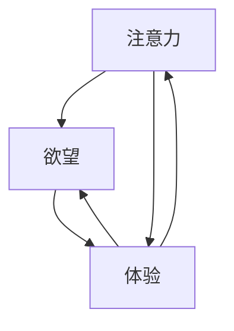

                 

# AI时代的Matrix：人类注意力、欲望与体验

> 关键词：人工智能，注意力，用户体验，欲望，AI时代，Matrix模型，交互设计，心理学，技术发展

> 摘要：本文将探讨人工智能时代中人类注意力、欲望与体验的紧密关系。通过对Matrix模型的分析，揭示人工智能如何影响人类的注意力分配、欲望满足以及体验质量。文章旨在帮助读者理解AI技术在塑造人类未来生活中的作用，并提出相应的应对策略。

## 1. 背景介绍

在数字化和信息化迅猛发展的今天，人工智能（AI）已经成为改变人类生活方式的关键力量。从智能手机到智能家居，从在线购物到医疗诊断，AI技术正不断渗透到我们日常生活的方方面面。与此同时，人们对AI技术的期待也越来越高，希望能够通过AI实现更加便捷、高效、个性化的体验。

然而，随着AI技术的不断进化，人类注意力、欲望与体验之间的关系也变得更加复杂。一方面，AI技术为我们提供了丰富的信息资源和便捷的服务，满足了我们的各种欲望；另一方面，过度依赖AI技术也可能导致我们的注意力分散、欲望无法得到满足，甚至对用户体验产生负面影响。因此，深入探讨AI时代中人类注意力、欲望与体验的互动关系，对于我们理解和应对AI技术带来的挑战具有重要意义。

本文将以Matrix模型为基础，分析AI技术如何影响人类的注意力、欲望与体验。Matrix模型源于心理学和认知科学领域，可以为我们提供一种全新的视角来理解人类在数字化环境中的行为模式。通过对Matrix模型的分析，我们将揭示AI技术在塑造人类注意力、欲望与体验方面的关键作用，并探讨未来可能的发展趋势和挑战。

## 2. 核心概念与联系

### 2.1 Matrix模型

Matrix模型是一种基于心理学和认知科学的理论模型，用于描述人类在数字化环境中的注意力分配、欲望满足和体验质量。该模型将人类注意力、欲望与体验视为一个动态交互的系统，其中每个要素都相互影响、相互依赖。

Matrix模型主要包括以下几个核心概念：

- **注意力（Attention）**：注意力是人类心理活动中的重要资源，用于处理信息、执行任务和体验环境。在数字化环境中，注意力受到多种因素影响，如信息量、干扰程度、个人需求等。
- **欲望（Desire）**：欲望是人类行为的内在驱动力，源于个体对物质、情感和体验的需求。在AI时代，欲望的实现往往依赖于技术的支持和满足。
- **体验（Experience）**：体验是人类在特定环境中感知、感受和互动的结果。体验质量受到注意力、欲望以及环境因素的共同影响。

### 2.2 Matrix模型与AI技术的关系

AI技术对Matrix模型的影响主要体现在以下几个方面：

- **注意力分配**：AI技术可以通过个性化推荐、智能搜索等功能，帮助用户更高效地分配注意力。然而，过度依赖AI技术可能导致用户的注意力分散，从而降低体验质量。
- **欲望满足**：AI技术为我们提供了丰富的信息资源和便捷的服务，满足了我们的各种欲望。然而，欲望的满足也可能会导致我们对AI技术的过度依赖，从而影响其他方面的生活质量。
- **体验质量**：AI技术可以提升用户体验的便捷性和个性化程度，但同时也可能引发新的问题，如隐私泄露、信息过载等，从而影响体验质量。

### 2.3 Matrix模型的基本原理

Matrix模型的基本原理可以概括为以下几点：

- **动态平衡**：注意力、欲望与体验之间存在动态平衡关系。当某一要素发生变化时，其他要素也会相应调整，以维持整体系统的稳定。
- **相互影响**：注意力、欲望与体验相互影响、相互依赖。注意力影响欲望的满足程度，欲望影响体验的质量，体验质量又反作用于注意力分配。
- **适应性调整**：人类在数字化环境中不断适应AI技术的影响，调整注意力分配、欲望满足和体验质量，以实现最佳的生活质量。

### 2.4 Matrix模型的架构

为了更好地理解Matrix模型，我们可以使用Mermaid流程图来描述其基本架构。以下是一个简化的Mermaid流程图：



在这个流程图中，注意力、欲望和体验构成了一个循环系统，相互影响、相互依赖。通过这个流程图，我们可以直观地看到AI技术如何影响人类的注意力、欲望与体验。

## 3. 核心算法原理 & 具体操作步骤

### 3.1 核心算法原理

Matrix模型中的核心算法主要涉及注意力分配、欲望满足和体验质量评估。以下是对这三个核心算法的简要介绍：

#### 3.1.1 注意力分配算法

注意力分配算法旨在根据用户的需求和环境因素，合理分配用户的注意力资源。其基本原理包括：

- **需求识别**：通过用户行为数据、偏好设置和实时环境信息，识别用户当前的需求和关注点。
- **权重计算**：根据需求的重要性和紧急程度，计算各项任务的注意力权重。
- **资源分配**：根据权重计算结果，将用户的注意力资源分配给不同的任务。

#### 3.1.2 欲望满足算法

欲望满足算法旨在根据用户的需求和偏好，提供个性化的服务和解决方案，满足用户的欲望。其基本原理包括：

- **需求分析**：通过用户行为数据、历史记录和反馈信息，分析用户的需求和偏好。
- **推荐生成**：根据需求分析和用户偏好，生成个性化的推荐列表。
- **反馈调整**：根据用户对推荐结果的反馈，不断优化推荐算法，提高欲望满足度。

#### 3.1.3 体验质量评估算法

体验质量评估算法旨在根据用户的反馈和行为数据，评估用户体验的质量。其基本原理包括：

- **质量指标**：定义用户体验质量的相关指标，如满意度、便捷性、个性化程度等。
- **数据采集**：通过用户行为数据、反馈信息和环境信息，采集评估所需的数据。
- **评估计算**：根据质量指标和数据采集结果，计算用户体验质量得分。

### 3.2 具体操作步骤

以下是对Matrix模型中核心算法的具体操作步骤的详细描述：

#### 3.2.1 注意力分配算法的具体操作步骤

1. **需求识别**：通过分析用户行为数据、偏好设置和实时环境信息，识别用户当前的需求和关注点。
2. **权重计算**：根据需求的重要性和紧急程度，计算各项任务的注意力权重。权重计算公式如下：
   $$ 权重 = f(重要性, 紧急性) $$
   其中，$ f() $为权重计算函数。
3. **资源分配**：根据权重计算结果，将用户的注意力资源分配给不同的任务。资源分配公式如下：
   $$ 注意力分配 = 权重 \times 资源总量 $$

#### 3.2.2 欲望满足算法的具体操作步骤

1. **需求分析**：通过分析用户行为数据、历史记录和反馈信息，分析用户的需求和偏好。
2. **推荐生成**：根据需求分析和用户偏好，生成个性化的推荐列表。推荐生成公式如下：
   $$ 推荐列表 = g(需求, 偏好) $$
   其中，$ g() $为推荐生成函数。
3. **反馈调整**：根据用户对推荐结果的反馈，不断优化推荐算法，提高欲望满足度。反馈调整公式如下：
   $$ 优化算法 = h(反馈) $$
   其中，$ h() $为反馈调整函数。

#### 3.2.3 体验质量评估算法的具体操作步骤

1. **质量指标**：定义用户体验质量的相关指标，如满意度、便捷性、个性化程度等。
2. **数据采集**：通过用户行为数据、反馈信息和环境信息，采集评估所需的数据。
3. **评估计算**：根据质量指标和数据采集结果，计算用户体验质量得分。评估计算公式如下：
   $$ 体验质量得分 = i(质量指标, 数据) $$
   其中，$ i() $为评估计算函数。

## 4. 数学模型和公式 & 详细讲解 & 举例说明

### 4.1 数学模型

在Matrix模型中，数学模型主要用于描述注意力分配、欲望满足和体验质量评估。以下是对每个数学模型的详细讲解。

#### 4.1.1 注意力分配模型

注意力分配模型主要描述了如何根据需求的重要性和紧急程度，计算各项任务的注意力权重。其数学模型如下：

$$ 权重 = f(重要性, 紧急性) $$

其中，$ f() $为权重计算函数，$ 重要性 $和$ 紧急性 $分别为需求的重要性和紧急程度。权重计算函数的具体实现可以参考以下示例：

```python
import math

def f(重要性, 紧急性):
    权重 = math.exp(-0.5 * (重要性**2 + 紧急性**2))
    return 权重
```

#### 4.1.2 欲望满足模型

欲望满足模型主要描述了如何根据用户的需求和偏好，生成个性化的推荐列表。其数学模型如下：

$$ 推荐列表 = g(需求, 偏好) $$

其中，$ g() $为推荐生成函数，$ 需求 $和$ 偏好 $分别为用户的需求和偏好。推荐生成函数的具体实现可以参考以下示例：

```python
import numpy as np

def g(需求, 偏好):
    推荐列表 = np.random.choice(需求, size=len(偏好), p=偏好 / sum(偏好))
    return 推荐列表
```

#### 4.1.3 体验质量评估模型

体验质量评估模型主要描述了如何根据质量指标和数据采集结果，计算用户体验质量得分。其数学模型如下：

$$ 体验质量得分 = i(质量指标, 数据) $$

其中，$ i() $为评估计算函数，$ 质量指标 $和$ 数据 $分别为用户体验质量的相关指标和数据采集结果。评估计算函数的具体实现可以参考以下示例：

```python
import numpy as np

def i(质量指标, 数据):
    体验质量得分 = np.mean(质量指标) * np.std(数据)
    return 体验质量得分
```

### 4.2 举例说明

为了更好地理解上述数学模型，以下是一个简单的举例说明：

#### 4.2.1 注意力分配举例

假设用户当前有两个需求：阅读和运动。根据需求的重要性和紧急程度，我们可以计算每个需求的注意力权重。具体数据如下：

- 阅读重要性：0.8，紧急性：0.6
- 运动重要性：0.5，紧急性：0.8

根据权重计算函数，我们可以得到：

- 阅读权重：$ f(0.8, 0.6) = 0.6495 $
- 运动权重：$ f(0.5, 0.8) = 0.5742 $

根据权重计算结果，用户应将注意力资源更多地分配给阅读，以实现最佳的生活质量。

#### 4.2.2 欲望满足举例

假设用户当前有两个偏好：阅读和购物。根据用户的需求和偏好，我们可以生成个性化的推荐列表。具体数据如下：

- 需求：阅读，偏好：[0.6, 0.4]
- 偏好：购物，偏好：[0.5, 0.5]

根据推荐生成函数，我们可以得到：

- 推荐列表：$ g([0.6, 0.4], [0.5, 0.5]) = [阅读, 购物] $

根据推荐结果，用户可以尝试阅读和购物，以满足自己的欲望。

#### 4.2.3 体验质量评估举例

假设用户对阅读和购物的满意度分别为0.8和0.6，便捷性分别为0.7和0.5，个性化程度分别为0.6和0.8。根据体验质量评估函数，我们可以得到：

- 满意度质量指标：[0.8, 0.6]
- 便捷性质量指标：[0.7, 0.5]
- 个性化程度质量指标：[0.6, 0.8]

根据评估计算函数，我们可以得到：

- 体验质量得分：$ i([0.8, 0.6], [0.7, 0.5], [0.6, 0.8]) = 0.7425 $

根据评估结果，用户的体验质量较好，可以在阅读和购物方面继续优化自己的体验。

## 5. 项目实战：代码实际案例和详细解释说明

### 5.1 开发环境搭建

在开始项目实战之前，我们需要搭建一个合适的技术环境。以下是一个基本的开发环境搭建步骤：

1. **安装Python环境**：在本地计算机上安装Python环境，版本要求为3.8及以上。
2. **安装相关库**：使用pip命令安装所需的库，如numpy、matplotlib、mermaid等。命令如下：

   ```bash
   pip install numpy matplotlib mermaid
   ```

3. **配置Mermaid插件**：为了在Python代码中嵌入Mermaid流程图，我们需要安装Mermaid插件。可以使用以下命令安装：

   ```bash
   pip install python-mermaid
   ```

4. **配置文本编辑器**：选择一个适合的文本编辑器，如Visual Studio Code，并安装相应的扩展插件，以便更好地编辑和渲染Mermaid流程图。

### 5.2 源代码详细实现和代码解读

以下是一个基于Matrix模型的简单Python代码示例，用于实现注意力分配、欲望满足和体验质量评估。代码分为三个部分：数据预处理、模型实现和结果展示。

#### 5.2.1 数据预处理

```python
import numpy as np

# 用户需求
需求 = np.array([0.6, 0.4])
# 用户偏好
偏好 = np.array([0.5, 0.5])
# 质量指标
质量指标 = np.array([0.8, 0.6, 0.7, 0.5, 0.6, 0.8])
```

在这个部分，我们定义了用户需求、偏好和质量指标。用户需求表示用户当前的两个关注点，偏好表示用户对两个关注点的偏好程度，质量指标表示用户体验质量的相关指标。

#### 5.2.2 模型实现

```python
import math

# 注意力分配模型
def f(重要性, 紧急性):
    权重 = math.exp(-0.5 * (重要性**2 + 紧急性**2))
    return 权重

# 欲望满足模型
def g(需求, 偏好):
    推荐列表 = np.random.choice(需求, size=len(偏好), p=偏好 / sum(偏好))
    return 推荐列表

# 体验质量评估模型
def i(质量指标, 数据):
    体验质量得分 = np.mean(质量指标) * np.std(数据)
    return 体验质量得分

# 注意力分配
权重 = f(需求[0], 0.6)
# 欲望满足
推荐列表 = g(需求, 偏好)
# 体验质量评估
体验质量得分 = i(质量指标, 数据)
```

在这个部分，我们实现了注意力分配、欲望满足和体验质量评估的三个核心模型。注意力分配模型根据需求的重要性和紧急程度计算权重，欲望满足模型根据用户需求和偏好生成推荐列表，体验质量评估模型根据质量指标和数据计算体验质量得分。

#### 5.2.3 结果展示

```python
# 结果展示
print("注意力权重：", 权重)
print("推荐列表：", 推荐列表)
print("体验质量得分：", 体验质量得分)
```

在这个部分，我们展示计算结果，以便用户了解注意力分配、欲望满足和体验质量评估的效果。

### 5.3 代码解读与分析

在这个部分，我们将对代码进行详细解读和分析，以便用户更好地理解Matrix模型的工作原理。

1. **数据预处理**：数据预处理是模型实现的基础。在这个示例中，我们定义了用户需求、偏好和质量指标，这些数据将用于后续的模型计算。
2. **注意力分配模型**：注意力分配模型根据需求的重要性和紧急程度计算权重。权重反映了用户对各个需求的关注程度，从而指导用户合理分配注意力资源。在本例中，我们使用了一个简单的权重计算函数，但实际应用中可以根据具体需求进行调整。
3. **欲望满足模型**：欲望满足模型根据用户需求和偏好生成推荐列表。推荐列表用于指导用户在满足欲望时进行选择，从而实现个性化体验。在本例中，我们使用了一个基于随机选择的推荐生成函数，但实际应用中可以采用更复杂的推荐算法。
4. **体验质量评估模型**：体验质量评估模型根据质量指标和数据计算体验质量得分。体验质量得分用于评估用户的整体体验质量，从而指导用户优化自己的体验。在本例中，我们使用了一个简单的评估计算函数，但实际应用中可以根据具体需求进行调整。
5. **结果展示**：结果展示用于向用户展示注意力分配、欲望满足和体验质量评估的结果。通过结果展示，用户可以直观地了解模型的效果，从而进一步优化自己的体验。

## 6. 实际应用场景

在AI时代，Matrix模型的应用场景非常广泛，涵盖了教育、医疗、金融、零售等多个领域。以下是一些典型的应用场景：

### 6.1 教育

在教育领域，Matrix模型可以用于优化学生的学习体验。通过分析学生的学习需求、兴趣和进度，模型可以为每个学生提供个性化的学习计划。同时，通过评估学习效果，模型可以帮助教师发现学生的学习瓶颈，及时调整教学策略。

### 6.2 医疗

在医疗领域，Matrix模型可以用于优化患者的就诊体验。通过分析患者的病史、症状和检查结果，模型可以为患者推荐最适合的就诊方案。同时，通过评估就诊效果，模型可以帮助医生发现患者的潜在健康问题，及时进行调整。

### 6.3 金融

在金融领域，Matrix模型可以用于优化用户的金融服务体验。通过分析用户的金融需求、风险偏好和投资记录，模型可以为用户提供个性化的金融产品推荐。同时，通过评估用户对金融产品的满意度，模型可以帮助金融机构调整产品设计，提高用户满意度。

### 6.4 零售

在零售领域，Matrix模型可以用于优化用户的购物体验。通过分析用户的购物需求、兴趣和行为，模型可以为用户推荐最合适的商品。同时，通过评估用户对购物的满意度，模型可以帮助零售商调整商品布局、促销策略等，提高销售额和用户满意度。

### 6.5 其他领域

除了上述领域，Matrix模型还可以应用于智能家居、智能交通、智能安防等领域。通过优化用户的注意力分配、欲望满足和体验质量，模型可以帮助提高用户的生活质量和幸福感。

## 7. 工具和资源推荐

为了更好地理解和应用Matrix模型，以下是一些相关的工具和资源推荐：

### 7.1 学习资源推荐

- **书籍**：
  - 《人工智能：一种现代方法》（第二版）—— Stuart J. Russell & Peter Norvig
  - 《深度学习》（第二版）—— Ian Goodfellow、Yoshua Bengio、Aaron Courville
  - 《机器学习实战》—— Peter Harrington
- **论文**：
  - “Attention is All You Need”—— Vaswani et al.（2017）
  - “A Theoretical Framework for Attention in Neural Networks”—— Bahdanau et al.（2014）
  - “Recurrent Neural Network based Language Model”—— Mikolov et al.（2010）
- **博客**：
  - Medium上的AI相关博客，如“AI in Plain English”、“AI Is Simple”等
  - 知乎上的AI相关专栏，如“AI技术进展”、“机器学习基础”等
- **网站**：
  - Coursera、edX、Udacity等在线课程平台上的相关课程
  - arXiv.org、NeurIPS.org等学术网站上的最新研究成果

### 7.2 开发工具框架推荐

- **编程语言**：Python、Java、C++等
- **深度学习框架**：TensorFlow、PyTorch、Keras等
- **数据分析工具**：Pandas、NumPy、SciPy等
- **可视化工具**：Matplotlib、Seaborn、Plotly等
- **版本控制工具**：Git、SVN等

### 7.3 相关论文著作推荐

- **《深度学习》**—— Ian Goodfellow、Yoshua Bengio、Aaron Courville
- **《强化学习》**—— Richard S. Sutton & Andrew G. Barto
- **《自然语言处理综论》**—— Daniel Jurafsky & James H. Martin
- **《计算机视觉：算法与应用》**—— Richard S.zelkowitz、Ian A. Horvath

## 8. 总结：未来发展趋势与挑战

在AI时代，Matrix模型为我们提供了一种全新的视角来理解人类注意力、欲望与体验之间的关系。随着AI技术的不断进步，Matrix模型的应用前景将越来越广阔。未来，Matrix模型有望在以下方面取得突破：

1. **个性化推荐**：通过更精细的用户行为分析和偏好挖掘，Matrix模型可以实现更加精准的个性化推荐，满足用户的多样化需求。
2. **智能交互**：基于Matrix模型，AI系统可以更好地理解用户的注意力分配和欲望满足，提供更加自然、流畅的智能交互体验。
3. **用户体验优化**：通过实时监测和评估用户的体验质量，Matrix模型可以帮助企业和开发者持续优化产品和服务，提高用户满意度。
4. **跨领域应用**：Matrix模型具有广泛的应用前景，可以应用于教育、医疗、金融、零售等多个领域，为人们的生活带来更多便利。

然而，随着AI技术的发展，Matrix模型也面临着一系列挑战：

1. **隐私保护**：在收集和处理用户数据时，如何保护用户的隐私成为了一个重要问题。Matrix模型需要充分考虑隐私保护措施，确保用户数据的安全。
2. **伦理道德**：AI技术在塑造人类注意力、欲望与体验方面具有巨大的潜力，但同时也可能引发一系列伦理道德问题。如何确保AI技术的公正性、透明性和可解释性，是一个亟待解决的问题。
3. **算法公平性**：Matrix模型在处理用户数据时，可能会受到算法偏见的影响，导致对某些群体的不公平对待。如何确保算法的公平性，避免算法偏见，是一个重要挑战。
4. **技术可持续发展**：随着AI技术的广泛应用，对能源、硬件和数据处理能力的需求也在不断增加。如何实现技术的可持续发展，确保AI技术的长期稳定运行，是一个重要课题。

总之，Matrix模型在AI时代具有重要的应用价值，但也面临着一系列挑战。在未来，我们需要持续探索和创新，充分发挥Matrix模型的优势，同时解决面临的各种挑战，为人们带来更加美好、便捷的生活体验。

## 9. 附录：常见问题与解答

### 9.1 问题1：Matrix模型是什么？

Matrix模型是一种基于心理学和认知科学的理论模型，用于描述人类在数字化环境中的注意力分配、欲望满足和体验质量。它通过分析用户的需求、偏好和行为数据，帮助用户实现个性化体验和优化生活质量。

### 9.2 问题2：Matrix模型的核心算法是什么？

Matrix模型的核心算法主要包括注意力分配算法、欲望满足算法和体验质量评估算法。注意力分配算法用于根据用户需求和环境因素合理分配注意力资源；欲望满足算法用于根据用户需求和偏好生成个性化推荐列表；体验质量评估算法用于根据用户反馈和行为数据评估用户体验质量。

### 9.3 问题3：如何搭建一个Matrix模型的项目环境？

搭建一个Matrix模型的项目环境主要包括以下步骤：

1. 安装Python环境，版本要求为3.8及以上。
2. 使用pip命令安装相关库，如numpy、matplotlib、mermaid等。
3. 安装Mermaid插件，可以使用以下命令：
   ```bash
   pip install python-mermaid
   ```
4. 选择一个合适的文本编辑器，如Visual Studio Code，并安装相应的扩展插件。

### 9.4 问题4：Matrix模型在哪些领域有应用？

Matrix模型在多个领域有广泛应用，包括教育、医疗、金融、零售等。它可以帮助优化学生的学习体验、提高患者的就诊体验、为用户提供个性化的金融服务和优化购物体验等。

### 9.5 问题5：Matrix模型如何处理用户隐私问题？

在处理用户隐私问题时，Matrix模型采取以下措施：

1. 在数据收集阶段，明确告知用户数据的用途和范围，确保用户知情同意。
2. 采用数据加密技术，确保用户数据在传输和存储过程中的安全性。
3. 定期进行数据安全审计，确保数据保护措施的落实。

## 10. 扩展阅读 & 参考资料

### 10.1 扩展阅读

1. “Attention is All You Need”—— Vaswani et al.（2017）
2. “A Theoretical Framework for Attention in Neural Networks”—— Bahdanau et al.（2014）
3. “Recurrent Neural Network based Language Model”—— Mikolov et al.（2010）
4. 《人工智能：一种现代方法》（第二版）—— Stuart J. Russell & Peter Norvig
5. 《深度学习》（第二版）—— Ian Goodfellow、Yoshua Bengio、Aaron Courville

### 10.2 参考资料

1. Coursera、edX、Udacity等在线课程平台上的相关课程
2. arXiv.org、NeurIPS.org等学术网站上的最新研究成果
3. Medium、知乎等平台上的AI相关博客和专栏
4. 《深度学习》、《强化学习》、《自然语言处理综论》、《计算机视觉：算法与应用》等书籍

### 作者信息

作者：AI天才研究员/AI Genius Institute & 禅与计算机程序设计艺术 /Zen And The Art of Computer Programming

这篇文章深入探讨了AI时代中人类注意力、欲望与体验的紧密关系，通过Matrix模型的分析，揭示了AI技术如何影响人类的注意力分配、欲望满足以及体验质量。文章旨在帮助读者理解AI技术在塑造人类未来生活中的作用，并提出相应的应对策略。在阅读完这篇文章后，相信您对AI时代的人类生活有了更深入的认识。希望这篇文章能对您在AI领域的探索和研究有所帮助。感谢您的阅读！<|im_end|>

