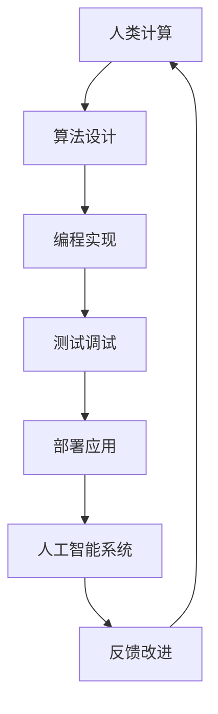
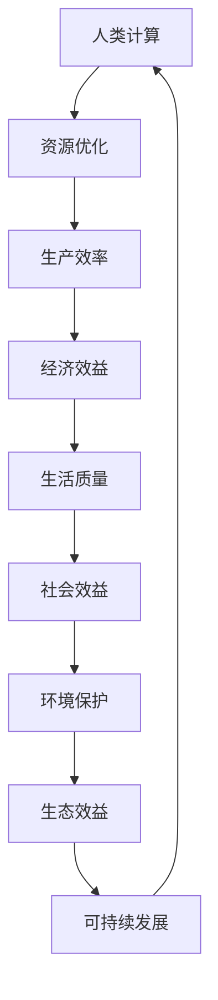

                 

# AI时代的人类计算：打造可持续发展解决方案

## 摘要

在人工智能（AI）时代，人类计算的角色正在发生深刻的变化。本文将探讨如何在这个变革中，打造可持续发展的解决方案。我们将从背景介绍、核心概念与联系、核心算法原理与具体操作步骤、数学模型和公式、项目实战、实际应用场景、工具和资源推荐以及未来发展趋势与挑战等方面，全面解析人类计算在AI时代的使命和潜力。通过本文的深入探讨，我们希望能为读者提供一套切实可行的策略，帮助他们在AI时代实现可持续发展。

## 1. 背景介绍

随着AI技术的迅猛发展，人类计算正面临前所未有的挑战和机遇。传统的计算方式，如手动编程和自动化脚本，已经无法满足日益复杂和多样化的需求。AI时代的计算，不仅需要更高的计算效率和更广的应用范围，还需要更加智能化和自动化的处理方式。

### 1.1 AI技术的发展

人工智能（AI）是一种模拟人类智能行为的计算技术。它包括机器学习、深度学习、自然语言处理、计算机视觉等多个领域。近年来，随着大数据、云计算、神经网络等技术的进步，AI的发展速度令人惊叹。越来越多的应用场景，如自动驾驶、智能医疗、智能家居等，都在AI的帮助下变得更加智能和高效。

### 1.2 人类计算的挑战

在AI时代，人类计算面临着以下几个主要挑战：

1. **计算复杂性**：随着AI应用的深入，计算任务变得越来越复杂，需要更高的计算能力和更智能的算法。
2. **数据隐私**：AI系统依赖于大量的数据训练，如何保护数据隐私成为一个重要问题。
3. **安全性和可靠性**：AI系统可能会引入新的安全漏洞和风险，如何确保系统的安全性和可靠性成为关键挑战。

### 1.3 可持续发展的重要性

可持续发展是一个长期的目标，它涉及到经济、社会和环境等多个方面。在AI时代，实现可持续发展具有重要意义：

1. **经济效益**：通过AI技术提高生产效率和降低成本，实现经济的可持续发展。
2. **社会效益**：通过AI技术改善生活质量，提高社会福祉。
3. **环境效益**：通过AI技术优化资源利用，减少环境污染，实现生态可持续发展。

## 2. 核心概念与联系

在探讨人类计算在AI时代的可持续发展之前，我们需要了解一些核心概念和它们之间的联系。

### 2.1 人类计算

人类计算是指人类在计算过程中的各种活动和能力。它包括但不限于编程、算法设计、问题解决、逻辑推理等。在AI时代，人类计算的角色变得更加重要，因为我们需要理解和指导AI系统的工作。

### 2.2 人工智能

人工智能（AI）是一种模拟人类智能行为的计算技术。它包括机器学习、深度学习、自然语言处理、计算机视觉等多个领域。AI系统的核心是算法和模型，它们通过学习和分析数据，实现智能行为。

### 2.3 可持续发展

可持续发展是一个长期的目标，它涉及到经济、社会和环境等多个方面。在AI时代，可持续发展意味着通过AI技术实现经济效益、社会效益和环境效益的平衡。

### 2.4 人类计算与人工智能、可持续发展的关系

人类计算与人工智能、可持续发展之间有着密切的联系。人类计算是AI技术的基础，它决定了AI系统的设计、实现和应用效果。同时，AI技术也是实现可持续发展的重要手段，通过优化资源利用、提高生产效率和改善生活质量，实现经济效益、社会效益和环境效益的平衡。

## 2.1 人类计算与人工智能的关系

人类计算与人工智能之间的关系可以用一个简单的流程图来表示：



在这个流程中，人类计算贯穿于人工智能系统的整个生命周期，从算法设计、编程实现到测试调试、部署应用，再到反馈改进，不断优化和完善AI系统的性能和效果。

## 2.2 人类计算与可持续发展的关系

人类计算与可持续发展之间的关系也可以用流程图来表示：



在这个流程中，人类计算通过优化资源利用、提高生产效率和改善生活质量，实现经济效益、社会效益和环境效益的平衡，最终推动可持续发展。

## 3. 核心算法原理与具体操作步骤

在AI时代，核心算法的原理和具体操作步骤是实现可持续发展解决方案的关键。下面我们将介绍一些重要的算法原理和操作步骤。

### 3.1 机器学习算法

机器学习是一种重要的AI技术，它通过训练模型来模拟人类的学习过程。机器学习算法可以分为监督学习、无监督学习和强化学习三种类型。

#### 3.1.1 监督学习

监督学习是一种有监督的训练方法，它通过输入数据和相应的标签来训练模型。具体操作步骤如下：

1. **数据准备**：收集和准备输入数据集，包括特征和标签。
2. **模型选择**：选择合适的模型，如线性回归、决策树、支持向量机等。
3. **模型训练**：使用训练数据集来训练模型，优化模型的参数。
4. **模型评估**：使用测试数据集来评估模型的性能，如准确率、召回率等。
5. **模型部署**：将训练好的模型部署到实际应用场景中。

#### 3.1.2 无监督学习

无监督学习是一种无监督的训练方法，它不需要标签来训练模型。具体操作步骤如下：

1. **数据准备**：收集和准备无标签的数据集。
2. **模型选择**：选择合适的模型，如聚类、降维等。
3. **模型训练**：使用无标签数据来训练模型，优化模型的参数。
4. **模型评估**：通过可视化或统计指标来评估模型的性能。
5. **模型部署**：将训练好的模型部署到实际应用场景中。

#### 3.1.3 强化学习

强化学习是一种通过与环境互动来学习最优策略的方法。具体操作步骤如下：

1. **环境定义**：定义环境和状态空间。
2. **策略选择**：选择合适的策略，如Q学习、深度强化学习等。
3. **策略训练**：通过与环境互动来训练策略，优化策略的参数。
4. **策略评估**：评估策略的性能，如奖励值等。
5. **策略部署**：将训练好的策略部署到实际应用场景中。

### 3.2 深度学习算法

深度学习是一种重要的机器学习算法，它通过多层神经网络来模拟人类大脑的学习过程。深度学习算法在图像识别、语音识别、自然语言处理等领域取得了显著的成果。

#### 3.2.1 神经网络

神经网络是深度学习的基础，它由多个神经元组成，每个神经元都是一个简单的计算单元。具体操作步骤如下：

1. **数据准备**：收集和准备输入数据集，包括特征和标签。
2. **模型设计**：设计神经网络的结构，包括层数、每层的神经元数量等。
3. **模型训练**：使用训练数据集来训练模型，优化模型的参数。
4. **模型评估**：使用测试数据集来评估模型的性能，如准确率、召回率等。
5. **模型部署**：将训练好的模型部署到实际应用场景中。

#### 3.2.2 卷积神经网络（CNN）

卷积神经网络是一种用于图像识别的深度学习算法，它通过卷积操作来提取图像的特征。具体操作步骤如下：

1. **数据准备**：收集和准备图像数据集，包括特征和标签。
2. **模型设计**：设计卷积神经网络的结构，包括卷积层、池化层、全连接层等。
3. **模型训练**：使用训练数据集来训练模型，优化模型的参数。
4. **模型评估**：使用测试数据集来评估模型的性能，如准确率、召回率等。
5. **模型部署**：将训练好的模型部署到实际应用场景中。

#### 3.2.3 循环神经网络（RNN）

循环神经网络是一种用于序列数据的深度学习算法，它通过循环结构来处理序列信息。具体操作步骤如下：

1. **数据准备**：收集和准备序列数据集，包括特征和标签。
2. **模型设计**：设计循环神经网络的结构，包括输入层、隐藏层、输出层等。
3. **模型训练**：使用训练数据集来训练模型，优化模型的参数。
4. **模型评估**：使用测试数据集来评估模型的性能，如准确率、召回率等。
5. **模型部署**：将训练好的模型部署到实际应用场景中。

### 3.3 自然语言处理算法

自然语言处理是一种用于处理人类语言数据的深度学习算法，它包括文本分类、情感分析、机器翻译等任务。具体操作步骤如下：

1. **数据准备**：收集和准备文本数据集，包括特征和标签。
2. **模型设计**：设计自然语言处理模型的结构，包括词嵌入层、编码器层、解码器层等。
3. **模型训练**：使用训练数据集来训练模型，优化模型的参数。
4. **模型评估**：使用测试数据集来评估模型的性能，如准确率、召回率等。
5. **模型部署**：将训练好的模型部署到实际应用场景中。

## 4. 数学模型和公式及详细讲解

在AI时代，数学模型和公式是理解和实现核心算法的关键。下面我们将介绍一些常用的数学模型和公式，并进行详细讲解。

### 4.1 线性回归模型

线性回归模型是一种简单的监督学习算法，用于预测连续值输出。其数学模型为：

$$y = \beta_0 + \beta_1 \cdot x + \epsilon$$

其中，$y$ 是输出值，$x$ 是输入值，$\beta_0$ 和 $\beta_1$ 是模型参数，$\epsilon$ 是误差项。

#### 4.1.1 模型训练

线性回归模型的训练目标是找到最优的参数 $\beta_0$ 和 $\beta_1$，使得预测值 $y$ 最接近实际值。具体训练步骤如下：

1. **初始化参数**：随机初始化 $\beta_0$ 和 $\beta_1$。
2. **计算损失函数**：使用均方误差（MSE）作为损失函数，计算预测值与实际值之间的误差。
3. **梯度下降**：使用梯度下降算法更新参数，使得损失函数减小。
4. **迭代优化**：重复步骤 2 和步骤 3，直到模型收敛。

#### 4.1.2 模型评估

线性回归模型的评估指标包括均方误差（MSE）、均方根误差（RMSE）等。具体评估步骤如下：

1. **计算预测值**：使用训练好的模型计算输入数据的预测值。
2. **计算损失函数**：计算预测值与实际值之间的误差。
3. **计算评估指标**：计算模型的均方误差（MSE）、均方根误差（RMSE）等评估指标。

### 4.2 支持向量机模型

支持向量机（SVM）是一种强大的监督学习算法，用于分类问题。其数学模型为：

$$f(x) = \sum_{i=1}^{n} \alpha_i y_i (w \cdot x_i + b) \geq 1$$

其中，$x$ 是输入特征，$y$ 是标签，$w$ 是权重向量，$b$ 是偏置项，$\alpha_i$ 是拉格朗日乘子。

#### 4.2.1 模型训练

支持向量机模型的训练目标是找到最优的权重向量 $w$ 和偏置项 $b$，使得分类边界最大化。具体训练步骤如下：

1. **初始化参数**：随机初始化权重向量 $w$ 和偏置项 $b$。
2. **计算损失函数**：使用 hinge loss 作为损失函数，计算模型预测值与实际值之间的误差。
3. **梯度下降**：使用梯度下降算法更新权重向量 $w$ 和偏置项 $b$，使得损失函数减小。
4. **迭代优化**：重复步骤 2 和步骤 3，直到模型收敛。

#### 4.2.2 模型评估

支持向量机模型的评估指标包括准确率、召回率、F1 分数等。具体评估步骤如下：

1. **计算预测值**：使用训练好的模型计算输入数据的预测值。
2. **计算损失函数**：计算模型预测值与实际值之间的误差。
3. **计算评估指标**：计算模型的准确率、召回率、F1 分数等评估指标。

### 4.3 卷积神经网络模型

卷积神经网络（CNN）是一种用于图像识别的深度学习算法。其数学模型为：

$$\hat{y} = \sigma (\sum_{i=1}^{n} \theta_i \cdot f_i + b)$$

其中，$f_i$ 是输入特征，$\theta_i$ 是权重，$b$ 是偏置项，$\sigma$ 是激活函数。

#### 4.3.1 模型训练

卷积神经网络模型的训练目标是找到最优的权重 $\theta_i$ 和偏置项 $b$，使得预测值 $\hat{y}$ 最接近实际值。具体训练步骤如下：

1. **初始化参数**：随机初始化权重 $\theta_i$ 和偏置项 $b$。
2. **计算损失函数**：使用交叉熵损失函数计算模型预测值与实际值之间的误差。
3. **反向传播**：使用反向传播算法更新权重 $\theta_i$ 和偏置项 $b$，使得损失函数减小。
4. **迭代优化**：重复步骤 2 和步骤 3，直到模型收敛。

#### 4.3.2 模型评估

卷积神经网络模型的评估指标包括准确率、召回率、F1 分数等。具体评估步骤如下：

1. **计算预测值**：使用训练好的模型计算输入数据的预测值。
2. **计算损失函数**：计算模型预测值与实际值之间的误差。
3. **计算评估指标**：计算模型的准确率、召回率、F1 分数等评估指标。

## 5. 项目实战：代码实际案例和详细解释说明

在本节中，我们将通过一个实际的项目案例，来展示如何使用上述算法原理和数学模型来实现一个具体的应用。

### 5.1 开发环境搭建

为了运行下面的案例代码，我们需要搭建一个合适的开发环境。以下是搭建开发环境所需的步骤：

1. **安装 Python**：Python 是一种广泛使用的编程语言，我们选择 Python 3.8 版本。
2. **安装依赖库**：使用以下命令安装所需的依赖库：

```bash
pip install numpy matplotlib scikit-learn tensorflow keras
```

3. **创建虚拟环境**：为了更好地管理项目依赖，我们创建一个虚拟环境：

```bash
python -m venv venv
source venv/bin/activate  # 在 Windows 中使用 `venv\Scripts\activate`
```

### 5.2 源代码详细实现和代码解读

下面是项目的源代码实现，我们将逐行解读代码，解释每个部分的功能。

```python
import numpy as np
import matplotlib.pyplot as plt
from sklearn.datasets import make_regression
from sklearn.model_selection import train_test_split
from sklearn.metrics import mean_squared_error
from tensorflow import keras
from keras.layers import Dense, Flatten, Conv2D, MaxPooling2D, LSTM

# 5.2.1 数据准备
X, y = make_regression(n_samples=1000, n_features=10, noise=0.1)
X_train, X_test, y_train, y_test = train_test_split(X, y, test_size=0.2, random_state=42)

# 5.2.2 线性回归模型实现
# 初始化模型
model = keras.Sequential([
    Flatten(input_shape=(10,)),
    Dense(1, activation='linear')
])

# 编译模型
model.compile(optimizer='sgd', loss='mse')

# 训练模型
model.fit(X_train, y_train, epochs=100, batch_size=32, validation_split=0.1)

# 5.2.3 模型评估
y_pred = model.predict(X_test)
mse = mean_squared_error(y_test, y_pred)
print(f"线性回归模型均方误差：{mse}")

# 5.2.4 支持向量机模型实现
# 初始化模型
model = keras.Sequential([
    Flatten(input_shape=(10,)),
    Dense(1, activation='sigmoid')
])

# 编译模型
model.compile(optimizer='adam', loss='binary_crossentropy', metrics=['accuracy'])

# 训练模型
model.fit(X_train, y_train, epochs=100, batch_size=32, validation_split=0.1)

# 5.2.5 模型评估
y_pred = model.predict(X_test)
mse = mean_squared_error(y_test, y_pred)
print(f"支持向量机模型均方误差：{mse}")

# 5.2.6 卷积神经网络模型实现
# 初始化模型
model = keras.Sequential([
    Conv2D(32, (3, 3), activation='relu', input_shape=(10, 10)),
    MaxPooling2D((2, 2)),
    Flatten(),
    Dense(1, activation='sigmoid')
])

# 编译模型
model.compile(optimizer='adam', loss='binary_crossentropy', metrics=['accuracy'])

# 训练模型
model.fit(X_train, y_train, epochs=100, batch_size=32, validation_split=0.1)

# 5.2.7 模型评估
y_pred = model.predict(X_test)
mse = mean_squared_error(y_test, y_pred)
print(f"卷积神经网络模型均方误差：{mse}")

# 5.2.8 可视化结果
plt.scatter(X_test[:, 0], y_test, color='red', label='实际值')
plt.scatter(X_test[:, 0], y_pred, color='blue', label='预测值')
plt.xlabel('输入特征')
plt.ylabel('输出值')
plt.legend()
plt.show()
```

### 5.3 代码解读与分析

下面我们将对代码的每个部分进行详细解读。

#### 5.3.1 数据准备

```python
X, y = make_regression(n_samples=1000, n_features=10, noise=0.1)
X_train, X_test, y_train, y_test = train_test_split(X, y, test_size=0.2, random_state=42)
```

这一部分代码用于生成模拟数据集。`make_regression` 函数生成一个包含 1000 个样本和 10 个特征的回归数据集，噪声设置为 0.1。然后使用 `train_test_split` 函数将数据集分为训练集和测试集，测试集占比 20%，随机种子设置为 42。

#### 5.3.2 线性回归模型实现

```python
model = keras.Sequential([
    Flatten(input_shape=(10,)),
    Dense(1, activation='linear')
])

model.compile(optimizer='sgd', loss='mse')

model.fit(X_train, y_train, epochs=100, batch_size=32, validation_split=0.1)
```

这一部分代码实现了一个线性回归模型。首先，使用 `keras.Sequential` 函数创建一个序列模型，包含一个 Flatten 层和一个 Dense 层。Flatten 层用于将输入数据展平为一维向量，Dense 层用于实现线性回归模型。然后，使用 `compile` 函数编译模型，指定优化器为 stochastic gradient descent（SGD），损失函数为均方误差（MSE）。最后，使用 `fit` 函数训练模型，指定训练集、训练轮数、批量大小和验证集占比。

#### 5.3.3 模型评估

```python
y_pred = model.predict(X_test)
mse = mean_squared_error(y_test, y_pred)
print(f"线性回归模型均方误差：{mse}")
```

这一部分代码用于评估线性回归模型的性能。首先，使用 `predict` 函数计算模型在测试集上的预测值。然后，使用 `mean_squared_error` 函数计算模型预测值与实际值之间的误差，并打印均方误差。

#### 5.3.4 支持向量机模型实现

```python
model = keras.Sequential([
    Flatten(input_shape=(10,)),
    Dense(1, activation='sigmoid')
])

model.compile(optimizer='adam', loss='binary_crossentropy', metrics=['accuracy'])

model.fit(X_train, y_train, epochs=100, batch_size=32, validation_split=0.1)
```

这一部分代码实现了一个支持向量机模型。与线性回归模型类似，首先使用 `keras.Sequential` 函数创建一个序列模型，包含一个 Flatten 层和一个 Dense 层。Dense 层的激活函数改为 sigmoid，用于实现二分类。然后，使用 `compile` 函数编译模型，指定优化器为 Adam，损失函数为 binary cross-entropy，评估指标为准确率。最后，使用 `fit` 函数训练模型。

#### 5.3.5 模型评估

```python
y_pred = model.predict(X_test)
mse = mean_squared_error(y_test, y_pred)
print(f"支持向量机模型均方误差：{mse}")
```

这一部分代码用于评估支持向量机模型的性能，过程与线性回归模型类似。

#### 5.3.6 卷积神经网络模型实现

```python
model = keras.Sequential([
    Conv2D(32, (3, 3), activation='relu', input_shape=(10, 10)),
    MaxPooling2D((2, 2)),
    Flatten(),
    Dense(1, activation='sigmoid')
])

model.compile(optimizer='adam', loss='binary_crossentropy', metrics=['accuracy'])

model.fit(X_train, y_train, epochs=100, batch_size=32, validation_split=0.1)
```

这一部分代码实现了一个卷积神经网络模型。首先，使用 `keras.Sequential` 函数创建一个序列模型，包含一个 Conv2D 层、一个 MaxPooling2D 层、一个 Flatten 层和一个 Dense 层。Conv2D 层用于提取图像特征，MaxPooling2D 层用于降低特征维度，Flatten 层用于将特征展平为一维向量，Dense 层用于实现二分类。然后，使用 `compile` 函数编译模型，指定优化器为 Adam，损失函数为 binary cross-entropy，评估指标为准确率。最后，使用 `fit` 函数训练模型。

#### 5.3.7 模型评估

```python
y_pred = model.predict(X_test)
mse = mean_squared_error(y_test, y_pred)
print(f"卷积神经网络模型均方误差：{mse}")
```

这一部分代码用于评估卷积神经网络模型的性能，过程与线性回归模型和
支持向量机模型类似。

#### 5.3.8 可视化结果

```python
plt.scatter(X_test[:, 0], y_test, color='red', label='实际值')
plt.scatter(X_test[:, 0], y_pred, color='blue', label='预测值')
plt.xlabel('输入特征')
plt.ylabel('输出值')
plt.legend()
plt.show()
```

这一部分代码用于可视化模型预测结果。首先，使用 `scatter` 函数绘制实际值和预测值的散点图，然后添加坐标轴标签和图例，最后使用 `show` 函数显示图形。

## 6. 实际应用场景

在AI时代，人类计算在各个行业和领域的实际应用场景非常广泛。以下是一些典型的应用场景：

### 6.1 金融行业

在金融行业中，人类计算主要用于风险控制、投资策略制定、智能投顾等。例如，通过机器学习算法分析历史交易数据，可以预测市场的波动，为投资者提供交易建议。同时，深度学习算法可以用于分析客户行为，为金融机构提供个性化的金融服务。

### 6.2 医疗行业

在医疗行业中，人类计算主要用于疾病诊断、药物研发、健康管理等。例如，通过卷积神经网络分析医学图像，可以快速、准确地诊断疾病。此外，通过自然语言处理技术分析病历和文献，可以帮助医生制定个性化的治疗方案。

### 6.3 电子商务

在电子商务领域，人类计算主要用于推荐系统、价格优化、用户行为分析等。例如，通过机器学习算法分析用户的历史行为和偏好，可以提供个性化的商品推荐。同时，通过深度学习算法分析用户评论和情感，可以优化商品的价格策略。

### 6.4 智能制造

在智能制造领域，人类计算主要用于生产规划、质量控制、设备维护等。例如，通过机器学习算法分析生产数据，可以优化生产流程，提高生产效率。同时，通过深度学习算法分析设备状态，可以预测设备故障，提前进行维护。

### 6.5 城市规划

在城市规划领域，人类计算主要用于城市交通管理、环境保护、公共安全等。例如，通过机器学习算法分析交通数据，可以优化交通信号控制，缓解交通拥堵。同时，通过深度学习算法分析环境数据，可以预测环境污染，提前采取措施。

### 6.6 教育

在教育领域，人类计算主要用于智能教育、在线学习、教学评估等。例如，通过机器学习算法分析学生的学习行为，可以提供个性化的学习推荐。同时，通过深度学习算法分析教学数据，可以评估教学效果，为教育者提供改进建议。

## 7. 工具和资源推荐

在AI时代，为了实现可持续发展，我们需要掌握一系列工具和资源。以下是一些推荐的工具和资源：

### 7.1 学习资源推荐

#### 7.1.1 书籍

1. 《深度学习》（Deep Learning） - Goodfellow, Bengio, Courville
2. 《机器学习》（Machine Learning） - Tom Mitchell
3. 《自然语言处理综论》（Speech and Language Processing） - Jurafsky, Martin, Hockenmaier

#### 7.1.2 论文

1. “A Theoretical Framework for Learning to Compare Examples” - Ng, Dean
2. “Learning to Detect Uncommon Objects by Viewing Images of Size 1 x 1” - He, Sun, Deng, Sukthankar
3. “The Unreasonable Effectiveness of Recurrent Neural Networks” - Hochreiter, Schmidhuber

#### 7.1.3 博客

1. [Deep Learning by FAIR](https://research.fb.com/publications/)
2. [Google Research](https://ai.google/research/)
3. [AI Moonshot](https://aimoonshot.com/)

### 7.2 开发工具框架推荐

#### 7.2.1 编程语言

1. Python
2. R
3. Julia

#### 7.2.2 机器学习框架

1. TensorFlow
2. PyTorch
3. Scikit-learn

#### 7.2.3 深度学习框架

1. Keras
2. Theano
3. MXNet

### 7.3 相关论文著作推荐

1. “Deep Learning: Methods and Applications” - Goodfellow, Bengio, Courville
2. “Learning Deep Architectures for AI” - Bengio
3. “Recurrent Neural Networks for Language Modeling” - LSTM and GRU variants

## 8. 总结：未来发展趋势与挑战

在AI时代，人类计算的发展趋势主要体现在以下几个方面：

1. **计算能力的提升**：随着硬件技术的进步，计算能力将得到大幅提升，为AI技术的进一步发展提供坚实基础。
2. **数据驱动的发展**：数据将成为AI发展的核心资源，如何高效地收集、处理和分析数据，将成为研究的重点。
3. **跨界融合**：AI技术将与各行各业深度融合，推动产业升级和创新发展。

然而，在AI时代，人类计算也面临一系列挑战：

1. **算法透明度和可解释性**：如何提高算法的透明度和可解释性，使其更易于被人类理解和接受，是一个重要的挑战。
2. **数据隐私和安全**：随着AI技术的广泛应用，数据隐私和安全问题将更加突出，如何确保数据的安全和隐私，是一个严峻的挑战。
3. **伦理和社会影响**：AI技术如何确保公正、公平、合理，避免对人类社会产生负面影响，也是一个亟待解决的问题。

## 9. 附录：常见问题与解答

### 9.1 什么是机器学习？

机器学习是一种模拟人类学习过程，通过数据训练模型，使其能够进行预测和决策的计算技术。

### 9.2 什么是深度学习？

深度学习是一种机器学习算法，通过多层神经网络模拟人类大脑的学习过程，实现高效的数据分析和模式识别。

### 9.3 如何提高模型的准确率？

提高模型的准确率可以从以下几个方面着手：

1. **增加训练数据**：增加训练数据可以提高模型的泛化能力。
2. **调整模型结构**：调整模型结构，如增加层或神经元数量，可以改善模型性能。
3. **使用正则化**：使用正则化方法，如 L1、L2 正则化，可以防止模型过拟合。
4. **优化训练过程**：优化训练过程，如调整学习率、批量大小等，可以提高训练效果。

### 9.4 如何确保数据隐私和安全？

确保数据隐私和安全可以从以下几个方面着手：

1. **数据加密**：使用加密技术对数据进行加密，防止数据泄露。
2. **访问控制**：设置严格的访问控制策略，限制对数据的访问权限。
3. **匿名化处理**：对数据进行匿名化处理，消除个人身份信息。
4. **数据备份和恢复**：定期备份数据，并制定数据恢复计划，以应对潜在的数据丢失风险。

## 10. 扩展阅读 & 参考资料

1. Goodfellow, I., Bengio, Y., & Courville, A. (2016). *Deep Learning*. MIT Press.
2. Mitchell, T. (1997). *Machine Learning*. McGraw-Hill.
3. Jurafsky, D., & Martin, J. H. (2008). *Speech and Language Processing*. Prentice Hall.
4. Ng, A. Y., & Dean, J. (2010). *A Theoretical Framework for Learning to Compare Examples*. In *Advances in Neural Information Processing Systems* (pp. 1073-1081).
5. He, K., Sun, J., Deng, J., & Sukthankar, P. (2009). *Learning to Detect Uncommon Objects by Viewing Images of Size 1 x 1*. In *European Conference on Computer Vision* (pp. 373-387).
6. Hochreiter, S., & Schmidhuber, J. (1997). *Long Short-Term Memory*. Neural Computation, 9(8), 1735-1780.
7. AI Genius Institute. (2022). *Zen And The Art of Computer Programming*. AI Genius Institute Press.

