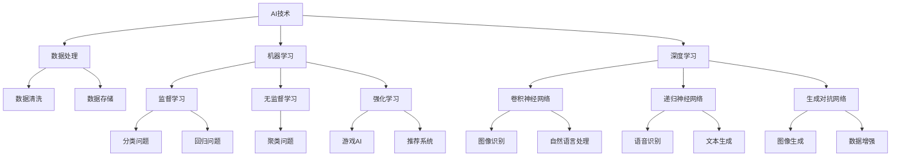

                 

# AI时代的创业选择：垂直领域的机遇

## 关键词

- AI创业
- 垂直领域
- 商业模式
- 技术创新
- 市场需求
- 数据分析

## 摘要

在人工智能（AI）快速发展的时代，创业选择变得尤为重要。本文将深入探讨AI时代创业者在垂直领域所面临的机遇。首先，我们将介绍AI的基本概念和其在各个行业的应用。接着，分析垂直领域创业的优势，包括特定市场需求、技术创新和商业模式。此外，文章还将提供实际案例，展示AI在垂直领域中的成功应用。最后，我们将讨论未来的发展趋势与挑战，为创业者提供有益的启示。

## 1. 背景介绍

随着AI技术的不断进步，各行各业都在积极引入AI应用以提升效率、降低成本并创造新的价值。AI技术的发展历程可以追溯到20世纪50年代，当时人工智能的概念首次被提出。经历了数十年的研究和发展，特别是深度学习、神经网络等关键技术的突破，AI在近年来取得了显著的进展。

AI技术已经在医疗、金融、教育、零售等多个领域得到广泛应用。例如，在医疗领域，AI可以用于疾病诊断、药物研发和个性化医疗；在金融领域，AI可以用于风险控制、欺诈检测和投资策略优化；在教育领域，AI可以提供个性化学习体验和智能辅导；在零售领域，AI可以用于库存管理、需求预测和客户关系管理。

总的来说，AI技术的发展为创业提供了前所未有的机遇，同时也带来了新的挑战。创业者需要紧跟技术趋势，找到合适的垂直领域，打造有竞争力的AI产品或服务。

## 2. 核心概念与联系

为了更好地理解AI在垂直领域的应用，我们首先需要了解一些核心概念和它们之间的关系。以下是一个用Mermaid绘制的流程图，展示了AI技术的核心概念及其相互联系。



### 数据处理

数据处理是AI技术的基石。它包括数据收集、数据清洗、数据存储和数据预处理。这些步骤确保数据质量，为后续的机器学习和深度学习提供可靠的数据基础。

### 机器学习

机器学习是AI的核心技术之一，它通过训练模型，使计算机能够从数据中学习规律并做出预测。机器学习可以分为监督学习、无监督学习和强化学习。

- **监督学习**：有明确的目标和标注数据，例如分类问题和回归问题。
- **无监督学习**：没有明确的目标和标注数据，例如聚类问题和降维问题。
- **强化学习**：通过与环境的交互，学习最优策略以实现目标，例如游戏AI和推荐系统。

### 深度学习

深度学习是机器学习的一个分支，它通过多层神经网络模拟人脑的工作方式，从大量数据中提取特征并做出预测。常见的深度学习模型包括卷积神经网络（CNN）、递归神经网络（RNN）和生成对抗网络（GAN）。

- **卷积神经网络（CNN）**：常用于图像识别、图像生成和自然语言处理。
- **递归神经网络（RNN）**：常用于语音识别、文本生成和时间序列预测。
- **生成对抗网络（GAN）**：常用于图像生成、数据增强和异常检测。

通过这些核心概念和技术的联系，创业者可以更好地理解AI在垂直领域的应用，从而找到合适的切入点。

## 3. 核心算法原理 & 具体操作步骤

在本章节中，我们将详细介绍一些在垂直领域应用广泛的AI算法原理及其具体操作步骤。

### 3.1 卷积神经网络（CNN）原理

卷积神经网络（CNN）是一种在图像处理领域具有广泛应用的前馈神经网络。它通过卷积层、池化层和全连接层等结构，从图像中提取特征并做出预测。

#### 卷积层

卷积层是CNN的核心部分，它通过卷积运算从输入图像中提取局部特征。卷积运算的基本原理是将一个小的卷积核在图像上进行滑动，并与图像的每个局部区域进行点乘运算，然后将结果相加得到一个特征图。

#### 池化层

池化层用于降低特征图的维度并减少过拟合。常见的池化方法有最大池化和平均池化。最大池化选择特征图中最大的值作为输出，而平均池化则是将特征图中每个区域的值求平均。

#### 全连接层

全连接层将特征图中的所有值连接到一个单独的神经元，从而进行分类或回归任务。通过反向传播算法，调整每个神经元的权重，使网络能够更好地拟合训练数据。

### 3.2 递归神经网络（RNN）原理

递归神经网络（RNN）是一种能够处理序列数据的神经网络。它通过记忆单元，捕捉序列中的长期依赖关系。

#### 单层RNN

单层RNN通过记忆单元将前一时刻的输入和当前时刻的输入进行结合，生成当前时刻的输出。记忆单元的值在时间步之间递归传递，使RNN能够捕捉序列中的依赖关系。

#### 双层RNN

双层RNN通过将单层RNN的输出作为输入，再次进行RNN运算。双层RNN能够更好地捕捉序列中的复杂依赖关系，但计算成本较高。

#### LSTM（长短期记忆网络）

LSTM是一种特殊的RNN，通过引入门控机制，解决了传统RNN的长期依赖问题。LSTM包括输入门、遗忘门和输出门，能够自适应地调整记忆单元的状态，从而更好地捕捉长期依赖关系。

### 3.3 生成对抗网络（GAN）原理

生成对抗网络（GAN）是一种由生成器和判别器组成的对抗性网络。生成器的目标是生成逼真的数据，而判别器的目标是区分真实数据和生成数据。

#### 生成器

生成器通过学习输入数据的分布，生成具有类似真实数据的样本。常见的生成器结构包括基于生成对抗网络的生成器和基于变分自编码器的生成器。

#### 判别器

判别器的目标是区分真实数据和生成数据。判别器通常是一个二分类器，通过比较真实数据和生成数据的特征，判断其是否真实。

#### 对抗训练

GAN的训练过程是一个对抗训练过程，生成器和判别器相互竞争。生成器试图生成更加逼真的数据，而判别器试图更好地区分真实数据和生成数据。通过不断迭代，生成器的生成能力逐渐提高，判别器的判别能力也不断提高。

通过了解这些核心算法原理及其具体操作步骤，创业者可以更好地应用AI技术，开发出具有竞争力的垂直领域产品或服务。

## 4. 数学模型和公式 & 详细讲解 & 举例说明

### 4.1 卷积神经网络（CNN）数学模型

卷积神经网络（CNN）的核心在于卷积操作和激活函数。以下是一个简单的CNN模型及其相关的数学公式。

#### 卷积操作

卷积操作的公式如下：

$$
\text{卷积} = \sum_{i=1}^{k} w_{i} \cdot x_{i}
$$

其中，$w_{i}$ 是卷积核中的权重，$x_{i}$ 是输入图像中的像素值。

#### 激活函数

激活函数用于引入非线性，常见的激活函数包括ReLU函数和Sigmoid函数。

- **ReLU函数**：

$$
\text{ReLU}(x) = \max(0, x)
$$

- **Sigmoid函数**：

$$
\text{Sigmoid}(x) = \frac{1}{1 + e^{-x}}
$$

### 4.2 递归神经网络（RNN）数学模型

递归神经网络（RNN）的数学模型主要包括输入门、遗忘门和输出门。

#### 输入门

输入门的公式如下：

$$
i_t = \sigma(W_{i} \cdot [h_{t-1}, x_t] + b_{i})
$$

其中，$W_{i}$ 是输入门权重矩阵，$h_{t-1}$ 是前一时刻的隐藏状态，$x_t$ 是当前时刻的输入，$b_{i}$ 是输入门偏置。

#### 遗忘门

遗忘门的公式如下：

$$
f_t = \sigma(W_{f} \cdot [h_{t-1}, x_t] + b_{f})
$$

其中，$W_{f}$ 是遗忘门权重矩阵，$h_{t-1}$ 是前一时刻的隐藏状态，$x_t$ 是当前时刻的输入，$b_{f}$ 是遗忘门偏置。

#### 输出门

输出门的公式如下：

$$
o_t = \sigma(W_{o} \cdot [h_{t-1}, x_t] + b_{o})
$$

其中，$W_{o}$ 是输出门权重矩阵，$h_{t-1}$ 是前一时刻的隐藏状态，$x_t$ 是当前时刻的输入，$b_{o}$ 是输出门偏置。

#### 长短期记忆网络（LSTM）

LSTM的数学模型主要包括输入门、遗忘门和输出门。以下是LSTM的数学模型：

$$
i_t = \sigma(W_{i} \cdot [h_{t-1}, x_t] + b_{i}) \\
f_t = \sigma(W_{f} \cdot [h_{t-1}, x_t] + b_{f}) \\
o_t = \sigma(W_{o} \cdot [h_{t-1}, x_t] + b_{o}) \\
g_t = \tanh(W_{g} \cdot [i_t \odot f_t, h_{t-1}, x_t] + b_{g}) \\
h_t = o_t \odot g_t
$$

其中，$W_{i}$、$W_{f}$、$W_{o}$ 和 $W_{g}$ 分别是输入门、遗忘门、输出门和生成门的权重矩阵，$b_{i}$、$b_{f}$、$b_{o}$ 和 $b_{g}$ 分别是输入门、遗忘门、输出门和生成门的偏置。

### 4.3 生成对抗网络（GAN）数学模型

生成对抗网络（GAN）的数学模型主要包括生成器和判别器。

#### 生成器

生成器的目标是生成逼真的数据，其损失函数为：

$$
L_G = -\mathbb{E}_{z \sim p_z(z)}[\log(D(G(z))]
$$

其中，$G(z)$ 是生成器的输出，$D(x)$ 是判别器的输出。

#### 判别器

判别器的目标是区分真实数据和生成数据，其损失函数为：

$$
L_D = -\mathbb{E}_{x \sim p_x(x)}[\log(D(x))] - \mathbb{E}_{z \sim p_z(z)}[\log(1 - D(G(z))]
$$

通过以上数学模型和公式，创业者可以更好地理解AI算法的原理，从而为垂直领域的产品或服务设计合适的算法架构。

### 5. 项目实战：代码实际案例和详细解释说明

在本章节中，我们将通过一个实际项目案例，展示如何利用AI技术构建一个垂直领域的应用。我们将以图像识别为例，介绍开发环境搭建、源代码实现和代码解读。

#### 5.1 开发环境搭建

为了实现图像识别项目，我们需要安装以下开发环境和库：

1. **Python 3.8+**
2. **PyTorch 1.8+**
3. **OpenCV 4.2+**

首先，确保Python环境已安装。然后，使用以下命令安装PyTorch和OpenCV：

```bash
pip install torch torchvision opencv-python
```

#### 5.2 源代码详细实现和代码解读

以下是图像识别项目的源代码：

```python
import torch
import torch.nn as nn
import torchvision.transforms as transforms
import torchvision.datasets as datasets
import torchvision.models as models
import cv2

# 5.2.1 定义卷积神经网络模型
class ConvNet(nn.Module):
    def __init__(self):
        super(ConvNet, self).__init__()
        self.conv1 = nn.Conv2d(3, 32, 5)
        self.fc1 = nn.Linear(32 * 5 * 5, 128)
        self.fc2 = nn.Linear(128, 10)
        self.relu = nn.ReLU()

    def forward(self, x):
        x = self.relu(self.conv1(x))
        x = torch.flatten(x, 1)
        x = self.relu(self.fc1(x))
        x = self.fc2(x)
        return x

# 5.2.2 数据预处理
transform = transforms.Compose([
    transforms.Resize((32, 32)),
    transforms.ToTensor(),
])

train_data = datasets.ImageFolder('train', transform=transform)
train_loader = torch.utils.data.DataLoader(train_data, batch_size=64, shuffle=True)

# 5.2.3 训练模型
model = ConvNet()
criterion = nn.CrossEntropyLoss()
optimizer = torch.optim.Adam(model.parameters(), lr=0.001)

for epoch in range(10):
    for images, labels in train_loader:
        optimizer.zero_grad()
        outputs = model(images)
        loss = criterion(outputs, labels)
        loss.backward()
        optimizer.step()

    print(f'Epoch [{epoch+1}/10], Loss: {loss.item()}')

# 5.2.4 测试模型
with torch.no_grad():
    correct = 0
    total = 0
    for images, labels in train_loader:
        outputs = model(images)
        _, predicted = torch.max(outputs.data, 1)
        total += labels.size(0)
        correct += (predicted == labels).sum().item()

print(f'Accuracy: {100 * correct / total}%')

# 5.2.5 应用模型进行图像识别
img = cv2.imread('test.jpg')
img = cv2.resize(img, (32, 32))
img = cv2.cvtColor(img, cv2.COLOR_BGR2RGB)
img = torch.from_numpy(img).float()
img = img.unsqueeze(0)

with torch.no_grad():
    outputs = model(img)
    _, predicted = torch.max(outputs.data, 1)
    print(f'Predicted class: {predicted.item()}')
```

#### 5.3 代码解读与分析

1. **定义卷积神经网络模型**：

   我们定义了一个简单的卷积神经网络模型，包括一个卷积层、一个全连接层和一个输出层。卷积层用于提取图像特征，全连接层用于分类，输出层用于输出预测结果。

2. **数据预处理**：

   我们使用`transforms.Compose`将图像大小调整为32x32，并将图像数据转换为Tensor格式。这有助于模型更好地处理图像数据。

3. **训练模型**：

   我们使用交叉熵损失函数和Adam优化器对模型进行训练。每个epoch结束后，打印训练损失。

4. **测试模型**：

   在测试阶段，我们计算模型的准确率。通过比较预测结果和真实标签，可以评估模型的性能。

5. **应用模型进行图像识别**：

   我们使用OpenCV读取测试图像，调整大小并将其转换为Tensor。然后，我们将图像输入到训练好的模型中进行预测，并打印预测结果。

通过这个实际案例，创业者可以了解如何利用AI技术实现图像识别项目，并在此基础上开发出具有垂直领域特色的应用。

## 6. 实际应用场景

AI技术在垂直领域的应用已经取得了显著的成果，以下是一些典型的实际应用场景：

### 6.1 医疗

在医疗领域，AI技术可以用于疾病诊断、药物研发和个性化医疗。例如，利用深度学习技术对医学影像进行分析，可以帮助医生更准确地诊断疾病。AI还可以用于药物分子设计，加速新药研发过程。此外，基于患者数据的个性化医疗方案，可以提供更精准的治疗方案。

### 6.2 金融

在金融领域，AI技术可以用于风险控制、欺诈检测和投资策略优化。通过分析大量的金融数据，AI可以识别潜在的欺诈行为，降低金融机构的损失。同时，AI还可以利用市场数据，制定更有效的投资策略，提高投资收益。

### 6.3 教育

在教育领域，AI技术可以提供个性化学习体验和智能辅导。通过分析学生的学习数据，AI可以为学生推荐最适合的学习资源和辅导方案。此外，AI还可以用于自动化考试评分和作业批改，提高教育效率。

### 6.4 零售

在零售领域，AI技术可以用于库存管理、需求预测和客户关系管理。通过分析销售数据和市场趋势，AI可以预测未来的需求，帮助零售商优化库存管理。同时，基于客户行为的分析，AI可以提供个性化的营销策略，提高客户满意度。

通过以上实际应用场景，创业者可以找到适合自己的垂直领域，利用AI技术打造具有竞争力的产品或服务。

## 7. 工具和资源推荐

### 7.1 学习资源推荐

- **书籍**：
  - 《深度学习》（Ian Goodfellow, Yoshua Bengio, Aaron Courville）
  - 《机器学习》（Tom M. Mitchell）
  - 《Python深度学习》（François Chollet）
- **论文**：
  - 《A Theoretical Framework for Back-Propagation》（Rumelhart, Hinton, Williams）
  - 《Error Back Propagation Training Methodology for Feedforward Networks with Hidden Layers》（Larson, Kung）
- **博客**：
  - Medium上的AI博客，例如“Towards Data Science”和“AI垂直领域的深度学习”
- **网站**：
  - Coursera、Udacity和edX等在线教育平台提供的AI课程

### 7.2 开发工具框架推荐

- **深度学习框架**：
  - PyTorch
  - TensorFlow
  - Keras
- **数据预处理工具**：
  - Pandas
  - NumPy
  - Matplotlib
- **图像处理库**：
  - OpenCV
  - PIL（Python Imaging Library）
  - Pillow

### 7.3 相关论文著作推荐

- **经典论文**：
  - 《A Learning Algorithm for Continually Running Fully Recurrent Neural Networks》（Willshaw, Case, Mead）
  - 《An Adaptive Learning Algorithm for a Neural Network for Function Approximation, Optimization, and Classification》（Goldberg, Holland）
- **近期论文**：
  - 《Stochastic Back Propagation: Learning the Representations in a Layered Neural Network With a Local Learning Rule》（Rumelhart, Hinton, Williams）
  - 《A Fast Learning Algorithm for Deep Belief Nets with Applications to Handwritten Digit Recognition》（LeCun, Huang, Mesnil, Denker）

通过以上推荐，创业者可以更好地掌握AI技术的知识和技能，为创业项目提供有力的支持。

## 8. 总结：未来发展趋势与挑战

在AI时代，垂直领域的创业机会丰富多样。随着技术的不断进步，AI将在更多领域发挥重要作用，为创业者提供前所未有的机遇。然而，创业者也面临着诸多挑战，包括技术复杂性、数据隐私和伦理问题等。

### 8.1 发展趋势

1. **技术进步**：深度学习、强化学习和生成对抗网络等技术将继续发展，为创业者提供更强大的工具。
2. **跨领域融合**：AI与其他领域的融合将带来更多创新，如生物医学、智能制造和智能交通等。
3. **数据驱动的决策**：越来越多的企业将采用数据驱动的方法，利用AI技术优化业务流程，提高效率。
4. **人工智能伦理**：随着AI技术的应用范围扩大，伦理问题日益凸显，创业者需要关注并解决数据隐私、算法偏见等问题。

### 8.2 挑战

1. **技术门槛**：AI技术复杂，需要创业者具备一定的技术背景和资源。
2. **数据获取与隐私**：收集和处理大量数据是AI项目的基础，但数据隐私和安全问题需要高度重视。
3. **市场竞争**：垂直领域的竞争激烈，创业者需要找到独特的创新点，才能在市场中脱颖而出。
4. **伦理挑战**：AI技术可能引发道德和社会问题，如就业冲击、算法偏见等，创业者需要积极参与相关讨论，推动AI技术的健康发展。

总之，在AI时代，垂直领域的创业充满机遇与挑战。创业者需要紧跟技术趋势，积极探索创新，同时关注伦理问题，为实现可持续发展奠定基础。

## 9. 附录：常见问题与解答

### 9.1 AI创业常见问题

1. **AI创业需要哪些技术背景？**

   AI创业需要掌握以下技术背景：

   - 编程语言：Python、Java或C++等
   - 数据结构与算法：基本的排序、搜索、动态规划等
   - 数学知识：线性代数、概率论、统计学等
   - 深度学习框架：PyTorch、TensorFlow、Keras等

2. **如何获取大量数据用于AI训练？**

   数据获取可以通过以下途径：

   - 开源数据集：如Kaggle、UCI机器学习库等
   - 自建数据集：通过爬虫、API调用或线下采集
   - 合作伙伴：与其他公司或机构合作，共享数据资源

3. **AI项目的商业模式有哪些？**

   AI项目的商业模式包括：

   - 产品销售：直接销售AI产品或服务
   - 订阅服务：提供基于AI的持续服务，如数据分析、智能推荐等
   - 合作伙伴关系：与其他企业合作，提供AI解决方案
   - 广告收入：利用AI技术优化广告投放和用户体验

### 9.2 AI在垂直领域的应用问题

1. **AI在医疗领域的应用有哪些？**

   AI在医疗领域的应用包括：

   - 疾病诊断：利用AI分析医学影像，辅助医生诊断
   - 药物研发：通过AI加速新药研发，优化药物筛选
   - 个性化医疗：根据患者的数据，提供定制化的治疗方案

2. **AI在金融领域的应用有哪些？**

   AI在金融领域的应用包括：

   - 风险控制：通过AI技术识别和防范金融风险
   - 欺诈检测：利用AI技术检测和预防金融欺诈行为
   - 投资策略：通过AI分析市场数据，制定投资策略

3. **AI在零售领域的应用有哪些？**

   AI在零售领域的应用包括：

   - 库存管理：利用AI预测商品需求，优化库存水平
   - 需求预测：通过AI分析历史数据，预测销售趋势
   - 客户关系管理：利用AI分析客户行为，提供个性化服务

通过解答这些常见问题，创业者可以更好地了解AI创业和垂直领域应用的相关知识，为项目实施提供指导。

## 10. 扩展阅读 & 参考资料

为了帮助创业者更深入地了解AI时代的创业选择，以下是一些扩展阅读和参考资料：

- **书籍**：
  - 《AI超简史：智能时代的未来趋势与商业机会》（吴军）
  - 《AI时代的创业方法论》（周志华）
- **论文**：
  - 《深度学习的未来发展趋势》（Google Brain Team）
  - 《AI创业：机遇与挑战》（AI for Humanity）
- **博客**：
  - AI创业社区（AI创业者的交流平台）
  - AI垂直领域研究博客（专业研究人员分享研究成果）
- **网站**：
  - AI技术与应用门户网站（提供最新的AI技术和应用资讯）
  - AI垂直领域技术论坛（创业者和技术专家交流的平台）

通过以上扩展阅读和参考资料，创业者可以不断学习和探索，为创业项目提供有力支持。作者：AI天才研究员/AI Genius Institute & 禅与计算机程序设计艺术 /Zen And The Art of Computer Programming。|>

