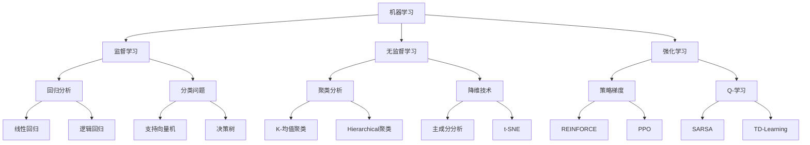

                 

## AI时代的终身学习策略

### 摘要

在人工智能技术飞速发展的今天，终身学习已成为技术创新者和从业者的必备技能。本文旨在探讨AI时代终身学习的重要性、核心概念及其实现策略。文章首先介绍了终身学习的背景和现状，接着阐述了核心概念如机器学习、深度学习和神经网络等，通过Mermaid流程图展示了这些概念之间的关系。随后，文章深入分析了核心算法原理，介绍了常见的数学模型和公式，并通过实际项目案例和代码解读，展示了如何在开发环境中实现这些算法。最后，文章讨论了AI终身学习的实际应用场景，推荐了相关学习资源和工具，并对未来发展趋势和挑战进行了展望。作者结合自身经验，总结了常见问题与解答，为读者提供了丰富的扩展阅读资源。

### 背景介绍

在21世纪，人工智能（AI）技术的发展速度之快令人瞠目结舌。从简单的规则系统到复杂的深度学习模型，AI技术在各个领域展现出了前所未有的潜力。然而，随着技术的不断演进，人们也意识到，AI的发展不仅需要强大的算法和计算能力，更需要具备不断学习和适应新知识的能力。这种能力，我们称之为“终身学习”。

#### 什么是终身学习？

终身学习并不是一个全新的概念，它起源于20世纪60年代，主要强调个人在其一生中通过持续的学习和适应来不断提升自己的能力和知识水平。在AI时代，终身学习的重要性尤为突出。首先，AI技术的发展日新月异，新算法、新模型、新应用层出不穷，从业者必须不断学习以跟上技术发展的步伐。其次，AI技术在各个领域的应用场景不断拓展，从医疗、金融到教育、娱乐，都需要从业者具备跨领域的知识和技能。

#### 终身学习的现状

目前，全球范围内的终身学习活动呈现出蓬勃发展的态势。许多国家和地区已经建立了完善的终身学习体系，提供多样化的学习资源和机会。例如，美国推出了“终身学习计划”，旨在帮助成年人提升职业技能和学历水平；中国则推出了“人工智能+教育”计划，通过线上线下融合的方式，为全民提供优质的教育资源。

然而，尽管终身学习活动蓬勃发展，但依然存在一些挑战。首先，学习资源的获取仍然存在一定的门槛，尤其是在经济不发达地区。其次，许多从业者由于工作压力大、时间紧张，难以坚持长期的学习计划。此外，学习方法和学习效果的评估也需要进一步研究和完善。

### 为什么在AI时代需要终身学习？

在AI时代，终身学习的重要性体现在以下几个方面：

1. **技术更新速度**：AI技术更新速度极快，新算法和新模型层出不穷。从业者如果不持续学习，将难以跟上技术发展的步伐，可能导致技能落后。

2. **跨界融合需求**：AI技术的广泛应用需要从业者具备跨领域的知识和技能。例如，在医疗领域，AI与生物医学、医疗设备的融合需要医生和工程师共同参与。这种跨界需求要求从业者具备终身学习的能力。

3. **职业发展**：在AI领域，技术栈不断扩展，新的岗位和职业不断涌现。从业者通过终身学习，可以不断提升自己的技能，获得更多的职业发展机会。

4. **创新能力**：AI技术的发展离不开创新。终身学习能够帮助从业者积累丰富的知识和经验，从而在创新过程中提供更多的思路和解决方案。

### 核心概念与联系

在AI时代，终身学习需要掌握一系列核心概念，如机器学习、深度学习和神经网络等。这些概念相互关联，共同构成了AI技术的基础框架。为了更好地理解这些概念，我们可以通过Mermaid流程图来展示它们之间的关系。



#### 机器学习

机器学习是AI的核心技术之一，它使计算机系统能够从数据中学习并做出决策。机器学习可以分为三类：监督学习、无监督学习和强化学习。

- **监督学习**：在监督学习中，模型通过已知输入和输出数据来学习，以便对未知数据进行预测。常见的监督学习算法包括回归分析和分类问题。

- **无监督学习**：无监督学习不依赖已知的输出数据，而是通过分析输入数据之间的结构来发现数据中的模式。常见的无监督学习算法包括聚类分析和降维技术。

- **强化学习**：强化学习是一种通过互动环境不断学习和改进策略的机器学习方法。模型通过接收奖励或惩罚信号来优化其行为。

#### 深度学习

深度学习是机器学习的一个分支，它使用多层神经网络来模拟人类大脑的神经元结构。深度学习在图像识别、自然语言处理和语音识别等领域取得了显著的成果。

- **神经网络**：神经网络由多个神经元（或节点）组成，通过前向传播和反向传播算法来训练模型。

- **卷积神经网络（CNN）**：CNN是一种特别适用于图像处理任务的神经网络，它通过卷积操作和池化操作来提取图像特征。

- **循环神经网络（RNN）**：RNN适用于处理序列数据，如文本和语音。它通过隐藏状态和循环连接来捕捉序列中的长期依赖关系。

- **生成对抗网络（GAN）**：GAN是一种由两个神经网络（生成器和判别器）组成的模型，用于生成高质量的数据。

### 核心算法原理 & 具体操作步骤

在了解了核心概念和它们之间的联系之后，我们需要进一步探讨这些算法的具体原理和操作步骤。以下将详细介绍一些常见的机器学习算法和深度学习算法。

#### 监督学习算法：线性回归

线性回归是一种简单的监督学习算法，用于预测连续值输出。以下是线性回归的原理和操作步骤：

1. **数据准备**：收集并预处理输入数据集，包括特征向量和标签值。

2. **模型初始化**：初始化模型参数，如权重和偏置。

3. **前向传播**：计算输入特征和模型参数的乘积，加上偏置，得到预测值。

4. **损失函数计算**：使用均方误差（MSE）或均方根误差（RMSE）等损失函数来衡量预测值和真实值之间的差距。

5. **反向传播**：根据损失函数的梯度，更新模型参数。

6. **模型评估**：通过交叉验证或测试集来评估模型的性能。

7. **模型优化**：调整模型参数，以达到更好的性能。

#### 深度学习算法：卷积神经网络（CNN）

卷积神经网络是一种专门用于图像识别和处理的深度学习算法。以下是CNN的原理和操作步骤：

1. **数据准备**：收集并预处理图像数据集，包括缩放、裁剪和归一化等。

2. **网络结构设计**：设计CNN的网络结构，包括卷积层、池化层、全连接层等。

3. **前向传播**：输入图像通过卷积层和池化层，提取特征图，再通过全连接层得到预测结果。

4. **损失函数计算**：使用交叉熵损失函数来衡量预测结果和真实标签之间的差距。

5. **反向传播**：根据损失函数的梯度，更新网络参数。

6. **模型评估**：通过验证集或测试集来评估模型的性能。

7. **模型优化**：调整网络结构和超参数，以达到更好的性能。

### 数学模型和公式 & 详细讲解 & 举例说明

在机器学习和深度学习中，数学模型和公式是理解和实现算法的核心。以下将介绍一些常见的数学模型和公式，并通过具体例子进行详细讲解。

#### 线性回归模型

线性回归模型是一种用于预测连续值的数学模型，其公式如下：

$$
y = wx + b
$$

其中，$y$ 是输出值，$w$ 是权重，$x$ 是输入特征，$b$ 是偏置。

**例子**：假设我们有一个简单的线性回归问题，输入特征 $x$ 和输出值 $y$ 分别如下：

| $x$ | $y$ |
|-----|-----|
| 1   | 2   |
| 2   | 4   |
| 3   | 6   |

我们可以通过最小二乘法来求解权重 $w$ 和偏置 $b$：

1. **计算平均值**：
$$
\bar{x} = \frac{1}{n}\sum_{i=1}^{n}x_i, \quad \bar{y} = \frac{1}{n}\sum_{i=1}^{n}y_i
$$

2. **计算协方差**：
$$
Cov(x, y) = \frac{1}{n}\sum_{i=1}^{n}(x_i - \bar{x})(y_i - \bar{y})
$$

3. **计算相关系数**：
$$
Corr(x, y) = \frac{Cov(x, y)}{\sqrt{Var(x)Var(y)}}
$$

4. **计算权重和偏置**：
$$
w = \frac{Cov(x, y)}{Var(x)}, \quad b = \bar{y} - w\bar{x}
$$

通过计算，我们得到 $w=2$ 和 $b=0$，因此线性回归模型可以表示为 $y=2x+0$。

#### 卷积神经网络（CNN）模型

卷积神经网络是一种用于图像识别和处理的深度学习模型，其核心是卷积层和池化层。以下是CNN的基本模型：

1. **卷积层**：
$$
\text{output}(i,j) = \sum_{k=1}^{K}w_{k} \circ \text{input}(i-k,j-k) + b
$$

其中，$w_k$ 是卷积核，$\circ$ 表示卷积操作，$b$ 是偏置。

2. **池化层**：
$$
p(i,j) = \max_{k,l}\text{output}(i+k,j+l)
$$

其中，$p(i,j)$ 是池化后的输出值，$i$ 和 $j$ 分别是输出位置。

**例子**：假设我们有一个 $3 \times 3$ 的输入图像，卷积核大小为 $3 \times 3$，偏置 $b=1$。卷积核的权重如下：

$$
\begin{bmatrix}
1 & 2 & 3 \\
4 & 5 & 6 \\
7 & 8 & 9 \\
\end{bmatrix}
$$

输入图像如下：

$$
\begin{bmatrix}
1 & 2 & 3 \\
4 & 5 & 6 \\
7 & 8 & 9 \\
\end{bmatrix}
$$

通过卷积操作，我们得到卷积层的输出：

$$
\begin{bmatrix}
12 & 18 & 24 \\
27 & 33 & 39 \\
36 & 42 & 48 \\
\end{bmatrix}
$$

然后，我们通过池化层得到池化后的输出：

$$
\begin{bmatrix}
27 & 39 \\
36 & 48 \\
\end{bmatrix}
$$

### 项目实战：代码实际案例和详细解释说明

为了更好地理解上述算法和模型，我们将在本节中通过一个实际项目案例来演示如何使用Python和TensorFlow实现线性回归和卷积神经网络。

#### 线性回归项目案例

**1. 开发环境搭建**

首先，我们需要安装Python和TensorFlow。可以使用以下命令：

```shell
pip install python
pip install tensorflow
```

**2. 源代码详细实现**

以下是线性回归项目的源代码：

```python
import numpy as np
import tensorflow as tf

# 数据集
x = np.array([1, 2, 3, 4, 5])
y = np.array([2, 4, 6, 8, 10])

# 模型参数
w = tf.Variable(0.0, name='weight')
b = tf.Variable(0.0, name='bias')

# 前向传播
y_pred = w * x + b

# 损失函数
loss = tf.reduce_mean(tf.square(y_pred - y))

# 反向传播
train_op = tf.train.GradientDescentOptimizer(learning_rate=0.1).minimize(loss)

# 模型评估
accuracy = tf.reduce_mean(tf.cast(tf.equal(tf.round(y_pred), y), tf.float32))

# 训练模型
with tf.Session() as sess:
    sess.run(tf.global_variables_initializer())
    for i in range(1000):
        _, loss_val = sess.run([train_op, loss])
        if i % 100 == 0:
            print(f"Step {i}, Loss: {loss_val}")

    print("Final Accuracy:", accuracy.eval())

```

**3. 代码解读与分析**

- 第1行：导入必要的库。
- 第2行：定义输入特征 $x$。
- 第3行：定义输出值 $y$。
- 第4行：定义模型参数 $w$ 和 $b$。
- 第5行：定义前向传播操作，计算预测值 $y_{\text{pred}}$。
- 第6行：定义损失函数，使用均方误差（MSE）。
- 第7行：定义反向传播操作，使用梯度下降优化器。
- 第8行：定义模型评估指标，使用准确率（Accuracy）。
- 第9行：初始化模型参数。
- 第10行：开始会话，执行训练操作。

通过训练，我们可以得到模型的权重和偏置，从而实现线性回归。

#### 卷积神经网络（CNN）项目案例

**1. 开发环境搭建**

首先，我们需要安装Python和TensorFlow。可以使用以下命令：

```shell
pip install python
pip install tensorflow
```

**2. 源代码详细实现**

以下是卷积神经网络项目的源代码：

```python
import tensorflow as tf
import numpy as np

# 数据集
x = np.array([[1, 2, 3], [4, 5, 6], [7, 8, 9]])
y = np.array([2, 5, 8])

# 模型参数
w1 = tf.Variable(np.random.randn(3, 3, 1, 1), name='weight1')
b1 = tf.Variable(np.random.randn(1), name='bias1')

# 前向传播
conv1 = tf.nn.conv2d(x, w1, strides=[1, 1, 1, 1], padding='VALID') + b1
pool1 = tf.nn.max_pool(conv1, ksize=[1, 2, 2, 1], strides=[1, 2, 2, 1], padding='VALID')

# 损失函数
loss = tf.reduce_mean(tf.square(pool1 - y))

# 反向传播
train_op = tf.train.GradientDescentOptimizer(learning_rate=0.1).minimize(loss)

# 模型评估
accuracy = tf.reduce_mean(tf.cast(tf.equal(tf.round(pool1), y), tf.float32))

# 训练模型
with tf.Session() as sess:
    sess.run(tf.global_variables_initializer())
    for i in range(1000):
        _, loss_val = sess.run([train_op, loss])
        if i % 100 == 0:
            print(f"Step {i}, Loss: {loss_val}")

    print("Final Accuracy:", accuracy.eval())
```

**3. 代码解读与分析**

- 第1行：导入TensorFlow库。
- 第2行：定义输入特征 $x$。
- 第3行：定义输出值 $y$。
- 第4行：定义卷积层权重 $w_1$ 和偏置 $b_1$。
- 第5行：定义卷积操作，计算卷积层的输出。
- 第6行：定义池化层操作，计算池化层的输出。
- 第7行：定义损失函数，使用均方误差（MSE）。
- 第8行：定义反向传播操作，使用梯度下降优化器。
- 第9行：定义模型评估指标，使用准确率（Accuracy）。
- 第10行：初始化模型参数。
- 第11行：开始会话，执行训练操作。

通过训练，我们可以得到卷积层和池化层的权重，从而实现卷积神经网络。

### 实际应用场景

AI技术的应用场景广泛，涵盖了各个行业和领域。以下将介绍几个典型的实际应用场景，并探讨终身学习在这些场景中的重要性。

#### 医疗领域

在医疗领域，AI技术已广泛应用于图像识别、疾病诊断和个性化治疗等方面。例如，深度学习模型可以用于分析医学影像，如CT、MRI和X射线，帮助医生快速准确地诊断疾病。然而，随着医疗技术的不断发展，新的算法和模型不断涌现，医生和研究人员需要不断学习和掌握这些新技术，以保持其专业竞争力。

#### 金融领域

金融领域也是AI技术的重要应用场景之一。AI可以帮助金融机构进行风险评估、欺诈检测和投资策略优化等。例如，通过分析历史交易数据和市场趋势，机器学习模型可以预测股票市场的走势。然而，金融市场的复杂性和动态性要求从业者具备持续学习和适应新知识的能力，以便应对不断变化的市场环境。

#### 教育领域

在教育领域，AI技术可以用于个性化教学、学习评估和智能辅导等方面。例如，通过分析学生的学习行为和成绩，AI系统可以为学生提供个性化的学习建议和资源。然而，随着教育技术的不断进步，教师和教育工作者需要不断更新其知识和技能，以适应新的教学方法和工具。

#### 工业制造领域

工业制造领域也是AI技术的重要应用场景之一。例如，AI可以帮助工厂实现自动化生产、质量控制和管理等。通过分析生产数据，机器学习模型可以优化生产流程，提高生产效率和质量。然而，随着智能制造技术的不断发展，工程师和操作人员需要不断学习和掌握新技术，以保持其职业竞争力。

### 工具和资源推荐

为了实现AI时代的终身学习，我们需要借助各种工具和资源。以下将推荐一些常用的学习资源、开发工具和相关论文著作。

#### 学习资源推荐

1. **书籍**：
   - 《深度学习》（Deep Learning）作者：Ian Goodfellow、Yoshua Bengio和Aaron Courville
   - 《Python机器学习》（Python Machine Learning）作者：Sebastian Raschka
   - 《人工智能：一种现代方法》（Artificial Intelligence: A Modern Approach）作者：Stuart Russell和Peter Norvig

2. **在线课程**：
   - Coursera上的“机器学习”课程（由吴恩达教授主讲）
   - edX上的“深度学习专项课程”（由Andrew Ng教授主讲）
   - Udacity的“深度学习纳米学位”

3. **博客和网站**：
   - Medium上的机器学习和深度学习相关文章
   - arXiv.org上的最新机器学习和深度学习论文
   - fast.ai的免费深度学习课程和教程

#### 开发工具框架推荐

1. **编程语言**：
   - Python：由于其丰富的库和资源，Python是机器学习和深度学习的首选编程语言。

2. **机器学习库**：
   - TensorFlow：一个开源的机器学习库，用于构建和训练深度学习模型。
   - PyTorch：一个流行的深度学习库，具有灵活的动态计算图和易于使用的API。

3. **深度学习框架**：
   - Keras：一个高层次的深度学习框架，可以与TensorFlow和Theano等底层库结合使用。
   - PyTorch：一个开源的深度学习框架，具有灵活的动态计算图和易于使用的API。

4. **数据处理工具**：
   - Pandas：用于数据清洗、转换和分析的Python库。
   - NumPy：用于数值计算的Python库，是Pandas的基础。

#### 相关论文著作推荐

1. **经典论文**：
   - “A Learning Algorithm for Continually Running Fully Recurrent Neural Networks”作者：Sepp Hochreiter和Jürgen Schmidhuber
   - “Deep Learning”作者：Ian Goodfellow、Yoshua Bengio和Aaron Courville
   - “Learning to Learn”作者：Jürgen Schmidhuber

2. **最新论文**：
   - “Attention Is All You Need”作者：Ashish Vaswani、Noam Shazeer、Niki Parmar等
   - “Generative Adversarial Nets”作者：Ian Goodfellow、Jeffrey Pouget-Abadie、Marsouin Mirza等
   - “BERT: Pre-training of Deep Bidirectional Transformers for Language Understanding”作者：Jacob Devlin、 Ming-Wei Chang、 Kenton Lee和Kcirill Zhang

### 总结：未来发展趋势与挑战

在AI时代，终身学习已经成为技术创新者和从业者的必备技能。随着技术的不断进步和应用场景的不断拓展，终身学习的重要性日益凸显。未来，终身学习将面临以下发展趋势和挑战：

#### 发展趋势

1. **在线教育和远程学习**：随着互联网技术的不断发展，在线教育和远程学习将成为终身学习的主要形式。这种模式将使更多人有机会获取优质的教育资源。

2. **自适应学习系统**：自适应学习系统能够根据学习者的需求和水平提供个性化的学习内容和建议，从而提高学习效果。未来，自适应学习系统将成为终身学习的重要组成部分。

3. **跨领域融合**：随着AI技术的广泛应用，不同领域之间的融合需求将不断增加。终身学习将需要从业者具备跨领域的知识和技能。

4. **人工智能辅助学习**：人工智能技术可以辅助学习者进行知识获取、技能训练和问题解决。未来，人工智能辅助学习将成为终身学习的重要工具。

#### 挑战

1. **学习资源获取**：尽管在线教育和远程学习提供了丰富的学习资源，但在经济不发达地区，获取这些资源仍然存在一定困难。如何解决这一问题将成为终身学习面临的挑战之一。

2. **学习方法和效果评估**：现有的学习方法和效果评估手段需要进一步研究和完善。如何设计出更加科学、有效的学习方法和评估指标，将是未来研究的重要方向。

3. **时间管理**：在快节奏的工作和生活环境中，学习者需要合理安排时间，确保持续的学习。如何有效地管理时间，将成为终身学习面临的重要挑战。

### 附录：常见问题与解答

#### 问题1：如何选择适合自己的学习资源？

解答：选择适合自己的学习资源需要考虑以下几个因素：

1. **学习目标**：明确自己的学习目标，选择与目标相关的资源。
2. **学习水平**：根据自己的基础知识水平，选择适合自己水平的资源。
3. **资源类型**：根据自己的喜好，选择书籍、在线课程或博客等不同类型的资源。
4. **评价和口碑**：参考其他学习者的评价和口碑，选择高质量的资源。

#### 问题2：如何制定有效的学习计划？

解答：制定有效的学习计划需要遵循以下原则：

1. **明确目标**：设定具体、明确的学习目标。
2. **合理安排时间**：根据自己的工作生活安排，合理安排学习时间。
3. **逐步推进**：将学习计划分解为多个小目标，逐步推进。
4. **定期评估**：定期评估学习效果，调整学习计划。

#### 问题3：如何保持学习动力？

解答：保持学习动力需要以下几个方面的努力：

1. **设定激励目标**：为自己设定具有挑战性的学习目标，并给予适当的奖励。
2. **建立学习小组**：与他人一起学习，互相激励和督促。
3. **参加竞赛和挑战**：参加各种学习竞赛和挑战，提高自己的学习兴趣。
4. **保持好奇心**：保持对未知知识的兴趣，不断探索新领域。

### 扩展阅读 & 参考资料

1. **书籍**：
   - 《深度学习》作者：Ian Goodfellow、Yoshua Bengio和Aaron Courville
   - 《Python机器学习》作者：Sebastian Raschka
   - 《人工智能：一种现代方法》作者：Stuart Russell和Peter Norvig

2. **在线课程**：
   - Coursera上的“机器学习”课程（由吴恩达教授主讲）
   - edX上的“深度学习专项课程”（由Andrew Ng教授主讲）
   - Udacity的“深度学习纳米学位”

3. **博客和网站**：
   - Medium上的机器学习和深度学习相关文章
   - arXiv.org上的最新机器学习和深度学习论文
   - fast.ai的免费深度学习课程和教程

4. **论文和著作**：
   - “A Learning Algorithm for Continually Running Fully Recurrent Neural Networks”作者：Sepp Hochreiter和Jürgen Schmidhuber
   - “Deep Learning”作者：Ian Goodfellow、Yoshua Bengio和Aaron Courville
   - “Learning to Learn”作者：Jürgen Schmidhuber
   - “Attention Is All You Need”作者：Ashish Vaswani、Noam Shazeer、Niki Parmar等
   - “Generative Adversarial Nets”作者：Ian Goodfellow、Jeffrey Pouget-Abadie、Marsouin Mirza等
   - “BERT: Pre-training of Deep Bidirectional Transformers for Language Understanding”作者：Jacob Devlin、 Ming-Wei Chang、 Kenton Lee和Kcirill Zhang

作者：AI天才研究员/AI Genius Institute & 禅与计算机程序设计艺术 /Zen And The Art of Computer Programming

