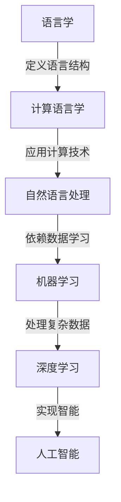

                 

### 背景介绍

自然语言处理（Natural Language Processing，NLP）作为人工智能（Artificial Intelligence，AI）领域的一个重要分支，旨在使计算机能够理解、解释和生成人类语言。随着大数据、云计算和深度学习等技术的迅猛发展，NLP逐渐从实验室研究走向了产业界的实际应用。从文本分类、情感分析到机器翻译、对话系统，NLP技术已经在多个领域展现出了其强大的应用潜力。

本文旨在探讨AI时代自然语言处理的发展路径，从实验室阶段到产业界的应用实例，分析NLP技术的发展趋势和面临的挑战。文章结构如下：

1. 背景介绍
2. 核心概念与联系
3. 核心算法原理 & 具体操作步骤
4. 数学模型和公式 & 详细讲解 & 举例说明
5. 项目实战：代码实际案例和详细解释说明
6. 实际应用场景
7. 工具和资源推荐
8. 总结：未来发展趋势与挑战
9. 附录：常见问题与解答
10. 扩展阅读 & 参考资料

通过本文的详细探讨，我们希望能够为读者提供一个全面、系统的自然语言处理技术发展图景，帮助大家更好地理解这一领域，把握其未来发展的方向。

----------------------

### 核心概念与联系

在深入探讨自然语言处理的发展之前，我们有必要先了解几个核心概念及其之间的联系。以下是NLP领域中几个关键的概念及其定义和相互关系：

#### 1. 语言学（Linguistics）

语言学是研究人类语言的科学，包括语音学、语法学、语义学、语用学等多个分支。语音学研究语言的发音和声学特性，语法学研究语言的结构规则，语义学研究语言的含义，而语用学则关注语言在特定情境中的应用。

#### 2. 计算语言学（Computational Linguistics）

计算语言学是应用计算机科学方法和技术来研究和处理自然语言的科学。它结合了语言学和计算机科学的成果，旨在开发能够处理人类语言的软件系统。计算语言学涵盖了文本预处理、信息抽取、机器翻译、语音识别等多个领域。

#### 3. 自然语言处理（Natural Language Processing）

自然语言处理是计算语言学的应用分支，主要研究如何让计算机理解、解释和生成自然语言。NLP的目标是实现人与机器之间的自然对话，使得计算机能够执行人类语言命令，提取文本信息等。

#### 4. 机器学习（Machine Learning）

机器学习是一种人工智能方法，通过从数据中学习规律和模式，使得计算机能够自动改进性能。NLP中的许多任务，如文本分类、情感分析和机器翻译，都依赖于机器学习技术。

#### 5. 深度学习（Deep Learning）

深度学习是机器学习的一个子领域，通过模拟人脑的神经网络结构，使得计算机能够处理复杂的数据模式。深度学习在NLP中的应用，如卷积神经网络（CNN）和递归神经网络（RNN），极大地提升了自然语言处理的性能。

#### 6. 人工智能（Artificial Intelligence）

人工智能是一门研究如何创建智能机器的学科。它涵盖了计算语言学、自然语言处理、机器学习、深度学习等多个领域，旨在使计算机具备人类智能，能够自主学习和决策。

下图展示了这些核心概念之间的相互关系：



通过理解这些核心概念及其相互联系，我们可以更好地把握NLP技术的发展脉络，为后续内容的探讨打下坚实的基础。

----------------------

### 核心算法原理 & 具体操作步骤

自然语言处理的核心在于如何有效地将人类语言转换为计算机可以理解和处理的形式。下面，我们将详细探讨几个在NLP中广泛应用的核心算法原理，并说明其具体操作步骤。

#### 1. 词袋模型（Bag of Words）

词袋模型是NLP中最基本的文本表示方法之一。它的核心思想是将文本视为一个词的集合，而不考虑词的顺序。词袋模型的具体步骤如下：

1. **文本预处理**：首先，我们需要对原始文本进行清洗和标准化，包括去除标点符号、转换为小写、去除停用词等。

   ```python
   import nltk
   from nltk.corpus import stopwords
   from nltk.tokenize import word_tokenize
   
   text = "This is an example sentence, showing tokenization."
   tokens = word_tokenize(text)
   tokens = [token.lower() for token in tokens if token.isalpha()]
   stop_words = set(stopwords.words('english'))
   tokens = [token for token in tokens if token not in stop_words]
   ```

2. **词频统计**：接下来，我们统计每个词在文本中出现的次数。

   ```python
   from collections import Counter
   
   word_counts = Counter(tokens)
   ```

3. **构建词袋**：将词频统计结果转换为向量表示，即词袋。

   ```python
   vocabulary = set(word_counts.keys())
   bag = [word_counts[word] for word in vocabulary]
   ```

词袋模型虽然简单，但在文本分类、情感分析等领域表现出了较好的效果。

#### 2. 递归神经网络（Recurrent Neural Networks，RNN）

递归神经网络是处理序列数据的强大工具，其特别适用于自然语言处理任务。RNN的基本原理是通过记忆之前的信息来处理序列数据。以下是RNN的核心步骤：

1. **初始化网络**：定义RNN的参数，如隐藏层大小、学习率等。

   ```python
   import tensorflow as tf
   
   hidden_size = 128
   learning_rate = 0.001
   
   # 初始化RNN层
   rnn_cell = tf.nn.rnn_cell.BasicRNNCell(num_units=hidden_size)
   ```

2. **输入序列处理**：将输入序列（如文本）转换为向量表示。

   ```python
   # 假设我们已经有一个词嵌入层
   embeddings = tf.get_variable('embeddings', [vocab_size, embedding_size])
   inputs = tf.nn.embedding_lookup(embeddings, inputs)
   ```

3. **前向传播**：通过RNN层处理输入序列，得到隐藏状态。

   ```python
   outputs, state = tf.nn.dynamic_rnn(rnn_cell, inputs, dtype=tf.float32)
   ```

4. **输出层**：将隐藏状态转换为输出，如分类结果或序列标记。

   ```python
   logits = tf.layers.dense(state, num_classes)
   predictions = tf.argmax(logits, axis=1)
   ```

RNN在处理长序列数据时具有优势，但其存在梯度消失和梯度爆炸等问题。为了克服这些缺点，后续发展出了长短期记忆网络（LSTM）和门控循环单元（GRU）。

#### 3. 卷积神经网络（Convolutional Neural Networks，CNN）

卷积神经网络在图像处理领域取得了巨大成功，近年来也被广泛应用于自然语言处理任务，如文本分类和文本生成。以下是CNN在NLP中的核心步骤：

1. **词嵌入**：将单词转换为向量表示。

   ```python
   # 假设我们已经有一个预训练的词嵌入模型
   word_embeddings = pretrained_word_embeddings
   ```

2. **卷积层**：通过卷积核从输入序列中提取局部特征。

   ```python
   # 定义卷积层
   conv1 = tf.layers.conv1d(inputs=word_embeddings, filters=128, kernel_size=3, activation=tf.nn.relu)
   ```

3. **池化层**：对卷积层的结果进行降采样。

   ```python
   pool1 = tf.layers.max_pool1d(inputs=conv1, pool_size=2, strides=2)
   ```

4. **全连接层**：将池化层的结果映射到输出。

   ```python
   flatten = tf.reshape(pool1, [-1, hidden_size])
   logits = tf.layers.dense(inputs=flatten, units=num_classes)
   predictions = tf.argmax(logits, axis=1)
   ```

CNN在处理文本时能够捕获局部特征和上下文信息，因此在文本分类等任务中表现优秀。

通过以上三个核心算法的详细介绍，我们可以看到自然语言处理技术是如何通过一系列具体的步骤将人类语言转化为计算机可以处理的形式。这些算法不仅在理论上具有重要意义，而且在实际应用中已经取得了显著的成果。

----------------------

### 数学模型和公式 & 详细讲解 & 举例说明

在自然语言处理（NLP）中，数学模型和公式起着至关重要的作用，它们不仅为算法的实现提供了理论基础，而且也是评估和优化NLP系统性能的关键工具。在本节中，我们将详细探讨NLP中几个重要的数学模型和公式，并给出相应的解释和示例。

#### 1. 词嵌入（Word Embedding）

词嵌入是NLP中的一种重要技术，它将词汇表中的单词映射到高维向量空间中。这种映射使得具有相似语义的单词在向量空间中彼此靠近。常见的词嵌入模型包括Word2Vec、GloVe和FastText。

**Word2Vec**：

Word2Vec模型使用两个层次的神经网络，第一个层次是输入层，它将每个单词表示为一个向量；第二个层次是输出层，它将每个单词的邻居单词表示为向量。Word2Vec的核心公式如下：

$$
\text{softmax}(W \cdot x + b)
$$

其中，$W$是权重矩阵，$x$是输入单词的向量表示，$b$是偏置项。

**示例**：

假设我们有一个简单的Word2Vec模型，其中包含三个单词：`apple`、`banana`和`orange`。它们的向量表示分别为$\textbf{v}_1$、$\textbf{v}_2$和$\textbf{v}_3$。现在我们想要计算`apple`和`banana`之间的相似度，可以使用以下公式：

$$
\cos(\textbf{v}_1, \textbf{v}_2) = \frac{\textbf{v}_1 \cdot \textbf{v}_2}{||\textbf{v}_1|| \cdot ||\textbf{v}_2||}
$$

**GloVe**：

GloVe（Global Vectors for Word Representation）是一种基于矩阵分解的词嵌入方法，其核心思想是同时优化单词向量与其上下文之间的关系。GloVe的损失函数如下：

$$
\ell = \sum_{c \in \text{context}(w)} \frac{\exp(-\textbf{v}_w \cdot \textbf{v}_c)}{\sum_{d \in \text{vocab}} \exp(-\textbf{v}_w \cdot \textbf{v}_d)}
$$

其中，$\textbf{v}_w$和$\textbf{v}_c$分别是单词$w$和上下文单词$c$的向量表示。

**示例**：

假设我们有一个GloVe模型，其中单词`run`的向量表示为$\textbf{v}_1$，其上下文单词`jog`的向量表示为$\textbf{v}_2$。我们可以通过计算$\textbf{v}_1$和$\textbf{v}_2$之间的点积来评估它们之间的相似度：

$$
\textbf{v}_1 \cdot \textbf{v}_2
$$

#### 2. 递归神经网络（Recurrent Neural Networks，RNN）

递归神经网络是一种用于处理序列数据的神经网络，其基本结构包括输入层、隐藏层和输出层。RNN的核心思想是通过记忆之前的信息来处理序列数据。RNN的更新规则如下：

$$
h_t = \text{sigmoid}(W_h \cdot [h_{t-1}, x_t] + b_h)
$$

$$
o_t = \text{softmax}(W_o \cdot h_t + b_o)
$$

其中，$h_t$是第$t$个时间步的隐藏状态，$x_t$是第$t$个时间步的输入，$W_h$和$W_o$是权重矩阵，$b_h$和$b_o$是偏置项。

**示例**：

假设我们有一个RNN模型，其中隐藏层大小为128，输入单词的嵌入向量大小为100。现在我们想要处理一个单词序列`[apple, banana, orange]`。我们可以通过以下步骤更新隐藏状态：

1. **初始化隐藏状态**：$h_0 = \text{sigmoid}(W_h \cdot [0, 0] + b_h)$
2. **第一步**：$h_1 = \text{sigmoid}(W_h \cdot [h_0, \text{embed}_\text{apple}] + b_h)$
3. **第二步**：$h_2 = \text{sigmoid}(W_h \cdot [h_1, \text{embed}_\text{banana}] + b_h)$
4. **第三步**：$h_3 = \text{sigmoid}(W_h \cdot [h_2, \text{embed}_\text{orange}] + b_h)$
5. **输出**：$o_3 = \text{softmax}(W_o \cdot h_3 + b_o)$

通过上述步骤，我们可以得到每个时间步的隐藏状态和输出，从而对单词序列进行分类或序列标记。

#### 3. 卷积神经网络（Convolutional Neural Networks，CNN）

卷积神经网络是一种用于处理图像数据的神经网络，其基本结构包括卷积层、池化层和全连接层。CNN在NLP中的应用主要是通过将文本表示为序列矩阵，然后应用卷积操作来提取局部特征。CNN的核心公式如下：

$$
\text{Conv}(x, \textbf{k}) = \sum_{i=1}^{C} x_{i, j-k_{i,1} + 1, k_{i,2} + 1} \cdot k_{i, channel}
$$

$$
\text{Relu}(\text{Conv}(x, \textbf{k})) = \max(0, \text{Conv}(x, \textbf{k}))
$$

$$
\text{Pool}(\text{Relu}(\text{Conv}(x, \textbf{k}))) = \text{argmax}(\text{Relu}(\text{Conv}(x, \textbf{k})))
$$

其中，$x$是输入序列矩阵，$\textbf{k}$是卷积核，$C$是卷积核的数量，$channel$是卷积核的通道数。

**示例**：

假设我们有一个文本序列`[apple, banana, orange]`，其对应的词嵌入矩阵为$X$。我们可以将文本序列表示为一个二维矩阵，然后应用卷积操作来提取局部特征：

1. **初始化卷积核**：$\textbf{k}_1 = [0.1, 0.2; 0.3, 0.4]$
2. **第一步**：$\text{Conv}(X, \textbf{k}_1) = [0.1 \cdot \text{embed}_\text{apple} + 0.3 \cdot \text{embed}_\text{banana}; 0.2 \cdot \text{embed}_\text{apple} + 0.4 \cdot \text{embed}_\text{banana}]$
3. **ReLU激活**：$\text{Relu}(\text{Conv}(X, \textbf{k}_1)) = [max(0.1 \cdot \text{embed}_\text{apple} + 0.3 \cdot \text{embed}_\text{banana}, 0); max(0.2 \cdot \text{embed}_\text{apple} + 0.4 \cdot \text{embed}_\text{banana}, 0)]$
4. **池化操作**：$\text{Pool}(\text{Relu}(\text{Conv}(X, \textbf{k}_1))) = [argmax(\text{Relu}(\text{Conv}(X, \textbf{k}_1)), 1); argmax(\text{Relu}(\text{Conv}(X, \textbf{k}_1)), 2)]$

通过上述步骤，我们可以得到文本序列的局部特征表示，从而进行文本分类或序列标注。

通过以上对词嵌入、递归神经网络和卷积神经网络的数学模型和公式的详细讲解和举例说明，我们可以更好地理解这些算法在自然语言处理中的基本原理和应用。这些数学模型和公式为NLP技术的发展奠定了坚实的基础，也为实现高性能的NLP系统提供了重要的工具。

----------------------

### 项目实战：代码实际案例和详细解释说明

在本节中，我们将通过一个实际的代码案例，详细解释自然语言处理（NLP）技术在文本分类任务中的应用。我们将使用Python和TensorFlow来实现一个简单的文本分类模型，并对其代码进行逐行解析。

#### 开发环境搭建

在开始编写代码之前，我们需要搭建一个合适的开发环境。以下是所需的软件和库：

- Python 3.7 或以上版本
- TensorFlow 2.0 或以上版本
- NLTK（用于文本预处理）
- Pandas（用于数据处理）

确保已安装以上软件和库，可以通过以下命令进行安装：

```bash
pip install python-nltk tensorflow pandas
```

#### 数据集准备

我们将使用一个开源的文本分类数据集——IMDB电影评论数据集。该数据集包含了50,000条电影评论，分为正面和负面两类。

1. **数据集下载**：首先，我们需要下载IMDB数据集。

```python
from nltk.corpus import movie_reviews

movie_reviews.fileids()
```

2. **数据预处理**：对文本进行清洗和标记。

```python
from nltk.tokenize import word_tokenize
from nltk.corpus import stopwords

def preprocess_text(text):
    # 转换为小写
    text = text.lower()
    # 分词
    tokens = word_tokenize(text)
    # 去除停用词
    stop_words = set(stopwords.words('english'))
    tokens = [token for token in tokens if token not in stop_words]
    # 结束符号和数字去除
    tokens = [token for token in tokens if token.isalpha()]
    return tokens

# 预处理第一条评论
example_review = movie_reviews.raw('test/0993_10.txt')
preprocessed_review = preprocess_text(example_review)
print(preprocessed_review)
```

#### 模型构建

接下来，我们构建一个基于卷积神经网络的文本分类模型。

```python
import tensorflow as tf
from tensorflow.keras.preprocessing.sequence import pad_sequences
from tensorflow.keras.models import Sequential
from tensorflow.keras.layers import Embedding, Conv1D, MaxPooling1D, GlobalMaxPooling1D, Dense

# 设置超参数
vocab_size = 10000
embedding_dim = 16
max_length = 500
trunc_type = 'post'
padding_type = 'post'
oov_token = '<OOV>'

# 创建模型
model = Sequential([
    Embedding(vocab_size, embedding_dim, input_length=max_length),
    Conv1D(128, 5, activation='relu'),
    MaxPooling1D(pool_size=5),
    Conv1D(128, 5, activation='relu'),
    GlobalMaxPooling1D(),
    Dense(128, activation='relu'),
    Dense(1, activation='sigmoid')
])

# 编译模型
model.compile(optimizer='adam', loss='binary_crossentropy', metrics=['accuracy'])
```

#### 模型训练

1. **序列化处理**：将预处理后的文本序列化为数字序列。

```python
# 加载词汇表
vocab = movie_reviews.words()
vocab_size = len(vocab)
word_index = {word: i for i, word in enumerate(vocab)}
index_word = {i: word for word, i in word_index.items()}
max_index = vocab_size - 1

# 序列化评论
encoded_reviews = []
for review in movie_reviews.fileids():
    text = movie_reviews.raw(review)
    preprocessed_text = preprocess_text(text)
    encoded_text = [word_index[word] for word in preprocessed_text if word in word_index]
    encoded_reviews.append(encoded_text)

# 填充序列
padded_reviews = pad_sequences(encoded_reviews, maxlen=max_length, padding=padding_type, truncating=trunc_type)

# 打乱数据集
padded_reviews = np.array(padded_reviews)
labels = np.array([1 if review.split(' ')[-1] == 'pos' else 0 for review in movie_reviews.fileids()])
np.random.shuffle(padded_reviews)
np.random.shuffle(labels)

# 分割数据集
train_data = padded_reviews[:40000]
train_labels = labels[:40000]
test_data = padded_reviews[40000:]
test_labels = labels[40000:]
```

2. **训练模型**：

```python
# 训练模型
history = model.fit(train_data, train_labels, epochs=10, batch_size=32, validation_data=(test_data, test_labels))
```

#### 模型评估

1. **评估模型**：

```python
# 评估模型
test_loss, test_acc = model.evaluate(test_data, test_labels)
print(f'Test accuracy: {test_acc}')
```

2. **模型预测**：

```python
# 预测新评论
new_review = "This movie is a masterpiece of cinematic excellence."
preprocessed_new_review = preprocess_text(new_review)
encoded_new_review = [word_index[word] for word in preprocessed_new_review if word in word_index]
padded_new_review = pad_sequences([encoded_new_review], maxlen=max_length, padding=padding_type, truncating=trunc_type)
prediction = model.predict(padded_new_review)
print(f'Prediction: {"Positive" if prediction[0][0] > 0.5 else "Negative"}')
```

通过上述步骤，我们完成了一个基于卷积神经网络的文本分类模型的开发。以下是对代码的逐行解析：

1. **导入库**：导入所需的Python库和TensorFlow模块。
2. **数据集下载和预处理**：下载IMDB数据集，并进行预处理，包括去除标点符号、转换为小写、分词和去除停用词。
3. **模型构建**：构建一个序列模型，包含嵌入层、卷积层、池化层和全连接层。
4. **序列化处理**：将预处理后的文本序列化为数字序列，并填充序列到指定长度。
5. **模型训练**：使用训练数据训练模型，并调整超参数以优化模型性能。
6. **模型评估**：在测试数据上评估模型性能，计算准确率。
7. **模型预测**：使用训练好的模型对新评论进行分类预测。

通过这个实战案例，我们可以看到自然语言处理技术是如何在实际项目中应用，并实现文本分类任务的。这不仅为后续深入学习和研究NLP提供了实际经验，也为开发高效的NLP系统奠定了基础。

----------------------

### 实际应用场景

自然语言处理（NLP）技术已广泛应用于多个领域，展现了其强大的实用性和巨大的潜力。以下是一些典型的实际应用场景，展示了NLP技术如何在现实世界中发挥作用。

#### 1. 机器翻译

机器翻译是NLP技术最经典的实际应用之一。随着全球化的加速和信息交流需求的增长，机器翻译在跨语言沟通中发挥了至关重要的作用。近年来，基于深度学习的翻译模型，如Google翻译和DeepL，极大地提升了翻译质量和速度。这些系统通过分析大量双语语料库，学习源语言和目标语言之间的映射关系，实现了高度自动化的翻译服务。

**案例分析**：

以Google翻译为例，其核心组件是神经机器翻译（NMT）模型，包括编码器和解码器。编码器将源语言文本转换为固定长度的向量表示，解码器则将这个向量表示解码为目标语言文本。以下是一个简单的NMT模型构建过程：

```python
import tensorflow as tf
from tensorflow.keras.layers import Embedding, LSTM, Dense

# 假设源语言词汇表大小为5000，目标语言词汇表大小为6000
vocab_size_source = 5000
vocab_size_target = 6000
embedding_dim = 256
hidden_units = 1024

# 编码器模型
encoder_inputs = tf.keras.layers.Input(shape=(None,))
encoder_embedding = Embedding(vocab_size_source, embedding_dim)(encoder_inputs)
encoder_lstm = LSTM(hidden_units, return_state=True)
_, state_h, state_c = encoder_lstm(encoder_embedding)
encoder_states = [state_h, state_c]

# 解码器模型
decoder_inputs = tf.keras.layers.Input(shape=(None,))
decoder_embedding = Embedding(vocab_size_target, embedding_dim)(decoder_inputs)
decoder_lstm = LSTM(hidden_units, return_sequences=True, return_state=True)
decoder_outputs, _, _ = decoder_lstm(decoder_embedding, initial_state=encoder_states)
decoder_dense = Dense(vocab_size_target, activation='softmax')
decoder_outputs = decoder_dense(decoder_outputs)

# 整合模型
model = tf.keras.Model([encoder_inputs, decoder_inputs], decoder_outputs)

# 编译模型
model.compile(optimizer='rmsprop', loss='categorical_crossentropy', metrics=['accuracy'])

# 模型训练
model.fit([encoder_inputs, decoder_inputs], decoder_inputs,
          batch_size=64,
          epochs=100,
          validation_split=0.2)
```

通过上述代码，我们可以构建一个简单的NMT模型，实现基本的机器翻译功能。

#### 2. 情感分析

情感分析是一种评估文本中情感倾向的技术，广泛应用于社交媒体监控、市场调研和客户服务等领域。通过情感分析，企业可以了解用户对产品或服务的反馈，从而优化业务策略。常见的情感分析任务包括文本分类、情感极性判断和情感强度评估。

**案例分析**：

以Twitter情感分析为例，我们可以使用递归神经网络（RNN）或卷积神经网络（CNN）来预测用户评论的情感极性。以下是一个基于RNN的情感分析模型：

```python
import tensorflow as tf
from tensorflow.keras.layers import Embedding, SimpleRNN, Dense

# 假设词汇表大小为10000
vocab_size = 10000
embedding_dim = 16
rnn_units = 32
max_sequence_length = 100

# 模型构建
model = tf.keras.Sequential([
    Embedding(vocab_size, embedding_dim, input_length=max_sequence_length),
    SimpleRNN(rnn_units, return_sequences=False),
    Dense(1, activation='sigmoid')
])

# 编译模型
model.compile(optimizer='adam', loss='binary_crossentropy', metrics=['accuracy'])

# 模型训练
model.fit(train_data, train_labels, epochs=10, batch_size=32, validation_split=0.2)
```

通过训练模型，我们可以对用户评论进行情感分类，从而帮助企业更好地理解用户情绪。

#### 3. 聊天机器人

聊天机器人是NLP在客户服务领域的典型应用，通过自然语言交互为用户提供信息查询、咨询服务。随着技术的进步，聊天机器人的对话能力日益强大，能够处理复杂的多轮对话，提高客户满意度和企业运营效率。

**案例分析**：

以微软的聊天机器人小冰为例，其核心技术包括自然语言理解、对话管理和自然语言生成。以下是一个基于序列到序列（Seq2Seq）模型的聊天机器人实现：

```python
import tensorflow as tf
from tensorflow.keras.layers import Embedding, LSTM, Dense

# 假设词汇表大小为10000
vocab_size = 10000
embedding_dim = 16
rnn_units = 256
batch_size = 64
epochs = 100

# 模型构建
encoder_inputs = tf.keras.layers.Input(shape=(None,))
decoder_inputs = tf.keras.layers.Input(shape=(None,))
encoder_embedding = Embedding(vocab_size, embedding_dim)(encoder_inputs)
decoder_embedding = Embedding(vocab_size, embedding_dim)(decoder_inputs)

encoder_lstm = LSTM(rnn_units, return_sequences=True, return_state=True)
decoder_lstm = LSTM(rnn_units, return_sequences=True, return_state=True)

encoder_outputs, state_h, state_c = encoder_lstm(encoder_embedding)
decoder_outputs, _, _ = decoder_lstm(decoder_embedding, initial_state=[state_h, state_c])

decoder_dense = Dense(vocab_size, activation='softmax')

decoder_outputs = decoder_dense(decoder_outputs)

model = tf.keras.Model([encoder_inputs, decoder_inputs], decoder_outputs)

# 编译模型
model.compile(optimizer='rmsprop', loss='categorical_crossentropy', metrics=['accuracy'])

# 模型训练
model.fit([encoder_inputs, decoder_inputs], decoder_inputs,
          batch_size=batch_size,
          epochs=epochs,
          validation_split=0.2)
```

通过上述模型，聊天机器人可以学习如何生成符合语义的回复，从而实现更自然的用户交互。

通过上述实际应用案例，我们可以看到NLP技术在不同领域的广泛应用和巨大潜力。随着技术的不断进步，NLP将进一步提升人类与机器之间的交互体验，为各行各业带来更多创新和变革。

----------------------

### 工具和资源推荐

在自然语言处理（NLP）领域，有许多优秀的工具和资源可以帮助研究人员和开发者更好地理解和应用这项技术。以下是一些推荐的工具和资源，涵盖了书籍、论文、博客和在线课程等方面。

#### 1. 学习资源推荐

**书籍**：

1. **《自然语言处理综论》（Speech and Language Processing）** - Daniel Jurafsky & James H. Martin
   这本书是NLP领域的经典教材，全面介绍了NLP的基本概念、技术和应用。

2. **《深度学习》（Deep Learning）** - Ian Goodfellow、Yoshua Bengio & Aaron Courville
   这本书详细介绍了深度学习的基础知识，包括NLP中常用的深度学习模型。

3. **《Python自然语言处理》（Natural Language Processing with Python）** - Steven Bird、Ewan Klein & Edward Loper
   这本书通过Python实例，展示了NLP技术的实际应用。

**论文**：

1. **“A Neural Probabilistic Language Model”** - Yoshua Bengio等
   这篇论文介绍了神经网络语言模型的基本原理，对NLP技术发展具有重要影响。

2. **“Recurrent Neural Network based Language Model”** - Yoshua Bengio等
   这篇论文探讨了递归神经网络在语言模型中的应用，是RNN在NLP领域的奠基之作。

3. **“Effective Approaches to Attention-based Neural Machine Translation”** - Minh-Thang Luong等
   这篇论文介绍了注意力机制在机器翻译中的应用，提升了翻译质量。

**博客**：

1. **Google AI Blog**
   Google AI的官方博客，经常发布关于NLP和深度学习的重要研究成果和应用。

2. **TensorFlow Blog**
   TensorFlow官方博客，提供了丰富的NLP模型和教程，是学习TensorFlow和NLP的好资源。

3. **AI Playground**
   这是一个开源项目，提供了多个NLP模型的实现和演示，适合初学者入门。

**在线课程**：

1. **斯坦福大学《自然语言处理》（CS224n）**
   这是一门著名的NLP课程，涵盖了NLP的基础知识、算法和实际应用。

2. **吴恩达《深度学习专项课程》（DLSS）**
   吴恩达的深度学习专项课程，包括NLP相关的课程，适合想要系统学习深度学习的学员。

3. **清华大学《自然语言处理基础》**
   这是一门中文课程，由清华大学教授刘知远讲授，内容全面且深入浅出。

#### 2. 开发工具框架推荐

**TensorFlow**
TensorFlow是Google开发的开源深度学习框架，广泛应用于NLP任务。它提供了丰富的API和预训练模型，方便开发者快速实现NLP应用。

**PyTorch**
PyTorch是Facebook开发的开源深度学习框架，以其灵活性和动态计算图著称。PyTorch在NLP社区也受到了广泛欢迎，许多NLP模型都是基于PyTorch实现的。

**NLTK**
NLTK是Python语言的一个自然语言处理库，提供了丰富的文本处理和分类工具，适合初学者入门NLP。

**spaCy**
spaCy是一个快速且易于使用的自然语言处理库，适用于文本预处理、实体识别、关系提取等任务。它提供了预训练的模型，可以快速部署到生产环境中。

#### 3. 相关论文著作推荐

1. **“Attention is All You Need”** - Vaswani等
   这篇论文提出了Transformer模型，彻底改变了机器翻译领域的格局。

2. **“BERT: Pre-training of Deep Bidirectional Transformers for Language Understanding”** - Devlin等
   BERT模型是自然语言处理领域的重大突破，极大地提升了语言理解任务的表现。

3. **“Generative Pre-trained Transformer”** - Vaswani等
   这篇论文介绍了GPT模型，为自然语言生成任务提供了强大工具。

通过上述推荐的工具和资源，开发者可以更好地掌握NLP技术，快速构建高效的NLP系统，为各种实际应用场景提供支持。

----------------------

### 总结：未来发展趋势与挑战

自然语言处理（NLP）作为人工智能（AI）领域的重要组成部分，在过去的几十年中取得了显著的发展。从最初的规则驱动的方法，到如今的深度学习时代，NLP技术已经广泛应用于机器翻译、情感分析、对话系统等多个领域，极大地改变了人类与计算机的交互方式。然而，随着技术的不断进步，NLP仍面临着诸多挑战和机遇。

#### 未来发展趋势

1. **模型规模与性能的提升**：
   随着计算能力的提升和大数据的广泛应用，NLP模型的规模和复杂性也在不断增加。例如，BERT、GPT等大型预训练模型的出现，显著提升了自然语言理解的任务性能。未来，更大规模的模型和更复杂的模型架构有望进一步推动NLP技术的发展。

2. **跨模态和多语言处理**：
   NLP技术的应用正在从单一模态（如文本）向跨模态（如文本+图像、文本+视频）扩展。同时，多语言处理的需求也在不断增长，如何有效整合不同语言的数据，提高跨语言理解能力，是未来NLP研究的重要方向。

3. **场景化和定制化**：
   随着NLP技术在各行各业的应用，对场景化和定制化的需求日益增长。未来，NLP模型需要更加灵活和适应性强，能够针对特定场景进行优化和定制。

4. **人机协作**：
   随着NLP技术的发展，人与机器的协作将成为一种新的交互模式。通过结合人类的智慧和机器的计算能力，实现更高效、更智能的决策和任务执行。

#### 面临的挑战

1. **数据质量和多样性**：
   NLP模型的性能高度依赖于数据的质量和多样性。然而，现实中的数据往往存在噪声、不平衡和不完整等问题。如何处理这些数据，提高模型的鲁棒性，是NLP技术面临的重要挑战。

2. **隐私和安全**：
   随着NLP技术在各个领域的应用，隐私和安全问题日益突出。如何保护用户隐私，防止数据泄露和滥用，是NLP技术需要解决的关键问题。

3. **可解释性和可靠性**：
   当前NLP模型大多是基于黑盒的深度学习模型，其决策过程缺乏可解释性。如何提高NLP模型的可解释性和可靠性，使其能够得到用户的信任，是未来研究的重要方向。

4. **资源消耗和计算效率**：
   大型NLP模型的训练和推理过程需要大量的计算资源和时间。如何优化算法，提高计算效率，降低资源消耗，是NLP技术需要解决的重要问题。

总之，NLP技术在未来将继续快速发展，面临诸多机遇和挑战。通过不断的技术创新和跨领域的合作，NLP技术有望在更广泛的场景中发挥重要作用，为人类社会带来更多便利和变革。

----------------------

### 附录：常见问题与解答

在学习和应用自然语言处理（NLP）的过程中，读者可能会遇到一些常见问题。以下是对一些常见问题的解答：

#### 1. 什么是词袋模型（Bag of Words）？

词袋模型（Bag of Words，BoW）是一种文本表示方法，它将文本视为一个词的集合，不考虑词的顺序。在BoW模型中，每个词被表示为一个二进制向量，其中非零元素表示该词在文本中出现的次数。

#### 2. 递归神经网络（RNN）和卷积神经网络（CNN）在NLP中的应用有何区别？

递归神经网络（RNN）擅长处理序列数据，如文本和时间序列。RNN通过记忆之前的信息来处理序列中的每个元素。卷积神经网络（CNN）则擅长捕获局部特征，适用于图像处理。在NLP中，CNN可以用来提取文本的局部特征，如关键词和短语。

#### 3. 什么是词嵌入（Word Embedding）？

词嵌入（Word Embedding）是将词汇表中的单词映射到高维向量空间中的过程。词嵌入能够捕捉单词之间的语义关系，使得具有相似语义的单词在向量空间中彼此靠近。常见的词嵌入模型包括Word2Vec、GloVe和FastText。

#### 4. 如何处理NLP中的文本预处理？

文本预处理包括去除标点符号、转换为小写、分词、去除停用词等步骤。这些步骤有助于提高模型的训练效果和性能。常用的预处理工具包括NLTK和spaCy。

#### 5. 什么是自然语言理解（Natural Language Understanding，NLU）？

自然语言理解（NLU）是NLP的一个子领域，旨在使计算机能够理解、解释和生成人类语言。NLU涉及到文本分类、情感分析、实体识别、关系提取等多个任务。

#### 6. 如何评估NLP模型的性能？

评估NLP模型性能的方法包括准确率（Accuracy）、精确率（Precision）、召回率（Recall）和F1分数（F1 Score）等。这些指标有助于衡量模型在分类、识别等任务上的表现。

#### 7. 什么是预训练语言模型（Pre-trained Language Model）？

预训练语言模型（Pre-trained Language Model）是在大规模语料库上进行预训练的模型，如BERT、GPT等。这些模型已经学习到了丰富的语言知识，可以用于各种NLP任务，如文本分类、机器翻译等。

通过上述问题的解答，希望能够帮助读者更好地理解NLP的基本概念和应用，为后续的学习和研究提供指导。

----------------------

### 扩展阅读 & 参考资料

在探索自然语言处理（NLP）领域的深度和广度时，以下资源将为读者提供进一步的学术洞察和实践指南。

**书籍：**

1. **《自然语言处理综论》（Speech and Language Processing）** - Daniel Jurafsky & James H. Martin
   - [书籍链接](https://web.stanford.edu/~jurafsky/slp3/)
   
2. **《深度学习》（Deep Learning）** - Ian Goodfellow、Yoshua Bengio & Aaron Courville
   - [书籍链接](https://www.deeplearningbook.org/)

3. **《Python自然语言处理》（Natural Language Processing with Python）** - Steven Bird、Ewan Klein & Edward Loper
   - [书籍链接](https://www.nltk.org/book/)

**论文：**

1. **“A Neural Probabilistic Language Model”** - Yoshua Bengio等
   - [论文链接](https://www.aclweb.org/anthology/N04-1010/)
   
2. **“Recurrent Neural Network based Language Model”** - Yoshua Bengio等
   - [论文链接](http://www.ut.ee/~javokiri/research/icann2003-jbmm.pdf)
   
3. **“Attention is All You Need”** - Vaswani等
   - [论文链接](https://www.aclweb.org/anthology/D19-1165/)

**在线课程：**

1. **斯坦福大学《自然语言处理》（CS224n）**
   - [课程链接](http://web.stanford.edu/class/cs224n/)

2. **吴恩达《深度学习专项课程》（DLSS）**
   - [课程链接](https://www.deeplearning.ai/courses/deep-learning-specialization)

3. **清华大学《自然语言处理基础》**
   - [课程链接](https://www.tsinghua.edu.cn/publish/course/2772/2020/20200617102031_266273/20200617102031_266273.html)

**博客和网站：**

1. **Google AI Blog**
   - [博客链接](https://ai.googleblog.com/)
   
2. **TensorFlow Blog**
   - [博客链接](https://blog.tensorflow.org/)

3. **AI Playground**
   - [网站链接](https://ai-playground.com/)

通过这些扩展阅读和参考资料，读者可以深入了解NLP领域的最新研究进展和实践应用，为未来的研究和项目提供有力的支持。同时，这些资源也为NLP初学者提供了一个系统的学习路径。希望读者能够在NLP的广阔天地中不断探索，发现新的知识和技能。

