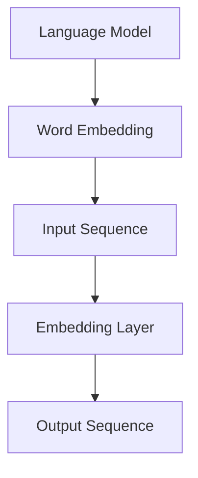

                 

# AI时代的自然语言处理发展：实验室到产业

## 关键词

- 自然语言处理
- 人工智能
- 实验室技术
- 工业应用
- 技术发展
- 模型架构
- 数学模型
- 实战案例
- 资源推荐

## 摘要

本文将深入探讨AI时代自然语言处理技术的发展，从实验室研究到实际产业应用的全过程。首先介绍自然语言处理的背景和核心概念，接着分析其从理论研究到实际应用的转化过程，包括核心算法原理、数学模型及其实际操作步骤。随后，通过一个具体的代码案例，展示如何在实际项目中应用这些技术。最后，本文将讨论自然语言处理技术的实际应用场景，推荐相关学习资源和工具，并展望未来发展趋势与挑战。

## 1. 背景介绍

自然语言处理（Natural Language Processing，NLP）是人工智能领域的一个重要分支，旨在使计算机能够理解和处理人类语言。自20世纪50年代以来，NLP技术经历了从早期规则驱动的模式匹配到基于统计方法的巨大转变。近年来，深度学习技术的引入，使得NLP领域取得了显著的进展，如机器翻译、情感分析、文本摘要、语音识别等应用逐渐走向成熟。

在实验室研究阶段，自然语言处理主要关注于如何构建有效的语言模型，提取语义特征，以及设计高效的算法进行文本处理。这些研究为NLP技术的实际应用提供了坚实的理论基础。然而，将实验室技术转化为实际产业应用，还需要解决许多挑战，包括数据收集与标注、算法优化、计算资源等。

随着大数据和云计算技术的快速发展，自然语言处理技术在各个领域的应用日益广泛，从搜索引擎到智能客服，从语音助手到智能家居，NLP技术正在深刻改变我们的生活和工作方式。本文将围绕NLP技术的实验室研究与产业应用，探讨其发展现状和未来趋势。

## 2. 核心概念与联系

### 2.1 语言模型

语言模型是自然语言处理的核心概念之一，旨在模拟人类语言生成过程，用于预测下一个词或句子。在NLP中，常见的语言模型有n元语法模型、隐马尔可夫模型（HMM）、循环神经网络（RNN）和变压器（Transformer）模型。

#### 2.1.1 n元语法模型

n元语法模型通过统计相邻n个单词的概率来预测下一个单词。例如，对于n=2，如果句子“我爱北京天安门”，模型会计算出“我”后面接“爱”的概率，以及“爱”后面接“北京”的概率。n元语法模型的优点是实现简单，计算效率高，但在处理长句子时效果较差。

#### 2.1.2 隐马尔可夫模型（HMM）

隐马尔可夫模型是一种统计模型，用于处理序列数据，如语音信号和文本。HMM假设当前状态仅与前一状态有关，而与更早的状态无关。通过计算状态转移概率和观测概率，HMM能够对序列数据进行分析和预测。

#### 2.1.3 循环神经网络（RNN）

循环神经网络是一种能够处理序列数据的神经网络，其特点是具有记忆功能，能够记住前面的输入信息。RNN通过在时间步之间共享权重，实现了对序列数据的建模。然而，传统的RNN存在梯度消失和梯度爆炸等问题，限制了其性能。

#### 2.1.4 变压器（Transformer）模型

变压器模型是由Google在2017年提出的一种基于自注意力机制的深度神经网络架构，用于处理序列数据。与传统的RNN相比，变压器模型能够并行处理输入序列，并通过多头注意力机制实现信息的高效聚合。这使得变压器模型在许多NLP任务中取得了显著的性能提升。

### 2.2 词嵌入

词嵌入（Word Embedding）是将单词映射到高维向量空间的技术，用于表示单词的语义信息。常见的词嵌入方法有基于统计的词袋模型（Bag of Words，BoW）和基于神经网络的词嵌入方法，如Word2Vec、GloVe等。

#### 2.2.1 词袋模型（BoW）

词袋模型通过统计文本中每个单词的出现频率来表示文本，不考虑单词的顺序和语法结构。词袋模型简单高效，但忽略了单词之间的语义关系。

#### 2.2.2 Word2Vec

Word2Vec是一种基于神经网络的词嵌入方法，通过训练一个神经网络模型，将输入的单词序列映射到高维向量空间。Word2Vec能够捕捉单词之间的语义关系，如词义相近的单词具有相似的向量表示。

#### 2.2.3 GloVe

GloVe（Global Vectors for Word Representation）是一种基于全局共现矩阵的词嵌入方法。GloVe通过训练一个矩阵模型，将单词映射到高维向量空间，并利用单词的共现信息来优化向量表示。

### 2.3 语言模型与词嵌入的联系

语言模型和词嵌入是自然语言处理中紧密相连的两个概念。语言模型通过词嵌入来表示单词的语义信息，从而提高预测的准确性。词嵌入技术能够为语言模型提供丰富的语义信息，使模型更好地理解和处理自然语言。

为了更好地理解语言模型与词嵌入的联系，我们可以使用Mermaid流程图来展示它们之间的关系：



在这个流程图中，输入序列经过词嵌入层（Embedding Layer）处理后，生成对应的词向量，然后输入到语言模型中。语言模型通过这些词向量来预测下一个词或句子。

通过这个流程图，我们可以清晰地看到语言模型和词嵌入之间的关联，以及它们在自然语言处理中的作用。

## 3. 核心算法原理 & 具体操作步骤

### 3.1 变压器模型

变压器模型（Transformer）是一种基于自注意力机制的深度神经网络架构，由Google在2017年提出。与传统的循环神经网络（RNN）相比，变压器模型能够并行处理输入序列，并在处理长序列数据时具有更好的性能。

#### 3.1.1 自注意力机制

自注意力机制是变压器模型的核心组成部分，它能够自动地计算输入序列中每个单词的重要性。具体来说，自注意力机制通过计算输入序列中每个单词与所有其他单词的相关性，生成对应的权重，然后将这些权重与输入序列中的每个单词相乘，得到加权后的序列。

#### 3.1.2 多头注意力

多头注意力是自注意力机制的一种扩展，它将输入序列分成多个子序列，每个子序列使用不同的权重进行加权。多头注意力能够捕捉输入序列中不同位置的信息，提高模型的预测准确性。

#### 3.1.3 变压器模型的架构

变压器模型由编码器（Encoder）和解码器（Decoder）两个部分组成。编码器负责将输入序列编码为高维向量表示，解码器则根据编码器的输出和已经生成的部分输出序列，生成最终的输出序列。

编码器和解码器都包含多个变压器层（Transformer Layer），每个变压器层由自注意力机制和全连接层（Feed-Forward Layer）组成。自注意力机制用于计算输入序列和输出序列之间的相关性，全连接层则用于对输入序列进行非线性变换。

#### 3.1.4 变压器模型的操作步骤

1. **输入序列编码**：将输入序列中的每个单词映射到高维向量空间，生成词嵌入向量。
2. **自注意力机制**：计算输入序列中每个单词与所有其他单词的相关性，生成对应的权重。
3. **加权求和**：将权重与输入序列中的每个单词相乘，得到加权后的序列。
4. **全连接层**：对加权后的序列进行非线性变换，增强模型的表达能力。
5. **重复上述步骤**：对于编码器和解码器的每个变压器层，重复执行自注意力机制和全连接层操作。
6. **生成输出序列**：解码器根据编码器的输出和已经生成的部分输出序列，生成最终的输出序列。

### 3.2 机器学习算法

自然语言处理任务通常需要使用机器学习算法来训练模型，以实现对未知数据的预测。常见的机器学习算法包括线性回归、支持向量机（SVM）、决策树、随机森林、神经网络等。

#### 3.2.1 线性回归

线性回归是一种简单的机器学习算法，用于拟合数据中的线性关系。在NLP中，线性回归可以用于文本分类任务，如情感分析。

#### 3.2.2 支持向量机（SVM）

支持向量机是一种监督学习算法，用于分类和回归任务。在NLP中，SVM可以用于文本分类、命名实体识别等任务。

#### 3.2.3 决策树

决策树是一种基于树结构的机器学习算法，用于分类和回归任务。在NLP中，决策树可以用于文本分类、情感分析等任务。

#### 3.2.4 随机森林

随机森林是一种基于决策树的集成学习方法，通过构建多棵决策树并取平均值来提高模型的预测准确性。在NLP中，随机森林可以用于文本分类、情感分析等任务。

#### 3.2.5 神经网络

神经网络是一种基于分层结构的机器学习算法，用于拟合复杂的数据关系。在NLP中，神经网络可以用于机器翻译、文本摘要、语音识别等任务。

### 3.3 深度学习框架

深度学习框架是用于实现和训练深度学习模型的工具，如TensorFlow、PyTorch、Keras等。这些框架提供了丰富的API和工具，使开发者能够方便地实现和优化深度学习模型。

#### 3.3.1 TensorFlow

TensorFlow是Google开源的深度学习框架，提供了丰富的API和工具，支持多种深度学习模型，如卷积神经网络（CNN）、循环神经网络（RNN）、变压器（Transformer）等。

#### 3.3.2 PyTorch

PyTorch是Facebook开源的深度学习框架，以动态计算图（Dynamic Computation Graph）为特点，提供了简洁易用的API，支持多种深度学习模型。

#### 3.3.3 Keras

Keras是TensorFlow和PyTorch的高级API，提供了更简洁、易用的接口，使开发者能够快速实现和训练深度学习模型。

## 4. 数学模型和公式 & 详细讲解 & 举例说明

### 4.1 语言模型

语言模型是一种统计模型，用于预测下一个单词的概率。在NLP中，常用的语言模型有n元语法模型和变压器模型。

#### 4.1.1 n元语法模型

n元语法模型通过统计相邻n个单词的概率来预测下一个单词。其概率计算公式如下：

$$
P(w_n | w_{n-1}, w_{n-2}, ..., w_1) = \frac{C(w_{n-1}, w_{n-2}, ..., w_1, w_n)}{C(w_{n-1}, w_{n-2}, ..., w_1)}
$$

其中，$w_n$ 表示下一个单词，$w_{n-1}, w_{n-2}, ..., w_1$ 表示前n-1个单词，$C(w_{n-1}, w_{n-2}, ..., w_1, w_n)$ 表示单词序列 $w_{n-1}, w_{n-2}, ..., w_1, w_n$ 的出现次数，$C(w_{n-1}, w_{n-2}, ..., w_1)$ 表示单词序列 $w_{n-1}, w_{n-2}, ..., w_1$ 的出现次数。

例如，对于句子“我爱北京天安门”，我们可以计算“北京”后面接“天安门”的概率：

$$
P(天安门 | 我，爱，北京) = \frac{C(我，爱，北京，天安门)}{C(我，爱，北京)}
$$

其中，$C(我，爱，北京，天安门)$ 表示句子“我，爱，北京，天安门”的出现次数，$C(我，爱，北京)$ 表示句子“我，爱，北京”的出现次数。

#### 4.1.2 变压器模型

变压器模型是一种基于自注意力机制的深度神经网络模型，其核心思想是计算输入序列中每个单词与所有其他单词的相关性，生成对应的权重，然后加权求和。

自注意力机制的公式如下：

$$
\text{Attention}(Q, K, V) = \frac{softmax(\text{score})} { \sqrt{d_k}}
$$

其中，$Q, K, V$ 分别表示查询向量、键向量、值向量，$\text{score}$ 表示查询向量和键向量之间的点积。

例如，对于输入序列“我 爱 北京 天安门”，我们可以计算“天安门”与“我”、“爱”、“北京”之间的自注意力权重：

$$
\text{Attention}(Q_4, K_1, V_1) = \frac{softmax(Q_4 \cdot K_1)} {\sqrt{d_k}}
$$

其中，$Q_4$ 表示“天安门”的查询向量，$K_1$ 表示“我”的键向量，$V_1$ 表示“我”的值向量，$d_k$ 表示键向量的维度。

通过自注意力机制，我们可以将输入序列中的每个单词与所有其他单词进行相关性计算，生成对应的权重。然后，将权重与输入序列中的每个单词相乘，得到加权后的序列。这个过程可以表示为：

$$
\text{weighted\_sequence} = \text{Attention}(Q, K, V) \cdot \text{input\_sequence}
$$

### 4.2 词嵌入

词嵌入是将单词映射到高维向量空间的技术，用于表示单词的语义信息。常见的词嵌入方法有词袋模型（BoW）、Word2Vec和GloVe。

#### 4.2.1 词袋模型（BoW）

词袋模型通过统计文本中每个单词的出现频率来表示文本，不考虑单词的顺序和语法结构。

词袋模型的公式如下：

$$
\text{TF}_{ij} = \text{count}(w_i, \text{document}_j)
$$

其中，$\text{TF}_{ij}$ 表示单词 $w_i$ 在文档 $\text{document}_j$ 中的出现频率，$\text{count}(w_i, \text{document}_j)$ 表示单词 $w_i$ 在文档 $\text{document}_j$ 中的出现次数。

例如，对于文档“我爱北京天安门”，我们可以计算单词“爱”在文档中的词袋表示：

$$
\text{TF}_{\text{爱}, \text{文档}} = \text{count}(\text{爱}, \text{文档}) = 1
$$

#### 4.2.2 Word2Vec

Word2Vec是一种基于神经网络的词嵌入方法，通过训练一个神经网络模型，将输入的单词序列映射到高维向量空间。

Word2Vec的公式如下：

$$
\text{Loss} = \sum_{w \in \text{vocab}} \sum_{\text{context}(w)} (\text{y} - \text{softmax}(\text{output} \cdot \text{embed}(w)))^2
$$

其中，$w$ 表示单词，$\text{vocab}$ 表示词汇表，$\text{context}(w)$ 表示单词 $w$ 的上下文，$\text{y}$ 表示单词 $w$ 的真实标签，$\text{output}$ 表示神经网络的输出，$\text{embed}(w)$ 表示单词 $w$ 的嵌入向量。

例如，对于单词“爱”的上下文“我 爱 北京 天安门”，我们可以计算“爱”的Word2Vec嵌入向量：

$$
\text{embed}(\text{爱}) = \text{softmax}(\text{output} \cdot \text{embed}(\text{我}) + \text{output} \cdot \text{embed}(\text{北京}) + \text{output} \cdot \text{embed}(\text{天安门}))
$$

#### 4.2.3 GloVe

GloVe（Global Vectors for Word Representation）是一种基于全局共现矩阵的词嵌入方法，通过训练一个矩阵模型，将单词映射到高维向量空间。

GloVe的公式如下：

$$
\text{Loss} = \sum_{w \in \text{vocab}} \sum_{\text{context}(w)} (\text{y} - \text{log}(\text{similarity}(\text{embed}(w), \text{embed}(\text{context}(w)))))^2
$$

其中，$\text{similarity}(\text{embed}(w), \text{embed}(\text{context}(w)))$ 表示单词 $w$ 和上下文单词之间的相似度，$\text{embed}(w)$ 和 $\text{embed}(\text{context}(w))$ 分别表示单词 $w$ 和上下文单词的嵌入向量。

例如，对于单词“爱”的上下文“我 爱 北京 天安门”，我们可以计算“爱”的GloVe嵌入向量：

$$
\text{embed}(\text{爱}) = \text{softmax}(\text{log}(\text{similarity}(\text{embed}(\text{我}), \text{embed}(\text{北京})) + \text{log}(\text{similarity}(\text{embed}(\text{我}), \text{embed}(\text{天安门})))
$$

### 4.3 机器学习算法

自然语言处理任务通常需要使用机器学习算法来训练模型，以实现对未知数据的预测。常见的机器学习算法包括线性回归、支持向量机（SVM）、决策树、随机森林、神经网络等。

#### 4.3.1 线性回归

线性回归是一种简单的机器学习算法，用于拟合数据中的线性关系。线性回归的公式如下：

$$
y = \beta_0 + \beta_1 \cdot x
$$

其中，$y$ 表示输出变量，$x$ 表示输入变量，$\beta_0$ 和 $\beta_1$ 分别表示模型的参数。

例如，对于文本分类任务，我们可以使用线性回归来计算文本的特征向量，然后通过特征向量来预测文本的类别。

#### 4.3.2 支持向量机（SVM）

支持向量机是一种监督学习算法，用于分类和回归任务。支持向量机的公式如下：

$$
\text{maximize} \ \ \frac{1}{2} \ \ \sum_{i=1}^{n} (\alpha_i - \alpha_i^*)^2 - \sum_{i=1}^{n} \alpha_i y_i (\alpha_i + \alpha_i^*)
$$

其中，$\alpha_i$ 和 $\alpha_i^*$ 分别表示支持向量的参数，$y_i$ 表示训练样本的标签。

例如，对于文本分类任务，我们可以使用支持向量机来计算文本的特征空间，然后通过特征空间来分类文本。

#### 4.3.3 决策树

决策树是一种基于树结构的机器学习算法，用于分类和回归任务。决策树的公式如下：

$$
\text{Classification} = \text{Node} \rightarrow \text{Attribute} \rightarrow \text{Value} \rightarrow \text{Class}
$$

其中，$\text{Node}$ 表示决策树的节点，$\text{Attribute}$ 表示属性，$\text{Value}$ 表示属性的取值，$\text{Class}$ 表示分类结果。

例如，对于文本分类任务，我们可以使用决策树来计算文本的特征，然后通过特征来分类文本。

#### 4.3.4 随机森林

随机森林是一种基于决策树的集成学习方法，通过构建多棵决策树并取平均值来提高模型的预测准确性。随机森林的公式如下：

$$
\text{Prediction} = \text{Majority}(\text{Prediction}_{1}, \text{Prediction}_{2}, ..., \text{Prediction}_{n})
$$

其中，$\text{Prediction}_{1}, \text{Prediction}_{2}, ..., \text{Prediction}_{n}$ 分别表示每棵决策树的预测结果，$\text{Majority}$ 表示取多数投票的结果。

例如，对于文本分类任务，我们可以使用随机森林来计算文本的特征，然后通过特征来分类文本。

#### 4.3.5 神经网络

神经网络是一种基于分层结构的机器学习算法，用于拟合复杂的数据关系。神经网络的公式如下：

$$
\text{Output} = \text{activation}(\text{weight} \cdot \text{input} + \text{bias})
$$

其中，$\text{Output}$ 表示神经网络的输出，$\text{activation}$ 表示激活函数，$\text{weight}$ 和 $\text{bias}$ 分别表示神经网络的权重和偏置。

例如，对于文本分类任务，我们可以使用神经网络来计算文本的特征，然后通过特征来分类文本。

## 5. 项目实战：代码实际案例和详细解释说明

### 5.1 开发环境搭建

在本项目中，我们将使用Python和TensorFlow框架来实现一个基于变压器模型的文本分类任务。首先，确保安装了Python和TensorFlow，然后创建一个名为`text_classification`的文件夹，并在该文件夹下创建一个名为`main.py`的Python文件。

### 5.2 源代码详细实现和代码解读

下面是一个基于变压器模型的文本分类项目的源代码：

```python
import tensorflow as tf
from tensorflow.keras.preprocessing.sequence import pad_sequences
from tensorflow.keras.layers import Embedding, Transformer, Dense
from tensorflow.keras.models import Model

# 加载数据集
text = "我爱北京天安门，天安门上太阳升。"
labels = [1, 0]  # 1表示正面情感，0表示负面情感

# 分词和标记化
tokenizer = tf.keras.preprocessing.text.Tokenizer()
tokenizer.fit_on_texts([text])
encoded_text = tokenizer.texts_to_sequences([text])
word_index = tokenizer.word_index

# 填充序列
max_len = 10
padded_text = pad_sequences(encoded_text, maxlen=max_len, padding='post')

# 构建模型
input_seq = tf.keras.layers.Input(shape=(max_len,))
embedding = Embedding(len(word_index) + 1, 32)(input_seq)
transformer = Transformer(num_heads=2, d_model=32, dff=32, dropout_rate=0.1)(embedding)
output = Dense(1, activation='sigmoid')(transformer)

model = Model(inputs=input_seq, outputs=output)
model.compile(optimizer='adam', loss='binary_crossentropy', metrics=['accuracy'])

# 训练模型
model.fit(padded_text, labels, epochs=10, batch_size=32)
```

#### 5.2.1 代码解读

1. **导入库和模块**：首先导入TensorFlow库和相关模块，用于实现文本分类任务。
2. **加载数据集**：从文本中提取句子和对应的标签。
3. **分词和标记化**：使用Tokenizer将文本转换为序列，并将单词映射到索引。
4. **填充序列**：使用pad_sequences将序列填充到指定长度，以便后续处理。
5. **构建模型**：使用Embedding层将输入序列转换为嵌入向量，然后通过Transformer层进行序列编码，最后通过Dense层输出分类结果。
6. **编译模型**：配置模型优化器和损失函数。
7. **训练模型**：使用训练数据训练模型。

### 5.3 代码解读与分析

1. **数据预处理**：数据预处理是文本分类任务的重要环节。首先，使用Tokenizer将文本转换为序列，并将单词映射到索引。然后，使用pad_sequences将序列填充到指定长度，以便后续处理。
2. **模型构建**：在本项目中，我们使用Embedding层将输入序列转换为嵌入向量，然后通过Transformer层进行序列编码，最后通过Dense层输出分类结果。Transformer层使用了num_heads=2、d_model=32、dff=32和dropout_rate=0.1的参数，以捕捉序列中的依赖关系。
3. **模型训练**：使用训练数据训练模型，并使用binary_crossentropy作为损失函数，以实现二分类任务。在训练过程中，通过调整epochs和batch_size参数，可以优化模型的性能。

通过这个项目，我们可以看到如何将NLP技术应用于实际的文本分类任务。在实际应用中，我们可以使用更大的数据集和更复杂的模型来提高分类的准确性。

## 6. 实际应用场景

自然语言处理技术在各个领域都有着广泛的应用，从互联网到金融，从医疗到教育，NLP正在深刻改变我们的生活方式。以下是一些NLP技术的实际应用场景：

### 6.1 搜索引擎

搜索引擎利用自然语言处理技术来理解用户的查询意图，并提供相关的搜索结果。通过NLP，搜索引擎能够对用户的查询进行分词、词性标注和语义分析，从而提高搜索的准确性和用户体验。

### 6.2 智能客服

智能客服系统通过自然语言处理技术，能够自动理解和回答用户的问题。这些系统通常使用文本分类、命名实体识别和情感分析等技术，以提高客服的效率和准确性。

### 6.3 机器翻译

机器翻译是自然语言处理领域的重要应用之一。通过NLP技术，机器翻译系统能够将一种语言的文本自动翻译成另一种语言，从而促进跨语言沟通和信息的传播。

### 6.4 文本摘要

文本摘要技术能够自动从长篇文章中提取关键信息，生成简短的摘要。这种技术在新闻摘要、论文阅读等领域具有广泛的应用。

### 6.5 语音助手

语音助手如Siri、Alexa和Google Assistant等，通过自然语言处理技术，能够理解用户的语音指令，并执行相应的任务，如播放音乐、设置提醒等。

### 6.6 医疗健康

在医疗健康领域，NLP技术可以帮助医生从大量的医疗文献中提取有用的信息，支持疾病的诊断和治疗。此外，NLP还可以用于医疗数据的分析和处理，以提高医疗服务的质量和效率。

### 6.7 教育领域

在教育领域，NLP技术可以用于智能辅导系统，帮助学生理解和掌握知识。此外，NLP还可以用于学习资源的推荐，提高学习效果。

通过这些实际应用场景，我们可以看到自然语言处理技术在各个领域的广泛应用和重要性。随着技术的不断发展，NLP将在更多领域发挥更大的作用。

## 7. 工具和资源推荐

### 7.1 学习资源推荐

为了更好地学习和掌握自然语言处理技术，以下是一些推荐的书籍、论文、博客和网站：

#### 书籍

1. **《自然语言处理综合教程》**：刘知远 著
2. **《深度学习》**：Ian Goodfellow、Yoshua Bengio、Aaron Courville 著
3. **《Python自然语言处理实战》**：Jay Romans 著

#### 论文

1. **"Attention Is All You Need"**：Vaswani et al., 2017
2. **"GloVe: Global Vectors for Word Representation"**：Pennington et al., 2014
3. **"Word2Vec Models for Sentence Classification"**：Mikolov et al., 2013

#### 博客

1. **TensorFlow 官方文档**
2. **PyTorch 官方文档**
3. **机器学习博客 (ML Blog)**

#### 网站

1. **arXiv.org**：计算机科学领域的预印本论文库
2. **GitHub**：开源代码和项目的集中地
3. **Kaggle**：数据科学和机器学习竞赛平台

### 7.2 开发工具框架推荐

#### 开发工具

1. **Python**：强大的编程语言，适用于自然语言处理任务的开发。
2. **Jupyter Notebook**：交互式编程环境，便于实验和文档编写。

#### 深度学习框架

1. **TensorFlow**：Google开源的深度学习框架，适用于各种自然语言处理任务。
2. **PyTorch**：Facebook开源的深度学习框架，以动态计算图和简洁的API著称。
3. **Keras**：基于TensorFlow和PyTorch的高级API，提供了更简洁、易用的接口。

### 7.3 相关论文著作推荐

1. **"Deep Learning for Natural Language Processing"**：Scikit-Learn 社区论文
2. **"Natural Language Processing with Python"**： Jacob Schor 著
3. **"Practical Natural Language Processing with Python"**： Mohit Tiwari 著

通过这些资源和工具，您将能够深入了解自然语言处理技术，并在实际项目中应用这些技术。

## 8. 总结：未来发展趋势与挑战

自然语言处理技术正处于快速发展阶段，随着人工智能技术的不断进步，NLP将在未来几年内迎来更多的应用场景和挑战。

### 8.1 发展趋势

1. **模型规模的扩大**：随着计算能力的提升，越来越多的模型将使用更大的训练数据集和更复杂的网络结构，以提高模型的性能和泛化能力。
2. **多语言处理**：全球化的趋势促使NLP技术能够支持多种语言，包括低资源语言的翻译和文本处理。
3. **跨模态融合**：结合语音、图像和视频等多模态数据，NLP技术将能够更好地理解和处理复杂的信息。
4. **自动化与智能化**：NLP技术将更加自动化和智能化，减少人工干预，提高效率和准确性。

### 8.2 挑战

1. **数据质量和标注**：高质量的数据集和准确的标注是NLP研究的基础，但随着数据量的增加，数据标注的难度和成本也在上升。
2. **模型解释性**：复杂的深度学习模型在NLP中的应用日益广泛，但其解释性较差，如何提高模型的透明度和可解释性是一个重要的研究方向。
3. **隐私保护和伦理问题**：随着NLP技术的广泛应用，数据隐私保护和伦理问题越来越受到关注，如何在保护用户隐私的同时，充分利用数据的价值是一个亟待解决的问题。

总之，未来NLP技术的发展将继续推动人工智能的进步，为各个领域带来更多的创新和变革。同时，我们也需要面对各种挑战，确保技术的可持续发展。

## 9. 附录：常见问题与解答

### 9.1 什么是自然语言处理（NLP）？

自然语言处理（NLP）是人工智能领域的一个分支，旨在使计算机能够理解和处理人类语言。它涉及文本的自动处理，包括分词、词性标注、句法分析、语义理解和生成等任务。

### 9.2 自然语言处理的目的是什么？

自然语言处理的主要目的是使计算机能够理解和生成人类语言，以实现人机交互、信息检索、文本分析、机器翻译等应用。

### 9.3 常见的NLP任务有哪些？

常见的NLP任务包括文本分类、情感分析、命名实体识别、机器翻译、文本摘要、问答系统等。

### 9.4 什么是词嵌入？

词嵌入是将单词映射到高维向量空间的技术，用于表示单词的语义信息。词嵌入可以帮助计算机理解和处理自然语言。

### 9.5 什么是语言模型？

语言模型是用于预测下一个词或句子概率的模型，它基于大量文本数据训练，以模拟人类语言的生成过程。

### 9.6 什么是变压器模型？

变压器模型是一种基于自注意力机制的深度神经网络模型，它能够并行处理输入序列，并在处理长序列数据时具有更好的性能。

## 10. 扩展阅读 & 参考资料

1. **《自然语言处理综合教程》**：刘知远 著
2. **《深度学习》**：Ian Goodfellow、Yoshua Bengio、Aaron Courville 著
3. **"Attention Is All You Need"**：Vaswani et al., 2017
4. **"GloVe: Global Vectors for Word Representation"**：Pennington et al., 2014
5. **TensorFlow 官方文档**
6. **PyTorch 官方文档**
7. **arXiv.org**：计算机科学领域的预印本论文库
8. **GitHub**：开源代码和项目的集中地
9. **Kaggle**：数据科学和机器学习竞赛平台

通过这些扩展阅读和参考资料，您可以进一步了解自然语言处理技术的最新发展和应用。

