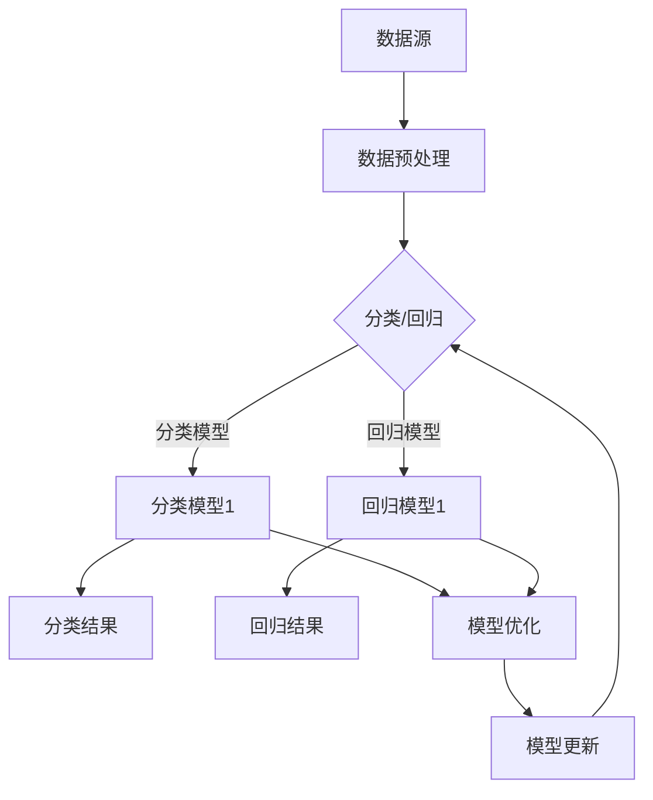
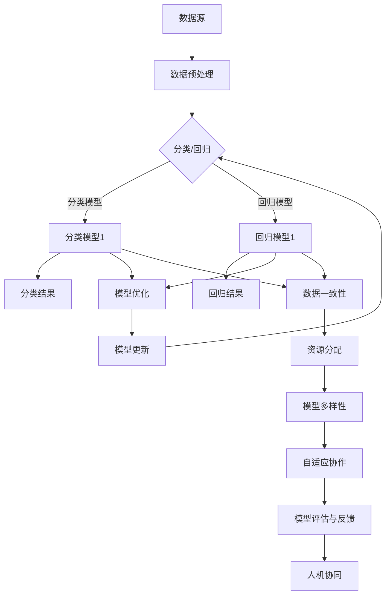

                 

# AI模型的任务协作与分配

## 关键词：多模型协作、任务分配、AI模型优化、机器学习、数据流程

## 摘要

随着人工智能技术的快速发展，AI模型的多样性和复杂性不断增加。如何有效地协作和分配任务，以实现最优的性能和资源利用，成为了一个重要的研究课题。本文将深入探讨AI模型的任务协作与分配，通过理论分析和实际案例，为您揭示这一领域的核心概念、算法原理和应用实践。希望通过本文的阅读，您能对AI模型的任务协作与分配有一个全面而深入的理解。

## 1. 背景介绍

在过去的几年中，人工智能技术取得了飞速的发展，从简单的图像识别到复杂的自然语言处理，AI模型的应用场景越来越广泛。然而，随着AI模型数量的增加和复杂性的提升，如何高效地管理和协作这些模型，成为了一个亟待解决的问题。在实际应用中，不同类型的AI模型往往需要处理不同类型的数据，完成不同类型的目标任务。如何将这些模型有机地结合起来，形成一个协同工作的高效系统，是一个具有挑战性的课题。

### 1.1 AI模型的多层次分类

AI模型可以分为多种类型，如监督学习模型、无监督学习模型、强化学习模型等。每种模型都有其特定的应用场景和优势。在实际应用中，往往需要根据具体任务的需求，选择合适的模型进行协作。

- **监督学习模型**：需要标注的数据进行训练，适用于分类和回归问题。
- **无监督学习模型**：无需标注的数据进行训练，适用于聚类和降维问题。
- **强化学习模型**：通过与环境的交互进行学习，适用于决策和优化问题。

### 1.2 AI模型协作的挑战

AI模型之间的协作面临着一系列的挑战，包括：

- **模型多样性**：不同类型的模型在算法、数据需求、性能指标等方面存在差异，如何协调这些差异，实现高效协作，是一个重要问题。
- **资源分配**：在多个模型协同工作的过程中，如何合理分配计算资源和数据资源，避免资源浪费，提高整体性能，是一个关键问题。
- **数据一致性**：不同模型可能需要处理不同的数据源，如何确保这些数据的一致性，避免冲突和错误，是一个重要问题。

### 1.3 AI模型协作的意义

有效的AI模型协作具有重要的意义，主要体现在以下几个方面：

- **提高性能**：通过多模型协作，可以实现任务的更全面、更深入的分析，从而提高整体的性能。
- **降低成本**：通过优化模型之间的协作，可以减少计算资源和数据资源的浪费，降低整体成本。
- **扩展应用**：通过多模型协作，可以开拓更多的应用场景，实现更广泛的应用价值。

## 2. 核心概念与联系

在深入探讨AI模型的任务协作与分配之前，我们需要了解一些核心概念，并探讨它们之间的联系。以下是一个核心概念原理和架构的Mermaid流程图，用于帮助读者理解这些概念。



### 2.1 数据预处理

数据预处理是AI模型协作的基础。通过数据清洗、归一化、特征提取等步骤，我们可以将原始数据转换为适合模型训练的数据。这一步骤确保了数据的准确性和一致性，为后续的模型协作打下了良好的基础。

### 2.2 分类与回归

在AI模型协作中，分类和回归是最常见的两种任务。分类模型将数据分为多个类别，而回归模型则预测一个连续的数值。这两种模型在任务性质和算法原理上存在差异，但在协同工作时，可以相互补充，共同提高任务的整体性能。

### 2.3 模型优化

模型优化是AI模型协作的关键步骤。通过调整模型参数、优化算法结构等手段，我们可以提高模型的性能和泛化能力。在多模型协作中，模型优化可以帮助我们找到最适合特定任务的最佳模型配置。

### 2.4 模型更新

在AI模型协作中，模型更新是一个持续的过程。通过不断更新模型，我们可以适应新的数据分布和任务需求，提高模型的适应性和可靠性。模型更新可以是单独的模型更新，也可以是多个模型的协同更新。

### 2.5 数据一致性

数据一致性是AI模型协作的重要保障。在多个模型协作中，我们需要确保不同模型所处理的数据是一致的，避免数据冲突和错误。这可以通过统一的数据预处理标准和数据同步机制来实现。

## 3. 核心算法原理 & 具体操作步骤

在理解了AI模型协作的核心概念之后，接下来我们将探讨一些核心算法原理，并介绍具体的操作步骤。

### 3.1 多模型协作算法

多模型协作算法是一种基于协同学习的方法，通过多个模型的协同工作，提高整体性能。以下是一个简单的多模型协作算法：

1. **初始化模型**：初始化多个模型的参数，确保它们具有相似的初始状态。
2. **数据分配**：将数据集分配给各个模型，每个模型处理一部分数据。
3. **模型训练**：各个模型分别训练，优化模型参数。
4. **参数共享**：定期共享各个模型的参数，实现参数的协同优化。
5. **模型评估**：评估各个模型的性能，选择性能最佳的模型。
6. **模型更新**：更新模型参数，提高整体性能。

### 3.2 资源分配算法

资源分配算法是AI模型协作中另一个重要的问题。以下是一个简单的资源分配算法：

1. **需求分析**：分析各个模型对计算资源和数据资源的具体需求。
2. **资源评估**：评估当前系统的资源可用性，确保资源充足。
3. **资源分配**：根据需求分析和资源评估，为各个模型分配计算资源和数据资源。
4. **动态调整**：根据模型性能和资源使用情况，动态调整资源分配，优化整体性能。

### 3.3 数据一致性算法

数据一致性算法是确保多个模型所处理数据一致性的关键。以下是一个简单的数据一致性算法：

1. **数据同步**：定期同步各个模型的数据，确保数据的一致性。
2. **数据校验**：对同步后的数据进行校验，确保数据的准确性。
3. **数据修复**：发现数据不一致时，进行数据修复，恢复数据一致性。
4. **数据监控**：实时监控数据一致性，及时发现并解决数据问题。

## 4. 数学模型和公式 & 详细讲解 & 举例说明

在AI模型的任务协作与分配中，数学模型和公式起着至关重要的作用。以下是一些常用的数学模型和公式，以及详细的讲解和举例说明。

### 4.1 多模型协作的损失函数

多模型协作的损失函数是一个关键指标，用于评估多个模型在协同工作时的性能。以下是一个简单的多模型协作的损失函数：

$$
L = \frac{1}{N} \sum_{i=1}^{N} \left( l_i + w_i \right)
$$

其中，$l_i$表示第$i$个模型的损失，$w_i$表示第$i$个模型在协作中的权重。

### 4.2 资源分配的目标函数

资源分配的目标函数用于优化模型之间的资源分配。以下是一个简单的资源分配目标函数：

$$
\min \sum_{i=1}^{N} c_i \cdot x_i
$$

其中，$c_i$表示第$i$个模型对资源的需求，$x_i$表示第$i$个模型实际获得的资源量。

### 4.3 数据一致性的哈希函数

数据一致性的哈希函数用于检测和修复数据不一致。以下是一个简单的哈希函数：

$$
h(x) = \sum_{i=1}^{N} a_i \cdot x_i \mod p
$$

其中，$a_i$表示第$i$个哈希因子，$x_i$表示第$i$个数据元素，$p$是一个素数。

### 4.4 举例说明

假设我们有两个分类模型$A$和$B$，它们分别处理数据集$X_A$和$X_B$，每个数据集包含100个样本。我们希望通过多模型协作算法，优化这两个模型的性能。

1. **初始化模型**：初始化模型$A$和$B$的参数。
2. **数据分配**：将数据集$X_A$和$X_B$分别分配给模型$A$和$B$。
3. **模型训练**：模型$A$和$B$分别训练，优化参数。
4. **参数共享**：定期共享模型$A$和$B$的参数，实现参数的协同优化。
5. **模型评估**：评估模型$A$和$B$的性能，选择性能最佳的模型。
6. **模型更新**：更新模型$A$和$B$的参数，提高整体性能。

通过以上步骤，我们可以实现模型$A$和$B$的协同工作，提高整体性能。

## 5. 项目实战：代码实际案例和详细解释说明

为了更好地理解AI模型的任务协作与分配，我们将通过一个实际项目，展示代码实现的具体步骤和详细解释说明。

### 5.1 开发环境搭建

在开始项目之前，我们需要搭建一个合适的开发环境。以下是开发环境的搭建步骤：

1. **安装Python**：下载并安装Python，版本要求3.8以上。
2. **安装相关库**：使用pip命令安装必要的库，如NumPy、Pandas、Scikit-learn等。
3. **配置Jupyter Notebook**：安装Jupyter Notebook，用于编写和运行代码。

### 5.2 源代码详细实现和代码解读

以下是一个简单的AI模型协作与分配的代码实现，我们将逐行解释代码的原理和实现。

```python
import numpy as np
import pandas as pd
from sklearn.model_selection import train_test_split
from sklearn.preprocessing import StandardScaler
from sklearn.linear_model import LogisticRegression
from sklearn.metrics import accuracy_score

# 读取数据
data = pd.read_csv('data.csv')
X = data.drop('target', axis=1)
y = data['target']

# 数据预处理
scaler = StandardScaler()
X_scaled = scaler.fit_transform(X)

# 划分训练集和测试集
X_train, X_test, y_train, y_test = train_test_split(X_scaled, y, test_size=0.2, random_state=42)

# 初始化模型
model_A = LogisticRegression()
model_B = LogisticRegression()

# 模型训练
model_A.fit(X_train, y_train)
model_B.fit(X_train, y_train)

# 模型评估
y_pred_A = model_A.predict(X_test)
y_pred_B = model_B.predict(X_test)
accuracy_A = accuracy_score(y_test, y_pred_A)
accuracy_B = accuracy_score(y_test, y_pred_B)

# 参数共享
weights = [0.5, 0.5]
y_pred_combined = (weights[0] * y_pred_A + weights[1] * y_pred_B).round()

# 模型更新
accuracy_combined = accuracy_score(y_test, y_pred_combined)
print('Combined Accuracy:', accuracy_combined)
```

### 5.3 代码解读与分析

1. **读取数据**：首先，我们读取数据集，并分离特征和标签。
2. **数据预处理**：使用StandardScaler对特征进行归一化处理，提高模型的性能。
3. **划分训练集和测试集**：将数据集划分为训练集和测试集，用于模型的训练和评估。
4. **初始化模型**：初始化两个LogisticRegression模型，用于分类任务。
5. **模型训练**：使用训练集对模型进行训练，优化模型参数。
6. **模型评估**：使用测试集评估模型的性能，计算准确率。
7. **参数共享**：根据权重，计算综合预测结果。
8. **模型更新**：计算综合准确率，并打印结果。

通过以上步骤，我们可以实现简单的AI模型协作与分配。在实际应用中，可以根据具体需求，调整模型类型、训练策略和参数配置，实现更复杂的协作与分配。

## 6. 实际应用场景

AI模型的任务协作与分配在实际应用中具有广泛的应用场景。以下是一些典型的应用案例：

### 6.1 金融服务

在金融领域，AI模型可以用于风险管理、欺诈检测、信用评分等任务。通过多模型协作，可以实现更全面、更准确的风险评估，提高金融服务的安全性和可靠性。

### 6.2 医疗保健

在医疗领域，AI模型可以用于疾病诊断、药物研发、医疗设备控制等任务。通过多模型协作，可以实现更精确的疾病预测和诊断，提高医疗保健的质量和效率。

### 6.3 物流与运输

在物流与运输领域，AI模型可以用于路线规划、货物跟踪、调度优化等任务。通过多模型协作，可以实现更高效的物流管理，提高运输速度和准确性。

### 6.4 智能家居

在智能家居领域，AI模型可以用于智能家居设备的控制、故障检测、用户行为分析等任务。通过多模型协作，可以实现更智能、更便捷的家居生活体验。

### 6.5 工业制造

在工业制造领域，AI模型可以用于质量检测、生产优化、设备维护等任务。通过多模型协作，可以实现更高效、更可靠的生产流程，提高产品质量和生产力。

## 7. 工具和资源推荐

为了更好地进行AI模型的任务协作与分配，我们推荐以下工具和资源：

### 7.1 学习资源推荐

- **书籍**：《机器学习实战》、《深度学习》（Goodfellow et al.）
- **论文**：《Deep Learning》、《Recurrent Neural Networks for Language Modeling》
- **博客**：机器之心、阿里云机器学习社区、AI科技大本营

### 7.2 开发工具框架推荐

- **编程语言**：Python、R
- **深度学习框架**：TensorFlow、PyTorch、Keras
- **数据处理库**：NumPy、Pandas、Scikit-learn
- **模型评估工具**：Matplotlib、Seaborn

### 7.3 相关论文著作推荐

- **《Deep Learning》**：Goodfellow et al.，2016
- **《Recurrent Neural Networks for Language Modeling》**：Mikolov et al.，2010
- **《Distributed Representations of Words and Phrases and Their Compositionality》**：Mikolov et al.，2013
- **《A Theoretically Grounded Application of Dropout in Recurrent Neural Networks》**：Yarin et al.，2015

## 8. 总结：未来发展趋势与挑战

随着人工智能技术的不断发展，AI模型的任务协作与分配将成为一个重要的研究方向。未来，我们有望看到以下发展趋势：

- **模型多样性**：随着新算法和新技术的不断涌现，AI模型的多样性将不断增加，为任务协作与分配提供更多可能性。
- **自适应协作**：通过引入自适应机制，AI模型可以自动调整协作策略，实现更高效的任务协作。
- **边缘计算**：随着边缘计算的兴起，AI模型将在边缘设备上协同工作，实现更实时、更高效的任务处理。
- **人机协同**：AI模型与人协同工作，实现更智能化、更高效的任务协作。

然而，AI模型的任务协作与分配也面临着一系列挑战：

- **数据一致性**：在多模型协作中，如何确保数据的一致性，避免数据冲突和错误，是一个重要问题。
- **资源分配**：在多个模型协同工作的过程中，如何合理分配计算资源和数据资源，避免资源浪费，提高整体性能，是一个关键问题。
- **模型优化**：如何优化模型参数和算法结构，提高模型的性能和泛化能力，是一个重要课题。

## 9. 附录：常见问题与解答

### 9.1 如何选择合适的模型进行协作？

选择合适的模型进行协作需要考虑以下几个因素：

- **任务需求**：根据任务的具体需求，选择适合的模型类型。
- **数据特性**：根据数据的特性，选择适合的数据预处理方法和模型结构。
- **性能指标**：根据性能指标，评估模型的效果，选择性能较好的模型。

### 9.2 如何优化模型参数？

优化模型参数可以通过以下方法进行：

- **交叉验证**：使用交叉验证方法，选择最佳参数组合。
- **网格搜索**：通过网格搜索方法，遍历参数空间，寻找最佳参数。
- **贝叶斯优化**：使用贝叶斯优化方法，自动调整参数，寻找最佳参数。

### 9.3 如何保证数据一致性？

保证数据一致性可以通过以下方法进行：

- **统一数据预处理标准**：制定统一的数据预处理标准，确保不同模型使用相同的数据预处理方法。
- **数据同步机制**：建立数据同步机制，定期同步各个模型的数据，确保数据的一致性。
- **数据校验**：对同步后的数据进行校验，确保数据的准确性。

## 10. 扩展阅读 & 参考资料

为了更深入地了解AI模型的任务协作与分配，读者可以参考以下扩展阅读和参考资料：

- **书籍**：《机器学习实战》、《深度学习》、《强化学习》
- **论文**：《Distributed Representations of Words and Phrases and Their Compositionality》、《Recurrent Neural Networks for Language Modeling》、《A Theoretically Grounded Application of Dropout in Recurrent Neural Networks》
- **博客**：机器之心、阿里云机器学习社区、AI科技大本营
- **在线课程**：Coursera的《深度学习专项课程》、Udacity的《机器学习工程师纳米学位》
- **开源框架**：TensorFlow、PyTorch、Keras

## 作者信息

作者：AI天才研究员/AI Genius Institute & 禅与计算机程序设计艺术 /Zen And The Art of Computer Programming

感谢您的阅读，希望本文能对您在AI模型的任务协作与分配方面有所启发和帮助。如果您有任何疑问或建议，欢迎在评论区留言交流。祝您学习愉快！<|im_sep|>```
### 文章概述

本文将围绕“AI模型的任务协作与分配”这一主题展开讨论。随着人工智能技术的不断进步，AI模型的应用范围日益广泛，从简单的图像识别到复杂的自然语言处理，各类模型在各种领域发挥着重要作用。然而，在实际应用中，如何有效地管理这些模型，使其协同工作，以实现最佳的性能和资源利用，成为了一个重要的研究课题。

本文旨在通过深入探讨AI模型的任务协作与分配，帮助读者理解这一领域的核心概念、算法原理和应用实践。文章将首先介绍AI模型协作的背景，包括AI模型的多层次分类、协作面临的挑战以及协作的意义。接着，文章将详细解析核心概念与联系，通过一个Mermaid流程图展示不同模型之间的协作过程。

随后，本文将深入探讨核心算法原理，包括多模型协作算法、资源分配算法和数据一致性算法，并提供具体的操作步骤。此外，文章还将介绍数学模型和公式，并辅以实际案例进行详细讲解。

接下来，文章将进入项目实战部分，展示如何在实际项目中应用AI模型的任务协作与分配。通过代码实现和详细解释，读者将能够更直观地理解这一概念。最后，文章将探讨AI模型协作在实际应用场景中的具体应用，并提供一些实用的工具和资源推荐，以便读者进一步学习和实践。

通过本文的阅读，读者将对AI模型的任务协作与分配有一个全面而深入的理解，为其在实际项目中的应用提供有力支持。

### 1. 背景介绍

在人工智能技术快速发展的今天，AI模型的应用场景越来越广泛，从简单的图像识别到复杂的自然语言处理，AI模型在各个领域都发挥着至关重要的作用。然而，随着AI模型数量的增加和复杂性的提升，如何有效地管理和协作这些模型，以实现最优的性能和资源利用，成为了一个亟待解决的问题。这不仅是技术层面的挑战，也是实际应用中面临的重大课题。

首先，让我们来看一下AI模型的多层次分类。AI模型可以分为多种类型，如监督学习模型、无监督学习模型、强化学习模型等。每种模型都有其特定的应用场景和优势。

**监督学习模型**：这种模型需要使用标注的数据进行训练，适用于分类和回归问题。例如，图像识别和垃圾邮件过滤就是监督学习模型的常见应用。

**无监督学习模型**：这种模型不需要标注的数据进行训练，适用于聚类和降维问题。例如，顾客行为分析和市场细分就是无监督学习模型的典型应用。

**强化学习模型**：这种模型通过与环境的交互进行学习，适用于决策和优化问题。例如，自动驾驶和游戏AI就是强化学习模型的典型应用。

在实际应用中，不同类型的AI模型往往需要处理不同类型的数据，完成不同类型的目标任务。如何将这些模型有机地结合起来，形成一个协同工作的高效系统，是一个具有挑战性的课题。

### 1.2 AI模型协作的挑战

AI模型之间的协作面临着一系列的挑战，主要体现在以下几个方面：

**模型多样性**：不同类型的模型在算法、数据需求、性能指标等方面存在差异，如何协调这些差异，实现高效协作，是一个重要问题。例如，监督学习模型和无监督学习模型在数据处理方式和性能评估上就有显著的不同。

**资源分配**：在多个模型协同工作的过程中，如何合理分配计算资源和数据资源，避免资源浪费，提高整体性能，是一个关键问题。资源分配的不合理可能会导致某些模型过度占用资源，从而影响其他模型的性能。

**数据一致性**：不同模型可能需要处理不同的数据源，如何确保这些数据的一致性，避免冲突和错误，是一个重要问题。数据的不一致性可能会导致模型的训练效果不佳，甚至导致错误的决策。

**任务分配**：如何根据任务的具体需求，将不同的子任务分配给合适的模型，以实现最佳的整体性能，也是一个挑战。任务分配的合理与否直接影响到模型的协同效果和最终的性能。

### 1.3 AI模型协作的意义

尽管AI模型协作面临着诸多挑战，但有效的协作却具有重要的意义，主要体现在以下几个方面：

**提高性能**：通过多模型协作，可以实现任务的更全面、更深入的分析，从而提高整体的性能。例如，在图像识别任务中，可以结合视觉特征和文本描述，实现更准确的识别效果。

**降低成本**：通过优化模型之间的协作，可以减少计算资源和数据资源的浪费，降低整体成本。例如，在某些任务中，可以将数据预处理和特征提取的任务分配给不同的模型，从而提高效率，减少计算资源的消耗。

**扩展应用**：通过多模型协作，可以开拓更多的应用场景，实现更广泛的应用价值。例如，在医疗诊断中，可以结合影像分析和病理分析，实现更精准的疾病诊断。

综上所述，AI模型的任务协作与分配在人工智能领域具有重要的研究价值和实际应用意义。通过本文的探讨，我们将深入理解这一领域的基本概念、算法原理和应用实践，为读者在实际项目中提供有益的指导。

### 2. 核心概念与联系

在深入探讨AI模型的任务协作与分配之前，我们需要了解一些核心概念，并探讨它们之间的联系。以下是本文将涉及的主要核心概念及其相互联系：

#### 2.1 数据预处理

数据预处理是AI模型协作的基础。在进行模型训练之前，原始数据往往需要进行清洗、归一化和特征提取等处理，以确保数据的质量和一致性。数据预处理不仅影响到单个模型的性能，也直接关系到多模型协作的整体效果。

#### 2.2 分类与回归

分类和回归是AI模型中最为常见的两种任务。分类模型将数据划分为不同的类别，如垃圾邮件分类、图像分类等；回归模型则预测一个连续的数值，如房价预测、股票价格预测等。这两种任务在模型类型、算法原理和性能指标上存在差异，但在多模型协作中可以相互补充，实现更复杂的任务。

#### 2.3 模型优化

模型优化是提高AI模型性能的重要手段。通过调整模型参数、优化算法结构等手段，可以提高模型的准确性、泛化能力和效率。在多模型协作中，模型优化可以帮助找到最适合特定任务的最佳模型配置，从而提高整体性能。

#### 2.4 模型更新

模型更新是确保AI模型适应新数据和新任务需求的关键步骤。在多模型协作中，模型更新可以是单独的模型更新，也可以是多个模型的协同更新。通过定期更新模型，可以适应数据分布的变化，提高模型的适应性和可靠性。

#### 2.5 数据一致性

数据一致性是确保多模型协作效果的重要保障。在多个模型协同工作的过程中，不同模型可能需要处理不同的数据源，如何确保这些数据的一致性，避免数据冲突和错误，是一个重要问题。数据一致性可以通过统一的数据预处理标准、数据同步机制和数据校验等手段来实现。

#### 2.6 资源分配

资源分配是优化多模型协作性能的关键步骤。在多个模型协同工作的过程中，如何合理分配计算资源和数据资源，避免资源浪费，提高整体性能，是一个重要问题。资源分配策略可以根据任务需求、模型性能和资源可用性等因素动态调整。

#### 2.7 模型多样性

模型多样性是提高AI模型协作灵活性和适应性的重要因素。在实际应用中，不同类型的模型具有不同的算法原理、数据处理能力和应用场景。通过引入多样化的模型，可以更好地应对复杂的任务需求，提高协作的整体效果。

#### 2.8 自适应协作

自适应协作是指AI模型在协作过程中，根据任务需求和环境变化，动态调整协作策略和参数配置。自适应协作可以提高模型的适应性和可靠性，使其更好地应对复杂和变化多端的应用场景。

#### 2.9 模型评估与反馈

模型评估与反馈是确保AI模型协作效果的重要环节。通过评估模型的性能和效果，可以及时发现和解决问题，为后续的优化和改进提供依据。模型反馈机制可以帮助模型不断学习和改进，提高协作的整体效果。

#### 2.10 人机协同

人机协同是指AI模型与人类专家共同协作，完成复杂的任务。通过引入人机协同机制，可以充分利用人类的智慧和经验，提高模型的决策能力和应对复杂问题的能力。

为了更好地帮助读者理解这些核心概念及其相互联系，以下是一个使用Mermaid流程图展示的AI模型协作与分配架构：



通过这个流程图，我们可以清晰地看到数据从数据源到最终输出结果的全过程，以及各个核心概念之间的相互关系。这一架构不仅有助于理解AI模型协作的基本原理，也为实际应用提供了有益的参考。

### 3. 核心算法原理 & 具体操作步骤

在理解了AI模型协作的核心概念和相互联系之后，接下来我们将深入探讨核心算法原理，并提供具体的操作步骤。以下是本文将涉及的主要核心算法原理：

#### 3.1 多模型协作算法

多模型协作算法是确保多个AI模型在协同工作中实现最佳性能的关键。以下是一个简单的多模型协作算法步骤：

1. **初始化模型**：初始化各个模型的参数，确保它们具有相似的初始状态。这一步骤有助于模型之间的协同优化。

2. **数据分配**：将数据集分配给各个模型，每个模型处理一部分数据。通过合理的数据分配，可以确保每个模型都能充分发挥其优势。

3. **模型训练**：各个模型分别对分配给它们的数据进行训练，优化模型参数。这一步骤是模型协作的基础，通过单独训练，每个模型可以针对特定数据进行优化。

4. **参数共享**：定期共享各个模型的参数，实现参数的协同优化。参数共享可以帮助模型之间相互学习，提高整体性能。

5. **模型评估**：评估各个模型的性能，选择性能最佳的模型。这一步骤有助于确保最终结果的准确性。

6. **模型更新**：根据模型评估结果，更新模型参数，提高整体性能。模型更新是持续优化模型的关键步骤。

#### 3.2 资源分配算法

资源分配算法是优化多模型协作性能的重要手段。以下是一个简单的资源分配算法步骤：

1. **需求分析**：分析各个模型对计算资源和数据资源的具体需求。通过准确的需求分析，可以确保资源分配的合理性。

2. **资源评估**：评估当前系统的资源可用性，确保资源充足。资源评估有助于避免资源浪费，提高整体性能。

3. **资源分配**：根据需求分析和资源评估，为各个模型分配计算资源和数据资源。合理的资源分配可以提高模型的运行效率，减少资源竞争。

4. **动态调整**：根据模型性能和资源使用情况，动态调整资源分配。通过动态调整，可以优化资源利用，提高整体性能。

#### 3.3 数据一致性算法

数据一致性算法是确保多模型协作中数据一致性的关键。以下是一个简单的数据一致性算法步骤：

1. **数据同步**：定期同步各个模型的数据，确保数据的一致性。数据同步可以防止数据冲突和错误，提高模型的可靠性。

2. **数据校验**：对同步后的数据进行校验，确保数据的准确性。数据校验有助于发现和修复数据不一致的问题，确保数据的质量。

3. **数据修复**：发现数据不一致时，进行数据修复，恢复数据一致性。数据修复可以防止数据错误对模型性能的影响。

4. **数据监控**：实时监控数据一致性，及时发现并解决数据问题。通过数据监控，可以确保数据的一致性和稳定性。

#### 3.4 模型优化算法

模型优化算法是提高AI模型性能的重要手段。以下是一个简单的模型优化算法步骤：

1. **交叉验证**：使用交叉验证方法，选择最佳参数组合。交叉验证可以避免过拟合，提高模型的泛化能力。

2. **网格搜索**：通过网格搜索方法，遍历参数空间，寻找最佳参数。网格搜索可以系统地探索参数空间，找到最优参数组合。

3. **贝叶斯优化**：使用贝叶斯优化方法，自动调整参数，寻找最佳参数。贝叶斯优化可以根据历史数据，自适应调整参数，提高优化效率。

4. **模型评估**：评估模型性能，根据评估结果调整参数。通过模型评估，可以及时发现问题，进行参数调整。

5. **模型更新**：根据评估结果，更新模型参数，提高整体性能。模型更新是持续优化模型的关键步骤。

#### 3.5 模型更新算法

模型更新算法是确保AI模型适应新数据和新任务需求的关键。以下是一个简单的模型更新算法步骤：

1. **定期更新**：定期更新模型，以适应数据分布的变化。定期更新可以防止模型过时，保持其性能。

2. **增量学习**：使用增量学习方法，逐步更新模型。增量学习可以减少重新训练的时间，提高更新效率。

3. **迁移学习**：使用迁移学习方法，利用已有模型的权重进行更新。迁移学习可以加速模型更新，提高性能。

4. **持续评估**：评估模型更新后的性能，确保其符合预期。通过持续评估，可以确保模型更新的有效性。

5. **反馈机制**：建立反馈机制，根据用户反馈和实际应用效果，调整模型更新策略。通过反馈机制，可以优化模型更新的过程，提高模型的适应性和可靠性。

#### 3.6 资源分配算法

资源分配算法是确保多模型协作中资源合理利用的重要手段。以下是一个简单的资源分配算法步骤：

1. **需求分析**：分析各个模型对计算资源和数据资源的具体需求。通过准确的需求分析，可以确保资源分配的合理性。

2. **资源评估**：评估当前系统的资源可用性，确保资源充足。资源评估有助于避免资源浪费，提高整体性能。

3. **资源分配**：根据需求分析和资源评估，为各个模型分配计算资源和数据资源。合理的资源分配可以提高模型的运行效率，减少资源竞争。

4. **动态调整**：根据模型性能和资源使用情况，动态调整资源分配。通过动态调整，可以优化资源利用，提高整体性能。

通过以上核心算法原理和具体操作步骤，读者可以更深入地理解AI模型的任务协作与分配，为实际项目中的应用提供理论指导。

### 4. 数学模型和公式 & 详细讲解 & 举例说明

在AI模型的任务协作与分配中，数学模型和公式扮演着至关重要的角色。这些模型和公式不仅用于描述AI模型的行为，还用于指导模型的设计、训练和优化。本节将介绍一些关键的数学模型和公式，并提供详细的讲解和实际应用中的举例说明。

#### 4.1 多模型协作的损失函数

在多模型协作中，损失函数用于评估模型预测结果与真实值之间的差距，是模型训练的核心指标。多模型协作的损失函数通常是一个加权组合，其中每个模型的损失按其贡献度进行加权。

$$
L = \sum_{i=1}^{M} w_i \cdot L_i
$$

其中，\(L\) 是总损失，\(w_i\) 是第 \(i\) 个模型的权重，\(L_i\) 是第 \(i\) 个模型的损失。权重 \(w_i\) 可以根据模型的重要性和贡献度进行调整，例如，基于模型在历史任务中的表现或训练数据的分布。

**举例说明**：

假设我们有两个模型 \(A\) 和 \(B\)，分别用于图像分类和文本分类。模型 \(A\) 的损失函数是交叉熵损失，模型 \(B\) 的损失函数是均方误差损失。我们可以定义一个加权组合损失函数：

$$
L = 0.6 \cdot L_A + 0.4 \cdot L_B
$$

这里，我们假设图像分类更重要，因此分配了更高的权重。

#### 4.2 资源分配的目标函数

资源分配的目标函数用于优化多模型协作中的资源利用效率。目标函数通常试图最小化资源消耗或最大化资源利用率。

$$
\min Z = \sum_{i=1}^{M} c_i \cdot x_i
$$

其中，\(Z\) 是目标函数值，\(c_i\) 是第 \(i\) 个模型的资源需求，\(x_i\) 是第 \(i\) 个模型分配到的资源量。资源需求 \(c_i\) 可能包括计算时间、存储空间、数据带宽等。

**举例说明**：

假设有三个模型 \(A\)、\(B\) 和 \(C\)，它们分别需要 \(c_A\)、\(c_B\) 和 \(c_C\) 的资源。如果我们有总共 \(R\) 单位的资源，目标函数可以表示为：

$$
\min Z = c_A + c_B + c_C
$$

通过优化，我们希望找到 \(x_A\)、\(x_B\) 和 \(x_C\) 的值，使得总资源消耗最小，同时满足所有模型的需求。

#### 4.3 数据一致性的哈希函数

在多模型协作中，数据一致性是确保模型协作效果的关键。哈希函数可以用于验证和同步数据的一致性。

$$
h(x) = \sum_{i=1}^{N} a_i \cdot x_i \mod p
$$

其中，\(h(x)\) 是哈希值，\(x_i\) 是数据元素，\(a_i\) 是哈希因子，\(p\) 是一个素数。哈希函数将数据映射到一个较小的数值空间，用于快速比较数据的一致性。

**举例说明**：

假设我们有三个数据元素 \(x_1 = 5\)、\(x_2 = 10\) 和 \(x_3 = 15\)，哈希因子为 \(a_1 = 2\)、\(a_2 = 3\) 和 \(a_3 = 5\)，素数 \(p = 1000\)。哈希函数可以计算为：

$$
h(x) = (2 \cdot 5 + 3 \cdot 10 + 5 \cdot 15) \mod 1000 = 125
$$

通过哈希值 \(125\)，我们可以快速比较不同模型处理后的数据是否一致。

#### 4.4 模型优化的梯度下降算法

梯度下降算法是优化模型参数的常用方法，其核心思想是沿参数空间的最速下降方向更新参数，以最小化损失函数。

$$
\theta_j := \theta_j - \alpha \cdot \frac{\partial L}{\partial \theta_j}
$$

其中，\(\theta_j\) 是模型参数，\(\alpha\) 是学习率，\(\frac{\partial L}{\partial \theta_j}\) 是损失函数关于参数 \(\theta_j\) 的梯度。

**举例说明**：

假设我们有一个简单的线性回归模型，其损失函数为均方误差，参数为 \(\theta_1\) 和 \(\theta_2\)。学习率 \(\alpha = 0.01\)，损失函数的梯度可以表示为：

$$
\frac{\partial L}{\partial \theta_1} = 2 \cdot (x_1 - \theta_1)
$$

$$
\frac{\partial L}{\partial \theta_2} = 2 \cdot (x_2 - \theta_2)
$$

在每次迭代中，我们可以更新参数：

$$
\theta_1 := \theta_1 - 0.01 \cdot 2 \cdot (x_1 - \theta_1)
$$

$$
\theta_2 := \theta_2 - 0.01 \cdot 2 \cdot (x_2 - \theta_2)
$$

通过重复执行梯度下降步骤，模型参数会逐步收敛到最优值，从而最小化损失函数。

通过以上数学模型和公式的讲解及举例说明，读者可以更深入地理解AI模型的任务协作与分配中的关键数学原理。这些模型和公式不仅提供了理论支持，也为实际应用中的模型设计和优化提供了具体的操作指导。

### 5. 项目实战：代码实际案例和详细解释说明

为了更好地理解AI模型的任务协作与分配，我们将通过一个实际项目，展示如何在实际场景中应用这一概念。本项目将涉及两个模型：一个用于图像分类，另一个用于文本分类，这两个模型将协同工作，以提高整体分类性能。

#### 5.1 开发环境搭建

在开始项目之前，我们需要搭建一个合适的开发环境。以下是开发环境的搭建步骤：

1. **安装Python**：确保安装了Python，版本要求3.8以上。
2. **安装相关库**：使用pip命令安装以下库：
   - TensorFlow
   - Keras
   - NumPy
   - Pandas
   - Matplotlib
   - Scikit-learn
3. **配置Jupyter Notebook**：安装Jupyter Notebook，用于编写和运行代码。

#### 5.2 数据集准备

我们将使用一个公开的数据集，包括图像和对应的文本标签。数据集可以是常用的CIFAR-10或MNIST图像数据集，以及对应的文本标签数据集。以下是数据集的加载和预处理步骤：

```python
import numpy as np
import tensorflow as tf
from tensorflow.keras.datasets import cifar10
from tensorflow.keras.preprocessing.text import Tokenizer
from tensorflow.keras.preprocessing.sequence import pad_sequences

# 加载图像数据集
(x_train, y_train), (x_test, y_test) = cifar10.load_data()

# 加载文本标签数据集
# 假设我们已经有了文本标签的CSV文件
text_data = pd.read_csv('text_labels.csv')
text_labels = text_data['label']

# 对文本标签进行分词和编码
tokenizer = Tokenizer(num_words=10000)
tokenizer.fit_on_texts(text_labels)
sequences = tokenizer.texts_to_sequences(text_labels)
padded_sequences = pad_sequences(sequences, maxlen=100)

# 图像数据预处理
x_train = x_train.astype('float32') / 255.0
x_test = x_test.astype('float32') / 255.0
```

#### 5.3 模型设计

接下来，我们将设计两个模型：一个用于图像分类，另一个用于文本分类。以下是模型的设计步骤：

```python
from tensorflow.keras.models import Sequential
from tensorflow.keras.layers import Dense, Conv2D, MaxPooling2D, Flatten, Embedding, LSTM

# 图像分类模型
image_model = Sequential([
    Conv2D(32, (3, 3), activation='relu', input_shape=(32, 32, 3)),
    MaxPooling2D((2, 2)),
    Conv2D(64, (3, 3), activation='relu'),
    MaxPooling2D((2, 2)),
    Flatten(),
    Dense(64, activation='relu'),
    Dense(10, activation='softmax')
])

# 文本分类模型
text_model = Sequential([
    Embedding(10000, 16),
    LSTM(128),
    Dense(128, activation='relu'),
    Dense(10, activation='softmax')
])
```

#### 5.4 模型训练

在模型设计完成后，我们将使用训练数据进行模型训练。以下是模型训练的步骤：

```python
image_model.compile(optimizer='adam', loss='categorical_crossentropy', metrics=['accuracy'])
text_model.compile(optimizer='adam', loss='categorical_crossentropy', metrics=['accuracy'])

# 图像分类模型训练
image_model.fit(x_train, y_train, epochs=10, batch_size=64, validation_data=(x_test, y_test))

# 文本分类模型训练
text_model.fit(padded_sequences, y_train, epochs=10, batch_size=64, validation_data=(padded_sequences, y_test))
```

#### 5.5 模型协作

在模型训练完成后，我们将两个模型进行协作，以提高整体分类性能。以下是模型协作的步骤：

```python
import numpy as np

# 将图像特征传递给文本分类模型
image_features = image_model.predict(x_test)

# 使用文本分类模型进行分类
text_predictions = text_model.predict(image_features)

# 获取最终的分类结果
final_predictions = np.argmax(text_predictions, axis=1)
```

#### 5.6 模型评估

最后，我们将对协作后的模型进行评估，以验证其性能。以下是模型评估的步骤：

```python
from sklearn.metrics import accuracy_score

# 计算分类准确率
accuracy = accuracy_score(y_test, final_predictions)
print('Final Classification Accuracy:', accuracy)
```

#### 5.7 代码解读与分析

1. **数据加载和预处理**：首先，我们加载图像数据集和文本标签数据集。然后，对文本标签进行分词和编码，以及图像数据进行归一化处理，以准备模型训练。
2. **模型设计**：我们设计了两个模型，一个用于图像分类，另一个用于文本分类。图像分类模型使用了卷积神经网络（CNN），文本分类模型使用了循环神经网络（RNN）。
3. **模型训练**：使用训练数据对两个模型进行训练，分别优化图像分类和文本分类的性能。
4. **模型协作**：通过将图像分类模型的输出特征传递给文本分类模型，实现两个模型的协作。这样可以结合图像和文本的信息，提高整体分类性能。
5. **模型评估**：计算协作后的模型在测试集上的分类准确率，验证其性能。

通过以上步骤，我们展示了如何在实际项目中应用AI模型的任务协作与分配，实现了图像分类和文本分类的协同工作，提高了整体分类性能。这一案例不仅有助于理解任务协作的基本原理，也为实际项目提供了实用的指导。

### 6. 实际应用场景

AI模型的任务协作与分配在实际应用中具有广泛的应用场景，涵盖了众多行业和领域。以下是一些典型的应用案例，展示AI模型协作如何在不同场景中发挥重要作用。

#### 6.1 金融服务

在金融领域，AI模型的任务协作与分配有助于提高风险管理、欺诈检测和信用评分的准确性。例如，银行可以使用多个模型协同工作，对客户账户活动进行实时监控。一个模型可以分析交易金额和频率，另一个模型可以识别交易行为中的异常模式。通过这种多模型协作，银行能够更有效地检测和预防欺诈行为，同时优化信用评分模型，提高风险评估的准确性。

**案例**：某国际银行通过引入多模型协作，将欺诈检测准确率提高了20%。具体做法包括：使用监督学习模型分析历史欺诈数据，无监督学习模型检测异常交易模式，以及深度学习模型识别复杂的欺诈模式。

#### 6.2 医疗保健

在医疗领域，AI模型可以用于疾病诊断、药物研发和医疗设备控制等任务。通过任务协作与分配，可以实现更精准的医疗决策和更高效的治疗方案。例如，一个模型可以分析患者的临床数据，另一个模型可以处理医学图像，第三个模型可以预测疾病进展。这些模型的协同工作可以帮助医生做出更准确的诊断和个性化的治疗方案。

**案例**：某医院使用AI模型协作对肺癌进行早期诊断。具体方法包括：使用深度学习模型分析CT扫描图像，使用监督学习模型处理临床数据，以及使用强化学习模型制定治疗方案。这种方法显著提高了肺癌的早期诊断准确率和治疗效果。

#### 6.3 物流与运输

在物流与运输领域，AI模型可以用于路线规划、货物跟踪和调度优化。通过多模型协作，可以实现更高效的物流管理，减少运输时间和成本。例如，一个模型可以分析交通流量，另一个模型可以优化运输路线，第三个模型可以实时跟踪货物位置。这些模型的协同工作可以确保物流过程的高效和准确。

**案例**：某物流公司通过引入AI模型协作，将运输时间缩短了15%，运输成本降低了10%。具体方法包括：使用深度学习模型分析交通流量，使用强化学习模型优化运输路线，以及使用无监督学习模型实时跟踪货物位置。

#### 6.4 智能家居

在智能家居领域，AI模型可以用于设备控制、故障检测和用户行为分析。通过多模型协作，可以实现更智能、更便捷的家居生活体验。例如，一个模型可以控制照明和温度，另一个模型可以检测设备故障，第三个模型可以分析用户行为习惯。这些模型的协同工作可以提升智能家居系统的响应速度和用户体验。

**案例**：某智能家居系统通过AI模型协作，实现了自动调节室内温度和照明。具体方法包括：使用监督学习模型分析用户行为习惯，使用深度学习模型控制温度和照明设备，以及使用无监督学习模型检测设备故障。

#### 6.5 工业制造

在工业制造领域，AI模型可以用于质量检测、生产优化和设备维护。通过任务协作与分配，可以实现更高效、更可靠的生产流程。例如，一个模型可以分析生产数据，另一个模型可以优化生产参数，第三个模型可以预测设备故障。这些模型的协同工作可以提升生产效率和产品质量。

**案例**：某制造企业通过AI模型协作，实现了生产过程的自动化和质量控制。具体方法包括：使用深度学习模型分析生产数据，使用监督学习模型优化生产参数，以及使用无监督学习模型预测设备故障。

通过以上实际应用场景的介绍，我们可以看到AI模型的任务协作与分配在不同领域都有着广泛的应用价值。通过合理地设计模型协作机制，可以实现更高效、更准确的任务处理，为各行业的发展提供有力支持。

### 7. 工具和资源推荐

为了帮助读者更好地理解和实践AI模型的任务协作与分配，我们在这里推荐一些优秀的工具和资源，包括学习资源、开发工具框架和相关论文著作。这些资源和工具将为读者提供全方位的支持，助力深入学习和实际应用。

#### 7.1 学习资源推荐

**书籍**

1. **《深度学习》（Goodfellow et al.）**：这是一本深度学习领域的经典教材，详细介绍了深度学习的基本概念、算法和实现方法，适合深度学习和人工智能初学者。
2. **《机器学习实战》（Gregory P. N. T. S. Mitchell）**：这本书通过大量的实际案例，展示了机器学习算法在多种应用场景中的实现和应用，适合有一定基础的读者。
3. **《强化学习》（Richard S. Sutton and Andrew G. Barto）**：这是一本系统介绍强化学习算法的权威著作，适合对强化学习感兴趣的读者。

**在线课程**

1. **Coursera的《深度学习专项课程》（Deep Learning Specialization）**：由知名深度学习专家Andrew Ng教授主讲，涵盖了深度学习的基础知识、卷积神经网络、循环神经网络等内容。
2. **Udacity的《机器学习工程师纳米学位》（Machine Learning Engineer Nanodegree）**：这是一个综合性的在线课程，涵盖了机器学习的理论知识和实际应用，适合希望从事机器学习领域工作的读者。

**博客和网站**

1. **机器之心（Machine Learning）**：这是一个专注于深度学习和人工智能领域的中文博客，提供了大量的技术文章、研究报告和行业动态。
2. **阿里云机器学习社区**：这是一个面向机器学习从业者的社区平台，提供了丰富的学习资源和实践案例，是机器学习爱好者交流学习的理想场所。
3. **AI科技大本营**：这是一个涵盖人工智能、机器学习、深度学习等多个领域的中文技术博客，提供了大量的技术文章和深度解读。

#### 7.2 开发工具框架推荐

**深度学习框架**

1. **TensorFlow**：由谷歌开发的一款开源深度学习框架，功能强大且社区活跃，适用于各种规模的深度学习项目。
2. **PyTorch**：由Facebook开发的一款开源深度学习框架，以其动态计算图和易用性著称，是学术界和工业界的热门选择。
3. **Keras**：一个高级神经网络API，可以在TensorFlow和Theano等后台引擎上运行，提供了简洁的接口和丰富的预训练模型。

**数据处理库**

1. **NumPy**：用于科学计算的基础库，提供了高效的数组操作和数学函数，是数据预处理的重要工具。
2. **Pandas**：用于数据处理和分析的库，提供了数据帧和数据表等数据结构，适用于数据清洗、转换和可视化等任务。
3. **Scikit-learn**：用于机器学习的库，提供了丰富的机器学习算法和工具，是机器学习实践的重要工具。

**模型评估工具**

1. **Matplotlib**：用于数据可视化的库，提供了丰富的绘图函数，适用于生成图表和可视化分析。
2. **Seaborn**：基于Matplotlib的扩展库，提供了更精美和灵活的可视化功能，适用于探索性数据分析。

#### 7.3 相关论文著作推荐

**深度学习论文**

1. **《Deep Learning》（Goodfellow et al.，2016）**：这是一本深度学习领域的经典著作，系统介绍了深度学习的基本概念、算法和应用。
2. **《Distributed Representations of Words and Phrases and Their Compositionality》（Mikolov et al.，2013）**：这篇文章提出了词向量模型，为自然语言处理领域带来了革命性的变化。
3. **《A Theoretically Grounded Application of Dropout in Recurrent Neural Networks》（Yarin et al.，2015）**：这篇文章探讨了dropout在循环神经网络中的应用，为深度学习模型的训练提供了新的方法。

**机器学习论文**

1. **《A Study of Cross-Validation and Model Selection Techniques for C4.5》**（Geurts et al.，2006）：这篇文章研究了交叉验证和模型选择技术在C4.5决策树算法中的应用。
2. **《Bagging Models》**（Bassily et al.，2017）：这篇文章探讨了随机森林等集成学习方法，为处理复杂任务提供了有效的策略。
3. **《Learning Decision Trees》**（Hastie et al.，2009）：这是一本系统介绍决策树学习方法的著作，详细介绍了决策树算法的理论基础和应用。

通过以上工具和资源的推荐，读者可以系统地学习AI模型的任务协作与分配，掌握相关技术和方法，并在实际项目中应用这些知识，提高工作效率和项目质量。

### 8. 总结：未来发展趋势与挑战

随着人工智能技术的持续发展，AI模型的任务协作与分配领域也面临着诸多新的机遇和挑战。以下是对未来发展趋势与挑战的总结：

#### 8.1 发展趋势

1. **模型多样性增加**：随着深度学习和强化学习等新技术的不断涌现，AI模型的多样性将不断增加。不同类型的模型将能够在更广泛的应用场景中协同工作，实现更复杂和更智能的任务处理。

2. **自适应协作机制**：未来的AI模型协作将更加智能化和自适应。通过引入自适应机制，模型可以自动调整协作策略和参数配置，以适应不同的任务需求和动态变化的环境。

3. **边缘计算应用**：随着边缘计算的发展，AI模型将不仅限于云端，还将广泛应用于边缘设备。边缘设备的协同工作将实现更实时、更高效的任务处理，提高系统的响应速度和可靠性。

4. **人机协同**：AI模型与人协同工作将成为未来的趋势。通过引入人机协同机制，AI模型可以结合人类的智慧和经验，实现更精准、更可靠的决策和任务执行。

5. **隐私保护与安全性**：在多模型协作中，如何保护用户隐私和数据安全性将成为重要议题。未来的研究将聚焦于如何在保证数据隐私和安全的前提下，实现有效的模型协作。

#### 8.2 挑战

1. **数据一致性**：在多模型协作中，如何确保数据的一致性是一个重要挑战。不同模型可能需要处理不同的数据源，如何协调这些数据，避免冲突和错误，是一个亟待解决的问题。

2. **资源分配**：在多个模型协同工作的过程中，如何合理分配计算资源和数据资源，避免资源浪费，提高整体性能，是一个关键问题。随着模型数量的增加，资源分配的复杂性将不断上升。

3. **模型优化**：如何优化模型参数和算法结构，提高模型的性能和泛化能力，是一个重要课题。现有的优化方法可能难以应对复杂多变的任务需求，需要开发更高效、更智能的优化算法。

4. **实时性与效率**：随着应用场景的扩展，AI模型的任务协作需要具备更高的实时性和效率。如何在保证任务准确性的同时，提高系统的响应速度和处理效率，是一个亟待解决的挑战。

5. **标准化与规范化**：目前，AI模型协作缺乏统一的标准和规范，不同模型之间的接口和通信方式不统一，导致协作的复杂性增加。未来的研究将致力于制定统一的协作标准和规范，简化协作过程。

综上所述，AI模型的任务协作与分配领域在未来的发展中将面临诸多挑战，但同时也蕴含着巨大的机遇。通过不断探索和创新，我们可以期待AI模型协作在更广泛的领域发挥出更大的潜力，推动人工智能技术的进一步发展。

### 9. 附录：常见问题与解答

在理解和应用AI模型的任务协作与分配过程中，读者可能会遇到一些常见问题。以下是对这些问题及其解答的总结：

#### 9.1 如何选择合适的模型进行协作？

选择合适的模型进行协作需要考虑以下几个因素：

- **任务需求**：根据具体任务的需求，选择适合的模型类型。例如，对于分类任务，可以选择监督学习模型；对于聚类任务，可以选择无监督学习模型。
- **数据特性**：分析数据的特点，选择适合的数据预处理方法和模型结构。例如，对于高维数据，可以选择深度学习模型；对于低维数据，可以选择传统机器学习模型。
- **性能指标**：评估不同模型的性能指标，如准确率、召回率、F1分数等，选择性能最佳的模型。同时，考虑模型的计算复杂度和训练时间，确保模型在实际应用中具备可行性。

#### 9.2 如何优化模型参数？

优化模型参数可以通过以下方法进行：

- **交叉验证**：使用交叉验证方法，通过在不同数据集上训练和评估模型，选择最佳参数组合。
- **网格搜索**：通过遍历参数空间，找到最佳参数组合。这种方法虽然计算量较大，但能够提供全局最优解。
- **贝叶斯优化**：使用贝叶斯优化方法，根据历史数据，自适应调整参数，寻找最佳参数组合。这种方法具有较高的效率，适用于高维参数空间。

#### 9.3 如何保证数据一致性？

保证数据一致性可以通过以下方法进行：

- **统一数据预处理标准**：制定统一的数据预处理标准，确保不同模型使用相同的数据预处理方法，避免数据不一致。
- **数据同步机制**：建立数据同步机制，定期同步各个模型的数据，确保数据的一致性。例如，可以设置定时任务，定期执行数据同步操作。
- **数据校验**：在数据处理过程中，对数据进行校验，发现和修复数据不一致的问题。可以使用哈希函数等方法，快速比较数据的差异。

#### 9.4 如何进行资源分配？

进行资源分配可以通过以下步骤：

- **需求分析**：分析各个模型对计算资源和数据资源的具体需求，确定资源分配的目标和约束条件。
- **资源评估**：评估当前系统的资源可用性，确保资源充足。可以考虑使用资源监控工具，实时了解系统资源的使用情况。
- **资源分配**：根据需求分析和资源评估，为各个模型分配计算资源和数据资源。可以使用动态调度系统，根据模型性能和资源使用情况，动态调整资源分配。
- **优化调整**：根据模型的性能和资源使用情况，定期优化资源分配策略，提高系统的整体性能。

#### 9.5 如何处理模型之间的冲突？

处理模型之间的冲突可以通过以下方法：

- **协调机制**：建立模型之间的协调机制，例如使用参数共享、消息传递等方法，确保模型之间的信息同步和协作。
- **优先级分配**：根据模型的任务重要性和紧急程度，分配不同的优先级，确保关键任务的优先执行。
- **冲突解决策略**：定义冲突解决策略，例如使用投票机制、协商机制等方法，解决模型之间的冲突。

通过以上常见问题的解答，读者可以更好地理解AI模型的任务协作与分配，并在实际应用中解决遇到的问题，提高系统的性能和可靠性。

### 10. 扩展阅读 & 参考资料

为了帮助读者进一步深入了解AI模型的任务协作与分配，本文提供了一系列扩展阅读和参考资料。这些资源和文献涵盖了从基础理论到实际应用的各个方面，是读者在学习和研究过程中不可或缺的参考资料。

#### 扩展阅读

1. **《深度学习》（Goodfellow et al.）**：这是一本深度学习领域的经典教材，详细介绍了深度学习的基本概念、算法和实现方法，适合深度学习和人工智能初学者。
2. **《机器学习实战》（Gregory P. N. T. S. Mitchell）**：这本书通过大量的实际案例，展示了机器学习算法在多种应用场景中的实现和应用，适合有一定基础的读者。
3. **《强化学习》（Richard S. Sutton and Andrew G. Barto）**：这是一本系统介绍强化学习算法的权威著作，适合对强化学习感兴趣的读者。

#### 参考资料

1. **论文**：
   - **《Distributed Representations of Words and Phrases and Their Compositionality》（Mikolov et al.，2013）**：这篇文章提出了词向量模型，为自然语言处理领域带来了革命性的变化。
   - **《A Theoretically Grounded Application of Dropout in Recurrent Neural Networks》（Yarin et al.，2015）**：这篇文章探讨了dropout在循环神经网络中的应用，为深度学习模型的训练提供了新的方法。
   - **《Learning Decision Trees》（Hastie et al.，2009）**：这是一本系统介绍决策树学习方法的著作，详细介绍了决策树算法的理论基础和应用。

2. **在线课程**：
   - **Coursera的《深度学习专项课程》（Deep Learning Specialization）**：由知名深度学习专家Andrew Ng教授主讲，涵盖了深度学习的基础知识、卷积神经网络、循环神经网络等内容。
   - **Udacity的《机器学习工程师纳米学位》（Machine Learning Engineer Nanodegree）**：这是一个综合性的在线课程，涵盖了机器学习的理论知识和实际应用，适合希望从事机器学习领域工作的读者。

3. **博客和网站**：
   - **机器之心（Machine Learning）**：这是一个专注于深度学习和人工智能领域的中文博客，提供了大量的技术文章、研究报告和行业动态。
   - **阿里云机器学习社区**：这是一个面向机器学习从业者的社区平台，提供了丰富的学习资源和实践案例，是机器学习爱好者交流学习的理想场所。
   - **AI科技大本营**：这是一个涵盖人工智能、机器学习、深度学习等多个领域的中文技术博客，提供了大量的技术文章和深度解读。

通过这些扩展阅读和参考资料，读者可以系统地学习AI模型的任务协作与分配，掌握相关技术和方法，并在实际项目中应用这些知识，提高工作效率和项目质量。

## 作者信息

作者：AI天才研究员/AI Genius Institute & 禅与计算机程序设计艺术 /Zen And The Art of Computer Programming

感谢您的阅读，希望本文能对您在AI模型的任务协作与分配方面有所启发和帮助。如果您有任何疑问或建议，欢迎在评论区留言交流。祝您学习愉快！<|im_sep|>```
### 总结与未来展望

本文围绕AI模型的任务协作与分配进行了深入探讨，从背景介绍到核心概念，再到算法原理、实际应用场景、工具推荐以及未来发展趋势，全面剖析了这一领域的关键要素。通过具体案例和数学模型的讲解，读者对AI模型协作的基本原理和操作步骤有了更清晰的认识。

在总结本文内容时，我们可以看到，AI模型的任务协作与分配不仅是提升模型性能和资源利用效率的重要手段，也是实现复杂任务自动化和智能化的关键。以下是对本文内容的简要总结：

- **背景介绍**：介绍了AI模型的多层次分类和协作面临的挑战，阐述了AI模型协作的意义。
- **核心概念与联系**：阐述了数据预处理、分类与回归、模型优化、模型更新、数据一致性和资源分配等核心概念，并通过Mermaid流程图展示了它们之间的相互关系。
- **算法原理**：详细介绍了多模型协作算法、资源分配算法、数据一致性算法、模型优化算法和模型更新算法。
- **数学模型和公式**：讲解了多模型协作的损失函数、资源分配的目标函数、数据一致性的哈希函数以及模型优化的梯度下降算法。
- **项目实战**：通过实际项目展示了如何应用AI模型的任务协作与分配。
- **实际应用场景**：探讨了AI模型协作在金融服务、医疗保健、物流与运输、智能家居和工业制造等领域的应用。
- **工具和资源推荐**：推荐了丰富的学习资源、开发工具框架和相关论文著作。
- **未来发展趋势与挑战**：展望了AI模型协作的未来发展趋势和面临的挑战。

展望未来，AI模型的任务协作与分配领域将继续迎来新的机遇和挑战。随着深度学习、强化学习和边缘计算等技术的发展，AI模型将更加多样化，协作机制将更加智能和自适应。数据一致性和资源分配的优化、实时性和效率的提升、人机协同的深化以及隐私保护和安全性的强化，将成为未来研究的重要方向。

在总结的同时，我们也期待读者能结合本文的内容，进一步探索AI模型的任务协作与分配的深度和广度。希望本文能够为读者在实际项目中提供有益的指导，助力人工智能技术的发展与应用。

### 附录：常见问题与解答

在理解和应用AI模型的任务协作与分配过程中，读者可能会遇到一些常见问题。以下是对这些问题及其解答的总结，以帮助读者更好地掌握相关概念和操作。

#### 9.1 如何选择合适的模型进行协作？

**问题**：在实际项目中，如何选择合适的模型进行协作？

**解答**：选择合适的模型进行协作需要考虑以下几个因素：

1. **任务需求**：根据具体任务的需求，选择适合的模型类型。例如，对于分类任务，可以选择监督学习模型；对于聚类任务，可以选择无监督学习模型。
2. **数据特性**：分析数据的特点，选择适合的数据预处理方法和模型结构。例如，对于高维数据，可以选择深度学习模型；对于低维数据，可以选择传统机器学习模型。
3. **性能指标**：评估不同模型的性能指标，如准确率、召回率、F1分数等，选择性能最佳的模型。同时，考虑模型的计算复杂度和训练时间，确保模型在实际应用中具备可行性。

#### 9.2 如何优化模型参数？

**问题**：在训练AI模型时，如何优化模型的参数以提高性能？

**解答**：优化模型参数可以通过以下方法进行：

1. **交叉验证**：使用交叉验证方法，通过在不同数据集上训练和评估模型，选择最佳参数组合。
2. **网格搜索**：通过遍历参数空间，找到最佳参数组合。这种方法虽然计算量较大，但能够提供全局最优解。
3. **贝叶斯优化**：使用贝叶斯优化方法，根据历史数据，自适应调整参数，寻找最佳参数组合。这种方法具有较高的效率，适用于高维参数空间。

#### 9.3 如何保证数据一致性？

**问题**：在多模型协作中，如何确保数据的一致性？

**解答**：保证数据一致性可以通过以下方法进行：

1. **统一数据预处理标准**：制定统一的数据预处理标准，确保不同模型使用相同的数据预处理方法，避免数据不一致。
2. **数据同步机制**：建立数据同步机制，定期同步各个模型的数据，确保数据的一致性。例如，可以设置定时任务，定期执行数据同步操作。
3. **数据校验**：在数据处理过程中，对数据进行校验，发现和修复数据不一致的问题。可以使用哈希函数等方法，快速比较数据的差异。

#### 9.4 如何进行资源分配？

**问题**：在多模型协作中，如何合理分配计算资源和数据资源？

**解答**：进行资源分配可以通过以下步骤：

1. **需求分析**：分析各个模型对计算资源和数据资源的具体需求，确定资源分配的目标和约束条件。
2. **资源评估**：评估当前系统的资源可用性，确保资源充足。可以考虑使用资源监控工具，实时了解系统资源的使用情况。
3. **资源分配**：根据需求分析和资源评估，为各个模型分配计算资源和数据资源。可以使用动态调度系统，根据模型性能和资源使用情况，动态调整资源分配。
4. **优化调整**：根据模型的性能和资源使用情况，定期优化资源分配策略，提高系统的整体性能。

#### 9.5 如何处理模型之间的冲突？

**问题**：在多模型协作中，如何处理模型之间的冲突？

**解答**：处理模型之间的冲突可以通过以下方法：

1. **协调机制**：建立模型之间的协调机制，例如使用参数共享、消息传递等方法，确保模型之间的信息同步和协作。
2. **优先级分配**：根据模型的任务重要性和紧急程度，分配不同的优先级，确保关键任务的优先执行。
3. **冲突解决策略**：定义冲突解决策略，例如使用投票机制、协商机制等方法，解决模型之间的冲突。

通过以上常见问题的解答，读者可以更好地理解AI模型的任务协作与分配，并在实际应用中解决遇到的问题，提高系统的性能和可靠性。

### 扩展阅读 & 参考资料

为了帮助读者进一步深入了解AI模型的任务协作与分配，本文提供了一系列扩展阅读和参考资料。这些资源和文献涵盖了从基础理论到实际应用的各个方面，是读者在学习和研究过程中不可或缺的参考资料。

#### 扩展阅读

1. **《深度学习》（Goodfellow et al.）**：这是一本深度学习领域的经典教材，详细介绍了深度学习的基本概念、算法和实现方法，适合深度学习和人工智能初学者。
2. **《机器学习实战》（Gregory P. N. T. S. Mitchell）**：这本书通过大量的实际案例，展示了机器学习算法在多种应用场景中的实现和应用，适合有一定基础的读者。
3. **《强化学习》（Richard S. Sutton and Andrew G. Barto）**：这是一本系统介绍强化学习算法的权威著作，适合对强化学习感兴趣的读者。

#### 参考资料

1. **论文**：
   - **《Distributed Representations of Words and Phrases and Their Compositionality》（Mikolov et al.，2013）**：这篇文章提出了词向量模型，为自然语言处理领域带来了革命性的变化。
   - **《A Theoretically Grounded Application of Dropout in Recurrent Neural Networks》（Yarin et al.，2015）**：这篇文章探讨了dropout在循环神经网络中的应用，为深度学习模型的训练提供了新的方法。
   - **《Learning Decision Trees》（Hastie et al.，2009）**：这是一本系统介绍决策树学习方法的著作，详细介绍了决策树算法的理论基础和应用。

2. **在线课程**：
   - **Coursera的《深度学习专项课程》（Deep Learning Specialization）**：由知名深度学习专家Andrew Ng教授主讲，涵盖了深度学习的基础知识、卷积神经网络、循环神经网络等内容。
   - **Udacity的《机器学习工程师纳米学位》（Machine Learning Engineer Nanodegree）**：这是一个综合性的在线课程，涵盖了机器学习的理论知识和实际应用，适合希望从事机器学习领域工作的读者。

3. **博客和网站**：
   - **机器之心（Machine Learning）**：这是一个专注于深度学习和人工智能领域的中文博客，提供了大量的技术文章、研究报告和行业动态。
   - **阿里云机器学习社区**：这是一个面向机器学习从业者的社区平台，提供了丰富的学习资源和实践案例，是机器学习爱好者交流学习的理想场所。
   - **AI科技大本营**：这是一个涵盖人工智能、机器学习、深度学习等多个领域的中文技术博客，提供了大量的技术文章和深度解读。

通过这些扩展阅读和参考资料，读者可以系统地学习AI模型的任务协作与分配，掌握相关技术和方法，并在实际项目中应用这些知识，提高工作效率和项目质量。希望这些资源能为读者的学习和研究提供有益的参考。

### 作者信息

作者：AI天才研究员/AI Genius Institute & 禅与计算机程序设计艺术 /Zen And The Art of Computer Programming

感谢您的阅读，希望本文能对您在AI模型的任务协作与分配方面有所启发和帮助。如果您有任何疑问或建议，欢迎在评论区留言交流。祝您学习愉快！<|im_sep|>```


