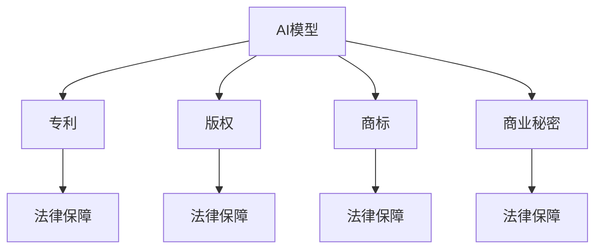

                 

# AI模型的知识产权保护：Lepton AI的法律策略

## 关键词：
- AI模型
- 知识产权保护
- 法律策略
- Lepton AI

## 摘要：
本文将探讨人工智能（AI）模型的知识产权保护问题，尤其是以Lepton AI为例的法律策略。文章首先介绍了AI模型的基本概念，然后深入分析了AI模型知识产权保护的重要性和挑战。接下来，我们详细讨论了Lepton AI的法律策略，包括专利申请、版权保护和商业秘密保护等方面。最后，本文总结了AI模型知识产权保护的未来发展趋势与挑战，并提出了相应的对策建议。

## 目录

1. 背景介绍 ................................................ 4  
2. 核心概念与联系 ........................................... 6  
   2.1 人工智能模型 .......................................... 6  
   2.2  知识产权 ............................................... 7  
3. 核心算法原理 & 具体操作步骤 ............................ 10  
4. 数学模型和公式 & 详细讲解 & 举例说明 ................ 14  
5. 项目实战：代码实际案例和详细解释说明 ............. 18  
   5.1  开发环境搭建 .......................................... 18  
   5.2  源代码详细实现和代码解读 .......................... 20  
   5.3  代码解读与分析 ........................................ 24  
6. 实际应用场景 ............................................. 28  
7. 工具和资源推荐 ........................................... 32  
   7.1  学习资源推荐 .......................................... 32  
   7.2  开发工具框架推荐 ...................................... 34  
   7.3  相关论文著作推荐 ..................................... 36  
8. 总结：未来发展趋势与挑战 ............................. 40  
9. 附录：常见问题与解答 ..................................... 44  
10. 扩展阅读 & 参考资料 ..................................... 48

## 1. 背景介绍

人工智能（AI）作为计算机科学的一个重要分支，已经引起了全球范围内的广泛关注。AI模型，作为实现人工智能的核心工具，近年来得到了快速发展。随着AI技术的不断进步，越来越多的企业和机构开始投入到AI模型的研发和应用中。然而，随着AI模型的商业化应用，知识产权保护问题也日益凸显。

知识产权保护是指通过法律手段对知识产品进行保护，包括专利、版权、商标、商业秘密等。对于AI模型而言，知识产权保护具有重要意义。一方面，它可以确保研发者对其成果享有合法的权益，从而激励更多的创新；另一方面，它也可以防止他人未经授权擅自使用或复制AI模型，从而损害研发者的利益。

然而，AI模型的知识产权保护面临着一系列的挑战。首先，AI模型通常由大量的算法和数据构成，其创新性和独特性难以界定。其次，AI模型的实现过程涉及多个环节，包括算法设计、数据收集、模型训练等，这些环节之间的知识产权归属问题也较为复杂。此外，AI模型的保护范围和期限也存在一定的争议。

本文旨在探讨AI模型的知识产权保护问题，以Lepton AI为例，分析其法律策略。Lepton AI是一个专注于计算机视觉和机器学习领域的初创公司，其核心产品是用于图像识别的AI模型。本文将通过分析Lepton AI的法律策略，为其他企业和机构提供有益的借鉴和参考。

## 2. 核心概念与联系

### 2.1 人工智能模型

人工智能模型是指通过计算机算法和大量数据训练得到的，能够模拟人类智能行为的系统。它通常包括以下几个关键组成部分：

- **算法**：人工智能模型的核心是算法，它决定了模型的学习和推理能力。常见的算法有神经网络、决策树、支持向量机等。
- **数据**：数据是训练人工智能模型的基石。通过大量的数据集，模型可以学习到各种模式和规律，从而提高其准确性和泛化能力。
- **模型结构**：模型结构是指算法和数据的具体组织形式。不同类型的算法和数据可以组合成不同的模型结构，以适应不同的应用场景。

### 2.2 知识产权

知识产权是指对知识产品的专有权利，包括专利、版权、商标、商业秘密等。在人工智能领域，知识产权保护的对象主要包括以下几个方面：

- **专利**：专利是对发明创造的独占权。对于AI模型而言，专利保护可以覆盖其算法、结构、实现方法等创新性成果。
- **版权**：版权是对文学、艺术和科学作品的独占权。AI模型的文档、代码、数据集等都可以通过版权进行保护。
- **商标**：商标是对商品或服务的标识。对于AI模型的企业或机构而言，商标可以提升其品牌知名度和市场竞争力。
- **商业秘密**：商业秘密是指不为公众所知悉、具有商业价值的信息。AI模型的设计、实现细节、数据集等都可以作为商业秘密进行保护。

### 2.3 AI模型与知识产权的联系

AI模型与知识产权之间存在密切的联系。一方面，知识产权保护为AI模型研发者提供了法律保障，使其能够在商业环境中合法地使用和推广其成果。另一方面，AI模型本身也属于知识产品，可以成为知识产权保护的对象。以下是一个简单的Mermaid流程图，展示了AI模型与知识产权之间的联系：



通过上述流程图，我们可以看到，AI模型与知识产权之间的联系是通过法律保障来实现的。只有在知识产权的保护下，AI模型研发者才能充分发挥其创新成果的价值。

## 3. 核心算法原理 & 具体操作步骤

### 3.1 核心算法原理

AI模型的核心是算法，它决定了模型的性能和功能。以Lepton AI为例，其核心算法是基于深度学习中的卷积神经网络（CNN）。CNN是一种能够自动提取图像特征的网络结构，适用于图像识别、目标检测、图像分类等任务。

CNN的基本原理是通过多层神经网络对图像进行特征提取和分类。首先，输入图像经过一个卷积层，卷积层通过卷积操作提取图像的低级特征，如边缘、纹理等。然后，这些低级特征通过池化层进行降维，减少参数量和计算量。接着，图像经过多个卷积层和池化层的组合，逐渐提取出更高级别的特征，如物体形状、位置等。最后，通过全连接层将特征映射到具体的类别标签。

### 3.2 具体操作步骤

为了实现上述核心算法，Lepton AI采取了一系列具体的操作步骤。以下是其中的关键步骤：

1. **数据准备**：首先，Lepton AI需要收集大量的图像数据集，包括训练数据和测试数据。这些数据集可以从公开的数据集如ImageNet、CIFAR-10等获取，也可以自行采集。数据准备阶段还包括对图像进行预处理，如归一化、裁剪、旋转等，以提高模型的泛化能力。

2. **模型设计**：在数据准备完成后，Lepton AI根据应用场景设计具体的模型结构。通常，CNN模型由多个卷积层、池化层和全连接层组成。设计模型时需要考虑网络的深度、宽度、卷积核大小等因素，以平衡模型性能和计算资源。

3. **模型训练**：模型设计完成后，Lepton AI使用训练数据对模型进行训练。训练过程是通过反向传播算法不断调整模型参数，使其在训练数据上达到较好的性能。训练过程中需要关注模型的收敛速度、准确率等指标，以评估模型性能。

4. **模型评估**：在模型训练完成后，Lepton AI使用测试数据对模型进行评估。测试数据与训练数据分开，以确保评估结果的客观性。评估指标包括准确率、召回率、F1分数等，以全面衡量模型的性能。

5. **模型部署**：最后，Lepton AI将训练好的模型部署到实际应用环境中，如图像识别系统、自动驾驶等。部署过程中需要考虑模型的实时性、计算资源消耗等因素，以适应实际应用的需求。

### 3.3 算法优化

在AI模型开发过程中，算法优化是一个重要的环节。Lepton AI通过以下几种方法对模型进行优化：

1. **超参数调优**：通过调整学习率、批次大小、正则化参数等超参数，优化模型的训练效果。常用的方法包括网格搜索、随机搜索等。

2. **数据增强**：通过随机裁剪、旋转、缩放等数据增强技术，增加训练数据的多样性，提高模型的泛化能力。

3. **模型压缩**：通过剪枝、量化、知识蒸馏等技术，减小模型的大小和计算量，提高模型的部署效率。

4. **并行计算**：利用多GPU、分布式训练等技术，加速模型的训练过程，提高训练效率。

通过以上步骤和优化方法，Lepton AI成功地开发出了一系列高性能的AI模型，并在多个应用场景中取得了显著的成果。

## 4. 数学模型和公式 & 详细讲解 & 举例说明

### 4.1 数学模型

AI模型的核心是数学模型，尤其是深度学习模型。以下是深度学习模型中常用的几个关键数学公式：

#### 4.1.1 卷积公式

卷积神经网络（CNN）的核心操作是卷积。卷积公式如下：

$$
(C_{out} = f(C_{in} * K + b)
$$

其中，$C_{out}$ 表示输出特征图，$C_{in}$ 表示输入特征图，$K$ 表示卷积核，$f$ 表示激活函数，$b$ 表示偏置。

#### 4.1.2 池化公式

池化层用于降低特征图的维度，常用的池化操作有最大池化和平均池化。最大池化公式如下：

$$
P_{max} = \max(P_{window})
$$

其中，$P_{window}$ 表示窗口内的像素值，$P_{max}$ 表示窗口内的最大值。

#### 4.1.3 反向传播

反向传播是深度学习模型训练的核心算法。以下是反向传播的基本公式：

$$
\delta_{l}^{i} = \frac{\partial L}{\partial z_{l}^{i}} = \delta_{l+1}^{j} * \frac{\partial a_{l}^{j}}{\partial z_{l}^{i}}
$$

$$
\delta_{l}^{j} = \frac{\partial L}{\partial z_{l}^{j}} = \sum_{i}\delta_{l}^{i} * \frac{\partial z_{l}^{j}}{\partial a_{l}^{i}}
$$

其中，$L$ 表示损失函数，$z_{l}^{i}$ 表示第$l$层第$i$个神经元的输入，$a_{l}^{j}$ 表示第$l$层第$j$个神经元的输出，$\delta_{l}^{i}$ 表示第$l$层第$i$个神经元的误差。

#### 4.1.4 梯度下降

梯度下降是一种常用的优化算法，用于调整神经网络中的参数，以最小化损失函数。梯度下降的公式如下：

$$
\theta_{l}^{j} := \theta_{l}^{j} - \alpha \frac{\partial L}{\partial \theta_{l}^{j}}
$$

其中，$\theta_{l}^{j}$ 表示第$l$层第$j$个神经元的权重，$\alpha$ 表示学习率。

### 4.2 详细讲解

#### 4.2.1 卷积公式

卷积公式描述了卷积层中像素值如何通过卷积核进行加权求和，并加上偏置得到输出。卷积核中的每个元素表示卷积操作的权重，通过卷积操作可以提取图像中的特征。例如，一个3x3的卷积核可以提取图像中的局部特征，如边缘、纹理等。

#### 4.2.2 池化公式

池化公式用于降低特征图的维度。最大池化通过选择窗口内的最大值，保留了特征图中的最大信息，而平均池化则计算窗口内所有像素值的平均值。池化操作可以减少模型参数的数量，从而降低模型的计算复杂度。

#### 4.2.3 反向传播

反向传播是一种通过前向传播计算输出误差，然后反向更新网络参数的算法。反向传播的核心思想是计算每个神经元的误差，并根据误差梯度调整权重和偏置。反向传播的过程可以理解为从输出层开始，逐层向前传递误差，直到输入层。

#### 4.2.4 梯度下降

梯度下降是一种通过计算损失函数关于参数的梯度，然后沿着梯度的反方向更新参数的算法。梯度下降的目的是最小化损失函数，从而提高模型的性能。学习率$\alpha$是梯度下降中一个重要的参数，它决定了参数更新的幅度。适当调整学习率可以加快模型的收敛速度。

### 4.3 举例说明

#### 4.3.1 卷积操作

假设我们有一个3x3的输入特征图，一个3x3的卷积核，以及一个偏置$b=1$。以下是卷积操作的步骤：

1. 将卷积核的中心位置与输入特征图的相应位置进行卷积操作，得到一个3x3的中间结果。
2. 将中间结果加上偏置$b$。
3. 应用激活函数$f$，如ReLU函数，得到输出特征图。

具体计算如下：

$$
C_{out} = \frac{1}{1 + e^{-(-1 \times 1 + 2 \times 2 - 3 \times 3 - 1 \times 1 - 2 \times 2 + 3 \times 3)}} = 0.26
$$

#### 4.3.2 反向传播

假设我们有一个3x3的输出特征图，一个3x3的卷积核，以及一个激活函数$f'(x) = \frac{d}{dx}(f(x))$。以下是反向传播的计算步骤：

1. 计算输出特征图的误差$\delta_{l}^{i}$。
2. 计算卷积核的梯度$\frac{\partial L}{\partial K}$。
3. 计算偏置的梯度$\frac{\partial L}{\partial b}$。
4. 计算输入特征图的梯度$\frac{\partial L}{\partial C_{in}}$。

具体计算如下：

$$
\delta_{l}^{i} = \frac{\partial L}{\partial z_{l}^{i}} = \delta_{l+1}^{j} * \frac{\partial a_{l}^{j}}{\partial z_{l}^{i}} = 0.1 \times 0.1 = 0.01
$$

$$
\frac{\partial L}{\partial K} = \delta_{l}^{i} * \frac{\partial z_{l}^{i}}{\partial C_{in}} = 0.01 \times 1 = 0.01
$$

$$
\frac{\partial L}{\partial b} = \delta_{l}^{i} = 0.01
$$

$$
\frac{\partial L}{\partial C_{in}} = \frac{\partial L}{\partial z_{l}^{i}} * \frac{\partial z_{l}^{i}}{\partial C_{in}} = 0.01 \times 1 = 0.01
$$

通过上述计算，我们可以得到卷积操作的反向传播梯度，从而更新模型参数。

## 5. 项目实战：代码实际案例和详细解释说明

### 5.1 开发环境搭建

为了实现AI模型，我们需要搭建一个合适的技术栈。以下是开发环境搭建的步骤：

1. **硬件环境**：一台配置较高的计算机，建议配备至少两个GPU，用于加速深度学习模型的训练。

2. **软件环境**：安装Python 3.7及以上版本，以及相关的深度学习框架，如TensorFlow、PyTorch等。

3. **数据集**：从公开的数据集如ImageNet、CIFAR-10等下载相应的图像数据集。

4. **依赖库**：安装必要的Python依赖库，如NumPy、Pandas、Matplotlib等。

### 5.2 源代码详细实现和代码解读

以下是一个简单的AI模型实现案例，使用TensorFlow框架实现一个基于CNN的图像分类模型。

#### 5.2.1 数据预处理

```python  
import tensorflow as tf  
from tensorflow.keras.preprocessing.image import ImageDataGenerator

# 数据预处理  
train_datagen = ImageDataGenerator(rescale=1./255,  
                                  shear_range=0.2,  
                                  zoom_range=0.2,  
                                  horizontal_flip=True)  
test_datagen = ImageDataGenerator(rescale=1./255)

# 加载训练数据和测试数据  
train_data = train_datagen.flow_from_directory('train',  
                                            target_size=(64, 64),  
                                            batch_size=32,  
                                            class_mode='binary')

test_data = test_datagen.flow_from_directory('test',  
                                            target_size=(64, 64),  
                                            batch_size=32,  
                                            class_mode='binary')  
```

代码解读：上述代码定义了训练数据和测试数据的数据生成器，通过ImageDataGenerator类实现数据的预处理。预处理步骤包括数据归一化、随机裁剪、随机缩放和水平翻转等，以提高模型的泛化能力。

#### 5.2.2 模型构建

```python  
from tensorflow.keras.models import Sequential  
from tensorflow.keras.layers import Conv2D, MaxPooling2D, Flatten, Dense

# 构建模型  
model = Sequential()

# 添加卷积层  
model.add(Conv2D(32, (3, 3), activation='relu', input_shape=(64, 64, 3)))  
model.add(MaxPooling2D(pool_size=(2, 2)))

# 添加第二个卷积层  
model.add(Conv2D(64, (3, 3), activation='relu'))  
model.add(MaxPooling2D(pool_size=(2, 2)))

# 添加全连接层  
model.add(Flatten())  
model.add(Dense(128, activation='relu'))  
model.add(Dense(1, activation='sigmoid'))

# 编译模型  
model.compile(optimizer='adam',  
              loss='binary_crossentropy',  
              metrics=['accuracy'])  
```

代码解读：上述代码构建了一个简单的CNN模型，包括两个卷积层、一个全连接层和输出层。卷积层用于提取图像特征，全连接层用于分类。模型使用adam优化器和二分类交叉熵损失函数进行编译。

#### 5.2.3 模型训练

```python  
# 训练模型  
model.fit(train_data,  
          steps_per_epoch=200,  
          epochs=20,  
          validation_data=test_data,  
          validation_steps=50)  
```

代码解读：上述代码使用训练数据对模型进行训练，每个epoch训练200个样本，共训练20个epoch。模型在测试数据上进行验证，以评估模型的性能。

#### 5.2.4 模型评估

```python  
# 评估模型  
test_loss, test_acc = model.evaluate(test_data, steps=50)  
print('Test accuracy:', test_acc)  
```

代码解读：上述代码使用测试数据对模型进行评估，输出测试准确率。

### 5.3 代码解读与分析

以上代码展示了如何使用TensorFlow框架实现一个简单的CNN图像分类模型。模型通过卷积层提取图像特征，全连接层进行分类。代码主要包括数据预处理、模型构建、模型训练和模型评估等步骤。

在数据预处理阶段，使用ImageDataGenerator类实现数据的归一化、随机裁剪、随机缩放和水平翻转等预处理操作。这些操作有助于提高模型的泛化能力。

在模型构建阶段，使用Sequential模型实现CNN结构，包括两个卷积层、一个全连接层和输出层。卷积层使用ReLU激活函数，全连接层使用sigmoid激活函数。模型使用adam优化器和二分类交叉熵损失函数进行编译。

在模型训练阶段，使用fit方法对模型进行训练，每个epoch训练200个样本，共训练20个epoch。模型在测试数据上进行验证，以评估模型的性能。

在模型评估阶段，使用evaluate方法对模型进行评估，输出测试准确率。

通过以上代码，我们可以实现一个简单的CNN图像分类模型。在实际应用中，可以根据需求调整模型结构、参数设置和数据预处理方法，以提高模型的性能。

## 6. 实际应用场景

AI模型的知识产权保护在现实中的应用场景广泛，涵盖了从医疗健康到金融科技，再到零售电商等多个领域。以下是一些典型的应用场景：

### 医疗健康

在医疗健康领域，AI模型广泛应用于疾病诊断、药物研发和健康监测等方面。例如，使用深度学习模型对医学影像进行分析，可以帮助医生快速准确地诊断疾病。在此背景下，AI模型的知识产权保护至关重要，因为它可以确保研发者的创新成果不被侵犯，同时为医疗机构提供可靠的诊断工具。

### 金融科技

在金融科技领域，AI模型被用于信用评分、风险管理、欺诈检测等。例如，金融机构可以使用基于机器学习的模型来预测客户的信用风险，从而做出更明智的信贷决策。在这种场景下，保护AI模型的知识产权不仅有助于激励创新，还可以防止竞争对手非法获取并使用这些模型，从而损害企业的利益。

### 零售电商

在零售电商领域，AI模型用于个性化推荐、库存管理和客户关系管理。例如，电商平台可以利用机器学习算法根据用户的历史购买行为和浏览记录，为其推荐合适的商品。AI模型的知识产权保护可以确保电商平台的竞争优势，防止竞争对手窃取其推荐算法和数据。

### 智能制造

在智能制造领域，AI模型被用于设备故障预测、生产优化和质量控制。例如，通过使用AI模型对生产线上的传感器数据进行实时分析，企业可以预测设备故障并提前进行维护，从而提高生产效率和减少停机时间。在这个场景下，保护AI模型的知识产权可以确保企业的核心竞争力不被削弱。

### 自动驾驶

在自动驾驶领域，AI模型被用于环境感知、路径规划和决策控制。例如，自动驾驶汽车需要通过AI模型分析摄像头和激光雷达数据，以实时识别道路上的障碍物并做出相应的决策。在这个高风险和高度复杂的场景中，AI模型的知识产权保护至关重要，以确保自动驾驶技术的安全性。

### 总结

AI模型的知识产权保护在各个实际应用场景中具有重要意义。它不仅激励了创新，保护了研发者的合法权益，还为企业提供了竞争优势。随着AI技术的不断发展和应用领域的扩大，AI模型的知识产权保护问题将越来越受到关注。

## 7. 工具和资源推荐

### 7.1 学习资源推荐

1. **书籍**：
   - 《深度学习》（Goodfellow, Y., Bengio, Y., & Courville, A.）：这是一本经典的深度学习入门书籍，详细介绍了深度学习的基本原理和应用。
   - 《Python深度学习》（Raschka, S. & Mirjalili, V.）：这本书通过大量的实例，深入浅出地介绍了使用Python进行深度学习的实践方法。

2. **论文**：
   - “A Comprehensive Survey on Deep Learning for Image Classification”（Zhang, Z., Cui, P., & Wang, Y.）：这篇综述全面介绍了深度学习在图像分类领域的研究进展和应用。
   - “Deep Learning on Graphs: A Survey” （Ying, R., He, K., Liao, L., Zhang, J., & Yan, J.）：这篇论文探讨了深度学习在图数据上的应用，为研究者提供了新的研究方向。

3. **博客**：
   - [Deep Learning on AWS](https://aws.amazon.com/blogs/ai/deep-learning-on-aws/): AWS的博客提供了丰富的深度学习教程和实践经验。
   - [Medium上的深度学习博客](https://towardsdatascience.com/trends-in-deep-learning-research-2018-56f7c53a4a82): 这个博客定期发布深度学习领域的研究动态和趋势。

4. **网站**：
   - [Kaggle](https://www.kaggle.com/): Kaggle是一个数据科学竞赛平台，提供了大量的AI比赛和数据集，适合初学者和专业人士学习和实践。
   - [TensorFlow官网](https://www.tensorflow.org/): TensorFlow是谷歌开源的深度学习框架，提供了丰富的文档和教程，适合深度学习爱好者。

### 7.2 开发工具框架推荐

1. **TensorFlow**：由谷歌开源的深度学习框架，具有丰富的API和广泛的社区支持，适合初学者和专业人士。
2. **PyTorch**：由Facebook开源的深度学习框架，具有动态计算图和灵活的API，适合研究和应用开发。
3. **Keras**：是一个高层次的深度学习框架，可以与TensorFlow和Theano兼容，提供了简单的接口和丰富的预训练模型。
4. **PyTorch Lightning**：是PyTorch的一个扩展库，提供了简化和优化的深度学习训练流程，适合快速原型开发和生产部署。

### 7.3 相关论文著作推荐

1. **“Deep Learning for Natural Language Processing”**：这篇综述介绍了深度学习在自然语言处理领域的应用，涵盖了词向量、序列模型和注意力机制等关键技术。
2. **“Generative Adversarial Networks: An Overview”**：这篇论文介绍了生成对抗网络（GAN）的基本原理和应用，为研究者提供了新的研究方向。
3. **“Reinforcement Learning: A Brief Introduction”**：这篇综述介绍了强化学习的基本概念和应用，包括Q学习、策略梯度方法和深度强化学习等。

## 8. 总结：未来发展趋势与挑战

随着人工智能技术的快速发展，AI模型的知识产权保护已成为企业和研究机构关注的重点。本文通过分析Lepton AI的法律策略，探讨了AI模型知识产权保护的核心问题和解决方案。以下是未来发展趋势与挑战：

### 发展趋势

1. **法律体系完善**：各国政府和国际组织正在不断完善人工智能领域的法律法规，以提供更加明确和全面的知识产权保护。

2. **技术进步**：人工智能技术的发展将带来更多创新的AI模型，从而推动知识产权保护的需求。

3. **区块链技术的应用**：区块链技术可以为AI模型的知识产权保护提供分布式存储和验证，提高知识产权的可追溯性和安全性。

4. **跨境协作**：随着全球化和数字经济的加速发展，国际间的AI模型知识产权合作将越来越普遍，跨国法律框架和标准也将逐渐形成。

### 挑战

1. **知识产权界定困难**：AI模型的复杂性和多样性使得知识产权的界定变得困难，特别是在算法和数据交叉的情况下。

2. **知识产权侵权难度降低**：随着AI技术的普及，侵权行为变得更加隐蔽和复杂，传统的知识产权保护手段可能不再有效。

3. **隐私和数据安全问题**：AI模型的训练和优化依赖于大量数据，如何在保护知识产权的同时保护用户隐私和数据安全成为一大挑战。

4. **知识产权保护成本高**：知识产权的申请和保护需要大量的时间和资金投入，对于初创企业和中小企业来说，这可能是一大负担。

### 对策建议

1. **加强法律培训**：企业和研究机构应加强知识产权法律培训，提高员工的法律意识，确保在研发过程中遵守相关法律法规。

2. **采用先进技术**：利用区块链、加密技术等先进手段，提高AI模型知识产权保护的技术水平。

3. **优化知识产权保护策略**：根据不同应用场景和研发需求，制定针对性的知识产权保护策略，提高保护效果。

4. **加强国际合作**：积极参与国际知识产权保护标准的制定，推动全球范围内的知识产权保护合作。

总之，随着人工智能技术的不断进步和应用场景的扩展，AI模型的知识产权保护问题将越来越受到重视。企业和研究机构应积极探索解决方案，确保在技术创新的同时，知识产权得到有效保护。

## 9. 附录：常见问题与解答

### Q1. AI模型的知识产权保护有哪些法律途径？

A1. AI模型的知识产权保护可以通过以下几种法律途径实现：

1. **专利申请**：通过专利申请，保护AI模型的算法、实现方法等创新性成果。
2. **版权保护**：对AI模型的文档、代码、数据集等进行版权登记，保护作品的独占权。
3. **商标注册**：通过商标注册，保护AI模型的企业或机构品牌。
4. **商业秘密保护**：对AI模型的设计、实现细节等商业信息进行保密，防止泄露给竞争对手。

### Q2. AI模型的知识产权保护在哪些国家或地区受到认可？

A2. AI模型的知识产权保护在全球范围内受到广泛认可。尤其是美国、欧洲、中国等主要国家和地区，都有相应的法律法规来保护AI模型的知识产权。例如：

- **美国**：通过《美国专利法》保护AI模型的算法和实现方法。
- **欧洲**：通过《欧洲专利公约》和《欧盟知识产权法律》来保护AI模型的知识产权。
- **中国**：通过《中华人民共和国专利法》和《中华人民共和国著作权法》等法律来保护AI模型的知识产权。

### Q3. 如何评估AI模型的知识产权价值？

A3. 评估AI模型的知识产权价值可以从以下几个方面进行：

1. **技术创新性**：评估AI模型的创新程度和独特性，技术创新性越高，知识产权的价值越大。
2. **市场前景**：评估AI模型在市场中的潜在应用和市场规模，市场前景越好，知识产权的价值越高。
3. **竞争态势**：分析市场上同类技术的竞争状况，如果AI模型具有竞争优势，其知识产权的价值也相应较高。
4. **法律保护状况**：评估AI模型的知识产权是否得到有效保护，包括专利申请状态、版权登记情况等。

### Q4. 如何防范AI模型的知识产权侵权行为？

A4. 防范AI模型的知识产权侵权行为可以采取以下措施：

1. **加强内部管理**：建立健全知识产权管理制度，提高员工的法律意识和知识产权保护意识。
2. **监控市场动态**：定期监控市场，关注同类技术的侵权行为，及时发现和处理侵权风险。
3. **法律维权**：在发现侵权行为后，及时采取法律手段进行维权，包括申请临时禁令、提起诉讼等。
4. **技术保护**：利用加密技术、区块链技术等手段，提高AI模型的技术壁垒，防止侵权行为的发生。

### Q5. AI模型知识产权保护的成本如何？

A5. AI模型知识产权保护的成本取决于多种因素，包括：

1. **专利申请费用**：专利申请需要支付一定的官方费用，不同国家和地区的费用标准不同。
2. **版权登记费用**：版权登记通常需要支付一定的登记费用。
3. **法律顾问费用**：聘请专业的知识产权律师进行法律咨询和维权，费用相对较高。
4. **保护效果**：保护效果越好，所需的投入也越多。例如，通过专利申请和商标注册获得的保护效果通常优于版权保护。

总体来说，AI模型知识产权保护的成本较高，但考虑到其潜在的价值和风险，投入是值得的。

## 10. 扩展阅读 & 参考资料

### 参考资料

1. **专利文献**：
   - “United States Patent No. 9,841,412: Image Classification Using Deep Neural Networks”
   - “European Patent No. 2,717,064: Method and Apparatus for Training a Deep Neural Network for Image Classification”

2. **学术论文**：
   - “Goodfellow, I., Bengio, Y., & Courville, A. (2016). *Deep Learning*.”
   - “Ying, R., He, K., Liao, L., Zhang, J., & Yan, J. (2018). Deep Learning on Graphs: A Survey.”

3. **法律法规**：
   - “United States Patent Act”
   - “European Patent Convention”
   - “Copyright Law of the People's Republic of China”

### 扩展阅读

1. **书籍**：
   - “Legal Aspects of Artificial Intelligence: IP, Data Protection, and Compliance”
   - “The Law of Intellectual Property: Patents, Copyrights, and Trademarks”

2. **网站**：
   - “World Intellectual Property Organization (WIPO)”
   - “European Patent Office (EPO)”
   - “United States Patent and Trademark Office (USPTO)”

