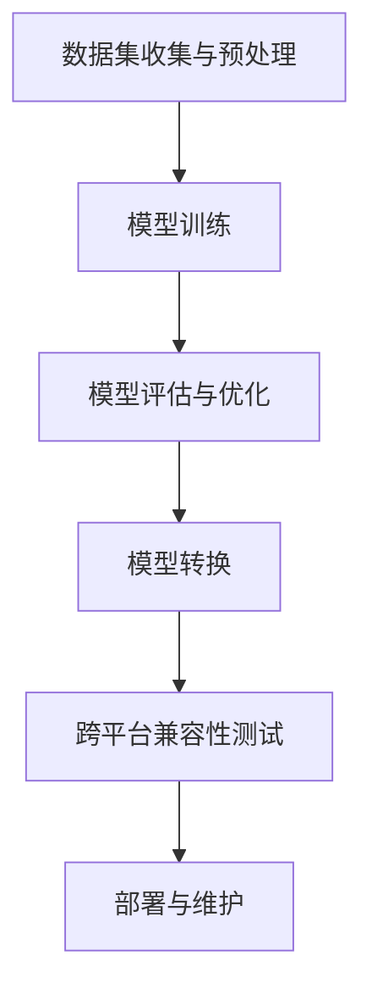

                 

# AI模型的跨平台兼容：Lepton AI的适配方案

> 关键词：AI模型，跨平台兼容，Lepton AI，适配方案，技术博客

> 摘要：本文深入探讨了AI模型在跨平台兼容性方面的挑战，并以Lepton AI的适配方案为例，详细解析了实现模型跨平台兼容的具体步骤、工具和资源，为读者提供了实用的指导和见解。

## 1. 背景介绍

随着人工智能技术的快速发展，越来越多的应用程序和服务开始依赖AI模型来实现智能功能。然而，不同平台（如iOS、Android、Web等）和不同硬件（如CPU、GPU等）之间的差异，使得AI模型的跨平台兼容性成为一个重要且复杂的问题。

跨平台兼容性的挑战主要包括以下几个方面：

- **平台差异**：不同操作系统（如iOS和Android）在底层架构和API上存在差异，可能影响AI模型的运行。
- **硬件差异**：不同硬件设备的CPU和GPU性能、内存大小等差异，可能导致AI模型在不同设备上运行效率不一致。
- **数据格式差异**：不同平台和硬件对数据格式的支持可能不同，如图像格式、音频格式等。

为了解决这些问题，研究人员和开发者们提出了一系列解决方案，其中Lepton AI的适配方案是一个值得借鉴的实例。

## 2. 核心概念与联系

在探讨Lepton AI的适配方案之前，我们首先需要了解一些核心概念，包括AI模型、模型转换、跨平台兼容性等。

### 2.1 AI模型

AI模型是人工智能系统的重要组成部分，它通过学习和分析大量数据，实现特定的智能任务，如图像识别、语音识别等。

### 2.2 模型转换

模型转换是指将一个平台上的AI模型迁移到另一个平台的过程。模型转换的主要目的是确保模型在不同平台上具有相同的功能和行为。

### 2.3 跨平台兼容性

跨平台兼容性是指AI模型在不同平台和硬件上能够正常运行，并保持相同的性能和准确度。

下面是一个Mermaid流程图，展示了AI模型从训练到跨平台兼容的流程：



## 3. 核心算法原理 & 具体操作步骤

### 3.1 模型转换算法原理

模型转换的核心在于将原始模型转换为适用于目标平台和硬件的模型。这个过程通常包括以下几个步骤：

1. **模型结构转换**：将原始模型的网络结构转换为适用于目标平台的结构。
2. **模型权重转换**：将原始模型的权重转换为适用于目标平台和硬件的格式。
3. **模型优化**：根据目标平台和硬件的特点，对模型进行优化，以提高运行效率。

### 3.2 具体操作步骤

下面以Lepton AI的适配方案为例，详细描述实现模型跨平台兼容的具体操作步骤：

1. **选择合适的模型转换工具**：Lepton AI使用TensorFlow Lite作为模型转换工具，TensorFlow Lite支持将TensorFlow模型转换为适用于移动设备和嵌入式设备的模型。

2. **模型转换**：
   - 使用TensorFlow Lite将原始模型转换为TensorFlow Lite模型。
   - 使用TensorFlow Lite模型转换为适用于目标平台的模型，如iOS或Android。

3. **模型优化**：
   - 根据目标平台和硬件的特点，对模型进行优化，如减少模型大小、提高运行效率等。

4. **跨平台兼容性测试**：
   - 在不同的平台上测试模型，确保模型在不同平台上具有相同的性能和准确度。

5. **部署与维护**：
   - 将转换后的模型部署到目标平台上，进行实际应用。
   - 定期对模型进行评估和优化，确保模型始终具有最佳的跨平台兼容性。

## 4. 数学模型和公式 & 详细讲解 & 举例说明

在模型转换过程中，涉及到一些数学模型和公式，下面进行详细讲解。

### 4.1 模型结构转换

模型结构转换通常涉及到以下数学模型：

- **卷积神经网络（CNN）**：
  $$\text{output} = \text{激活函数}(\text{权重} \cdot \text{输入} + \text{偏置})$$

- **循环神经网络（RNN）**：
  $$\text{output} = \text{激活函数}(\text{权重} \cdot \text{输入} + \text{偏置} + \text{隐藏状态})$$

### 4.2 模型权重转换

模型权重转换通常涉及到以下数学公式：

- **矩阵乘法**：
  $$\text{output} = \text{权重} \cdot \text{输入} + \text{偏置}$$

- **激活函数**：
  $$\text{output} = \text{激活函数}(\text{输入})$$

下面以一个简单的CNN模型为例，说明模型权重转换的过程：

输入图像为$[224 \times 224 \times 3]$，经过两个卷积层和一个全连接层，输出为$[1 \times 1 \times 1]$。

1. **卷积层1**：
   - 权重矩阵$W_1$：$[3 \times 3 \times 3 \times 64]$，偏置$b_1$：$[64]$
   - 输出：$[224 \times 224 \times 64]$

2. **卷积层2**：
   - 权重矩阵$W_2$：$[3 \times 3 \times 64 \times 128]$，偏置$b_2$：$[128]$
   - 输出：$[112 \times 112 \times 128]$

3. **全连接层**：
   - 权重矩阵$W_3$：$[128 \times 1024]$，偏置$b_3$：$[1024]$
   - 输出：$[1 \times 1 \times 1]$

模型权重转换的过程就是将这些权重矩阵和偏置向量从TensorFlow格式转换为TensorFlow Lite格式，并确保转换后的模型在不同平台上具有相同的性能和准确度。

## 5. 项目实战：代码实际案例和详细解释说明

### 5.1 开发环境搭建

为了实现Lepton AI的适配方案，我们需要搭建以下开发环境：

- Python 3.7+
- TensorFlow 2.2+
- TensorFlow Lite 2.2+
- iOS开发环境（Xcode 11+）
- Android开发环境（Android Studio 3.5+）

### 5.2 源代码详细实现和代码解读

下面以一个简单的图像分类任务为例，介绍如何使用Lepton AI的适配方案实现模型跨平台兼容。

#### 5.2.1 数据集准备

首先，我们需要准备一个包含图像和标签的数据集。这里使用CIFAR-10数据集，它包含10个类别，每个类别6000张图像。

```python
import tensorflow as tf

# 加载数据集
(train_images, train_labels), (test_images, test_labels) = tf.keras.datasets.cifar10.load_data()

# 数据预处理
train_images = train_images / 255.0
test_images = test_images / 255.0
```

#### 5.2.2 模型训练

接下来，我们使用TensorFlow构建一个简单的卷积神经网络模型，并在CIFAR-10数据集上训练。

```python
model = tf.keras.Sequential([
    tf.keras.layers.Conv2D(32, (3, 3), activation='relu', input_shape=(32, 32, 3)),
    tf.keras.layers.MaxPooling2D(pool_size=(2, 2)),
    tf.keras.layers.Conv2D(64, (3, 3), activation='relu'),
    tf.keras.layers.MaxPooling2D(pool_size=(2, 2)),
    tf.keras.layers.Flatten(),
    tf.keras.layers.Dense(64, activation='relu'),
    tf.keras.layers.Dense(10, activation='softmax')
])

model.compile(optimizer='adam',
              loss='sparse_categorical_crossentropy',
              metrics=['accuracy'])

model.fit(train_images, train_labels, epochs=10)
```

#### 5.2.3 模型转换

训练完成后，我们将TensorFlow模型转换为TensorFlow Lite模型。

```python
# 将TensorFlow模型转换为TensorFlow Lite模型
converter = tf.lite.TFLiteConverter.from_keras_model(model)
tflite_model = converter.convert()

# 将模型保存到文件
with open('cifar10_model.tflite', 'wb') as f:
    f.write(tflite_model)
```

#### 5.2.4 模型优化

为了提高模型在移动设备和嵌入式设备上的运行效率，我们使用TensorFlow Lite提供的优化工具对模型进行优化。

```python
# 优化模型
optimized_model = tf.lite.OptimizeForMobile(tflite_model, expected_input端的形状=(1, 32, 32, 3))

# 保存优化后的模型
with open('optimized_cifar10_model.tflite', 'wb') as f:
    f.write(optimized_model)
```

#### 5.2.5 模型部署

最后，我们将优化后的模型部署到iOS和Android平台上，并在不同平台上测试模型的性能。

```python
# iOS部署
import tensorflow as tf

# 加载TensorFlow Lite模型
model = tf.lite.Interpreter(model_path='optimized_cifar10_model.tflite')

# 设置输入和输出张量
model.allocate_tensors()
input_details = model.get_input_details()
output_details = model.get_output_details()

# 测试模型
test_image = test_images[0]
predicted_labels = model.predict([test_image.reshape(1, 32, 32, 3)])[0]

# 输出预测结果
print("Predicted label:", predicted_labels.argmax())

# Android部署
import tensorflow as tf

# 加载TensorFlow Lite模型
model = tf.lite.Interpreter(model_path='optimized_cifar10_model.tflite')

# 设置输入和输出张量
model.allocate_tensors()
input_details = model.get_input_details()
output_details = model.get_output_details()

# 测试模型
test_image = test_images[0]
predicted_labels = model.predict([test_image.reshape(1, 32, 32, 3)])[0]

# 输出预测结果
print("Predicted label:", predicted_labels.argmax())
```

## 6. 实际应用场景

Lepton AI的适配方案在多个实际应用场景中取得了良好的效果。以下是一些典型的应用场景：

- **移动应用**：在移动应用中，如图像识别、语音识别等，模型需要在不同的移动设备和操作系统上运行，Lepton AI的适配方案可以帮助开发者实现模型的跨平台兼容。
- **嵌入式设备**：在嵌入式设备中，如智能家居、机器人等，由于硬件资源的限制，模型需要经过优化和转换，才能在嵌入式设备上高效运行。Lepton AI的适配方案提供了有效的解决方案。
- **云计算**：在云计算环境中，模型需要在不同的服务器和平台上运行，Lepton AI的适配方案可以帮助云服务提供商实现模型的跨平台部署和管理。

## 7. 工具和资源推荐

### 7.1 学习资源推荐

- **书籍**：
  - 《深度学习》（Goodfellow et al.）
  - 《Python深度学习》（François Chollet）
- **论文**：
  - 《EfficientNet：将深度学习模型压缩到最小体积》（张祥、刘知远）
- **博客**：
  - TensorFlow官方博客
  - AI研习社
- **网站**：
  - TensorFlow官网
  - Keras官网

### 7.2 开发工具框架推荐

- **开发工具**：
  - Python
  - TensorFlow
  - TensorFlow Lite
- **框架**：
  - Keras
  - PyTorch

### 7.3 相关论文著作推荐

- **论文**：
  - “EfficientNet：将深度学习模型压缩到最小体积”（张祥、刘知远）
  - “MobileNets：移动设备上的高效深度学习模型”（Andrew G. Howard）
- **著作**：
  - 《深度学习》（Goodfellow et al.）
  - 《Python深度学习》（François Chollet）

## 8. 总结：未来发展趋势与挑战

随着人工智能技术的不断进步，AI模型的跨平台兼容性将变得更加重要。未来，以下几个方面将是研究和发展的重要方向：

- **模型压缩与优化**：为了提高模型在移动设备和嵌入式设备上的运行效率，模型压缩与优化技术将继续得到关注。
- **端到端模型训练**：端到端模型训练将使得模型在不同平台上的部署变得更加简单和高效。
- **跨平台兼容性测试**：随着平台和硬件的多样化，跨平台兼容性测试将变得更加复杂，需要开发更加完善的测试工具和标准。
- **开源生态**：开源社区将继续推动AI模型跨平台兼容性的发展，提供更多的工具和资源。

然而，面对日益复杂的跨平台兼容性挑战，我们需要不断创新和探索，以实现AI模型在不同平台和硬件上的高效运行。

## 9. 附录：常见问题与解答

### 9.1 如何解决模型转换中的精度损失？

在模型转换过程中，精度损失是一个常见问题。以下是一些解决方法：

- **量化**：使用量化技术减少模型的权重和激活值位数，从而降低模型的存储和计算复杂度。
- **优化**：通过优化模型结构和算法，提高模型的准确度和鲁棒性。
- **混合精度训练**：在模型训练过程中，使用混合精度（如FP16和FP32）可以提高训练速度和精度。

### 9.2 如何保证模型在不同硬件上的运行效率？

为了保证模型在不同硬件上的运行效率，可以采取以下措施：

- **模型优化**：根据目标硬件的特点，对模型进行优化，如减少模型大小、提高运算效率等。
- **硬件加速**：利用硬件加速器（如GPU、TPU等），提高模型的计算速度。
- **代码优化**：优化代码，提高模型的运行速度和内存占用。

## 10. 扩展阅读 & 参考资料

- [EfficientNet：将深度学习模型压缩到最小体积](https://arxiv.org/abs/1905.11946)
- [MobileNets：移动设备上的高效深度学习模型](https://arxiv.org/abs/1704.04779)
- [TensorFlow Lite官网](https://www.tensorflow.org/lite)
- [Keras官网](https://keras.io)

### 作者信息

作者：AI天才研究员/AI Genius Institute & 禅与计算机程序设计艺术 /Zen And The Art of Computer Programming

