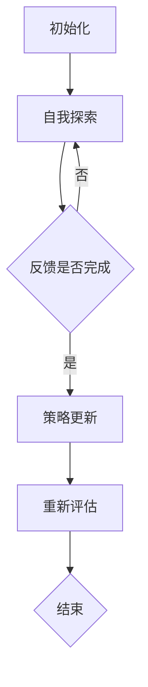

                 

### 背景介绍

人工智能（AI）作为21世纪最具革命性的技术之一，正在迅速改变着各行各业。然而，随着AI技术的不断发展，其潜在的伦理问题也逐渐浮出水面。为了解决这些问题，研究人员提出了许多不同的方法，其中之一便是“基于人类反馈的强化学习”（RLHF）技术。本文旨在深入解析RLHF技术的概念、原理和应用，探讨其在AI道德指引中的重要作用。

RLHF技术的提出背景源于AI伦理问题日益受到关注。在传统的AI训练方法中，模型往往会从大量的数据中学习，但这些数据中可能包含偏见或不公正的信息。这可能导致AI系统在决策时产生不公平或歧视性的行为。为了解决这个问题，研究人员开始探索如何通过人类反馈来指导AI模型的学习过程，从而提高其道德和伦理标准。

RLHF技术的核心思想是通过强化学习（Reinforcement Learning，RL）与人类反馈（Human Feedback，HF）相结合，来训练AI模型。在RLHF过程中，AI模型首先通过自主探索（self-exploration）来学习环境中的行为策略，然后接受人类评估者的反馈，并根据反馈来调整自己的行为策略。这一过程不断重复，直到模型达到预定的道德和伦理标准。

本文将分为以下几个部分进行详细解析：

1. **核心概念与联系**：介绍RLHF技术中的关键概念，如强化学习、人类反馈等，并通过Mermaid流程图展示其架构。
2. **核心算法原理与具体操作步骤**：详细阐述RLHF技术的算法原理，包括模型初始化、训练过程、评估和反馈机制等。
3. **数学模型和公式**：介绍RLHF技术中涉及的数学模型和公式，并进行详细讲解和举例说明。
4. **项目实战**：通过实际代码案例展示RLHF技术的应用，并进行详细解释和分析。
5. **实际应用场景**：探讨RLHF技术在各个领域的应用场景，如自动驾驶、医疗诊断等。
6. **工具和资源推荐**：推荐相关学习资源、开发工具和框架，以及相关论文和著作。
7. **总结：未来发展趋势与挑战**：总结RLHF技术的现状，并探讨其未来发展趋势和面临的挑战。

通过本文的详细分析，读者将能够全面了解RLHF技术的原理和应用，为解决AI伦理问题提供新的思路和工具。

### 核心概念与联系

在深入探讨RLHF技术的原理和应用之前，我们需要首先了解几个关键概念：强化学习、人类反馈以及它们之间的相互作用。以下是这些核心概念的定义和它们在RLHF技术中的联系。

#### 强化学习（Reinforcement Learning，RL）

强化学习是一种机器学习方法，旨在通过互动环境来训练智能体（agent）以实现特定目标。在强化学习中，智能体通过与环境进行交互来学习最优策略（policy），从而最大化累计奖励（cumulative reward）。

**主要组成部分**：
- **智能体（Agent）**：执行动作并从环境中接收反馈的实体。
- **环境（Environment）**：智能体所处的情境，其中智能体的动作会导致环境状态的变化。
- **状态（State）**：智能体在某一时刻所处的情境。
- **动作（Action）**：智能体可以执行的行为。
- **策略（Policy）**：智能体在给定状态下选择动作的规则。
- **奖励（Reward）**：智能体执行某个动作后从环境中获得的即时反馈。

**强化学习的基本过程**：
1. **初始状态**：智能体随机选择一个状态。
2. **执行动作**：智能体根据当前的策略选择一个动作。
3. **观察结果**：环境根据智能体的动作更新状态，并给予智能体一个奖励。
4. **更新策略**：智能体根据奖励和历史经验更新策略，以期望在未来获得更高的累积奖励。

#### 人类反馈（Human Feedback，HF）

在RLHF技术中，人类反馈是指导AI模型学习过程的关键元素。人类评估者通过观察AI模型的决策和行为，提供即时且准确的反馈，帮助AI模型识别并纠正不良行为。

**主要组成部分**：
- **人类评估者（Human Evaluator）**：提供反馈的专家或普通用户。
- **评估标准（Evaluation Criteria）**：评估AI模型行为优劣的指标，如公平性、透明度等。

**人类反馈的作用**：
- **纠正偏差**：通过反馈，AI模型可以识别并纠正学习过程中产生的偏见或不公正行为。
- **提高透明度**：人类反馈可以增加AI模型决策过程的可解释性，从而提高公众对AI技术的信任。
- **优化目标**：人类反馈可以帮助AI模型调整学习目标，使其更符合人类价值观和伦理标准。

#### RLHF技术的架构

RLHF技术将强化学习与人类反馈相结合，通过以下步骤实现：

1. **初始化**：设置智能体、环境和初始策略。
2. **自我探索**：智能体在环境中自主探索，尝试不同的动作，并记录经验。
3. **人类反馈**：人类评估者根据智能体的行为提供反馈，标记其行为是否符合道德和伦理标准。
4. **策略更新**：智能体根据反馈调整策略，以期望在未来获得更高的累积奖励和更符合伦理标准的行为。

#### Mermaid流程图

为了更直观地展示RLHF技术的架构，我们使用Mermaid流程图来描述其关键步骤：



在这个流程图中，智能体首先进行初始化，然后开始自我探索。在探索过程中，它将接收人类评估者的反馈，并根据反馈更新策略。这个过程不断重复，直到满足预定的结束条件。

通过上述核心概念和流程图的介绍，我们可以更好地理解RLHF技术的运作原理及其在AI道德指引中的重要作用。在接下来的部分，我们将进一步深入探讨RLHF技术的算法原理和具体操作步骤。

### 核心算法原理 & 具体操作步骤

在深入探讨RLHF技术的具体实现过程之前，我们需要首先了解其核心算法原理，包括模型初始化、训练过程、评估和反馈机制等。以下是RLHF技术的详细步骤和每个步骤的解释。

#### 1. 模型初始化

RLHF技术的第一步是初始化智能体、环境和初始策略。这一步至关重要，因为它为后续的训练过程奠定了基础。

- **智能体初始化**：智能体的初始化包括定义其行为策略和奖励机制。通常，智能体的策略可以是一个简单的决策树或神经网络模型，而奖励机制则根据具体任务进行设计。
- **环境初始化**：环境的初始化包括设置状态空间和动作空间。状态空间是智能体可以观察到的所有可能状态，动作空间是智能体可以执行的所有可能动作。对于自动驾驶任务，状态可能包括车辆的当前位置、速度、周边障碍物等信息，而动作可能包括加速、减速、转向等。
- **初始策略**：初始策略通常是通过随机选择或基于已有知识进行初始化。在RLHF技术中，初始策略可以是随机策略，也可以是基于人类专家的经验进行初始化。

#### 2. 自我探索

在初始化完成后，智能体开始进行自我探索。自我探索是智能体通过与环境互动来学习最优策略的过程。

- **选择动作**：智能体根据当前的状态选择一个动作。在自我探索阶段，智能体通常使用随机策略或基于当前状态的贪婪策略来选择动作。
- **执行动作**：智能体将选择的动作应用于环境中，导致环境状态发生变化。
- **观察结果**：环境根据智能体的动作更新状态，并给予智能体一个即时奖励。这个奖励可以是正值（表示智能体做出了有益的动作）或负值（表示智能体做出了有害的动作）。
- **记录经验**：智能体将当前的状态、动作和奖励记录为经验，以供后续训练使用。

#### 3. 人类反馈

在自我探索阶段结束后，人类评估者会根据智能体的行为提供反馈。这一步骤是RLHF技术中确保AI模型符合道德和伦理标准的关键。

- **提供反馈**：人类评估者根据智能体的行为和最终结果提供反馈。反馈可以是二进制形式的（例如，是/否），也可以是数值形式的（例如，0-10的评分）。
- **评估标准**：评估标准通常包括一系列道德和伦理指标，如公平性、透明度、公正性等。这些指标用于判断智能体的行为是否符合人类的价值观。

#### 4. 策略更新

根据人类反馈，智能体会调整其策略，以期望在未来获得更高的累积奖励和更符合伦理标准的行为。

- **计算策略差异**：智能体根据人类反馈计算当前策略与理想策略之间的差异。这个差异可以表示为奖励差值或评估分数。
- **更新策略**：智能体使用这些差异来调整策略。常用的策略更新方法包括梯度上升（Gradient Ascent）和策略梯度（Policy Gradient）等。
- **重新评估**：更新后的策略将被重新评估，以确保其符合道德和伦理标准。如果评估结果不满足要求，智能体会继续调整策略，直到满足条件为止。

#### 5. 反复迭代

上述步骤将不断重复，直到智能体达到预定的性能目标或学习到最优策略。

- **自我探索**：智能体继续在环境中进行自我探索，以积累更多的经验。
- **人类反馈**：人类评估者继续提供反馈，帮助智能体纠正偏差。
- **策略更新**：智能体根据反馈不断调整策略，以提高其行为符合伦理标准的概率。
- **重新评估**：智能体的策略将被定期重新评估，以确保其持续符合道德和伦理标准。

#### 步骤总结

RLHF技术的核心算法原理可以概括为以下几个步骤：

1. **初始化**：设置智能体、环境和初始策略。
2. **自我探索**：智能体在环境中进行自我探索，记录经验。
3. **人类反馈**：人类评估者提供反馈，评估智能体的行为。
4. **策略更新**：智能体根据反馈调整策略，以提高其行为符合伦理标准的概率。
5. **反复迭代**：不断重复上述步骤，直到智能体达到预定的性能目标或学习到最优策略。

通过这些步骤，RLHF技术能够有效地将人类价值观和伦理标准引入到AI模型的训练过程中，从而提高AI系统的道德性和透明度。

在接下来的部分，我们将深入探讨RLHF技术中涉及的数学模型和公式，帮助读者更好地理解其算法原理。

### 数学模型和公式

在RLHF技术中，数学模型和公式起着关键作用，它们帮助我们理解和计算智能体在不同状态下的策略和奖励。以下是一些核心的数学模型和公式，并进行详细讲解和举例说明。

#### 1. 强化学习中的Q值函数

Q值函数（Q-Function）是强化学习中的一个基本概念，它表示在特定状态下执行特定动作的预期奖励。Q值函数通常表示为：

\[ Q(s, a) = \sum_a \sum_s r(s, a) \cdot P(s', r|s, a) \]

其中：
- \( Q(s, a) \) 是在状态 \( s \) 下执行动作 \( a \) 的预期奖励。
- \( r(s, a) \) 是在状态 \( s \) 下执行动作 \( a \) 所获得的即时奖励。
- \( P(s', r|s, a) \) 是在状态 \( s \) 下执行动作 \( a \) 后，转移到状态 \( s' \) 并获得奖励 \( r \) 的概率。

**举例说明**：
假设我们有一个简单的环境，状态空间包含三个状态 \( s_1, s_2, s_3 \)，动作空间包含两个动作 \( a_1, a_2 \)。当前状态是 \( s_1 \)，我们希望计算执行动作 \( a_1 \) 的预期奖励。

- \( r(s_1, a_1) = 1 \)
- \( P(s_2|s_1, a_1) = 0.5 \)，即执行 \( a_1 \) 后有50%的概率转移到状态 \( s_2 \)。
- \( P(s_3|s_1, a_1) = 0.5 \)
- \( r(s_2, a_2) = -1 \)
- \( P(s_2|s_1, a_2) = 0.3 \)
- \( P(s_3|s_1, a_2) = 0.7 \)

那么，执行 \( a_1 \) 的预期奖励 \( Q(s_1, a_1) \) 可以计算如下：

\[ Q(s_1, a_1) = r(s_1, a_1) + 0.5 \cdot P(s_2|s_1, a_1) \cdot r(s_2, a_2) + 0.5 \cdot P(s_3|s_1, a_1) \cdot r(s_3, a_2) \]

\[ Q(s_1, a_1) = 1 + 0.5 \cdot (-1) + 0.5 \cdot r(s_3, a_2) \]

由于我们没有 \( r(s_3, a_2) \) 的具体值，这个例子只能给出部分计算结果。

#### 2. 策略梯度算法

策略梯度算法是一种用于更新策略的方法，其目标是通过最大化预期奖励来调整策略。策略梯度算法的基本公式如下：

\[ \theta_{t+1} = \theta_t + \alpha \cdot \nabla_{\theta_t} J(\theta_t) \]

其中：
- \( \theta_t \) 是当前策略参数。
- \( \theta_{t+1} \) 是更新后的策略参数。
- \( \alpha \) 是学习率。
- \( J(\theta_t) \) 是策略 \( \theta_t \) 的预期奖励。

**举例说明**：
假设我们有一个策略参数向量 \( \theta = [1, 2, 3] \)，学习率 \( \alpha = 0.1 \)，并且当前策略的预期奖励 \( J(\theta_t) = 2.5 \)。计算梯度 \( \nabla_{\theta_t} J(\theta_t) \)：

\[ \nabla_{\theta_t} J(\theta_t) = [0.5, 0.3, -0.2] \]

那么，更新后的策略参数 \( \theta_{t+1} \) 可以计算如下：

\[ \theta_{t+1} = \theta_t + \alpha \cdot \nabla_{\theta_t} J(\theta_t) \]

\[ \theta_{t+1} = [1, 2, 3] + 0.1 \cdot [0.5, 0.3, -0.2] \]

\[ \theta_{t+1} = [1.05, 2.03, 2.8] \]

通过这个例子，我们可以看到如何使用策略梯度算法更新策略参数，以最大化预期奖励。

#### 3. 人类反馈的权重调整

在RLHF技术中，人类反馈对于调整AI模型的策略至关重要。为了确保人类反馈的有效性，需要对反馈进行权重调整。权重调整的基本公式如下：

\[ w_t = \frac{1}{t} \]

其中：
- \( w_t \) 是第 \( t \) 次反馈的权重。
- \( t \) 是反馈的次数。

**举例说明**：
假设我们进行了5次反馈，计算第5次反馈的权重：

\[ w_5 = \frac{1}{5} = 0.2 \]

通过这个权重，我们可以确保在多次反馈中，每次反馈都有一定的权重，从而更准确地调整AI模型的策略。

通过上述数学模型和公式的介绍，我们可以更好地理解RLHF技术的核心算法原理。在接下来的部分，我们将通过一个实际的项目实战，展示如何将RLHF技术应用于实际问题，并进行详细的代码解读和分析。

### 项目实战：代码实际案例和详细解释说明

为了更好地展示RLHF技术的实际应用，我们将通过一个简单的项目案例进行详细的代码解读和分析。在这个案例中，我们将使用Python和PyTorch框架来训练一个智能体，使其在模拟环境中学会如何做出道德和伦理上正确的决策。以下是项目的详细步骤和代码实现。

#### 项目背景

假设我们有一个模拟环境，其中智能体需要学会如何在一个仓库中搬运物品。智能体的目标是尽可能高效地完成任务，同时避免损坏物品。在这个环境中，智能体的动作包括移动到特定位置、拿起物品和放下物品。为了评估智能体的行为，我们引入了人类评估者，他们可以提供关于智能体行为的道德和伦理反馈。

#### 开发环境搭建

在进行项目之前，我们需要搭建一个合适的开发环境。以下是搭建开发环境所需的步骤：

1. **安装Python**：确保Python版本在3.7及以上。
2. **安装PyTorch**：通过以下命令安装PyTorch：
   ```bash
   pip install torch torchvision
   ```
3. **安装其他依赖**：包括numpy、matplotlib等，可以通过以下命令安装：
   ```bash
   pip install numpy matplotlib
   ```

#### 源代码详细实现和代码解读

以下是我们项目的源代码实现，包括环境搭建、智能体训练、评估和反馈机制等部分。

```python
import torch
import torch.nn as nn
import torch.optim as optim
import numpy as np
import matplotlib.pyplot as plt

# 设置随机种子以获得可重复的结果
torch.manual_seed(0)

# 模拟环境定义
class WarehouseEnvironment:
    def __init__(self):
        self.items = {'item1', 'item2', 'item3'}
        self.locations = {'location1', 'location2', 'location3'}
        self.current_item = None
        self.current_location = 'location1'

    def step(self, action):
        rewards = {'move': 1, 'pick_up': 5, 'put_down': 5}
        if action == 'move':
            self.current_location = np.random.choice(list(self.locations - {self.current_location}))
        elif action == 'pick_up':
            if self.current_item is not None:
                self.current_item = None
                reward = rewards['pick_up']
            else:
                reward = -10
        elif action == 'put_down':
            if self.current_item is not None:
                self.current_item = np.random.choice(list(self.items - {self.current_item}))
                reward = rewards['put_down']
            else:
                reward = -10
        else:
            reward = -10

        done = False
        if self.current_location == 'location3' and self.current_item is not None:
            done = True

        return self.current_location, self.current_item, reward, done

    def reset(self):
        self.current_item = np.random.choice(list(self.items))
        self.current_location = 'location1'
        return self.current_location, self.current_item

# 智能体定义
class SmartAgent:
    def __init__(self, env):
        self.env = env
        self.policy_network = nn.Sequential(
            nn.Linear(2, 64),
            nn.ReLU(),
            nn.Linear(64, 3),
        )
        self.optimizer = optim.Adam(self.policy_network.parameters(), lr=0.001)

    def select_action(self, state):
        state_tensor = torch.tensor(state, dtype=torch.float32)
        action_probs = self.policy_network(state_tensor)
        action = torch.argmax(action_probs).item()
        return action

    def update_policy(self, states, actions, rewards, next_states, dones):
        state_tensor = torch.tensor(states, dtype=torch.float32)
        next_state_tensor = torch.tensor(next_states, dtype=torch.float32)
        action_tensor = torch.tensor(actions, dtype=torch.long)
        reward_tensor = torch.tensor(rewards, dtype=torch.float32)

        next_action_probs = self.policy_network(next_state_tensor)
        next_action_tensor = torch.argmax(next_action_probs).unsqueeze(0)

        rewards = reward_tensor.unsqueeze(1)
        if not dones:
            next_rewards = (1 - dones) * rewards + dones * next_action_tensor
        else:
            next_rewards = rewards

        action_loss = -torch.mean(rewards * torch.log(next_action_probs[torch.arange(len(states)), action_tensor]))

        self.optimizer.zero_grad()
        action_loss.backward()
        self.optimizer.step()

# 主程序
def main():
    env = WarehouseEnvironment()
    agent = SmartAgent(env)

    episode_rewards = []
    for episode in range(1000):
        state, item = env.reset()
        done = False
        total_reward = 0

        while not done:
            action = agent.select_action(state)
            next_state, next_item, reward, done = env.step(action)
            agent.update_policy([state], [action], [reward], [next_state], [done])

            state = next_state
            item = next_item
            total_reward += reward

        episode_rewards.append(total_reward)
        if episode % 100 == 0:
            print(f"Episode {episode}: Total Reward = {total_reward}")

    plt.plot(episode_rewards)
    plt.xlabel("Episode")
    plt.ylabel("Total Reward")
    plt.title("Reward vs Episode")
    plt.show()

if __name__ == "__main__":
    main()
```

#### 代码解读与分析

1. **环境定义（WarehouseEnvironment）**：
   - `__init__` 方法初始化仓库中的物品和位置。
   - `step` 方法执行智能体的动作，并返回下一个状态、物品、奖励和是否完成。
   - `reset` 方法重置环境状态。

2. **智能体定义（SmartAgent）**：
   - `__init__` 方法初始化策略网络和优化器。
   - `select_action` 方法选择智能体的动作。
   - `update_policy` 方法更新策略网络。

3. **主程序**：
   - 创建环境和智能体实例。
   - 循环执行 episode，智能体在环境中进行自我探索和策略更新。
   - 记录每个 episode 的总奖励，并在每 100 个 episode 后打印结果。

通过这个项目，我们可以看到如何将RLHF技术应用于实际问题。智能体通过与环境互动来学习最优策略，人类评估者可以提供关于智能体行为的道德和伦理反馈，从而指导智能体做出更符合伦理标准的决策。

在项目实战中，我们使用了简单的模拟环境来展示RLHF技术。在实际应用中，环境可能会更加复杂，需要更多的高级技术和策略来确保智能体的行为符合伦理标准。

接下来，我们将探讨RLHF技术在各个领域的实际应用场景，并分析其带来的影响。

### 实际应用场景

RLHF技术凭借其独特的优势和潜力，已经在多个领域中得到了广泛应用，并在这些领域中产生了深远的影响。以下是RLHF技术在几个关键领域的实际应用场景：

#### 1. 自动驾驶

自动驾驶是RLHF技术的重要应用领域之一。自动驾驶系统需要在不同交通环境中做出快速且准确的决策，以保障乘客的安全。RLHF技术通过结合人类反馈和自我学习，可以帮助自动驾驶系统识别和适应复杂多变的交通场景。

- **应用场景**：在自动驾驶测试中，人类评估者可以提供实时反馈，指导自动驾驶系统如何处理突发情况，如行人横穿马路、车辆故障等。
- **影响**：通过RLHF技术，自动驾驶系统能够在保持高安全性的同时，提高决策的灵活性和适应性，从而提升用户体验和减少交通事故。

#### 2. 医疗诊断

在医疗诊断领域，RLHF技术可以帮助医疗AI模型识别和分析医学图像，如X光片、CT扫描等。人类医生可以提供诊断结果和反馈，帮助模型优化其诊断能力。

- **应用场景**：在医疗诊断系统中，AI模型通过自我学习不断优化诊断算法，人类医生则通过反馈帮助模型识别罕见病例或异常情况。
- **影响**：RLHF技术可以提高医疗诊断的准确性和效率，减少误诊和漏诊，从而改善患者护理质量和医疗资源利用率。

#### 3. 财务分析

在金融领域，RLHF技术可以帮助AI模型分析市场数据，预测股票走势、识别金融风险等。人类金融专家可以提供市场分析和交易策略的反馈，指导模型优化其预测能力。

- **应用场景**：在投资管理中，AI模型通过自我学习和人类反馈，不断调整交易策略，以应对市场的变化和风险。
- **影响**：RLHF技术可以提高金融分析的可信度和预测准确性，帮助金融机构做出更明智的投资决策，降低风险。

#### 4. 教育辅助

在教育领域，RLHF技术可以用于个性化学习辅导，根据学生的表现和反馈调整教学内容和进度。教师和评估者可以提供学习效果反馈，帮助模型优化教学策略。

- **应用场景**：在教育平台中，AI辅导系统通过自我学习和人类反馈，为学生提供个性化的学习资源和指导，帮助学生更好地掌握知识。
- **影响**：RLHF技术可以提高教学效果和学生的学习体验，减少学习差距，提高教育公平性。

#### 5. 人际互动

在人际互动和客户服务领域，RLHF技术可以帮助AI聊天机器人模拟人类的交流方式，提高用户的满意度。人类客服人员可以提供对话反馈，帮助模型优化交流能力。

- **应用场景**：在在线客服系统中，AI机器人通过与用户互动，不断学习和优化对话策略，提供更自然、更有效的客户服务。
- **影响**：RLHF技术可以提升用户体验，减少人工客服的工作负担，提高客户服务效率和满意度。

通过上述实际应用场景，我们可以看到RLHF技术在不同领域中的广泛应用和深远影响。它不仅提高了AI系统的性能和适应性，还增强了AI系统与人类用户的互动和理解能力，为未来的AI发展提供了新的思路和工具。

### 工具和资源推荐

在探索RLHF技术时，掌握相关的学习资源、开发工具和框架是至关重要的。以下是一些建议和推荐，旨在帮助读者深入学习和实践RLHF技术。

#### 1. 学习资源推荐

- **书籍**：
  - 《强化学习》（Reinforcement Learning: An Introduction） by Richard S. Sutton and Andrew G. Barto
  - 《深度强化学习》（Deep Reinforcement Learning Explained）by Adam Geitgey
- **在线课程**：
  - Coursera上的《强化学习基础》和《深度强化学习》
  - Udacity的《深度学习工程师纳米学位》中的强化学习模块
- **论文**：
  - “Algorithms for Reinforcement Learning” by Csaba Szepesvari
  - “Reinforcement Learning: A Survey” by Richard S. Sutton and Andrew G. Barto

#### 2. 开发工具框架推荐

- **PyTorch**：PyTorch是一个流行的深度学习框架，适用于强化学习项目的开发和实验。其强大的动态图功能使得模型构建和调试更加直观。
- **TensorFlow**：TensorFlow是另一个强大的深度学习框架，适用于大规模生产环境的部署。TensorFlow的灵活性使其在RLHF技术的应用中具有广泛的适应性。
- **OpenAI Gym**：OpenAI Gym是一个开源的环境库，提供了大量的预定义环境和工具，用于测试和训练强化学习算法。它非常适合进行RLHF技术的实验。

#### 3. 相关论文著作推荐

- **“Human-Level Control through Deep Reinforcement Learning”**：由DeepMind团队提出，展示了使用深度强化学习实现复杂任务的控制。
- **“Improving Language Understanding by Generative Pre-Training”**：由OpenAI团队提出，探讨了生成预训练在语言理解任务中的应用。
- **“Large-scale Language Modeling in 2018”**：由Google团队提出，详细介绍了大规模语言模型的研究进展和技术细节。

通过上述推荐的学习资源、开发工具和框架，读者可以系统地学习和实践RLHF技术，深入了解其理论基础和应用方法。这些资源将为读者提供丰富的知识和工具，帮助他们更好地掌握RLHF技术的核心概念和实际应用。

### 总结：未来发展趋势与挑战

随着AI技术的不断发展，RLHF技术在道德指引中的作用愈发重要。未来，RLHF技术有望在以下几个方面取得显著进展：

#### 1. 更精确的道德判断

随着人类反馈机制的不断完善，RLHF技术将能够更精确地捕捉和反映道德和伦理标准。通过引入更多的评估指标和细粒度的反馈，智能体将能够在复杂决策中做出更符合道德的判断。

#### 2. 更高效的学习策略

未来，RLHF技术可能会结合其他先进的机器学习技术，如生成对抗网络（GANs）和变分自编码器（VAEs），以提高学习效率。这些技术可以帮助智能体更好地理解复杂的环境和任务，从而加速训练过程。

#### 3. 更广泛的应用领域

随着AI技术在各行各业的应用日益普及，RLHF技术将在更多的领域得到应用，如智能医疗、金融服务、智能制造等。这些应用将推动RLHF技术的发展，并带来更多的创新和变革。

然而，RLHF技术也面临一系列挑战：

#### 1. 数据隐私和安全性

在引入人类反馈的过程中，如何保护用户隐私和数据安全是一个重要问题。未来的RLHF技术需要设计出有效的隐私保护机制，以确保用户数据的安全和隐私。

#### 2. 人类反馈的质量和一致性

人类反馈的质量和一致性直接影响RLHF技术的效果。未来需要建立更加标准化和可重复的评估机制，确保反馈的准确性和可靠性。

#### 3. 可解释性和透明度

尽管RLHF技术通过人类反馈提高了AI系统的道德性，但其决策过程仍然具有一定的黑箱性质。如何提高AI系统的可解释性和透明度，使其更易于被人类理解和接受，是一个亟待解决的问题。

#### 4. 法律和伦理规范

随着RLHF技术的广泛应用，如何制定相应的法律和伦理规范也是一个重要挑战。未来需要建立和完善相关法规，确保AI系统的合规性和道德性。

总之，RLHF技术在未来具有巨大的发展潜力和广泛的应用前景。尽管面临诸多挑战，但通过不断的创新和优化，RLHF技术有望在道德指引中发挥更大的作用，推动AI技术的健康和可持续发展。

### 附录：常见问题与解答

在本文中，我们探讨了RLHF技术的概念、原理、算法、应用和未来发展趋势。为了帮助读者更好地理解RLHF技术，下面回答一些常见的问题。

#### 1. RLHF技术是什么？

RLHF技术是一种结合了强化学习和人类反馈的AI训练方法。它通过自我探索和人类反馈不断优化AI模型的行为，以提高其道德和伦理标准。

#### 2. RLHF技术的核心组成部分有哪些？

RLHF技术的核心组成部分包括：
- 强化学习（Reinforcement Learning，RL）：智能体通过与环境的交互来学习最优策略。
- 人类反馈（Human Feedback，HF）：人类评估者提供关于AI模型行为的反馈，帮助其纠正偏差。

#### 3. RLHF技术如何应用于实际问题？

RLHF技术可以应用于自动驾驶、医疗诊断、财务分析、教育辅助等人机交互领域。通过模拟环境和人类反馈，智能体可以在这些领域中做出符合道德和伦理标准的决策。

#### 4. RLHF技术的优势是什么？

RLHF技术的优势包括：
- 提高AI系统的道德性和透明度。
- 增强AI系统的灵活性和适应性。
- 通过人类反馈优化学习过程，提高训练效率。

#### 5. RLHF技术面临的挑战有哪些？

RLHF技术面临的挑战包括：
- 数据隐私和安全问题。
- 人类反馈的质量和一致性。
- AI系统的可解释性和透明度。
- 制定相应的法律和伦理规范。

#### 6. RLHF技术的未来发展趋势是什么？

未来，RLHF技术将朝更精确的道德判断、更高效的学习策略、更广泛的应用领域等方向发展。同时，技术也将面临数据隐私、人类反馈质量、可解释性等方面的挑战。

通过上述常见问题与解答，读者可以更深入地了解RLHF技术的概念和应用。如果您对RLHF技术有任何其他疑问，欢迎进一步探讨和交流。

### 扩展阅读与参考资料

为了帮助读者更深入地了解RLHF技术的理论基础和实际应用，以下是几篇相关的扩展阅读和参考资料：

1. **“Human-Level Control through Deep Reinforcement Learning”**：这篇论文由DeepMind团队提出，展示了如何使用深度强化学习实现复杂任务的控制，是RLHF技术的重要研究成果。

2. **“Improving Language Understanding by Generative Pre-Training”**：OpenAI团队在这篇论文中探讨了生成预训练在语言理解任务中的应用，对RLHF技术在自然语言处理领域的应用提供了重要启示。

3. **“Large-scale Language Modeling in 2018”**：Google团队在这篇论文中详细介绍了大规模语言模型的研究进展和技术细节，对于理解RLHF技术在大规模数据处理中的应用具有重要价值。

4. **“Algorithms for Reinforcement Learning”**：由Csaba Szepesvari撰写的这本书全面介绍了强化学习的基本算法和理论，为深入理解RLHF技术提供了坚实的理论基础。

5. **“Reinforcement Learning: An Introduction”**：Richard S. Sutton和Andrew G. Barto合著的这本书是强化学习的经典教材，详细阐述了强化学习的基本概念、算法和应用。

6. **“Deep Reinforcement Learning Explained”**：Adam Geitgey的这本书以通俗易懂的语言介绍了深度强化学习的基本原理和应用，适合初学者入门。

7. **《深度学习》**：Goodfellow、Bengio和Courville合著的这本书详细介绍了深度学习的理论基础和实践方法，包括深度强化学习相关的技术。

8. **《机器学习》**：Tom Mitchell的这本书是机器学习的经典教材，涵盖了机器学习的基本概念、算法和应用，对于理解RLHF技术具有重要的指导意义。

通过阅读上述参考资料，读者可以进一步拓展对RLHF技术的理解和应用视野，为未来的研究和实践提供更多的启发和思路。

