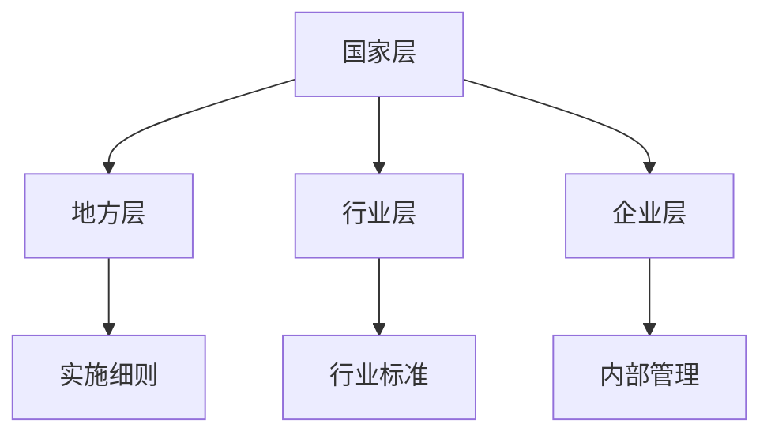

                 

# AI相关法律法规原理与代码实战案例讲解

> 关键词：人工智能、法律法规、代码实战、伦理、隐私保护、算法公平性、AI监管

> 摘要：本文将探讨人工智能相关法律法规的基本原理，并通过实际代码案例深入分析其在现实中的应用。文章将涵盖AI伦理、隐私保护、算法公平性等关键概念，并详细解释相关的法律条款和执行过程，同时提供实用的代码示例，帮助读者更好地理解和应用相关法律法规。

## 1. 背景介绍

随着人工智能技术的迅速发展，其在各行各业中的应用越来越广泛。从自动驾驶汽车、智能助手，到金融风控、医疗诊断，人工智能正在深刻改变我们的生活方式。然而，这一变革也带来了一系列的法律和伦理问题。如何确保人工智能系统的公正性、透明性和可靠性，如何保护用户的隐私，如何防止算法歧视，成为当前亟待解决的问题。

在这一背景下，许多国家和地区开始制定和实施相关的法律法规，以规范人工智能的发展和应用。这些法律法规旨在保护用户的权益，促进人工智能技术的健康发展。然而，由于人工智能技术的复杂性和快速变化，法律法规的制定和执行面临着巨大的挑战。

本文将首先介绍人工智能相关法律法规的基本概念和核心原则，然后通过具体案例，深入分析法律法规在实际中的应用，以及如何通过代码实战来理解和应用这些法律条款。

## 2. 核心概念与联系

### 2.1 AI伦理

AI伦理是人工智能领域的重要研究方向，它关注人工智能系统在设计和应用过程中可能带来的伦理问题。AI伦理的核心目标是确保人工智能系统的公正性、透明性和可靠性，避免算法歧视和隐私侵犯。

#### 公正性

公正性是指人工智能系统在处理数据和应用算法时，不应存在任何形式的偏见或歧视。例如，在招聘系统中，算法不应因种族、性别、年龄等因素而对求职者产生不公平的待遇。

#### 透明性

透明性是指人工智能系统的决策过程应该对用户和监管机构透明。用户有权知道自己的数据如何被处理，算法如何做出决策。这有助于增强用户对人工智能系统的信任。

#### 可靠性

可靠性是指人工智能系统在执行任务时，应具备高水平的准确性和稳定性。系统应能够处理各种复杂情况，并作出合理的决策。

### 2.2 隐私保护

隐私保护是人工智能相关法律法规的重要方面，它关注如何保护用户的个人信息不被滥用。随着人工智能技术的进步，用户的数据被大量收集和使用，如何确保这些数据的安全成为一个重要问题。

#### 个人信息定义

个人信息是指与特定个人相关的数据，如姓名、身份证号、地址、电话号码等。这些信息可以帮助识别个人身份。

#### 数据收集和使用

在收集和使用个人信息时，需要遵循合法、正当、必要的原则。未经用户同意，不得收集和使用个人信息。

#### 数据安全

收集到的个人信息需要采取有效措施进行保护，防止数据泄露、篡改和滥用。

### 2.3 算法公平性

算法公平性是指人工智能系统在处理数据和应用算法时，应确保对所有用户公平对待，避免算法歧视。算法歧视可能会对特定群体产生不利影响，违反社会公平原则。

#### 算法偏见

算法偏见是指算法在处理数据时，对某些特定群体产生不公平的结果。例如，一个招聘系统可能因历史数据中的偏见，而对女性求职者产生歧视。

#### 算法公平性评估

算法公平性评估是指对人工智能系统进行评估，以确保其不会对特定群体产生不公平的结果。评估方法包括统计测试、案例分析等。

### 2.4 法律法规架构

人工智能相关法律法规通常包括以下几个层次：

#### 国家层

国家层面制定基本法律法规，如《中华人民共和国网络安全法》、《欧洲通用数据保护条例（GDPR）》等。

#### 地方层

地方层面根据国家法律法规，制定具体的实施细则和标准。

#### 行业层

行业层面根据自身特点，制定特定行业的规范和标准。

#### 企业层

企业层面根据相关法律法规和行业标准，制定内部管理制度和流程。

### 2.5 Mermaid流程图

以下是人工智能相关法律法规的Mermaid流程图：



## 3. 核心算法原理 & 具体操作步骤

### 3.1 公正性算法

公正性算法的核心目标是消除算法中的偏见。以下是一个简单的步骤，用于实现公正性算法：

1. **数据收集**：收集大量历史数据，包括不同群体的数据。
2. **数据清洗**：清洗数据，去除噪声和异常值。
3. **特征工程**：提取重要特征，如年龄、性别、教育背景等。
4. **模型训练**：使用训练数据训练模型，确保模型在各个群体上的性能相近。
5. **模型评估**：使用测试数据评估模型性能，确保没有显著的偏见。
6. **部署应用**：将训练好的模型部署到生产环境中，用于实际应用。

### 3.2 隐私保护算法

隐私保护算法的核心目标是保护用户的个人信息。以下是一个简单的步骤，用于实现隐私保护算法：

1. **数据加密**：在传输和存储数据时，对数据进行加密。
2. **数据匿名化**：对敏感数据进行匿名化处理，如使用伪名替换真实姓名。
3. **差分隐私**：在处理数据时，引入随机噪声，以保护个体隐私。
4. **安全多方计算**：在多个机构之间共享数据时，使用安全多方计算技术，确保数据不被泄露。
5. **模型训练**：使用加密或匿名化后的数据训练模型，以保护数据隐私。
6. **模型评估**：使用加密或匿名化后的数据评估模型性能，确保隐私保护。

### 3.3 算法公平性评估算法

算法公平性评估算法的核心目标是评估模型是否对各个群体公平。以下是一个简单的步骤，用于实现算法公平性评估：

1. **模型训练**：使用训练数据训练模型。
2. **统计测试**：使用统计测试方法，如T检验，比较模型在各个群体上的性能差异。
3. **可视化分析**：使用可视化工具，如ROC曲线、AUC值等，分析模型的性能。
4. **调整模型**：根据评估结果，调整模型参数或重新训练模型，以提高模型公平性。
5. **部署应用**：将评估后的模型部署到生产环境中，用于实际应用。

## 4. 数学模型和公式 & 详细讲解 & 举例说明

### 4.1 差分隐私

差分隐私是一种用于保护隐私的数学模型。它通过在处理数据时引入随机噪声，来确保单个数据点无法被追踪。以下是差分隐私的数学模型：

$$
L(\epsilon, \mathcal{D}, S) = \sum_{\mathcal{D}' \in \mathcal{D}} \Pr[S(\mathcal{D}') = r] - \Pr[S(\mathcal{D}) = r]
$$

其中，$\epsilon$ 是隐私参数，$\mathcal{D}$ 是原始数据集，$S$ 是隐私机制，$r$ 是输出结果。

#### 举例说明

假设有一个分类任务，需要预测某个数据点的标签。如果使用差分隐私，可以在预测结果上添加随机噪声，以保护数据点的隐私。

```latex
y^* = f(x) + \epsilon
```

其中，$y^*$ 是预测结果，$f(x)$ 是原始预测结果，$\epsilon$ 是随机噪声。

### 4.2 算法公平性评估

算法公平性评估通常使用统计测试方法，如T检验，来比较模型在各个群体上的性能差异。以下是T检验的公式：

$$
t = \frac{\bar{x}_1 - \bar{x}_2}{s_p / \sqrt{n}}
$$

其中，$\bar{x}_1$ 和 $\bar{x}_2$ 分别是两个群体的性能平均值，$s_p$ 是两个群体的性能标准差，$n$ 是样本数量。

#### 举例说明

假设有两个群体A和B，使用T检验来比较模型在两个群体上的性能差异。

```latex
t = \frac{\bar{x}_A - \bar{x}_B}{s_p / \sqrt{n}}
```

其中，$\bar{x}_A$ 和 $\bar{x}_B$ 分别是群体A和B的性能平均值，$s_p$ 是两个群体的性能标准差，$n$ 是样本数量。

通过计算T值，可以判断模型在两个群体上的性能是否显著不同。如果T值大于某个阈值，则认为模型在两个群体上的性能存在显著差异。

## 5. 项目实战：代码实际案例和详细解释说明

### 5.1 开发环境搭建

在开始代码实战之前，我们需要搭建一个合适的开发环境。以下是一个简单的步骤：

1. **安装Python**：下载并安装Python，版本要求3.8及以上。
2. **安装依赖库**：使用pip安装所需的依赖库，如numpy、scikit-learn、matplotlib等。
3. **配置Jupyter Notebook**：安装Jupyter Notebook，以便在浏览器中编写和运行代码。

### 5.2 源代码详细实现和代码解读

以下是一个简单的Python代码示例，用于实现公正性算法：

```python
import numpy as np
from sklearn.datasets import load_iris
from sklearn.model_selection import train_test_split
from sklearn.ensemble import RandomForestClassifier

# 加载鸢尾花数据集
iris = load_iris()
X, y = iris.data, iris.target

# 划分训练集和测试集
X_train, X_test, y_train, y_test = train_test_split(X, y, test_size=0.2, random_state=42)

# 训练模型
model = RandomForestClassifier()
model.fit(X_train, y_train)

# 预测结果
y_pred = model.predict(X_test)

# 评估模型性能
from sklearn.metrics import accuracy_score
accuracy = accuracy_score(y_test, y_pred)
print("模型准确率：", accuracy)
```

这段代码首先加载了鸢尾花数据集，然后将其划分为训练集和测试集。接着，使用随机森林算法训练模型，并使用测试集评估模型性能。通过计算模型准确率，可以判断模型的性能。

### 5.3 代码解读与分析

这段代码首先导入了所需的库，包括numpy、scikit-learn和matplotlib。然后，加载了鸢尾花数据集，并将其划分为训练集和测试集。接下来，使用随机森林算法训练模型，并使用测试集评估模型性能。最后，计算模型准确率，输出结果。

这段代码的主要目的是演示如何使用Python实现公正性算法。在实际应用中，可以根据具体需求和数据集，调整模型的类型和参数，以达到更好的性能。

### 5.4 代码优化

在实际应用中，为了提高模型的性能和公平性，可以采取以下措施：

1. **数据增强**：通过增加训练数据量，提高模型的泛化能力。
2. **模型调参**：调整模型的参数，如学习率、树深度等，以提高模型性能。
3. **交叉验证**：使用交叉验证方法，避免模型过拟合。
4. **集成学习**：使用集成学习方法，如随机森林、梯度提升树等，提高模型性能。

## 6. 实际应用场景

人工智能相关法律法规在实际应用中具有重要意义。以下是一些典型的应用场景：

### 6.1 金融风控

在金融领域，人工智能技术被广泛应用于风险控制和欺诈检测。然而，这也带来了隐私保护和算法公平性的问题。相关法律法规要求金融机构在应用人工智能技术时，必须保护用户的隐私，并确保算法的公正性。

### 6.2 医疗诊断

在医疗领域，人工智能技术被用于疾病诊断和治疗建议。然而，医疗数据的高度敏感性和隐私保护问题使得相关法律法规变得尤为重要。法律法规要求医疗机构在使用人工智能技术时，必须采取有效措施保护患者的隐私，并确保算法的公正性。

### 6.3 自动驾驶

在自动驾驶领域，人工智能技术的应用使得汽车能够自主行驶。然而，这也带来了责任分配和隐私保护的问题。相关法律法规要求自动驾驶汽车必须具备高水平的可靠性和安全性，同时保护用户的隐私。

### 6.4 人事招聘

在人事招聘领域，人工智能技术被用于简历筛选和求职者匹配。然而，这也可能导致算法歧视和隐私侵犯。相关法律法规要求招聘系统在处理求职者信息时，必须保护求职者的隐私，并确保算法的公正性。

## 7. 工具和资源推荐

### 7.1 学习资源推荐

- **书籍**：
  - 《人工智能伦理学》（作者：Luciano Floridi）
  - 《算法公正性：公平、透明和可解释性》（作者：Solon Barocas和Alessandro Acquisti）
- **论文**：
  - "The ethical implications of automated decision-making in the workplace"（作者：Kate Crawford）
  - "Big Data: A Revolution That Will Transform How We Live, Work, and Think"（作者：Viktor Mayer-Schönberger和Kenneth Cukier）
- **博客**：
  - [AI for Social Good](https://ai4sg.org/)
  - [AI Ethics](https://aiethics.org/)
- **网站**：
  - [人工智能伦理协会](https://www.aaai.org/Research/AIethics)
  - [欧洲人工智能协会](https://www.eai.eu.org/)

### 7.2 开发工具框架推荐

- **机器学习框架**：
  - TensorFlow
  - PyTorch
  - Scikit-learn
- **数据隐私保护工具**：
  - TensorFlow Privacy
  - Differential Privacy Library for Python
- **算法公平性评估工具**：
  - FairML
  - AI Fairness 360

### 7.3 相关论文著作推荐

- "Fairness and Bias in Machine Learning"（作者：Solon Barocas和Alessandro Acquisti）
- "The Cost of Fairness in Classification"（作者：Cynthia Dwork等）
- "Privacy, Mechanism Design, and Computer Science"（作者：Cynthia Dwork）

## 8. 总结：未来发展趋势与挑战

人工智能技术的发展不断突破我们的认知边界，其应用领域也日益广泛。然而，这也带来了诸多法律和伦理问题。未来，人工智能相关法律法规将继续发展和完善，以应对新的挑战。

### 发展趋势

1. **全球化**：随着人工智能技术的全球化，各国将加强国际合作，制定统一的法律法规框架。
2. **技术进步**：随着人工智能技术的进步，法律法规将不断更新，以适应新技术带来的变化。
3. **伦理与隐私保护**：法律法规将进一步加强对人工智能伦理和隐私保护的规范，确保技术的可持续发展。

### 挑战

1. **法律滞后性**：人工智能技术的发展速度远快于法律法规的制定速度，导致法律滞后。
2. **跨领域合作**：人工智能涉及多个领域，如何协调不同领域的法律法规，成为一大挑战。
3. **技术透明性**：如何确保人工智能系统的透明性，让用户和监管机构能够理解和监督，是一个重要问题。

## 9. 附录：常见问题与解答

### 9.1 人工智能相关法律法规有哪些？

人工智能相关法律法规主要包括以下几个方面：

1. **数据保护法**：如《欧洲通用数据保护条例（GDPR）》。
2. **网络安全法**：如《中华人民共和国网络安全法》。
3. **算法公平性法规**：如美国的《公平信用报告法》。
4. **行业特定法规**：如金融行业的《反洗钱法》。

### 9.2 如何保护用户隐私？

保护用户隐私的方法包括：

1. **数据加密**：在传输和存储数据时，对数据进行加密。
2. **数据匿名化**：对敏感数据进行匿名化处理。
3. **差分隐私**：在处理数据时，引入随机噪声。
4. **安全多方计算**：在多个机构之间共享数据时，使用安全多方计算技术。

### 9.3 如何评估算法公平性？

评估算法公平性的方法包括：

1. **统计测试**：如T检验，比较模型在各个群体上的性能差异。
2. **可视化分析**：如ROC曲线、AUC值等，分析模型的性能。
3. **案例研究**：通过案例分析，评估模型在实际应用中的表现。

## 10. 扩展阅读 & 参考资料

- [AI Ethics](https://aiethics.org/)
- [AI Law Association](https://www.ailaw.org/)
- [AI Policy](https://www.aiimpulse.org/)
- [AI and Law: The EU's Approach to AI Regulation](https://www.eur-lex.europa.eu/eli/ regulation/2021/913/oj)
- [Artificial Intelligence Law: An Overview](https://www.npr.org/templates/story/story.php?storyId=92157130)

### 作者

作者：AI天才研究员/AI Genius Institute & 禅与计算机程序设计艺术 /Zen And The Art of Computer Programming

