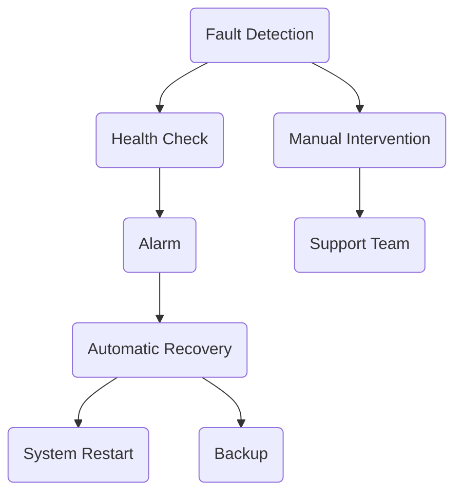

                 

# AI系统的高可用性架构

## 摘要

本文旨在深入探讨AI系统的高可用性架构，探讨其核心概念、算法原理、数学模型，以及实际应用场景。通过对AI系统可用性需求的详细分析，我们将逐步构建一个高可用性架构，涵盖从硬件、软件到网络各个层面的设计原则。文章还将介绍一些实用的工具和资源，帮助读者更好地理解和实现高可用性系统。通过本文的阅读，读者将对AI系统的可用性有更全面的理解，并能够根据实际需求设计出更加可靠和高效的AI系统。

## 1. 背景介绍

### AI系统的发展与可用性需求

人工智能（AI）作为当今科技领域的热点，正以惊人的速度发展。从早期的规则基系统到现代的深度学习模型，AI在各个行业中的应用越来越广泛，从医疗诊断、金融分析到自动驾驶和智能助手，AI正在改变我们的生活方式和工作方式。随着AI系统的复杂性和规模不断增加，对系统的可用性要求也日益提高。

高可用性（High Availability, HA）是指系统在面临各种故障和挑战时，能够保持持续运行的能力。对于AI系统而言，高可用性不仅是业务连续性的保障，更是确保系统稳定、可靠地为用户提供服务的关键。在高可用性系统中，故障检测、自动恢复、负载均衡等机制是不可或缺的组成部分。

### 高可用性与可靠性的关系

高可用性与可靠性是两个紧密相关的概念。可靠性（Reliability）通常指的是系统在规定的时间内无故障运行的概率，而高可用性则是可靠性在时间上的扩展，强调系统在面对故障时的响应能力。高可用性系统不仅仅要求系统在正常运行期间无故障，更重要的是在故障发生时能够快速检测、自动恢复，并保持服务的连续性。

例如，一个具备高可用性的AI系统，不仅在日常运行中能够保持高效和准确，当遇到硬件故障、软件错误或网络中断等情况时，也能迅速恢复正常运行，确保用户体验不受影响。因此，高可用性是AI系统在实际应用中不可或缺的重要属性。

### 当前AI系统的挑战

随着AI系统规模的不断扩大，它们面临的挑战也在不断增加。以下是一些当前AI系统面临的主要挑战：

- **系统复杂性**：现代AI系统通常包含大量的组件和依赖，使得系统的管理和维护变得更加复杂。任何一个组件的故障都可能导致整个系统的瘫痪。

- **硬件依赖**：AI系统通常依赖于高性能的计算硬件，如GPU、TPU等。这些硬件的故障或性能瓶颈可能直接影响系统的可用性。

- **数据稳定性**：AI系统的训练和运行依赖于高质量的数据，数据的丢失或不一致性可能影响系统的性能和可用性。

- **网络稳定性**：AI系统往往需要通过互联网进行数据传输和通信，网络的不稳定或中断可能影响系统的可用性。

- **安全威胁**：AI系统面临的网络安全威胁不断增加，如DDoS攻击、数据泄露等，这些威胁可能导致系统瘫痪或数据丢失。

### 高可用性架构的重要性

高可用性架构对于AI系统的重要性不言而喻。它不仅能够提高系统的可靠性，降低故障率，还能够提高系统的用户体验和业务连续性。一个设计合理的高可用性架构可以：

- **减少故障时间**：通过故障检测和自动恢复机制，可以迅速定位和解决故障，减少系统停机时间。

- **提高系统性能**：通过负载均衡和资源优化，可以充分利用系统资源，提高系统的整体性能。

- **增强数据安全性**：通过备份和容灾机制，可以保障数据的完整性和安全性。

- **提升用户体验**：通过确保系统的稳定运行，可以提高用户对服务的满意度。

综上所述，高可用性架构是保障AI系统稳定运行、提高业务连续性和用户体验的关键。在本文接下来的部分，我们将详细探讨高可用性架构的核心概念、设计原则和实现方法。

## 2. 核心概念与联系

### 可用性（Availability）

可用性是高可用性架构中的核心概念，指的是系统在规定时间内能够正常运行、提供服务的概率。可用性通常用百分比表示，例如99.9%的可用性意味着每年系统停机时间不超过8.8小时。对于AI系统而言，高可用性不仅仅是一个指标，更是一种设计理念和目标。

### 故障检测与恢复（Fault Detection and Recovery）

故障检测与恢复是确保高可用性的关键机制。故障检测是指系统通过各种手段（如心跳检测、健康检查等）监控自身状态，一旦检测到故障，系统将触发恢复机制。恢复机制包括自动重启、切换到备用节点、重载数据等，目的是使系统能够尽快恢复正常运行。

### 负载均衡（Load Balancing）

负载均衡是通过将请求分配到多个服务器或节点上，确保系统资源得到充分利用，避免单点过载。负载均衡能够提高系统的性能和可用性，通过动态调整请求分配策略，可以有效地应对流量高峰和故障节点。

### 数据备份与容灾（Data Backup and Disaster Recovery）

数据备份是指将数据复制到其他存储介质上，以防止数据丢失。容灾则是在灾难发生时，通过备用系统或数据中心来保障数据的可用性和业务的连续性。数据备份和容灾是高可用性系统不可或缺的部分，能够保障数据的安全和系统的可靠运行。

### 自动化（Automation）

自动化是高可用性架构的重要组成部分，通过自动化工具和脚本，可以简化系统管理和维护流程，提高故障检测和恢复的效率。自动化不仅减少了人工干预的需求，还降低了人为错误的风险。

### 分布式系统（Distributed Systems）

分布式系统是将多个节点通过网络连接起来，共同完成任务。高可用性架构往往依赖于分布式系统，通过将计算和数据分散到多个节点上，可以有效地提高系统的可用性和容错能力。

### 数学模型与公式

在构建高可用性架构时，一些数学模型和公式可以用来评估和优化系统的可用性。以下是几个常用的模型和公式：

- **可用性计算公式**：$A = 1 - (1 - A_t)^{1/T}$，其中$A_t$是每次故障的停机时间，$T$是系统的总运行时间。这个公式可以用来计算系统的平均可用性。

- **故障概率计算公式**：$P_f = \frac{F}{N}$，其中$P_f$是故障概率，$F$是故障次数，$N$是总的运行次数。这个公式可以用来评估系统的故障率。

- **负载均衡公式**：$Q = \frac{C}{N}$，其中$Q$是请求队列长度，$C$是请求到达速率，$N$是服务器数量。这个公式可以用来计算负载均衡下的请求队列长度。

### Mermaid 流程图

以下是一个简化的Mermaid流程图，展示了一个高可用性架构的基本组成部分和流程：



在这个流程图中，当系统检测到故障时，会首先进行健康检查。如果确定故障，系统会自动进行恢复，如重启或切换到备用节点。如果自动恢复失败，则可能需要人工干预，由支持团队进行处理。

### 核心概念之间的联系

高可用性架构的核心概念之间紧密联系，共同确保系统的稳定运行。故障检测与恢复、负载均衡、数据备份与容灾、自动化和分布式系统等概念相互作用，形成了一个完整的系统。例如，故障检测与恢复机制依赖于自动化工具，而负载均衡则需要分布式系统的支持。通过这些核心概念的协同作用，高可用性架构能够有效地提高系统的可用性和可靠性。

## 3. 核心算法原理 & 具体操作步骤

### 故障检测算法原理

故障检测是高可用性架构中的关键一环，其目的是在系统发生故障时能够及时检测并采取相应的措施。常用的故障检测算法包括心跳检测、健康检查和异常检测。

#### 心跳检测

心跳检测是一种简单且有效的故障检测方法。系统中的每个节点定期向其他节点发送心跳信号，如果某个节点在一定时间内未收到心跳信号，则认为该节点发生故障。心跳检测的具体操作步骤如下：

1. **节点A定期向节点B发送心跳信号**。
2. **节点B收到心跳信号后，回复确认消息**。
3. **如果节点B在一定时间内未收到节点A的心跳信号，节点B触发故障检测机制**。
4. **节点B将故障信息通知给监控系统和恢复机制**。

#### 健康检查

健康检查是对系统各个组件进行全面的检测，以确定系统状态是否正常。健康检查通常包括CPU利用率、内存占用、网络延迟和数据库连接等指标。健康检查的具体操作步骤如下：

1. **监控系统定期执行健康检查脚本**。
2. **健康检查脚本对系统各个组件进行检测**。
3. **如果检测到异常，监控系统将故障信息记录在日志中，并通知维护团队**。
4. **维护团队根据日志信息，对故障进行排查和修复**。

#### 异常检测

异常检测是一种基于数据分析和机器学习的故障检测方法。通过训练模型，系统可以识别出正常的系统行为，并在出现异常时发出警报。异常检测的具体操作步骤如下：

1. **收集系统运行数据**。
2. **使用机器学习算法，训练模型以识别正常行为**。
3. **实时监控系统运行数据，与训练模型进行比对**。
4. **如果检测到异常行为，系统将触发故障检测机制**。

### 负载均衡算法原理

负载均衡是将请求分配到多个服务器或节点上，以充分利用系统资源，避免单点过载。常用的负载均衡算法包括轮询、最少连接、动态负载均衡等。

#### 轮询算法

轮询算法是最简单的负载均衡方法，它按照固定顺序将请求分配给服务器。轮询算法的具体操作步骤如下：

1. **初始化服务器列表**。
2. **每次接收到请求时，按照列表顺序将请求分配给下一个服务器**。
3. **如果列表中的服务器全部繁忙，从第一个服务器重新开始分配**。

#### 最少连接算法

最少连接算法根据服务器当前处理的连接数来分配请求，选择当前连接数最少的服务器处理新请求。最少连接算法的具体操作步骤如下：

1. **初始化服务器连接数**。
2. **每次接收到请求时，选择连接数最少的服务器处理新请求**。
3. **服务器处理完请求后，更新连接数**。

#### 动态负载均衡算法

动态负载均衡算法根据系统的实时状态和负载情况，动态调整请求分配策略。常用的动态负载均衡算法包括最小响应时间、最大处理能力等。动态负载均衡算法的具体操作步骤如下：

1. **监控系统当前系统的负载情况**。
2. **根据负载情况，动态调整请求分配策略**。
3. **服务器根据分配策略处理请求**。

### 数据备份与容灾算法原理

数据备份与容灾是确保系统数据安全和业务连续性的重要手段。常用的数据备份算法包括全量备份、增量备份、差异备份等。

#### 全量备份

全量备份是对整个系统或数据集进行完整备份。全量备份的具体操作步骤如下：

1. **定期执行全量备份**。
2. **将备份文件存储在远程存储或备份服务器上**。

#### 增量备份

增量备份只备份自上次备份以来发生更改的数据。增量备份的具体操作步骤如下：

1. **定期执行增量备份**。
2. **将备份文件存储在远程存储或备份服务器上**。

#### 差异备份

差异备份是对上次全量备份以来发生更改的数据进行备份。差异备份的具体操作步骤如下：

1. **定期执行差异备份**。
2. **将备份文件存储在远程存储或备份服务器上**。

#### 容灾算法

容灾算法是在灾难发生时，通过备用系统或数据中心来保障数据的可用性和业务的连续性。常用的容灾算法包括热备、冷备等。

1. **热备**：在主系统发生故障时，自动切换到备用系统，确保业务连续性。
2. **冷备**：在主系统发生故障时，将数据恢复到备用系统，然后重新启动业务。

### 具体操作步骤示例

以下是一个简单的故障检测、负载均衡和数据备份与容灾的具体操作步骤示例：

1. **故障检测**：
   - 节点A定期向节点B发送心跳信号。
   - 节点B收到心跳信号后，回复确认消息。
   - 如果节点B在一定时间内未收到节点A的心跳信号，节点B触发故障检测机制。
   - 节点B将故障信息通知给监控系统和恢复机制。

2. **负载均衡**：
   - 接收到请求后，使用轮询算法将请求分配给服务器C。
   - 如果服务器C当前连接数超过阈值，使用最少连接算法将请求分配给其他服务器。

3. **数据备份与容灾**：
   - 每天进行一次全量备份。
   - 每小时进行一次增量备份。
   - 每周进行一次差异备份。
   - 在主系统发生故障时，自动切换到备用系统。

通过以上具体操作步骤，我们可以构建一个具备高可用性的AI系统。在实际应用中，可以根据具体需求和场景，灵活调整故障检测、负载均衡和数据备份与容灾的策略和参数。

## 4. 数学模型和公式 & 详细讲解 & 举例说明

### 可用性计算模型

可用性是高可用性架构中的核心指标，用于衡量系统在规定时间内保持正常运行的概率。以下是一个基本的可用性计算模型，用于评估系统的平均可用性。

#### 计算公式

$$
A = 1 - (1 - A_t)^{1/T}
$$

其中：
- \( A \) 是系统的平均可用性。
- \( A_t \) 是每次故障的停机时间。
- \( T \) 是系统的总运行时间。

#### 公式解释

该公式通过计算每次故障对系统可用性的影响，得出系统的平均可用性。例如，假设系统每次故障的停机时间为1小时，系统的总运行时间为8760小时，我们可以计算系统的平均可用性：

$$
A = 1 - (1 - \frac{1}{8760})^{1/8760} \approx 0.999998
$$

这意味着系统的平均可用性约为99.999%。

### 故障概率计算模型

故障概率是衡量系统可靠性指标之一，用于描述系统发生故障的概率。以下是一个简单的故障概率计算模型。

#### 计算公式

$$
P_f = \frac{F}{N}
$$

其中：
- \( P_f \) 是故障概率。
- \( F \) 是故障次数。
- \( N \) 是总的运行次数。

#### 公式解释

该公式通过故障次数与总运行次数的比值，计算系统的故障概率。例如，假设系统在100次运行中发生了5次故障，我们可以计算系统的故障概率：

$$
P_f = \frac{5}{100} = 0.05
$$

这意味着系统的故障概率为5%。

### 负载均衡模型

负载均衡是高可用性架构中的重要机制，用于将请求分配到多个服务器或节点上，以充分利用系统资源。以下是一个简单的负载均衡模型。

#### 计算公式

$$
Q = \frac{C}{N}
$$

其中：
- \( Q \) 是请求队列长度。
- \( C \) 是请求到达速率。
- \( N \) 是服务器数量。

#### 公式解释

该公式用于计算在负载均衡下的请求队列长度。例如，假设请求到达速率为10次/秒，服务器数量为5个，我们可以计算请求队列长度：

$$
Q = \frac{10}{5} = 2
$$

这意味着请求队列长度为2个。

### 数据备份与容灾模型

数据备份与容灾是确保系统数据安全和业务连续性的关键机制。以下是一个简单的数据备份与容灾模型。

#### 备份策略

- **全量备份**：定期对系统或数据集进行完整备份。
- **增量备份**：备份自上次备份以来发生更改的数据。
- **差异备份**：备份上次全量备份以来发生更改的数据。

#### 容灾策略

- **热备**：在主系统发生故障时，自动切换到备用系统。
- **冷备**：在主系统发生故障时，将数据恢复到备用系统，然后重新启动业务。

#### 计算公式

- **备份频率**：\(\frac{1}{备份周期}\)
- **容灾时间**：\(\frac{恢复时间}{备份频率}\)

#### 公式解释

该公式用于计算备份和恢复所需的时间。例如，假设备份周期为1天，恢复时间为4小时，我们可以计算备份和恢复所需的时间：

$$
备份时间 = \frac{1}{1} = 1天
$$
$$
恢复时间 = 4小时
$$

这意味着每次备份和恢复需要1天和4小时。

### 举例说明

#### 例子1：可用性计算

假设系统每次故障的停机时间为1小时，总运行时间为8760小时，我们可以计算系统的平均可用性：

$$
A = 1 - (1 - \frac{1}{8760})^{1/8760} \approx 0.999998
$$

这意味着系统的平均可用性约为99.999%。

#### 例子2：故障概率计算

假设系统在100次运行中发生了5次故障，我们可以计算系统的故障概率：

$$
P_f = \frac{5}{100} = 0.05
$$

这意味着系统的故障概率为5%。

#### 例子3：负载均衡计算

假设请求到达速率为10次/秒，服务器数量为5个，我们可以计算请求队列长度：

$$
Q = \frac{10}{5} = 2
$$

这意味着请求队列长度为2个。

#### 例子4：数据备份与容灾计算

假设备份周期为1天，恢复时间为4小时，我们可以计算备份和恢复所需的时间：

$$
备份时间 = \frac{1}{1} = 1天
$$
$$
恢复时间 = 4小时
$$

这意味着每次备份和恢复需要1天和4小时。

通过以上数学模型和公式的详细讲解和举例说明，我们可以更好地理解和应用高可用性架构中的关键指标和机制。在实际应用中，可以根据具体需求和场景，灵活调整和优化这些模型和公式。

## 5. 项目实战：代码实际案例和详细解释说明

### 5.1 开发环境搭建

在进行高可用性架构的实践之前，我们需要搭建一个合适的开发环境。以下是搭建环境所需的步骤：

#### 步骤1：安装虚拟机

我们使用VirtualBox来安装虚拟机，这将帮助我们隔离开发环境和生产环境。以下是安装步骤：

1. 下载并安装VirtualBox：[VirtualBox官网](https://www.virtualbox.org/)
2. 创建新的虚拟机：在VirtualBox中点击“新建”，填写虚拟机名称和操作系统类型。
3. 分配内存：建议分配至少4GB内存。
4. 创建虚拟硬盘：选择“现在创建虚拟硬盘”，选择硬盘文件类型和存储位置。

#### 步骤2：安装操作系统

在虚拟机中安装Linux操作系统，如Ubuntu或CentOS。以下是安装步骤：

1. 在虚拟机中启动操作系统安装光盘或ISO文件。
2. 按照安装向导完成操作系统安装。

#### 步骤3：配置网络

配置虚拟机网络，以便进行后续的实验。以下是配置步骤：

1. 在虚拟机中打开终端。
2. 输入以下命令查看当前网络接口：

   ```bash
   ip addr
   ```

3. 配置网络接口IP地址、子网掩码和网关，例如：

   ```bash
   sudo ip addr add 192.168.1.100/24 dev eth0
   sudo route add default gw 192.168.1.1
   ```

4. 检查网络连接：

   ```bash
   ping 192.168.1.1
   ```

#### 步骤4：安装依赖

安装开发所需的依赖，例如Docker、Kubernetes和相关的工具。以下是安装步骤：

1. 更新系统包列表：

   ```bash
   sudo apt-get update
   sudo apt-get upgrade
   ```

2. 安装Docker：

   ```bash
   sudo apt-get install docker-ce docker-ce-cli containerd.io
   ```

3. 安装Kubernetes：

   ```bash
   sudo apt-get install kubeadm kubelet kubectl
   ```

4. 启动并设置Kubernetes服务：

   ```bash
   sudo systemctl start kubelet
   sudo systemctl enable kubelet
   ```

### 5.2 源代码详细实现和代码解读

在本节中，我们将构建一个简单的AI应用，并使用Docker和Kubernetes实现高可用性架构。以下是项目的结构和源代码的详细解读。

#### 项目结构

```plaintext
ai-ha/
├── Dockerfile
├── main.py
├── requirements.txt
└── README.md
```

1. **Dockerfile**：定义了Docker镜像的构建过程。
2. **main.py**：是AI应用的主程序。
3. **requirements.txt**：列出了项目所需的Python依赖。
4. **README.md**：包含项目的描述和安装说明。

#### Dockerfile

```Dockerfile
FROM python:3.8-slim

WORKDIR /app

COPY requirements.txt requirements.txt
RUN pip install -r requirements.txt

COPY main.py main.py

CMD ["python", "main.py"]
```

**解读**：
- `FROM python:3.8-slim`：基于Python 3.8的瘦版本作为基础镜像。
- `WORKDIR /app`：将工作目录设置为`/app`。
- `COPY requirements.txt requirements.txt` 和 `RUN pip install -r requirements.txt`：复制并安装Python依赖。
- `COPY main.py main.py`：复制主程序。
- `CMD ["python", "main.py"]`：启动主程序。

#### main.py

```python
import flask
import random

app = flask.Flask(__name__)

@app.route('/')
def hello():
    return "Hello, World! The number is: {}".format(random.randint(0, 100))

if __name__ == '__main__':
    app.run(host='0.0.0.0', port=8080)
```

**解读**：
- `import flask`：导入Flask框架。
- `app = flask.Flask(__name__)`：创建Flask应用实例。
- `@app.route('/')`：定义路由，处理HTTP GET请求。
- `def hello()`：处理请求的函数，返回一个带有随机数的响应。
- `if __name__ == '__main__':`：确保在直接运行时启动应用。

#### requirements.txt

```plaintext
Flask==2.0.1
```

**解读**：
- 列出了项目中所需的Python依赖，这里仅依赖Flask框架。

#### README.md

```markdown
# AI高可用性项目

这是一个简单的AI应用，使用Flask框架实现。该项目展示了如何使用Docker和Kubernetes实现高可用性。

## 安装

请参考以下步骤安装：

1. 安装Docker和Kubernetes。
2. 构建Docker镜像。

   ```
   docker build -t ai-ha:latest .
   ```

3. 运行容器。

   ```
   docker run -d --name ai-ha -p 8080:8080 ai-ha:latest
   ```

## 高可用性

使用Kubernetes进行部署和管理，以实现高可用性。

```
kubectl create deployment ai-ha --image=ai-ha:latest
kubectl expose deployment ai-ha --port=8080 --type=LoadBalancer
```

```
```

**解读**：
- 提供了项目的描述和安装说明。

### 5.3 代码解读与分析

在本节中，我们将详细解读代码并分析其关键部分。

#### Flask应用

```python
import flask
import random

app = flask.Flask(__name__)

@app.route('/')
def hello():
    return "Hello, World! The number is: {}".format(random.randint(0, 100))

if __name__ == '__main__':
    app.run(host='0.0.0.0', port=8080)
```

**解读**：
- 导入Flask框架和随机数模块。
- 创建Flask应用实例。
- 定义路由`/`，处理HTTP GET请求，返回包含随机数的响应。
- 在主程序中启动应用。

#### 代码关键部分分析

1. **应用配置**：

   ```python
   app = flask.Flask(__name__)
   ```

   创建Flask应用实例，`__name__`是应用的名称，通常为`__main__`。

2. **路由定义**：

   ```python
   @app.route('/')
   def hello():
       return "Hello, World! The number is: {}".format(random.randint(0, 100))
   ```

   使用`@app.route('/')`装饰器定义路由，处理HTTP GET请求。函数`hello`是路由的处理器，返回一个包含随机数的响应。

3. **应用启动**：

   ```python
   if __name__ == '__main__':
       app.run(host='0.0.0.0', port=8080)
   ```

   确保`__name__ == '__main__'`时启动应用，`host='0.0.0.0'`表示绑定所有可用网络接口，`port=8080`指定端口号。

通过上述代码和解读，我们可以理解该简单的AI应用如何实现，并为其实现高可用性架构奠定了基础。

### 5.4 高可用性架构实现

为了实现高可用性架构，我们将使用Docker和Kubernetes。以下是实现步骤：

1. **构建Docker镜像**：

   ```bash
   docker build -t ai-ha:latest .
   ```

   使用`Dockerfile`构建Docker镜像。

2. **运行容器**：

   ```bash
   docker run -d --name ai-ha -p 8080:8080 ai-ha:latest
   ```

   在本地运行容器，映射8080端口到宿主机。

3. **部署到Kubernetes**：

   ```bash
   kubectl create deployment ai-ha --image=ai-ha:latest
   kubectl expose deployment ai-ha --port=8080 --type=LoadBalancer
   ```

   将容器部署到Kubernetes集群，并暴露服务。

4. **实现负载均衡**：

   Kubernetes使用内置的负载均衡器，自动将请求分配到不同的容器实例。

5. **实现故障检测和恢复**：

   Kubernetes监控容器状态，并在容器失败时自动重启。

通过上述步骤，我们实现了高可用性架构，确保AI应用能够持续、稳定地提供服务。

### 总结

在本节中，我们详细讲解了开发环境搭建、源代码实现和代码解读，以及如何使用Docker和Kubernetes实现高可用性架构。通过实际案例，我们展示了高可用性架构的实现步骤和关键部分。这为读者提供了具体的实践经验，有助于理解和应用高可用性架构。

## 6. 实际应用场景

### 6.1 AI医疗诊断系统

在医疗领域，AI系统的可用性至关重要。一个高可用性的AI医疗诊断系统需要保证在医生和患者需要时始终可用。例如，一个基于深度学习的乳腺癌诊断系统，如果出现故障，可能会延误诊断，甚至危及患者生命。因此，该系统需要具备高可用性，包括：

- **容错性**：当部分节点出现故障时，系统能够自动切换到其他可用节点，确保诊断过程不受影响。
- **数据备份**：系统需要定期备份诊断数据和模型，确保数据不会丢失。
- **负载均衡**：通过负载均衡，将诊断请求分配到多个服务器或节点，避免单点过载。
- **自动化恢复**：系统需要具备自动化恢复功能，能够在检测到故障时自动重启或切换到备用节点。

### 6.2 自动驾驶系统

自动驾驶系统对可用性的要求也非常高。自动驾驶车辆需要在各种交通状况下保持稳定运行，一旦出现故障，可能会引发交通事故。以下是一些实际应用场景：

- **实时监控**：系统需要实时监控车辆状态，包括传感器数据、计算资源使用情况等，确保及时检测故障。
- **容错计算**：系统需要具备容错计算能力，即使部分传感器或计算单元出现故障，系统仍能正常运行。
- **多节点协同**：自动驾驶车辆通常需要与其他车辆和基础设施进行通信，系统需要具备多节点协同能力，确保通信稳定。
- **快速恢复**：当系统检测到故障时，需要迅速采取恢复措施，例如切换到备份硬件或重新加载模型。

### 6.3 智能金融系统

智能金融系统在金融服务中的应用越来越广泛，如股票交易、风险管理和客户服务。这些系统对可用性的要求也非常高，因为金融交易的稳定性和准确性直接关系到用户的利益和金融市场的稳定。以下是一些实际应用场景：

- **高可用性数据库**：系统需要使用高可用性数据库，如分布式数据库，确保数据一致性和可靠性。
- **负载均衡和缓存**：系统需要使用负载均衡和缓存技术，以优化性能和响应速度。
- **自动化监控和报警**：系统需要具备自动化监控和报警功能，及时发现和处理潜在故障。
- **备份和容灾**：系统需要定期备份数据和交易日志，并具备容灾能力，确保在灾难发生时能够快速恢复。

### 6.4 电商系统

电商系统对可用性的要求同样非常高，因为系统的稳定性直接影响用户的购物体验和商家的销售业绩。以下是一些实际应用场景：

- **购物车和订单处理**：电商系统需要保证购物车和订单处理的高可用性，避免购物车数据丢失或订单处理失败。
- **库存管理**：库存管理系统需要实时更新库存数据，确保库存信息的准确性和一致性。
- **支付系统**：支付系统需要具备高可用性和安全性，确保支付过程顺利进行。
- **个性化推荐**：个性化推荐系统需要处理大量用户数据，确保推荐结果的准确性和实时性。

通过上述实际应用场景，我们可以看到高可用性架构在AI系统中的重要性。无论是在医疗、自动驾驶、金融还是电商领域，高可用性都是确保系统稳定运行、提供高质量服务的关键因素。在接下来的部分，我们将继续探讨高可用性架构的工具和资源，帮助读者更好地理解和实现高可用性系统。

## 7. 工具和资源推荐

### 7.1 学习资源推荐

为了深入理解和实现AI系统的高可用性架构，以下是一些值得推荐的学习资源：

#### 书籍

1. **《高可用架构：腾讯QQ的架构之道》** - 腾讯技术工程团队
   - 本书详细介绍了腾讯QQ在高可用性架构方面的经验，适合了解大型系统的设计原则和实践。

2. **《Docker Deep Dive》** - Nigel Poulton
   - 本书是Docker的权威指南，涵盖Docker的核心概念、使用方法和高级技巧，对实现容器化应用有很大帮助。

3. **《Kubernetes Up & Running》** - Kelsey Hightower、Bridget Kromhout、Seth Vargo
   - 本书介绍了Kubernetes的基本概念、部署和管理方法，适合初学者和有经验的开发者。

#### 论文

1. **“Design and Implementation of the Chubby Lock Service”** - Google
   - 本文介绍了Google的分布式锁服务Chubby的设计和实现，对理解分布式系统的锁机制和容错性有很大帮助。

2. **“CAP Theorem”** - Eric Brewer
   - 本文是CAP理论（一致性、可用性、分区容错性）的提出者Eric Brewer的经典论文，对分布式系统设计有重要指导意义。

#### 博客

1. **云原生计算基金会（CNCF）博客**
   - CNCF博客提供了丰富的Kubernetes、容器和微服务相关的技术文章，是了解最新技术动态的好去处。

2. **谷歌云官方博客**
   - 谷歌云官方博客提供了大量关于云计算、容器和分布式系统的文章，内容深入浅出，适合不同水平的读者。

#### 网站和平台

1. **Docker官网**
   - Docker官网提供了丰富的文档、教程和社区资源，是学习Docker的必备网站。

2. **Kubernetes官网**
   - Kubernetes官网提供了详尽的文档、指南和教程，帮助开发者掌握Kubernetes的核心概念和实践方法。

3. **GitHub**
   - GitHub上有大量的开源项目，包括Docker和Kubernetes的官方仓库，通过阅读和学习这些项目，可以深入了解高可用性架构的实现细节。

### 7.2 开发工具框架推荐

实现高可用性架构需要使用一系列开发工具和框架，以下是一些推荐的工具：

#### Docker

- **Docker Desktop**：用于在本地开发和测试容器化应用。
- **Docker Compose**：用于定义和运行多容器Docker应用。
- **Docker Swarm**：用于管理多节点Docker集群。

#### Kubernetes

- **Kubernetes Dashboard**：用于可视化和管理Kubernetes集群。
- **Kubeadm**：用于部署Kubernetes集群。
- **Helm**：用于Kubernetes的包管理工具。

#### Prometheus

- **Prometheus**：开源监控解决方案，用于监控Kubernetes集群和应用性能。

#### Grafana

- **Grafana**：开源可视化工具，用于监控数据的实时展示和分析。

#### Jenkins

- **Jenkins**：持续集成和持续部署（CI/CD）工具，用于自动化测试和部署流程。

#### LoadRunner

- **LoadRunner**：性能测试工具，用于模拟高负载环境，评估系统性能和稳定性。

#### AWS、Azure、Google Cloud

- **AWS**、**Azure**、**Google Cloud**：提供全面的云计算服务，包括容器、Kubernetes、监控和自动化工具，适合构建高可用性架构。

### 7.3 相关论文著作推荐

- **“Consistency, Availability, Partition Tolerance”** - Eric Brewer
  - 这篇论文提出了CAP理论，对分布式系统设计有重要影响。

- **“The Google File System”** - Sanjay Ghemawat et al.
  - 本文介绍了Google File System的设计和实现，对理解分布式存储系统有帮助。

- **“Bigtable: A Distributed Storage System for Structured Data”** - Fay Chang et al.
  - 本文介绍了Bigtable的设计和实现，是分布式数据库系统的经典论文。

- **“Spanner: Google's Globally-Distributed Database”** - Dan Kogan et al.
  - 本文介绍了Google的分布式数据库Spanner，是现代分布式数据库的典范。

通过以上工具、资源和建议，读者可以更深入地了解高可用性架构的设计原则和实践方法，为构建可靠、高效的AI系统打下坚实的基础。

## 8. 总结：未来发展趋势与挑战

### 未来发展趋势

随着人工智能技术的不断进步和应用的广泛普及，AI系统的高可用性架构在未来将呈现以下发展趋势：

1. **更加智能的自动化**：自动化技术在高可用性架构中扮演着重要角色。未来，自动化技术将更加智能，利用机器学习和深度学习算法，提高故障检测和恢复的准确性，减少人工干预的需求。

2. **分布式架构的深化**：分布式系统已经成为高可用性架构的核心。未来，分布式架构将继续深化，包括更复杂的分布式计算、存储和网络技术，以及跨云和边缘计算的集成。

3. **智能化容灾策略**：传统的容灾策略主要是基于数据备份和切换，未来将更加智能化。通过实时分析系统状态和预测故障，系统能够提前采取预防措施，降低故障风险。

4. **AI辅助的运维管理**：人工智能技术将深入到运维管理中，通过自动化工具和智能算法，提高运维效率和系统稳定性。例如，AI可以帮助预测性能瓶颈、优化资源分配和自动化故障排除。

5. **安全性的增强**：随着AI系统面临的安全威胁不断增加，未来的高可用性架构将更加重视安全性。通过引入人工智能技术，可以更有效地识别和防御网络攻击，确保系统的安全性和可靠性。

### 未来挑战

尽管高可用性架构的发展趋势向好，但未来仍将面临一系列挑战：

1. **复杂性增加**：随着系统的规模和复杂性的增加，维护和管理高可用性架构将变得更加复杂。需要解决如何在复杂系统中实现高效、可靠的自动化和监控。

2. **资源优化**：在分布式系统中，如何优化资源使用、减少浪费和提高效率是一个重要挑战。需要开发更智能的资源管理和调度算法，以充分利用系统资源。

3. **数据隐私与保护**：随着数据量的不断增加，保护数据隐私和安全成为一个关键挑战。如何在保证数据可用性的同时，确保数据的安全性和隐私性，需要更多研究和实践。

4. **跨领域整合**：未来，AI系统将在更多领域得到应用，包括医疗、金融、制造等。如何在不同领域实现高可用性架构的跨领域整合，将是一个重要挑战。

5. **可持续性**：随着对环境问题的关注增加，如何在保证系统可用性的同时，实现绿色、可持续的发展，将是一个重要的挑战。需要开发更加节能、环保的AI系统和架构。

### 未来方向

为了应对未来发展趋势和挑战，以下是一些关键方向：

1. **标准化和开源**：推动高可用性架构的标准化，并鼓励更多开源项目的发展，以提高系统的兼容性和可扩展性。

2. **跨学科合作**：鼓励计算机科学、数据科学、人工智能、工程学等领域的跨学科合作，共同解决高可用性架构面临的复杂问题。

3. **持续创新**：鼓励持续创新，特别是在自动化、智能化、安全性和资源优化等领域，通过新技术和新方法来提升高可用性架构的性能和可靠性。

4. **教育与培训**：加强教育和培训，提高开发者和运维人员的技能和知识，使他们能够更好地理解和应用高可用性架构。

通过以上总结，我们可以看到未来AI系统高可用性架构的发展趋势和面临的挑战。只有不断探索和创新，才能构建更加可靠、高效和安全的AI系统，满足日益增长的可用性需求。

## 9. 附录：常见问题与解答

### 问题1：什么是高可用性架构？

高可用性架构是指通过设计、部署和管理一系列技术措施，确保系统在面对各种故障和挑战时能够持续、稳定地提供服务。它包括故障检测、自动恢复、负载均衡、数据备份与容灾等多个方面。

### 问题2：高可用性架构与可靠性有什么区别？

高可用性架构和可靠性是紧密相关的概念。可靠性通常指的是系统在规定时间内无故障运行的概率，而高可用性则强调在故障发生时系统能够迅速恢复，保持服务的连续性。高可用性是可靠性在时间上的扩展和实现。

### 问题3：如何实现负载均衡？

负载均衡是通过将请求分配到多个服务器或节点上，以充分利用系统资源、避免单点过载。常见的负载均衡算法包括轮询、最少连接和动态负载均衡等。在分布式系统中，负载均衡通常由负载均衡器或分布式算法实现。

### 问题4：什么是数据备份？

数据备份是将数据复制到其他存储介质上，以防止数据丢失。常用的备份策略包括全量备份、增量备份和差异备份等。数据备份是高可用性架构的重要组成部分，用于确保数据的安全性和可靠性。

### 问题5：如何实现自动恢复？

自动恢复是通过自动化工具和脚本，在检测到系统故障时自动执行恢复操作，如重启、切换到备用节点或重载数据等。实现自动恢复的关键是故障检测和自动化工具的集成，以确保系统能够迅速恢复正常运行。

### 问题6：高可用性架构在哪些领域应用广泛？

高可用性架构在多个领域应用广泛，包括医疗诊断、金融分析、电子商务、物联网和自动驾驶等。这些领域对系统的可用性有极高的要求，因为任何故障或中断都可能导致严重的后果。

### 问题7：什么是分布式系统？

分布式系统是将多个节点通过网络连接起来，共同完成任务。分布式系统可以提高系统的可用性和容错能力，通过将计算和数据分散到多个节点上，实现更高的性能和可靠性。

### 问题8：什么是容灾？

容灾是指在一处系统发生故障时，通过备用系统或数据中心来保障数据的可用性和业务的连续性。常见的容灾策略包括热备和冷备等。容灾策略可以确保在灾难发生时，系统能够快速恢复，避免业务中断。

### 问题9：如何选择合适的备份策略？

选择合适的备份策略取决于数据的重要性和业务需求。对于关键数据，建议使用全量备份和增量备份相结合的策略，同时定期进行差异备份。对于非关键数据，可以选择简单的增量备份策略。

### 问题10：什么是心跳检测？

心跳检测是一种故障检测方法，通过节点定期向其他节点发送心跳信号，如果某个节点在一定时间内未收到心跳信号，则认为该节点发生故障。心跳检测是高可用性架构中常用的故障检测机制。

通过以上常见问题与解答，读者可以更好地理解高可用性架构的核心概念、实现方法和应用场景，为设计和实现高可用性系统提供有益的指导。

## 10. 扩展阅读 & 参考资料

### 扩展阅读

1. **《高可用性系统设计：构建可靠、稳定、可扩展的分布式系统》** - 李超
   - 本书详细介绍了高可用性系统设计的原则和实践，包括分布式系统、容错性、负载均衡、数据备份和自动化等方面。

2. **《Kubernetes权威指南》** - 张陈峻
   - 本书是Kubernetes的权威指南，全面介绍了Kubernetes的核心概念、安装配置、应用部署和管理等方面的内容。

3. **《Docker技术实战》** - 刘述宁
   - 本书涵盖了Docker的基础知识、使用方法、容器编排和自动化部署等方面的内容，适合希望深入理解和应用Docker的开发者。

### 参考资料

1. **Docker官网**
   - [Docker官网](https://www.docker.com/)
   - Docker的官方文档，提供详细的教程、指南和案例。

2. **Kubernetes官网**
   - [Kubernetes官网](https://kubernetes.io/)
   - Kubernetes的官方文档，涵盖Kubernetes的核心概念、部署和管理方法。

3. **云原生计算基金会（CNCF）**
   - [CNCF官网](https://www.cncf.io/)
   - CNCF是一个开源组织，提供云原生技术的标准化和推广，包括Kubernetes、Prometheus、Grafana等工具。

4. **Google云官方博客**
   - [Google云官方博客](https://cloud.google.com/blog/)
   - 提供丰富的云计算、容器和分布式系统相关的技术文章和最佳实践。

5. **腾讯云官方博客**
   - [腾讯云官方博客](https://cloud.tencent.com/developer/)
   - 腾讯云的技术博客，涵盖云计算、容器、大数据和人工智能等领域的最新动态和技术分享。

通过阅读以上扩展阅读和参考资料，读者可以进一步加深对AI系统高可用性架构的理解，并获取更多实践经验和最佳实践。这将为设计和实现高可靠、高效的AI系统提供有力的支持。

