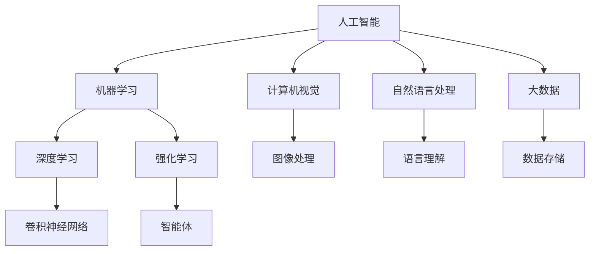

                 

### 背景介绍

随着人工智能（AI）技术的飞速发展，AI编程已成为软件工程领域的一个重要分支。AI编程不仅仅是编写能够解决特定问题的代码，更是涉及如何设计、实现和优化能够自主学习和适应环境的智能系统。近年来，深度学习、强化学习等算法的突破，以及云计算和大数据技术的普及，使得AI编程的应用范围不断拓展，从自动驾驶、智能家居到医疗诊断、金融风控等领域，AI编程正在深刻地改变着我们的生活方式和社会结构。

然而，随着AI编程的普及和应用，一系列技术挑战也不断涌现。如何确保AI系统的透明性和可解释性，如何提升AI算法的效率和鲁棒性，如何处理大规模数据的高效存储和计算，以及如何保证AI系统的安全性和隐私性，都是当前AI编程领域需要重点解决的问题。这些问题不仅影响了AI编程的技术实现，也对整个社会的伦理、法律和道德提出了新的挑战。

本文旨在探讨AI编程的新思路和技术挑战，通过逐步分析AI编程的核心概念、算法原理、数学模型以及实际应用，帮助读者深入了解AI编程的现状和未来发展。文章将从以下几个方面展开：

1. 核心概念与联系
2. 核心算法原理与具体操作步骤
3. 数学模型和公式及其详细讲解与举例说明
4. 项目实战：代码实际案例和详细解释说明
5. 实际应用场景
6. 工具和资源推荐
7. 总结：未来发展趋势与挑战

通过这篇文章，我们希望能够为AI编程领域的从业者提供一些新的思路和解决方法，同时也为广大技术爱好者提供一份有价值的参考。

### 核心概念与联系

在探讨AI编程的核心概念之前，我们需要先了解一些基本的概念和它们之间的关系。以下是本文中涉及的核心概念：

#### 1. 人工智能（AI）

人工智能，简而言之，是使计算机系统能够模拟人类智能行为的技术。这包括学习、推理、感知、理解和决策等方面。AI可以分为两大类：弱AI和强AI。弱AI专注于解决特定问题，而强AI则具备普遍的智能能力，能够在各种复杂环境中自主学习和适应。

#### 2. 深度学习（Deep Learning）

深度学习是AI的一个重要分支，它通过模仿人脑的神经网络结构来实现学习和推理。深度学习算法通常涉及多层神经元的网络结构，通过层层提取特征，能够处理大量复杂数据。常见的深度学习模型包括卷积神经网络（CNN）、循环神经网络（RNN）和生成对抗网络（GAN）等。

#### 3. 强化学习（Reinforcement Learning）

强化学习是一种通过试错来学习最佳策略的机器学习方法。在强化学习中，智能体通过与环境的交互来学习如何获取最大的奖励。强化学习在游戏、机器人控制和自动驾驶等领域有着广泛的应用。

#### 4. 机器学习（Machine Learning）

机器学习是AI的一个分支，它关注于从数据中自动学习规律和模式。机器学习算法可以分为监督学习、无监督学习和半监督学习。监督学习依赖于标注数据，无监督学习则从未标注的数据中提取特征，半监督学习结合了两者的特点。

#### 5. 计算机视觉（Computer Vision）

计算机视觉是使计算机能够理解和解释图像和视频数据的学科。它涉及图像处理、图像识别和图像生成等方面。计算机视觉在人脸识别、自动驾驶和医疗诊断等领域具有重要意义。

#### 6. 自然语言处理（Natural Language Processing，NLP）

自然语言处理是使计算机能够理解和生成人类语言的技术。NLP涵盖了语言理解、语言生成、语音识别和机器翻译等方面。NLP在智能助手、文本分析和社交媒体分析等领域有着广泛应用。

#### 7. 大数据（Big Data）

大数据是指无法使用传统数据处理工具在合理时间内进行捕获、管理和处理的数据集合。大数据技术包括数据存储、数据分析和数据可视化等。大数据在商业智能、医疗健康和金融风控等领域发挥着关键作用。

这些核心概念之间存在紧密的联系。例如，深度学习和强化学习都是机器学习的重要分支，它们在AI编程中有着广泛的应用。计算机视觉和自然语言处理则依赖于机器学习技术，用于解决图像和文本数据的处理问题。而大数据技术则为AI编程提供了海量的数据资源，使得AI系统能够进行更高效的学习和推理。

为了更好地理解这些概念之间的联系，我们可以使用Mermaid流程图来展示它们之间的关系。以下是一个简单的Mermaid流程图示例：



这个流程图展示了人工智能作为一个整体，如何通过机器学习、深度学习、强化学习等分支，与其他学科（如计算机视觉、自然语言处理和大数据）相互联系和相互作用。

通过以上核心概念和它们之间的联系，我们可以更好地理解AI编程的复杂性和多样性。在接下来的章节中，我们将深入探讨这些概念的具体实现和应用，为读者提供更深入的技术见解和实际案例。

### 核心算法原理与具体操作步骤

在了解了AI编程的核心概念和它们之间的联系后，接下来我们将深入探讨AI编程的核心算法原理，并详细讲解其具体操作步骤。以下是几个常见的AI算法及其工作原理：

#### 1. 卷积神经网络（Convolutional Neural Networks，CNN）

卷积神经网络是一种专门用于图像处理的深度学习模型。其核心思想是通过卷积层逐层提取图像中的特征，从而实现对图像的分类、检测和分割。

**具体操作步骤：**

1. **输入层**：接收图像数据，通常为二维矩阵。
2. **卷积层**：使用卷积核（滤波器）对输入图像进行卷积操作，提取图像的特征。
3. **激活函数**：对卷积后的特征进行非线性变换，常用的激活函数有ReLU（修正线性单元）。
4. **池化层**：对卷积后的特征进行下采样，减少参数数量和数据维度。
5. **全连接层**：将卷积层和池化层输出的特征映射到输出类别，通过softmax函数进行分类。

**示例代码：**

```python
import tensorflow as tf

# 创建卷积神经网络模型
model = tf.keras.Sequential([
    tf.keras.layers.Conv2D(32, (3, 3), activation='relu', input_shape=(28, 28, 1)),
    tf.keras.layers.MaxPooling2D((2, 2)),
    tf.keras.layers.Flatten(),
    tf.keras.layers.Dense(128, activation='relu'),
    tf.keras.layers.Dense(10, activation='softmax')
])

# 编译模型
model.compile(optimizer='adam',
              loss='categorical_crossentropy',
              metrics=['accuracy'])

# 训练模型
model.fit(x_train, y_train, epochs=5, batch_size=32)
```

#### 2. 循环神经网络（Recurrent Neural Networks，RNN）

循环神经网络是一种用于处理序列数据的神经网络，能够捕捉序列中的长期依赖关系。

**具体操作步骤：**

1. **输入层**：接收序列数据，通常为时间步上的特征向量。
2. **隐藏层**：通过循环连接将前一时间步的信息传递到当前时间步。
3. **激活函数**：对隐藏层输出进行非线性变换，常用的激活函数有ReLU。
4. **输出层**：将隐藏层输出映射到输出序列，通过softmax函数进行分类。

**示例代码：**

```python
import tensorflow as tf

# 创建循环神经网络模型
model = tf.keras.Sequential([
    tf.keras.layers.LSTM(128, input_shape=(timesteps, features)),
    tf.keras.layers.Dense(1, activation='sigmoid')
])

# 编译模型
model.compile(optimizer='adam',
              loss='binary_crossentropy',
              metrics=['accuracy'])

# 训练模型
model.fit(x_train, y_train, epochs=5, batch_size=32)
```

#### 3. 生成对抗网络（Generative Adversarial Networks，GAN）

生成对抗网络是一种通过两个对抗性网络（生成器和判别器）的博弈来生成逼真数据的模型。

**具体操作步骤：**

1. **生成器**：生成假数据，试图骗过判别器。
2. **判别器**：判断输入数据是真实数据还是生成数据。
3. **训练过程**：生成器和判别器交替训练，生成器不断优化其生成数据的能力，而判别器不断优化其鉴别能力。

**示例代码：**

```python
import tensorflow as tf
from tensorflow.keras.models import Sequential
from tensorflow.keras.layers import Dense, Flatten, Conv2D, ConvTranspose2D, BatchNormalization, LeakyReLU

# 创建生成器和判别器模型
generator = Sequential([
    Flatten(input_shape=(28, 28, 1)),
    Dense(128),
    LeakyReLU(alpha=0.2),
    Dense(128),
    LeakyReLU(alpha=0.2),
    Dense(784),
    LeakyReLU(alpha=0.2),
    Reshape((28, 28, 1))
])

discriminator = Sequential([
    Flatten(input_shape=(28, 28, 1)),
    Dense(128),
    LeakyReLU(alpha=0.2),
    Dense(1, activation='sigmoid')
])

# 编译模型
discriminator.compile(optimizer='adam', loss='binary_crossentropy')
generator.compile(optimizer='adam', loss='binary_crossentropy')

# 训练模型
for epoch in range(epochs):
    # 生成随机噪声作为生成器的输入
    noise = np.random.normal(0, 1, (batch_size, 100))
    # 生成假图像
    gen_images = generator.predict(noise)
    # 生成真图像
    real_images = x_train[np.random.randint(0, x_train.shape[0], batch_size)]
    # 将假图像和真图像合并
    X = np.concatenate([real_images, gen_images])
    # 标记真实图像为1，生成图像为0
    y = np.zeros(2*batch_size)
    y[batch_size:] = 1
    # 训练判别器
    d_loss = discriminator.train_on_batch(X, y)
    # 训练生成器
    noise = np.random.normal(0, 1, (batch_size, 100))
    y_gen = np.zeros(2*batch_size)
    y_gen[batch_size:] = 1
    g_loss = generator.train_on_batch(noise, y_gen)
```

通过以上示例代码，我们可以看到如何实现和应用卷积神经网络、循环神经网络和生成对抗网络等核心算法。这些算法在AI编程中有着广泛的应用，是构建智能系统的重要工具。

### 数学模型和公式及其详细讲解与举例说明

在深入理解AI编程的核心算法原理后，接下来我们将探讨这些算法背后的数学模型和公式，并通过详细讲解和举例说明，帮助读者更好地掌握这些概念。

#### 1. 深度学习中的反向传播算法

深度学习中的反向传播算法是一种用于训练神经网络的重要算法。它通过计算损失函数关于网络参数的梯度，从而更新网络参数，以达到最小化损失函数的目的。

**数学模型：**

假设我们有一个多层神经网络，其中第\( l \)层的输入和输出可以表示为：
\[ z^{(l)} = \mathbf{W}^{(l)}\mathbf{a}^{(l-1)} + b^{(l)} \]
\[ \mathbf{a}^{(l)} = \sigma(z^{(l)}) \]

其中，\( \mathbf{W}^{(l)} \)是第\( l \)层的权重矩阵，\( b^{(l)} \)是第\( l \)层的偏置向量，\( \mathbf{a}^{(l-1)} \)是第\( l-1 \)层的输出，\( \sigma \)是激活函数，通常使用ReLU或Sigmoid函数。

损失函数可以表示为：
\[ J(\theta) = \frac{1}{m} \sum_{i=1}^{m} -y^{(i)} \log(a^{(L)}_i) - (1 - y^{(i)}) \log(1 - a^{(L)}_i) \]

其中，\( m \)是训练样本的数量，\( y^{(i)} \)是第\( i \)个样本的真实标签，\( a^{(L)}_i \)是第\( i \)个样本在输出层\( L \)的输出。

**反向传播算法：**

反向传播算法的核心思想是计算损失函数关于网络参数的梯度，并通过梯度下降法更新网络参数。

具体步骤如下：

1. **前向传播**：计算每层神经元的输入和输出。
2. **计算输出误差**：计算输出层的误差。
3. **反向传播**：从输出层开始，逐层计算每个参数的梯度。
4. **参数更新**：使用梯度下降法更新网络参数。

**示例代码：**

```python
import numpy as np

# 假设有一个两层神经网络，激活函数为ReLU
def forward_propagation(x, W1, b1, W2, b2):
    z1 = np.dot(x, W1) + b1
    a1 = np.maximum(0, z1)
    z2 = np.dot(a1, W2) + b2
    a2 = np.dot(z2, W2) + b2
    return a2

# 计算梯度
def backward_propagation(x, y, a2, W1, W2, b1, b2):
    m = x.shape[0]
    dz2 = a2 - y
    dW2 = (1/m) * np.dot(dz2, a1.T)
    db2 = (1/m) * np.sum(dz2, axis=0)
    da1 = np.dot(dz2, W2.T)
    dz1 = np.dot(da1, np.where(a1 > 0, 1, 0))
    dW1 = (1/m) * np.dot(dz1, x.T)
    db1 = (1/m) * np.sum(dz1, axis=0)
    return dW1, dW2, db1, db2

# 参数初始化
W1 = np.random.randn(n1, n2)
b1 = np.zeros((1, n1))
W2 = np.random.randn(n2, n3)
b2 = np.zeros((1, n2))

# 训练模型
for epoch in range(1000):
    a2 = forward_propagation(x, W1, b1, W2, b2)
    dW1, dW2, db1, db2 = backward_propagation(x, y, a2, W1, W2, b1, b2)
    W1 -= learning_rate * dW1
    b1 -= learning_rate * db1
    W2 -= learning_rate * dW2
    b2 -= learning_rate * db2
```

#### 2. 强化学习中的Q学习算法

Q学习算法是一种通过试错来学习最佳策略的强化学习算法。它的核心思想是计算每个动作在当前状态下的预期奖励，并通过更新Q值来学习最佳策略。

**数学模型：**

状态-动作值函数（Q值）可以表示为：
\[ Q(s, a) = \sum_{j} p(s', j) \cdot r(s, a, s') + \gamma \cdot \max_{a'} Q(s', a') \]

其中，\( s \)是当前状态，\( a \)是当前动作，\( s' \)是下一状态，\( r(s, a, s') \)是奖励函数，\( p(s', j) \)是状态转移概率，\( \gamma \)是折扣因子，\( \max_{a'} Q(s', a') \)是下一状态的最大Q值。

**更新规则：**

\[ Q(s, a) \leftarrow Q(s, a) + \alpha \cdot (r(s, a, s') + \gamma \cdot \max_{a'} Q(s', a') - Q(s, a)) \]

其中，\( \alpha \)是学习率。

**示例代码：**

```python
import numpy as np

# 初始化Q值矩阵
Q = np.zeros((n_states, n_actions))

# 设置参数
learning_rate = 0.1
gamma = 0.9

# 强化学习过程
for episode in range(n_episodes):
    state = env.reset()
    done = False
    while not done:
        action = np.argmax(Q[state, :])
        next_state, reward, done, _ = env.step(action)
        Q[state, action] = Q[state, action] + learning_rate * (reward + gamma * np.max(Q[next_state, :]) - Q[state, action])
        state = next_state

# 模型评估
state = env.reset()
done = False
while not done:
    action = np.argmax(Q[state, :])
    state, reward, done, _ = env.step(action)
    print("Reward:", reward)
```

通过以上数学模型和公式的讲解与举例说明，我们可以更好地理解深度学习中的反向传播算法和强化学习中的Q学习算法。这些算法是AI编程中的基础，为构建高效智能系统提供了重要的理论支持。

### 项目实战：代码实际案例和详细解释说明

为了更好地展示AI编程的核心算法原理和数学模型在实际项目中的应用，我们将通过一个实际项目案例来进行讲解。本案例将使用卷积神经网络（CNN）进行手写数字识别，代码实现将采用TensorFlow和Keras框架。

#### 1. 开发环境搭建

首先，我们需要搭建一个适合AI编程的开发环境。以下是所需的软件和工具：

- Python 3.x
- TensorFlow 2.x
- Keras 2.x
- Jupyter Notebook（用于代码实现和可视化）

您可以从Python官方网站（https://www.python.org/）下载并安装Python，然后通过pip命令安装TensorFlow和Keras：

```bash
pip install tensorflow
pip install keras
```

#### 2. 源代码详细实现和代码解读

以下是一个简单但完整的手写数字识别项目，我们将分步骤进行代码实现和解释。

```python
import numpy as np
import tensorflow as tf
from tensorflow.keras import layers, models
from tensorflow.keras.datasets import mnist
from tensorflow.keras.utils import to_categorical

# 加载数据集
(x_train, y_train), (x_test, y_test) = mnist.load_data()

# 数据预处理
x_train = x_train.reshape((-1, 28, 28, 1)).astype('float32') / 255.0
x_test = x_test.reshape((-1, 28, 28, 1)).astype('float32') / 255.0
y_train = to_categorical(y_train)
y_test = to_categorical(y_test)

# 构建模型
model = models.Sequential([
    layers.Conv2D(32, (3, 3), activation='relu', input_shape=(28, 28, 1)),
    layers.MaxPooling2D((2, 2)),
    layers.Conv2D(64, (3, 3), activation='relu'),
    layers.MaxPooling2D((2, 2)),
    layers.Flatten(),
    layers.Dense(64, activation='relu'),
    layers.Dense(10, activation='softmax')
])

# 编译模型
model.compile(optimizer='adam',
              loss='categorical_crossentropy',
              metrics=['accuracy'])

# 训练模型
model.fit(x_train, y_train, epochs=5, batch_size=32, validation_data=(x_test, y_test))

# 模型评估
test_loss, test_acc = model.evaluate(x_test, y_test)
print('Test accuracy:', test_acc)
```

**代码解读：**

1. **数据加载与预处理**：
   - 加载MNIST数据集，这是最常用的手写数字识别数据集。
   - 数据预处理包括归一化（将像素值缩放到[0, 1]区间）和reshape（调整数据形状以适应模型输入）。

2. **模型构建**：
   - 使用`models.Sequential`创建一个序列模型。
   - 添加卷积层（`Conv2D`），使用ReLU激活函数，以及池化层（`MaxPooling2D`）来提取图像特征。
   - 通过全连接层（`Dense`）进行分类，最后一层使用softmax激活函数。

3. **模型编译**：
   - 设置优化器（`adam`）、损失函数（`categorical_crossentropy`）和评价指标（`accuracy`）。

4. **模型训练**：
   - 使用`fit`方法训练模型，设置训练轮数（`epochs`）和批量大小（`batch_size`）。
   - 使用`validation_data`参数对测试集进行验证。

5. **模型评估**：
   - 使用`evaluate`方法评估模型在测试集上的性能。

#### 3. 代码解读与分析

- **数据预处理**：归一化是深度学习中的常见操作，可以加快模型的训练速度和改善训练效果。reshape操作确保数据形状与模型输入层匹配。

- **模型构建**：卷积层通过卷积操作提取图像中的局部特征，池化层用于降低数据维度，同时保留重要的特征信息。全连接层用于分类，最后一层的softmax函数确保输出概率分布。

- **模型编译**：优化器和损失函数是模型训练的核心参数，`adam`优化器是一种高效的梯度下降方法，`categorical_crossentropy`用于多分类问题。

- **模型训练**：`fit`方法执行模型的训练过程，通过迭代调整模型参数以最小化损失函数。

- **模型评估**：`evaluate`方法用于评估模型在测试集上的性能，帮助我们了解模型在实际应用中的表现。

通过以上实际项目案例，我们展示了如何使用卷积神经网络进行手写数字识别，并详细解读了代码的实现过程。这个项目不仅帮助我们理解了CNN的原理，还提供了实际操作的实践经验，是深入学习AI编程的宝贵资源。

### 实际应用场景

AI编程技术的迅猛发展为各行各业带来了深远的影响，特别是在自动驾驶、医疗诊断、金融风控等关键领域。以下将介绍AI编程在这些领域的实际应用场景，并探讨其带来的变革和挑战。

#### 自动驾驶

自动驾驶技术是AI编程的重要应用领域之一。通过深度学习和强化学习算法，自动驾驶系统能够实时感知道路环境、做出决策和规划行驶路径。自动驾驶车辆不仅能够提高交通安全和效率，还能为出行提供更多的便利。

**应用场景：**自动驾驶汽车、无人机、无人驾驶卡车等。

**变革与挑战：**
- **变革**：自动驾驶技术有望彻底改变交通出行模式，减少交通事故，提高道路利用率。
- **挑战**：如何确保自动驾驶系统的安全性和可靠性，特别是在复杂多变的交通环境中；同时，如何处理大量的传感器数据，提高系统的实时响应能力。

#### 医疗诊断

AI编程在医疗诊断领域也有着广泛的应用。通过计算机视觉和自然语言处理技术，AI系统能够辅助医生进行影像诊断、病理分析和病历管理。

**应用场景：**医学影像诊断、病理分析、疾病预测和个性化治疗。

**变革与挑战：**
- **变革**：AI技术能够提高诊断的准确性和效率，为患者提供更快速、准确的医疗服务。
- **挑战**：如何确保AI系统的诊断结果与医生的经验和判断一致，如何处理医疗数据隐私和伦理问题。

#### 金融风控

金融风控是金融行业的重要组成部分，AI编程在金融风控中的应用主要包括欺诈检测、信用评分和投资策略优化等。

**应用场景：**银行、证券、保险等金融机构。

**变革与挑战：**
- **变革**：AI技术能够提高风控系统的实时性和准确性，降低金融机构的运营风险。
- **挑战**：如何处理海量金融数据，提高模型的可解释性和透明性，以防止算法偏见和数据泄露。

#### 其他领域

除了上述领域，AI编程还在零售、教育、制造等领域有着广泛的应用。例如，通过推荐系统优化用户购物体验，通过自然语言处理技术提高教育资源的利用效率，通过机器人自动化生产线提高生产效率。

**变革与挑战：**
- **变革**：AI编程技术能够提高各行各业的运营效率和用户体验。
- **挑战**：如何确保AI系统的公平性、透明性和可控性，如何应对数据隐私和伦理问题。

总之，AI编程技术在各个领域的实际应用场景中带来了深刻的变革，同时也面临一系列的挑战。通过不断探索和创新，我们有望克服这些挑战，充分发挥AI编程技术的潜力，为社会带来更多的价值。

### 工具和资源推荐

为了帮助读者更好地学习和实践AI编程，以下推荐了一系列的学习资源、开发工具和相关论文著作，这些资源将有助于深入理解和掌握AI编程的核心技术和应用。

#### 学习资源推荐

1. **书籍**：
   - 《深度学习》（Deep Learning） - Goodfellow, Bengio, Courville
   - 《Python机器学习》（Python Machine Learning） - Müller, Guido
   - 《强化学习入门》（Reinforcement Learning: An Introduction） - Sutton, Barto

2. **在线课程**：
   - Coursera的“机器学习”课程 - 吴恩达（Andrew Ng）
   - edX的“深度学习”课程 - 伊隆·马斯克（Elon Musk）等
   - Udacity的“自动驾驶工程师纳米学位”

3. **博客和网站**：
   - Medium上的AI和机器学习专栏
   - Analytics Vidhya - 专注于数据科学和机器学习的资源
   - GitHub - 存放大量AI项目代码的仓库

#### 开发工具推荐

1. **框架和库**：
   - TensorFlow - 用于构建和训练深度学习模型的强大工具
   - PyTorch - 易于使用且灵活的深度学习库
   - Keras - 基于TensorFlow和Theano的简单而强大的深度学习库

2. **数据集**：
   - Kaggle - 提供大量公开数据集，适用于数据科学竞赛和项目实践
   - UCI机器学习库 - 提供多种领域的数据集，用于机器学习研究和应用

3. **可视化工具**：
   - Matplotlib - 用于生成高质量图表的Python库
   - Plotly - 创建交互式图表和可视化

#### 相关论文著作推荐

1. **核心论文**：
   - “A Learning Algorithm for Continuously Running Fully Connected Networks” - 神经网络之父之一保罗·温特菲尔德（Paul Werbos）
   - “Backpropagation” - 加州大学伯克利分校教授约瑟夫·约翰·卡普兰尼基（Yoshua Bengio）
   - “Deep Learning” - 伊隆·马斯克、约书亚·本吉奥（Yoshua Bengio）等

2. **经典著作**：
   - 《模式识别与机器学习》（Pattern Recognition and Machine Learning） - Christopher M. Bishop
   - 《统计学习基础》（Elements of Statistical Learning） - Trevor Hastie, Robert Tibshirani, Jerome Friedman

3. **最新研究**：
   - AAAI、ICML、NeurIPS等顶级会议的论文集，涵盖了AI领域的最新研究成果和进展

通过以上学习资源、开发工具和论文著作的推荐，读者可以系统地学习和实践AI编程，不断提升自己的技术水平和创新能力。

### 总结：未来发展趋势与挑战

随着AI技术的不断进步，AI编程正朝着更智能化、更高效化的方向快速发展。未来，AI编程的发展趋势主要体现在以下几个方面：

1. **智能自动化**：AI编程将更加注重自动化，从代码生成、模型优化到部署管理，自动化工具和框架将大大提高开发效率。

2. **多模态数据处理**：AI编程将能够处理多种类型的数据，如文本、图像、音频和视频，实现跨模态的信息融合和智能处理。

3. **边缘计算**：随着物联网（IoT）的普及，边缘计算将成为AI编程的重要应用场景。通过在设备端进行实时数据处理，边缘计算能够减少延迟，提高系统的响应速度。

4. **可解释性AI**：AI编程将越来越注重算法的可解释性和透明性，以应对实际应用中的伦理和安全问题，提高用户对AI系统的信任度。

然而，随着AI编程技术的不断发展，也面临着一系列挑战：

1. **数据隐私与安全**：如何确保AI系统在处理大量数据时保护用户隐私，防止数据泄露和滥用，是当前AI编程面临的重要挑战。

2. **算法偏见与公平性**：AI算法在训练过程中可能会受到数据偏见的影响，导致算法决策的不公平性。如何消除算法偏见，提高算法的公平性，是一个亟待解决的问题。

3. **算力需求**：随着AI模型变得越来越复杂，对算力的需求也在不断增加。如何提高计算效率，降低能耗，是未来AI编程需要面对的重要挑战。

4. **人才培养**：AI编程领域的快速发展对人才需求提出了更高要求。如何培养更多的AI编程人才，提升现有从业者的技术水平，是推动AI编程持续发展的重要保障。

综上所述，AI编程在未来的发展中既面临着巨大的机遇，也面临着诸多挑战。通过技术创新、政策支持和人才培养，我们有信心克服这些挑战，推动AI编程技术不断向前发展，为社会带来更多的价值。

### 附录：常见问题与解答

在AI编程的学习和应用过程中，读者可能会遇到一些常见问题。以下是一些常见问题及其解答，以帮助读者更好地理解AI编程的核心概念和技术。

#### 问题1：什么是深度学习？

**解答**：深度学习是一种机器学习的方法，通过模仿人脑的神经网络结构来实现学习和推理。深度学习算法通常涉及多层神经元的网络结构，通过层层提取特征，能够处理大量复杂数据。

#### 问题2：如何选择合适的机器学习算法？

**解答**：选择机器学习算法需要根据具体问题场景和数据特点来确定。常见的机器学习算法包括监督学习、无监督学习和半监督学习，每种算法都有其适用范围。例如，对于分类问题，常用的算法有逻辑回归、决策树和随机森林；对于回归问题，常用的算法有线性回归和岭回归。在实际应用中，可以通过交叉验证等方法选择最优算法。

#### 问题3：如何处理数据不平衡问题？

**解答**：数据不平衡问题可以通过以下几种方法来解决：
- **过采样**：增加少数类别的样本数量，以平衡数据集。
- **欠采样**：减少多数类别的样本数量，以平衡数据集。
- **合成样本**：使用数据增强技术生成新的样本，以平衡数据集。
- **调整损失函数**：在训练过程中，对少数类别的损失函数进行加权，以提高模型对少数类别的关注。

#### 问题4：如何提高神经网络模型的泛化能力？

**解答**：提高神经网络模型的泛化能力可以从以下几个方面入手：
- **数据增强**：增加训练数据集的多样性，减少模型对特定数据的依赖。
- **正则化**：通过添加正则项，如L1正则化或L2正则化，防止模型过拟合。
- **提前停止**：在验证集上监控模型性能，当验证集性能不再提升时，提前停止训练，防止模型过拟合。
- **使用dropout**：在神经网络中加入dropout层，随机丢弃部分神经元，以提高模型的泛化能力。

#### 问题5：什么是生成对抗网络（GAN）？

**解答**：生成对抗网络（GAN）是一种通过两个对抗性网络（生成器和判别器）的博弈来生成逼真数据的模型。生成器试图生成逼真的数据，而判别器则试图区分真实数据和生成数据。通过这种对抗性训练，生成器能够生成高质量的假数据，广泛应用于图像生成、图像修复和风格迁移等领域。

#### 问题6：如何确保AI系统的透明性和可解释性？

**解答**：确保AI系统的透明性和可解释性可以从以下几个方面入手：
- **模型简化**：使用简单易懂的模型结构，如决策树和线性回归，这些模型容易解释。
- **模型解释工具**：使用可视化工具和解释算法，如SHAP值和LIME，帮助理解模型决策。
- **模型调试**：通过调试和验证模型，确保模型的行为符合预期，减少不可解释的行为。
- **透明训练过程**：记录训练过程中的关键步骤和参数，以便后续分析和解释。

通过以上常见问题的解答，我们希望能够为AI编程的学习者提供一些实用的指导和帮助，帮助大家更好地理解和应用AI编程技术。

### 扩展阅读 & 参考资料

为了帮助读者进一步深入学习和了解AI编程的最新进展和应用，本文提供了以下扩展阅读和参考资料，涵盖书籍、论文、在线课程和博客等多个方面。

1. **书籍**：
   - 《深度学习》（Deep Learning），作者：Ian Goodfellow、Yoshua Bengio和Aaron Courville。
   - 《Python机器学习》，作者：Sebastian Raschka和Vahid Mirjalili。
   - 《强化学习：原理与实践》，作者：Alborz Gerami和Anirudh Rockey。

2. **在线课程**：
   - Coursera上的“机器学习”课程，由斯坦福大学教授吴恩达（Andrew Ng）讲授。
   - edX上的“深度学习基础”，由哈佛大学教授亚历山大·波拉克（Alexander A. Fraser）讲授。
   - Udacity的“深度学习纳米学位”，涵盖深度学习的基础知识和应用实践。

3. **论文**：
   - “A Learning Algorithm for Continuously Running Fully Connected Networks”，作者：Paul Werbos。
   - “Backpropagation”，作者：Yoshua Bengio。
   - “Generative Adversarial Nets”，作者：Ian Goodfellow、Jean Pouget-Abadie、Mehdi Mirza、Baptiste Xu、David Warde-Farley、Shanear Ozair、Aaron C. Courville和Yoshua Bengio。

4. **博客和网站**：
   - Medium上的AI和机器学习专栏，提供丰富的技术文章和案例分析。
   - Analytics Vidhya，专注于数据科学和机器学习的资源分享平台。
   - fast.ai的博客，由伊隆·马斯克（Elon Musk）等人创立，提供高质量的AI教程和资源。

5. **开源项目和代码**：
   - TensorFlow和PyTorch的GitHub仓库，包含丰富的示例代码和项目。
   - Kaggle上的数据集和竞赛，提供实用的数据集和项目实践。

通过阅读上述书籍、论文、在线课程和博客，读者可以深入了解AI编程的核心概念和技术，掌握最新的研究成果和应用实践，为自己的技术能力和创新思维提供有力支持。同时，这些资源也为广大技术爱好者提供了一个学习和交流的平台，共同推动AI编程技术的进步与发展。

