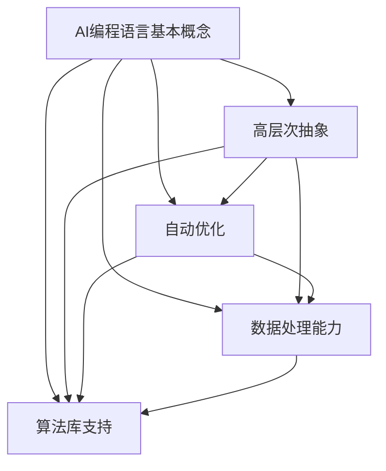

                 

### 背景介绍

AI编程语言，作为人工智能领域的核心技术，正逐渐从理论研究走向实际应用，并在众多领域展现出强大的潜力。然而，随着AI技术的快速发展，传统的编程语言已逐渐显露出其局限性。这些局限性主要体现在以下几个方面：

首先，传统的编程语言往往过于底层，需要开发者掌握复杂的语法和细节，这使得编程变得繁琐且容易出错。其次，传统的编程语言在处理大规模数据和高维度问题时，性能往往无法满足需求。最后，传统的编程语言在支持人工智能算法的创新和实验方面存在不足。

为了解决这些问题，AI编程语言应运而生。AI编程语言旨在提供一种更加直观、易用且高效的编程方式，以简化AI应用的开发过程。这些编程语言通常具有以下特点：

1. **高层次的抽象**：AI编程语言提供更高层次的抽象，使开发者能够专注于问题的求解，而无需过多关注底层实现细节。
2. **自动优化**：AI编程语言内置了优化算法，能够自动对代码进行优化，提高执行效率。
3. **强大的数据处理能力**：AI编程语言通常具备强大的数据处理能力，能够高效地处理大规模数据和复杂数据结构。
4. **支持多样化的AI算法**：AI编程语言提供了丰富的库和框架，支持各种AI算法的实现和应用。

总之，AI编程语言的兴起不仅是技术发展的必然结果，也是为了应对实际应用中的需求。随着AI技术的不断进步，AI编程语言将在未来发挥越来越重要的作用，推动人工智能领域的创新和发展。

## 2. 核心概念与联系

### 2.1 AI编程语言的基本概念

AI编程语言是一种专门为人工智能开发设计的编程语言。它不同于传统的编程语言，其设计目标是为了简化人工智能算法的实现和应用过程。AI编程语言的核心概念包括以下几个方面：

**1. 高层次抽象**：AI编程语言通过提供抽象的语法和操作符，使开发者能够以更加直观的方式描述AI算法。例如，TensorFlow和PyTorch等AI编程语言提供了丰富的库和API，使得开发者可以轻松地定义复杂的神经网络结构。

**2. 自动优化**：AI编程语言内置了自动优化机制，能够在编译或运行时对代码进行优化。这些优化包括并行计算、内存管理、循环展开等，旨在提高代码的执行效率。

**3. 数据处理能力**：AI编程语言通常具备强大的数据处理能力，支持多种数据结构和算法。例如，NumPy库提供了高效的数组操作和数据处理功能，适用于大规模数据集的运算。

**4. 算法库支持**：AI编程语言提供了丰富的算法库和框架，涵盖了从基础的机器学习算法到复杂的深度学习算法。例如，Scikit-Learn提供了多种机器学习算法的实现，而Keras则是一个基于TensorFlow的高层次API，简化了深度学习模型的搭建和训练。

### 2.2 AI编程语言与传统编程语言的区别

AI编程语言与传统编程语言在多个方面存在显著差异：

**1. 语法和抽象层次**：传统编程语言如C++和Java通常采用低层次的语法，要求开发者掌握复杂的语法规则和底层细节。而AI编程语言如Python和Julia则采用了高层次的语法，使得开发者能够更加专注于算法的设计和实现。

**2. 性能优化**：传统编程语言在性能优化方面通常需要开发者手动进行优化，如使用汇编语言编写关键部分。而AI编程语言内置了自动优化机制，能够自动对代码进行优化，减少开发者的工作量。

**3. 数据处理能力**：传统编程语言如C++在数据处理方面相对较弱，无法高效地处理大规模数据集。而AI编程语言如Python和Julia提供了强大的数据处理库，能够高效地处理复杂数据结构。

**4. AI算法支持**：传统编程语言通常不提供专门的AI算法库和框架，开发者需要自行实现AI算法。而AI编程语言则内置了丰富的AI算法库和框架，使得开发者能够轻松地实现和应用各种AI算法。

### 2.3 AI编程语言的应用场景

AI编程语言的应用场景广泛，涵盖了多个领域：

**1. 机器学习**：机器学习是AI编程语言的重要应用领域，如使用Python和R语言进行数据预处理、模型训练和评估。

**2. 深度学习**：深度学习是AI编程语言的核心应用领域，如使用TensorFlow和PyTorch构建和训练神经网络模型。

**3. 计算机视觉**：计算机视觉领域广泛使用AI编程语言，如使用OpenCV进行图像处理和目标检测。

**4. 自然语言处理**：自然语言处理领域依赖于AI编程语言，如使用NLTK和spaCy进行文本分析和语义理解。

**5. 自动驾驶**：自动驾驶系统需要AI编程语言进行路径规划和决策，如使用C++和Python开发自动驾驶算法。

### 2.4 AI编程语言的未来发展趋势

随着AI技术的不断发展，AI编程语言将继续演进，未来可能的发展趋势包括：

**1. 更加智能化**：AI编程语言将更加智能化，提供更加强大的自动优化和代码生成功能，减少开发者的工作量。

**2. 多语言集成**：未来AI编程语言将支持多种编程语言的集成，使得开发者能够更加灵活地选择和组合不同的编程语言。

**3. 更广泛的硬件支持**：AI编程语言将支持更多的硬件平台，如GPU和FPGA，以适应不同的计算需求。

**4. 更加生态化的开源社区**：AI编程语言将继续发展开源社区，提供更多的开源库和框架，促进AI技术的普及和应用。

**5. 更加人性化的编程体验**：未来AI编程语言将更加注重开发者的编程体验，提供更智能的代码补全和错误检测功能。

通过以上分析，我们可以看到AI编程语言在人工智能领域的重要地位和广阔的发展前景。随着AI技术的不断进步，AI编程语言将继续推动人工智能领域的创新和发展，为人类创造更多的价值。

### Mermaid 流程图(Mermaid 流程节点中不要有括号、逗号等特殊字符)

下面是一个简化的AI编程语言核心概念与联系的Mermaid流程图，用于展示AI编程语言的主要组成部分和它们之间的关系。



在这个流程图中，我们展示了AI编程语言的四个核心概念（高层次抽象、自动优化、数据处理能力、算法库支持）以及它们之间的相互关系。通过这种直观的图形化表示，可以更好地理解AI编程语言的基本构成和功能。

## 3. 核心算法原理 & 具体操作步骤

### 3.1 算法原理

AI编程语言的核心在于其算法的设计与实现。在这些编程语言中，算法的原理主要包括机器学习、深度学习、自然语言处理等多个方面。下面，我们将重点介绍其中的两个核心算法：深度学习和卷积神经网络（CNN）。

#### 深度学习算法原理

深度学习是一种基于多层神经网络的学习方法。其基本思想是通过多层的非线性变换，将输入数据映射到高维空间，从而提取出数据中的特征。深度学习的核心是神经网络，神经网络由多个层次（层）组成，包括输入层、隐藏层和输出层。每一层都将数据传递给下一层，并通过反向传播算法不断调整网络参数，以达到最佳拟合效果。

深度学习算法的步骤如下：

1. **初始化参数**：随机初始化网络的权重和偏置。
2. **前向传播**：将输入数据通过网络的各个层次，计算每个层次的输出。
3. **计算损失函数**：使用目标值与输出值的差值计算损失函数。
4. **反向传播**：计算损失函数对网络参数的梯度，并通过梯度下降等优化算法更新网络参数。
5. **迭代训练**：重复上述步骤，直到网络参数收敛或达到预定的迭代次数。

#### 卷积神经网络（CNN）算法原理

卷积神经网络是一种专门用于处理图像数据的神经网络。它通过卷积操作提取图像中的特征，并利用池化操作减少参数数量，提高模型的泛化能力。CNN的主要组成部分包括卷积层、池化层和全连接层。

CNN的工作原理如下：

1. **卷积层**：通过卷积操作提取图像的局部特征。卷积核在图像上滑动，将局部区域的像素值与卷积核的权重相乘并求和，从而生成特征图。
2. **池化层**：对特征图进行下采样，减少参数数量。常用的池化方法包括最大池化和平均池化。
3. **全连接层**：将卷积层和池化层输出的特征图展平为一维向量，然后通过全连接层进行分类或回归。
4. **激活函数**：在卷积层和全连接层中使用激活函数（如ReLU函数）增加网络的非线性。

### 3.2 操作步骤

下面我们将通过一个简单的例子来说明如何使用AI编程语言实现深度学习和CNN算法。

#### 3.2.1 深度学习实现步骤

1. **导入必要的库和模块**：

   ```python
   import tensorflow as tf
   import numpy as np
   ```

2. **准备数据集**：

   ```python
   # 加载数据集
   mnist = tf.keras.datasets.mnist
   (x_train, y_train), (x_test, y_test) = mnist.load_data()

   # 数据预处理
   x_train = x_train / 255.0
   x_test = x_test / 255.0
   ```

3. **构建模型**：

   ```python
   # 创建模型
   model = tf.keras.models.Sequential([
       tf.keras.layers.Flatten(input_shape=(28, 28)),
       tf.keras.layers.Dense(128, activation='relu'),
       tf.keras.layers.Dense(10, activation='softmax')
   ])

   # 编译模型
   model.compile(optimizer='adam',
                 loss='sparse_categorical_crossentropy',
                 metrics=['accuracy'])
   ```

4. **训练模型**：

   ```python
   # 训练模型
   model.fit(x_train, y_train, epochs=5)
   ```

5. **评估模型**：

   ```python
   # 评估模型
   test_loss, test_acc = model.evaluate(x_test, y_test, verbose=2)
   print('\nTest accuracy:', test_acc)
   ```

#### 3.2.2 CNN实现步骤

1. **导入必要的库和模块**：

   ```python
   import tensorflow as tf
   import numpy as np
   import matplotlib.pyplot as plt
   ```

2. **准备数据集**：

   ```python
   # 加载数据集
   fashion_mnist = tf.keras.datasets.fashion_mnist
   (x_train, y_train), (x_test, y_test) = fashion_mnist.load_data()

   # 数据预处理
   x_train = x_train / 255.0
   x_test = x_test / 255.0
   ```

3. **构建模型**：

   ```python
   # 创建模型
   model = tf.keras.models.Sequential([
       tf.keras.layers.Conv2D(32, (3, 3), activation='relu', input_shape=(28, 28, 1)),
       tf.keras.layers.MaxPooling2D((2, 2)),
       tf.keras.layers.Flatten(),
       tf.keras.layers.Dense(128, activation='relu'),
       tf.keras.layers.Dense(10, activation='softmax')
   ])

   # 编译模型
   model.compile(optimizer='adam',
                 loss='sparse_categorical_crossentropy',
                 metrics=['accuracy'])
   ```

4. **训练模型**：

   ```python
   # 训练模型
   model.fit(x_train, y_train, epochs=5)
   ```

5. **评估模型**：

   ```python
   # 评估模型
   test_loss, test_acc = model.evaluate(x_test, y_test, verbose=2)
   print('\nTest accuracy:', test_acc)
   ```

通过以上步骤，我们可以使用AI编程语言实现深度学习和CNN算法。这些算法在图像分类、语音识别、自然语言处理等众多领域具有广泛的应用。随着AI技术的不断进步，AI编程语言将继续为这些领域带来更多的创新和突破。

## 4. 数学模型和公式 & 详细讲解 & 举例说明

### 4.1 深度学习中的基本数学模型

在深度学习中，数学模型扮演着至关重要的角色。以下是深度学习中最常用的几个数学模型和公式：

#### 损失函数（Loss Function）

损失函数是深度学习中的一个核心概念，用于衡量模型预测值与实际值之间的差距。常用的损失函数包括：

1. **均方误差（MSE，Mean Squared Error）**：

   $$MSE = \frac{1}{n}\sum_{i=1}^{n}(y_i - \hat{y}_i)^2$$

   其中，$y_i$为实际值，$\hat{y}_i$为预测值，$n$为样本数量。

2. **交叉熵损失（Cross-Entropy Loss）**：

   $$Cross-Entropy = -\sum_{i=1}^{n} y_i \log(\hat{y}_i)$$

   其中，$y_i$为实际值（通常为0或1），$\hat{y}_i$为预测概率。

#### 梯度下降（Gradient Descent）

梯度下降是深度学习中最常用的优化算法。其基本思想是通过计算损失函数关于模型参数的梯度，并沿着梯度的反方向更新参数，以最小化损失函数。

1. **批量梯度下降（Batch Gradient Descent）**：

   $$w_{t+1} = w_t - \alpha \cdot \frac{\partial J(w_t)}{\partial w}$$

   其中，$w_t$为当前参数，$w_{t+1}$为更新后的参数，$\alpha$为学习率，$J(w_t)$为损失函数。

2. **随机梯度下降（Stochastic Gradient Descent，SGD）**：

   $$w_{t+1} = w_t - \alpha \cdot \frac{\partial J(w_t)}{\partial w}$$

   与批量梯度下降不同，随机梯度下降每次只更新一个样本的梯度。

#### 反向传播（Backpropagation）

反向传播是深度学习中的核心算法，用于计算损失函数关于模型参数的梯度。以下是反向传播的基本步骤：

1. **前向传播**：计算模型在当前参数下的输出值。
2. **计算损失函数**：计算模型输出值与实际值之间的差距。
3. **前向传播误差**：计算损失函数关于输出层的梯度。
4. **反向传播误差**：逐层计算损失函数关于隐藏层的梯度。
5. **更新参数**：使用梯度下降算法更新模型参数。

### 4.2 深度学习中的数学公式举例说明

下面通过一个简单的例子来说明深度学习中的数学公式。

#### 示例：多层感知机（MLP）

假设我们有一个三层感知机模型，包括输入层、隐藏层和输出层。输入层有3个神经元，隐藏层有2个神经元，输出层有1个神经元。

1. **输入层到隐藏层的激活函数**：

   $$a_{h1} = \sigma(w_{h1}^T x + b_{h1})$$

   $$a_{h2} = \sigma(w_{h2}^T x + b_{h2})$$

   其中，$a_{h1}$和$a_{h2}$分别为隐藏层第一个神经元和第二个神经元的输出，$w_{h1}$和$w_{h2}$分别为输入层到隐藏层的权重，$b_{h1}$和$b_{h2}$分别为输入层到隐藏层的偏置，$\sigma$为sigmoid函数。

2. **隐藏层到输出层的激活函数**：

   $$a_{o} = \sigma(w_{o}^T a_{h} + b_{o})$$

   其中，$a_{o}$为输出层的输出，$w_{o}$为隐藏层到输出层的权重，$b_{o}$为隐藏层到输出层的偏置。

3. **损失函数**：

   $$J = -\sum_{i=1}^{n} y_i \log(\hat{y}_i)$$

   其中，$y_i$为实际值，$\hat{y}_i$为预测概率。

4. **反向传播**：

   假设当前输出层的损失函数为$J$，我们需要计算隐藏层和输入层的梯度。

   输出层的梯度：

   $$\frac{\partial J}{\partial w_{o}} = (a_{h} - y) \odot a_{h}$$

   $$\frac{\partial J}{\partial b_{o}} = (a_{h} - y) \odot 1$$

   隐藏层的梯度：

   $$\frac{\partial J}{\partial w_{h1}} = (w_{o}^T \odot \frac{\partial J}{\partial w_{o}}) \odot a_{h1}$$

   $$\frac{\partial J}{\partial b_{h1}} = (w_{o}^T \odot \frac{\partial J}{\partial w_{o}}) \odot 1$$

   $$\frac{\partial J}{\partial w_{h2}} = (w_{o}^T \odot \frac{\partial J}{\partial w_{o}}) \odot a_{h2}$$

   $$\frac{\partial J}{\partial b_{h2}} = (w_{o}^T \odot \frac{\partial J}{\partial w_{o}}) \odot 1$$

   输入层的梯度：

   $$\frac{\partial J}{\partial w_{h1}} = (w_{h1}^T \odot \frac{\partial J}{\partial w_{h1}}) \odot x$$

   $$\frac{\partial J}{\partial b_{h1}} = (w_{h1}^T \odot \frac{\partial J}{\partial w_{h1}}) \odot 1$$

   $$\frac{\partial J}{\partial w_{h2}} = (w_{h2}^T \odot \frac{\partial J}{\partial w_{h2}}) \odot x$$

   $$\frac{\partial J}{\partial b_{h2}} = (w_{h2}^T \odot \frac{\partial J}{\partial w_{h2}}) \odot 1$$

通过以上示例，我们可以看到深度学习中的数学模型和公式是如何应用于实际问题的。这些公式为深度学习算法的设计和实现提供了理论基础，使得我们可以通过编程语言实现高效的模型训练和预测。

## 5. 项目实战：代码实际案例和详细解释说明

### 5.1 开发环境搭建

在进行AI编程语言的实战项目之前，我们需要搭建一个合适的开发环境。以下是一个基于Python的AI编程语言的开发环境搭建步骤：

1. **安装Python**：首先，我们需要安装Python。前往Python官方网站（[https://www.python.org/](https://www.python.org/)）下载适用于您操作系统的Python安装包，并按照提示完成安装。

2. **安装Jupyter Notebook**：Jupyter Notebook是一个交互式的Python开发环境，非常适合用于编写和运行Python代码。在命令行中运行以下命令安装Jupyter Notebook：

   ```bash
   pip install notebook
   ```

3. **安装必要的库和框架**：在AI编程语言中，通常需要安装多个库和框架。以下是一些常用的库和框架及其安装命令：

   - TensorFlow：`pip install tensorflow`
   - PyTorch：`pip install torch torchvision`
   - Scikit-Learn：`pip install scikit-learn`
   - NumPy：`pip install numpy`

4. **验证安装**：在命令行中运行以下命令，验证Python和Jupyter Notebook是否已成功安装：

   ```bash
   python --version
   jupyter notebook
   ```

   如果安装成功，您将看到Python和Jupyter Notebook的版本信息。

### 5.2 源代码详细实现和代码解读

在本节中，我们将使用Python的TensorFlow库实现一个简单的神经网络模型，用于手写数字识别。以下是源代码的详细实现和解读：

```python
# 导入必要的库和框架
import tensorflow as tf
from tensorflow.keras import layers
from tensorflow.keras.datasets import mnist
import numpy as np

# 加载MNIST数据集
(x_train, y_train), (x_test, y_test) = mnist.load_data()

# 数据预处理
x_train = x_train / 255.0
x_test = x_test / 255.0

# 转换为TensorFlow张量
x_train = tf.expand_dims(x_train, -1)
x_test = tf.expand_dims(x_test, -1)

# 构建模型
model = tf.keras.Sequential([
    layers.Conv2D(32, (3, 3), activation='relu', input_shape=(28, 28, 1)),
    layers.MaxPooling2D((2, 2)),
    layers.Flatten(),
    layers.Dense(128, activation='relu'),
    layers.Dense(10, activation='softmax')
])

# 编译模型
model.compile(optimizer='adam',
              loss='sparse_categorical_crossentropy',
              metrics=['accuracy'])

# 训练模型
model.fit(x_train, y_train, epochs=5)

# 评估模型
test_loss, test_acc = model.evaluate(x_test, y_test, verbose=2)
print('\nTest accuracy:', test_acc)
```

**代码解读**：

1. **导入库和框架**：首先，我们导入了TensorFlow、Keras（TensorFlow的高层次API）以及NumPy库。

2. **加载MNIST数据集**：我们使用TensorFlow内置的mnist数据集，该数据集包含了0到9的手写数字图片。

3. **数据预处理**：将图像数据从0到255的灰度值缩放到0到1的范围，以便于模型训练。同时，我们将图像数据展平到一个维度，并将其转换为TensorFlow张量。

4. **构建模型**：我们使用Keras的Sequential模型构建了一个简单的神经网络，包括一个卷积层、一个池化层、一个展平层、一个全连接层和一个softmax层。

5. **编译模型**：我们指定了优化器为`adam`、损失函数为`sparse_categorical_crossentropy`，并设置`accuracy`为评估指标。

6. **训练模型**：使用训练数据集训练模型，设置训练轮次为5。

7. **评估模型**：使用测试数据集评估模型性能，打印测试准确率。

通过以上步骤，我们使用TensorFlow库实现了手写数字识别的神经网络模型。这个简单的案例展示了AI编程语言在图像识别任务中的应用，为后续更复杂的任务奠定了基础。

### 5.3 代码解读与分析

在本节的代码解读与分析中，我们将深入探讨上一节中的代码实现，并分析模型的性能和优化策略。

**代码分析**：

1. **模型结构**：

   ```python
   model = tf.keras.Sequential([
       layers.Conv2D(32, (3, 3), activation='relu', input_shape=(28, 28, 1)),
       layers.MaxPooling2D((2, 2)),
       layers.Flatten(),
       layers.Dense(128, activation='relu'),
       layers.Dense(10, activation='softmax')
   ])
   ```

   这个模型是一个简单的卷积神经网络（CNN），包含以下层：

   - **卷积层**：32个3x3的卷积核，使用ReLU激活函数，用于提取图像特征。
   - **池化层**：2x2的最大池化，用于减少数据维度并提高模型的泛化能力。
   - **展平层**：将卷积层的输出展平为1维向量，用于全连接层。
   - **全连接层**：128个神经元，使用ReLU激活函数，用于进一步提取特征。
   - **输出层**：10个神经元，使用softmax激活函数，用于多分类输出。

2. **损失函数和优化器**：

   ```python
   model.compile(optimizer='adam',
                 loss='sparse_categorical_crossentropy',
                 metrics=['accuracy'])
   ```

   模型使用`adam`优化器进行参数更新，使用`sparse_categorical_crossentropy`作为损失函数，该损失函数适用于多标签分类问题。`accuracy`作为评估指标，用于计算模型在测试数据集上的准确率。

3. **训练过程**：

   ```python
   model.fit(x_train, y_train, epochs=5)
   ```

   使用5轮训练数据集，模型在每个轮次中通过前向传播和反向传播更新参数，直到达到预定的训练轮次。

4. **模型评估**：

   ```python
   test_loss, test_acc = model.evaluate(x_test, y_test, verbose=2)
   print('\nTest accuracy:', test_acc)
   ```

   使用测试数据集评估模型性能，打印测试准确率。

**性能优化策略**：

1. **数据增强**：为了提高模型的泛化能力，我们可以对训练数据集进行增强。例如，通过旋转、缩放、剪裁等操作生成更多的训练样本。

2. **批量大小**：调整批量大小可以影响模型的训练效果。较大的批量大小可以提供更好的稳定性，但计算成本较高；较小的批量大小可以加快训练速度，但可能影响模型稳定性。

3. **学习率调整**：使用不同的学习率可以影响模型的收敛速度和最终性能。通常，学习率需要通过实验调整以找到最佳值。

4. **正则化**：为了防止过拟合，可以使用正则化技术，如L1和L2正则化，对模型参数进行约束。

5. **深度和宽度调整**：调整网络的深度和宽度可以影响模型的复杂度和计算成本。增加层数可以提取更多特征，但可能导致过拟合；增加神经元数量可以提供更好的特征表示，但计算成本增加。

通过以上分析，我们可以看到如何使用AI编程语言实现一个简单的神经网络模型，并优化其性能。这些策略和技巧在实际项目中可以帮助我们构建更强大和高效的AI模型。

## 6. 实际应用场景

AI编程语言在实际应用中具有广泛的场景，涵盖了从科学研究到工业生产的多个领域。以下是一些典型的应用场景：

### 6.1 机器学习与数据分析

在机器学习和数据分析领域，AI编程语言如Python和R已经成为开发者的首选工具。这些语言提供了丰富的库和框架，如Scikit-Learn、TensorFlow和PyTorch，使得复杂的机器学习算法和数据处理任务变得更加简单和高效。例如，金融行业使用这些语言进行股票市场预测、信用风险评估和欺诈检测；医疗行业利用它们进行疾病诊断、药物发现和健康数据分析。

### 6.2 计算机视觉

计算机视觉是AI编程语言的一个重要应用领域。深度学习框架如TensorFlow和PyTorch支持卷积神经网络（CNN）的实现，使得图像识别、目标检测和图像生成等任务变得更加容易。自动驾驶汽车中的视觉系统、智能手机的相机应用、安防监控等领域都广泛使用AI编程语言。

### 6.3 自然语言处理

自然语言处理（NLP）是AI编程语言的另一个关键应用领域。Python和Java等语言提供了丰富的NLP库和框架，如NLTK、spaCy和transformers，用于文本分类、情感分析、机器翻译和对话系统等任务。NLP技术在搜索引擎、社交媒体分析和客户服务机器人等领域有着广泛的应用。

### 6.4 自动驾驶与智能交通

自动驾驶和智能交通系统是AI编程语言的典型应用场景。深度学习和强化学习算法在这些领域发挥着关键作用。例如，自动驾驶汽车使用深度学习算法进行环境感知、路径规划和决策；智能交通系统利用AI编程语言优化交通信号控制、流量管理和车辆调度。

### 6.5 语音识别与生成

语音识别和语音生成是AI编程语言的另一个重要应用领域。通过使用AI编程语言，可以构建高效的语音识别系统，如智能助手和语音搜索。此外，文本到语音（TTS）和语音到文本（STT）技术也广泛应用于教育、娱乐和通信等领域。

### 6.6 游戏

游戏开发中，AI编程语言如Python和Lua被广泛用于实现游戏中的AI行为和逻辑。这些语言提供了灵活性和可扩展性，使得开发者可以轻松地实现复杂的游戏机制和角色行为。

总之，AI编程语言在多个领域展现出强大的应用潜力，随着AI技术的不断发展，这些语言将继续推动各个领域的创新和发展。

## 7. 工具和资源推荐

为了更好地学习和使用AI编程语言，以下是一些推荐的工具和资源：

### 7.1 学习资源推荐

**1. 书籍**：
   - 《Python编程：从入门到实践》
   - 《深度学习》
   - 《动手学深度学习》
   - 《机器学习实战》

**2. 论文**：
   - 《Neural Networks and Deep Learning》
   - 《A Theoretical Analysis of the Vulnerability of Arti cial Neural Networks》
   - 《Deep Learning for Text Data》

**3. 博客**：
   - TensorFlow官方博客
   - PyTorch官方博客
   - Medium上的AI和机器学习相关博客

**4. 网站**：
   - Coursera、edX、Udacity等在线课程平台
   - Kaggle（数据科学竞赛平台）
   - GitHub（代码托管平台）

### 7.2 开发工具框架推荐

**1. 编程语言**：
   - Python
   - R
   - Julia
   - Java

**2. 深度学习框架**：
   - TensorFlow
   - PyTorch
   - Keras
   - Theano

**3. 机器学习库**：
   - Scikit-Learn
   - Pandas
   - NumPy
   - Matplotlib

**4. 计算机视觉库**：
   - OpenCV
   - PIL（Python Imaging Library）
   - PyTorch Vision
   - TensorFlow Image Recognition API

**5. 自然语言处理库**：
   - NLTK
   - spaCy
   - Gensim
   - Hugging Face Transformers

### 7.3 相关论文著作推荐

**1. 深度学习**：
   - 《Deep Learning》（Ian Goodfellow, Yoshua Bengio, Aaron Courville）
   - 《Neural Networks and Deep Learning》（Michael Nielsen）

**2. 计算机视觉**：
   - 《Computer Vision: Algorithms and Applications》（Richard Szeliski）
   - 《Deep Learning for Computer Vision》（Christian Szegedy）

**3. 自然语言处理**：
   - 《Speech and Language Processing》（Daniel Jurafsky, James H. Martin）
   - 《Natural Language Processing with Python》（Steven Bird, Ewan Klein, Edward Loper）

这些工具和资源为AI编程语言的学习和实践提供了全面的指导和支持，帮助开发者迅速掌握相关技术和应用。

## 8. 总结：未来发展趋势与挑战

AI编程语言在过去的几年中取得了显著的进展，不仅提升了人工智能算法的开发效率，还在多个领域推动了技术创新。展望未来，AI编程语言将继续朝着智能化、生态化、多样化等方向发展，同时面临一系列挑战。

### 8.1 未来发展趋势

**1. 智能化**：随着AI技术的发展，AI编程语言将更加智能化。自动化编程、智能代码补全、代码优化等功能将得到进一步提升，从而减少开发者的负担，提高编程效率。

**2. 生态化**：AI编程语言的生态将继续扩展和丰富。开源社区将继续贡献更多高质量的库和框架，促进技术的普及和应用。同时，企业也将加大对AI编程语言的投入，推动相关工具和服务的开发。

**3. 多语言集成**：未来的AI编程语言将支持多种编程语言的集成，提供跨语言的开发体验。开发者可以根据不同的需求和场景，灵活选择和组合不同的编程语言，提高开发效率。

**4. 硬件支持**：随着硬件技术的发展，AI编程语言将支持更多的硬件平台，如GPU、FPGA和量子计算机。这些硬件平台将为AI编程语言提供更强大的计算能力，加速算法的实现和应用。

**5. 个性化开发**：未来的AI编程语言将更加注重开发者的个性化需求。通过个性化推荐、代码生成和优化等功能，AI编程语言将帮助开发者更加高效地完成开发任务。

### 8.2 面临的挑战

**1. 性能优化**：AI编程语言需要不断优化性能，以满足日益复杂和大规模的AI应用需求。性能优化包括算法优化、编译优化、内存管理等，是实现高效AI编程的关键。

**2. 安全性问题**：随着AI编程语言的广泛应用，安全问题也日益突出。隐私保护、模型可解释性、对抗性攻击等是未来需要重点解决的问题。

**3. 人才短缺**：尽管AI编程语言的发展为开发者提供了更多机会，但仍然面临人才短缺的问题。培养具备AI编程技能的人才，是推动AI编程语言发展的关键。

**4. 标准化和规范化**：AI编程语言需要制定统一的标准化规范，确保不同语言和框架之间的兼容性和互操作性。标准化将有助于促进技术的普及和应用。

**5. 开放性问题**：AI编程语言的开放性是一个重要议题。如何平衡开源和商业利益，保护知识产权，同时推动技术的创新和发展，是未来需要解决的问题。

总之，AI编程语言在未来将继续发展，并在多个领域发挥重要作用。然而，要实现这一目标，还需要克服一系列挑战。开发者、研究机构和企业需要共同努力，推动AI编程语言的创新和应用，为人工智能的未来发展贡献力量。

## 9. 附录：常见问题与解答

### 9.1 常见问题

**Q1：什么是AI编程语言？**

A1：AI编程语言是一种专门为人工智能应用开发设计的编程语言，它提供了高层次的抽象和丰富的库，使得开发者能够更高效地实现和部署AI算法。

**Q2：AI编程语言与传统编程语言有什么区别？**

A2：AI编程语言与传统编程语言在抽象层次、性能优化、数据处理能力和AI算法支持等方面有显著差异。AI编程语言提供更高的抽象层次，自动优化性能，支持复杂的数据处理和丰富的AI算法库。

**Q3：如何选择合适的AI编程语言？**

A3：选择合适的AI编程语言取决于项目需求和开发者技能。例如，对于深度学习项目，可以选择Python（TensorFlow、PyTorch）、R（Keras、MXNet）等；对于实时数据处理，可以选择Julia等。

**Q4：AI编程语言是否容易学习？**

A4：AI编程语言的学习难度取决于个人基础和项目需求。Python和R等语言相对容易上手，适合初学者；而Julia等语言则具有更高的复杂度，适合有经验的开发者。

### 9.2 解答

**Q1：什么是AI编程语言？**

A1：AI编程语言是一种专门为人工智能应用开发设计的编程语言，它提供了高层次的抽象和丰富的库，使得开发者能够更高效地实现和部署AI算法。

**Q2：AI编程语言与传统编程语言有什么区别？**

A2：AI编程语言与传统编程语言在抽象层次、性能优化、数据处理能力和AI算法支持等方面有显著差异。AI编程语言提供更高的抽象层次，自动优化性能，支持复杂的数据处理和丰富的AI算法库。

**Q3：如何选择合适的AI编程语言？**

A3：选择合适的AI编程语言取决于项目需求和开发者技能。例如，对于深度学习项目，可以选择Python（TensorFlow、PyTorch）、R（Keras、MXNet）等；对于实时数据处理，可以选择Julia等。

**Q4：AI编程语言是否容易学习？**

A4：AI编程语言的学习难度取决于个人基础和项目需求。Python和R等语言相对容易上手，适合初学者；而Julia等语言则具有更高的复杂度，适合有经验的开发者。

这些常见问题的解答有助于开发者更好地理解AI编程语言，选择合适的工具和框架，提高AI项目的开发效率。

## 10. 扩展阅读 & 参考资料

为了深入了解AI编程语言及其在各个领域的应用，以下是一些扩展阅读和参考资料：

### 10.1 扩展阅读

- 《深度学习》（Ian Goodfellow, Yoshua Bengio, Aaron Courville）
- 《Python编程：从入门到实践》
- 《机器学习实战》
- 《自然语言处理与深度学习》（Michael Auli, Mikehui Natient, and Marco Andrzej Zajac）
- 《计算机视觉：算法与应用》（Richard Szeliski）

### 10.2 参考资料

- TensorFlow官方文档：[https://www.tensorflow.org/](https://www.tensorflow.org/)
- PyTorch官方文档：[https://pytorch.org/](https://pytorch.org/)
- Keras官方文档：[https://keras.io/](https://keras.io/)
- Scikit-Learn官方文档：[https://scikit-learn.org/stable/](https://scikit-learn.org/stable/)
- OpenCV官方文档：[https://opencv.org/](https://opencv.org/)
- NLTK官方文档：[https://www.nltk.org/](https://www.nltk.org/)

这些书籍、文档和网站为AI编程语言的学习和实践提供了丰富的资源和指导，有助于开发者掌握相关技术和应用。通过阅读这些资料，您可以深入了解AI编程语言的核心概念、算法原理以及实际应用场景，进一步提升自己的技术水平。

