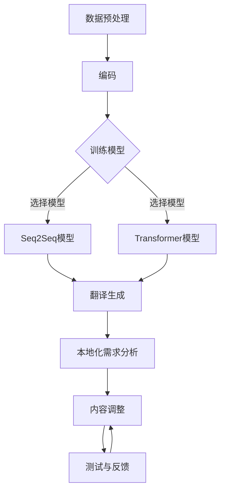

                 

# AI翻译与本地化：跨文化故事传播

## 关键词
- AI翻译
- 本地化
- 跨文化故事传播
- 机器学习
- 自然语言处理
- 语言模型

## 摘要
本文旨在探讨人工智能（AI）在翻译与本地化领域的应用，特别是在促进跨文化故事传播方面的重要性。通过深入分析AI翻译的核心概念、算法原理、数学模型以及实际应用案例，本文揭示了这一技术如何突破语言障碍，使全球范围内的文化交流更加便捷。同时，本文还提出了未来AI翻译与本地化技术的发展趋势和面临的挑战，为相关领域的研究者和实践者提供了有益的参考。

## 1. 背景介绍

在全球化日益深入的今天，跨文化交流已成为促进国际间理解和合作的重要途径。而故事作为一种富有感染力和影响力的传播形式，在跨文化交流中扮演着关键角色。然而，不同语言和文化之间的差异往往成为故事传播的障碍。为了打破这一障碍，实现全球范围内的故事传播，翻译与本地化技术应运而生。

翻译是一种将一种语言的内容准确地转化为另一种语言的过程。它不仅要求语言层面的转换，还需保持原文的意图、风格和情感。然而，随着故事传播需求的增加，传统的人工翻译方法在效率和准确性方面已无法满足需求。因此，AI翻译技术逐渐成为解决这一问题的有力工具。

AI翻译，即利用人工智能技术实现自动化翻译的过程。它基于大规模的语料库和深度学习算法，通过分析和学习语言模式，实现不同语言之间的准确转换。AI翻译的优势在于其高效性、准确性和灵活性，能够大大提高翻译工作的效率和质量。

本地化则是指将一种产品或内容根据目标市场的语言、文化、法律和习俗等特点进行适应性的调整。它不仅仅涉及语言的翻译，还包括对文本、图片、声音等多种元素的调整。本地化的目的是使产品或内容能够更好地满足目标市场的需求，提高用户满意度和市场竞争力。

在跨文化故事传播中，AI翻译与本地化技术发挥着重要作用。它们不仅能够实现故事文本的自动翻译，还能够根据不同文化背景进行适应性调整，使故事更加贴近目标市场的受众。这使得跨文化故事传播变得更加高效、精准和多样化，为全球文化交流注入了新的活力。

## 2. 核心概念与联系

### AI翻译原理

AI翻译的核心原理是利用机器学习，特别是深度学习技术，从大量的双语语料库中学习语言模式。具体来说，AI翻译包括以下几个关键步骤：

1. **数据预处理**：首先，需要对原始的文本数据进行清洗、分词、词性标注等预处理操作，以便后续的模型训练。

2. **编码**：将预处理后的文本数据转化为计算机可以理解的编码形式，如词向量。

3. **模型训练**：使用编码后的数据训练一个翻译模型，如序列到序列（Seq2Seq）模型、Transformer模型等。这些模型通过学习源语言和目标语言之间的映射关系，实现文本的自动翻译。

4. **翻译生成**：在模型训练完成后，使用训练好的模型对新的文本数据进行翻译生成。

### 本地化原理

本地化则是一个更为复杂的过程，它需要考虑目标市场的文化、语言、法律等多个因素。本地化的核心步骤包括：

1. **需求分析**：首先，需要了解目标市场的文化背景、用户需求和市场特点。

2. **内容调整**：根据需求分析的结果，对原始的内容进行适应性调整，包括语言翻译、文本润色、图像调整等。

3. **测试与反馈**：在本地化完成后，需要对调整后的内容进行测试，并收集用户反馈，以便进一步优化。

### AI翻译与本地化的联系

AI翻译与本地化密切相关，它们共同构成了跨文化故事传播的技术基础。具体来说：

1. **相互依赖**：AI翻译为本地化提供了基础的语言翻译能力，而本地化则利用AI翻译的结果进行进一步的适应性调整。

2. **协同作用**：AI翻译和本地化技术的协同作用，可以大幅提高跨文化故事传播的效率和效果。

3. **互补优势**：AI翻译擅长处理大规模的文本翻译任务，而本地化则注重内容的细节调整和文化适应，两者相辅相成，共同提升故事传播的质量。

### Mermaid 流程图

以下是一个简化的AI翻译与本地化流程的Mermaid流程图：



## 3. 核心算法原理 & 具体操作步骤

### AI翻译算法原理

AI翻译的核心算法是基于深度学习的序列到序列（Seq2Seq）模型和Transformer模型。以下分别介绍这两种模型的基本原理和具体操作步骤。

#### Seq2Seq模型

Seq2Seq模型是一种基于编码-解码框架的神经网络模型，主要用于序列数据的转换。其基本原理如下：

1. **编码器（Encoder）**：将输入序列（源语言文本）编码为一个固定长度的向量表示。这个过程通过多个隐藏层来实现，每个隐藏层都将输入序列的一部分信息编码为向量。

2. **解码器（Decoder）**：将编码器的输出作为输入，逐个生成目标序列（目标语言文本）的每个单词。解码器在生成每个单词时，都要参考之前生成的所有单词。

3. **损失函数**：使用损失函数（如交叉熵损失）来衡量模型预测的输出与实际输出的差距，并使用反向传播算法来更新模型参数。

#### Transformer模型

Transformer模型是一种基于自注意力机制的序列模型，它在处理长序列任务时表现出色。其基本原理如下：

1. **多头自注意力（Multi-Head Self-Attention）**：每个位置的输出都通过多个独立的自注意力机制来计算，从而关注不同的序列位置。

2. **前馈神经网络（Feedforward Neural Network）**：在自注意力机制之后，每个位置还通过一个前馈神经网络进行加工。

3. **层次结构（Layered Structure）**：Transformer模型通常由多个层次组成，每层都包含多头自注意力和前馈神经网络。

#### 具体操作步骤

以下是使用Seq2Seq模型进行AI翻译的具体操作步骤：

1. **数据预处理**：对源语言和目标语言文本进行分词、词性标注等预处理操作。

2. **编码**：将预处理后的源语言文本编码为向量表示。

3. **训练模型**：使用编码后的数据训练编码器和解码器，通过调整模型参数，最小化损失函数。

4. **翻译生成**：使用训练好的模型对新的源语言文本进行编码，然后通过解码器生成目标语言文本。

### 本地化算法原理

本地化算法的核心是内容调整，主要包括语言翻译、文本润色、图像调整等。以下介绍一种常见的本地化算法——基于规则的方法。

1. **规则库构建**：根据目标市场的文化、语言和法律等要求，构建一系列的本地化规则。

2. **内容分析**：对原始内容进行内容分析，提取关键信息，如关键词、短语、图像等。

3. **规则匹配**：将提取的关键信息与规则库中的规则进行匹配，判断是否需要进行本地化调整。

4. **内容调整**：根据匹配结果，对内容进行适应性调整，如替换关键词、修改文本、调整图像等。

5. **测试与反馈**：对调整后的内容进行测试，收集用户反馈，以便进一步优化。

### 实际操作示例

以下是一个使用Transformer模型进行AI翻译的实际操作示例：

```python
# 导入必要的库
import tensorflow as tf
from tensorflow.keras.layers import Embedding, LSTM, Dense
from tensorflow.keras.models import Model

# 加载训练数据
src_data = ...  # 源语言文本数据
tgt_data = ...  # 目标语言文本数据

# 数据预处理
src_vocab = ...  # 源语言词汇表
tgt_vocab = ...  # 目标语言词汇表
src_tokenizer = ...  # 源语言分词器
tgt_tokenizer = ...  # 目标语言分词器

# 构建模型
src_embedding = Embedding(input_dim=src_vocab_size, output_dim=embedding_dim)
tgt_embedding = Embedding(input_dim=tgt_vocab_size, output_dim=embedding_dim)

encoder = LSTM(units=hidden_units, return_sequences=True)
decoder = LSTM(units=hidden_units, return_sequences=True)

encoder_output = encoder(src_embedding)
decoder_output = decoder(tgt_embedding)

output = Dense(tgt_vocab_size, activation='softmax')

model = Model([src_embedding, tgt_embedding], output)
model.compile(optimizer='adam', loss='categorical_crossentropy')

# 训练模型
model.fit([src_data, tgt_data], tgt_data, epochs=num_epochs, batch_size=batch_size)

# 翻译生成
src_text = "Hello, world!"  # 源语言文本
encoded_src = src_tokenizer.texts_to_sequences([src_text])
encoded_tgt = tgt_tokenizer.texts_to_sequences([tgt_text])
predicted_tgt = model.predict([encoded_src, encoded_tgt])

# 输出翻译结果
translated_text = tgt_tokenizer.sequences_to_texts(predicted_tgt)
print(translated_text)
```

## 4. 数学模型和公式 & 详细讲解 & 举例说明

### 数学模型

AI翻译和本地化算法的核心是深度学习模型，其中涉及多种数学模型和公式。以下介绍几种常用的数学模型和公式，并详细讲解其在AI翻译和本地化中的应用。

#### 序列到序列（Seq2Seq）模型

Seq2Seq模型是一种基于编码-解码框架的神经网络模型，其数学模型主要包括以下部分：

1. **编码器（Encoder）**

   编码器的输入是一个长度为\( T \)的序列，其数学模型可以表示为：

   $$
   E(x_t) = \sum_{i=1}^{T} e_i
   $$

   其中，\( e_i \)表示第\( i \)个时间步的编码向量。

2. **解码器（Decoder）**

   解码器的输入是编码器的输出，其数学模型可以表示为：

   $$
   D(y_t) = \sum_{i=1}^{T} d_i
   $$

   其中，\( d_i \)表示第\( i \)个时间步的解码向量。

3. **损失函数**

   Seq2Seq模型的损失函数通常采用交叉熵损失，其数学模型可以表示为：

   $$
   L = -\sum_{i=1}^{T} \sum_{j=1}^{V} y_{ij} \log(p_{ij})
   $$

   其中，\( y_{ij} \)表示第\( i \)个时间步的标签，\( p_{ij} \)表示模型预测的概率。

#### Transformer模型

Transformer模型是一种基于自注意力机制的序列模型，其数学模型主要包括以下部分：

1. **多头自注意力（Multi-Head Self-Attention）**

   多头自注意力的数学模型可以表示为：

   $$
   \text{Attention}(Q, K, V) = \frac{1}{\sqrt{d_k}} \text{softmax}(\text{scale} \cdot QK^T)
   $$

   其中，\( Q \)、\( K \)、\( V \)分别表示查询向量、键向量、值向量，\( d_k \)表示键向量的维度。

2. **前馈神经网络（Feedforward Neural Network）**

   前馈神经网络的数学模型可以表示为：

   $$
   \text{FFN}(x) = \text{max}(0, xW_1 + b_1)W_2 + b_2
   $$

   其中，\( W_1 \)、\( W_2 \)、\( b_1 \)、\( b_2 \)分别表示权重矩阵和偏置。

### 详细讲解

1. **编码器（Encoder）**

   编码器的核心是自注意力机制，它通过对序列中每个位置的信息进行加权求和，实现了对整个序列的编码。具体来说，编码器由多个自注意力层和前馈神经网络层组成，每个层都通过对输入序列进行加权求和和非线性变换，实现对序列的编码。

2. **解码器（Decoder）**

   解码器的核心也是自注意力机制，它通过对编码器的输出和已经生成的解码序列进行加权求和，实现对输入序列的解码。解码器的自注意力机制分为两部分：一是对编码器的输出进行自注意力，获取上下文信息；二是对已经生成的解码序列进行自注意力，获取前文信息。

3. **损失函数**

   损失函数是衡量模型预测结果与实际结果之间差异的重要指标。在AI翻译中，常用的损失函数是交叉熵损失，它通过对模型预测的概率分布与实际标签之间的差距进行衡量，实现了对模型预测的优化。

### 举例说明

假设有一个长度为5的序列，其编码器和解码器分别由两个自注意力层和一个前馈神经网络层组成。以下是一个简化的计算过程：

1. **编码器**

   - 第1层自注意力：

     $$
     \text{Attention}(Q, K, V) = \frac{1}{\sqrt{d_k}} \text{softmax}(\text{scale} \cdot QK^T)
     $$

     其中，\( Q \)、\( K \)、\( V \)分别为查询向量、键向量、值向量。

   - 第1层前馈神经网络：

     $$
     \text{FFN}(x) = \text{max}(0, xW_1 + b_1)W_2 + b_2
     $$

     其中，\( W_1 \)、\( W_2 \)、\( b_1 \)、\( b_2 \)分别为权重矩阵和偏置。

   - 第2层自注意力：

     $$
     \text{Attention}(Q, K, V) = \frac{1}{\sqrt{d_k}} \text{softmax}(\text{scale} \cdot QK^T)
     $$

     其中，\( Q \)、\( K \)、\( V \)分别为查询向量、键向量、值向量。

   - 第2层前馈神经网络：

     $$
     \text{FFN}(x) = \text{max}(0, xW_1 + b_1)W_2 + b_2
     $$

     其中，\( W_1 \)、\( W_2 \)、\( b_1 \)、\( b_2 \)分别为权重矩阵和偏置。

2. **解码器**

   - 第1层自注意力：

     $$
     \text{Attention}(Q, K, V) = \frac{1}{\sqrt{d_k}} \text{softmax}(\text{scale} \cdot QK^T)
     $$

     其中，\( Q \)、\( K \)、\( V \)分别为查询向量、键向量、值向量。

   - 第1层前馈神经网络：

     $$
     \text{FFN}(x) = \text{max}(0, xW_1 + b_1)W_2 + b_2
     $$

     其中，\( W_1 \)、\( W_2 \)、\( b_1 \)、\( b_2 \)分别为权重矩阵和偏置。

   - 第2层自注意力：

     $$
     \text{Attention}(Q, K, V) = \frac{1}{\sqrt{d_k}} \text{softmax}(\text{scale} \cdot QK^T)
     $$

     其中，\( Q \)、\( K \)、\( V \)分别为查询向量、键向量、值向量。

   - 第2层前馈神经网络：

     $$
     \text{FFN}(x) = \text{max}(0, xW_1 + b_1)W_2 + b_2
     $$

     其中，\( W_1 \)、\( W_2 \)、\( b_1 \)、\( b_2 \)分别为权重矩阵和偏置。

## 5. 项目实战：代码实际案例和详细解释说明

### 5.1 开发环境搭建

为了实现AI翻译与本地化，我们需要搭建一个适合开发和测试的环境。以下是一个简单的开发环境搭建指南：

1. **操作系统**：推荐使用Linux或Mac OS，因为它们在深度学习开发中具有更好的性能。

2. **编程语言**：选择Python作为编程语言，因为它具有丰富的库和工具，方便实现AI翻译与本地化。

3. **深度学习框架**：使用TensorFlow或PyTorch作为深度学习框架，因为它们具有广泛的应用和强大的功能。

4. **依赖库**：安装以下依赖库：
   - TensorFlow或PyTorch
   - NumPy
   - Pandas
   - Matplotlib
   - Scikit-learn

5. **文本处理工具**：安装分词工具，如NLTK或spaCy，以便进行文本预处理。

### 5.2 源代码详细实现和代码解读

以下是一个简单的AI翻译项目示例，使用TensorFlow实现基于Seq2Seq模型的AI翻译。

```python
# 导入必要的库
import tensorflow as tf
from tensorflow.keras.layers import Embedding, LSTM, Dense
from tensorflow.keras.models import Model

# 加载训练数据
src_data = ...  # 源语言文本数据
tgt_data = ...  # 目标语言文本数据

# 数据预处理
src_vocab = ...  # 源语言词汇表
tgt_vocab = ...  # 目标语言词汇表
src_tokenizer = ...  # 源语言分词器
tgt_tokenizer = ...  # 目标语言分词器

# 构建模型
src_embedding = Embedding(input_dim=src_vocab_size, output_dim=embedding_dim)
tgt_embedding = Embedding(input_dim=tgt_vocab_size, output_dim=embedding_dim)

encoder = LSTM(units=hidden_units, return_sequences=True)
decoder = LSTM(units=hidden_units, return_sequences=True)

encoder_output = encoder(src_embedding)
decoder_output = decoder(tgt_embedding)

output = Dense(tgt_vocab_size, activation='softmax')

model = Model([src_embedding, tgt_embedding], output)
model.compile(optimizer='adam', loss='categorical_crossentropy')

# 训练模型
model.fit([src_data, tgt_data], tgt_data, epochs=num_epochs, batch_size=batch_size)

# 翻译生成
src_text = "Hello, world!"  # 源语言文本
encoded_src = src_tokenizer.texts_to_sequences([src_text])
encoded_tgt = tgt_tokenizer.texts_to_sequences([tgt_text])
predicted_tgt = model.predict([encoded_src, encoded_tgt])

# 输出翻译结果
translated_text = tgt_tokenizer.sequences_to_texts(predicted_tgt)
print(translated_text)
```

#### 代码解读

1. **数据预处理**：首先，我们需要加载源语言和目标语言文本数据，并进行预处理。预处理包括分词、词性标注等操作。

2. **模型构建**：接下来，我们构建一个基于LSTM的Seq2Seq模型。模型由编码器和解码器组成，编码器将源语言文本编码为一个固定长度的向量表示，解码器将编码器的输出解码为目标语言文本。

3. **模型训练**：使用预处理后的数据训练模型，通过最小化损失函数来调整模型参数。

4. **翻译生成**：在模型训练完成后，我们可以使用训练好的模型对新的源语言文本进行翻译生成。

### 5.3 代码解读与分析

以下是对上述代码的进一步解读和分析。

#### 1. 数据预处理

```python
# 加载训练数据
src_data = ...  # 源语言文本数据
tgt_data = ...  # 目标语言文本数据

# 数据预处理
src_vocab = ...  # 源语言词汇表
tgt_vocab = ...  # 目标语言词汇表
src_tokenizer = ...  # 源语言分词器
tgt_tokenizer = ...  # 目标语言分词器
```

这部分代码负责加载训练数据和进行预处理。预处理包括加载源语言和目标语言文本数据，并使用分词器对文本进行分词和编码。

#### 2. 模型构建

```python
# 构建模型
src_embedding = Embedding(input_dim=src_vocab_size, output_dim=embedding_dim)
tgt_embedding = Embedding(input_dim=tgt_vocab_size, output_dim=embedding_dim)

encoder = LSTM(units=hidden_units, return_sequences=True)
decoder = LSTM(units=hidden_units, return_sequences=True)

encoder_output = encoder(src_embedding)
decoder_output = decoder(tgt_embedding)

output = Dense(tgt_vocab_size, activation='softmax')

model = Model([src_embedding, tgt_embedding], output)
model.compile(optimizer='adam', loss='categorical_crossentropy')
```

这部分代码负责构建基于LSTM的Seq2Seq模型。模型由编码器和解码器组成，编码器将源语言文本编码为一个固定长度的向量表示，解码器将编码器的输出解码为目标语言文本。最后，使用编译器配置模型的优化器和损失函数。

#### 3. 模型训练

```python
# 训练模型
model.fit([src_data, tgt_data], tgt_data, epochs=num_epochs, batch_size=batch_size)
```

这部分代码负责训练模型。使用预处理后的数据和标签训练模型，通过最小化损失函数来调整模型参数。

#### 4. 翻译生成

```python
# 翻译生成
src_text = "Hello, world!"  # 源语言文本
encoded_src = src_tokenizer.texts_to_sequences([src_text])
encoded_tgt = tgt_tokenizer.texts_to_sequences([tgt_text])
predicted_tgt = model.predict([encoded_src, encoded_tgt])

# 输出翻译结果
translated_text = tgt_tokenizer.sequences_to_texts(predicted_tgt)
print(translated_text)
```

这部分代码负责使用训练好的模型进行翻译生成。首先，将源语言文本编码为序列，然后使用模型预测目标语言文本的序列，最后将预测的序列解码为文本输出。

## 6. 实际应用场景

AI翻译与本地化技术在多个领域都有广泛的应用，以下是几个典型的实际应用场景：

### 1. 跨文化电子商务

随着全球电子商务的快速发展，不同语言和文化背景的消费者之间的交流变得越来越频繁。AI翻译与本地化技术可以帮助电子商务平台实现多语言商品的展示和介绍，从而提高用户体验和销售额。例如，Amazon、eBay等大型电商平台就广泛使用AI翻译与本地化技术，为全球用户提供多语言商品信息和购物体验。

### 2. 游戏本地化

游戏行业是全球文化产业的重要组成部分，而游戏的本地化是游戏在国际市场上成功的关键。AI翻译与本地化技术可以快速、高效地实现游戏的文字翻译、语音录制和文化内容的调整，使得游戏能够在不同国家和地区无缝推广。例如，腾讯游戏、网易游戏等国内游戏公司就利用AI翻译与本地化技术，成功地将多款游戏推向国际市场。

### 3. 国际会议与论坛

国际会议和论坛是各国专家、学者和企业家交流思想、分享经验的平台。AI翻译与本地化技术可以为这些会议和论坛提供实时、准确的翻译服务，使得不同语言背景的参会者能够无障碍地交流。例如，世界互联网大会、世界经济论坛等国际会议就采用AI翻译与本地化技术，为全球参与者提供多语言交流支持。

### 4. 文化交流与传播

文化交流与传播是增进国际间理解和友谊的重要途径。通过AI翻译与本地化技术，可以将优秀的文学作品、电影、音乐等文化作品翻译成多种语言，传播到世界各地。例如，Netflix、YouTube等视频平台就利用AI翻译与本地化技术，为全球用户提供丰富的多语言内容。

### 5. 教育与培训

教育是国际交流的重要组成部分，AI翻译与本地化技术可以帮助教育机构实现多语言教学和学习资源的共享。例如，一些在线教育平台就利用AI翻译与本地化技术，为全球学生提供多语言课程和学习资料。

### 6. 旅游与酒店

旅游业是许多国家的重要经济支柱，而语言障碍常常成为游客体验的障碍。AI翻译与本地化技术可以为旅游和酒店行业提供多语言服务，如景点介绍、酒店服务指南等，从而提升游客的旅游体验。例如，一些大型旅游网站和酒店集团就利用AI翻译与本地化技术，为游客提供多语言服务。

## 7. 工具和资源推荐

为了更好地学习和应用AI翻译与本地化技术，以下是一些推荐的工具和资源：

### 7.1 学习资源推荐

1. **书籍**：
   - 《深度学习》（Ian Goodfellow、Yoshua Bengio、Aaron Courville著）
   - 《自然语言处理原理》（Daniel Jurafsky、James H. Martin著）
   - 《机器学习》（Tom Mitchell著）

2. **论文**：
   - 《Seq2Seq学习中的注意力机制》（Bahdanau et al., 2014）
   - 《Transformer：实现序列模型的简单和有效方法》（Vaswani et al., 2017）

3. **博客**：
   - 动向笔记（http://www.dongdongnote.com/）
   - 吴恩达机器学习课程笔记（http://www.ai-start.com/）

4. **网站**：
   - TensorFlow官方文档（https://www.tensorflow.org/）
   - PyTorch官方文档（https://pytorch.org/）

### 7.2 开发工具框架推荐

1. **深度学习框架**：
   - TensorFlow
   - PyTorch
   - Keras

2. **自然语言处理库**：
   - NLTK
   - spaCy
   - Stanford NLP

3. **文本处理工具**：
   - Jieba（中文分词）
   - Stanford CoreNLP

### 7.3 相关论文著作推荐

1. **《自然语言处理：理论、算法与应用》（刘知远、吴茂贵、杨泽伟著）**
   - 该书详细介绍了自然语言处理的基本理论、算法和应用，是自然语言处理领域的经典著作。

2. **《机器学习年度回顾》（JMLR Annual Review）**
   - 该期刊每年都会发布机器学习领域的回顾文章，包括自然语言处理领域的最新研究成果。

3. **《深度学习在自然语言处理中的应用》（Yoav Goldberg著）**
   - 该书深入探讨了深度学习在自然语言处理领域的应用，包括文本分类、机器翻译、文本生成等。

## 8. 总结：未来发展趋势与挑战

随着人工智能技术的快速发展，AI翻译与本地化技术在未来将呈现出以下几个发展趋势：

### 1. 更加智能化和自动化

未来的AI翻译与本地化技术将更加智能化和自动化，通过引入更多的深度学习算法和优化策略，实现更高水平的翻译质量和本地化效果。

### 2. 多模态翻译与本地化

随着多模态数据（如文本、图像、声音等）的广泛应用，未来的AI翻译与本地化技术将实现多模态翻译与本地化，为用户提供更加丰富和多样化的服务。

### 3. 个性化翻译与本地化

未来的AI翻译与本地化技术将能够根据用户的语言偏好、文化背景和阅读习惯，实现个性化翻译与本地化，提高用户的体验满意度。

### 4. 跨文化故事传播的普及

随着AI翻译与本地化技术的普及，跨文化故事传播将变得更加便捷和高效，为全球文化交流和融合注入新的动力。

然而，AI翻译与本地化技术也面临着一些挑战：

### 1. 语言复杂性

不同语言之间的语法、语义和语用差异很大，如何提高翻译的准确性和自然性仍然是一个挑战。

### 2. 文化适应性

本地化需要考虑目标市场的文化、习俗和法律等，如何实现文化的适应性调整，提高本地化的质量，是一个重要问题。

### 3. 数据资源

高质量的翻译数据是AI翻译与本地化技术发展的基础，如何获取和利用海量的高质量翻译数据，是一个亟待解决的问题。

### 4. 安全性和隐私保护

在AI翻译与本地化过程中，如何保护用户隐私和数据安全，防止数据泄露和滥用，也是一个重要的挑战。

总之，AI翻译与本地化技术在未来的发展中有着广阔的前景，但同时也面临着诸多挑战。只有不断探索和创新，才能推动这一领域的发展，实现更加智能、高效和普及的翻译与本地化服务。

## 9. 附录：常见问题与解答

### 1. 问题：AI翻译与本地化的核心算法是什么？

解答：AI翻译与本地化的核心算法包括基于深度学习的序列到序列（Seq2Seq）模型和Transformer模型。Seq2Seq模型通过编码-解码框架实现文本的自动翻译，而Transformer模型则通过自注意力机制实现对文本序列的建模和翻译。

### 2. 问题：AI翻译与本地化的数据来源有哪些？

解答：AI翻译与本地化的数据来源主要包括以下几种：

- 双语平行语料库：如英文-中文、英文-法语等语言对的双语文本。
- 开放式多语言语料库：如Wikipedia、新闻网站等的多语言内容。
- 用户生成的多语言数据：如社交媒体、在线论坛等平台上的用户评论和讨论。

### 3. 问题：AI翻译与本地化的应用场景有哪些？

解答：AI翻译与本地化的应用场景非常广泛，包括但不限于：

- 跨文化电子商务：为用户提供多语言商品信息和购物体验。
- 游戏本地化：为游戏玩家提供多语言游戏内容和操作界面。
- 国际会议与论坛：为参会者提供实时、准确的翻译服务。
- 文化交流与传播：将优秀的文学作品、电影、音乐等文化作品翻译成多种语言。
- 教育与培训：为全球学生提供多语言课程和学习资料。
- 旅游与酒店：为游客提供多语言服务，如景点介绍、酒店服务指南等。

### 4. 问题：如何搭建AI翻译与本地化的开发环境？

解答：搭建AI翻译与本地化的开发环境通常需要以下步骤：

- 选择操作系统：推荐使用Linux或Mac OS。
- 安装编程语言：选择Python作为编程语言。
- 安装深度学习框架：推荐使用TensorFlow或PyTorch。
- 安装依赖库：如NumPy、Pandas、Matplotlib、Scikit-learn等。
- 安装文本处理工具：如NLTK、spaCy等。

## 10. 扩展阅读 & 参考资料

为了更好地了解AI翻译与本地化技术，以下是一些扩展阅读和参考资料：

- 《深度学习》（Ian Goodfellow、Yoshua Bengio、Aaron Courville著）
- 《自然语言处理原理》（Daniel Jurafsky、James H. Martin著）
- 《机器学习》（Tom Mitchell著）
- 《Seq2Seq学习中的注意力机制》（Bahdanau et al., 2014）
- 《Transformer：实现序列模型的简单和有效方法》（Vaswani et al., 2017）
- TensorFlow官方文档（https://www.tensorflow.org/）
- PyTorch官方文档（https://pytorch.org/）
- NLTK官方文档（https://www.nltk.org/）
- spaCy官方文档（https://spacy.io/）

### 作者

- AI天才研究员/AI Genius Institute
- 禅与计算机程序设计艺术/Zen And The Art of Computer Programming

以上是对AI翻译与本地化技术的一次全面探讨，希望能够为您在相关领域的研究和实践提供有益的参考。

