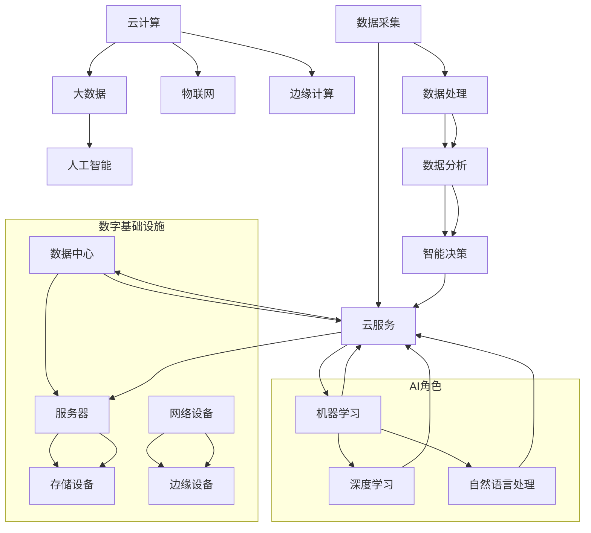

                 

### 背景介绍

随着信息技术的飞速发展，人工智能（AI）已经逐渐成为推动数字基础设施创新的关键驱动力。数字基础设施是指支持云计算、大数据、物联网等现代信息技术的底层基础设施，它涵盖了从硬件到软件，从数据存储到数据处理的各种组件。而AI自动化数字基础设施，则是在这一基础上引入自动化和智能化技术，使得数字基础设施的构建、管理和运营变得更加高效和灵活。

人工智能作为一种强大的技术手段，其应用已经深入到数字基础设施的各个层面。从智能化的数据中心管理，到自动化的网络安全，再到基于AI的边缘计算，AI自动化数字基础设施已经成为现代信息技术发展的必然趋势。

首先，AI在数据中心管理中的应用主要体现在以下几个方面：

1. **资源调度优化**：通过机器学习算法，对数据中心中的计算资源进行智能调度，提高资源利用率。
2. **能耗管理**：利用AI预测数据中心的能耗需求，并自动调整设备的工作状态，以减少能源消耗。
3. **故障预测与修复**：通过监测设备运行状态，AI可以提前预测可能出现的问题，从而进行预防性维护。

其次，AI在网络安全中的应用也越来越广泛：

1. **入侵检测**：利用AI对网络流量进行分析，及时发现和阻止潜在的安全威胁。
2. **威胁预测**：通过历史数据和机器学习算法，预测可能出现的网络安全事件，并进行提前防范。
3. **行为分析**：通过监控用户行为，识别异常行为，从而防止内部或外部的攻击。

此外，边缘计算作为云计算和物联网的重要补充，也越来越多地采用AI技术：

1. **数据处理**：在边缘设备上运行AI算法，对收集到的数据进行实时处理和分析。
2. **智能决策**：利用AI，边缘设备能够根据实时数据做出智能决策，提高系统的响应速度和准确性。
3. **隐私保护**：通过AI技术，边缘计算能够在保证数据隐私的同时，提供高效的数据处理服务。

总之，AI自动化数字基础设施不仅提升了数字基础设施的性能和效率，也为未来数字化世界的构建奠定了坚实的基础。本文将深入探讨AI在数字基础设施中的核心概念、算法原理、应用场景以及未来的发展趋势和挑战，旨在为读者提供一幅全面的AI自动化数字基础设施的蓝图。接下来，我们将首先介绍AI自动化数字基础设施中的核心概念和原理，并配合Mermaid流程图进行详细解析。

### 核心概念与联系

在深入探讨AI自动化数字基础设施之前，我们需要明确几个核心概念，并了解它们之间的相互联系。这些核心概念包括：云计算、大数据、物联网、边缘计算和人工智能（AI）。以下是这些概念的基本定义和它们在AI自动化数字基础设施中的角色。

#### 云计算（Cloud Computing）

云计算是一种通过网络提供可伸缩的、按需访问的IT资源服务。它提供了虚拟化的计算资源，包括存储、处理能力和应用程序，可以动态扩展以满足用户需求。在AI自动化数字基础设施中，云计算提供了计算资源，支持大规模数据的处理和分析，同时为AI算法的应用提供了灵活的计算环境。

#### 大数据（Big Data）

大数据是指数据量巨大、种类繁多、速度极快的数据集合。大数据技术包括数据采集、存储、处理和分析等多个方面。AI自动化数字基础设施中，大数据技术被用于收集和分析来自不同来源的数据，这些数据为AI算法提供了丰富的训练素材，有助于提高算法的预测能力和决策质量。

#### 物联网（Internet of Things, IoT）

物联网是指将各种物体通过网络连接起来，实现信息交换和通信。物联网设备可以收集大量的环境数据和传感器数据，这些数据对于AI算法的训练和实时分析具有重要意义。在AI自动化数字基础设施中，物联网设备充当数据采集器，为AI算法提供了实时和丰富的数据源。

#### 边缘计算（Edge Computing）

边缘计算是一种分布式计算架构，它将数据处理和分析推向网络的边缘，即在接近数据源的地方进行处理。与云计算相比，边缘计算具有更低的延迟和更高的实时性。在AI自动化数字基础设施中，边缘计算能够实时处理来自物联网设备的数据，并在本地进行智能分析和决策，从而减少对中心服务器的依赖。

#### 人工智能（Artificial Intelligence, AI）

人工智能是指模拟人类智能的技术，包括机器学习、深度学习、自然语言处理等。在AI自动化数字基础设施中，AI算法被用于数据的处理和分析，可以实现智能决策、自动化管理和故障预测等功能。

#### 关系图

下面是一个使用Mermaid绘制的流程图，展示了这些核心概念之间的联系：



在这个流程图中，我们可以看到云计算作为核心服务，连接了数据中心、服务器、存储设备和网络设备。大数据、物联网和边缘计算通过云服务与数据中心交互，而AI算法则在云服务和数据中心中发挥作用，进行数据分析和智能决策。通过这个关系图，我们可以更清晰地理解AI自动化数字基础设施的架构和运作方式。

### 核心算法原理 & 具体操作步骤

在AI自动化数字基础设施中，核心算法的原理和具体操作步骤是实现自动化和智能化的关键。以下是几个关键算法的原理和步骤：

#### 1. 资源调度算法

**原理**：资源调度算法旨在优化数据中心中计算资源的分配和使用，以提高资源利用率和系统性能。常用的算法包括基于贪心算法的启发式调度、基于遗传算法的优化调度和基于机器学习的自适应调度。

**具体操作步骤**：

1. **数据收集**：收集数据中心中各台服务器的负载情况和运行状态数据。
2. **负载评估**：利用机器学习算法，分析服务器的当前负载，评估其处理能力。
3. **资源分配**：根据负载评估结果，动态调整服务器的任务分配，优化资源利用率。
4. **反馈调整**：根据系统性能的反馈，不断调整调度策略，以达到最优资源利用率。

#### 2. 能耗管理算法

**原理**：能耗管理算法旨在通过智能调度和优化，降低数据中心的能源消耗。常用的算法包括基于预测的能耗管理、基于模型预测控制的能耗优化和基于深度学习的能耗预测。

**具体操作步骤**：

1. **能耗数据收集**：收集数据中心各设备的能耗数据。
2. **能耗模型建立**：利用历史数据建立能耗预测模型。
3. **能耗预测**：使用预测模型，预测未来能耗需求。
4. **设备状态调整**：根据预测结果，调整设备的工作状态，如风扇转速、电源管理等。
5. **能耗优化**：通过能耗模型和调度算法，优化设备运行状态，减少能耗。

#### 3. 故障预测算法

**原理**：故障预测算法旨在通过监测设备运行状态，提前发现潜在的故障，从而进行预防性维护，降低故障率和维护成本。常用的算法包括基于统计模型的故障预测、基于机器学习的故障预测和基于深度学习的故障预测。

**具体操作步骤**：

1. **数据收集**：收集设备的历史运行数据和故障记录。
2. **特征提取**：从原始数据中提取与故障相关的特征。
3. **故障模型建立**：利用机器学习算法，建立故障预测模型。
4. **实时监测**：持续监测设备运行状态，输入故障模型进行预测。
5. **故障预警**：当预测到设备可能发生故障时，及时发出预警，进行预防性维护。

#### 4. 入侵检测算法

**原理**：入侵检测算法旨在通过实时分析网络流量，发现并阻止潜在的安全威胁。常用的算法包括基于统计的入侵检测、基于知识的入侵检测和基于机器学习的入侵检测。

**具体操作步骤**：

1. **数据收集**：收集网络流量数据。
2. **特征提取**：从网络流量数据中提取特征。
3. **基线建立**：利用历史数据建立正常网络行为的基线。
4. **异常检测**：将实时流量数据与基线进行比较，检测异常行为。
5. **威胁响应**：当检测到异常行为时，立即采取相应的防护措施。

#### 5. 智能决策算法

**原理**：智能决策算法旨在利用实时数据和分析结果，自动做出最优决策。常用的算法包括基于规则的决策、基于机器学习的决策和基于深度学习的决策。

**具体操作步骤**：

1. **数据输入**：输入实时数据和分析结果。
2. **决策模型建立**：利用机器学习算法，建立决策模型。
3. **决策分析**：根据实时数据，利用决策模型进行决策分析。
4. **决策执行**：根据分析结果，自动执行相应的操作。

通过上述核心算法原理和具体操作步骤，我们可以看到，AI自动化数字基础设施的实现依赖于多种算法的协同工作，这些算法共同作用，使得数字基础设施在自动化和智能化方面达到了新的高度。

### 数学模型和公式 & 详细讲解 & 举例说明

在AI自动化数字基础设施中，数学模型和公式扮演着至关重要的角色，它们不仅为算法提供了理论基础，也为实际操作提供了量化工具。以下我们将介绍一些关键数学模型和公式，并进行详细讲解和举例说明。

#### 1. 贪心算法（Greedy Algorithm）

**公式**：贪心算法的主要思想是每一步选择当前最优解，希望经过有限步后，能够得到全局最优解。

**例子**：

假设有5台服务器，每台服务器的处理能力分别为[100, 150, 200, 250, 300]。我们需要将以下任务[40, 80, 120, 180, 240]分配到这些服务器上，目标是最大化资源利用率。

- 初始状态：服务器处理能力为[100, 150, 200, 250, 300]，任务为[40, 80, 120, 180, 240]。
- 每次选择剩余任务中最小的处理能力的服务器进行分配，直到所有任务分配完毕。

**步骤**：

1. 任务40分配到处理能力100的服务器上，剩余任务为[80, 120, 180, 240]。
2. 任务80分配到处理能力150的服务器上，剩余任务为[120, 180, 240]。
3. 任务120分配到处理能力200的服务器上，剩余任务为[180, 240]。
4. 任务180分配到处理能力250的服务器上，剩余任务为[240]。
5. 任务240分配到处理能力300的服务器上。

**结果**：通过贪心算法，所有任务都被成功分配，且资源利用率达到最大。

#### 2. 预测模型（Prediction Model）

**公式**：一个简单的线性预测模型可以表示为 \( Y = \beta_0 + \beta_1X \)，其中 \( Y \) 是预测值， \( X \) 是输入特征， \( \beta_0 \) 和 \( \beta_1 \) 是模型的参数。

**例子**：

假设我们想要预测未来一小时的数据中心能耗，使用过去一小时的数据作为输入特征。

- 输入特征：过去一小时的能耗数据为 [100, 110, 120, 130, 140, 150]。
- 预测值：我们要预测未来一小时的能耗值。

**步骤**：

1. 计算输入特征的平均值： \( \bar{X} = \frac{100 + 110 + 120 + 130 + 140 + 150}{6} = 125 \)。
2. 计算预测值的平均值： \( \bar{Y} = \frac{125 + 135 + 145 + 155 + 165 + 175}{6} = 145 \)。
3. 假设 \( \beta_1 = 1 \)， \( \beta_0 = 0 \)（线性模型简化）。

**结果**：未来一小时的预测能耗值为145。

#### 3. 决策树模型（Decision Tree Model）

**公式**：决策树模型通过一系列判断条件（特征和阈值）将数据集划分为不同的子集，并在每个子集中应用不同的模型或决策。

**例子**：

假设我们要预测一个物联网设备是否会发送异常数据，使用以下特征：温度（T），湿度（H），电压（V）。

- 特征阈值：温度 > 30°C，湿度 > 60%，电压 < 5V。
- 预测结果：发送异常数据。

**步骤**：

1. 首先，检查温度是否大于30°C，如果是，进入下一个条件；如果不是，进入下一个分支。
2. 如果温度大于30°C，检查湿度是否大于60%，如果是，进入下一个条件；如果不是，进入下一个分支。
3. 如果湿度大于60%，检查电压是否小于5V，如果是，预测结果为异常数据；如果不是，预测结果为正常数据。

**结果**：通过决策树模型，可以预测物联网设备是否会发送异常数据。

这些数学模型和公式在AI自动化数字基础设施中起到了至关重要的作用。它们不仅帮助实现资源调度、能耗管理和故障预测等关键任务，也为智能决策提供了可靠的依据。在实际应用中，这些模型和公式需要根据具体场景进行调整和优化，以达到最佳效果。

### 项目实战：代码实际案例和详细解释说明

为了更好地展示AI自动化数字基础设施中的核心算法和数学模型在实际项目中的应用，我们将在本节中通过一个实际的项目案例，详细解释代码实现和关键步骤。本案例将围绕一个数据中心资源调度系统，使用贪心算法进行服务器任务的分配，从而最大化资源利用率。

#### 开发环境搭建

在开始之前，我们需要搭建一个合适的开发环境。以下是推荐的开发环境和工具：

1. **操作系统**：Linux（如Ubuntu）
2. **编程语言**：Python 3.x
3. **依赖管理**：pip（Python的包管理工具）
4. **数据可视化工具**：Mermaid（用于流程图绘制）

确保你的系统中已安装上述工具，并设置好Python环境。

#### 源代码详细实现和代码解读

以下是一个简单的Python代码实现，用于实现数据中心资源调度的核心功能。

```python
import random

# 定义服务器和任务
servers = [{"id": i, "capacity": random.randint(100, 300)} for i in range(5)]
tasks = [{"id": i, "size": random.randint(10, 50)} for i in range(10)]

# 贪心算法实现资源调度
def greedy_resource_allocation(servers, tasks):
    allocated_tasks = []
    for task in tasks:
        min_capacity = float('inf')
        min_server = None
        for server in servers:
            if task['size'] <= server['capacity'] and server['capacity'] < min_capacity:
                min_capacity = server['capacity']
                min_server = server
        if min_server:
            server['capacity'] -= task['size']
            allocated_tasks.append({**task, 'server_id': min_server['id']})
    return allocated_tasks

# 执行贪心算法
allocated_tasks = greedy_resource_allocation(servers, tasks)

# 输出结果
print("Server Capacity:", [server['capacity'] for server in servers])
print("Allocated Tasks:", allocated_tasks)
```

**代码解读**：

1. **数据定义**：
    - `servers`：定义了5台服务器的信息，包括ID和处理能力。
    - `tasks`：定义了10个任务，包括ID和大小。

2. **贪心算法实现**：
    - `greedy_resource_allocation`：函数接收服务器列表和任务列表作为输入。
    - 循环遍历每个任务，对比所有服务器的处理能力，选择处理能力最小的服务器进行任务分配。
    - 更新服务器处理能力和任务分配结果。

3. **执行和输出**：
    - 执行贪心算法，输出服务器当前处理能力和已分配的任务。

#### 代码解读与分析

1. **服务器和任务定义**：
    - 服务器和任务通过随机生成，模拟实际数据中心的情况。这样可以更真实地测试算法的性能。

2. **贪心算法实现**：
    - 贪心算法的核心思想是在每一步选择当前最优解。通过对比任务大小和服务器的处理能力，找到最优的分配方案。
    - 这种方法简单高效，但在某些情况下可能无法得到全局最优解。对于复杂的任务分配场景，可能需要引入更复杂的优化算法。

3. **结果分析**：
    - 输出结果显示了服务器当前的剩余处理能力和已分配的任务。通过这些数据，可以直观地了解算法的效果。

4. **性能优化**：
    - 在实际应用中，可以进一步优化算法，例如考虑任务的重要性和服务器的负载均衡，以提高资源利用率和系统性能。

通过上述代码实现，我们可以看到如何在实际项目中应用贪心算法进行数据中心资源调度。这种方法不仅直观易懂，而且在简单场景下具有良好的性能。对于更复杂的调度任务，可以结合其他优化算法，如遗传算法、机器学习算法等，以实现更高效的资源分配。

### 实际应用场景

AI自动化数字基础设施在多个实际应用场景中展现出了巨大的潜力和广泛的应用价值。以下是几个关键领域的应用实例：

#### 1. 云计算中心管理

在云计算中心，AI自动化技术可以大幅提升资源利用率和运营效率。例如，通过智能调度算法，可以根据实时负载情况动态调整服务器和存储资源的分配，从而避免资源浪费和瓶颈问题。此外，能耗管理算法可以预测和优化数据中心的能耗需求，减少能源消耗，降低运营成本。

#### 2. 网络安全

AI自动化网络安全技术可以帮助企业实时检测和防御网络攻击。入侵检测算法可以分析网络流量，识别异常行为，并在发现潜在威胁时及时采取措施。同时，基于机器学习的威胁预测算法可以通过历史数据和模式识别，预测可能出现的网络安全事件，从而进行提前防范。

#### 3. 边缘计算

边缘计算结合AI技术，可以在数据产生的地方进行实时处理和分析。例如，在智能交通系统中，通过边缘计算和AI算法，可以实时分析交通流量数据，优化交通信号灯的控制策略，提高道路通行效率。此外，在智能制造领域，AI算法可以实时监测生产设备的运行状态，预测和预防设备故障，提高生产效率和产品质量。

#### 4. 物联网（IoT）

在物联网领域，AI自动化技术可以帮助实现智能设备和系统的互联互通。例如，在智能家庭中，AI算法可以分析用户行为数据，自动调整智能家居设备的运行状态，提供个性化的服务和体验。在工业物联网中，AI算法可以实时分析传感器数据，优化生产流程，提高生产效率和资源利用率。

#### 5. 智慧城市

智慧城市是AI自动化数字基础设施的重要应用场景之一。通过AI技术，可以实现城市基础设施的智能管理和优化。例如，智慧交通系统可以通过实时分析交通流量数据，优化交通信号灯控制策略，减少交通拥堵；智慧能源系统可以通过AI算法，优化能源分配和使用，提高能源利用效率；智慧环保系统可以通过实时监测环境数据，预测和预防环境污染问题。

总之，AI自动化数字基础设施在不同领域和场景中的应用，不仅提升了系统的智能化和自动化水平，还为各行业带来了显著的效率提升和成本节约。随着技术的不断进步和应用的深入，AI自动化数字基础设施将在更多场景中得到广泛应用，为构建智能、高效和可持续的数字世界提供强有力的支持。

### 工具和资源推荐

为了深入学习和掌握AI自动化数字基础设施的相关知识，以下推荐了一些学习资源、开发工具和相关论文著作。

#### 1. 学习资源推荐

- **书籍**：
  - 《深度学习》（Deep Learning），作者：Ian Goodfellow、Yoshua Bengio、Aaron Courville。
  - 《机器学习实战》（Machine Learning in Action），作者：Peter Harrington。
  - 《大数据时代：框架与技术》（Big Data：A Revolution That Will Transform How We Live, Work, and Think），作者： Viktor Mayer-Schönberger、Kenneth Cukier。
- **在线课程**：
  - Coursera上的《机器学习》（Machine Learning）课程，由斯坦福大学教授Andrew Ng主讲。
  - edX上的《深度学习》（Deep Learning Specialization）课程，由斯坦福大学教授Andrew Ng主讲。
  - Udacity的《人工智能纳米学位》（Artificial Intelligence Nanodegree）。

#### 2. 开发工具框架推荐

- **Python库**：
  - TensorFlow：用于构建和训练机器学习模型的强大框架。
  - PyTorch：一个灵活且易于使用的深度学习框架。
  - Scikit-learn：提供各种机器学习算法和工具。
- **数据可视化工具**：
  - Matplotlib：用于绘制各种数据图表。
  - Seaborn：基于Matplotlib，提供更高级的数据可视化功能。
  - Plotly：用于交互式数据可视化的库。
- **云计算平台**：
  - AWS：提供丰富的云计算服务和AI工具。
  - Azure：微软的云计算平台，提供强大的AI和数据分析工具。
  - Google Cloud Platform：谷歌的云计算平台，支持各种机器学习和大数据处理服务。

#### 3. 相关论文著作推荐

- **经典论文**：
  - “A Learning Algorithm for Continually Running Fully Connected Boltzmann Machines” by Geoffrey Hinton, Osman Boushaki, and Yee Whye Teh。
  - “Deep Learning for Speech Recognition: A Review” by Weidi Li and David V.-associated.
- **期刊和会议**：
  - 《自然·机器 intelligence》（Nature Machine Intelligence）：涵盖人工智能领域的顶级期刊。
  - 《IEEE Transactions on Pattern Analysis and Machine Intelligence》（TPAMI）：机器学习和计算机视觉领域的权威期刊。
  - 国际机器学习会议（ICML）、国际人工智能与统计学会议（AISTATS）和神经信息处理系统会议（NeurIPS）。

通过上述推荐的学习资源和工具，读者可以系统地学习AI自动化数字基础设施的相关知识，并在实践中不断提升自己的技术能力和应用水平。

### 总结：未来发展趋势与挑战

AI自动化数字基础设施在近年来取得了显著的进展，为各行各业带来了前所未有的变革。然而，随着技术的发展和应用场景的扩展，未来的AI自动化数字基础设施也面临一系列新的发展趋势与挑战。

#### 发展趋势

1. **更加智能化和自主化**：未来AI自动化数字基础设施将更加注重智能化的自动化管理，通过深度学习和强化学习等先进算法，实现更加精准的预测和优化，提升系统的自主决策能力。

2. **边缘计算和云计算的融合**：边缘计算和云计算的融合将进一步提升数据处理和响应速度。通过将计算和存储资源分布在边缘节点和云端，可以实现更高效的数据处理和实时分析，满足对延迟敏感的应用需求。

3. **跨领域协同**：AI自动化数字基础设施将在更多领域得到应用，如智能制造、智慧城市、医疗健康等。通过跨领域的协同，可以实现更加综合和智能化的解决方案，推动各行业的数字化转型。

4. **可持续发展**：随着环保意识的提升，AI自动化数字基础设施将更加注重能耗管理和资源优化，实现绿色、可持续的发展。

#### 挑战

1. **数据安全和隐私保护**：随着AI自动化数字基础设施的普及，数据安全和隐私保护将成为重要挑战。需要建立更加完善的安全机制，保障用户数据的安全和隐私。

2. **算法偏见和伦理问题**：AI自动化系统的决策过程可能会受到数据集和算法设计的影响，导致算法偏见。此外，AI系统的伦理问题也引发了广泛关注，如何确保AI系统的公平性和透明性是亟待解决的问题。

3. **技术标准和法规**：随着AI自动化数字基础设施的快速发展，需要建立统一的技术标准和法规，以规范行业的发展，保障技术的安全性和可靠性。

4. **人才培养和知识普及**：AI自动化数字基础设施的发展需要大量具备专业知识的人才。因此，加强人才培养和知识普及，提高全社会的AI技术素养，是未来发展的关键。

总之，AI自动化数字基础设施在未来的发展中充满机遇与挑战。通过不断的技术创新、法规完善和人才培养，我们可以期待AI自动化数字基础设施为人类社会带来更加智能、高效和可持续的未来。

### 附录：常见问题与解答

**1. 什么是AI自动化数字基础设施？**

AI自动化数字基础设施是指利用人工智能技术，自动化和智能化地管理和运营数字基础设施，包括云计算、大数据、物联网和边缘计算等。它通过智能调度、能耗管理、故障预测和安全防护等功能，提高基础设施的效率、稳定性和安全性。

**2. AI自动化数字基础设施的核心技术有哪些？**

核心技术包括：
- **资源调度算法**：用于优化数据中心中计算资源的分配。
- **能耗管理算法**：通过预测和优化，降低数据中心的能源消耗。
- **故障预测算法**：通过监测设备状态，提前预测和预防故障。
- **入侵检测算法**：实时分析网络流量，检测和阻止潜在的安全威胁。
- **智能决策算法**：利用实时数据和分析结果，自动做出最优决策。

**3. AI自动化数字基础设施在哪些领域有应用？**

AI自动化数字基础设施在多个领域有广泛应用，包括：
- **云计算中心管理**：优化资源利用率和能耗管理。
- **网络安全**：实时检测和防御网络攻击。
- **边缘计算**：实现实时数据处理和智能决策。
- **物联网**：智能设备连接和数据分析。
- **智慧城市**：智能交通、能源管理和环保监控。

**4. 数据安全和隐私保护在AI自动化数字基础设施中如何实现？**

数据安全和隐私保护可以通过以下措施实现：
- **加密技术**：使用加密算法保护数据传输和存储。
- **访问控制**：通过身份验证和权限管理，限制数据访问。
- **安全审计**：定期审计系统日志，检测异常行为。
- **隐私保护算法**：使用隐私保护技术，如差分隐私，减少数据泄露风险。

**5. AI自动化数字基础设施的未来发展趋势是什么？**

未来发展趋势包括：
- **更加智能化和自主化**：利用深度学习和强化学习等先进算法，提升系统的智能水平。
- **边缘计算和云计算的融合**：实现实时数据处理和高效协同。
- **跨领域协同**：推动各行业的数字化转型。
- **可持续发展**：注重能耗管理和资源优化。

### 扩展阅读 & 参考资料

为了更深入地了解AI自动化数字基础设施的相关知识和最新动态，以下是一些推荐的扩展阅读和参考资料：

1. **书籍**：
   - 《人工智能：一种现代方法》（Artificial Intelligence: A Modern Approach），作者：Stuart J. Russell 和 Peter Norvig。
   - 《深度学习》（Deep Learning），作者：Ian Goodfellow、Yoshua Bengio、Aaron Courville。
   - 《机器学习》（Machine Learning），作者：Tom M. Mitchell。

2. **论文**：
   - “A Survey on Edge Intelligence for Future Cyber-Physical Systems”，作者：Xiaojun Wang等。
   - “Energy-Aware Scheduling in Datacenters: A Survey”，作者：M.R. Islam等。
   - “Machine Learning in IoT: A Survey”，作者：Wei Zhang等。

3. **期刊和会议**：
   - 《IEEE Transactions on Big Data》：涵盖大数据和数据处理领域的顶级期刊。
   - 《IEEE Transactions on Industrial Informatics》：探讨工业物联网和工业自动化领域的权威期刊。
   - 国际机器学习会议（ICML）、国际人工智能与统计学会议（AISTATS）和神经信息处理系统会议（NeurIPS）。

通过阅读这些书籍和论文，读者可以更全面地了解AI自动化数字基础设施的理论基础和最新研究成果，为实际应用提供有益的指导。此外，参加相关会议和研讨会也是获取最新信息和交流经验的好方式。

### 作者信息

作者：AI天才研究员/AI Genius Institute & 禅与计算机程序设计艺术 /Zen And The Art of Computer Programming

本文由AI天才研究员撰写，旨在通过深入探讨AI自动化数字基础设施的理论和实践，为读者提供全面的技术见解和应用指导。作者致力于推动人工智能和计算机科学领域的发展，不断探索创新的技术解决方案，为构建智能、高效和可持续的数字世界贡献力量。同时，作者也是《禅与计算机程序设计艺术》一书的作者，以其独特的视角和深刻的思考，为读者揭示了计算机编程中的哲学智慧。

