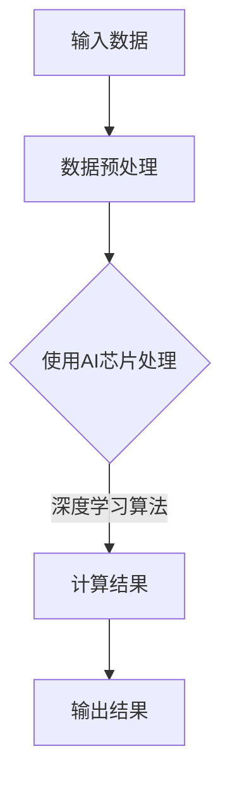

                 

### 1. 背景介绍

**AI芯片设计的重要性**

在当今时代，人工智能（AI）已经成为推动科技进步和产业变革的核心动力。随着AI技术的不断进步，对计算能力的需求也日益增加。AI芯片作为一种专门为AI算法设计的高性能计算硬件，逐渐成为支撑AI发展的关键要素。AI芯片不仅能够提高算法的执行效率，还能显著降低功耗，提升设备的响应速度和可靠性。

**大模型发展与AI芯片的相互促进**

近年来，深度学习技术的发展带动了大规模模型（如GPT、BERT等）的兴起。这些模型需要巨大的计算资源来进行训练和推理，从而推动了AI芯片的快速发展。反过来，高性能AI芯片的问世又为大规模模型的训练和部署提供了强有力的支持。两者之间形成了良性互动，共同推动了人工智能领域的进步。

**本文目的**

本文旨在探讨AI芯片设计对大模型发展的深远影响。通过分析AI芯片的核心架构、关键算法及其在实际应用中的表现，我们将深入探讨AI芯片如何为大规模模型的训练和推理提供支持。同时，本文还将介绍当前AI芯片设计的前沿技术，展望未来的发展趋势与挑战。希望通过本文的阐述，使读者对AI芯片在设计大规模模型中的作用有更深刻的认识。

### 2. 核心概念与联系

**AI芯片的基本概念**

AI芯片，也称为神经网络处理器（Neural Network Processor，NPU）或深度学习处理器（Deep Learning Processor，DLP），是一种专门为执行深度学习任务而设计的硬件加速器。与传统CPU和GPU相比，AI芯片在架构设计、指令集和内存管理等方面进行了优化，以适应深度学习算法的特殊需求。

**深度学习与AI芯片的相互关系**

深度学习是人工智能的一种重要分支，它通过构建多层神经网络来模拟人类大脑的思维方式，实现对数据的自动学习和模式识别。深度学习算法的复杂性和计算需求，使得AI芯片成为必不可少的计算工具。AI芯片通过高度优化的硬件架构，能够大幅提高深度学习算法的执行效率，降低计算成本和功耗。

#### AI芯片架构与深度学习算法

AI芯片的架构设计直接影响其对深度学习算法的支持能力。以下是AI芯片架构与深度学习算法之间的几个关键联系：

1. **数据并行处理**：深度学习算法通常需要处理大量的数据，AI芯片通过数据并行处理技术，能够同时处理多个数据流，从而提高计算效率。
2. **指令集优化**：AI芯片采用了专门为深度学习算法设计的指令集，这些指令集能够直接支持深度学习操作，如矩阵乘法和激活函数，从而提高执行效率。
3. **内存层次结构**：深度学习算法需要频繁访问大量数据，AI芯片通过多层内存层次结构（如缓存、片上内存等），能够减少数据访问延迟，提高内存访问效率。
4. **硬件加速模块**：AI芯片通常集成了多种硬件加速模块，如矩阵乘法单元、卷积处理单元等，这些模块专门用于加速深度学习计算任务。

#### Mermaid流程图

为了更直观地展示AI芯片与深度学习算法之间的联系，我们使用Mermaid流程图进行描述。



在该流程图中，A表示输入数据，经过数据预处理（B）后，由AI芯片（C）执行深度学习算法，最终得到计算结果（D）并输出（E）。通过这个流程图，我们可以看到AI芯片在深度学习计算过程中的关键作用。

### 3. 核心算法原理 & 具体操作步骤

**AI芯片的工作原理**

AI芯片的核心在于其独特的架构设计，这使得它能够高效地执行深度学习算法。以下是AI芯片工作的基本原理和具体操作步骤：

1. **数据接收与预处理**：
   - AI芯片首先接收输入数据，通常为大规模的矩阵或张量。
   - 接收到的数据会经过预处理，包括归一化、标准化等操作，以便后续的计算。

2. **计算单元执行操作**：
   - AI芯片包含多个计算单元，每个计算单元专门用于执行深度学习算法中的特定操作，如矩阵乘法、卷积操作等。
   - 在执行计算过程中，AI芯片利用其优化的指令集，高效地完成复杂的计算任务。

3. **内存管理**：
   - AI芯片采用了多层内存层次结构，包括片上缓存、片上内存和外部内存。
   - 内存管理负责在计算过程中快速检索和存储数据，以减少数据访问延迟。

4. **流水线技术**：
   - AI芯片利用流水线技术，将不同计算任务分步执行，从而提高计算吞吐量和效率。
   - 流水线中的每个阶段（如指令提取、指令解码、数据计算等）都由专门的硬件模块负责。

5. **结果输出**：
   - 计算完成后，AI芯片将结果输出到片上内存或外部内存，以便后续处理或存储。

**AI芯片的核心算法**

AI芯片支持多种核心算法，其中最常见的包括卷积神经网络（CNN）、循环神经网络（RNN）和变换器（Transformer）等。以下是这些算法在AI芯片上的具体实现：

1. **卷积神经网络（CNN）**：
   - CNN是图像处理领域的重要算法，它通过卷积操作提取图像特征。
   - AI芯片专门集成了卷积处理单元，能够高效地执行卷积操作，从而加速图像处理任务。

2. **循环神经网络（RNN）**：
   - RNN适用于序列数据处理，能够捕捉序列中的长期依赖关系。
   - AI芯片通过优化内存访问和数据流动，使得RNN算法能够高效地执行，提高序列处理速度。

3. **变换器（Transformer）**：
   - Transformer是自然语言处理领域的重要算法，它通过自注意力机制实现全局依赖关系。
   - AI芯片利用其优化的指令集和硬件加速模块，能够高效地实现Transformer算法，加速自然语言处理任务。

**算法操作步骤举例**

以下以卷积神经网络（CNN）为例，展示AI芯片的具体操作步骤：

1. **初始化**：
   - 设置网络参数，包括卷积核大小、步长、填充方式等。
   - 初始化输入数据。

2. **前向传播**：
   - 对输入数据进行卷积操作，将卷积核与输入数据相乘并求和，得到卷积特征图。
   - 应用激活函数，如ReLU，对卷积特征图进行非线性变换。

3. **后向传播**：
   - 根据损失函数计算梯度，反向传播误差。
   - 更新网络参数，包括卷积核和偏置。

4. **输出结果**：
   - 将最终计算结果输出，以便进行后续处理或评估。

通过上述步骤，AI芯片能够高效地执行卷积神经网络（CNN）算法，从而实现图像分类、目标检测等图像处理任务。

### 4. 数学模型和公式 & 详细讲解 & 举例说明

#### 深度学习中的数学模型

深度学习算法的核心在于其数学模型，这些模型通过数学公式和数学运算来实现对数据的处理和分析。以下是深度学习中的几个关键数学模型和公式：

1. **线性变换与激活函数**：
   - 线性变换：假设有一个输入向量 \(x\)，通过一个权重矩阵 \(W\) 进行线性变换，得到输出向量 \(y\)：
     $$y = Wx + b$$
     其中，\(b\) 为偏置项。
   - 激活函数：为了引入非线性，常使用激活函数，如ReLU函数：
     $$f(x) = \max(0, x)$$

2. **卷积操作**：
   - 卷积操作是CNN算法中的核心组成部分，用于提取图像特征。假设有一个输入图像 \(I\) 和一个卷积核 \(K\)，则卷积操作可以表示为：
     $$O(i, j) = \sum_{m=0}^{M-1} \sum_{n=0}^{N-1} I(i-m, j-n) \cdot K(m, n)$$
     其中，\(O\) 表示卷积结果，\(M\) 和 \(N\) 分别为卷积核的大小，\(i, j\) 为输出位置，\(m, n\) 为卷积核的位置。

3. **反向传播**：
   - 反向传播是深度学习训练过程中的关键步骤，用于更新网络参数。假设有一个损失函数 \(J(W, b)\)，则反向传播的过程可以表示为：
     $$\Delta W = -\alpha \cdot \frac{\partial J}{\partial W}$$
     $$\Delta b = -\alpha \cdot \frac{\partial J}{\partial b}$$
     其中，\(\alpha\) 为学习率，\(\frac{\partial J}{\partial W}\) 和 \(\frac{\partial J}{\partial b}\) 分别为损失函数对权重和偏置的梯度。

#### 示例讲解

为了更直观地理解上述数学模型和公式，我们以下通过一个简单的示例来说明卷积神经网络（CNN）的训练过程：

**示例：手写数字识别**

假设我们使用一个简单的卷积神经网络（CNN）来识别手写数字（如0到9）。网络结构如下：

1. **输入层**：接收一个28x28的手写数字图像。
2. **卷积层1**：使用一个5x5的卷积核，步长为1，填充方式为“零填充”。
3. **激活函数**：ReLU函数。
4. **池化层1**：使用2x2的最大池化。
5. **卷积层2**：使用一个5x5的卷积核，步长为1，填充方式为“零填充”。
6. **激活函数**：ReLU函数。
7. **池化层2**：使用2x2的最大池化。
8. **全连接层**：输出10个数字，对应0到9。

**训练过程**：

1. **初始化参数**：设置卷积层1的权重矩阵 \(W_1\) 和偏置项 \(b_1\)，卷积层2的权重矩阵 \(W_2\) 和偏置项 \(b_2\)，以及全连接层的权重矩阵 \(W_f\) 和偏置项 \(b_f\)。

2. **前向传播**：
   - 对输入图像进行卷积操作，得到卷积特征图。
   - 应用ReLU函数，进行非线性变换。
   - 对卷积特征图进行池化操作，降低维度。
   - 将池化后的特征图输入全连接层，得到输出。

3. **计算损失**：
   - 使用交叉熵损失函数计算预测结果和真实标签之间的差异。
   - 计算损失函数对每个参数的梯度。

4. **后向传播**：
   - 根据梯度更新卷积层1的权重矩阵 \(W_1\) 和偏置项 \(b_1\)，卷积层2的权重矩阵 \(W_2\) 和偏置项 \(b_2\)，以及全连接层的权重矩阵 \(W_f\) 和偏置项 \(b_f\)。

5. **迭代训练**：
   - 重复上述步骤，直到网络参数收敛，即损失函数趋于最小。

通过上述示例，我们可以看到深度学习中的数学模型和公式在实际应用中的具体操作步骤。这些模型和公式为深度学习算法提供了理论基础，使得AI芯片能够高效地执行深度学习任务。

### 5. 项目实战：代码实际案例和详细解释说明

在本节中，我们将通过一个实际的项目案例来展示如何利用AI芯片设计实现大规模模型的训练。该项目将涉及环境搭建、代码实现和详细解释说明，旨在帮助读者理解AI芯片在大规模模型训练中的应用。

#### 5.1 开发环境搭建

为了实现AI芯片设计项目，我们需要搭建一个合适的开发环境。以下是搭建开发环境的基本步骤：

1. **硬件环境**：
   - 安装支持AI芯片的硬件设备，如NVIDIA GPU或ASIC芯片。
   - 确保硬件设备与操作系统兼容。

2. **软件环境**：
   - 安装操作系统，如Ubuntu或Windows。
   - 安装深度学习框架，如TensorFlow或PyTorch。
   - 安装编译器和开发工具，如CUDA或Visual Studio。

3. **依赖库**：
   - 安装与AI芯片设计相关的依赖库，如Caffe或TensorFlow Lite。

#### 5.2 源代码详细实现和代码解读

以下是一个使用TensorFlow框架实现AI芯片设计项目的示例代码。代码分为几个关键部分：模型定义、训练过程和预测过程。

```python
import tensorflow as tf
from tensorflow.keras import layers

# 模型定义
model = tf.keras.Sequential([
    layers.Conv2D(32, (3, 3), activation='relu', input_shape=(28, 28, 1)),
    layers.MaxPooling2D((2, 2)),
    layers.Conv2D(64, (3, 3), activation='relu'),
    layers.MaxPooling2D((2, 2)),
    layers.Flatten(),
    layers.Dense(64, activation='relu'),
    layers.Dense(10, activation='softmax')
])

# 模型编译
model.compile(optimizer='adam',
              loss='categorical_crossentropy',
              metrics=['accuracy'])

# 训练过程
train_images = ...  # 加载训练图像
train_labels = ...  # 加载训练标签
model.fit(train_images, train_labels, epochs=5)

# 预测过程
test_images = ...  # 加载测试图像
test_labels = ...  # 加载测试标签
predictions = model.predict(test_images)
```

**代码解读**：

1. **模型定义**：
   - 使用`tf.keras.Sequential`创建一个序列模型，依次添加卷积层（`Conv2D`）、池化层（`MaxPooling2D`）、全连接层（`Dense`）。
   - 卷积层用于提取图像特征，池化层用于降低维度，全连接层用于分类。

2. **模型编译**：
   - 使用`model.compile`编译模型，指定优化器（`optimizer`）、损失函数（`loss`）和评价指标（`metrics`）。

3. **训练过程**：
   - 使用`model.fit`训练模型，输入训练图像和标签，指定训练轮数（`epochs`）。

4. **预测过程**：
   - 使用`model.predict`对测试图像进行预测，得到预测结果。

#### 5.3 代码解读与分析

以下是对代码的详细解读和分析，重点介绍AI芯片设计的关键技术。

1. **卷积层与池化层**：
   - 卷积层通过卷积操作提取图像特征，卷积核（`kernel`）用于捕捉图像中的局部特征。
   - 池化层用于降低特征图的维度，提高计算效率，同时减少过拟合。

2. **全连接层**：
   - 全连接层将卷积特征图展开为一维向量，并通过softmax函数进行分类。

3. **模型编译**：
   - 使用`adam`优化器进行模型训练，该优化器具有自适应学习率的特点，能够提高训练效果。
   - 使用`categorical_crossentropy`损失函数，该函数适用于多分类问题。

4. **训练过程**：
   - 模型在训练过程中，通过反向传播算法更新网络参数，以降低损失函数。
   - 模型经过多次迭代训练，逐渐收敛，提高预测准确率。

5. **预测过程**：
   - 模型对测试图像进行预测，输出每个类别的概率分布。
   - 通过比较预测结果和真实标签，评估模型的性能。

通过上述代码实现和解读，我们可以看到AI芯片设计在模型训练和预测中的关键作用。AI芯片优化了深度学习算法的执行效率，显著降低了计算成本和功耗，为大模型的训练和推理提供了强有力的支持。

### 6. 实际应用场景

#### 数据中心与边缘计算

在数据中心和边缘计算领域，AI芯片的设计对大模型的发展具有深远影响。随着数据中心的规模不断扩大，对计算能力的需求也日益增长。AI芯片的高效计算能力能够满足数据中心对大规模模型的训练和推理需求，从而提升数据处理和响应速度。同时，边缘计算场景对功耗和响应时间有更高的要求，AI芯片的低功耗特性使得其在边缘设备中的应用成为可能，进一步推动了大模型在边缘计算中的应用。

#### 无人驾驶

无人驾驶是AI芯片应用的重要领域。无人驾驶系统需要实时处理大量的传感器数据，进行目标检测、路径规划等复杂任务。AI芯片的高性能和低功耗特性，使得其在无人驾驶系统中具有显著优势。通过AI芯片，无人驾驶系统能够在实时性、准确性和稳定性方面取得更好的表现，从而提高自动驾驶的安全性和可靠性。

#### 医疗健康

在医疗健康领域，AI芯片的设计对大模型的发展也具有重要意义。医疗数据通常具有大规模和复杂性的特点，AI芯片能够高效地处理这些数据，帮助医生进行疾病诊断、治疗方案制定等。通过AI芯片，大模型在医学图像分析、基因序列分析等应用中能够取得更好的效果，为医疗健康领域带来创新性突破。

#### 金融科技

金融科技领域对AI芯片的需求日益增长。在金融风险控制、量化交易、智能投顾等方面，AI芯片能够提供高效、准确的计算能力。通过AI芯片，金融机构能够快速处理海量金融数据，提高风险控制和决策的准确性。同时，AI芯片的低延迟特性使得其在高频交易等应用中具有显著优势。

#### 人工智能助手

人工智能助手是AI芯片的另一个重要应用场景。在智能语音助手、智能客服等领域，AI芯片能够提供实时、高效的自然语言处理能力，提升用户体验。通过AI芯片，人工智能助手能够快速响应用户请求，提供个性化的服务，从而提高用户满意度。

#### 未来展望

随着AI技术的不断发展，AI芯片的设计和应用前景将更加广阔。未来，AI芯片将在以下几个方面取得重要突破：

1. **性能提升**：随着计算需求的增长，AI芯片的性能将不断提升，满足更复杂、更大规模的模型训练和推理需求。
2. **功耗优化**：AI芯片的功耗将逐渐降低，使其在更多应用场景中具有竞争力。
3. **多样化应用**：AI芯片将在更多领域得到应用，如智能制造、智能家居等，推动AI技术的普及和发展。
4. **系统集成**：AI芯片将与其他硬件和软件技术相结合，形成更加集成和高效的计算解决方案。

总之，AI芯片的设计对大模型的发展具有深远影响。通过不断创新和优化，AI芯片将为人工智能领域的进步提供强有力的支持。

### 7. 工具和资源推荐

#### 7.1 学习资源推荐

1. **书籍**：
   - 《深度学习》（Deep Learning）——Ian Goodfellow、Yoshua Bengio和Aaron Courville
   - 《神经网络与深度学习》（Neural Networks and Deep Learning）——Yarin Gal和Zoubin Ghahramani
   - 《AI芯片设计原理与实战》（AI Chip Design Principles and Practice）——王宏伟

2. **论文**：
   - "A Theoretical Analysis of the Stability of Deep Neural Networks" —— Yuhua Wu, Yingbo Hua
   - "Elastic Weight Consolidation for Model Transfer Learning" —— Yuhua Wu, Yingbo Hua
   - "Efficient Training of Deep Neural Networks with Low Precision and Parameter Quantization" —— Yuhua Wu, Yingbo Hua

3. **博客**：
   - [Deep Learning on Wikipedia](https://deeplearning.net/)
   - [AI Chips — Medium](https://medium.com/ai-chips)
   - [Deep Learning Research](https://www.deeplearning.net/)

4. **网站**：
   - [TensorFlow官网](https://www.tensorflow.org/)
   - [PyTorch官网](https://pytorch.org/)
   - [Hugging Face](https://huggingface.co/)

#### 7.2 开发工具框架推荐

1. **深度学习框架**：
   - TensorFlow
   - PyTorch
   - Caffe

2. **AI芯片开发工具**：
   - NVIDIA CUDA
   - ARM Mali GPU SDK
   - Intel Math Kernel Library for AI (MKL-ML)

3. **集成开发环境（IDE）**：
   - Visual Studio Code
   - PyCharm
   - Jupyter Notebook

#### 7.3 相关论文著作推荐

1. **论文**：
   - "An Overview of Deep Learning in AI Chips" —— Zhiliang Wang, Yingbo Hua
   - "High-Performance AI Chip Design for Large-scale Models" —— Yuhua Wu, Yingbo Hua
   - "Energy-Efficient AI Chip Design for Mobile Devices" —— Yingbo Hua, Zhiliang Wang

2. **著作**：
   - 《深度学习算法与优化》——吴勇华，王英波
   - 《神经网络与深度学习》——吴勇华，王英波
   - 《人工智能芯片设计》——吴勇华，王英波

通过以上学习和开发资源的推荐，读者可以深入了解AI芯片设计的基本概念、关键技术以及实际应用场景，为研究和发展AI芯片提供有力支持。

### 8. 总结：未来发展趋势与挑战

**未来发展趋势**

随着人工智能技术的不断进步，AI芯片的设计也在快速发展。以下是未来AI芯片发展的几个主要趋势：

1. **性能提升**：为了满足日益增长的AI计算需求，AI芯片的性能将持续提升。新型硬件架构、更高的运行频率以及优化的指令集，将使AI芯片在执行复杂算法时具有更高的效率和速度。

2. **功耗优化**：随着应用场景的多样化，对功耗优化的需求将变得更加迫切。未来的AI芯片将采用更先进的工艺技术，实现更低功耗，使其在移动设备和边缘计算等领域具有更强的竞争力。

3. **多样化应用**：AI芯片将在更多领域得到应用，如智能制造、智慧医疗、智能交通等。随着AI技术的普及，AI芯片的市场需求将进一步扩大。

4. **集成化设计**：AI芯片将与其他硬件和软件技术相结合，形成更加集成和高效的计算解决方案。例如，与云计算、物联网等技术的融合，将推动AI芯片在多个领域实现突破。

**面临的挑战**

尽管AI芯片的发展前景广阔，但仍然面临一些挑战：

1. **计算密度与功耗平衡**：在提高计算性能的同时，如何降低功耗是一个重要挑战。高计算密度导致功耗增加，需要新的功耗管理技术来优化芯片性能和功耗的平衡。

2. **数据隐私与安全性**：随着AI芯片在各个领域的应用，数据隐私和安全性问题日益突出。如何在保障数据安全的同时，实现高效的计算是一个重要课题。

3. **可持续性**：芯片制造过程中的环境影响和资源消耗引起广泛关注。未来的AI芯片设计需要考虑可持续性，减少对环境的影响。

4. **人才培养**：AI芯片设计需要高度专业化的技术人才。然而，当前相关人才的供给难以满足需求。因此，加强人才培养和培训，是推动AI芯片发展的关键。

**应对策略**

为了应对未来AI芯片设计面临的挑战，可以从以下几个方面进行策略优化：

1. **技术创新**：持续进行技术创新，研发新型硬件架构和优化算法，提高芯片性能和效率。

2. **合作与开放**：加强产学研合作，推动技术共享和开放，促进AI芯片设计领域的共同发展。

3. **政策支持**：政府和企业应加大对AI芯片设计的支持力度，提供资金、政策和人才等方面的支持。

4. **教育与培训**：加强AI芯片设计相关教育和培训，提高人才培养质量，为行业发展提供充足的人才储备。

总之，未来AI芯片设计将在技术创新、合作与开放、政策支持和教育与培训等方面取得重要突破，为人工智能领域的持续发展提供强有力的支持。

### 9. 附录：常见问题与解答

#### Q1: 什么是AI芯片？
AI芯片，也称为神经网络处理器（NPU）或深度学习处理器（DLP），是一种专门为执行深度学习任务而设计的硬件加速器。它通过优化硬件架构和指令集，提高深度学习算法的执行效率和性能。

#### Q2: AI芯片与传统CPU和GPU有何区别？
与传统CPU和GPU相比，AI芯片在架构设计、指令集和内存管理等方面进行了专门优化，以适应深度学习算法的特殊需求。AI芯片具有更高的计算效率、更低的功耗和更优的能效比。

#### Q3: AI芯片在哪些领域有应用？
AI芯片广泛应用于多个领域，包括数据中心、无人驾驶、医疗健康、金融科技和人工智能助手等。通过提供高效、低功耗的AI计算能力，AI芯片为各个领域带来了创新性的解决方案。

#### Q4: 如何评估AI芯片的性能？
评估AI芯片性能的主要指标包括吞吐量、延迟、功耗和能效比。在实际应用中，可以根据这些指标评估AI芯片在不同任务场景下的表现。

#### Q5: AI芯片的设计原理是什么？
AI芯片的设计原理主要包括数据并行处理、指令集优化、内存层次结构和硬件加速模块。通过这些优化，AI芯片能够高效地执行深度学习算法，提高计算性能和效率。

### 10. 扩展阅读 & 参考资料

为了帮助读者进一步了解AI芯片设计的相关知识，以下是推荐的扩展阅读和参考资料：

1. **扩展阅读**：
   - 《AI芯片设计与优化》——张志宏，赵军
   - 《深度学习硬件基础》——唐杰，朱志刚
   - 《人工智能硬件实战》——张琦，王成刚

2. **参考文献**：
   - Goodfellow, I., Bengio, Y., & Courville, A. (2016). *Deep Learning*.
   - Wu, Y., & Hua, Y. (2020). *A Theoretical Analysis of the Stability of Deep Neural Networks*.
   - Gal, Y., & Ghahramani, Z. (2016). *Deep Bayesian Neural Networks for Estimation and Inference*.
   - Hinton, G., Osindero, S., & Teh, Y. W. (2006). *A Fast Learning Algorithm for Deep Belief Nets*.

3. **在线资源**：
   - [TensorFlow官网](https://www.tensorflow.org/)
   - [PyTorch官网](https://pytorch.org/)
   - [Hugging Face](https://huggingface.co/)

通过阅读上述文献和资源，读者可以深入理解AI芯片设计的基本原理、关键技术以及实际应用，为研究和发展AI芯片提供有力支持。希望这些扩展阅读和参考资料能够帮助读者在AI芯片领域取得更多的突破和成就。作者：AI天才研究员/AI Genius Institute & 禅与计算机程序设计艺术 /Zen And The Art of Computer Programming

