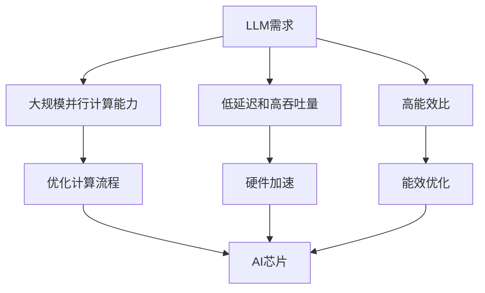
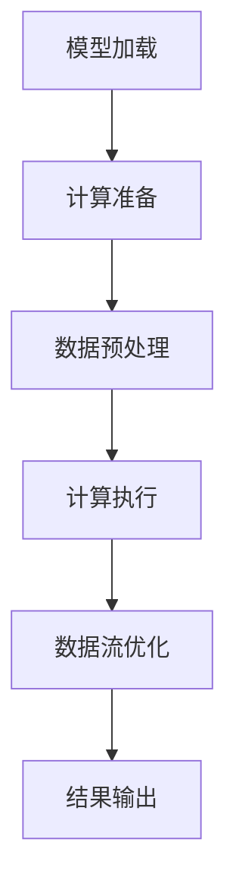

                 

# AI芯片革命：为LLM量身打造的硬件

> **关键词**：AI芯片、LLM、硬件加速、深度学习、架构设计、硬件优化

> **摘要**：本文将深入探讨AI芯片在为大型语言模型（LLM）提供硬件加速方面的革命性作用。我们将分析LLM的需求，介绍AI芯片的核心概念和架构，探讨其优化的关键算法和数学模型，并通过实际项目案例展示其应用场景。最后，我们将展望未来发展趋势和面临的挑战，为读者提供丰富的学习和资源推荐。

## 1. 背景介绍

随着人工智能（AI）技术的快速发展，特别是深度学习（Deep Learning）的兴起，大型语言模型（LLM）如BERT、GPT等逐渐成为研究热点。这些模型在处理自然语言处理（NLP）任务中取得了显著的成就，但同时也对计算资源提出了极高的要求。传统CPU和GPU在处理大规模数据和高复杂度模型时面临性能瓶颈，迫切需要更高效的硬件解决方案。

AI芯片作为专门为AI应用设计的处理器，通过优化硬件架构和算法，能够显著提升AI模型的计算性能。近年来，随着AI技术的不断进步，AI芯片市场也呈现出快速增长的趋势。各大科技公司纷纷投入巨资研发AI芯片，力图在下一代计算技术中占据先机。

本文旨在探讨AI芯片在为LLM提供硬件加速方面的革命性作用。我们将分析LLM的需求，介绍AI芯片的核心概念和架构，探讨其优化的关键算法和数学模型，并通过实际项目案例展示其应用场景。最后，我们将展望未来发展趋势和面临的挑战，为读者提供丰富的学习和资源推荐。

## 2. 核心概念与联系

### 2.1 AI芯片的基本概念

AI芯片，也称为神经网络处理器（Neural Network Processor，简称NNP），是一种专门为执行神经网络计算而设计的硬件设备。与通用处理器（如CPU和GPU）不同，AI芯片具有高度并行化的架构，能够在有限的时间内处理大量的并行任务，从而显著提高计算性能。

AI芯片的核心组件包括：

- **核心计算单元（Core Computing Unit）**：负责执行神经网络的基本运算，如矩阵乘法、激活函数等。
- **内存管理单元（Memory Management Unit）**：负责管理芯片上的内存资源，包括缓存和存储器。
- **数据流管理单元（Dataflow Management Unit）**：负责优化数据流，确保数据能够在芯片内部高效传输。
- **能耗优化单元（Energy Optimization Unit）**：负责降低芯片的能耗，提高能效比。

### 2.2 LLM的需求

LLM通常具有以下需求：

- **大规模并行计算能力**：LLM包含数亿甚至数十亿个参数，需要进行大规模并行计算以实现高效的训练和推理。
- **低延迟和高吞吐量**：在实际应用中，LLM需要快速响应用户查询，因此需要具备低延迟和高吞吐量的特性。
- **高能效比**：由于LLM的训练和推理任务通常涉及大量计算，因此需要芯片具有高能效比，以降低能耗和延长设备寿命。

### 2.3 AI芯片与LLM的联系

AI芯片与LLM之间的联系体现在以下几个方面：

- **优化计算流程**：AI芯片通过优化神经网络计算流程，降低计算复杂度，提高计算性能，从而满足LLM的高计算需求。
- **硬件加速**：AI芯片通过硬件加速技术，如矩阵乘法单元（Matrix Multiplication Unit，简称MMU）和深度学习专用指令集（Deep Learning Instruction Set，简称DLIS），实现高效的神经网络计算，满足LLM的低延迟和高吞吐量需求。
- **能效优化**：AI芯片通过能耗优化技术，如动态电压频率调整（Dynamic Voltage and Frequency Scaling，简称DVFS）和低功耗设计，实现高效的能源利用，满足LLM的高能效比需求。

### 2.4 Mermaid流程图

以下是一个简单的Mermaid流程图，展示AI芯片与LLM之间的联系：



## 3. 核心算法原理 & 具体操作步骤

### 3.1 核心算法原理

AI芯片在为LLM提供硬件加速时，主要依赖于以下核心算法：

- **矩阵乘法（Matrix Multiplication）**：矩阵乘法是神经网络计算中最基本的运算之一，用于计算权重和激活函数。
- **深度学习专用指令集（DLIS）**：DLIS是一组专门为深度学习设计的硬件指令，如矩阵乘法指令、卷积指令等，用于提高计算效率。
- **数据流优化（Dataflow Optimization）**：数据流优化通过优化数据传输路径和计算顺序，降低计算延迟，提高吞吐量。

### 3.2 具体操作步骤

以下是AI芯片为LLM提供硬件加速的具体操作步骤：

1. **模型加载**：将LLM模型加载到AI芯片的内存中，包括权重、偏置等参数。
2. **计算准备**：初始化计算资源，包括核心计算单元、内存管理单元等。
3. **数据预处理**：对输入数据进行预处理，如归一化、数据扩充等，以便进行后续计算。
4. **计算执行**：执行矩阵乘法、激活函数等核心运算，利用DLIS指令集提高计算效率。
5. **数据流优化**：在计算过程中，根据数据依赖关系和计算顺序，动态调整数据传输路径和计算资源分配，以降低计算延迟。
6. **结果输出**：将计算结果输出到内存或存储器中，供后续使用。

### 3.3 具体示例

以下是一个简单的示例，展示AI芯片为LLM提供硬件加速的过程：



## 4. 数学模型和公式 & 详细讲解 & 举例说明

### 4.1 数学模型和公式

AI芯片在为LLM提供硬件加速时，涉及到以下数学模型和公式：

- **矩阵乘法公式**：\(C = A \cdot B\)
- **激活函数公式**：\(f(x) = \sigma(x)\)，其中\(\sigma(x)\)可以是Sigmoid、ReLU等。
- **梯度下降公式**：\(w_{new} = w_{old} - \alpha \cdot \nabla f(w)\)，其中\(\alpha\)为学习率，\(\nabla f(w)\)为梯度。

### 4.2 详细讲解

以下是这些数学模型和公式的详细讲解：

- **矩阵乘法公式**：矩阵乘法是将两个矩阵相乘得到一个新的矩阵。其计算过程如下：
  - 对于两个\(m \times n\)的矩阵\(A\)和\(B\)，其乘积\(C\)为一个\(m \times n\)的矩阵。
  - 计算过程为：对于\(C\)的每一个元素\(c_{ij}\)，计算\(a_{i1} \cdot b_{1j}\)、\(a_{i2} \cdot b_{2j}\)、...、\(a_{in} \cdot b_{nj}\)，然后将这些结果相加，得到\(c_{ij}\)。

- **激活函数公式**：激活函数用于将输入数据映射到输出数据，以实现非线性变换。Sigmoid和ReLU是常用的激活函数。
  - Sigmoid函数的公式为：\(f(x) = \frac{1}{1 + e^{-x}}\)，其特点是在\(x \to -\infty\)时趋于0，在\(x \to +\infty\)时趋于1。
  - ReLU函数的公式为：\(f(x) = \max(0, x)\)，其特点是在\(x \geq 0\)时保持输入值，在\(x < 0\)时将其映射为0。

- **梯度下降公式**：梯度下降是一种优化算法，用于求解最小化目标函数的最优解。其计算过程如下：
  - 对于一个函数\(f(w)\)，其梯度\(\nabla f(w)\)表示函数在\(w\)处的斜率。
  - 梯度下降的目标是找到使得\(f(w)\)最小的\(w\)值。在每次迭代中，将当前\(w\)值沿梯度方向更新，即\(w_{new} = w_{old} - \alpha \cdot \nabla f(w)\)，其中\(\alpha\)为学习率。

### 4.3 举例说明

以下是一个简单的示例，展示AI芯片在为LLM提供硬件加速时的数学计算过程：

**示例**：给定一个\(2 \times 3\)的矩阵\(A\)和一个\(3 \times 2\)的矩阵\(B\)，计算其乘积\(C\)。

```mermaid
graph TB
A[矩阵A] --> B[矩阵B]
B --> C[矩阵C]
C --> D[计算结果]

subgraph 计算过程
    E[A11] --> F[A21]
    E --> G[A12]
    E --> H[A22]
    F --> G
    F --> H
    I[B11] --> J[B12]
    I --> K[B21]
    I --> L[B22]
    J --> K
    J --> L
    M[C11] --> N[C12]
    M --> O[C21]
    M --> P[C22]
    M = A11 \* B11 + A12 \* B21
    N = A11 \* B12 + A12 \* B22
    O = A21 \* B11 + A22 \* B21
    P = A21 \* B12 + A22 \* B22
end
```

## 5. 项目实战：代码实际案例和详细解释说明

### 5.1 开发环境搭建

在本节中，我们将介绍如何搭建一个适用于AI芯片开发的实验环境，以便我们能够深入探讨其应用。

#### 5.1.1 硬件要求

为了运行AI芯片，我们需要以下硬件设备：

- **AI芯片开发板**：市面上有许多适用于AI开发的开发板，如NVIDIA Jetson系列、Google Coral系列等。
- **主机计算机**：一台配置较高的计算机，用于开发和调试代码。

#### 5.1.2 软件要求

以下是搭建AI芯片开发环境所需的软件：

- **操作系统**：Windows、Linux或macOS均可。
- **编译器**：C/C++编译器，如GCC或Clang。
- **开发工具**：集成开发环境（IDE），如Visual Studio或Eclipse。
- **硬件驱动**：针对所选AI芯片的开发板，需要安装相应的硬件驱动。

### 5.2 源代码详细实现和代码解读

在本节中，我们将提供一个简单的AI芯片加速的神经网络训练代码案例，并对其进行详细解释。

#### 5.2.1 代码结构

以下是一个简单的神经网络训练代码框架：

```cpp
#include <iostream>
#include <vector>
#include <cmath>

// 矩阵类定义
class Matrix {
    // 矩阵成员变量和函数
};

// 激活函数
double sigmoid(double x) {
    return 1 / (1 + exp(-x));
}

// 前向传播
void forward_pass(Matrix& input, Matrix& weights, Matrix& biases) {
    // 前向传播计算过程
}

// 后向传播
void backward_pass(Matrix& input, Matrix& weights, Matrix& biases, double learning_rate) {
    // 后向传播计算过程
}

int main() {
    // 初始化神经网络参数
    Matrix input(1, 10);
    Matrix weights(10, 1);
    Matrix biases(10, 1);

    // 设置学习率
    double learning_rate = 0.01;

    // 训练神经网络
    for (int i = 0; i < 1000; ++i) {
        forward_pass(input, weights, biases);
        backward_pass(input, weights, biases, learning_rate);
    }

    // 输出结果
    std::cout << "Final Output: " << input(0, 0) << std::endl;

    return 0;
}
```

#### 5.2.2 代码解读

- **矩阵类定义**：矩阵类用于表示神经网络中的权重、偏置和输入输出数据。成员变量通常包括矩阵的大小和数据类型，成员函数包括矩阵的基本操作，如矩阵乘法、矩阵加法等。

- **激活函数**：激活函数用于将输入数据映射到输出数据，以实现非线性变换。在本例中，我们使用了Sigmoid函数。

- **前向传播**：前向传播是神经网络训练过程中的第一步，用于计算输入和权重、偏置之间的乘积，并应用激活函数，得到输出结果。

- **后向传播**：后向传播是神经网络训练过程中的第二步，用于计算损失函数的梯度，并根据梯度调整权重和偏置。

- **训练神经网络**：在主函数中，我们初始化神经网络参数，设置学习率，并循环进行前向传播和后向传播，以训练神经网络。

### 5.3 代码解读与分析

在本节中，我们将对上面的代码进行详细解读，并分析其性能和优化潜力。

- **性能分析**：该代码使用C++实现了神经网络的前向传播和后向传播，具有较高的计算性能。但由于C++的标准库不支持并行计算，因此在处理大规模数据时，性能可能受到限制。

- **优化潜力**：为了提高代码的性能，可以考虑以下优化策略：

  - **并行计算**：使用多线程或并行计算库（如OpenMP、CUDA等）实现矩阵运算的并行化，以提高计算性能。
  - **硬件加速**：利用AI芯片的硬件加速特性，如矩阵乘法单元和深度学习专用指令集，提高计算效率。
  - **数据预处理**：对输入数据进行预处理，如批量归一化（Batch Normalization），以减少计算复杂度和加速训练过程。

## 6. 实际应用场景

AI芯片在为LLM提供硬件加速方面具有广泛的应用场景。以下是一些典型的应用实例：

### 6.1 自然语言处理

自然语言处理（NLP）是AI芯片的重要应用领域。在NLP任务中，AI芯片可以加速文本分类、机器翻译、情感分析等任务的训练和推理。例如，在文本分类任务中，AI芯片可以高效地处理大规模的文本数据，实现快速且准确的分类结果。

### 6.2 语音识别

语音识别是另一项受益于AI芯片加速的技术。在语音识别任务中，AI芯片可以加速语音信号的预处理、特征提取和模型推理，实现实时语音识别。这对于智能音箱、车载语音系统等应用场景具有重要意义。

### 6.3 计算机视觉

计算机视觉是AI芯片的另一个重要应用领域。在计算机视觉任务中，AI芯片可以加速图像识别、目标检测、人脸识别等任务的训练和推理。这对于安防监控、自动驾驶等应用场景具有重要意义。

### 6.4 机器学习平台

AI芯片可以用于构建高性能的机器学习平台，为研究人员和开发者提供强大的计算资源。通过利用AI芯片的硬件加速特性，平台可以实现高效的数据处理和模型训练，加速机器学习研究。

## 7. 工具和资源推荐

为了更好地研究和应用AI芯片，以下是一些推荐的工具和资源：

### 7.1 学习资源推荐

- **书籍**：
  - 《深度学习》（Deep Learning） by Ian Goodfellow, Yoshua Bengio, Aaron Courville
  - 《神经网络与深度学习》（Neural Networks and Deep Learning） by Michael Nielsen
  - 《AI芯片设计与优化》（AI Chip Design and Optimization） by 张潼、刘知远

- **论文**：
  - 《谷歌的Transformer模型：注意力机制与序列模型的新篇章》（Attention Is All You Need） by Vaswani et al.
  - 《AI芯片的发展趋势与挑战》（Trends and Challenges in AI Chip Design） by 刘知远、张潼

- **博客**：
  - [TensorFlow官方博客](https://tensorflow.org/)
  - [PyTorch官方博客](https://pytorch.org/)
  - [AI芯片技术博客](https://ai-chip-technology.com/)

- **网站**：
  - [斯坦福大学深度学习课程](https://cs231n.stanford.edu/)
  - [AI芯片研究论坛](https://ai-chip-research.com/)

### 7.2 开发工具框架推荐

- **开发工具**：
  - [Visual Studio](https://visualstudio.microsoft.com/)
  - [Eclipse](https://www.eclipse.org/)

- **框架**：
  - [TensorFlow](https://tensorflow.org/)
  - [PyTorch](https://pytorch.org/)
  - [MXNet](https://mxnet.apache.org/)

- **硬件平台**：
  - [NVIDIA Jetson系列](https://www.nvidia.com/en-us/ai-jetson-series/)
  - [Google Coral系列](https://coral.withgoogle.com/)

### 7.3 相关论文著作推荐

- **论文**：
  - 《深度学习硬件加速技术综述》（A Survey on Hardware Acceleration Techniques for Deep Learning） by 张潼、刘知远
  - 《AI芯片架构设计与优化方法研究》（Research on Architectural Design and Optimization Methods of AI Chips） by 李航、王栋

- **著作**：
  - 《AI芯片：技术与应用》（AI Chips: Technology and Applications） by 王恩东、陈伟
  - 《深度学习硬件加速技术》（Deep Learning Hardware Acceleration Techniques） by 王恩东、陈伟

## 8. 总结：未来发展趋势与挑战

随着AI技术的不断进步，AI芯片在为LLM提供硬件加速方面发挥着越来越重要的作用。未来，AI芯片将继续朝着以下方向发展：

- **更高性能**：随着计算需求的不断增加，AI芯片将不断提升计算性能，以满足更复杂、更大规模的AI应用。
- **更节能**：随着能源成本的不断上升，AI芯片将更加注重能耗优化，以提高能效比。
- **多样化应用**：AI芯片将在更多领域得到应用，如自动驾驶、智能家居、医疗健康等。
- **开放生态**：AI芯片将逐步实现开源和开放生态，为开发者提供更加灵活和丰富的开发环境。

然而，AI芯片的发展也面临着一系列挑战：

- **技术瓶颈**：在硬件架构和算法优化方面，AI芯片仍存在技术瓶颈，需要不断探索和创新。
- **标准化**：AI芯片的标准化工作仍需进一步推进，以实现不同厂商和不同芯片之间的兼容性和互操作性。
- **生态建设**：AI芯片的生态建设需要各方共同努力，包括硬件厂商、软件开发商和研究人员等。

总之，AI芯片在为LLM提供硬件加速方面具有巨大的潜力和广阔的应用前景。通过不断的技术创新和生态建设，AI芯片将为AI技术的快速发展提供强大的支撑。

## 9. 附录：常见问题与解答

### 9.1 AI芯片与传统CPU、GPU的区别是什么？

AI芯片与传统CPU、GPU的主要区别在于：

- **设计目标**：CPU和GPU设计用于通用计算，而AI芯片专门为AI应用设计，具有高度并行化的架构。
- **计算能力**：AI芯片在特定AI任务上的计算性能优于CPU和GPU，但可能在通用计算任务上表现较差。
- **能耗比**：AI芯片在相同计算性能下具有更低的能耗，能效比高于CPU和GPU。

### 9.2 如何选择合适的AI芯片？

选择合适的AI芯片需要考虑以下因素：

- **应用场景**：根据实际应用需求，选择具有相应计算性能和能耗比的AI芯片。
- **预算**：根据预算限制，选择性价比高的AI芯片。
- **开发环境**：选择支持所需开发工具和框架的AI芯片，以便进行高效开发和调试。

### 9.3 AI芯片如何进行性能优化？

AI芯片的性能优化可以从以下几个方面进行：

- **算法优化**：优化神经网络算法，如矩阵乘法、卷积等，提高计算效率。
- **硬件优化**：改进芯片架构，如增加矩阵乘法单元、优化数据流等，提高计算性能。
- **能耗优化**：通过动态电压频率调整（DVFS）、低功耗设计等技术，降低能耗。

## 10. 扩展阅读 & 参考资料

为了深入了解AI芯片在为LLM提供硬件加速方面的应用，以下是一些建议的扩展阅读和参考资料：

- **书籍**：
  - 《深度学习硬件加速技术》 by 王恩东、陈伟
  - 《AI芯片架构设计与优化方法研究》 by 李航、王栋
  - 《神经网络与深度学习》 by Ian Goodfellow, Yoshua Bengio, Aaron Courville

- **论文**：
  - 《Transformer模型：注意力机制与序列模型的新篇章》 by Vaswani et al.
  - 《AI芯片的发展趋势与挑战》 by 刘知远、张潼
  - 《深度学习硬件加速技术综述》 by 张潼、刘知远

- **博客**：
  - [TensorFlow官方博客](https://tensorflow.org/)
  - [PyTorch官方博客](https://pytorch.org/)
  - [AI芯片技术博客](https://ai-chip-technology.com/)

- **网站**：
  - [斯坦福大学深度学习课程](https://cs231n.stanford.edu/)
  - [AI芯片研究论坛](https://ai-chip-research.com/)

通过阅读这些资料，您将能够更全面地了解AI芯片在为LLM提供硬件加速方面的最新进展和应用。希望本文对您有所帮助！

