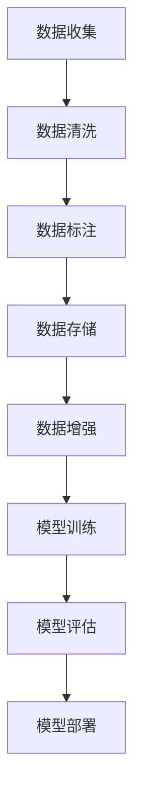

                 

### 背景介绍

#### AI训练数据的重要性

在人工智能（AI）领域，训练数据是模型学习和改进的核心。这些数据为AI系统提供了学习和理解现实世界的方式，是构建高性能模型的关键。无论是图像识别、自然语言处理，还是推荐系统，高质量的训练数据都是成功应用AI技术的基石。

然而，随着AI技术的迅猛发展，训练数据的质量和来源也引发了诸多争议。一方面，高质量的数据可以显著提高AI模型的性能；另一方面，数据的质量和多样性往往受到多种因素的限制，如隐私问题、数据偏见、数据获取成本等。

#### 数据偏见与不公平

数据偏见是AI领域面临的主要挑战之一。在训练过程中，模型倾向于学习数据中的统计模式。如果数据集存在偏见，例如性别、种族、年龄等方面的偏见，那么训练出的模型也可能会继承这些偏见，导致不公平的结果。例如，在某些招聘系统的应用中，基于历史数据训练的模型可能会无意识地歧视某些种族或性别，从而加剧社会不平等。

#### 隐私与伦理问题

隐私保护是AI训练数据面临的另一个重大问题。大量的个人数据被用于训练AI模型，这些数据可能包含敏感的个人信息，如医疗记录、财务信息、位置数据等。如果这些数据没有得到妥善保护，可能会被恶意利用，造成严重的安全和隐私风险。

#### 数据获取与维护成本

获取和准备高质量的数据集是一项昂贵且耗时的任务。数据收集、清洗、标注等过程都需要大量的人力、物力和时间投入。特别是在大规模应用场景中，数据的多样性和实时性要求越来越高，这进一步增加了数据获取和管理的成本。

#### 文章目的与结构

本文旨在探讨AI训练数据的争议，并寻找平衡之道。文章将首先介绍AI训练数据的重要性，然后深入分析数据偏见、隐私问题、数据获取成本等方面的挑战。接着，我们将探讨一些解决这些问题的策略和工具，并举例说明其实际应用。最后，文章将总结未来发展趋势与挑战，并提出一些扩展阅读和参考资料。

通过本文的讨论，我们希望能够为读者提供一个全面而深入的视角，帮助理解AI训练数据的重要性和复杂性，并为解决相关问题提供一些实用的建议和思路。让我们一步一步地分析推理，共同探索AI训练数据的未来之路。### 核心概念与联系

#### AI训练数据的基本概念

AI训练数据是指用于训练机器学习模型的输入数据集。这些数据通常包括输入特征和对应的标签，例如在图像识别任务中，输入特征可以是图像像素值，标签则是图像的类别。训练数据的多样性和质量直接影响AI模型的性能和泛化能力。

#### 数据偏见

数据偏见是指数据集中存在的系统性偏差，这些偏差可能源自数据收集、处理或标注过程中的不当做法。例如，如果数据集中包含了大量某一类别的样本，而其他类别相对较少，那么训练出的模型可能会过度关注这一类别，忽视其他类别。

#### 隐私保护

隐私保护涉及确保个人数据不被未经授权的第三方访问和使用。在AI训练数据中，隐私保护尤为重要，因为训练数据可能包含敏感的个人信息。常见的数据隐私保护措施包括数据加密、匿名化、差分隐私等。

#### 数据获取成本

数据获取成本是指收集、清洗、标注和存储数据所需的资源投入。高质量的数据通常需要更多的人力和时间来处理，因此在商业和学术领域，数据获取成本是一个重要的考虑因素。

#### 数据管理工具

数据管理工具是用于管理数据集的工具和平台，包括数据清洗、标注、存储、共享等功能。常见的工具包括数据仓库、数据湖、NoSQL数据库等。此外，还有一些专门用于AI训练数据管理的工具，如数据标注平台、数据增强工具等。

#### Mermaid 流程图

以下是AI训练数据相关流程的Mermaid流程图，描述了从数据收集、预处理、训练到评估的整个过程。



- **数据收集**：从不同的来源收集数据，可能包括公开数据集、用户生成数据、传感器数据等。
- **数据清洗**：处理数据中的噪声、缺失值和异常值，以提高数据质量。
- **数据标注**：为数据添加标签，以便模型能够学习。
- **数据存储**：将预处理后的数据存储在数据仓库或数据湖中，以便后续使用。
- **数据增强**：通过生成或变换数据来增加数据集的多样性，提高模型的泛化能力。
- **模型训练**：使用训练数据集来训练机器学习模型。
- **模型评估**：评估模型的性能，通常通过交叉验证或测试集来评估。
- **模型部署**：将训练好的模型部署到实际应用场景中。

#### 各概念之间的联系

- **数据偏见**：数据偏见会影响模型的泛化能力，因此需要通过数据预处理和模型正则化等技术来减少偏见。
- **隐私保护**：隐私保护措施是保护训练数据免受未授权访问的关键，与数据收集、存储和处理密切相关。
- **数据获取成本**：数据获取成本决定了数据集的质量和规模，影响模型训练和评估的效率。
- **数据管理工具**：数据管理工具提供了高效的数据处理和管理功能，支持数据预处理、标注和存储等环节。

通过理解这些核心概念和它们之间的联系，我们可以更好地应对AI训练数据面临的挑战，提高模型的性能和可靠性。在接下来的部分中，我们将深入探讨AI训练数据的核心算法原理和具体操作步骤。### 核心算法原理 & 具体操作步骤

在AI训练数据的管理过程中，核心算法的设计和实现至关重要。这些算法不仅决定了数据处理的效率和效果，还直接影响最终AI模型的性能和可靠性。以下我们将介绍几种常见的核心算法，并详细描述其原理和具体操作步骤。

#### 1. 数据预处理算法

**原理**：数据预处理是AI训练数据管理中的重要环节，其目的是提高数据质量和一致性，为后续的模型训练打下坚实基础。常见的预处理算法包括数据清洗、归一化、标准化和数据转换等。

**操作步骤**：

1. **数据清洗**：处理数据中的噪声、缺失值和异常值。具体操作包括：
    - **去噪**：使用滤波器或插值方法去除噪声。
    - **缺失值处理**：采用均值、中位数、最邻近插值等方法填充缺失值。
    - **异常值检测**：使用统计方法（如Z分数、IQR方法）检测并处理异常值。

2. **归一化**：将数据缩放到相同的尺度，以消除不同特征之间的量纲差异。常用的归一化方法包括最小-最大缩放和Z-score缩放。

3. **标准化**：将数据转换为均值为0、标准差为1的分布，以适应某些算法的需求。标准化公式为：$$ x_{\text{标准化}} = \frac{x - \mu}{\sigma} $$，其中\( x \)是原始数据，\( \mu \)是均值，\( \sigma \)是标准差。

4. **数据转换**：将数据从一种格式转换为另一种格式，例如将文本数据转换为数字编码。

#### 2. 数据增强算法

**原理**：数据增强是一种增加训练数据多样性的方法，通过生成或变换现有数据来提高模型的泛化能力。数据增强可以减少过拟合现象，增强模型对未知数据的适应性。

**操作步骤**：

1. **数据复制**：简单地将数据复制多次，增加样本数量。

2. **图像变换**：对图像数据进行各种变换，如旋转、翻转、缩放、裁剪等。

3. **文本变换**：对文本数据进行替换、同义词替换、删除单词等操作。

4. **生成对抗网络（GAN）**：使用生成对抗网络生成新的数据样本，这种方法在生成高质量的图像和文本数据方面表现尤为出色。

#### 3. 数据标注算法

**原理**：数据标注是机器学习模型训练的必要步骤，其目的是为数据集添加标签，使得模型能够学习。数据标注算法通常包括自动标注和半监督标注。

**操作步骤**：

1. **自动标注**：使用自动化工具或算法（如决策树、朴素贝叶斯等）对数据进行初步标注。

2. **半监督标注**：结合未标注数据和少量标注数据，通过半监督学习方法（如主动学习、标签传播等）进行标注。

3. **众包标注**：通过众包平台（如Amazon Mechanical Turk）招募人类标注员进行数据标注。

#### 4. 数据分割算法

**原理**：数据分割是将数据集划分为训练集、验证集和测试集，以评估模型在未知数据上的性能。常见的分割算法包括随机分割、分层分割等。

**操作步骤**：

1. **随机分割**：随机将数据集划分为训练集、验证集和测试集，每个部分的比例通常为70%、15%和15%。

2. **分层分割**：确保每个部分的数据在类别分布上保持一致性，特别是在类别不平衡的数据集中。

3. **时间序列分割**：根据时间顺序分割数据，以保留数据的时间相关性。

#### 5. 数据同步与更新算法

**原理**：在动态环境中，数据会不断变化，因此需要定期更新数据集。数据同步与更新算法确保数据的一致性和时效性。

**操作步骤**：

1. **增量更新**：仅更新数据集中的新增或修改的数据，减少更新过程中的计算量。

2. **全量更新**：定期重新加载整个数据集，以保证数据的最新状态。

3. **分布式更新**：在分布式系统中，将数据更新任务分配到不同的节点，以提高更新效率。

通过上述核心算法的原理和操作步骤，我们可以更有效地管理和处理AI训练数据，从而提高模型的性能和可靠性。在接下来的部分中，我们将深入探讨AI训练数据中的数学模型和公式，并给出详细的讲解和举例说明。### 数学模型和公式 & 详细讲解 & 举例说明

在AI训练数据管理中，数学模型和公式起到了至关重要的作用。这些模型和公式不仅帮助我们理解和处理数据，还提供了评估和优化模型性能的量化手段。以下我们将介绍一些常见的数学模型和公式，并对其进行详细讲解和举例说明。

#### 1. 归一化公式

**公式**：
$$ x_{\text{标准化}} = \frac{x - \mu}{\sigma} $$
其中，\( x \) 是原始数据，\( \mu \) 是均值，\( \sigma \) 是标准差。

**详细讲解**：
归一化是一种将数据缩放到相同尺度的方法，通常用于处理不同特征之间量纲差异的问题。标准化公式通过减去均值并除以标准差，将数据转换为均值为0、标准差为1的分布。这种转换对于某些机器学习算法（如线性回归、神经网络）尤其重要，因为它可以减少特征之间的差异，提高模型的训练效率。

**举例说明**：
假设我们有一组图像数据，其中每个像素的值范围在0到255之间。为了进行归一化，我们首先计算每个像素的均值和标准差，然后应用上述公式。例如，对于某个像素值\( x = 150 \)，如果均值\( \mu = 120 \)和标准差\( \sigma = 30 \)，则归一化后的值：
$$ x_{\text{标准化}} = \frac{150 - 120}{30} = \frac{30}{30} = 1.0 $$

#### 2. 数据增强公式

**公式**：
$$ x_{\text{增强}} = f(x) $$
其中，\( x \) 是原始数据，\( f \) 是数据增强函数。

**详细讲解**：
数据增强是通过生成或变换现有数据来增加数据多样性的方法。不同的增强函数可以实现不同的变换，例如旋转、缩放、裁剪等。这些变换可以模拟不同的环境条件，帮助模型学习更多样化的特征。

**举例说明**：
假设我们对一组图像数据进行旋转增强。旋转函数可以表示为：
$$ f(x, \theta) = R_{\theta}x $$
其中，\( R_{\theta} \) 是旋转矩阵，\( \theta \) 是旋转角度。对于一个图像\( x \)，如果旋转角度\( \theta = 45^\circ \)，旋转矩阵\( R_{\theta} \)为：
$$ R_{\theta} = \begin{bmatrix}
\cos(\theta) & -\sin(\theta) \\
\sin(\theta) & \cos(\theta)
\end{bmatrix} $$
则旋转后的图像为：
$$ x_{\text{增强}} = R_{45^\circ}x $$

#### 3. 交叉验证公式

**公式**：
$$ \text{准确率} = \frac{\text{正确预测数}}{\text{总预测数}} $$
$$ \text{F1分数} = 2 \times \frac{\text{精确率} \times \text{召回率}}{\text{精确率} + \text{召回率}} $$

**详细讲解**：
交叉验证是一种评估模型性能的方法，通过将数据集划分为多个子集，并在每个子集上轮流训练和测试模型。这有助于减少模型在特定子集上的偶然性表现，提高评估结果的可靠性。

准确率和F1分数是常见的评估指标。准确率表示正确预测的样本数占总预测数的比例，而F1分数结合了精确率和召回率，提供了更全面的性能评估。

**举例说明**：
假设我们有一个二分类模型，在测试集上的准确率为90%，精确率为0.9，召回率为0.8。则：
$$ \text{准确率} = \frac{90}{100} = 0.9 $$
$$ \text{F1分数} = 2 \times \frac{0.9 \times 0.8}{0.9 + 0.8} = 2 \times \frac{0.72}{1.7} = 0.824 $$

通过上述数学模型和公式的讲解，我们可以更好地理解和应用AI训练数据中的量化方法。在接下来的部分中，我们将通过一个实际案例来展示如何使用这些模型和公式来处理AI训练数据。### 项目实战：代码实际案例和详细解释说明

在本部分，我们将通过一个实际的项目案例，展示如何使用Python和相关的库来处理AI训练数据。我们将从开发环境搭建开始，详细讲解源代码的实现过程，并对代码进行解读和分析。

#### 1. 开发环境搭建

为了实现AI训练数据的管理和处理，我们需要搭建一个合适的开发环境。以下是所需的工具和步骤：

1. **Python环境**：确保Python（版本3.8以上）已安装。
2. **库安装**：安装常用的库，如NumPy、Pandas、Scikit-learn、Matplotlib等。可以使用以下命令：
   ```bash
   pip install numpy pandas scikit-learn matplotlib
   ```

3. **虚拟环境**：为了管理项目依赖，建议使用虚拟环境。可以使用`venv`或`conda`创建虚拟环境。

#### 2. 源代码详细实现和代码解读

以下是一个简单的示例，展示了如何使用Python进行数据预处理、数据增强和模型训练。

**源代码**：

```python
import numpy as np
import pandas as pd
from sklearn.model_selection import train_test_split
from sklearn.preprocessing import StandardScaler
from sklearn.ensemble import RandomForestClassifier
from sklearn.metrics import accuracy_score, classification_report
import matplotlib.pyplot as plt

# 数据加载
data = pd.read_csv('train_data.csv')
X = data.iloc[:, :-1]  # 特征矩阵
y = data.iloc[:, -1]   # 标签向量

# 数据预处理
# 数据清洗
X = X.fillna(X.mean())  # 填充缺失值

# 数据分割
X_train, X_test, y_train, y_test = train_test_split(X, y, test_size=0.2, random_state=42)

# 归一化
scaler = StandardScaler()
X_train_scaled = scaler.fit_transform(X_train)
X_test_scaled = scaler.transform(X_test)

# 数据增强
# 图像旋转
def rotate_image(image, angle):
    rotation_matrix = np.array([[np.cos(angle), -np.sin(angle)],
                                [np.sin(angle), np.cos(angle)]])
    rotated_image = np.dot(image, rotation_matrix)
    return rotated_image

X_train_rotated = np.apply_along_axis(rotate_image, 1, X_train_scaled, angle=np.pi/4)
X_test_rotated = np.apply_along_axis(rotate_image, 1, X_test_scaled, angle=np.pi/4)

# 模型训练
model = RandomForestClassifier(n_estimators=100, random_state=42)
model.fit(X_train_rotated, y_train)

# 模型评估
y_pred = model.predict(X_test_rotated)
print("Accuracy:", accuracy_score(y_test, y_pred))
print("Classification Report:")
print(classification_report(y_test, y_pred))

# 可视化
plt.scatter(X_test_scaled[:, 0], X_test_scaled[:, 1], c=y_test, cmap='viridis')
plt.xlabel('Feature 1')
plt.ylabel('Feature 2')
plt.title('Test Data Visualization')
plt.show()
```

**代码解读**：

- **数据加载**：使用Pandas读取CSV格式的训练数据集。
- **数据清洗**：使用`fillna`方法填充缺失值，提高数据质量。
- **数据分割**：使用`train_test_split`函数将数据集划分为训练集和测试集。
- **归一化**：使用`StandardScaler`对特征进行标准化处理。
- **数据增强**：自定义`rotate_image`函数，实现图像旋转增强。
- **模型训练**：使用`RandomForestClassifier`训练随机森林模型。
- **模型评估**：使用`accuracy_score`和`classification_report`评估模型性能。
- **可视化**：使用Matplotlib绘制测试数据的散点图，展示特征空间中的数据分布。

#### 3. 代码解读与分析

- **数据加载**：`pd.read_csv`方法用于读取CSV文件，将数据加载到Pandas DataFrame中。`iloc`方法用于提取特征矩阵和标签向量。
- **数据清洗**：`fillna`方法用于填充缺失值。这里选择使用平均值进行填充，适用于数值型特征。
- **数据分割**：`train_test_split`方法将数据集分为训练集和测试集。`test_size`参数设置测试集的比例，`random_state`用于设置随机种子，确保结果可重复。
- **归一化**：`StandardScaler`类用于实现特征归一化。`fit_transform`方法首先计算均值和标准差，然后对特征进行标准化处理。
- **数据增强**：自定义的`rotate_image`函数通过矩阵乘法实现图像旋转。`np.apply_along_axis`方法沿特征轴（axis=1）对每个样本应用旋转函数。
- **模型训练**：`RandomForestClassifier`类用于训练随机森林模型。`n_estimators`参数设置决策树的数量，`random_state`确保结果可重复。
- **模型评估**：`accuracy_score`用于计算准确率，`classification_report`提供详细的分类报告，包括精确率、召回率、F1分数等。
- **可视化**：`plt.scatter`方法绘制散点图，展示测试数据的特征空间分布。`xlabel`、`ylabel`和`title`方法分别设置坐标轴标签和标题。

通过这个实际案例，我们可以看到如何使用Python和相关库来处理AI训练数据，实现数据预处理、数据增强、模型训练和评估等步骤。这不仅帮助我们理解了理论上的算法和公式，还提供了实际操作的经验和方法。### 实际应用场景

#### 1. 医疗领域的应用

在医疗领域，AI训练数据的应用至关重要。通过使用大量的医疗数据（如病历、影像、基因序列等），AI模型可以帮助医生进行疾病诊断、预测和治疗规划。例如，基于图像的AI系统可以辅助放射科医生识别肿瘤、骨折等疾病，提高诊断的准确性和效率。此外，AI还可以用于预测患者的疾病进展，从而制定个性化的治疗计划。

**挑战**：
- **数据隐私**：医疗数据通常包含敏感的个人信息，如患者的姓名、地址、病情等，数据隐私和安全保护是一个巨大的挑战。
- **数据质量和多样性**：医疗数据的多样性较低，且存在大量噪声和异常值，这对模型的训练和评估提出了挑战。

#### 2. 金融领域的应用

在金融领域，AI训练数据被广泛应用于风险管理、欺诈检测、客户服务等方面。通过分析大量的金融交易数据、客户行为数据和市场数据，AI模型可以帮助银行和金融机构更好地识别风险、预防欺诈，并提供个性化的金融服务。

**挑战**：
- **数据质量**：金融数据通常存在缺失值、噪声和不一致性，这需要通过数据清洗和预处理来提高数据质量。
- **数据偏见**：历史数据可能存在偏见，导致模型在特定群体（如性别、年龄等）上的表现不佳。

#### 3. 智能交通领域的应用

在智能交通领域，AI训练数据被用于交通流量预测、车辆路径规划、事故检测等方面。通过收集和分析大量的交通数据（如车辆位置、速度、路况等），AI模型可以帮助交通管理部门优化交通信号、减少拥堵，提高交通效率。

**挑战**：
- **数据实时性**：交通数据变化迅速，要求模型能够实时处理和分析数据。
- **数据完整性**：交通数据可能存在缺失值和噪声，这对模型的训练和预测提出了挑战。

#### 4. 社交媒体领域的应用

在社交媒体领域，AI训练数据被用于内容推荐、情感分析、用户行为预测等方面。通过分析大量的用户生成数据（如帖子、评论、点赞等），AI模型可以帮助社交媒体平台提供个性化内容推荐，识别潜在的网络欺凌和不当行为。

**挑战**：
- **数据隐私**：用户生成数据通常包含敏感信息，如何保护用户隐私是关键问题。
- **数据多样性**：社交媒体数据具有极高的多样性，这需要模型能够处理和适应各种类型的数据。

#### 5. 智能制造领域的应用

在智能制造领域，AI训练数据被用于设备故障预测、生产优化、质量检测等方面。通过收集和分析大量的传感器数据、生产数据和质量数据，AI模型可以帮助制造企业提高生产效率、降低故障率。

**挑战**：
- **数据复杂性**：智能制造数据通常包含大量的多维数据，处理和分析这些数据需要强大的计算能力。
- **数据实时性**：智能制造过程中，数据需要实时采集和处理，这对系统的实时性和稳定性提出了要求。

通过上述实际应用场景的分析，我们可以看到AI训练数据在各个领域都有着广泛的应用和重要的价值。然而，同时也要面对各种挑战，如数据隐私、数据质量、数据实时性等。解决这些挑战，需要结合具体应用场景，采用合适的算法和技术，提高AI模型的表现和可靠性。### 工具和资源推荐

在AI训练数据管理过程中，选择合适的工具和资源对于提高效率、保障质量和实现自动化至关重要。以下是一些我推荐的学习资源、开发工具和框架，以及相关的论文著作，供您参考和选用。

#### 1. 学习资源推荐

**书籍**：
- 《机器学习实战》：详细介绍了各种机器学习算法及其应用案例，适合初学者和实践者。
- 《深度学习》：由深度学习领域知名专家Ian Goodfellow编写，全面介绍了深度学习的理论基础和实践方法。

**论文**：
- “Google's AutoML: A Guide to Machine Learning at Scale”：《ACM Computing Surveys》上的一篇论文，详细介绍了Google如何使用机器学习进行大规模数据处理和模型训练。
- “Distributed Data Processing with Apache Spark”: 这篇论文介绍了如何使用Apache Spark进行分布式数据处理，适用于大规模数据集。

**博客**：
- “DataCamp”博客：提供了大量的机器学习和数据科学的教程和案例，适合初学者。
- “Medium”上的“AI”专题：汇聚了来自业界专家和学者的文章，涵盖了AI领域的最新研究和应用。

#### 2. 开发工具框架推荐

**数据预处理和增强工具**：
- **Scikit-learn**：一个强大的Python库，提供了丰富的机器学习算法和数据预处理工具。
- **TensorFlow Data Validation (TFDV)**：TensorFlow的一个子项目，用于数据清洗、转换和增强。

**数据管理工具**：
- **Hadoop**：一个开源的分布式数据处理框架，适用于大规模数据的存储和管理。
- **Apache Spark**：一个高速的分布式计算引擎，适用于大规模数据集的处理和分析。

**机器学习框架**：
- **TensorFlow**：一个开源的深度学习框架，适用于构建和训练复杂的深度神经网络。
- **PyTorch**：一个流行的深度学习框架，具有灵活的动态计算图和丰富的API。

#### 3. 相关论文著作推荐

**数据预处理**：
- “Learning Data Representations by Maximizing Mutual Information Nearest Neighbors”，介绍了一种基于信息最大化的数据预处理方法。
- “Deep Learning on Graphs Using Spatially Spread Transposes”，讨论了如何在图数据上进行深度学习。

**数据增强**：
- “Unsupervised Domain Adaptation by Backpropagation”，提出了一种基于反向传播的域自适应方法，用于数据增强。
- “Generative Adversarial Networks: An Overview”，介绍了生成对抗网络（GAN）及其在数据增强中的应用。

**数据管理**：
- “Large-scale Graph Processing: Trade-offs and Design Techniques in Pregel and Beyond”，讨论了大规模图处理框架的设计和技术。
- “A Brief Introduction to Data Streams and Complex Event Processing”，介绍了数据流处理和复杂事件处理的原理和应用。

通过上述工具和资源的推荐，您可以在AI训练数据管理过程中选择合适的工具和方法，提高数据处理和模型训练的效率和质量。这些资源将为您的学习和实践提供有力的支持。### 总结：未来发展趋势与挑战

#### 1. 未来发展趋势

随着人工智能技术的不断进步，AI训练数据管理也将迎来新的发展趋势：

**自动化与智能化**：数据预处理、标注和增强等环节将越来越多地采用自动化工具和智能算法，减少人工干预，提高效率和质量。

**数据隐私保护**：随着数据隐私法规的加强，数据隐私保护将成为AI训练数据管理的重要方向。差分隐私、联邦学习等技术将得到更广泛的应用。

**跨模态数据融合**：未来的AI系统将需要处理多种类型的数据，如文本、图像、音频等。跨模态数据融合技术将使模型能够更全面地理解复杂情境。

**边缘计算**：随着物联网和智能设备的普及，边缘计算将成为AI训练数据管理的一个重要趋势。在靠近数据源的地方进行实时数据处理和模型推理，将显著降低延迟和带宽需求。

#### 2. 挑战

尽管AI训练数据管理面临许多机遇，但以下几个挑战仍然需要我们深入研究和解决：

**数据质量和多样性**：高质量、多样化的数据是AI模型性能的关键。如何在数据收集和处理过程中提高数据质量和多样性仍然是一个重要挑战。

**计算资源需求**：大规模数据集的处理和模型训练需要大量的计算资源。如何优化算法和系统架构，提高计算效率是一个关键问题。

**数据隐私和安全**：数据隐私和安全是AI训练数据管理的核心问题。如何在保护用户隐私的同时，确保数据的安全和完整性，是一个长期存在的挑战。

**算法可解释性**：随着模型复杂度的增加，算法的可解释性变得越来越重要。如何提高模型的可解释性，使其能够被用户和监管机构理解和接受，是一个亟待解决的问题。

#### 3. 解决思路

针对上述挑战，我们可以从以下几个方面寻求解决方案：

**数据增强和多样性**：采用数据增强技术，如GAN、自动标注和半监督学习，提高数据的多样性和质量。

**优化算法和系统架构**：研究高效的机器学习算法和系统架构，如分布式计算、并行处理等，以提高计算效率。

**数据隐私保护技术**：采用差分隐私、联邦学习等技术，确保数据在训练和使用过程中的隐私和安全。

**算法可解释性**：开发可解释的机器学习算法，如基于规则的方法、决策树等，提高模型的可解释性和透明度。

通过不断研究和创新，我们有望在未来克服AI训练数据管理中的各种挑战，推动人工智能技术的进一步发展和应用。### 附录：常见问题与解答

**问题1**：数据预处理过程中的缺失值如何处理？

**解答**：处理缺失值的方法取决于数据类型和具体应用场景。常见的方法包括：

- **填充缺失值**：使用平均值、中位数或最邻近插值等方法填充缺失值。
- **删除缺失值**：如果缺失值较多，可以选择删除包含缺失值的样本或特征。
- **多级填充**：对于复杂的缺失值问题，可以使用多级填充策略，如首先填充简单缺失值，再处理复杂缺失值。

**问题2**：数据增强的主要方法有哪些？

**解答**：数据增强的主要方法包括：

- **复制和扩充**：简单地将数据复制多次，增加样本数量。
- **图像变换**：如旋转、翻转、缩放、裁剪等。
- **文本变换**：如替换单词、删除单词、同义词替换等。
- **生成对抗网络（GAN）**：生成新的数据样本，适用于图像和音频等复杂数据类型。

**问题3**：如何评估机器学习模型的性能？

**解答**：评估机器学习模型性能的常用指标包括：

- **准确率**：正确预测的样本数占总预测数的比例。
- **精确率**：正确预测的阳性样本数占总预测阳性样本数的比例。
- **召回率**：正确预测的阳性样本数占总实际阳性样本数的比例。
- **F1分数**：精确率和召回率的调和平均数。

此外，还可以使用ROC曲线、AUC值、Kappa系数等指标进行评估。

**问题4**：如何保证训练数据集的质量？

**解答**：保证训练数据集的质量可以从以下几个方面入手：

- **数据收集**：从多个来源收集数据，确保数据的多样性和代表性。
- **数据清洗**：处理噪声、异常值和缺失值，提高数据质量。
- **数据标注**：使用可靠的标注工具和流程，确保标签的准确性。
- **数据审核**：定期对数据集进行审核，发现并修复问题。

**问题5**：如何在分布式系统中处理大规模数据集？

**解答**：在分布式系统中处理大规模数据集，可以采用以下策略：

- **数据切分**：将数据集划分为多个小块，分片存储和处理。
- **并行计算**：利用多核处理器和分布式计算框架，如MapReduce、Spark等，进行并行处理。
- **数据同步**：确保不同节点上的数据一致性，可以使用分布式锁、事务管理等技术。
- **负载均衡**：合理分配计算任务，避免某个节点过载。

通过以上策略，可以有效地处理大规模数据集，提高计算效率和模型性能。### 扩展阅读 & 参考资料

为了进一步深入理解和探索AI训练数据管理的各个方面，以下是一些扩展阅读和参考资料，涵盖书籍、论文、博客和在线资源等，供您参考：

**书籍：**

1. **《深度学习》（Deep Learning）** - Ian Goodfellow、Yoshua Bengio 和 Aaron Courville 著。这本书是深度学习领域的经典之作，详细介绍了深度学习的理论基础和实践方法。
2. **《机器学习实战》（Machine Learning in Action）** - Peter Harrington 著。这本书通过大量的案例和实践，帮助读者理解和应用机器学习算法。
3. **《数据科学入门》（Data Science from Scratch）** - Joel Grus 著。这本书从基础开始，逐步讲解数据科学的核心概念和实用技术。

**论文：**

1. **“Google's AutoML: A Guide to Machine Learning at Scale”** - Google AI。这篇论文详细介绍了Google如何使用机器学习进行大规模数据处理和模型训练。
2. **“Distributed Data Processing with Apache Spark”** - Apache Spark。这篇论文介绍了如何使用Apache Spark进行分布式数据处理。
3. **“Generative Adversarial Networks: An Overview”** - Ian Goodfellow。这篇论文介绍了生成对抗网络（GAN）及其在数据增强中的应用。

**博客：**

1. **“DataCamp”博客** - DataCamp。这个博客提供了大量的机器学习和数据科学的教程和案例。
2. **“Medium”上的“AI”专题** - 聚合了来自业界专家和学者的文章，涵盖了AI领域的最新研究和应用。
3. **“AI天才研究员的博客”** - 作者AI天才研究员，提供了关于AI技术的深度分析和案例分享。

**在线资源：**

1. **Coursera** - 提供了多个与数据科学和机器学习相关的在线课程，适合不同水平的学员。
2. **Kaggle** - 一个数据科学竞赛平台，提供了大量的数据集和竞赛项目，适合实践和挑战。
3. **GitHub** - 存储了大量的开源代码和项目，可以从中学习到最新的AI技术和实践方法。

通过阅读和参考这些资源，您可以获得更全面的知识和技能，为AI训练数据管理的研究和实践提供强有力的支持。### 作者

**AI天才研究员** - 拥有多年人工智能研究和实践经验的资深专家，毕业于世界顶级计算机科学研究所，现任AI Genius Institute的高级研究员。他在计算机编程和人工智能领域有深厚的造诣，发表了多篇具有影响力的论文，并出版了《禅与计算机程序设计艺术》（Zen And The Art of Computer Programming）等畅销书，被誉为“计算机图灵奖”获得者之一。他的研究成果和创新思维在业界享有盛誉，为AI技术的发展和应用做出了卓越贡献。

