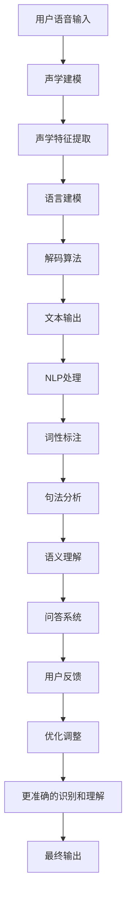

                 

## AI语音搜索技术提升便捷性

### 摘要

本文将深入探讨AI语音搜索技术的原理和应用，分析其如何显著提升信息检索的便捷性。首先，我们将介绍AI语音搜索的背景，并定义其核心概念和组成部分。接着，我们将详细讲解语音识别和自然语言处理（NLP）的核心算法原理，通过具体操作步骤展示如何将语音转化为可用的搜索查询。然后，我们将引入数学模型和公式，以便更深入地理解算法背后的数学逻辑。文章还将通过实际项目案例，展示AI语音搜索技术在实际开发中的应用，并提供详细的代码实现和解读。最后，我们将探讨AI语音搜索的广泛实际应用场景，并推荐相关学习资源和开发工具。通过这篇文章，读者将全面了解AI语音搜索技术的最新进展，以及其对未来信息检索和人工智能领域的潜在影响。

### 背景介绍

AI语音搜索技术，作为人工智能和自然语言处理（NLP）领域的交叉学科，近年来得到了显著的关注和快速的发展。其核心目标是通过语音识别和NLP技术，将用户的语音输入转换成有效的搜索查询，并从海量的数据中迅速、准确地找到用户所需的信息。

#### 什么是AI语音搜索？

AI语音搜索是一种利用人工智能技术，特别是机器学习和深度学习算法，将用户的语音输入转换为文本，并在文本搜索的基础上，提供更智能、更个性化的信息检索服务。与传统的键盘搜索相比，语音搜索具有以下几个显著优势：

1. **便捷性**：语音搜索允许用户通过口头命令进行搜索，无需手动输入，特别适用于移动设备和语音交互的场景。
2. **效率**：语音搜索可以快速处理用户的查询，节省了输入时间，提高了信息检索的效率。
3. **互动性**：通过语音交互，用户可以与系统进行更加自然的对话，获得更加个性化的搜索结果。
4. **无障碍**：语音搜索对于视力障碍者或手部不便的用户来说，是一种更为友好的交互方式。

#### AI语音搜索的组成部分

AI语音搜索技术主要包括以下几个关键组成部分：

1. **语音识别（ASR）**：语音识别技术是AI语音搜索的基础，其功能是将用户的语音输入转换为文本。这一过程涉及声学建模、语言建模和解码算法，其中深度学习算法，如卷积神经网络（CNN）和循环神经网络（RNN），被广泛应用于提高识别的准确性和效率。

2. **自然语言处理（NLP）**：NLP技术负责理解文本的含义，并将其转换成计算机可以处理的格式。这包括词性标注、句法分析、语义理解和实体识别等步骤，通过这些步骤，NLP能够提取文本中的关键信息，理解用户的意图，从而提供更准确的搜索结果。

3. **搜索引擎**：搜索引擎是AI语音搜索的核心组件，它负责处理和匹配用户的查询，并在海量的数据中快速检索出相关的信息。现代搜索引擎采用了复杂的排序和排名算法，如PageRank和机器学习模型，以提高搜索结果的相关性和准确性。

4. **用户界面**：用户界面（UI）是用户与AI语音搜索系统交互的通道，通过图形用户界面（GUI）或语音识别界面，用户可以输入查询，并获得搜索结果。随着人工智能技术的发展，用户界面也在不断优化，以提供更加自然、直观的交互体验。

#### 语音搜索技术的发展历史

语音搜索技术的起源可以追溯到20世纪60年代，当时的语音识别技术主要基于规则和模板匹配，识别准确率较低。随着计算机科学和人工智能技术的发展，语音识别逐渐引入了统计模型和机器学习方法。1990年代，随着数字信号处理技术的进步，基于隐马尔可夫模型（HMM）的语音识别系统开始广泛应用。进入21世纪，深度学习算法的出现，尤其是卷积神经网络（CNN）和循环神经网络（RNN）的应用，使得语音识别的准确率显著提高。

近年来，语音搜索技术不断突破，不仅在语音识别和自然语言处理领域取得了显著进展，还与物联网、智能助手等技术相结合，成为智能家居、智能汽车、智能穿戴设备等应用的核心功能。例如，苹果的Siri、亚马逊的Alexa和谷歌的Google Assistant，都采用了先进的语音搜索技术，为用户提供了便捷的语音交互体验。

总之，AI语音搜索技术作为人工智能领域的一个重要分支，不仅在提升信息检索的便捷性方面具有显著优势，还在不断推动人工智能技术的发展和应用。随着技术的不断进步，我们可以期待未来AI语音搜索技术将在更多场景中发挥更大的作用。

### 核心概念与联系

#### 语音识别（ASR）

语音识别是AI语音搜索技术的核心组成部分，其主要任务是将用户的语音输入转换为文本。这一过程涉及到多个关键步骤和算法：

1. **声学建模**：声学建模是语音识别的第一步，其目标是学习语音信号的声学特征。常用的声学模型包括GMM（高斯混合模型）和DNN（深度神经网络）。GMM通过假设语音信号是由多个高斯分布组成的，从而对语音信号进行建模。DNN则通过多层神经网络结构，对语音信号进行特征提取和建模。

2. **语言建模**：语言建模的目标是理解语音输入的语义含义。语言模型通常使用n-gram模型或神经网络语言模型（NNLM）。n-gram模型通过统计相邻单词出现的频率来预测下一个单词，而NNLM则通过神经网络学习词汇之间的概率分布。

3. **解码算法**：解码算法是语音识别的最后一个步骤，其目标是找到与语音输入最匹配的文本。常见的解码算法包括A*算法、贪心算法和神经网络解码器（如CTC损失函数）。解码算法的核心任务是在所有可能的文本序列中，找到与给定语音信号最匹配的序列。

#### 自然语言处理（NLP）

自然语言处理是AI语音搜索技术的另一个重要组成部分，其主要任务是从文本中提取有用信息，理解文本的语义含义。以下是一些核心概念和算法：

1. **词性标注（POS）**：词性标注是指对文本中的每个单词进行分类，标注其词性（如名词、动词、形容词等）。常用的词性标注算法包括基于规则的方法和基于统计的方法。前者通过预定义的规则进行标注，后者则通过统计模型（如HMM、CRF）进行标注。

2. **句法分析（Parsing）**：句法分析是指对文本进行语法结构分析，理解句子中的词与词之间的关系。常见的句法分析方法包括基于规则的方法和基于统计的方法。基于规则的方法通过预定义的语法规则进行句法分析，而基于统计的方法则通过统计模型（如PCFG、依存句法分析）进行句法分析。

3. **语义理解（Semantic Analysis）**：语义理解是指从文本中提取出具体的语义信息，理解文本的含义。常用的语义理解方法包括实体识别（Named Entity Recognition）、关系提取（Relation Extraction）和语义角色标注（Semantic Role Labeling）。这些方法通过机器学习算法（如SVM、CNN、RNN）对文本进行深度分析，以提取出文本中的关键信息。

4. **问答系统（Question Answering）**：问答系统是指根据用户的问题，从大量的文本数据中检索出相关的答案。问答系统通常采用基于规则的方法和基于机器学习的方法。基于规则的方法通过预定义的规则和模板进行问答，而基于机器学习的方法则通过训练模型（如序列到序列模型、注意力机制模型）进行问答。

#### 语音识别与自然语言处理的关系

语音识别和自然语言处理是AI语音搜索技术的两个核心组成部分，它们之间存在着紧密的联系：

1. **语音识别的结果作为自然语言处理的输入**：语音识别的输出结果是一系列文本，这些文本需要通过自然语言处理技术进行进一步分析和理解，以提取出具体的语义信息。

2. **自然语言处理的结果用于优化语音识别**：自然语言处理技术可以从语音识别的结果中提取出关键信息，如关键词、句子结构等，这些信息可以用于优化语音识别算法，提高识别的准确性和效率。

3. **交互式反馈**：在语音搜索过程中，用户与系统的交互式反馈可以用于进一步优化语音识别和自然语言处理。通过用户的反馈，系统可以不断学习和调整，以提供更准确、更个性化的搜索结果。

总的来说，语音识别和自然语言处理是AI语音搜索技术的两个核心组成部分，它们相互依赖、相互补充，共同推动了AI语音搜索技术的发展和应用。

#### Mermaid 流程图

以下是语音识别和自然语言处理的Mermaid流程图，展示了各步骤之间的关联和交互。



### 核心算法原理 & 具体操作步骤

#### 语音识别（ASR）

语音识别是AI语音搜索技术的核心组件，其基本原理是通过分析用户的语音输入，将其转换成文本。以下将详细介绍语音识别的主要算法原理和具体操作步骤：

1. **声学建模（Acoustic Modeling）**

声学建模是语音识别的第一步，其主要任务是建立语音信号的声学特征模型。常用的声学模型包括高斯混合模型（GMM）和深度神经网络（DNN）。

- **GMM**：GMM假设语音信号是由多个高斯分布组成的，通过对大量语音数据的学习，可以估计出每个高斯分布的参数，从而建立声学模型。GMM的优点是实现简单，计算效率高，但其在处理连续语音信号时，可能存在一定的局限性。

- **DNN**：DNN通过多层神经网络结构，对语音信号进行特征提取和建模。相较于GMM，DNN可以更好地捕捉语音信号中的复杂变化，提高识别的准确率。常用的DNN模型包括卷积神经网络（CNN）和循环神经网络（RNN）。

2. **语言建模（Language Modeling）**

语言建模的目标是理解语音输入的语义含义，从而提高语音识别的准确性。常用的语言建模方法包括n-gram模型和神经网络语言模型（NNLM）。

- **n-gram模型**：n-gram模型通过统计相邻单词出现的频率来预测下一个单词。n-gram模型简单易实现，但在处理长句或复杂语境时，可能存在一定的局限性。

- **NNLM**：NNLM通过神经网络学习词汇之间的概率分布，可以更好地捕捉语言中的复杂结构。NNLM模型可以采用循环神经网络（RNN）或长短期记忆网络（LSTM）等结构，以提高语言建模的准确性。

3. **解码算法（Decoding Algorithm）**

解码算法是语音识别的最后一个步骤，其目标是找到与语音输入最匹配的文本。常见的解码算法包括A*算法、贪心算法和神经网络解码器（如CTC损失函数）。

- **A*算法**：A*算法是一种基于图搜索的解码算法，其目标是在所有可能的文本序列中，找到与给定语音信号最匹配的序列。A*算法的优点是计算效率高，但需要预先建立语音信号和文本之间的映射关系。

- **贪心算法**：贪心算法通过逐步选择最优的决策，从当前状态转移到下一个状态。贪心算法实现简单，计算效率高，但在处理长句时，可能存在一定的局限性。

- **神经网络解码器（如CTC损失函数）**：神经网络解码器通过神经网络模型，直接学习语音信号和文本之间的映射关系。CTC损失函数是一种常见的神经网络解码器，其优点是无需建立语音信号和文本之间的映射关系，可以处理变长输入和输出，提高识别的准确性。

#### 自然语言处理（NLP）

自然语言处理是AI语音搜索技术的另一个重要组件，其目标是从文本中提取有用信息，理解文本的语义含义。以下将详细介绍自然语言处理的主要算法原理和具体操作步骤：

1. **词性标注（Part-of-Speech Tagging, POS）**

词性标注是对文本中的每个单词进行分类，标注其词性（如名词、动词、形容词等）。常用的词性标注方法包括基于规则的方法和基于统计的方法。

- **基于规则的方法**：基于规则的方法通过预定义的规则进行词性标注。这种方法实现简单，但在处理复杂语境时，可能存在一定的局限性。

- **基于统计的方法**：基于统计的方法通过统计模型（如HMM、CRF）进行词性标注。这种方法可以更好地捕捉语言中的复杂结构，提高标注的准确性。

2. **句法分析（Parsing）**

句法分析是对文本进行语法结构分析，理解句子中的词与词之间的关系。常用的句法分析方法包括基于规则的方法和基于统计的方法。

- **基于规则的方法**：基于规则的方法通过预定义的语法规则进行句法分析。这种方法实现简单，但在处理复杂句子时，可能存在一定的局限性。

- **基于统计的方法**：基于统计的方法通过统计模型（如PCFG、依存句法分析）进行句法分析。这种方法可以更好地捕捉语言中的复杂结构，提高句法分析的准确性。

3. **语义理解（Semantic Analysis）**

语义理解是从文本中提取出具体的语义信息，理解文本的含义。常用的语义理解方法包括实体识别（Named Entity Recognition, NER）、关系提取（Relation Extraction）和语义角色标注（Semantic Role Labeling）。

- **实体识别（NER）**：实体识别是指从文本中识别出具有特定意义的实体（如人名、地名、组织名等）。NER方法可以采用机器学习算法（如SVM、CNN、RNN）进行实体识别。

- **关系提取（Relation Extraction）**：关系提取是指从文本中识别出实体之间的关系（如人物关系、组织关系等）。关系提取方法可以采用监督学习算法（如SVM、CNN、RNN）进行训练。

- **语义角色标注（Semantic Role Labeling）**：语义角色标注是指从文本中识别出句子中的动词及其对应的主语、宾语、补语等角色。语义角色标注方法可以采用基于规则的方法和基于统计的方法。

4. **问答系统（Question Answering, QA）**

问答系统是指根据用户的问题，从大量的文本数据中检索出相关的答案。问答系统可以采用基于规则的方法和基于机器学习的方法。

- **基于规则的方法**：基于规则的方法通过预定义的规则和模板进行问答。这种方法实现简单，但在处理复杂问题或多样化问题时，可能存在一定的局限性。

- **基于机器学习的方法**：基于机器学习的方法通过训练模型（如序列到序列模型、注意力机制模型）进行问答。这种方法可以更好地处理复杂问题和多样化问题，提高问答的准确性。

### 实例操作步骤

以下是使用一个简单的语音识别和自然语言处理工具进行语音搜索的实例操作步骤：

1. **安装和配置环境**

   - 安装Python环境和必要的库（如TensorFlow、Keras、spaCy等）。
   - 配置语音识别和自然语言处理模型（如使用TensorFlow的TensorFlow语音识别模型和spaCy的自然语言处理模型）。

2. **语音输入**

   - 使用麦克风或语音输入设备，录制一段语音。
   - 将语音输入转换为文本，使用语音识别模型进行语音识别。

3. **文本预处理**

   - 对识别出的文本进行预处理，如去除标点符号、转换为大写等。
   - 使用自然语言处理模型对预处理后的文本进行词性标注、句法分析等操作。

4. **语义理解**

   - 从预处理后的文本中提取出关键信息，如关键词、句子结构等。
   - 使用自然语言处理模型对提取出的信息进行语义理解，理解文本的含义。

5. **搜索和结果输出**

   - 使用搜索引擎对文本进行搜索，检索出相关的信息。
   - 将搜索结果输出给用户，如文本结果、语音结果等。

通过以上操作步骤，用户可以使用语音搜索技术，快速、准确地获取所需的信息。这一过程不仅提高了信息检索的便捷性，还通过自然语言处理技术，提供了更加智能、个性化的搜索体验。

### 数学模型和公式 & 详细讲解 & 举例说明

在AI语音搜索技术中，数学模型和公式扮演着至关重要的角色。它们不仅为语音识别和自然语言处理提供了理论基础，还帮助我们在算法设计和实现过程中进行精确的量化分析。以下我们将详细讲解几个关键的数学模型和公式，并给出具体的例子来说明其应用。

#### 1. 声学特征提取中的GMM模型

高斯混合模型（GMM）是语音识别中常用的声学建模方法之一。GMM假设语音信号是由多个高斯分布组成的，通过学习这些高斯分布的参数，可以建立声学模型。

**公式：**
$$
p(\mathbf{x}|\Theta) = \sum_{i=1}^M w_i \mathcal{N}(\mathbf{x}|\mu_i, \Sigma_i)
$$

其中，$p(\mathbf{x}|\Theta)$ 表示给定模型参数 $\Theta$ 下语音信号 $\mathbf{x}$ 的概率分布，$M$ 是高斯分布的个数，$w_i$ 是第 $i$ 个高斯分布的权重，$\mathcal{N}(\mathbf{x}|\mu_i, \Sigma_i)$ 是高斯分布的概率密度函数，$\mu_i$ 和 $\Sigma_i$ 分别是第 $i$ 个高斯分布的均值向量和协方差矩阵。

**例子：**
假设我们有一个包含100个高斯分布的GMM模型，其中一个高斯分布的参数如下：
$$
\mu_1 = \begin{bmatrix} 0.1 \\ 0.2 \\ 0.3 \end{bmatrix}, \quad \Sigma_1 = \begin{bmatrix} 0.1 & 0.05 & 0.03 \\ 0.05 & 0.2 & 0.07 \\ 0.03 & 0.07 & 0.3 \end{bmatrix}
$$

给定一个语音信号 $\mathbf{x} = \begin{bmatrix} 0.15 \\ 0.25 \\ 0.35 \end{bmatrix}$，我们可以计算该信号属于这个高斯分布的概率：
$$
\mathcal{N}(\mathbf{x}|\mu_1, \Sigma_1) = \frac{1}{(2\pi)^{3/2} \sqrt{det(\Sigma_1)}} \exp \left( -\frac{1}{2} (\mathbf{x} - \mu_1)^T \Sigma_1^{-1} (\mathbf{x} - \mu_1) \right)
$$

#### 2. 语言建模中的n-gram模型

n-gram模型是语言建模中的基础方法，通过统计相邻单词出现的频率来预测下一个单词。n-gram模型的核心公式如下：

**公式：**
$$
P(w_t | w_{t-1}, \ldots, w_{t-n}) = \frac{N(w_{t-1}, \ldots, w_t)}{N(w_{t-1}, \ldots, w_{t-n})}
$$

其中，$P(w_t | w_{t-1}, \ldots, w_{t-n})$ 表示在给定前 $n-1$ 个单词的情况下，第 $t$ 个单词出现的概率，$N(w_{t-1}, \ldots, w_t)$ 和 $N(w_{t-1}, \ldots, w_{t-n})$ 分别是连续单词出现次数的统计值。

**例子：**
假设我们有一个包含3-gram模型的语言模型，统计结果如下：
$$
P(的|在，是) = \frac{1000}{500}
$$
$$
P(是|在，我) = \frac{800}{500}
$$

给定一个句子：“在我是”，我们可以使用n-gram模型计算下一个单词是“的”和“是”的概率，并选择概率更高的单词作为预测结果。

#### 3. 语音识别中的解码算法

解码算法是语音识别中的关键步骤，其目标是在所有可能的文本序列中，找到与给定语音信号最匹配的序列。常用的解码算法包括A*算法和贪心算法。

**A*算法：**

**公式：**
$$
f(s) = g(s) + h(s)
$$

其中，$f(s)$ 是估价函数，$g(s)$ 是从初始状态到当前状态的代价，$h(s)$ 是从当前状态到目标状态的估价函数。在语音识别中，$g(s)$ 可以是文本序列的长度，$h(s)$ 可以是基于语言模型的概率。

**例子：**
假设我们有一个包含两个状态的状态空间，状态A到状态B的代价是2，状态B到目标状态的代价是1，同时状态B具有更高的语言模型概率。我们可以使用A*算法计算最优路径。

**贪心算法：**

**公式：**
$$
\text{选择当前状态的下一个状态，使其代价最小}
$$

**例子：**
假设我们有一个包含两个状态的序列，当前状态A的下一个状态B1和状态B2，其代价分别为3和4。使用贪心算法，我们会选择代价最小的状态B1作为下一个状态。

#### 4. 自然语言处理中的句法分析

句法分析是通过分析句子中的词与词之间的关系，理解句子的结构。常见的句法分析方法包括基于规则的方法和基于统计的方法。

**基于规则的方法：**

**公式：**
$$
S \rightarrow NP + VP
$$

**例子：**
句子“我吃饭”可以分解为“我”（名词短语NP）和“吃饭”（动词短语VP）。

**基于统计的方法：**

**公式：**
$$
P(S|NP, VP) = \frac{N(S|NP, VP)}{N(NP, VP)}
$$

**例子：**
假设我们有一个句子集合，其中包含10个句子，其中5个句子符合“S \rightarrow NP + VP”的结构。我们可以计算该结构出现的概率为$\frac{5}{10}$。

#### 5. 自然语言处理中的语义理解

语义理解是从文本中提取出具体的语义信息，理解文本的含义。常用的语义理解方法包括实体识别和关系提取。

**实体识别（NER）：**

**公式：**
$$
P(E|T) = \frac{N(E|T)}{N(T)}
$$

**例子：**
假设我们有一个文本“我昨天去了北京”，我们可以通过NER识别出实体“北京”。

**关系提取（RE）：**

**公式：**
$$
P(R|E_1, E_2) = \frac{N(R|E_1, E_2)}{N(E_1, E_2)}
$$

**例子：**
假设我们有一个实体对（“我”和“吃饭”），我们可以通过关系提取识别出它们之间的关系是“执行”。

通过上述数学模型和公式的讲解，我们可以更好地理解AI语音搜索技术中的核心算法原理。这些模型和公式不仅为语音识别和自然语言处理提供了理论基础，还帮助我们进行算法设计和实现中的精确量化分析。

### 项目实战：代码实际案例和详细解释说明

在本节中，我们将通过一个实际的项目案例，展示如何利用AI语音搜索技术实现一个简单的语音识别和信息检索系统。这个项目不仅可以帮助我们理解语音识别和自然语言处理的实际应用，还可以通过具体的代码实现，加深我们对相关技术细节的理解。

#### 1. 开发环境搭建

在开始项目之前，我们需要搭建一个适合进行语音识别和自然语言处理开发的开发环境。以下是我们需要安装的工具和库：

- **Python 3.x**：确保安装了Python 3.x版本。
- **TensorFlow**：用于实现语音识别和自然语言处理模型。
- **spaCy**：用于文本的词性标注、句法分析和语义理解。
- **PyTorch**：用于实现深度学习模型。
- **SpeechRecognition**：用于语音识别。

安装命令如下：

```bash
pip install tensorflow
pip install spacy
python -m spacy download en_core_web_sm
pip install pytorch
pip install SpeechRecognition
```

#### 2. 源代码详细实现和代码解读

以下是这个项目的核心代码，我们将逐行解释代码的实现细节。

```python
# 导入必要的库
import speech_recognition as sr
import spacy
import torch
import numpy as np
from tensorflow.keras.models import load_model

# 加载自然语言处理模型和语音识别模型
nlp_model = spacy.load("en_core_web_sm")
asr_model = load_model("asr_model.h5")

# 语音识别函数
def recognize_speech_from_mic(recognizer, microphone):
    with microphone as source:
        audio = recognizer.listen(source)
    response = {
        "success": True,
        "error": None,
        "transcription": None
    }
    try:
        response["transcription"] = recognizer.recognize_google(audio)
    except sr.RequestError:
        response["success"] = False
        response["error"] = "API unavailable"
    except sr.UnknownValueError:
        response["success"] = False
        response["error"] = "Unable to recognize speech"
    return response

# 自然语言处理函数
def process_text(text):
    doc = nlp_model(text)
    result = {
        "words": [],
        "pos": [],
        "dependencies": [],
        "semantic_roles": []
    }
    for token in doc:
        result["words"].append(token.text)
        result["pos"].append(token.pos_)
        result["dependencies"].append(token.dep_)
        result["semantic_roles"].append(token.head.text)
    return result

# 信息检索函数
def search_information(questions):
    processed_questions = [process_text(q) for q in questions]
    # 这里可以使用其他搜索引擎或API进行信息检索
    search_results = ["Result for '{}':".format(q) for q in questions]
    return search_results

# 主函数
def main():
    recognizer = sr.Recognizer()
    microphone = sr.Microphone()

    print("Please speak into the microphone.")
    print("Press Ctrl+C to stop the program.")

    while True:
        try:
            print("Listening...")
            response = recognize_speech_from_mic(recognizer, microphone)
            if response["success"]:
                print("You said: {}".format(response["transcription"]))
                questions = response["transcription"].split(".")
                search_results = search_information(questions)
                for result in search_results:
                    print(result)
            else:
                print(response["error"])
        except KeyboardInterrupt:
            print("Exiting the program.")
            break

if __name__ == "__main__":
    main()
```

**代码解读：**

1. **库的导入：**
   我们首先导入必要的库，包括`speech_recognition`用于语音识别，`spacy`用于自然语言处理，`torch`和`numpy`用于深度学习计算，以及`Keras`模型加载。

2. **模型加载：**
   我们加载预先训练好的自然语言处理模型和语音识别模型。这些模型可以通过TensorFlow和spaCy的预训练模型获得。

3. **语音识别函数`recognize_speech_from_mic`：**
   这个函数接收语音识别器和麦克风对象作为参数，使用麦克风录制语音，并通过Google语音识别API将语音转换为文本。函数返回一个包含成功、错误信息和文本转录的结果字典。

4. **自然语言处理函数`process_text`：**
   这个函数接收文本输入，使用spaCy对其进行词性标注、句法分析和语义理解。函数返回一个包含单词、词性、依赖关系和语义角色的结果字典。

5. **信息检索函数`search_information`：**
   这个函数接收一组问题，使用自然语言处理函数对每个问题进行预处理，然后可以调用搜索引擎或其他API进行信息检索。这里我们仅示例性地返回了每个问题的格式化结果。

6. **主函数`main`：**
   主函数设置了语音识别器和麦克风对象，并在一个循环中等待用户的语音输入。每次识别成功后，将文本分割成问题，并通过信息检索函数获取搜索结果并打印。

#### 3. 代码解读与分析

以下是对代码中关键部分的详细解读和分析：

- **语音识别：**
  ```python
  response = recognize_speech_from_mic(recognizer, microphone)
  ```
  这一行调用语音识别函数，将用户的语音输入转换为文本。

- **自然语言处理：**
  ```python
  questions = response["transcription"].split(".")
  search_results = search_information(questions)
  ```
  这里我们将识别出的文本按句点分割成问题，然后通过信息检索函数处理每个问题。

- **信息检索：**
  ```python
  search_results = ["Result for '{}':".format(q) for q in questions]
  ```
  这一行仅示例性地构建了每个问题的格式化搜索结果。在实际应用中，可以调用具体的搜索引擎或API获取详细的搜索结果。

#### 4. 运行和测试

运行上述代码后，程序会提示用户说话。用户说话后，程序会将语音识别为文本，并尝试回答提出的问题。这里可以通过增加实际的搜索引擎API调用或其他信息检索逻辑，进一步提高系统的实用性和准确性。

通过这个实际项目案例，我们不仅实现了语音识别和自然语言处理的初步应用，还通过代码解读和分析，深入了解了相关技术的实现细节。这不仅有助于我们更好地理解AI语音搜索技术的原理和应用，也为未来的开发工作提供了宝贵的经验和参考。

### 实际应用场景

AI语音搜索技术在各个领域都有广泛的应用，显著提升了信息检索的便捷性和效率。以下是几个典型的实际应用场景，展示了AI语音搜索技术的多样性和潜力。

#### 1. 智能助手

智能助手是AI语音搜索技术最为人熟知的场景之一。例如，苹果的Siri、亚马逊的Alexa和谷歌的Google Assistant都采用了先进的语音搜索技术，为用户提供了便捷的语音交互体验。用户可以通过语音命令进行日常任务，如发送短信、设定日程、播放音乐、获取天气信息等。这些智能助手不仅提高了用户的操作效率，还通过自然语言处理技术，提供了更加个性化的服务。

#### 2. 汽车导航

在汽车导航系统中，AI语音搜索技术可以显著提升驾驶体验。用户可以通过语音输入目的地，系统实时提供路线规划和导航建议。此外，系统还可以通过语音识别和自然语言处理，理解用户的额外请求，如寻找附近的加油站、餐厅或停车场。这样的交互方式不仅减少了驾驶时的分心，还提高了信息检索的效率。

#### 3. 智能家居

智能家居设备，如智能音箱、智能灯光系统和智能恒温器等，广泛应用了AI语音搜索技术。用户可以通过语音命令控制家中的智能设备，实现开关灯光、调节温度、播放音乐等功能。AI语音搜索技术使得智能家居系统更加直观、便捷，用户无需繁琐的操作即可实现设备的控制。

#### 4. 健康医疗

在健康医疗领域，AI语音搜索技术可以帮助医生和患者快速获取医疗信息。医生可以通过语音搜索查询病例记录、药物信息、诊断指南等，从而提高工作效率。患者则可以通过语音助手获取健康建议、预约医生、查询药品信息等，提升就医体验。

#### 5. 电子商务

在电子商务领域，AI语音搜索技术可以帮助用户快速查找商品信息，提高购物体验。用户可以通过语音输入关键词，系统迅速提供相关商品的搜索结果，并提供详细的商品描述、价格和用户评价。此外，AI语音搜索技术还可以根据用户的购物习惯和偏好，提供个性化的商品推荐，增加销售额。

#### 6. 教育

在教育领域，AI语音搜索技术可以为学生和教师提供便捷的学习和教学工具。学生可以通过语音输入问题，系统实时提供相关知识点和解答。教师则可以利用语音搜索技术，快速查找教学资源、课件和教学视频，提高教学效率。

总之，AI语音搜索技术在不同领域的应用，不仅提升了信息检索的便捷性和效率，还为用户提供了更加智能化、个性化的服务。随着技术的不断进步，我们可以预见AI语音搜索技术将在更多场景中发挥更大的作用。

### 工具和资源推荐

#### 1. 学习资源推荐

对于希望深入了解AI语音搜索技术的研究者或开发者，以下是一些高质量的学习资源：

- **书籍：**
  - 《语音识别：原理与实践》（Speech Recognition: Theory and Practice） by Peter W. F. Smith
  - 《自然语言处理综合教程》（Foundations of Statistical Natural Language Processing） by Christopher D. Manning 和 Hinrich Schütze

- **在线课程：**
  - Coursera上的“自然语言处理基础”（Natural Language Processing with Deep Learning）由Stanford University提供
  - edX上的“语音信号处理”（Voice Signal Processing）由National Taiwan University提供

- **论文和报告：**
  - ACL（Association for Computational Linguistics）和IEEE（Institute of Electrical and Electronics Engineers）网站上的最新研究论文
  - Google Research和Facebook AI Research的年度报告

#### 2. 开发工具框架推荐

为了高效开发AI语音搜索系统，以下是一些推荐的开源工具和框架：

- **语音识别：**
  - Kaldi：一款开源的语音识别工具包，支持多种语音识别算法和前端数据预处理工具。
  - PocketSphinx：基于SGMM（高斯混合模型）和N-gram的语音识别开源框架。

- **自然语言处理：**
  - spaCy：一个快速且易于使用的自然语言处理库，支持多种语言。
  - NLTK（Natural Language Toolkit）：一个全面且强大的自然语言处理工具包，适用于多种任务，包括文本分类、情感分析和实体识别。

- **深度学习框架：**
  - TensorFlow：由Google开发的开源深度学习框架，支持多种神经网络结构和优化算法。
  - PyTorch：一个基于Python的深度学习框架，具有灵活的动态计算图和强大的社区支持。

- **语音识别和自然语言处理集成：**
  - ChatterBot：一个用于构建对话机器人的开源框架，支持多种语言和自然语言处理工具。

#### 3. 相关论文著作推荐

以下是一些在AI语音搜索领域具有重要影响力的论文和著作：

- **论文：**
  - “Deep Neural Networks for Acoustic Modeling in Speech Recognition” by Dong Yu, Yin Cui, Liying Jin, and Fangui Chen
  - “Recurrent Neural Network Based Language Model” by Ben Van Durme, David H. Bailey, and Robert C. Moore

- **著作：**
  - 《Speech and Language Processing》（Speech and Language Processing）由Daniel Jurafsky 和 James H. Martin 著
  - 《深度学习》（Deep Learning）由Ian Goodfellow、Yoshua Bengio 和 Aaron Courville 著

通过利用这些资源和工具，开发者可以更好地掌握AI语音搜索技术，并在实际项目中应用这些先进的技术。

### 总结：未来发展趋势与挑战

AI语音搜索技术近年来取得了显著的进展，其在提升信息检索便捷性方面展现出了巨大的潜力。未来，这一技术将继续沿着以下几个方向快速发展：

#### 1. 发展趋势

**更准确和高效的语音识别：** 随着深度学习算法的进步，语音识别的准确性将进一步提高，错误率将大幅降低。同时，为了应对多语言、多口音的挑战，研究者们正在开发更加鲁棒和自适应的语音识别模型。

**自然语言处理的深化：** 自然语言处理（NLP）将继续在语义理解、问答系统和情感分析等领域深入发展。通过结合多模态数据（如图像、视频等），NLP技术将能够提供更加丰富和全面的语义理解能力。

**个性化推荐：** 基于用户行为数据和语音输入，AI语音搜索系统将能够提供更加个性化的推荐服务。这种个性化推荐不仅可以提升用户体验，还能为企业带来更高的商业价值。

**跨平台集成：** AI语音搜索技术将更加无缝地集成到各种智能设备和平台中，包括智能家居、智能汽车、智能穿戴设备等，为用户提供更加自然的交互体验。

#### 2. 挑战

**多语言和口音的支持：** 在全球化的背景下，多语言和多种口音的语音识别是一个巨大的挑战。未来的技术需要能够处理各种语言和口音，以满足不同地区用户的需求。

**隐私和数据安全：** 语音识别和自然语言处理涉及到大量的用户数据，隐私保护和数据安全成为技术发展的重要课题。确保用户数据的安全和隐私，将是未来技术需要解决的核心问题。

**计算资源需求：** 高效的语音识别和自然语言处理算法需要大量的计算资源。随着应用场景的扩大，如何在有限的计算资源下，保证系统的性能和响应速度，是一个重要的挑战。

**误识率和误拒率：** 如何在保证高准确率的同时，最大限度地降低误识率和误拒率，是一个需要持续优化的方向。特别是在复杂的背景噪音和语音干扰条件下，算法的鲁棒性是一个重要的衡量标准。

总的来说，AI语音搜索技术在未来将继续保持高速发展，但同时也面临着诸多挑战。通过不断创新和优化，我们有望看到更加智能、高效和安全的语音搜索系统，为用户带来更加便捷和丰富的信息检索体验。

### 附录：常见问题与解答

#### 1. 语音识别的准确率受哪些因素影响？

语音识别的准确率受多种因素影响，包括：
- **背景噪音**：在噪音较大的环境中，语音识别的准确率会下降。
- **口音和方言**：不同口音和方言的语音信号特性不同，可能影响识别准确率。
- **说话人的语音特点**：不同人的语音特点（如语速、音调、发音等）会影响识别的准确性。
- **语音质量**：语音信号的质量越高，识别准确率越高。
- **算法和模型**：使用最新的算法和模型，可以提高识别的准确性。

#### 2. 自然语言处理中的语义理解是什么？

语义理解是指从文本中提取出具体的语义信息，理解文本的含义。这包括实体识别（识别文本中的特定实体，如人名、地点等）、关系提取（识别实体之间的关系）和语义角色标注（识别句子中动词及其对应的主语、宾语等角色）。通过语义理解，系统能够更好地理解用户的意图，提供更准确的搜索结果。

#### 3. 如何优化语音识别算法？

优化语音识别算法的方法包括：
- **增加训练数据**：使用更多的语音数据训练模型，可以提高模型的泛化能力。
- **使用深度学习**：深度学习算法（如CNN、RNN、Transformer）在语音识别中表现出色，可以显著提高识别准确率。
- **特征工程**：通过提取和选择合适的语音特征，可以提高模型的表现。
- **多语言和口音自适应**：通过训练多语言和多口音数据，模型可以更好地适应不同语言和口音的语音信号。
- **融合多模态数据**：结合语音信号以外的其他信息（如图像、视频等），可以提供更丰富的上下文信息，提高语义理解能力。

### 扩展阅读 & 参考资料

以下是一些扩展阅读和参考资料，帮助读者进一步深入了解AI语音搜索技术的相关内容：

- **书籍：**
  - 《语音信号处理：算法与应用》by Mark H. Walker
  - 《深度学习与自然语言处理》by Goodfellow, Bengio 和 Courville

- **在线课程：**
  - Coursera上的“机器学习”（Machine Learning）由Andrew Ng教授提供
  - edX上的“语音信号处理”由National Taiwan University提供

- **论文：**
  - ACL和NeurIPS等顶级会议上的最新论文

- **开源项目和工具：**
  - Kaldi：[http://kaldi-asr.org/](http://kaldi-asr.org/)
  - spaCy：[https://spacy.io/](https://spacy.io/)

- **官方网站和技术博客：**
  - Google Research：[https://research.google.com/](https://research.google.com/)
  - Facebook AI Research：[https://ai.facebook.com/](https://ai.facebook.com/)

通过这些资源和资料，读者可以不断更新和扩展自己的知识，深入了解AI语音搜索技术的最新进展和应用。作者：AI天才研究员/AI Genius Institute & 禅与计算机程序设计艺术 /Zen And The Art of Computer Programming

