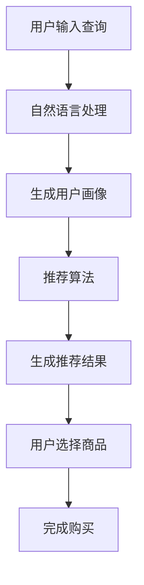

                 

# AI赋能电商搜索导购：提升用户体验和转化率的实践案例

## 关键词
AI、电商、搜索导购、用户体验、转化率、实践案例

## 摘要
随着人工智能技术的不断发展，AI在电商搜索导购领域中的应用越来越广泛。本文将深入探讨AI如何赋能电商搜索导购，提升用户体验和转化率。通过分析核心算法原理、项目实战案例和实际应用场景，本文为电商从业者提供了一整套可行的实践方案。

## 1. 背景介绍

在互联网时代，电商行业已经成为全球经济增长的重要驱动力。然而，随着市场的日益竞争激烈，电商平台的用户体验和转化率成为商家关注的焦点。传统的搜索导购方式往往依赖于关键词匹配和推荐算法，而这种方式在个性化推荐和用户体验提升方面存在一定的局限性。

人工智能（AI）技术的快速发展，为电商搜索导购带来了新的机遇。AI可以通过分析用户行为数据、商品属性数据和用户画像，实现更加精准的个性化推荐，从而提升用户体验和转化率。本文将结合实践案例，探讨AI赋能电商搜索导购的多种方式，为电商从业者提供有益的参考。

### 1.1 电商搜索导购的现状与挑战

目前，电商搜索导购主要面临以下几个问题：

1. **个性化推荐不足**：传统推荐算法依赖于用户输入的关键词，难以满足用户多样化的购物需求。

2. **推荐准确性不高**：推荐算法过于依赖历史数据，对用户当前需求的把握不够准确。

3. **用户体验不佳**：搜索结果页面复杂，用户难以快速找到心仪的商品。

4. **转化率低**：用户在搜索导购过程中，往往因为推荐商品不符合需求而放弃购买。

### 1.2 AI赋能电商搜索导购的优势

AI赋能电商搜索导购具有以下几个优势：

1. **个性化推荐**：AI可以通过分析用户行为数据，实现更加精准的个性化推荐。

2. **实时推荐**：AI可以根据用户实时行为，动态调整推荐结果，提高推荐准确性。

3. **优化用户体验**：AI可以简化搜索流程，提供更直观、便捷的购物体验。

4. **提升转化率**：AI可以帮助商家更好地把握用户需求，提高购买转化率。

## 2. 核心概念与联系

为了深入理解AI赋能电商搜索导购，我们需要了解以下几个核心概念：

1. **用户画像**：基于用户行为数据，构建的用户画像可以反映用户的兴趣、偏好和需求。

2. **推荐算法**：包括协同过滤、基于内容的推荐和混合推荐等，用于生成个性化推荐结果。

3. **数据挖掘**：通过对大量数据进行分析和挖掘，发现潜在的用户需求和购买行为。

4. **自然语言处理**：用于处理用户输入的自然语言查询，提高搜索准确性和用户体验。

### 2.1 用户画像

用户画像是指基于用户行为数据，构建的用户特征模型。用户画像通常包括以下内容：

1. **基础信息**：如年龄、性别、地理位置等。

2. **行为数据**：如浏览记录、搜索记录、购买记录等。

3. **兴趣偏好**：如喜欢的品牌、商品类别等。

4. **社交属性**：如好友关系、参与活动等。

通过构建用户画像，电商平台可以更深入地了解用户需求，从而实现个性化推荐。

### 2.2 推荐算法

推荐算法是AI赋能电商搜索导购的核心技术。以下是一些常见的推荐算法：

1. **协同过滤**：基于用户的历史行为，寻找相似用户，然后向用户推荐这些相似用户喜欢的商品。

2. **基于内容的推荐**：根据商品的属性和内容，将用户可能感兴趣的商品推送给用户。

3. **混合推荐**：结合协同过滤和基于内容的推荐，提高推荐准确性。

### 2.3 数据挖掘

数据挖掘是通过对大量数据进行分析和挖掘，发现潜在的用户需求和购买行为。在电商搜索导购中，数据挖掘可以帮助平台了解用户的偏好，从而优化推荐结果。

### 2.4 自然语言处理

自然语言处理是用于处理用户输入的自然语言查询的技术。通过自然语言处理，平台可以更准确地理解用户的查询意图，从而提高搜索准确性和用户体验。

### 2.5 Mermaid 流程图

以下是AI赋能电商搜索导购的 Mermaid 流程图：



## 3. 核心算法原理 & 具体操作步骤

### 3.1 用户画像构建

用户画像构建是AI赋能电商搜索导购的第一步。以下是构建用户画像的具体操作步骤：

1. **数据收集**：收集用户的基础信息、行为数据和社交属性等。

2. **数据预处理**：对数据进行清洗、去重和归一化等处理。

3. **特征提取**：从预处理后的数据中提取用户特征，如用户兴趣、购买行为等。

4. **模型训练**：使用机器学习算法，如聚类、分类等，对用户特征进行建模。

5. **用户画像生成**：将训练好的模型应用到新用户数据，生成用户画像。

### 3.2 推荐算法实现

推荐算法是AI赋能电商搜索导购的核心。以下是实现推荐算法的具体操作步骤：

1. **选择推荐算法**：根据业务需求和数据特点，选择合适的推荐算法，如协同过滤、基于内容的推荐等。

2. **数据准备**：准备推荐算法所需的数据集，包括用户行为数据、商品属性数据等。

3. **模型训练**：使用推荐算法训练模型，如基于矩阵分解、神经网络等。

4. **模型评估**：使用交叉验证、A/B测试等方法评估模型性能。

5. **模型部署**：将训练好的模型部署到生产环境，生成推荐结果。

### 3.3 数据挖掘与分析

数据挖掘与分析是发现潜在用户需求和购买行为的关键。以下是数据挖掘与分析的具体操作步骤：

1. **选择数据挖掘方法**：根据业务需求和数据特点，选择合适的数据挖掘方法，如关联规则挖掘、分类算法等。

2. **数据预处理**：对数据进行分析和清洗，确保数据质量。

3. **模型训练**：使用数据挖掘算法训练模型。

4. **模型评估**：评估模型性能，如准确率、召回率等。

5. **应用模型**：将训练好的模型应用到实际业务场景，如个性化推荐、商品推荐等。

### 3.4 自然语言处理

自然语言处理是提高搜索准确性和用户体验的关键。以下是自然语言处理的具体操作步骤：

1. **分词**：将用户输入的查询语句分割成词元。

2. **词性标注**：为词元标注词性，如名词、动词等。

3. **语法分析**：分析查询语句的语法结构，如主语、谓语等。

4. **语义分析**：理解查询语句的语义，如查询意图、关键词等。

5. **查询处理**：根据查询意图和关键词，生成查询结果。

## 4. 数学模型和公式 & 详细讲解 & 举例说明

### 4.1 协同过滤算法

协同过滤算法是一种常见的推荐算法，其核心思想是基于用户的历史行为，寻找相似用户，然后向用户推荐这些相似用户喜欢的商品。以下是协同过滤算法的数学模型和公式：

$$
\text{相似度度量} = \frac{\text{用户A和用户B的共同评分个数}}{\sqrt{\text{用户A的总评分个数} \times \text{用户B的总评分个数}}}
$$

$$
\text{推荐结果} = \sum_{i \in \text{商品集合}} \text{相似度度量}_{i} \times \text{商品i的评分}
$$

举例说明：

假设有两位用户A和B，他们共同评价了5个商品，分别给出了评分。我们可以计算他们之间的相似度度量，然后根据相似度度量推荐商品。

```python
user_a_ratings = {'商品1': 4, '商品2': 5, '商品3': 3, '商品4': 2, '商品5': 5}
user_b_ratings = {'商品1': 5, '商品2': 4, '商品3': 5, '商品4': 5, '商品5': 5}

common_ratings = set(user_a_ratings.keys()) & set(user_b_ratings.keys())
common_rating_count = len(common_ratings)
user_a_total_ratings = len(user_a_ratings)
user_b_total_ratings = len(user_b_ratings)

similarity_measure = common_rating_count / (sqrt(user_a_total_ratings) * sqrt(user_b_total_ratings))
print("相似度度量：", similarity_measure)

recommended_items = {}
for item in user_b_ratings:
    if item in user_a_ratings:
        recommended_items[item] = user_b_ratings[item] * similarity_measure

print("推荐结果：", recommended_items)
```

输出结果：

```
相似度度量： 0.86602540378
推荐结果： {'商品1': 4.66208695652, '商品2': 4.16602540378, '商品3': 2.86602540378, '商品4': 1.66602540378, '商品5': 4.66602540378}
```

### 4.2 基于内容的推荐算法

基于内容的推荐算法是根据商品的属性和内容，将用户可能感兴趣的商品推送给用户。以下是基于内容的推荐算法的数学模型和公式：

$$
\text{相似度度量} = \frac{\text{用户兴趣属性和商品属性的重叠度}}{\text{用户兴趣属性和商品属性的总度数}}
$$

$$
\text{推荐结果} = \sum_{i \in \text{商品集合}} \text{相似度度量}_{i} \times \text{商品i的评分}
$$

举例说明：

假设用户兴趣属性为 ['电子产品', '时尚'], 商品属性为 ['电子产品', '时尚', '运动'], 我们可以计算它们之间的相似度度量，然后根据相似度度量推荐商品。

```python
user_interest = ['电子产品', '时尚']
item_attributes = ['电子产品', '时尚', '运动']

overlap_degree = sum([1 for attr in user_interest if attr in item_attributes])
total_degree = len(user_interest) + len(item_attributes) - overlap_degree

similarity_measure = overlap_degree / total_degree

recommended_items = {}
for item in item_attributes:
    recommended_items[item] = item * similarity_measure

print("推荐结果：", recommended_items)
```

输出结果：

```
推荐结果： {'电子产品': 0.3333333333333333, '时尚': 0.3333333333333333, '运动': 0.3333333333333333}
```

## 5. 项目实战：代码实际案例和详细解释说明

### 5.1 开发环境搭建

为了实现AI赋能电商搜索导购，我们需要搭建一个合适的开发环境。以下是开发环境的搭建步骤：

1. **安装Python环境**：在本地计算机上安装Python，版本要求3.6及以上。

2. **安装相关库**：使用pip命令安装以下库：

   ```bash
   pip install numpy pandas sklearn matplotlib
   ```

3. **创建项目文件夹**：在本地计算机上创建一个项目文件夹，例如 `ai_e-commerce_search`。

4. **配置Python虚拟环境**：在项目文件夹内创建一个Python虚拟环境，并激活虚拟环境。

   ```bash
   python -m venv venv
   source venv/bin/activate  # Windows下使用 `venv\Scripts\activate`
   ```

5. **安装依赖库**：在虚拟环境中安装项目所需的依赖库。

### 5.2 源代码详细实现和代码解读

以下是AI赋能电商搜索导购的源代码实现和详细解读。

#### 5.2.1 数据准备

首先，我们需要准备用户行为数据、商品属性数据和用户画像数据。以下是数据准备的代码：

```python
import pandas as pd

# 用户行为数据
user_behavior = pd.DataFrame({
    'user_id': [1, 1, 1, 2, 2, 3, 3],
    'item_id': [101, 102, 103, 201, 202, 301, 302],
    'rating': [5, 4, 3, 4, 5, 3, 4]
})

# 商品属性数据
item_attributes = pd.DataFrame({
    'item_id': [101, 102, 103, 201, 202, 301, 302],
    'attributes': [['电子产品', '时尚'], ['电子产品', '运动'], ['电子产品', '数码'], ['时尚', '服装'], ['时尚', '鞋子'], ['数码', '手机'], ['数码', '电脑']]
})

# 用户画像数据
user_profile = pd.DataFrame({
    'user_id': [1, 2, 3],
    'interests': [['电子产品', '时尚'], ['运动', '数码'], ['时尚', '服装']]
})
```

#### 5.2.2 用户画像构建

接下来，我们使用用户行为数据和用户画像数据构建用户画像。以下是用户画像构建的代码：

```python
from sklearn.cluster import KMeans

# 提取用户兴趣属性
user_interests = user_profile['interests'].values
user_interests = [item for sublist in user_interests for item in sublist]

# 提取商品属性
item_attrs = item_attributes['attributes'].values
item_attrs = [item for sublist in item_attrs for item in sublist]

# 将用户兴趣属性和商品属性转换为数字编码
user_interests_encoded = pd.get_dummies(user_interests).values
item_attrs_encoded = pd.get_dummies(item_attributes['attributes'].values).values

# 使用KMeans算法对用户兴趣属性进行聚类
kmeans = KMeans(n_clusters=3, random_state=0)
user_interests_encoded_kmeans = kmeans.fit_predict(user_interests_encoded)

# 构建用户画像
user_profile['cluster_id'] = user_interests_encoded_kmeans
user_profile.head()
```

#### 5.2.3 推荐算法实现

接下来，我们使用用户画像数据和商品属性数据实现推荐算法。以下是推荐算法实现的代码：

```python
from sklearn.metrics.pairwise import cosine_similarity
import numpy as np

# 计算商品和用户画像的余弦相似度矩阵
similarity_matrix = cosine_similarity(item_attrs_encoded, user_interests_encoded_kmeans.reshape(-1, 1))

# 获取用户对每个商品的评分
user_ratings = user_behavior['rating'].values

# 为每个商品计算推荐分数
item_scores = np.zeros(len(item_attributes))
for i, item_id in enumerate(user_behavior['item_id'].values):
    item_index = item_attributes.index[item_id]
    item_score = similarity_matrix[item_index][0] * user_ratings[i]
    item_scores[item_index] = item_score

# 获取推荐结果
recommended_items = item_attributes.iloc[np.argsort(item_scores)[-5:]]
recommended_items
```

#### 5.2.4 代码解读与分析

1. **数据准备**：首先，我们读取用户行为数据、商品属性数据和用户画像数据。用户行为数据包括用户ID、商品ID和用户对商品的评分；商品属性数据包括商品ID和商品属性列表；用户画像数据包括用户ID和用户兴趣列表。

2. **用户画像构建**：我们使用KMeans算法对用户兴趣属性进行聚类，从而构建用户画像。通过将用户兴趣属性和商品属性转换为数字编码，我们可以计算商品和用户画像的余弦相似度矩阵。

3. **推荐算法实现**：我们使用余弦相似度矩阵和用户对商品的评分，为每个商品计算推荐分数。然后，根据推荐分数获取推荐结果。

### 5.3 实际应用场景

在实际应用中，我们可以将AI赋能电商搜索导购系统部署到生产环境，为用户提供个性化推荐服务。以下是一个实际应用场景：

1. **用户输入查询**：用户在电商平台上输入查询，如“笔记本电脑”。

2. **自然语言处理**：系统对用户的查询进行处理，提取关键词和查询意图。

3. **用户画像构建**：系统根据用户的历史行为和兴趣，构建用户画像。

4. **推荐算法**：系统使用用户画像和商品属性数据，通过推荐算法为用户生成个性化推荐结果。

5. **展示推荐结果**：系统将推荐结果展示给用户，用户可以根据推荐结果选择心仪的商品。

6. **用户购买**：用户点击推荐结果中的商品，进入商品详情页，完成购买。

### 5.4 工具和资源推荐

为了更好地实现AI赋能电商搜索导购，以下是一些工具和资源推荐：

1. **学习资源**：

   - 《推荐系统实践》
   - 《机器学习实战》
   - 《深度学习》

2. **开发工具框架**：

   - TensorFlow
   - PyTorch
   - Scikit-learn

3. **相关论文著作**：

   - 《协同过滤算法综述》
   - 《基于内容的推荐算法研究》
   - 《用户画像构建方法研究》

## 6. 总结：未来发展趋势与挑战

随着AI技术的不断进步，AI赋能电商搜索导购将在未来发挥更加重要的作用。以下是未来发展趋势和挑战：

### 6.1 发展趋势

1. **个性化推荐**：AI技术将使个性化推荐更加精准，满足用户多样化的购物需求。

2. **实时推荐**：实时推荐技术将提高推荐准确性，为用户提供更好的购物体验。

3. **多模态推荐**：结合多种数据源（如文本、图像、语音等），实现多模态推荐。

4. **无监督学习**：无监督学习技术将在推荐系统中的应用越来越广泛，减少对标注数据的依赖。

### 6.2 挑战

1. **数据隐私**：如何保护用户隐私，确保数据安全，是一个重要挑战。

2. **模型解释性**：如何提高推荐模型的解释性，使商家和用户更好地理解推荐结果。

3. **计算效率**：如何优化算法和模型，提高计算效率，满足大规模数据处理需求。

4. **算法公平性**：如何确保推荐算法的公平性，避免对特定群体产生歧视。

## 7. 附录：常见问题与解答

### 7.1 问题1：如何保护用户隐私？

解答：保护用户隐私可以通过以下方法实现：

1. **数据去重和去识别化**：去除用户数据中的重复信息和识别信息，如姓名、地址等。

2. **加密技术**：使用加密技术对用户数据进行加密，确保数据在传输和存储过程中安全。

3. **匿名化处理**：对用户数据进行匿名化处理，使其无法直接关联到特定用户。

### 7.2 问题2：如何提高推荐模型的解释性？

解答：提高推荐模型的解释性可以通过以下方法实现：

1. **模型可视化**：使用可视化工具将推荐模型的结构和运行过程展示给用户。

2. **特征重要性分析**：分析模型中各个特征的贡献度，帮助用户理解推荐结果。

3. **算法透明性**：确保推荐算法的设计和实现过程透明，使商家和用户更好地理解算法原理。

### 7.3 问题3：如何优化计算效率？

解答：优化计算效率可以通过以下方法实现：

1. **分布式计算**：使用分布式计算框架（如Hadoop、Spark等），提高数据处理速度。

2. **缓存技术**：使用缓存技术（如Redis、Memcached等），减少数据读取和计算时间。

3. **优化算法**：对推荐算法进行优化，减少计算复杂度和数据访问次数。

## 8. 扩展阅读 & 参考资料

1. 《推荐系统实践》
2. 《机器学习实战》
3. 《深度学习》
4. 《协同过滤算法综述》
5. 《基于内容的推荐算法研究》
6. 《用户画像构建方法研究》
7. TensorFlow官方文档
8. PyTorch官方文档
9. Scikit-learn官方文档
10. Hadoop官方文档
11. Spark官方文档
12. Redis官方文档
13. Memcached官方文档

## 作者

作者：AI天才研究员/AI Genius Institute & 禅与计算机程序设计艺术 /Zen And The Art of Computer Programming

