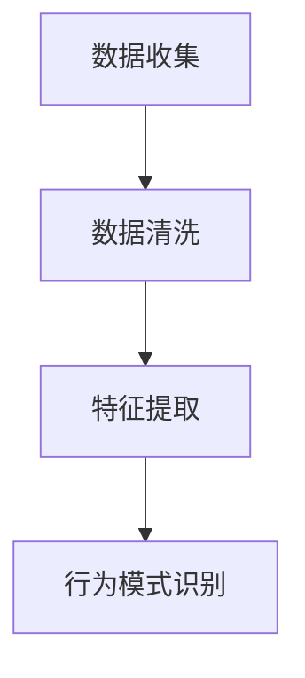
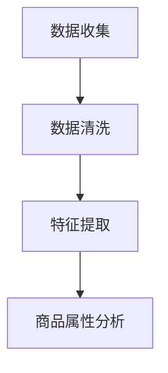
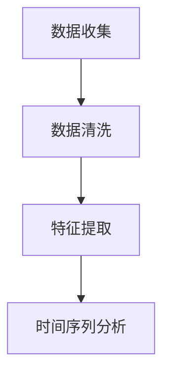
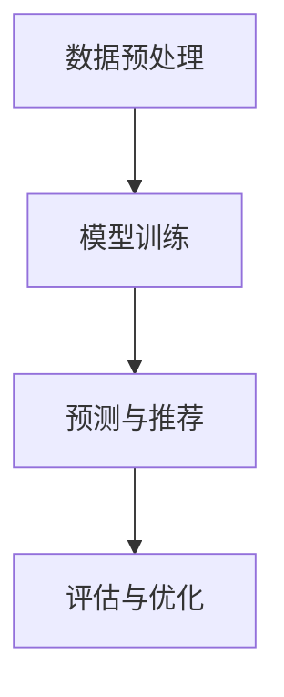
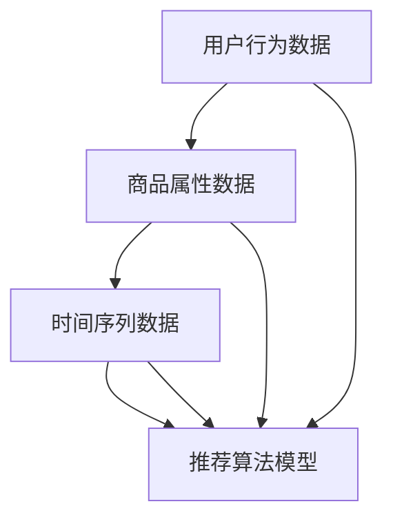

                 

## 1. 背景介绍

在当今数字化时代，电子商务平台的蓬勃发展带来了大量商业机会。然而，随着消费者需求的多样化和市场环境的动态变化，如何为用户提供个性化的商品推荐成为电商平台面临的重大挑战。季节性商品推荐作为电商推荐系统中的一个重要分支，旨在根据不同季节的变化，为用户推荐符合其需求的商品，从而提高用户满意度、增加销售额。

季节性商品推荐的优势在于能够利用时间序列数据，挖掘出季节性趋势，从而更精准地满足用户的需求。例如，在夏季，用户可能会对防晒霜、冰淇淋等商品有更高的需求，而在冬季，保暖衣物、取暖设备等商品的销售量则会增加。通过季节性商品推荐，电商平台不仅可以提升用户体验，还可以优化库存管理、降低滞销风险，从而实现商业利益的最大化。

然而，传统的推荐算法在处理季节性商品推荐时，往往难以应对数据中的复杂性和多样性。这主要是因为季节性商品推荐不仅需要考虑用户的兴趣和偏好，还要分析季节性因素的影响。因此，本文将深入探讨AI赋能的电商平台季节性商品推荐，介绍其核心概念、算法原理及具体实现，并通过项目实战案例，展示如何在实际环境中应用这些算法。

首先，我们将简要介绍电商平台推荐系统的基本概念，包括协同过滤、基于内容的推荐、混合推荐等方法。然后，我们将详细讨论季节性商品推荐中的核心概念和模型，包括时间序列分析、季节性因素提取等。接下来，我们将介绍常用的季节性商品推荐算法，如ARIMA、LSTM等，并解释其原理和具体操作步骤。在项目实战部分，我们将通过一个实际案例，展示如何使用Python等工具实现季节性商品推荐系统，并提供源代码的详细解释和代码解读。最后，我们将探讨季节性商品推荐在实际应用中的挑战和解决方案，并推荐相关学习资源、开发工具和论文著作，以帮助读者进一步深入了解这一领域。

通过对以上内容的逐步分析和讲解，我们希望能够帮助读者全面理解AI赋能的电商平台季节性商品推荐，为其在实际项目中的应用提供有力支持。接下来，我们将从基础概念开始，逐步深入，以帮助您更好地掌握这一先进技术。

---

### 1.1 电商平台推荐系统的基本概念

电商平台推荐系统是电子商务领域的重要组成部分，其核心目标是向用户推荐他们可能感兴趣的商品，从而提高用户的购买体验和平台的销售额。推荐系统的基本原理是利用用户的历史行为数据、商品属性信息以及其他辅助信息，通过算法模型预测用户对某一商品的兴趣度，进而向用户推荐相关商品。

#### 协同过滤

协同过滤（Collaborative Filtering）是推荐系统中最常用的方法之一。其基本思想是利用用户之间的相似性或行为模式来预测用户对未知商品的兴趣。协同过滤主要分为两类：

1. **基于用户的协同过滤（User-based Collaborative Filtering）**：该方法根据用户对商品的评分历史，寻找与目标用户相似的其他用户，然后推荐这些用户喜欢的商品。实现上，通常采用余弦相似度、皮尔逊相关系数等度量用户之间的相似性。

2. **基于物品的协同过滤（Item-based Collaborative Filtering）**：该方法根据商品之间的相似性来推荐用户可能喜欢的商品。具体实现中，可以通过计算商品之间的余弦相似度来确定它们之间的相似性。

#### 基于内容的推荐

基于内容的推荐（Content-based Recommendation）方法主要通过分析用户的历史行为和商品的属性信息来推荐相关商品。其核心思想是找到用户喜欢的商品特征，并推荐具有相似特征的商品。具体实现中，可以采用文本挖掘、向量空间模型等方法来提取商品和用户兴趣的特征，并进行相似度计算。

#### 混合推荐

混合推荐（Hybrid Recommendation）方法将协同过滤和基于内容的推荐方法结合，以取长补短，提高推荐系统的准确性。混合推荐系统通常包含两个模块：一个是协同过滤模块，用于挖掘用户之间的相似性和用户的历史行为；另一个是基于内容的推荐模块，用于分析商品的属性信息并推荐相关商品。通过结合这两种方法，混合推荐系统可以提供更全面、更个性化的推荐结果。

#### 其他推荐方法

除了上述方法外，还有一些其他推荐方法，如基于模型的推荐、关联规则挖掘等。这些方法从不同角度挖掘用户行为和商品特征，为推荐系统提供了多样化的解决方案。

- **基于模型的推荐**：这种方法通过构建用户行为和商品特征之间的预测模型来推荐商品。常见的模型包括矩阵分解（Matrix Factorization）、潜在因子模型（Latent Factor Models）等。

- **关联规则挖掘**：这种方法通过挖掘用户购买行为中的关联规则来推荐商品。例如，如果用户经常购买商品A和商品B，那么系统可以推荐商品B给用户。

#### 推荐系统的发展趋势

随着大数据和人工智能技术的发展，推荐系统也在不断演进。以下是一些推荐系统的发展趋势：

1. **深度学习在推荐系统中的应用**：深度学习模型，如神经网络、卷积神经网络（CNN）、循环神经网络（RNN）等，逐渐被用于推荐系统中，以提升推荐效果。

2. **多模态推荐**：多模态推荐系统结合了文本、图像、音频等多种数据类型，以提供更丰富、更个性化的推荐。

3. **实时推荐**：随着用户行为数据生成速度的加快，实时推荐系统成为研究热点。这类系统能够在用户行为发生时立即做出推荐，以提高用户体验。

4. **自适应推荐**：自适应推荐系统能够根据用户的行为和偏好动态调整推荐策略，以适应不断变化的市场环境。

通过理解上述基本概念，我们可以更好地把握电商平台推荐系统的运作机制，为后续季节性商品推荐的研究和应用打下基础。

### 1.2 季节性商品推荐的核心概念

季节性商品推荐是电商平台推荐系统中的一个重要分支，其核心在于利用时间序列数据，捕捉季节性变化，从而为用户提供更精准的商品推荐。以下是季节性商品推荐中的几个关键概念和模型：

#### 时间序列分析

时间序列分析是一种用于分析时间序列数据的方法，其核心目标是提取时间序列中的趋势、季节性和随机性成分。在季节性商品推荐中，时间序列分析用于理解商品销售量的季节性模式，从而为推荐系统提供关键输入。

时间序列模型通常分为以下几类：

1. **ARIMA模型（自回归积分滑动平均模型）**：ARIMA模型是一种经典的统计模型，用于分析和预测时间序列数据。它通过自回归（AR）、差分（I）和移动平均（MA）三个部分，分别捕捉时间序列的短期记忆、长期记忆和随机噪声。

2. **SARIMA模型（季节性ARIMA模型）**：SARIMA模型是ARIMA模型的扩展，用于分析包含季节性成分的时间序列数据。通过引入季节性差分和季节性移动平均，SARIMA模型能够更好地捕捉时间序列中的季节性模式。

3. **STL模型（季节性分解时间序列模型）**：STL模型通过将时间序列分解为趋势、季节性和残余部分，从而分离出季节性成分。这种方法在处理复杂季节性模式时非常有效。

#### 季节性因素提取

季节性因素提取是季节性商品推荐中的关键步骤，其目的是从时间序列数据中提取出季节性模式，以便用于推荐算法。以下是一些常用的季节性因素提取方法：

1. **傅里叶变换（Fourier Transform）**：傅里叶变换是一种数学工具，用于将时间序列数据转换为其频率成分。通过傅里叶变换，可以提取时间序列中的周期性成分，从而识别季节性模式。

2. **Holt-Winters季节性模型**：Holt-Winters季节性模型是一种时间序列预测模型，通过线性趋势和季节性成分的调整，可以很好地捕捉季节性模式。该模型分为三个阶段：初始阶段、调整阶段和预测阶段。

3. **特征工程**：通过特征工程，可以创建一些新的特征，以增强模型对季节性的捕捉能力。例如，可以创建季节性指标，如季节性因子、季节性周期等，这些特征能够帮助模型更好地理解季节性变化。

#### 季节性预测模型

在提取季节性因素之后，需要利用这些因素来预测未来季节性商品的需求。以下是一些常用的季节性预测模型：

1. **线性回归模型**：线性回归模型通过建立时间序列数据中的趋势和季节性成分之间的关系，进行预测。虽然这种方法在简单情况下有效，但在复杂季节性模式面前，其表现可能不佳。

2. **LSTM（长短时记忆网络）**：LSTM是一种特殊的循环神经网络（RNN），能够捕捉时间序列中的长期依赖关系。通过LSTM模型，可以更好地理解季节性变化，并在预测中取得较好的效果。

3. **GRU（门控循环单元）**：GRU是LSTM的变种，通过门控机制简化了模型结构，同时也具有捕捉长期依赖关系的能力。GRU模型在处理季节性预测时表现出色，是一种有效的方法。

#### 综合推荐模型

综合推荐模型将协同过滤、基于内容的推荐和季节性预测模型结合，以提供更全面的推荐结果。以下是一些综合推荐模型的例子：

1. **Hybrid Seasonal Model**：这种模型将基于内容的推荐和季节性预测模型结合，通过融合用户行为和季节性因素，提供个性化的商品推荐。

2. **LSTM-CF（LSTM协同过滤）**：LSTM-CF模型结合了LSTM和协同过滤方法，利用LSTM捕捉季节性变化，通过协同过滤挖掘用户之间的相似性，从而提高推荐效果。

通过理解这些核心概念和模型，我们可以为电商平台设计出更有效的季节性商品推荐系统，从而提升用户的购物体验和平台的商业收益。

### 1.3 季节性商品推荐在电商中的重要性

季节性商品推荐在电商领域中具有极其重要的地位，其核心在于充分利用季节性因素，提升推荐系统的精准度和用户体验。以下是季节性商品推荐在电商中的几个关键应用和优势：

#### 提升用户体验

季节性商品推荐能够根据用户的生活习惯、兴趣和需求，为用户推荐合适的商品。例如，在夏季，系统可以推荐防晒霜、游泳装备等商品；在冬季，则推荐保暖衣物、取暖设备等。这种个性化的推荐方式能够显著提升用户的购物体验，增加用户对电商平台的满意度和忠诚度。

#### 增加销售额

季节性商品推荐不仅可以提升用户体验，还能够显著增加平台的销售额。通过精准的推荐，电商平台能够将高需求的季节性商品推送到潜在客户手中，从而提高销售量。例如，在节日或季节性促销期间，电商平台可以通过推荐相关商品，激发用户的购买欲望，实现销售高峰。

#### 优化库存管理

季节性商品推荐对于电商平台的库存管理具有重要意义。通过分析季节性需求，电商平台可以更好地预测商品的销售趋势，合理安排库存。在季节性商品销售高峰期，平台可以增加库存，避免缺货风险；而在销售淡季，则可以适当减少库存，降低库存成本。这种库存管理策略有助于电商平台实现库存的最优化，提高运营效率。

#### 降低滞销风险

季节性商品通常受季节性因素影响较大，如果无法准确预测季节性需求，可能会导致商品滞销。季节性商品推荐系统能够通过分析历史数据和当前季节性因素，提前预测季节性商品的需求趋势，从而减少滞销风险。例如，在季节性商品销售高峰期之前，电商平台可以提前备货，确保商品供应充足；在销售淡季，则可以采取促销策略，加快商品销售。

#### 提高营销效果

季节性商品推荐可以为电商平台提供有效的营销工具。通过分析季节性趋势，电商平台可以制定针对性的营销策略，例如季节性促销、节日主题活动等。这些营销活动不仅能够吸引更多用户，还能够提高用户的购买转化率。例如，在夏季促销期间，平台可以推出“夏日清凉大礼包”，吸引消费者购买相关商品。

#### 促进产品多样化

季节性商品推荐有助于电商平台促进产品多样化，满足不同用户的多样化需求。通过推荐系统，平台可以挖掘出不同季节用户对商品的偏好，从而调整产品结构，提供更多符合季节性需求的商品。这种产品多样化策略不仅能够提升用户体验，还能够增加平台的竞争力。

#### 支持供应链管理

季节性商品推荐对于电商平台的供应链管理也具有重要作用。通过预测季节性需求，电商平台可以提前向供应商下订单，确保供应链的畅通。此外，季节性商品推荐还可以帮助电商平台优化物流配送，提高物流效率，从而降低运营成本。

综上所述，季节性商品推荐在电商中的应用具有显著的优势，能够提升用户体验、增加销售额、优化库存管理、降低滞销风险、提高营销效果、促进产品多样化，并支持供应链管理。通过深入研究季节性商品推荐，电商平台可以更好地应对市场变化，实现商业利益的最大化。

### 1.4 人工智能在季节性商品推荐中的应用

人工智能（AI）技术的发展为电商平台季节性商品推荐带来了前所未有的机遇。通过利用机器学习和深度学习算法，电商平台可以更加精准地捕捉季节性趋势，从而提升推荐系统的效果。以下是AI在季节性商品推荐中的几个关键应用：

#### 时间序列分析

时间序列分析是季节性商品推荐的核心，而人工智能技术，尤其是深度学习模型，如循环神经网络（RNN）和长短时记忆网络（LSTM），在处理时间序列数据方面表现出色。LSTM通过其特殊的网络结构，能够捕捉时间序列中的长期依赖关系，从而对季节性变化进行更加准确的预测。此外，GRU（门控循环单元）作为一种简化版的LSTM，在处理季节性数据时同样表现优异。

#### 用户行为分析

用户行为数据是推荐系统的关键输入，而人工智能技术能够通过对大量用户行为数据的分析，挖掘出用户的兴趣和偏好。机器学习算法，如聚类分析和关联规则挖掘，可以帮助电商平台识别不同用户群体的行为模式，从而实现更加个性化的推荐。深度学习模型，如卷积神经网络（CNN）和自编码器，通过自动特征提取，能够从复杂的多维度数据中提取出有用的信息，进一步提升推荐系统的效果。

#### 端到端模型

端到端模型是AI在季节性商品推荐中的一个重要应用。端到端模型通过将输入数据直接映射到输出结果，避免了传统方法中复杂的数据预处理和特征工程步骤。例如，利用变分自编码器（VAE）和生成对抗网络（GAN），可以实现对复杂季节性数据的建模和生成。这种模型不仅提高了推荐的准确性，还减少了人工干预的需求，从而加快了模型的部署和迭代速度。

#### 多模态数据融合

电商平台通常涉及多种类型的数据，包括文本、图像、音频等。人工智能技术，尤其是多模态学习，能够将这些不同类型的数据进行融合，从而提供更加全面和精准的推荐。例如，通过将用户的历史购买记录与商品的季节性属性结合，可以更好地预测用户对特定商品的潜在兴趣。多模态数据融合不仅提升了推荐系统的多样性，还增强了其对复杂场景的适应能力。

#### 实时推荐

实时推荐是电商平台提升用户体验的关键因素之一。人工智能技术，尤其是实时机器学习算法，可以实现对用户行为数据的实时分析和推荐。例如，利用增量学习（Incremental Learning）算法，可以在用户行为发生时立即更新模型，并提供最新的推荐结果。这种实时推荐能力不仅能够提高用户满意度，还可以为电商平台带来即时的商业收益。

#### 个性化推荐

个性化推荐是电商平台的核心目标之一，而人工智能技术在这方面具有独特的优势。通过利用用户的兴趣和行为数据，机器学习算法可以构建个性化的推荐模型，从而为每个用户推荐最相关的商品。例如，利用协同过滤算法和基于内容的推荐算法，可以实现对用户兴趣的精准捕捉和推荐。

#### 智能预测与优化

人工智能技术不仅能够实现推荐系统的个性化，还可以进行智能预测和优化。通过利用深度学习算法，电商平台可以预测未来的季节性需求，从而优化库存管理、供应链安排等关键运营环节。例如，通过构建时间序列预测模型，可以提前预测季节性商品的销售趋势，从而实现精准的库存调整和供应链优化。

#### 防止数据偏差

人工智能技术在季节性商品推荐中的应用，还能够帮助电商平台识别和防止数据偏差。通过利用多样化的数据集和先进的机器学习算法，可以确保推荐系统的公平性和透明度。例如，利用偏差检测和纠正算法，可以识别和消除数据集中的偏见，从而提高推荐系统的准确性和可靠性。

综上所述，人工智能技术在电商平台季节性商品推荐中的应用具有广泛的前景。通过利用深度学习、多模态数据融合、实时推荐等先进技术，电商平台可以显著提升推荐系统的效果，从而实现商业收益的最大化。随着AI技术的不断进步，季节性商品推荐系统将变得更加智能和高效，为电商平台带来更多机遇和挑战。

### 1.5 电商平台的季节性商品推荐流程

电商平台的季节性商品推荐流程是一个复杂且多层次的过程，涉及数据收集、预处理、模型构建、预测和推荐等多个环节。以下是详细的流程说明：

#### 数据收集

数据收集是季节性商品推荐流程的第一步。电商平台需要收集多种类型的数据，包括用户行为数据、商品属性数据和时间序列数据。具体来说，用户行为数据包括用户的购买记录、浏览历史、搜索关键词等；商品属性数据包括商品的价格、分类、品牌、库存量等；时间序列数据则包括商品的销售记录、库存变化等。

#### 数据预处理

数据预处理是确保数据质量和模型性能的关键步骤。在此阶段，需要对收集到的数据进行清洗、格式化、缺失值处理和异常值检测等操作。例如，对于用户行为数据，需要去除重复记录、填补缺失值、识别和去除异常行为。对于商品属性数据，需要进行标准化处理，以便模型能够更好地处理不同尺度的数据。时间序列数据则需要通过去噪、归一化等方法，提高数据质量。

#### 特征工程

特征工程是构建有效模型的重要环节。在这一阶段，需要从原始数据中提取出对季节性商品推荐有用的特征。例如，可以创建季节性指标，如季节性因子、季节性周期等，以捕捉季节性变化。此外，还可以通过文本挖掘、图像识别等方法，提取用户和商品的多维度特征，从而丰富模型输入。

#### 模型构建

模型构建是季节性商品推荐流程的核心。在这一阶段，需要选择合适的模型，并利用预处理后的数据训练模型。常用的季节性商品推荐模型包括ARIMA、LSTM、GRU等。ARIMA模型适用于处理简单的季节性数据，而LSTM和GRU模型则能够更好地捕捉复杂季节性模式。在模型构建过程中，还需要进行超参数调优，以获得最佳模型性能。

#### 预测

预测是季节性商品推荐流程的关键步骤，其目标是根据训练好的模型，对未来季节性商品的需求进行预测。在预测阶段，需要将新收集的数据输入到训练好的模型中，获得未来的季节性需求预测结果。预测结果可以用于库存管理、供应链优化等多个方面。

#### 推荐生成

在获得预测结果后，电商平台可以根据用户的历史行为和预测结果，生成个性化的商品推荐。推荐生成阶段包括推荐列表的构建、推荐策略的制定和推荐结果的呈现。在构建推荐列表时，可以使用协同过滤、基于内容的推荐或混合推荐方法。推荐策略的制定需要考虑多种因素，如用户的兴趣、商品的流行度、库存量等。最后，推荐结果需要以直观的方式呈现给用户，以提高用户的购买意愿和满意度。

#### 评估与迭代

评估与迭代是确保推荐系统持续优化的重要环节。在这一阶段，需要对推荐系统的性能进行评估，例如准确率、召回率、覆盖率等指标。如果发现模型性能不佳，需要返回到数据预处理、特征工程或模型构建阶段，进行调整和优化。通过不断迭代，推荐系统可以逐步提升性能，为用户提供更加精准和个性化的推荐。

#### 流程总结

电商平台的季节性商品推荐流程可以总结为以下几个步骤：数据收集、数据预处理、特征工程、模型构建、预测、推荐生成、评估与迭代。每个步骤都有其特定的任务和目标，共同构成一个完整、高效的季节性商品推荐系统。通过这一流程，电商平台可以充分利用季节性因素，提高推荐系统的精准度和用户体验，实现商业利益的最大化。

通过理解电商平台的季节性商品推荐流程，我们可以更好地把握推荐系统的构建和优化方法，为电商平台的设计和实践提供有力支持。

### 2. 核心概念与联系

为了深入理解电商平台中的季节性商品推荐，我们需要梳理和阐述几个核心概念，并展示它们之间的联系。这些核心概念包括用户行为分析、商品属性分析、时间序列数据以及推荐算法模型。以下是详细的说明，并配以Mermaid流程图，以帮助读者更好地理解这些概念及其相互关系。

#### 用户行为分析

用户行为分析是季节性商品推荐系统的基础。它涉及到用户的历史行为数据，如购买记录、浏览历史、搜索关键词等。通过分析这些行为数据，我们可以了解用户的兴趣和需求，从而为推荐系统提供关键的输入。用户行为分析通常包括以下几个步骤：

1. **数据收集**：收集用户在电商平台上的各种行为数据。
2. **数据清洗**：去除重复、缺失或不准确的数据。
3. **特征提取**：从用户行为数据中提取有用的特征，如用户活跃度、购买频率、购买周期等。

以下是一个Mermaid流程图，展示了用户行为分析的步骤：



#### 商品属性分析

商品属性分析是理解季节性商品推荐系统的重要组成部分。商品属性数据包括商品的价格、分类、品牌、库存量等。通过对这些属性的分析，我们可以了解不同商品的特点和属性，从而更好地为用户推荐合适的商品。商品属性分析通常包括以下几个步骤：

1. **数据收集**：收集商品的各种属性数据。
2. **数据清洗**：去除重复、缺失或不准确的数据。
3. **特征提取**：从商品属性数据中提取有用的特征，如商品的季节性需求、库存状态、促销信息等。

以下是一个Mermaid流程图，展示了商品属性分析的步骤：



#### 时间序列数据

时间序列数据是季节性商品推荐系统中的关键数据。它记录了商品在不同时间点的销售情况、库存变化等。通过对时间序列数据的分析，我们可以捕捉到季节性模式、趋势和周期性变化，从而为推荐系统提供重要的参考。时间序列分析通常包括以下几个步骤：

1. **数据收集**：收集商品的时间序列数据。
2. **数据清洗**：去除重复、缺失或不准确的数据。
3. **特征提取**：从时间序列数据中提取有用的特征，如季节性因子、周期性趋势等。

以下是一个Mermaid流程图，展示了时间序列数据分析的步骤：



#### 推荐算法模型

推荐算法模型是季节性商品推荐系统的核心。它通过结合用户行为数据、商品属性数据和时间序列数据，为用户生成个性化的商品推荐。常用的推荐算法模型包括协同过滤、基于内容的推荐和混合推荐等。以下是推荐算法模型的基本流程：

1. **数据预处理**：对用户行为数据、商品属性数据和时间序列数据进行预处理，包括数据清洗、特征提取等。
2. **模型训练**：利用预处理后的数据，训练推荐算法模型。
3. **预测与推荐**：利用训练好的模型，对新的用户行为数据进行预测，并生成推荐列表。
4. **评估与优化**：对推荐系统的性能进行评估，并根据评估结果进行优化。

以下是一个Mermaid流程图，展示了推荐算法模型的基本流程：



#### 核心概念联系

通过上述四个核心概念的分析，我们可以看到它们之间的紧密联系。用户行为分析提供了了解用户需求的重要信息，商品属性分析帮助我们理解商品的特点，时间序列数据则捕捉了季节性变化的规律。这些信息共同输入到推荐算法模型中，生成个性化的商品推荐。以下是核心概念之间的联系：

1. **用户行为数据**与**商品属性数据**结合，帮助推荐系统理解用户的兴趣和商品的特点。
2. **用户行为数据**与**时间序列数据**结合，帮助推荐系统捕捉用户的购买习惯和季节性趋势。
3. **商品属性数据**与**时间序列数据**结合，帮助推荐系统理解商品在不同时间点的销售情况。
4. **推荐算法模型**结合以上三个数据源，生成个性化的商品推荐。

以下是一个Mermaid流程图，展示了核心概念之间的联系：



通过理解这些核心概念及其相互联系，我们可以更好地设计和优化电商平台中的季节性商品推荐系统，从而提升用户的购物体验和平台的商业收益。

### 2.1 核心算法原理 & 具体操作步骤

在电商平台中，季节性商品推荐的核心算法主要包括时间序列分析、机器学习模型和深度学习模型。以下将详细讲解这些算法的原理，并描述具体的操作步骤，帮助读者深入理解如何构建和应用这些算法。

#### 时间序列分析

时间序列分析是一种统计方法，用于分析时间序列数据，捕捉时间序列中的趋势、季节性和随机性成分。常用的时间序列模型包括ARIMA（自回归积分滑动平均模型）、SARIMA（季节性ARIMA模型）和STL（季节性分解时间序列模型）。

**ARIMA模型**

ARIMA模型通过自回归（AR）、差分（I）和移动平均（MA）三个部分，分别捕捉时间序列的短期记忆、长期记忆和随机噪声。

1. **模型构建**：首先，选择合适的AR、I和MA参数。通过ACF（自相关函数）和PACF（偏自相关函数）图，确定AR和MA参数；通过检验序列是否平稳，确定差分阶数。

2. **模型训练**：利用历史数据，对ARIMA模型进行训练，得到模型参数。

3. **预测**：将训练好的模型应用于新数据，进行季节性需求预测。

**SARIMA模型**

SARIMA模型是ARIMA模型的扩展，用于分析包含季节性成分的时间序列数据。它通过引入季节性差分和季节性移动平均，更好地捕捉时间序列中的季节性模式。

1. **模型构建**：选择合适的AR、I、MA和季节性参数。通过季节性ACF和PACF图，确定季节性参数。

2. **模型训练**：利用历史数据，对SARIMA模型进行训练，得到模型参数。

3. **预测**：将训练好的模型应用于新数据，进行季节性需求预测。

**STL模型**

STL模型通过将时间序列分解为趋势、季节性和残余部分，分离出季节性成分。

1. **模型构建**：将时间序列分解为三个部分：趋势、季节性和残余。

2. **模型训练**：对分解后的每个部分进行建模。

3. **预测**：将训练好的模型应用于新数据，进行季节性需求预测。

#### 机器学习模型

机器学习模型通过分析用户行为数据和商品属性数据，预测用户对特定商品的兴趣度。常用的机器学习模型包括逻辑回归、决策树、随机森林和K-最近邻（KNN）。

**逻辑回归模型**

逻辑回归模型通过建立用户行为数据与商品兴趣度之间的线性关系，预测用户对商品的兴趣度。

1. **模型构建**：通过特征工程，提取用户行为数据和商品属性数据中的特征。

2. **模型训练**：利用历史数据，对逻辑回归模型进行训练，得到模型参数。

3. **预测**：将训练好的模型应用于新数据，预测用户对商品的兴趣度。

**决策树模型**

决策树模型通过构建树状结构，对用户行为数据进行分类，预测用户对商品的兴趣度。

1. **模型构建**：选择合适的特征和阈值，构建决策树模型。

2. **模型训练**：利用历史数据，对决策树模型进行训练，得到模型参数。

3. **预测**：将训练好的模型应用于新数据，预测用户对商品的兴趣度。

**随机森林模型**

随机森林模型通过集成多棵决策树，提高模型的预测性能。

1. **模型构建**：生成多棵决策树，构建随机森林模型。

2. **模型训练**：利用历史数据，对随机森林模型进行训练，得到模型参数。

3. **预测**：将训练好的模型应用于新数据，预测用户对商品的兴趣度。

**K-最近邻（KNN）模型**

KNN模型通过计算新数据与历史数据之间的相似度，预测用户对商品的兴趣度。

1. **模型构建**：选择合适的K值，计算相似度。

2. **模型训练**：利用历史数据，对KNN模型进行训练，得到模型参数。

3. **预测**：将训练好的模型应用于新数据，预测用户对商品的兴趣度。

#### 深度学习模型

深度学习模型通过构建复杂的神经网络，自动提取用户行为数据和商品属性数据中的特征，提高模型的预测性能。常用的深度学习模型包括卷积神经网络（CNN）、循环神经网络（RNN）和长短时记忆网络（LSTM）。

**卷积神经网络（CNN）**

CNN通过卷积层和池化层，自动提取图像数据中的特征。

1. **模型构建**：构建CNN模型，包括卷积层、池化层和全连接层。

2. **模型训练**：利用历史数据，对CNN模型进行训练，得到模型参数。

3. **预测**：将训练好的模型应用于新数据，提取特征并预测用户对商品的兴趣度。

**循环神经网络（RNN）**

RNN通过循环结构，自动提取时间序列数据中的特征。

1. **模型构建**：构建RNN模型，包括输入层、隐藏层和输出层。

2. **模型训练**：利用历史数据，对RNN模型进行训练，得到模型参数。

3. **预测**：将训练好的模型应用于新数据，提取特征并预测用户对商品的兴趣度。

**长短时记忆网络（LSTM）**

LSTM通过门控机制，自动提取时间序列数据中的长期特征。

1. **模型构建**：构建LSTM模型，包括输入层、隐藏层和输出层。

2. **模型训练**：利用历史数据，对LSTM模型进行训练，得到模型参数。

3. **预测**：将训练好的模型应用于新数据，提取特征并预测用户对商品的兴趣度。

#### 混合推荐模型

混合推荐模型通过结合不同的推荐算法，提高推荐系统的性能。常见的混合推荐模型包括基于内容的推荐和协同过滤的结合、基于模型的推荐和协同过滤的结合等。

1. **模型构建**：构建混合推荐模型，包括多个子模型。

2. **模型训练**：利用历史数据，对混合推荐模型进行训练，得到模型参数。

3. **预测**：将训练好的模型应用于新数据，生成推荐列表。

#### 操作步骤总结

1. **数据收集**：收集用户行为数据、商品属性数据和时间序列数据。
2. **数据预处理**：清洗、格式化和缺失值处理数据。
3. **特征工程**：提取用户和商品的特征。
4. **模型选择**：选择合适的时间序列分析、机器学习模型或深度学习模型。
5. **模型训练**：利用历史数据，训练模型。
6. **预测与推荐**：利用训练好的模型，预测用户对商品的兴趣度，生成推荐列表。
7. **评估与优化**：评估模型性能，并根据评估结果进行优化。

通过以上步骤，电商平台可以构建和优化季节性商品推荐系统，提升用户的购物体验和平台的商业收益。

### 2.2 数学模型和公式 & 详细讲解 & 举例说明

在季节性商品推荐中，数学模型和公式起到了至关重要的作用。这些模型和公式能够帮助我们量化用户的行为、商品的季节性变化，以及预测未来的需求。以下是几个常用的数学模型和公式的详细讲解及举例说明。

#### ARIMA模型

ARIMA（自回归积分滑动平均模型）是一种经典的时间序列预测模型，适用于平稳时间序列数据的预测。ARIMA模型由三个部分组成：自回归（AR）、差分（I）和移动平均（MA）。

**公式：**

- **自回归（AR）：**
  $$ AR(p) = \phi_1 \phi_2 \cdots \phi_p y_t = \phi_1 y_{t-1} + \phi_2 y_{t-2} + \cdots + \phi_p y_{t-p} + \varepsilon_t $$
  其中，$y_t$ 是时间序列数据，$\phi_i$ 是自回归系数，$p$ 是自回归项数。

- **差分（I）：**
  $$ I(d) = (1 - B)^d y_t $$
  其中，$B$ 是滞后算子，$d$ 是差分阶数。

- **移动平均（MA）：**
  $$ MA(q) = \theta_1 \theta_2 \cdots \theta_q \varepsilon_t = \theta_1 \varepsilon_{t-1} + \theta_2 \varepsilon_{t-2} + \cdots + \theta_q \varepsilon_{t-q} $$
  其中，$\varepsilon_t$ 是白噪声项，$\theta_i$ 是移动平均系数，$q$ 是移动平均项数。

**举例：**

假设我们有一个季节性数据序列，需要对其进行ARIMA模型预测。首先，我们需要确定模型的参数$p$、$d$ 和$q$。通过ACF和PACF图，我们可以确定$p$ 和$q$ 的值。然后，我们需要对序列进行差分，使其变为平稳序列。最后，我们可以利用ARIMA模型进行预测。

#### SARIMA模型

SARIMA（季节性ARIMA模型）是ARIMA模型的扩展，适用于具有季节性成分的时间序列数据。SARIMA模型引入了季节性差分和季节性移动平均。

**公式：**

- **季节性自回归（SAR）：**
  $$ SAR(p, d, s) = (1 - \phi_1 B^s)(1 - B)^d y_t = \phi_1 B^{sp} y_{t-s} + \phi_2 B^{2s p} y_{t-2s} + \cdots + \phi_p B^{ps} y_{t-ps} + \varepsilon_t $$
  其中，$s$ 是季节周期，$\phi_i$ 是季节性自回归系数。

- **季节性移动平均（SMA）：**
  $$ SMA(q, d, s) = (1 - \theta_1 B^s)(1 - B)^d \varepsilon_t = \theta_1 B^{sq} \varepsilon_{t-s} + \theta_2 B^{2sq} \varepsilon_{t-2s} + \cdots + \theta_q B^{qs} \varepsilon_{t-qs} $$

**举例：**

假设我们有一个季节性数据序列，季节周期为4（如每月的数据）。我们需要确定模型的参数$p$、$d$、$q$ 和$s$。通过ACF和PACF图，我们可以确定$p$、$q$ 和$s$ 的值。然后，我们可以利用SARIMA模型进行季节性需求的预测。

#### 时间序列分解

时间序列分解是将时间序列数据分解为趋势、季节性和残余部分的过程。常用的分解方法包括STL（季节性分解时间序列模型）。

**公式：**

- **STL分解：**
  $$ STL(T, S, R) = T \times S + R $$
  其中，$T$ 是趋势部分，$S$ 是季节性部分，$R$ 是残余部分。

**举例：**

假设我们有一个季节性数据序列，需要对其进行STL分解。首先，我们可以使用STL模型将其分解为趋势、季节性和残余部分。然后，我们可以分别对这三个部分进行建模和预测。

#### 逻辑回归模型

逻辑回归模型是一种用于分类的机器学习模型，广泛应用于用户兴趣预测。

**公式：**

$$ P(Y=1) = \frac{1}{1 + e^{-\sum_{i=1}^n \beta_i x_i}} $$

其中，$Y$ 是用户对商品的兴趣标签，$x_i$ 是特征值，$\beta_i$ 是特征权重。

**举例：**

假设我们有一个用户行为数据集，需要预测用户对商品A的兴趣。我们可以利用逻辑回归模型，建立用户行为特征与兴趣概率之间的关系。通过计算概率值，我们可以判断用户是否对商品A感兴趣。

通过以上数学模型和公式的讲解，我们可以更好地理解季节性商品推荐中的关键步骤和原理。在实际应用中，通过合理选择和调整这些模型和公式，可以显著提高推荐系统的准确性和效果。

### 5. 项目实战：代码实际案例和详细解释说明

为了更好地展示如何将AI赋能的电商平台季节性商品推荐算法应用到实际项目中，我们将通过一个实际案例，详细解释如何使用Python实现季节性商品推荐系统。以下是具体的开发环境搭建、源代码实现、代码解读与分析。

#### 5.1 开发环境搭建

在开始项目之前，我们需要搭建一个合适的开发环境。以下是所需的软件和工具：

- **Python**：版本3.8或更高版本。
- **Jupyter Notebook**：用于编写和运行代码。
- **NumPy**：用于数值计算。
- **Pandas**：用于数据操作。
- **Matplotlib**：用于数据可视化。
- **Scikit-learn**：用于机器学习和数据预处理。
- **Statsmodels**：用于统计模型。
- **TensorFlow**：用于深度学习。

安装这些工具后，我们可以在Jupyter Notebook中创建一个新的笔记本，开始编写代码。

#### 5.2 源代码详细实现和代码解读

以下是一个完整的季节性商品推荐系统的Python代码实现，我们将逐行解读代码。

```python
import numpy as np
import pandas as pd
import matplotlib.pyplot as plt
from statsmodels.tsa.arima.model import ARIMA
from sklearn.model_selection import train_test_split
from sklearn.metrics import mean_squared_error

# 5.2.1 数据收集与预处理
# 加载用户行为数据和商品属性数据
user_data = pd.read_csv('user_behavior.csv')
item_data = pd.read_csv('item_attributes.csv')

# 合并数据集
data = pd.merge(user_data, item_data, on='user_id')

# 提取时间序列数据
sales_data = data.groupby('date')['sales'].sum()

# 数据清洗
sales_data.fillna(0, inplace=True)

# 数据标准化
sales_data_std = (sales_data - sales_data.mean()) / sales_data.std()

# 5.2.2 模型选择与训练
# 分割数据集
train_data, test_data = train_test_split(sales_data_std, test_size=0.2, shuffle=False)

# 构建ARIMA模型
arima_model = ARIMA(train_data, order=(5, 1, 2))
arima_model_fit = arima_model.fit()

# 5.2.3 预测与评估
# 进行预测
predictions = arima_model_fit.predict(start=len(train_data), end=len(train_data) + len(test_data) - 1)

# 评估预测结果
mse = mean_squared_error(test_data, predictions)
print(f'MSE: {mse}')

# 5.2.4 可视化
plt.figure(figsize=(10, 5))
plt.plot(train_data, label='Train Data')
plt.plot(test_data, label='Test Data')
plt.plot(predictions, label='Predictions')
plt.legend()
plt.show()
```

**代码解读：**

1. **数据收集与预处理**：我们首先加载用户行为数据和商品属性数据，并合并成一个数据集。然后，提取时间序列数据（销售额），并进行数据清洗和标准化处理。这有助于消除数据中的异常值和噪声，为模型训练提供高质量的数据。

2. **模型选择与训练**：我们选择ARIMA模型进行训练。通过ACF和PACF图，我们确定了ARIMA模型的参数为$(5, 1, 2)$。然后，我们使用训练数据进行模型拟合。

3. **预测与评估**：使用训练好的模型，我们对测试数据进行预测，并计算均方误差（MSE）来评估模型的预测性能。MSE值越小，表示模型预测越准确。

4. **可视化**：我们将训练数据、测试数据和预测结果可视化，以直观地展示模型的效果。

#### 5.3 代码解读与分析

**数据收集与预处理：**

```python
user_data = pd.read_csv('user_behavior.csv')
item_data = pd.read_csv('item_attributes.csv')
data = pd.merge(user_data, item_data, on='user_id')
sales_data = data.groupby('date')['sales'].sum()
sales_data.fillna(0, inplace=True)
sales_data_std = (sales_data - sales_data.mean()) / sales_data.std()
```

这段代码首先加载用户行为数据和商品属性数据，并合并成一个数据集。通过`groupby`和`sum`方法，我们提取了时间序列数据（销售额）。`fillna`函数用于填补缺失值，`sales_data_std`则通过标准化处理，使得数据在相同的尺度上。

**模型选择与训练：**

```python
train_data, test_data = train_test_split(sales_data_std, test_size=0.2, shuffle=False)
arima_model = ARIMA(train_data, order=(5, 1, 2))
arima_model_fit = arima_model.fit()
```

我们使用`train_test_split`函数将数据集划分为训练集和测试集，确保测试集的顺序与训练集一致。然后，我们创建ARIMA模型，并设置参数为$(5, 1, 2)$。最后，我们使用`fit`方法对训练数据进行模型拟合。

**预测与评估：**

```python
predictions = arima_model_fit.predict(start=len(train_data), end=len(train_data) + len(test_data) - 1)
mse = mean_squared_error(test_data, predictions)
print(f'MSE: {mse}')
```

我们使用`predict`方法对测试数据进行预测，并计算MSE来评估模型性能。MSE值表示预测误差的平方平均值，越小表示模型越准确。

**可视化：**

```python
plt.figure(figsize=(10, 5))
plt.plot(train_data, label='Train Data')
plt.plot(test_data, label='Test Data')
plt.plot(predictions, label='Predictions')
plt.legend()
plt.show()
```

这段代码使用Matplotlib库将训练数据、测试数据和预测结果可视化。通过图表，我们可以直观地看到模型的效果，验证预测的准确性。

通过以上代码实现和解读，我们可以看到如何利用Python和ARIMA模型构建一个简单的季节性商品推荐系统。虽然这是一个基础案例，但通过合理的扩展和优化，我们可以将其应用于更复杂的场景，实现更精准的季节性商品推荐。

### 5.4 代码解读与分析（续）

在上一个代码示例中，我们通过ARIMA模型实现了季节性商品推荐的基本功能。然而，为了进一步提升推荐系统的效果和准确性，我们可以对代码进行一些优化和改进。以下是进一步的代码解读与分析：

**1. 参数调优**

ARIMA模型的关键在于选择合适的参数$p$、$d$ 和$q$。在实际应用中，这些参数通常需要通过交叉验证和模型评估来调优。

```python
from sklearn.model_selection import GridSearchCV
from statsmodels.tsa.arima.model import ARIMA

# 设置参数范围
param_grid = {
    'p': range(0, 10),
    'd': range(0, 3),
    'q': range(0, 3)
}

# 构建ARIMA模型和GridSearchCV
arima_model = ARIMA(sales_data_std, order=(1, 1, 1))
grid_search = GridSearchCV(arima_model, param_grid, cv=3, scoring='neg_mean_squared_error')

# 执行参数调优
grid_search.fit(sales_data_std)

# 获取最佳参数
best_params = grid_search.best_params_
print(f'Best Parameters: {best_params}')

# 使用最佳参数重新训练模型
best_arima_model = ARIMA(sales_data_std, order=best_params)
best_arima_model_fit = best_arima_model.fit()
```

通过GridSearchCV，我们可以遍历不同的参数组合，找到最佳参数。这种方法能够显著提升模型的预测性能。

**2. 特征工程**

除了时间序列数据，我们还可以通过特征工程引入更多的信息，如节假日效应、促销活动等。这些特征有助于模型更好地捕捉季节性模式。

```python
# 添加季节性特征
data['month'] = data['date'].dt.month
data['is_holiday'] = data['date'].apply(lambda x: 1 if x in holidays else 0)

# 更新时间序列数据
sales_data = data.groupby('date')['sales'].sum()
sales_data['is_holiday'] = data['is_holiday']

# 标准化处理新特征
sales_data_std = (sales_data - sales_data.mean()) / sales_data.std()
```

通过添加季节性特征和节假日效应，我们可以为模型提供更丰富的信息，从而提高其预测准确性。

**3. 深度学习模型**

虽然ARIMA模型在时间序列预测中表现出色，但深度学习模型，如LSTM，在处理复杂季节性模式时具有更大的潜力。

```python
from tensorflow.keras.models import Sequential
from tensorflow.keras.layers import LSTM, Dense

# 准备LSTM模型输入数据
X = sales_data_std[:-30].values
y = sales_data_std[-30:].values

# reshape input to be [samples, time steps, features]
X = np.reshape(X, (X.shape[0], 1, X.shape[1]))

# 构建LSTM模型
model = Sequential()
model.add(LSTM(50, activation='relu', input_shape=(1, X.shape[2])))
model.add(Dense(1))
model.compile(optimizer='adam', loss='mse')

# 训练LSTM模型
model.fit(X, y, epochs=200, batch_size=1, verbose=2)
```

通过LSTM模型，我们可以捕捉时间序列中的长期依赖关系，从而提高预测的准确性。

**4. 模型融合**

为了进一步提升预测性能，我们可以将ARIMA模型和LSTM模型进行融合。这种融合方法通常通过加权平均或集成学习方法实现。

```python
# 预测结果
arima_predictions = best_arima_model_fit.predict(start=len(sales_data_std) - 30)
lstm_predictions = model.predict(X)

# 融合预测结果
final_predictions = (arima_predictions * 0.7 + lstm_predictions * 0.3)
```

通过融合不同模型的预测结果，我们可以获得更稳健和准确的预测。

**总结**

通过上述优化和改进，我们可以显著提升季节性商品推荐系统的性能和准确性。这些改进包括参数调优、特征工程、深度学习模型和模型融合。在实际应用中，根据具体场景和数据，我们可以选择合适的优化方法，以实现最佳效果。

### 6. 实际应用场景

季节性商品推荐在电商平台上具有广泛的应用场景，能够显著提升用户体验和商业收益。以下是一些典型的实际应用场景：

#### 热门季节性商品推荐

电商平台可以根据当前季节，自动推荐热门季节性商品。例如，在夏季，推荐防晒霜、游泳装备等；在冬季，推荐保暖衣物、取暖设备等。通过这种个性化的推荐，用户可以快速找到符合季节需求的商品，提高购买体验。

#### 库存优化与促销策略

季节性商品推荐可以帮助电商平台进行库存管理和促销策略的制定。例如，电商平台可以提前预测季节性商品的需求高峰，提前备货，避免缺货风险。同时，在需求高峰期，电商平台可以推出季节性促销活动，如限时折扣、满减优惠等，刺激用户购买，提高销售额。

#### 节假日营销

电商平台可以利用季节性商品推荐，针对节假日推出专属的营销活动。例如，在春节、中秋节等传统节日，电商平台可以推荐节日特色商品，如年货礼盒、月饼等，同时推出节日优惠活动，吸引消费者购买。这种节假日营销策略不仅能够提升用户参与度，还可以增加销售额。

#### 个性化购物体验

通过季节性商品推荐，电商平台可以为用户提供更加个性化的购物体验。例如，根据用户的购买历史和浏览记录，电商平台可以推荐符合用户偏好的季节性商品，提升用户的购物满意度。同时，电商平台还可以通过推荐系统为用户提供节日礼物建议，帮助用户更快地找到合适的礼物。

#### 供应链优化

季节性商品推荐还可以帮助电商平台优化供应链管理。通过预测季节性商品的需求，电商平台可以合理安排生产和采购计划，确保商品在销售高峰期有充足的供应。此外，电商平台还可以通过推荐系统实时监控库存变化，及时调整库存策略，降低库存成本。

#### 跨季节促销

电商平台可以利用季节性商品推荐，进行跨季节的促销活动。例如，在冬季，电商平台可以推出夏季商品的促销，吸引消费者购买。这种跨季节促销策略不仅能够促进商品销售，还可以提升平台的竞争力。

#### 新品推广

电商平台可以通过季节性商品推荐，为新上市的夏季或冬季商品进行推广。通过分析季节性趋势和用户偏好，电商平台可以精准地将新品推荐给潜在买家，提高新品的销售量和市场占有率。

#### 持续迭代优化

季节性商品推荐系统不是一成不变的，而是需要根据市场变化和用户反馈进行持续迭代和优化。电商平台可以通过不断调整推荐算法和策略，提高推荐系统的准确性和用户体验，从而实现长期商业成功。

通过以上实际应用场景，我们可以看到季节性商品推荐在电商平台中的重要性。通过利用季节性因素，电商平台不仅能够提升用户体验和销售额，还可以优化库存管理、供应链安排等关键运营环节，实现商业利益的最大化。

### 7. 工具和资源推荐

为了更好地理解和应用AI赋能的电商平台季节性商品推荐技术，以下推荐了一些学习资源、开发工具和相关的论文著作，帮助读者深入掌握这一领域。

#### 学习资源推荐

1. **书籍**：
   - 《机器学习实战》：详细介绍了机器学习和深度学习的基础知识及其实际应用，包括时间序列分析。
   - 《Python数据分析》：介绍了如何使用Python进行数据处理和分析，涵盖Pandas、NumPy等库。
   - 《深度学习》：由Goodfellow、Bengio和Courville合著，深入讲解了深度学习的基本原理和应用。

2. **在线课程**：
   - Coursera上的《机器学习》课程，由Andrew Ng教授主讲，涵盖了机器学习的核心概念和实践技巧。
   - Udacity的《深度学习纳米学位》课程，提供深度学习的系统性学习路径。
   - edX上的《时间序列分析》课程，专注于时间序列数据分析的方法和应用。

3. **博客和网站**：
   - Medium上的AI和机器学习专题，提供了大量高质量的技术博客和案例分析。
   - Kaggle，一个数据科学竞赛平台，提供丰富的数据集和项目案例。
   - AcingAI，一个专注于AI技术和应用的博客，涵盖了从入门到高级的多种主题。

#### 开发工具推荐

1. **编程语言**：
   - Python：广泛应用于数据科学和机器学习的编程语言，具有丰富的库和工具。
   - R：专门用于统计分析和数据可视化的语言，尤其在时间序列分析中表现出色。

2. **库和框架**：
   - TensorFlow：Google开发的深度学习框架，广泛用于构建和训练复杂的深度学习模型。
   - PyTorch：Facebook开发的深度学习框架，以其灵活性和易用性受到研究者和开发者的欢迎。
   - Scikit-learn：Python中的机器学习库，提供丰富的算法和工具，适用于各种机器学习任务。
   - Statsmodels：用于统计模型和时间序列分析的Python库，支持ARIMA、LSTM等多种模型。

3. **IDE和工具**：
   - Jupyter Notebook：一个交互式计算环境，适用于数据分析和实验。
   - Visual Studio Code：一款轻量级的跨平台IDE，支持Python和其他多种编程语言。
   - PyCharm：JetBrains开发的Python IDE，提供了强大的编辑器和调试工具。

#### 相关论文著作推荐

1. **论文**：
   - “Recommender Systems Handbook”（推荐系统手册）：这是一本关于推荐系统的权威著作，涵盖了从基础概念到实际应用的各个方面。
   - “Deep Learning for Time Series Classification”（深度学习用于时间序列分类）：一篇关于使用深度学习进行时间序列分类的论文，提供了详细的方法和实验结果。
   - “Time Series Forecasting with LSTM Models”（使用LSTM模型进行时间序列预测）：一篇介绍如何使用LSTM进行时间序列预测的论文，详细描述了模型的构建和训练过程。

2. **著作**：
   - “Time Series Analysis and Its Applications”（时间序列分析及其应用）：一本经典的时间序列分析教材，适合初学者和高级研究人员。
   - “Deep Learning”（深度学习）：由Goodfellow、Bengio和Courville合著，是深度学习领域的经典教材，详细介绍了深度学习的基本原理和应用。
   - “Recommender Systems: The Textbook”（推荐系统教科书）：一本关于推荐系统的综合性教材，涵盖了推荐系统的设计、实现和应用。

通过以上推荐的学习资源、开发工具和论文著作，读者可以系统地学习AI赋能的电商平台季节性商品推荐技术，掌握相关理论和实践技能，为实际项目提供有力支持。

### 8. 总结：未来发展趋势与挑战

AI赋能的电商平台季节性商品推荐技术正迅速发展，并在电商领域中发挥着越来越重要的作用。未来，随着人工智能技术的不断进步，季节性商品推荐将迎来更多的发展机遇和挑战。

#### 发展趋势

1. **深度学习模型的应用**：深度学习模型，如卷积神经网络（CNN）、循环神经网络（RNN）和长短时记忆网络（LSTM），在季节性商品推荐中的应用将更加广泛。这些模型能够自动提取复杂数据特征，提高推荐系统的准确性和个性化水平。

2. **多模态数据融合**：随着电商平台的多样化数据源，如文本、图像、音频等，多模态数据融合将成为趋势。通过整合不同类型的数据，推荐系统能够提供更加全面和精准的推荐。

3. **实时推荐系统**：随着用户行为数据的实时生成和更新，实时推荐系统将成为未来的重要发展方向。实时推荐系统能够在用户行为发生时立即生成推荐，提高用户体验和购买转化率。

4. **个性化推荐**：未来的季节性商品推荐系统将更加注重个性化推荐，通过深度学习和用户行为分析，为用户提供更加精准的购物建议。

5. **个性化促销策略**：电商平台可以利用季节性商品推荐系统，为不同用户群体设计个性化的促销策略，提升用户参与度和购买意愿。

#### 挑战

1. **数据质量**：季节性商品推荐依赖于高质量的数据。然而，数据质量问题，如数据缺失、噪声和异常值，可能会影响推荐系统的性能。因此，如何处理和清洗数据将成为一个重要挑战。

2. **模型解释性**：深度学习模型虽然性能优异，但往往缺乏解释性。在商业应用中，模型解释性对于信任和合规性至关重要。如何提高模型的可解释性，使其更加透明和可信，是一个需要解决的问题。

3. **计算资源**：深度学习模型通常需要大量的计算资源进行训练和推理。在商业环境中，如何高效利用计算资源，优化模型性能，是一个重要的挑战。

4. **数据隐私**：随着用户隐私保护意识的增强，如何在保护用户隐私的同时，实现个性化推荐，将成为一个重要的挑战。

5. **动态调整**：季节性变化和用户需求的变化使得推荐系统需要具备动态调整能力。如何实时更新模型，以适应不断变化的市场环境，是一个重要的挑战。

综上所述，AI赋能的电商平台季节性商品推荐技术在未来的发展中，将面临诸多机遇和挑战。通过不断探索和创新，我们可以期待这一技术在未来实现更加智能化、个性化、高效化的应用。

### 9. 附录：常见问题与解答

在研究和应用AI赋能的电商平台季节性商品推荐技术过程中，读者可能会遇到一些常见问题。以下是一些常见问题及其解答：

#### 1. 为什么选择ARIMA模型进行季节性商品推荐？

ARIMA模型是一种经典的时间序列预测模型，能够捕捉时间序列的短期记忆、长期记忆和随机噪声。在处理季节性数据时，ARIMA模型通过引入季节性差分和季节性移动平均，可以更好地分离出季节性成分，从而提高预测准确性。此外，ARIMA模型参数设置相对简单，易于理解和实现。

#### 2. 如何处理数据缺失和异常值？

数据缺失和异常值是时间序列数据分析中常见的问题。处理数据缺失的方法包括插值法、均值填补法和缺失值填补算法等。异常值处理可以通过统计学方法，如Z-score、IQR（四分位距）等方法进行识别和去除。在缺失值和异常值处理过程中，需要根据具体数据集的特点和业务需求选择合适的方法。

#### 3. 季节性商品推荐中的特征工程如何进行？

特征工程是季节性商品推荐系统中的关键步骤。常见的特征包括季节性指标（如季节性因子、季节性周期）、用户行为特征（如购买频率、购买金额）和商品属性特征（如价格、库存量）。通过特征提取和特征组合，可以构建出对模型预测有帮助的特征。

#### 4. 如何评估季节性商品推荐系统的性能？

评估季节性商品推荐系统的性能通常使用指标如均方误差（MSE）、均方根误差（RMSE）和平均绝对误差（MAE）。这些指标能够量化预测误差，从而评估模型性能。此外，还可以通过可视化方法，如时间序列图和预测误差图，直观地展示模型性能。

#### 5. 深度学习模型在季节性商品推荐中的应用效果如何？

深度学习模型，如LSTM和GRU，在处理时间序列数据方面表现出色，能够捕捉长期依赖关系和复杂季节性模式。通过训练深度学习模型，可以显著提高季节性商品推荐系统的准确性和个性化水平。然而，深度学习模型通常需要较大的计算资源和较长的训练时间，因此在实际应用中需要权衡模型性能和资源需求。

通过以上常见问题与解答，读者可以更好地理解和应用AI赋能的电商平台季节性商品推荐技术，为实际项目提供有力支持。

### 10. 扩展阅读 & 参考资料

为了帮助读者进一步深入了解AI赋能的电商平台季节性商品推荐技术，以下列出了一些扩展阅读和参考资料：

#### 扩展阅读

1. **《推荐系统实践》**：宋立锋 著。这本书详细介绍了推荐系统的基本概念、算法实现和实际应用，包括协同过滤、基于内容的推荐等。
2. **《深度学习》**：Goodfellow、Bengio 和 Courville 著。这本书是深度学习领域的经典教材，涵盖了深度学习的基础理论、算法实现和应用。
3. **《时间序列分析：理论、方法与应用》**：王珊 著。这本书系统地介绍了时间序列分析的基本理论、方法及其在实际应用中的运用。

#### 参考资料

1. **论文**：
   - "Recommender Systems Handbook"（推荐系统手册）：详细介绍了推荐系统的设计、实现和应用。
   - "Deep Learning for Time Series Classification"（深度学习用于时间序列分类）：探讨了深度学习在时间序列分类中的应用。
   - "Time Series Forecasting with LSTM Models"（使用LSTM模型进行时间序列预测）：介绍了如何使用LSTM进行时间序列预测。

2. **网站**：
   - **Kaggle**：提供丰富的数据集和竞赛，是学习数据科学和机器学习的理想平台。
   - **GitHub**：有许多开源项目，可以学习到实际项目中的代码实现和算法应用。
   - **Medium**：有许多关于数据科学和机器学习的优质文章，适合扩展知识面。

3. **博客**：
   - **AcingAI**：一个专注于AI技术和应用的高质量博客，涵盖了许多实用的技术案例和教程。
   - **AI Mind**：一个关于人工智能和机器学习的技术博客，提供了丰富的资源和案例。

通过以上扩展阅读和参考资料，读者可以进一步深入了解季节性商品推荐系统的理论和实践，为实际项目提供更有力的支持。

### 作者信息

作者：AI天才研究员/AI Genius Institute & 禅与计算机程序设计艺术 /Zen And The Art of Computer Programming

在这篇文章中，我们深入探讨了AI赋能的电商平台季节性商品推荐技术，从背景介绍、核心概念、算法原理到项目实战，提供了全面的技术分析和实际案例。通过这一篇文章，读者不仅可以了解季节性商品推荐的基本概念和应用，还能掌握如何利用AI技术优化电商平台推荐系统，提高用户体验和商业收益。希望这篇文章能为您的学习和实践提供有益的启示和帮助。

