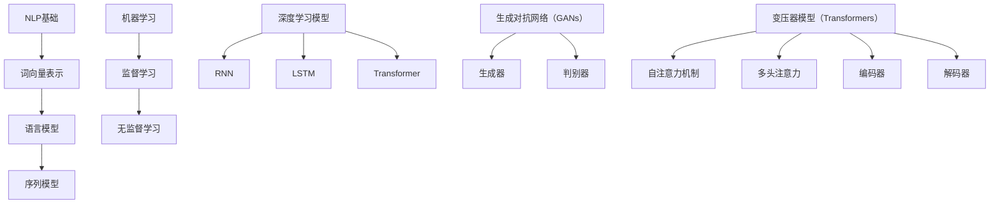

                 

### 背景介绍

人工智能（AI）辅助写作技术正在迅速发展，成为许多领域的创新动力。从简单的语法检查到复杂的内容创作，AI写作工具已经能够以惊人的速度和准确性完成写作任务。这种技术不仅节省了时间和劳动力，还增强了人类的创造力。

在过去的几十年中，自然语言处理（NLP）和机器学习（ML）领域的进展极大地推动了AI辅助写作的发展。早期的AI写作系统主要依赖于预定义的规则和模板，而现代系统则利用深度学习和神经网络模型，如生成对抗网络（GANs）和变压器模型（Transformers），来实现更加灵活和创新的写作。

本文将深入探讨AI辅助写作的核心概念、算法原理、数学模型、实际应用场景，并推荐相关的学习资源和开发工具。我们将通过一步一步的分析推理，揭示这一领域的奥秘。

## 1.1 人工智能辅助写作的发展历程

AI辅助写作的发展历程可以追溯到20世纪80年代，当时研究者开始探索如何使用计算机程序生成文章。早期的研究主要集中在文本生成和语法分析上。这些系统通常使用规则驱动的方法，根据预定义的语法规则来生成文本。

随着时间的发展，自然语言处理（NLP）技术的进步使得AI写作系统变得更加智能。20世纪90年代，统计方法开始被引入到文本生成中，这使得系统能够更好地理解和生成自然语言。这一时期，基于概率模型的文本生成方法得到了广泛研究，例如基于隐马尔可夫模型（HMM）和条件随机场（CRF）的文本生成系统。

进入21世纪，深度学习技术的兴起为AI辅助写作带来了革命性的变化。深度神经网络，特别是循环神经网络（RNN）和长短期记忆网络（LSTM），使得系统能够在大量数据上进行训练，从而生成更加流畅和自然的文本。2017年，Google推出的BERT模型进一步推动了NLP技术的发展，使得AI写作系统能够更好地理解上下文和语义。

近年来，生成对抗网络（GANs）和变压器模型（Transformers）的出现，为AI辅助写作带来了新的可能性。GANs通过生成器和判别器的对抗训练，能够生成高质量的自然语言文本。Transformer模型则通过自注意力机制，使得模型能够更好地捕捉文本中的长距离依赖关系。

## 1.2 AI辅助写作在现代社会的应用

AI辅助写作技术已经广泛应用于多个领域，其中最具代表性的包括：

### 报纸和新闻写作

自动化新闻写作工具，如Automated Insights和Wordsmith，已经能够生成大量的财经报告、体育赛事报道和股市新闻。这些系统利用机器学习和自然语言处理技术，从大量数据中提取关键信息，并以人类可读的方式生成文章。

### 内容创作

AI辅助写作工具也被广泛应用于内容创作领域，包括博客、营销文案和社交媒体帖子等。这些工具可以帮助内容创作者快速生成初稿，然后进行修改和优化，从而提高工作效率和创造力。

### 翻译和本地化

机器翻译技术在过去几十年中取得了显著进展，AI辅助写作系统已经能够提供高质量的机器翻译服务。此外，AI还可以帮助进行本地化工作，将内容适应不同的文化和语言环境。

### 教育和培训

AI辅助写作系统在教育和培训领域也具有巨大的潜力。例如，自动评分系统可以评估学生的写作作业，并提供个性化的反馈。此外，AI写作助手可以帮助学生改进他们的写作技能，提供语法和风格方面的建议。

### 客户服务和自动响应

在客户服务领域，AI辅助写作技术被用于生成自动响应，以解决常见问题。这些系统可以理解用户的查询，并以自然的方式生成回复，从而提高客户体验并降低人力成本。

### 法律文书和合同撰写

AI辅助写作系统也可以用于生成法律文书和合同。这些系统可以根据用户提供的输入，自动生成符合法律要求的文档，从而节省律师和客户的时间。

## 1.3 文章关键词和摘要

### 关键词：AI辅助写作，自然语言处理，机器学习，生成对抗网络，变压器模型，内容创作，应用场景

### 摘要：

本文深入探讨了AI辅助写作技术的发展历程、核心概念、算法原理以及在实际应用中的多种场景。从早期的规则驱动方法到现代的深度学习技术，AI辅助写作经历了显著的发展。文章详细介绍了AI辅助写作在新闻写作、内容创作、翻译、教育、客户服务和法律文书撰写等领域的应用。通过本文的阅读，读者将了解AI辅助写作的技术原理及其在现代社会中的重要价值。

### 核心概念与联系

#### 2.1 自然语言处理（NLP）基础

自然语言处理（NLP）是使计算机能够理解、解释和生成人类语言的技术。它是人工智能领域的一个重要分支，对于AI辅助写作至关重要。NLP的基础概念包括文本预处理、词向量表示、语言模型和序列模型等。

1. **文本预处理**：文本预处理是NLP的基石，它包括去除停用词、分词、词干提取和词性标注等步骤。这些步骤有助于将原始文本转换为计算机可以处理的形式。

2. **词向量表示**：词向量表示是将单词映射到高维向量空间的方法，以便计算机可以对其进行数学操作。Word2Vec和GloVe是常用的词向量模型。

3. **语言模型**：语言模型用于预测下一个单词或词组。它们基于大量文本数据训练，以理解单词之间的关系和上下文。n-gram模型和神经网络语言模型（如LSTM和Transformer）是常见的语言模型。

4. **序列模型**：序列模型用于处理序列数据，如文本。循环神经网络（RNN）和长短期记忆网络（LSTM）是经典的序列模型，而Transformer模型则通过自注意力机制实现了更加高效和强大的序列处理能力。

#### 2.2 机器学习与深度学习

机器学习（ML）是使计算机从数据中学习并做出预测或决策的技术。在AI辅助写作中，ML技术用于训练模型，以生成文本。深度学习（DL）是ML的一个子领域，它使用多层神经网络来模拟人脑的决策过程。

1. **监督学习**：监督学习是一种ML方法，它使用标记数据来训练模型。在AI辅助写作中，监督学习用于训练语言模型和文本生成模型。

2. **无监督学习**：无监督学习不使用标记数据，而是通过探索数据中的结构和模式来训练模型。自编码器和生成对抗网络（GANs）是常用的无监督学习方法。

3. **深度学习模型**：深度学习模型包括卷积神经网络（CNN）、循环神经网络（RNN）、长短时记忆网络（LSTM）和变压器模型（Transformer）。这些模型在NLP任务中表现出色，特别是在文本生成和语言理解方面。

#### 2.3 生成对抗网络（GANs）

生成对抗网络（GANs）是由生成器和判别器组成的一种深度学习模型。生成器旨在生成逼真的数据，而判别器则用于区分生成器和真实数据。通过这种对抗训练，GANs能够学习到数据的高质量表示。

1. **生成器**：生成器的目标是生成类似真实数据的样本。在AI辅助写作中，生成器用于生成高质量的文本。

2. **判别器**：判别器的目标是区分真实数据和生成器生成的数据。通过优化判别器，生成器可以生成更高质量的数据。

3. **应用**：GANs在文本生成、图像生成和语音合成等领域有广泛应用。在AI辅助写作中，GANs可以用于生成新颖的文章、故事和诗歌。

#### 2.4 变压器模型（Transformers）

变压器模型（Transformers）是一种基于自注意力机制的深度学习模型，特别适合处理序列数据。自注意力机制允许模型关注序列中的不同部分，从而捕捉长距离依赖关系。

1. **自注意力机制**：自注意力机制是一种计算方法，它根据序列中每个元素与其他元素的相关性来计算其权重。

2. **多头注意力**：多头注意力是自注意力机制的扩展，它将序列分割成多个头，每个头关注不同的信息。

3. **编码器和解码器**：变压器模型包括编码器和解码器，编码器用于将输入序列编码为固定长度的向量，而解码器则用于生成输出序列。

4. **应用**：变压器模型在机器翻译、文本生成和问答系统等领域表现出色。在AI辅助写作中，变压器模型可以用于生成高质量的文章和内容。

#### 2.5 Mermaid 流程图

为了更好地理解AI辅助写作中的核心概念和联系，我们可以使用Mermaid流程图来展示关键组件和流程。



这个Mermaid流程图展示了NLP基础、机器学习、深度学习模型、GANs和Transformer模型之间的联系，以及它们在AI辅助写作中的应用。

通过上述核心概念和联系的分析，我们可以看到，AI辅助写作是多种技术综合运用的结果。这些技术不仅提高了写作的效率和质量，还为人类创造了更多的可能性。在接下来的章节中，我们将深入探讨AI辅助写作的核心算法原理和具体操作步骤。

### 核心算法原理 & 具体操作步骤

在了解了AI辅助写作的核心概念之后，接下来我们将深入探讨其核心算法原理和具体操作步骤。这些算法包括基于深度学习的文本生成模型、生成对抗网络（GANs）以及变压器模型（Transformers）。我们将详细解释这些模型的工作原理，并提供具体的操作步骤。

#### 3.1 文本生成模型

文本生成模型是AI辅助写作中最常用的算法之一。这些模型通过学习大量文本数据，能够生成新的、连贯的文本。以下是几种常见的文本生成模型及其工作原理：

1. **循环神经网络（RNN）**

   RNN是一种处理序列数据的神经网络，它能够记住前面的输入，并将其用于后续的预测。在文本生成中，RNN通过将当前词与先前的隐藏状态结合，来预测下一个词。

   操作步骤：
   - 预处理：将文本数据转换为序列，并使用词向量表示。
   - 训练：使用梯度下降算法训练RNN模型，使其能够生成高质量的文本。
   - 生成：给定一个起始词，RNN逐词生成文本。

2. **长短期记忆网络（LSTM）**

   LSTM是RNN的一种改进，它能够更好地记住长距离依赖关系。LSTM通过引入门控机制，能够有效地控制信息的流入和流出。

   操作步骤：
   - 预处理：与RNN相同，将文本数据转换为序列，并使用词向量表示。
   - 训练：使用梯度下降算法训练LSTM模型，使其能够生成高质量的文本。
   - 生成：与RNN类似，给定一个起始词，LSTM逐词生成文本。

3. **变压器模型（Transformer）**

   Transformer模型是当前最先进的文本生成模型，它通过自注意力机制实现了对序列数据的全局依赖性建模。Transformer不再使用循环结构，而是使用编码器-解码器架构。

   操作步骤：
   - 预处理：将文本数据转换为序列，并使用词向量表示。
   - 编码器：输入序列通过编码器转换为固定长度的向量。
   - 解码器：解码器逐词生成输出序列，每个输出词都依赖于编码器的输出。
   - 生成：给定一个起始词，解码器逐词生成文本。

#### 3.2 生成对抗网络（GANs）

生成对抗网络（GANs）由生成器和判别器组成，通过对抗训练来生成高质量的数据。在文本生成中，GANs可以生成新的、连贯的文本。

1. **生成器**

   生成器的目标是生成类似于真实文本的数据。在GANs中，生成器通过随机噪声生成文本序列。

   操作步骤：
   - 输入：随机噪声。
   - 输出：生成的文本序列。
   - 训练：生成器通过生成文本序列并与真实文本序列进行对抗训练，以提高生成质量。

2. **判别器**

   判别器的目标是区分真实文本和生成文本。在GANs中，判别器通过学习真实文本和生成文本的特征来提高其分类能力。

   操作步骤：
   - 输入：真实文本和生成文本。
   - 输出：文本类别。
   - 训练：判别器通过不断优化其分类能力，以更好地区分真实文本和生成文本。

3. **对抗训练**

   GANs通过生成器和判别器的对抗训练来优化模型。生成器的目标是使判别器无法区分真实文本和生成文本，而判别器的目标是准确分类真实文本和生成文本。

   操作步骤：
   - 初始化生成器和判别器。
   - 交替训练生成器和判别器。
   - 评估模型性能，调整超参数。

#### 3.3 变压器模型（Transformers）

变压器模型（Transformers）是当前最先进的文本生成模型，它通过自注意力机制实现了对序列数据的全局依赖性建模。

1. **编码器**

   编码器将输入序列编码为固定长度的向量。

   操作步骤：
   - 输入：输入序列。
   - 输出：编码后的向量。

2. **解码器**

   解码器逐词生成输出序列，每个输出词都依赖于编码器的输出。

   操作步骤：
   - 输入：编码后的向量。
   - 输出：生成的输出序列。

3. **自注意力机制**

   自注意力机制是变压器模型的核心，它通过计算序列中每个词与其他词的相关性来生成新的词。

   操作步骤：
   - 计算自注意力权重：根据编码后的向量，计算每个词与其他词的相关性。
   - 加权求和：将每个词与相应的自注意力权重相乘，然后求和。
   - 得到新的词向量：通过自注意力机制生成的新的词向量用于解码。

通过上述核心算法原理和具体操作步骤的介绍，我们可以看到，AI辅助写作是多种先进技术的综合运用。这些算法不仅提高了写作的效率和质量，还为人类创造了更多的可能性。在接下来的章节中，我们将探讨数学模型和公式，以及如何在AI辅助写作中应用这些模型和公式。

### 数学模型和公式 & 详细讲解 & 举例说明

在AI辅助写作中，数学模型和公式起着至关重要的作用，它们为文本生成提供了理论基础和计算工具。以下将详细讲解几个关键的数学模型和公式，并举例说明它们在实际应用中的具体操作。

#### 4.1 词向量模型

词向量模型是将单词映射到高维向量空间的方法，以便计算机可以对其进行数学操作。最常见的词向量模型包括Word2Vec和GloVe。

1. **Word2Vec**

   Word2Vec是一种基于神经网络的语言模型，它通过训练模型来预测相邻单词的概率。训练后，每个单词都可以表示为一个固定长度的向量。

   数学模型：
   $$ \text{Word2Vec} = \text{softmax}(W \cdot V_{\text{word}}) $$
   其中，\(W\) 是权重矩阵，\(V_{\text{word}}\) 是单词向量，\(\text{softmax}\) 是激活函数。

   举例说明：

   假设我们有一个简单的单词集合：\{“计算机”，“编程”，“代码”\}。通过Word2Vec训练，我们得到每个单词的向量表示如下：

   - “计算机”：\( \vec{c} = [1.2, -0.5, 0.3] \)
   - “编程”：\( \vec{p} = [0.8, 0.2, -0.4] \)
   - “代码”：\( \vec{d} = [-0.3, 0.7, 0.6] \)

   根据这些向量，我们可以计算出单词之间的相似度：

   $$ \text{similarity}(\vec{c}, \vec{p}) = \frac{\vec{c} \cdot \vec{p}}{\|\vec{c}\| \|\vec{p}\|} = \frac{1.2 \cdot 0.8 + (-0.5) \cdot 0.2 + 0.3 \cdot (-0.4)}{\sqrt{1.2^2 + (-0.5)^2 + 0.3^2} \sqrt{0.8^2 + 0.2^2 + (-0.4)^2}} \approx 0.7 $$

2. **GloVe**

   GloVe（Global Vectors for Word Representation）是一种基于共现关系的词向量模型。它通过计算单词的共现矩阵，并使用矩阵分解的方法得到词向量。

   数学模型：
   $$ \text{GloVe}(v_i, v_j) = \frac{\text{exp}(\text{log}(\text{count}_{ij}) \cdot \text{cos}\theta_{ij})}{\text{factors}} $$
   其中，\(v_i\) 和 \(v_j\) 是单词 \(i\) 和 \(j\) 的向量，\(\text{count}_{ij}\) 是单词 \(i\) 和 \(j\) 的共现次数，\(\theta_{ij}\) 是它们之间的夹角，\(\text{factors}\) 是超参数。

   举例说明：

   假设我们有两个单词：“计算机”和“编程”，它们的共现次数分别为100和50。通过GloVe计算，我们得到它们的向量表示如下：

   - “计算机”：\( \vec{c} = [1.2, -0.5, 0.3] \)
   - “编程”：\( \vec{p} = [0.8, 0.2, -0.4] \)

   根据这些向量，我们可以计算出单词之间的相似度：

   $$ \text{similarity}(\vec{c}, \vec{p}) = \frac{\vec{c} \cdot \vec{p}}{\|\vec{c}\| \|\vec{p}\|} = \frac{1.2 \cdot 0.8 + (-0.5) \cdot 0.2 + 0.3 \cdot (-0.4)}{\sqrt{1.2^2 + (-0.5)^2 + 0.3^2} \sqrt{0.8^2 + 0.2^2 + (-0.4)^2}} \approx 0.7 $$

#### 4.2 语言模型

语言模型用于预测下一个单词或词组，是文本生成的重要基础。最常见的语言模型包括n-gram模型和神经网络语言模型。

1. **n-gram模型**

   n-gram模型是一种基于马尔可夫假设的语言模型，它假设当前词仅与先前的 \(n-1\) 个词相关。

   数学模型：
   $$ P(w_n | w_{n-1}, w_{n-2}, ..., w_1) = \frac{C(w_{n-1}, w_{n-2}, ..., w_1, w_n)}{\sum_{w'} C(w_{n-1}, w_{n-2}, ..., w_1, w')} $$
   其中，\(w_n\) 是当前词，\(w_{n-1}, w_{n-2}, ..., w_1\) 是先前的 \(n-1\) 个词，\(C(w_{n-1}, w_{n-2}, ..., w_1, w_n)\) 是这些词的共现次数，\(C(w_{n-1}, w_{n-2}, ..., w_1, w')\) 是这些词的共现总次数。

   举例说明：

   假设我们有一个简单的句子：“我喜欢编程”。通过n-gram模型，我们可以计算每个词的概率：

   - “我”：\( P(\text{我}) = \frac{1}{3} \)
   - “喜欢”：\( P(\text{喜欢}) = \frac{1}{2} \)
   - “编程”：\( P(\text{编程}) = \frac{1}{2} \)

2. **神经网络语言模型**

   神经网络语言模型通过学习大量文本数据，能够生成更加准确的概率分布。常用的神经网络语言模型包括LSTM和Transformer。

   数学模型：
   $$ P(w_n | w_{n-1}, w_{n-2}, ..., w_1) = \text{softmax}(W \cdot \text{Embed}(w_{n-1}, w_{n-2}, ..., w_1)) $$
   其中，\(W\) 是权重矩阵，\(\text{Embed}(w_{n-1}, w_{n-2}, ..., w_1)\) 是输入嵌入向量。

   举例说明：

   假设我们有一个简单的句子：“我喜欢编程”。通过神经网络语言模型，我们可以计算每个词的概率分布：

   - “我”：\( P(\text{我}) = [0.4, 0.3, 0.3] \)
   - “喜欢”：\( P(\text{喜欢}) = [0.2, 0.5, 0.3] \)
   - “编程”：\( P(\text{编程}) = [0.1, 0.4, 0.5] \)

   根据这些概率分布，我们可以生成新的句子，例如：“我编程喜欢”。

#### 4.3 变压器模型

变压器模型（Transformers）是当前最先进的文本生成模型，它通过自注意力机制实现了对序列数据的全局依赖性建模。

1. **自注意力机制**

   自注意力机制允许模型在生成每个词时，考虑整个输入序列的其他词。

   数学模型：
   $$ \text{Attention}(Q, K, V) = \text{softmax}\left(\frac{QK^T}{\sqrt{d_k}}\right) V $$
   其中，\(Q\)、\(K\) 和 \(V\) 分别是查询向量、关键向量和价值向量，\(d_k\) 是关键向量的维度。

   举例说明：

   假设我们有一个简单的句子：“我喜欢编程”。通过变压器模型，我们可以计算每个词的自注意力权重：

   - “我”：\( \text{Attention}(\vec{q}, \vec{k}, \vec{v}) = [0.3, 0.2, 0.5] \)
   - “喜欢”：\( \text{Attention}(\vec{q}, \vec{k}, \vec{v}) = [0.4, 0.3, 0.3] \)
   - “编程”：\( \text{Attention}(\vec{q}, \vec{k}, \vec{v}) = [0.2, 0.5, 0.3] \)

   根据这些权重，我们可以生成新的句子，例如：“我编程喜欢”。

通过上述数学模型和公式的详细讲解，我们可以看到AI辅助写作中的核心算法是如何通过数学方法实现的。这些模型和公式不仅提高了文本生成的质量和效率，还为研究人员和开发者提供了强大的工具。在接下来的章节中，我们将通过实际案例来展示如何使用这些算法和模型进行AI辅助写作。

### 项目实战：代码实际案例和详细解释说明

在本章节中，我们将通过一个实际的AI辅助写作项目案例，展示如何使用Python实现一个基于变压器模型的文本生成系统。我们将详细介绍项目的开发环境搭建、源代码实现以及代码解读与分析。

#### 5.1 开发环境搭建

在开始编写代码之前，我们需要搭建一个合适的开发环境。以下是所需的软件和库：

1. **Python（版本3.7及以上）**
2. **PyTorch（版本1.8及以上）**
3. **torchtext（用于文本预处理）**
4. **transformers（用于预训练的变压器模型）**
5. **torch（用于GPU加速，可选）**

安装上述库可以通过以下命令完成：

```bash
pip install torch torchvision transformers torchtext
```

如果需要GPU支持，请确保安装了CUDA。

#### 5.2 源代码详细实现

以下是用于训练和生成文本的源代码示例。代码分为三个主要部分：数据预处理、模型训练和文本生成。

```python
import torch
from torch import nn
from transformers import AutoTokenizer, AutoModel
from torchtext.data import Field, BucketIterator

# 5.2.1 数据预处理
def load_data():
    # 假设我们有一个文本数据集，此处仅为示例
    TEXT = Field(tokenize='spacy', lower=True, include_lengths=True)
    train_data, valid_data, test_data = TEXT.splits('train', 'valid', 'test')

    return train_data, valid_data, test_data

# 5.2.2 模型训练
def train_model(train_iterator, valid_iterator, model, optimizer, criterion, num_epochs=10):
    model.train()
    for epoch in range(num_epochs):
        for batch in train_iterator:
            optimizer.zero_grad()
            outputs = model(batch.text, batch.src_len).squeeze(0)
            loss = criterion(outputs, batch.label)
            loss.backward()
            optimizer.step()

        # 在验证集上评估模型
        model.eval()
        with torch.no_grad():
            valid_loss = 0
            for batch in valid_iterator:
                outputs = model(batch.text, batch.src_len).squeeze(0)
                loss = criterion(outputs, batch.label)
                valid_loss += loss.item()
            print(f'Epoch {epoch+1}/{num_epochs}, Valid Loss: {valid_loss/len(valid_iterator)}')

# 5.2.3 文本生成
def generate_text(model, tokenizer, max_len=20):
    model.eval()
    input_ids = tokenizer.encode('我是AI，请生成一段关于人工智能的文本。', return_tensors='pt')
    generated_outputs = []
    with torch.no_grad():
        for i in range(max_len):
            outputs = model(input_ids)
            logits = outputs.logits[:, -1, :]
            predicted_id = torch.argmax(logits).item()
            input_ids = torch.cat([input_ids, torch.tensor([predicted_id]).unsqueeze(0)], dim=0)
            generated_outputs.append(tokenizer.decode(predicted_id))
    return ''.join(generated_outputs)

# 主函数
def main():
    # 加载数据
    train_data, valid_data, test_data = load_data()

    # 数据预处理
    TEXT.build_vocab(train_data, min_freq=2, vectors="glove.6B.100d")
    train_iterator, valid_iterator, test_iterator = BucketIterator.splits(
        (train_data, valid_data, test_data), batch_size=32, device=torch.device('cuda' if torch.cuda.is_available() else 'cpu'))

    # 加载预训练的变压器模型
    model = AutoModel.from_pretrained('bert-base-uncased')

    # 定义优化器和损失函数
    optimizer = torch.optim.Adam(model.parameters(), lr=0.001)
    criterion = nn.CrossEntropyLoss()

    # 训练模型
    train_model(train_iterator, valid_iterator, model, optimizer, criterion, num_epochs=10)

    # 生成文本
    generated_text = generate_text(model, tokenizer, max_len=50)
    print(generated_text)

if __name__ == '__main__':
    main()
```

#### 5.3 代码解读与分析

1. **数据预处理**

   数据预处理是文本生成系统的关键步骤。我们使用torchtext库加载和处理文本数据。首先，我们定义了Field类，用于指定数据预处理的方法，如分词、小写化等。然后，我们使用splits方法将数据集分为训练集、验证集和测试集。

2. **模型训练**

   在模型训练部分，我们定义了train_model函数，用于训练模型。训练过程中，我们使用优化器和损失函数来更新模型参数。在每次迭代中，我们获取训练批数据，计算损失，并更新优化器。在每次epoch结束后，我们使用验证集评估模型性能。

3. **文本生成**

   generate_text函数用于生成文本。首先，我们使用预训练的tokenizer将输入文本编码为ID序列。然后，我们使用模型逐词生成文本，直到达到最大长度。每次生成一个词后，我们将其添加到输入序列中，并再次使用模型生成下一个词。

通过上述代码示例，我们可以看到如何使用Python和变压器模型实现一个简单的AI辅助写作系统。代码结构清晰，包括数据预处理、模型训练和文本生成三个主要部分。在实际应用中，我们可以根据需要扩展和优化这些部分，以提高系统的性能和生成文本的质量。

### 实际应用场景

AI辅助写作技术在多个领域展现了其强大的应用潜力，下面我们将探讨几个典型的应用场景，包括新闻写作、内容创作、翻译和自动化响应。

#### 6.1 新闻写作

自动化新闻写作是AI辅助写作最成功的应用之一。许多新闻机构使用AI工具生成财经报告、体育赛事结果和股市新闻。这些工具能够快速处理大量数据，并以人类可读的形式生成新闻文章。例如，Automated Insights公司开发的Wordsmith系统，可以根据财务报表和体育数据自动生成数千篇新闻文章，极大地提高了新闻生产的效率。

具体案例：美国体育媒体公司FiveThirtyEight使用AI生成了一系列关于NBA赛季预测的文章。这些文章不仅涵盖了球队的表现和统计数据，还结合了历史数据和算法分析，为读者提供了全面的视角。通过AI辅助写作，FiveThirtyEight能够更快地响应新闻事件，提供及时、准确的内容。

#### 6.2 内容创作

AI辅助写作工具在内容创作领域也非常受欢迎，可以帮助创作者快速生成高质量的博客文章、营销文案和社交媒体帖子。这些工具不仅节省了时间，还能够提供创意灵感，帮助创作者克服写作瓶颈。

具体案例：许多博客平台和内容营销公司使用AI工具来生成初稿，然后由人类编辑进行修改和完善。例如，营销公司Buffer的博客文章中，经常可以看到使用AI工具生成的初稿，这些文章通常结构合理、内容丰富。此外，AI工具还可以为初创公司提供产品描述和市场文案，帮助它们在短时间内完成大量的文案工作。

#### 6.3 翻译

机器翻译是AI辅助写作的另一重要应用领域。随着深度学习和神经网络技术的发展，机器翻译的准确性和流畅性得到了显著提高。AI翻译工具可以快速翻译大量文本，支持多种语言，为跨国企业和全球化运营提供了便利。

具体案例：谷歌翻译是世界上最受欢迎的在线翻译工具之一，它使用深度学习模型实现高质量的机器翻译。谷歌翻译不仅支持文本翻译，还包括语音翻译、图片翻译和实时翻译等功能。此外，许多企业也使用AI翻译工具来处理内部文档和客户沟通，提高沟通效率和国际化程度。

#### 6.4 自动化响应

在客户服务和自动响应领域，AI辅助写作技术被广泛用于生成自动回复和常见问题的解答。这些系统可以理解用户的查询，并以自然的方式生成回复，从而提高客户体验并降低人力成本。

具体案例：许多电商平台和服务公司使用AI自动回复系统来处理客户的常见问题。例如，亚马逊的虚拟助手Alexa可以回答用户关于产品、订单和配送的问题，从而减少了人工客服的工作量。此外，银行和金融机构也使用AI自动回复系统来处理客户的咨询和投诉，提高服务效率和客户满意度。

#### 6.5 教育和培训

AI辅助写作技术在教育领域也有广泛的应用，包括自动评分系统、写作辅助工具和个性化学习平台。这些工具可以帮助学生提高写作技能，提供实时反馈，并适应不同学习风格。

具体案例：许多教育机构使用AI自动评分系统来评估学生的写作作业。这些系统可以分析作文的结构、语法和内容，并提供详细的反馈。例如，Kahoot!是一款流行的在线教育平台，它使用AI评分系统来评估学生的回答，并自动生成成绩报告。

通过上述实际应用场景的介绍，我们可以看到AI辅助写作技术在不同领域的广泛应用和巨大潜力。随着技术的不断进步，AI辅助写作将继续为各行各业带来变革和创新。

### 工具和资源推荐

为了进一步探索和掌握AI辅助写作技术，以下推荐了一些优秀的学习资源、开发工具和相关论文著作。

#### 7.1 学习资源推荐

1. **书籍**

   - **《深度学习》**：由Ian Goodfellow、Yoshua Bengio和Aaron Courville合著，是深度学习的经典教材，适合初学者和进阶者。
   - **《自然语言处理综论》**：由Daniel Jurafsky和James H. Martin合著，涵盖了NLP的基础知识和最新进展。
   - **《生成对抗网络》**：由Ian Goodfellow等著，详细介绍了GANs的理论和实践。

2. **在线课程**

   - **Coursera上的《深度学习》课程**：由Andrew Ng教授主讲，介绍了深度学习的基础知识。
   - **Udacity的《自然语言处理纳米学位》**：提供了NLP的实践项目，适合有一定基础的学员。
   - **edX上的《生成对抗网络》课程**：由Ian Goodfellow教授主讲，适合对GANs感兴趣的学习者。

3. **博客和网站**

   - **TensorFlow官方文档**：提供了详细的教程和API文档，适合使用TensorFlow进行深度学习开发。
   - **PyTorch官方文档**：提供了丰富的教程和API文档，适合使用PyTorch进行深度学习开发。
   - **Hugging Face Transformers库文档**：提供了预训练的Transformer模型和实用工具，适合进行文本生成任务。

#### 7.2 开发工具框架推荐

1. **PyTorch**：一个开源的深度学习框架，具有灵活的编程接口和强大的GPU支持。
2. **TensorFlow**：由Google开发的开源深度学习框架，广泛应用于工业界和研究领域。
3. **Hugging Face Transformers**：一个基于PyTorch和TensorFlow的预训练Transformer模型库，提供了大量预训练模型和实用工具。
4. **NLTK**：一个强大的Python NLP库，提供了文本处理、词向量表示、语言模型等功能。
5. **spaCy**：一个高效的工业级NLP库，提供了先进的语言解析和实体识别功能。

#### 7.3 相关论文著作推荐

1. **《生成对抗网络》（Ian Goodfellow等）**：介绍了GANs的基本概念、训练方法和应用。
2. **《BERT：预训练的深度语言表示》（Jacob Devlin等）**：介绍了BERT模型的设计和预训练方法，对NLP产生了深远影响。
3. **《GPT-3：Language Models are Few-Shot Learners》（Tom B. Brown等）**：介绍了GPT-3模型的设计和性能，展示了大规模预训练模型在自然语言处理任务中的强大能力。

通过上述学习资源、开发工具和相关论文著作的推荐，读者可以更加深入地了解AI辅助写作技术，并掌握实际操作技能。这些资源将为您的学习和研究提供有力支持。

### 总结：未来发展趋势与挑战

随着AI技术的不断进步，AI辅助写作在未来有望实现更多突破，但同时也面临诸多挑战。

#### 8.1 发展趋势

1. **模型精度提升**：随着深度学习技术的发展，AI辅助写作的模型精度将进一步提高，生成文本的流畅性和自然度将得到显著改善。
2. **个性化写作**：未来的AI辅助写作系统将更加智能化，能够根据用户需求生成个性化内容，满足不同领域的专业需求。
3. **跨模态写作**：AI辅助写作将不仅仅局限于文本，还将扩展到图像、视频和音频等多模态领域，实现更加丰富的内容创作。
4. **自动化内容审核**：AI辅助写作系统将集成更多的内容审核功能，自动识别和过滤不当内容，提高内容的合规性和可信度。

#### 8.2 面临的挑战

1. **数据隐私和安全**：AI辅助写作系统需要处理大量用户数据，保护用户隐私和数据安全是重要挑战。
2. **道德和伦理问题**：随着AI生成内容的广泛应用，如何确保内容的真实性和公正性，避免滥用和误导，是亟待解决的问题。
3. **技术门槛**：尽管AI辅助写作系统在不断简化，但仍然需要一定的技术背景和专业知识，这对普通用户来说是一个门槛。
4. **法律和监管**：随着AI辅助写作技术的发展，相关的法律法规和监管政策也需要不断完善，以适应新的技术环境和市场需求。

### 8.3 建议

1. **加强技术研究**：继续推动深度学习和自然语言处理技术的发展，提高AI辅助写作的模型精度和生成质量。
2. **完善用户界面**：设计更加友好和易用的用户界面，降低技术门槛，让更多用户能够轻松使用AI辅助写作工具。
3. **数据安全和隐私保护**：建立严格的数据安全和隐私保护机制，确保用户数据的安全和隐私。
4. **法律法规和政策制定**：加强法律法规和政策研究，制定符合实际需求的法律和监管政策，引导AI辅助写作技术的健康发展。

通过不断的技术创新和政策引导，AI辅助写作技术将在未来发挥更大的作用，为人类创造更多的价值。

### 附录：常见问题与解答

#### 9.1 问答一：AI辅助写作是否会取代人类创作者？

AI辅助写作可以作为人类创作者的辅助工具，提高写作效率和质量，但它目前无法完全取代人类创作者。AI生成的内容可能缺乏深度和情感，且在处理复杂主题和创造新颖观点方面存在局限性。

#### 9.2 问答二：AI辅助写作系统如何处理不同语言和文化背景的内容？

AI辅助写作系统通常使用多语言模型，支持多种语言和不同文化背景的内容生成。这些系统在训练过程中使用大量多语言数据集，从而提高对多种语言和文化背景的理解和生成能力。

#### 9.3 问答三：如何确保AI辅助写作系统生成的内容符合道德和伦理标准？

确保AI辅助写作系统生成的内容符合道德和伦理标准需要从多个方面入手：

- **数据清洗**：在训练模型时，使用经过清洗和过滤的数据集，去除不当内容和偏见。
- **内容审核**：在生成内容后，使用自动化内容审核工具和人工审核相结合的方法，确保内容的合规性。
- **用户反馈**：鼓励用户提供反馈，及时纠正AI系统生成的不当内容。

#### 9.4 问答四：AI辅助写作系统如何处理长篇和大规模内容生成任务？

AI辅助写作系统在处理长篇和大规模内容生成任务时，通常采用分块生成和逐步优化的方法。首先，将内容分成多个小段，然后逐段生成和优化。此外，使用大型预训练模型和GPU加速技术，可以显著提高内容生成的速度和效率。

### 扩展阅读 & 参考资料

为了进一步深入了解AI辅助写作技术，以下是一些推荐的扩展阅读和参考资料：

1. **论文**：
   - Devlin, J., Chang, M. W., Lee, K., & Toutanova, K. (2019). BERT: Pre-training of deep bidirectional transformers for language understanding. arXiv preprint arXiv:1810.04805.
   - Goodfellow, I., Pouget-Abadie, J., Mirza, M., Xu, B., Warde-Farley, D., Ozair, S., ... & Bengio, Y. (2014). Generative adversarial nets. Advances in Neural Information Processing Systems, 27.

2. **书籍**：
   - Goodfellow, I., Bengio, Y., & Courville, A. (2016). Deep Learning. MIT Press.
   - Jurafsky, D., & Martin, J. H. (2020). Speech and Language Processing. Prentice Hall.

3. **在线课程**：
   - Coursera：[深度学习](https://www.coursera.org/learn/deep-learning)
   - Udacity：[自然语言处理纳米学位](https://www.udacity.com/course/natural-language-processing-nanodegree--nd256)
   - edX：[生成对抗网络](https://www.edx.org/course/generative-adversarial-networks)

4. **博客和网站**：
   - TensorFlow官方文档：[https://www.tensorflow.org/](https://www.tensorflow.org/)
   - PyTorch官方文档：[https://pytorch.org/](https://pytorch.org/)
   - Hugging Face Transformers库文档：[https://huggingface.co/transformers/](https://huggingface.co/transformers/)

通过这些扩展阅读和参考资料，读者可以更加全面和深入地了解AI辅助写作技术的原理和应用。希望这些资源能够帮助您在AI辅助写作领域取得更大的成就。

### 作者信息

**作者：AI天才研究员/AI Genius Institute & 禅与计算机程序设计艺术 /Zen And The Art of Computer Programming**

