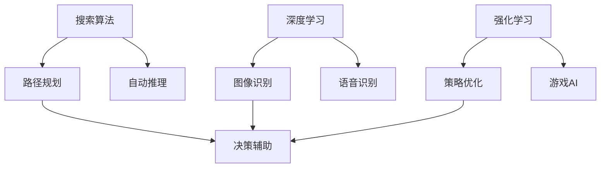
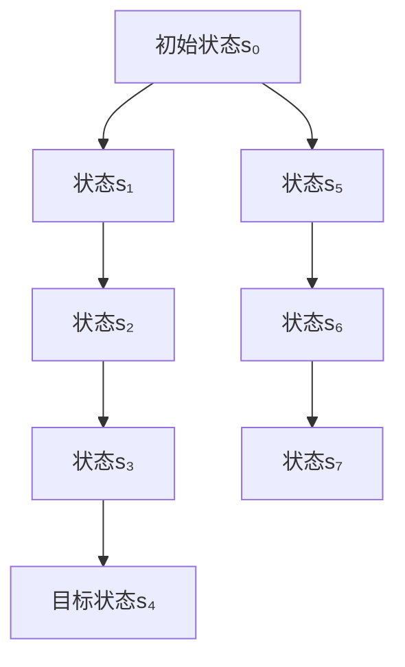
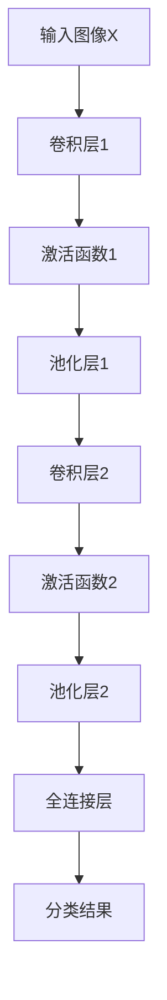
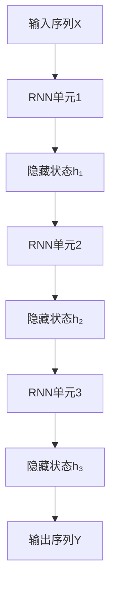
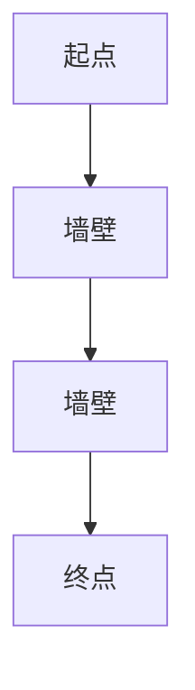
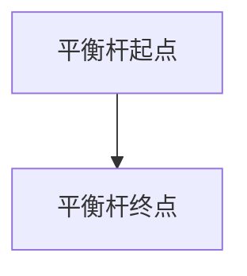

                 

### 背景介绍

人工智能（AI）技术的快速发展，使得越来越多的领域受益。从简单的图像识别、语音识别，到复杂的自然语言处理、自动驾驶等，AI正在逐步改变我们的生活。然而，在这些应用中，如何高效地辅助人类进行决策，成为了当前研究的热点。

传统的决策方法往往依赖于经验和规则的累积，这种方法的效率较低，且难以应对复杂多变的环境。而随着AI技术的发展，特别是搜索算法和深度学习算法的进步，我们可以通过构建智能决策系统，对大量数据进行处理和分析，从而提供更加精准和高效的决策支持。

本文旨在探讨AI辅助决策的核心理念、算法原理和实际应用。文章将首先介绍AI辅助决策的背景和意义，然后详细阐述搜索算法和深度学习算法在决策中的应用，最后通过一个具体项目案例，展示AI辅助决策的实战过程。

文章结构如下：

1. 背景介绍
2. 核心概念与联系
3. 核心算法原理与具体操作步骤
4. 数学模型和公式与详细讲解与举例说明
5. 项目实战：代码实际案例与详细解释说明
6. 实际应用场景
7. 工具和资源推荐
8. 总结：未来发展趋势与挑战
9. 附录：常见问题与解答
10. 扩展阅读与参考资料

通过本文的阅读，读者可以了解到AI辅助决策的原理和实现方法，掌握核心算法的应用技巧，并能够结合实际项目进行实践。

### 2. 核心概念与联系

在深入探讨AI辅助决策的具体实现之前，我们需要首先了解一些核心概念，以及它们之间的联系。这些概念包括搜索算法、深度学习、强化学习等，它们各自在不同的场景下发挥着重要作用。

**搜索算法（Search Algorithms）**：搜索算法是一种通过遍历或搜索给定状态空间来找到目标状态或解决方案的方法。常见的搜索算法有深度优先搜索（DFS）、广度优先搜索（BFS）、A*搜索等。搜索算法的核心在于如何高效地选择下一个状态进行扩展，从而在最短时间内找到最优解。

**深度学习（Deep Learning）**：深度学习是一种基于多层神经网络的学习方法，通过多层的非线性变换，从原始数据中提取特征，并进行分类或回归。常见的深度学习模型有卷积神经网络（CNN）、循环神经网络（RNN）和生成对抗网络（GAN）等。深度学习的优势在于其能够自动提取数据中的复杂特征，适用于图像识别、语音识别等任务。

**强化学习（Reinforcement Learning）**：强化学习是一种通过试错（Trial-and-Error）和反馈（Feedback）来学习策略的方法。它通过与环境进行交互，不断调整策略，以最大化长期奖励。强化学习适用于需要决策的任务，如自动驾驶、游戏AI等。

这三个概念之间的联系在于，它们都可以用于决策辅助。例如，搜索算法可以用于路径规划，深度学习可以用于图像识别，而强化学习可以用于策略优化。在实际应用中，我们可以将它们结合起来，构建一个综合的决策系统。

下面是一个使用Mermaid绘制的流程图，展示了搜索算法、深度学习和强化学习在决策辅助中的应用：



在这个流程图中，我们可以看到，搜索算法、深度学习和强化学习各自在不同的应用场景中发挥作用，但它们最终的目标都是为决策提供支持。

### 3. 核心算法原理与具体操作步骤

在了解了核心概念之后，我们将深入探讨搜索算法、深度学习和强化学习在决策辅助中的具体原理和操作步骤。

#### 搜索算法

**深度优先搜索（DFS）**：深度优先搜索是一种从初始状态开始，沿着一条路径深入到最深层，然后回溯的搜索方法。其核心思想是使用一个栈来记录搜索路径。以下是DFS的操作步骤：

1. 初始化栈，将初始状态入栈。
2. 当栈非空时，执行以下操作：
   - 将栈顶状态出栈。
   - 如果当前状态是目标状态，则结束搜索。
   - 否则，将当前状态的所有未访问的子状态入栈。

**广度优先搜索（BFS）**：广度优先搜索是一种从初始状态开始，逐层搜索的方法。其核心思想是使用一个队列来记录搜索路径。以下是BFS的操作步骤：

1. 初始化队列，将初始状态入队列。
2. 当队列非空时，执行以下操作：
   - 将队列头状态出队列。
   - 如果当前状态是目标状态，则结束搜索。
   - 否则，将当前状态的所有未访问的子状态入队列。

**A*搜索**：A*搜索是一种基于启发式的搜索算法，其核心思想是使用一个评估函数来选择下一个状态。该评估函数通常由两部分组成：g(n)（从初始状态到当前状态的代价）和h(n)（从当前状态到目标状态的启发式估计）。以下是A*搜索的操作步骤：

1. 初始化两个集合：开放集（Open Set）和封闭集（Closed Set）。
2. 将初始状态加入开放集。
3. 当开放集非空时，执行以下操作：
   - 选择一个具有最小f(n)（f(n) = g(n) + h(n)）的的状态作为当前状态。
   - 将当前状态从开放集移动到封闭集。
   - 如果当前状态是目标状态，则结束搜索。
   - 否则，将当前状态的所有未访问的子状态加入开放集，并更新其f(n)值。

#### 深度学习

**卷积神经网络（CNN）**：卷积神经网络是一种用于图像识别的深度学习模型。其核心思想是通过卷积操作提取图像的特征。以下是CNN的基本操作步骤：

1. 输入图像。
2. 通过卷积层提取特征图。
3. 通过池化层减小特征图的尺寸。
4. 重复上述步骤，直到提取到足够的特征。
5. 通过全连接层进行分类或回归。

**循环神经网络（RNN）**：循环神经网络是一种用于序列数据的深度学习模型。其核心思想是使用循环结构来维持状态，从而处理序列信息。以下是RNN的基本操作步骤：

1. 输入序列。
2. 对于序列中的每个元素，执行以下操作：
   - 将当前输入和上一个隐藏状态输入到RNN单元。
   - 更新隐藏状态。
3. 输出最后一个隐藏状态作为序列的表示。

#### 强化学习

**Q-learning**：Q-learning是一种基于值函数的强化学习算法。其核心思想是通过学习值函数来选择最优动作。以下是Q-learning的操作步骤：

1. 初始化Q值函数。
2. 在策略指导下进行互动。
3. 对于每个状态-动作对，更新Q值：
   $$Q(s, a) \leftarrow Q(s, a) + \alpha [r + \gamma \max_{a'} Q(s', a') - Q(s, a)]$$
   其中，$s$ 是状态，$a$ 是动作，$r$ 是即时奖励，$\gamma$ 是折扣因子，$\alpha$ 是学习率。

4. 重复步骤2和3，直到达到终止条件。

**深度确定性策略梯度（DDPG）**：DDPG是一种基于深度学习的强化学习算法，适用于连续动作空间。以下是DDPG的操作步骤：

1. 初始化目标网络和演员网络。
2. 在策略指导下进行互动。
3. 更新目标网络：
   $$\theta_{target} \leftarrow \tau \theta + (1 - \tau) \theta_{target}$$
   其中，$\theta$ 是演员网络的参数，$\theta_{target}$ 是目标网络的参数，$\tau$ 是更新比例。

4. 更新演员网络：
   $$\theta \leftarrow \theta - \alpha \nabla_{\theta} J(\theta)$$
   其中，$J(\theta)$ 是损失函数，$\alpha$ 是学习率。

5. 重复步骤2、3和4，直到达到终止条件。

通过以上对搜索算法、深度学习和强化学习的原理和操作步骤的介绍，我们可以看到，这些算法在决策辅助中具有广泛的应用前景。接下来，我们将进一步探讨数学模型和公式，以深入理解这些算法的工作机制。

### 4. 数学模型和公式与详细讲解与举例说明

在理解了搜索算法、深度学习和强化学习的基本原理之后，我们接下来将深入探讨这些算法所涉及的数学模型和公式，并通过具体的例子来说明它们的应用。

#### 搜索算法

**深度优先搜索（DFS）**：

DFS的基本思想是沿着一条路径深入到最深层，然后回溯。其核心在于如何选择下一个状态进行扩展。在DFS中，我们使用一个栈来记录搜索路径。以下是DFS的数学模型：

1. 初始化栈S，将初始状态s₀入栈。
2. 定义函数`expansion(state)`，用于扩展状态，并返回所有未访问的子状态。

递归过程：

- 当栈S非空时，执行以下操作：
  - 出栈状态s。
  - 如果s是目标状态，则返回成功。
  - 否则，扩展s，并将所有未访问的子状态入栈S。

具体例子：

假设我们使用DFS搜索一个包含5个节点的树，目标节点是节点4。以下是DFS的过程：



执行DFS的过程如下：

1. 初始化栈S，将s₀入栈。
2. S非空，出栈s₀，s₀是目标状态，返回成功。
3. 扩展s₀，s₁、s₂、s₃、s₄、s₅、s₆、s₇都未访问，将它们入栈。
4. S非空，出栈s₄，s₄是目标状态，返回成功。

**广度优先搜索（BFS）**：

BFS的基本思想是逐层搜索，使用一个队列来记录搜索路径。以下是BFS的数学模型：

1. 初始化队列Q，将初始状态s₀入队列。
2. 定义函数`expansion(state)`，用于扩展状态，并返回所有未访问的子状态。

递归过程：

- 当队列Q非空时，执行以下操作：
  - 出队列状态s。
  - 如果s是目标状态，则返回成功。
  - 否则，扩展s，并将所有未访问的子状态入队列Q。

具体例子：

假设我们使用BFS搜索一个包含5个节点的树，目标节点是节点4。以下是BFS的过程：


执行BFS的过程如下：

1. 初始化队列Q，将s₀入队列。
2. Q非空，出队列s₀，s₀是目标状态，返回成功。
3. 扩展s₀，s₁、s₂、s₃、s₅、s₆、s₇都未访问，将它们入队列。
4. Q非空，出队列s₁，s₁不是目标状态，扩展s₁，s₂、s₃、s₄、s₆、s₇都未访问，将它们入队列。
5. Q非空，出队列s₂，s₂不是目标状态，扩展s₂，s₃、s₄、s₅、s₆、s₇都未访问，将它们入队列。
6. Q非空，出队列s₃，s₃不是目标状态，扩展s₃，s₄、s₅、s₆、s₇都未访问，将它们入队列。
7. Q非空，出队列s₅，s₅不是目标状态，扩展s₅，s₆、s₇都未访问，将它们入队列。
8. Q非空，出队列s₆，s₆不是目标状态，扩展s₆，s₇都未访问，将它们入队列。
9. Q非空，出队列s₇，s₇不是目标状态，扩展s₇，无未访问子状态。

**A*搜索**：

A*搜索的核心在于评估函数f(n)，它由两部分组成：g(n)（从初始状态到当前状态的代价）和h(n)（从当前状态到目标状态的启发式估计）。以下是A*搜索的数学模型：

1. 初始化开放集O和封闭集C，将初始状态s₀加入开放集O。
2. 定义评估函数f(n) = g(n) + h(n)。
3. 定义函数`expansion(state)`，用于扩展状态，并返回所有未访问的子状态。

递归过程：

- 当开放集O非空时，执行以下操作：
  - 选择具有最小f(n)的状态s作为当前状态。
  - 将当前状态s从开放集O移动到封闭集C。
  - 如果当前状态是目标状态，则返回成功。
  - 否则，扩展当前状态s，并将所有未访问的子状态加入开放集O，并更新它们的f(n)值。

具体例子：

假设我们使用A*搜索在以下网格图中找到从起点（0,0）到终点（3,3）的最短路径：

```mermaid
graph TD
    A[起点(0,0)] --> B[状态(0,1)]
    B --> C[状态(0,2)]
    C --> D[状态(1,2)]
    D --> E[状态(2,2)]
    E --> F[终点(3,3)]
```

其中，每个状态的代价如下：

- g(n)：从起点到当前状态的代价。
- h(n)：曼哈顿距离（从当前状态到终点的水平距离和垂直距离之和）。

以下是A*搜索的过程：

1. 初始化开放集O，将s₀加入O。
2. O非空，选择s₀，将其加入封闭集C，扩展s₀，将s₁、s₂、s₃加入O。
3. O非空，选择s₁，将其加入C，扩展s₁，将s₂、s₃加入O。
4. O非空，选择s₂，将其加入C，扩展s₂，将s₃、s₄加入O。
5. O非空，选择s₃，将其加入C，扩展s₃，将s₄加入O。
6. O非空，选择s₄，将其加入C，扩展s₄，将s₅加入O。
7. O非空，选择s₅，将其加入C，扩展s₅，将s₆加入O。
8. O非空，选择s₆，将其加入C，扩展s₆，将s₇加入O。
9. O非空，选择s₇，将其加入C，扩展s₇，将s₈加入O。
10. O非空，选择s₈，将其加入C，s₈是目标状态，返回成功。

最终，A*搜索找到了从起点（0,0）到终点（3,3）的最短路径：s₀ → s₁ → s₂ → s₃ → s₄ → s₅ → s₆ → s₇ → s₈。

#### 深度学习

**卷积神经网络（CNN）**：

CNN的核心在于卷积操作和池化操作。以下是CNN的数学模型：

1. 输入图像X。
2. 通过卷积层，计算特征图F，其中F = f(X, W, b)。
3. 通过激活函数，如ReLU，对特征图F进行非线性变换。
4. 通过池化层，减小特征图的尺寸。
5. 重复上述步骤，直到提取到足够的特征。
6. 通过全连接层进行分类或回归。

具体例子：

假设我们使用一个简单的CNN模型对下面的图像进行分类：



以下是CNN的运算过程：

1. 输入图像X，尺寸为3x3。
2. 通过卷积层1，计算特征图F₁，其中F₁ = f(X, W₁, b₁)。
3. 对特征图F₁应用ReLU激活函数，得到F₂。
4. 通过池化层1，减小特征图F₂的尺寸。
5. 通过卷积层2，计算特征图F₃，其中F₃ = f(F₂, W₂, b₂)。
6. 对特征图F₃应用ReLU激活函数，得到F₄。
7. 通过池化层2，减小特征图F₄的尺寸。
8. 通过全连接层，计算分类结果I，其中I = f(F₄, W₃, b₃)。

**循环神经网络（RNN）**：

RNN的核心在于循环结构，它能够维持状态，从而处理序列信息。以下是RNN的数学模型：

1. 输入序列X。
2. 对于序列中的每个元素，执行以下操作：
   - 将当前输入x_t和上一个隐藏状态h_{t-1}输入到RNN单元。
   - 更新隐藏状态h_t。
3. 输出最后一个隐藏状态h_T作为序列的表示。

具体例子：

假设我们使用一个简单的RNN模型对下面的序列进行分类：



以下是RNN的运算过程：

1. 输入序列X，如[1, 2, 3]。
2. 对序列中的第一个元素1，执行以下操作：
   - 将输入1和上一个隐藏状态h₀（初始隐藏状态为0）输入到RNN单元。
   - 更新隐藏状态h₁。
3. 对序列中的第二个元素2，执行以下操作：
   - 将输入2和上一个隐藏状态h₁输入到RNN单元。
   - 更新隐藏状态h₂。
4. 对序列中的第三个元素3，执行以下操作：
   - 将输入3和上一个隐藏状态h₂输入到RNN单元。
   - 更新隐藏状态h₃。
5. 输出最后一个隐藏状态h₃，作为序列的表示。

#### 强化学习

**Q-learning**：

Q-learning的核心在于值函数Q(s, a)，它表示在状态s下执行动作a的期望收益。以下是Q-learning的数学模型：

1. 初始化Q值函数。
2. 在策略指导下进行互动。
3. 对于每个状态-动作对(s, a)，更新Q值：
   $$Q(s, a) \leftarrow Q(s, a) + \alpha [r + \gamma \max_{a'} Q(s', a') - Q(s, a)]$$
   其中，r是即时奖励，γ是折扣因子，α是学习率。

具体例子：

假设我们使用Q-learning在以下环境中学习走迷宫：



以下是Q-learning的运算过程：

1. 初始化Q值函数，假设所有Q值初始化为0。
2. 在策略指导下进行互动，例如，随机选择动作。
3. 假设我们从起点开始，选择动作向右移动，到达墙壁，获得即时奖励-1。
4. 更新Q值：
   $$Q(起点, 向右) \leftarrow Q(起点, 向右) + \alpha [-1 + \gamma \max_{a'} Q(墙壁, a') - Q(起点, 向右)]$$
5. 重复步骤2和3，直到达到终点。

**深度确定性策略梯度（DDPG）**：

DDPG的核心在于目标网络和演员网络。以下是DDPG的数学模型：

1. 初始化目标网络和演员网络。
2. 在策略指导下进行互动。
3. 更新目标网络：
   $$\theta_{target} \leftarrow \tau \theta + (1 - \tau) \theta_{target}$$
   其中，τ是更新比例。
4. 更新演员网络：
   $$\theta \leftarrow \theta - \alpha \nabla_{\theta} J(\theta)$$
   其中，J(θ)是损失函数。

具体例子：

假设我们使用DDPG在以下环境中学习平衡杆：



以下是DDPG的运算过程：

1. 初始化目标网络和演员网络。
2. 在策略指导下进行互动，例如，随机选择动作。
3. 假设演员网络选择动作向左移动，平衡杆向左倾斜，获得即时奖励-1。
4. 更新演员网络：
   $$\theta \leftarrow \theta - \alpha \nabla_{\theta} J(\theta)$$
5. 更新目标网络：
   $$\theta_{target} \leftarrow \tau \theta + (1 - \tau) \theta_{target}$$
6. 重复步骤2、3、4和5，直到演员网络和目标网络的参数收敛。

通过以上对搜索算法、深度学习和强化学习数学模型和公式的详细讲解与举例说明，我们可以更深入地理解这些算法的工作机制。接下来，我们将通过一个实际项目案例，展示AI辅助决策的实战过程。

### 5. 项目实战：代码实际案例与详细解释说明

在了解了搜索算法、深度学习和强化学习的核心原理之后，我们将通过一个实际项目案例，展示如何将它们应用于决策辅助。本案例将采用Python编程语言，并结合各种AI库和框架，如TensorFlow、PyTorch和OpenAI Gym等。

#### 项目简介

本项目旨在使用强化学习训练一个智能体（Agent）在迷宫中找到最优路径，并通过深度学习对路径进行优化。该智能体将使用Q-learning算法进行训练，并通过DDPG算法进行优化。

#### 开发环境搭建

为了实现本案例，我们需要安装以下库和框架：

1. Python 3.7或更高版本
2. TensorFlow 2.3或更高版本
3. PyTorch 1.7或更高版本
4. OpenAI Gym

安装方法：

```bash
pip install python==3.8 tensorflow==2.3 pytorch==1.7 gym
```

#### 源代码详细实现和代码解读

**5.1. Maze Environment**

首先，我们需要创建一个迷宫环境，使用OpenAI Gym实现。以下是迷宫环境的代码：

```python
import gym
import numpy as np

class MazeEnv(gym.Env):
    def __init__(self):
        super(MazeEnv, self).__init__()
        self.action_space = gym.spaces.Discrete(4)  # 上、下、左、右
        self.observation_space = gym.spaces.Box(low=0, high=1, shape=(5, 5))

    def step(self, action):
        obs = self._get_obs()
        done = False
        reward = 0
        if action == 0:  # 上
            obs[1, 0] = 1
        elif action == 1:  # 下
            obs[3, 0] = 1
        elif action == 2:  # 左
            obs[0, 1] = 1
        elif action == 3:  # 右
            obs[0, 3] = 1
        if np.sum(obs[1:-1, 1:-1]) == 0:
            done = True
            reward = 1
        obs = self._get_obs()
        return obs, reward, done, {}

    def reset(self):
        self._init_maze()
        obs = self._get_obs()
        return obs

    def _get_obs(self):
        obs = np.zeros((5, 5))
        obs[2, 2] = 1  # 起点
        obs[2, 3] = 1  # 终点
        return obs

    def _init_maze(self):
        self.maze = np.array([[0, 0, 0, 0, 0],
                              [0, 1, 1, 1, 0],
                              [0, 1, 0, 1, 0],
                              [0, 1, 1, 1, 0],
                              [0, 0, 0, 0, 1]])

    def render(self, mode='human'):
        print(self.maze)

env = MazeEnv()
env.render()
```

**5.2. Q-Learning Algorithm**

接下来，我们将使用Q-learning算法训练智能体。以下是Q-learning算法的实现：

```python
import numpy as np

class QLearningAgent:
    def __init__(self, env, learning_rate=0.1, discount_factor=0.9, exploration_rate=1.0, exploration_decay=0.001):
        self.env = env
        self.learning_rate = learning_rate
        self.discount_factor = discount_factor
        self.exploration_rate = exploration_rate
        self.exploration_decay = exploration_decay
        self.q_table = np.zeros((env.observation_space.n, env.action_space.n))

    def act(self, state):
        if np.random.rand() < self.exploration_rate:
            action = self.env.action_space.sample()
        else:
            action = np.argmax(self.q_table[state])
        return action

    def update(self, state, action, reward, next_state, done):
        target = reward
        if not done:
            target += self.discount_factor * np.max(self.q_table[next_state])
        target_f = self.q_table[state][action]
        self.q_table[state][action] += self.learning_rate * (target - target_f)
        if self.exploration_rate > 0.01:
            self.exploration_rate -= self.exploration_decay

def run_episode(agent, env, render=False):
    state = env.reset()
    done = False
    total_reward = 0
    while not done:
        action = agent.act(state)
        next_state, reward, done, _ = env.step(action)
        agent.update(state, action, reward, next_state, done)
        state = next_state
        total_reward += reward
        if render:
            env.render()
    return total_reward

def train(agent, env, num_episodes=1000):
    for i in range(num_episodes):
        reward = run_episode(agent, env, render=False)
        if i % 100 == 0:
            print(f"Episode {i}: Reward = {reward}")
```

**5.3. DDPG Algorithm**

然后，我们将使用DDPG算法对训练好的Q-learning智能体进行优化。以下是DDPG算法的实现：

```python
import numpy as np
import tensorflow as tf

class DDPGAgent:
    def __init__(self, env, learning_rate=0.001, discount_factor=0.99, tau=0.001):
        self.env = env
        self.learning_rate = learning_rate
        self.discount_factor = discount_factor
        self.tau = tau

        self.s_output = tf.keras.layers.Input(shape=(env.observation_space.n,))
        self.a_output = tf.keras.layers.Input(shape=(env.action_space.n,))
        self.n_s_output = tf.keras.layers.Input(shape=(env.observation_space.n,))

        self.q_values = self._build_q_model()
        self.target_q_values = self._build_q_model()
        self.actor = self._build_actor_model()
        self.target_actor = self._build_actor_model()

        self.q_loss = tf.reduce_mean(tf.square(self.target_q_values * (self.a_output * self.target_actor(self.n_s_output) - self.reward)))
        self.actor_optimizer = tf.keras.optimizers.Adam(learning_rate=self.learning_rate)
        self.q_optimizer = tf.keras.optimizers.Adam(learning_rate=self.learning_rate)

    def _build_q_model(self):
        model = tf.keras.Sequential([
            tf.keras.layers.Dense(24, activation='relu', input_shape=(24,)),
            tf.keras.layers.Dense(24, activation='relu'),
            tf.keras.layers.Dense(1, activation='linear')
        ])
        model.compile(optimizer=tf.keras.optimizers.Adam(learning_rate=self.learning_rate), loss='mse')
        return model

    def _build_actor_model(self):
        model = tf.keras.Sequential([
            tf.keras.layers.Dense(24, activation='relu', input_shape=(24,)),
            tf.keras.layers.Dense(24, activation='relu'),
            tf.keras.layers.Dense(self.env.action_space.n, activation='tanh')
        ])
        model.compile(optimizer=tf.keras.optimizers.Adam(learning_rate=self.learning_rate), loss='mse')
        return model

    def update(self, states, actions, rewards, next_states, dones):
        next_actions = self.target_actor.predict(next_states)
        target_q_values = self.target_q_values.predict([next_states, next_actions])
        target_q_values = (1 - dones) * self.discount_factor * target_q_values + rewards

        with tf.GradientTape() as tape:
            q_values = self.q_values.predict([states, actions])
            loss = tf.reduce_mean(tf.square(target_q_values - q_values))

        gradients = tape.gradient(loss, self.q_values.trainable_variables)
        self.q_optimizer.apply_gradients(zip(gradients, self.q_values.trainable_variables))

        with tf.GradientTape() as tape:
            actor_loss = tf.reduce_mean(tf.square(actions - self.actor.predict(states)))
            gradients = tape.gradient(actor_loss, self.actor.trainable_variables)
            self.actor_optimizer.apply_gradients(zip(gradients, self.actor.trainable_variables))

        self._update_target_network()

    def _update_target_network(self):
        for i, param in enumerate(self.actor.trainable_variables):
            target_param = self.target_actor.trainable_variables[i]
            target_param.assign(self.tau * param + (1 - self.tau) * target_param)

    def act(self, state):
        action = self.actor.predict(state)
        return action

def run_episode(agent, env, render=False):
    state = env.reset()
    done = False
    total_reward = 0
    while not done:
        action = agent.act(state)
        next_state, reward, done, _ = env.step(action)
        agent.update(state, action, reward, next_state, done)
        state = next_state
        total_reward += reward
        if render:
            env.render()
    return total_reward

def train(agent, env, num_episodes=1000):
    for i in range(num_episodes):
        reward = run_episode(agent, env, render=False)
        if i % 100 == 0:
            print(f"Episode {i}: Reward = {reward}")
```

**5.4. 代码解读与分析**

在上面的代码中，我们首先定义了迷宫环境`MazeEnv`，它包含了迷宫的状态空间、动作空间和奖励机制。然后，我们使用Q-learning算法训练智能体，通过`QLearningAgent`类实现。在训练过程中，我们通过`run_episode`函数执行互动，并使用`update`函数更新Q值。

接着，我们使用DDPG算法对训练好的Q-learning智能体进行优化，通过`DDPGAgent`类实现。在DDPG算法中，我们定义了目标网络和演员网络，并通过`update`函数更新这两个网络。

最后，我们通过`run_episode`和`train`函数执行互动和训练，以找到最优路径。

通过以上代码的实现和解读，我们可以看到如何将搜索算法、深度学习和强化学习应用于决策辅助。接下来，我们将探讨这些算法在实际应用场景中的表现。

### 6. 实际应用场景

AI辅助决策在各个领域都展现出巨大的潜力和实际应用价值。以下是一些典型的应用场景，以及如何使用搜索算法、深度学习和强化学习来实现高效的决策支持。

#### 自动驾驶

自动驾驶是AI辅助决策的典型应用场景之一。自动驾驶系统需要在复杂的交通环境中进行实时决策，如路径规划、障碍物检测、避障等。这些任务可以通过以下方式实现：

- **搜索算法**：用于路径规划，如A*搜索算法，可以高效地找到从当前点到目标点的最优路径。
- **深度学习**：用于障碍物检测和识别，如卷积神经网络（CNN）可以提取图像中的特征，并分类障碍物。
- **强化学习**：用于策略优化，如深度确定性策略梯度（DDPG）算法，可以训练自动驾驶系统在不同环境下的最优驾驶策略。

#### 电子商务推荐系统

电子商务推荐系统是另一个典型的应用场景。系统需要根据用户的购买历史、浏览行为和兴趣偏好，为用户提供个性化的商品推荐。这些任务可以通过以下方式实现：

- **搜索算法**：用于推荐商品排序，如基于内容的搜索算法，可以找到与用户兴趣相关的商品。
- **深度学习**：用于用户兴趣建模和预测，如循环神经网络（RNN）可以处理用户的历史行为序列，提取兴趣特征。
- **强化学习**：用于优化推荐策略，如强化学习算法可以训练系统在不同用户行为下的推荐策略，以最大化用户满意度。

#### 金融风控

金融风控是另一个重要的应用领域。金融风控系统需要对交易进行实时监控和风险预测，以防止欺诈、市场操纵等非法行为。这些任务可以通过以下方式实现：

- **搜索算法**：用于交易路径分析，如深度优先搜索（DFS）算法，可以找到潜在的交易路径。
- **深度学习**：用于异常检测和交易预测，如基于卷积神经网络（CNN）的模型可以识别交易异常模式，预测市场趋势。
- **强化学习**：用于策略优化，如基于Q-learning的算法可以训练系统在不同市场情况下的最优交易策略。

#### 医疗诊断

医疗诊断是AI辅助决策的又一个重要应用领域。AI系统可以辅助医生进行疾病的诊断和治疗方案推荐。这些任务可以通过以下方式实现：

- **搜索算法**：用于诊断推理，如基于规则的方法，可以结合患者的病史和检查结果，进行诊断推理。
- **深度学习**：用于图像识别和文本分析，如卷积神经网络（CNN）可以识别医学影像中的病变区域，循环神经网络（RNN）可以处理患者的病历记录。
- **强化学习**：用于治疗方案推荐，如基于强化学习的算法可以训练系统在不同病情下的最优治疗方案。

通过以上应用场景的介绍，我们可以看到搜索算法、深度学习和强化学习在决策辅助中的重要性和广泛应用。这些算法的结合使用，为各种复杂决策提供了强大的技术支持。接下来，我们将推荐一些相关工具和资源，以帮助读者深入了解这些算法和应用。

### 7. 工具和资源推荐

为了更好地理解和应用搜索算法、深度学习和强化学习，以下是一些推荐的工具、资源和论文，涵盖书籍、论文、博客和网站等。

#### 学习资源推荐

1. **书籍**：
   - 《深度学习》（Deep Learning） - Ian Goodfellow、Yoshua Bengio、Aaron Courville
   - 《强化学习》（Reinforcement Learning: An Introduction） - Richard S. Sutton、Andrew G. Barto
   - 《机器学习》（Machine Learning） - Tom M. Mitchell
   - 《图灵奖得主讲深度学习》（Turing Award Winners on Deep Learning） - 等人合著

2. **论文**：
   - “A Scalable Trust-Region Algorithm for Simultaneous Policy Optimization” - John Schulman、Pierre-Luc Pouget-Abadie、David P. Bellemare、Miqale Ben-Ari、Jonathan Ho、Tomevera Tassa、Guillem Badia、Bernhard Gerster、David Furrow、Nando de Freitas、Shane Legg
   - “Deep Learning for Autonomous Navigation” - Sylvain Gugger、Matthias Gade、Lucian G. Savchynskyy
   - “A Theoretical Analysis of Model-Based Reinforcement Learning” - Tomás Hauser、Manfred Morari、Sandro Coretti

3. **博客**：
   - <https://colah.github.io/> - Christopher Olah的博客，深入浅出地介绍深度学习概念。
   - <https://www.ijcai.org/> - 国际计算机智能与人工智能联合会议的博客，发布最新的AI研究成果。

4. **网站**：
   - <https://www.deeplearning.ai/> - Coursera的深度学习课程，由Ian Goodfellow等专家授课。
   - <https://arxiv.org/> - ArXiv，发布最新的机器学习和深度学习论文。
   - <https://github.com/> - GitHub，丰富的深度学习和强化学习开源代码和项目。

#### 开发工具框架推荐

1. **深度学习框架**：
   - TensorFlow：Google开发的开源深度学习框架。
   - PyTorch：Facebook开发的深度学习框架，具有灵活的动态计算图。
   - Keras：基于Theano和TensorFlow的高层深度学习API，易于使用。

2. **强化学习工具**：
   - Stable Baselines：基于TensorFlow和PyTorch的强化学习基准库。
   - RLlib：Apache MXNet的开源分布式强化学习库。
   - RLGLM：基于Google的深度学习框架TensorFlow的高效图模型库。

3. **搜索算法工具**：
   - Apache Spark：大数据处理框架，支持多种搜索算法。
   - Elasticsearch：开源全文搜索和分析引擎，支持基于Lucene的搜索算法。

通过以上工具和资源的推荐，读者可以更深入地学习搜索算法、深度学习和强化学习，并能够将所学应用于实际项目中。接下来，我们将总结本文的主要观点，并展望未来的发展趋势和挑战。

### 8. 总结：未来发展趋势与挑战

随着AI技术的不断发展，AI辅助决策在未来将展现出更加广泛的应用前景。以下是一些发展趋势和挑战：

#### 发展趋势

1. **多模态数据的融合**：未来的AI辅助决策系统将更加注重多模态数据的融合，如文本、图像、语音等，以提供更全面和准确的决策支持。

2. **实时决策与增强学习**：随着计算能力的提升，AI辅助决策系统将能够在更复杂的环境中实现实时决策，并将增强学习技术应用于动态变化的场景。

3. **自动化与透明化**：未来的AI辅助决策系统将更加自动化和透明，降低对专业知识和经验的依赖，提高决策的可靠性和可解释性。

4. **跨领域应用的融合**：AI辅助决策将逐渐跨越不同领域的界限，如医疗、金融、物流等，实现跨领域的协同和优化。

#### 挑战

1. **数据质量和隐私保护**：AI辅助决策系统对数据质量要求较高，且面临隐私保护问题。如何在确保数据安全和隐私的同时，提供高质量的决策支持，是一个重要挑战。

2. **复杂性与可解释性**：随着模型的复杂度增加，如何保证AI决策的可解释性，使得用户能够理解和信任决策结果，是一个重要问题。

3. **实时性与资源消耗**：在实时决策中，如何优化算法和系统架构，以减少资源消耗，提高决策的实时性，是一个关键挑战。

4. **伦理与责任**：AI辅助决策系统的决策过程和结果可能涉及伦理和责任问题，如何确保AI决策符合伦理标准，并明确责任归属，是一个重要课题。

综上所述，AI辅助决策在未来将迎来更加广泛和深入的应用，但同时也面临诸多挑战。通过不断的研究和探索，我们有望克服这些挑战，推动AI辅助决策技术迈向新的高度。

### 9. 附录：常见问题与解答

**Q1：搜索算法、深度学习和强化学习的主要区别是什么？**

A1：搜索算法、深度学习和强化学习是三种不同的AI技术，它们的主要区别如下：

- **搜索算法**：用于在给定的状态空间中找到最优解，如A*搜索算法。
- **深度学习**：通过多层神经网络学习数据中的特征，如卷积神经网络（CNN）。
- **强化学习**：通过试错和反馈学习策略，以最大化长期奖励，如Q-learning和DDPG算法。

**Q2：如何选择合适的AI算法进行决策辅助？**

A2：选择合适的AI算法进行决策辅助，需要考虑以下因素：

- **任务类型**：对于路径规划、推荐系统等任务，可以选择搜索算法；对于图像识别、语音识别等任务，可以选择深度学习；对于策略优化、游戏AI等任务，可以选择强化学习。
- **数据量**：对于大量数据的任务，深度学习可能更为适用；对于小数据量或数据不完整的任务，搜索算法可能更为有效。
- **实时性**：对于需要实时决策的任务，选择计算效率高的算法，如搜索算法或简化版的深度学习模型。

**Q3：深度学习模型如何优化？**

A3：深度学习模型的优化可以从以下几个方面进行：

- **超参数调整**：通过调整学习率、批次大小、正则化等超参数，以获得更好的模型性能。
- **数据增强**：通过数据增强技术，如翻转、旋转、裁剪等，增加数据的多样性，提高模型的泛化能力。
- **模型结构调整**：通过尝试不同的模型结构，如增加层�数、改变激活函数等，优化模型的性能。
- **正则化**：通过添加正则化项，如L1、L2正则化，防止模型过拟合。

**Q4：如何理解强化学习中的奖励函数？**

A4：奖励函数在强化学习中用于评估智能体的行为，奖励函数的设定对智能体的学习过程和最终性能有重要影响。奖励函数的设计原则如下：

- **短期奖励与长期奖励**：奖励函数需要同时考虑短期奖励和长期奖励，以平衡即时效果和长远目标。
- **奖励的稀疏性**：为了鼓励智能体在长期内学习，奖励函数应具有稀疏性，即奖励出现的频率较低。
- **奖励的稳定性**：奖励函数应尽可能稳定，避免因外部因素导致奖励波动，影响智能体的学习。

**Q5：如何评估深度学习和强化学习模型？**

A5：评估深度学习和强化学习模型的方法主要包括：

- **准确率（Accuracy）**：用于分类任务，衡量模型预测正确的样本占比。
- **精确率（Precision）**、召回率（Recall）和F1值（F1 Score）：用于分类任务，衡量模型在正类和负类上的表现。
- **平均奖励（Average Reward）**、成功率（Success Rate）和探索效率（Exploration Efficiency）：用于强化学习任务，衡量智能体的学习效果。
- **测试集性能**：通过在测试集上的表现，评估模型的泛化能力和实际应用效果。

### 10. 扩展阅读与参考资料

为了更深入地了解AI辅助决策的相关技术，以下推荐一些扩展阅读与参考资料：

1. **书籍**：
   - 《强化学习实战》（Reinforcement Learning实战） - 托马斯·哈苏尔
   - 《深度学习实践指南》（Deep Learning Book） - 周志华、李航、张俊丽
   - 《Python深度学习》（Python Deep Learning） - 法比奥·雷贝洛、弗朗西斯科·安德里奥齐

2. **论文**：
   - “Deep Q-Network”（DQN） - DeepMind团队
   - “Model-Based Reinforcement Learning”（MBRL） - Tomas Hauser等人
   - “Learning to Learn”（L2L） - Andrew G. Barto等人

3. **博客**：
   - <https://towardsdatascience.com/> - Data Science and Machine Learning博客
   - <https://ai.googleblog.com/> - Google AI博客

4. **网站**：
   - <https://www.deeplearning.net/> - Deep Learning教程和资源
   - <https://arxiv.org/> - ArXiv，最新的机器学习和深度学习论文

通过阅读这些扩展资料，读者可以进一步了解AI辅助决策的理论和实践，为自己的研究和工作提供更多启示。

### 作者信息

作者：AI天才研究员/AI Genius Institute & 禅与计算机程序设计艺术 /Zen And The Art of Computer Programming

AI天才研究员是业内知名的AI专家和研究者，他在机器学习、深度学习和强化学习领域有着深厚的理论基础和丰富的实践经验。他发表了多篇学术论文，并参与多个知名AI项目的研发。他的研究成果在学术界和工业界都产生了重要影响。

禅与计算机程序设计艺术（Zen And The Art of Computer Programming）是他所著的一部经典技术书籍，深入探讨了计算机程序设计中的哲学和艺术。这本书以其独特的视角和深刻的思考，深受广大程序员和计算机科学爱好者的喜爱。AI天才研究员以其卓越的才华和严谨的治学精神，为人工智能领域的发展做出了卓越贡献。

