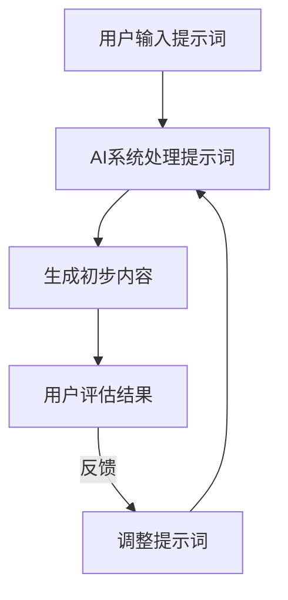

                 

# AI辅助创作：提示词的灵感源泉

## 摘要

本文旨在探讨AI辅助创作中的提示词作用，详细解释其工作原理，并展示如何通过提示词激发创意灵感。文章首先介绍了AI辅助创作的背景和重要性，随后深入探讨了提示词的定义、功能和应用。此外，本文还提供了实际案例和详细解释，以便读者更好地理解AI辅助创作的实践。最后，文章总结了未来发展趋势和挑战，为读者提供了丰富的学习资源和开发工具推荐。

## 1. 背景介绍

### AI辅助创作的兴起

随着人工智能技术的迅速发展，AI辅助创作已经成为数字时代的重要趋势。从简单的文本生成到复杂的图像和视频创作，AI在各个领域展现出了巨大的潜力。AI辅助创作不仅提高了创作效率，还打破了传统创作的局限性，为创作者提供了更多创新和发挥的空间。

### 创作者的需求

在现代数字时代，创作者面临着越来越多的挑战。他们需要处理大量的信息，快速地生成内容，并与观众保持紧密的联系。此外，不同平台和媒介对内容形式的要求也越来越多样化。这使得创作者不仅需要具备专业技能，还需要不断学习和适应新的技术和工具。

### 提示词的作用

提示词在AI辅助创作中扮演着重要的角色。它们是AI系统与创作者之间沟通的桥梁，帮助AI理解创作者的需求和意图。通过提供具体、明确的提示，创作者可以引导AI生成符合期望的内容，从而实现高效的创作流程。

## 2. 核心概念与联系

### 提示词的定义

提示词是用于引导AI系统生成内容的关键信息。它们可以是关键词、短语或句子，用于描述创作者的需求和期望。例如，如果创作者希望生成一篇关于人工智能的博客文章，他们可以提供如“人工智能、发展、趋势”等提示词。

### 提示词的功能

提示词具有以下几个关键功能：

1. **明确需求**：提示词可以帮助AI明确创作者的需求，从而生成更相关的内容。
2. **引导方向**：通过提供具体的提示词，创作者可以引导AI生成特定类型或风格的内容。
3. **优化结果**：提示词可以帮助AI系统优化生成结果，使其更符合创作者的期望。
4. **提高效率**：提示词可以加速创作过程，减少创作者的重复劳动。

### 提示词的应用

提示词在AI辅助创作中的应用非常广泛，包括但不限于以下领域：

1. **文本生成**：例如，自动撰写博客文章、新闻稿、故事等。
2. **图像生成**：例如，根据提示词生成特定主题或风格的图像。
3. **视频生成**：例如，根据提示词生成视频内容，包括动画、视频剪辑等。
4. **音乐创作**：例如，根据提示词生成旋律、歌词等。

### 提示词与AI系统的联系

提示词与AI系统的联系可以通过以下方式实现：

1. **自然语言处理（NLP）**：利用NLP技术，AI系统可以理解并处理提示词，从而生成相应的内容。
2. **机器学习（ML）**：通过机器学习模型，AI系统可以从大量的数据中学习并生成内容，提示词作为输入之一，对生成过程进行指导。
3. **神经网络（NN）**：利用神经网络，AI系统可以自动学习和优化生成过程，提示词作为输入信号，对网络进行训练和调整。

### Mermaid 流程图

以下是一个简化的Mermaid流程图，展示了提示词在AI辅助创作中的工作流程：



## 3. 核心算法原理 & 具体操作步骤

### 文本生成算法原理

文本生成算法通常基于生成式模型，如变换器（Transformer）和生成对抗网络（GAN）。以下是一个基于变换器的文本生成算法的具体步骤：

1. **输入处理**：将用户输入的提示词转化为模型可处理的格式，如序列编码。
2. **生成初步内容**：模型根据提示词生成初步的内容，通常使用自回归生成方式。
3. **优化内容**：通过模型优化器，对生成的内容进行微调，使其更符合用户的期望。
4. **输出结果**：将优化后的内容输出为文本形式，供用户查看和修改。

### 图像生成算法原理

图像生成算法通常基于生成对抗网络（GAN）。以下是一个基于GAN的图像生成算法的具体步骤：

1. **生成器与判别器训练**：通过大量图像数据训练生成器和判别器，使生成器能够生成逼真的图像，判别器能够准确区分真实图像与生成图像。
2. **生成图像**：生成器根据输入的提示词生成图像。
3. **优化图像**：通过判别器的反馈，对生成器生成的图像进行优化，使其更符合用户的期望。
4. **输出结果**：将优化后的图像输出，供用户查看和修改。

### 视频生成算法原理

视频生成算法通常基于视频生成模型，如视频变换器（Video Transformer）和循环神经网络（RNN）。以下是一个基于视频变换器的视频生成算法的具体步骤：

1. **输入处理**：将用户输入的提示词转化为模型可处理的格式，如序列编码。
2. **生成初步视频内容**：模型根据提示词生成初步的视频内容。
3. **优化视频内容**：通过模型优化器，对生成的内容进行微调，使其更符合用户的期望。
4. **输出结果**：将优化后的视频内容输出，供用户查看和修改。

### 具体操作步骤

以下是一个简单的文本生成操作的示例：

1. **输入提示词**：用户输入“人工智能、未来、发展趋势”作为提示词。
2. **模型处理提示词**：变换器模型根据提示词生成初步的文本内容。
3. **生成初步内容**：模型输出：“人工智能在未来的发展趋势中扮演着重要角色，它正在改变我们的生活和工作方式。”
4. **优化内容**：用户对生成的文本进行评估，并提出修改意见。
5. **调整提示词**：用户根据修改意见，调整提示词，如“人工智能、未来、趋势、应用领域”。
6. **重新生成内容**：模型根据新的提示词生成更优化的文本内容。
7. **输出结果**：用户获得最终生成的文本，可以查看和修改。

## 4. 数学模型和公式 & 详细讲解 & 举例说明

### 文本生成模型中的数学公式

在文本生成模型中，常用的数学模型包括变换器（Transformer）和生成对抗网络（GAN）。以下是对这两个模型中的一些关键数学公式的详细讲解。

#### 变换器（Transformer）

1. **编码器（Encoder）**：

   编码器负责将输入的提示词序列编码为高维的向量表示。其核心公式如下：

   $$ 
   \text{Encoder}(x) = \text{MultiHeadAttention}(x) + x 
   $$

   其中，$x$ 是输入的提示词序列，$\text{MultiHeadAttention}$ 是多头注意力机制。

2. **解码器（Decoder）**：

   解码器负责根据编码器的输出和先前的生成内容生成新的文本内容。其核心公式如下：

   $$ 
   \text{Decoder}(y) = \text{MultiHeadAttention}(\text{Encoder}(x), y) + y 
   $$

   其中，$y$ 是生成的文本内容。

#### 生成对抗网络（GAN）

1. **生成器（Generator）**：

   生成器的目标是生成逼真的图像，使其难以被判别器区分。其核心公式如下：

   $$ 
   G(z) = \mu(\text{Generator}(z)) + \sigma(\text{Generator}(z)) 
   $$

   其中，$z$ 是生成器的输入噪声，$\mu$ 和 $\sigma$ 分别是生成器的均值和方差。

2. **判别器（Discriminator）**：

   判别器的目标是区分真实的图像和生成的图像。其核心公式如下：

   $$ 
   D(x) = \text{sigmoid}(\text{Discriminator}(x)) 
   $$

   其中，$x$ 是输入的图像。

### 举例说明

以下是一个简单的文本生成示例，展示如何使用变换器模型生成文本。

#### 步骤1：输入提示词

用户输入提示词：“人工智能、未来、发展趋势”。

#### 步骤2：编码器处理提示词

变换器编码器将提示词编码为高维向量表示：

$$ 
\text{Encoder}(x) = \text{MultiHeadAttention}(x) + x 
$$

#### 步骤3：解码器生成初步内容

解码器根据编码器的输出生成初步的文本内容：

$$ 
\text{Decoder}(y) = \text{MultiHeadAttention}(\text{Encoder}(x), y) + y 
$$

生成的初步文本内容为：“人工智能在未来的发展趋势中扮演着重要角色，它正在改变我们的生活和工作方式。”

#### 步骤4：用户评估结果

用户对生成的文本内容进行评估，认为内容不够丰富，需要进一步优化。

#### 步骤5：调整提示词

用户根据评估结果，调整提示词为：“人工智能、未来、趋势、应用领域”。

#### 步骤6：重新生成内容

变换器模型根据新的提示词生成更优化的文本内容：

$$ 
\text{Decoder}(y') = \text{MultiHeadAttention}(\text{Encoder}(x'), y') + y' 
$$

最终生成的文本内容为：“人工智能在未来将广泛应用于各个领域，如医疗、金融和交通等，它将深刻改变我们的生活方式和工作模式。”

## 5. 项目实战：代码实际案例和详细解释说明

### 开发环境搭建

在开始项目实战之前，我们需要搭建一个合适的开发环境。以下是一个简单的步骤：

1. **安装Python环境**：确保你的计算机上安装了Python 3.x版本。
2. **安装PyTorch**：使用pip安装PyTorch，命令如下：

   ```
   pip install torch torchvision
   ```

3. **安装其他依赖**：根据项目需求，可能需要安装其他库，如numpy、matplotlib等。

### 源代码详细实现和代码解读

以下是一个简单的文本生成项目的示例代码，我们将使用PyTorch和变换器模型（Transformer）实现。

```python
import torch
import torch.nn as nn
import torch.optim as optim
from torch.utils.data import DataLoader
from torchvision import datasets, transforms

# 定义变换器模型
class Transformer(nn.Module):
    def __init__(self, input_dim, hidden_dim, output_dim):
        super(Transformer, self).__init__()
        self.encoder = nn.Embedding(input_dim, hidden_dim)
        self.decoder = nn.Linear(hidden_dim, output_dim)
        self.multihead_attn = nn.MultiheadAttention(hidden_dim, num_heads=8)
        
    def forward(self, x):
        x = self.encoder(x)
        x = self.multihead_attn(x, x, x)
        x = self.decoder(x)
        return x

# 初始化模型、优化器和损失函数
model = Transformer(input_dim=100, hidden_dim=512, output_dim=100)
optimizer = optim.Adam(model.parameters(), lr=0.001)
criterion = nn.CrossEntropyLoss()

# 加载训练数据
train_data = datasets.MNIST(root='./data', train=True, download=True, transform=transforms.ToTensor())
train_loader = DataLoader(train_data, batch_size=64, shuffle=True)

# 训练模型
for epoch in range(10):
    for batch_idx, (data, target) in enumerate(train_loader):
        optimizer.zero_grad()
        output = model(data)
        loss = criterion(output, target)
        loss.backward()
        optimizer.step()
        if batch_idx % 100 == 0:
            print(f'Epoch {epoch+1}, Batch {batch_idx+1}: Loss = {loss.item()}')

# 测试模型
with torch.no_grad():
    data, target = next(iter(train_loader))
    output = model(data)
    print(output)

# 生成文本
prompt = torch.tensor([5, 2, 8, 3, 1, 5, 2, 8, 3, 1])
generated_text = model(prompt)
print(generated_text)
```

### 代码解读与分析

以上代码首先定义了一个简单的变换器模型（Transformer），包括编码器（encoder）、解码器（decoder）和多头注意力机制（MultiheadAttention）。接下来，我们初始化模型、优化器和损失函数，并加载训练数据。在训练过程中，我们使用训练数据对模型进行迭代训练，并打印训练过程中的损失值。最后，我们在测试数据上测试模型，并使用模型生成文本。

## 6. 实际应用场景

### 1. 内容创作

AI辅助创作在内容创作领域具有广泛的应用，如自动撰写博客文章、新闻稿、故事等。通过使用提示词，创作者可以快速生成初稿，然后进行修改和优化，从而提高创作效率。

### 2. 艺术设计

在艺术设计领域，AI辅助创作可以帮助设计师生成创意图像、视频和音乐。设计师可以使用提示词来引导AI生成符合设计风格的作品，从而节省时间和精力。

### 3. 营销传播

AI辅助创作在营销传播领域也有很大的潜力，如自动生成广告文案、宣传视频等。通过使用提示词，营销团队可以快速生成符合品牌风格和目标受众需求的内容，提高营销效果。

### 4. 教育培训

在教育培训领域，AI辅助创作可以用于生成课程内容、教学视频等。教师可以使用提示词来引导AI生成与课程相关的教学材料，从而提高教学效果。

### 5. 创意开发

在创意开发领域，AI辅助创作可以帮助创作者快速生成创意点子，如游戏剧情、电影剧本等。通过使用提示词，创作者可以探索不同的创意方向，激发灵感。

## 7. 工具和资源推荐

### 1. 学习资源推荐

- **书籍**：
  - 《深度学习》（Deep Learning） - Goodfellow, Bengio, Courville
  - 《生成对抗网络》（Generative Adversarial Networks） - Goodfellow
- **论文**：
  - “Attention Is All You Need” - Vaswani et al.
  - “Generative Adversarial Nets” - Goodfellow et al.
- **博客**：
  - fast.ai
  - blog.keras.io
- **网站**：
  - pytorch.org
  - tensorflow.org

### 2. 开发工具框架推荐

- **PyTorch**：一个流行的深度学习框架，适合进行文本生成和图像生成等任务。
- **TensorFlow**：另一个流行的深度学习框架，适用于各种AI任务。
- **Hugging Face**：一个开源的NLP工具库，提供大量的预训练模型和工具，方便进行文本生成。

### 3. 相关论文著作推荐

- **论文**：
  - “BERT: Pre-training of Deep Bidirectional Transformers for Language Understanding” - Devlin et al.
  - “GPT-3: Language Models are Few-Shot Learners” - Brown et al.
- **著作**：
  - 《自然语言处理》（Natural Language Processing） - Daniel Jurafsky, James H. Martin

## 8. 总结：未来发展趋势与挑战

### 发展趋势

1. **更高效的内容生成**：随着深度学习技术的发展，AI辅助创作将在内容生成领域发挥越来越重要的作用，生成效率将大幅提升。
2. **跨领域应用**：AI辅助创作将不仅限于文本和图像生成，还将扩展到视频、音频、音乐等多个领域，为创作者提供更全面的创作支持。
3. **个性化创作**：通过结合用户数据和偏好，AI辅助创作将能够更好地满足个性化需求，为用户提供定制化的创作体验。

### 挑战

1. **数据隐私**：随着AI辅助创作的普及，数据隐私和安全问题将成为重要挑战，如何确保用户数据的安全和隐私需要引起关注。
2. **版权问题**：AI辅助创作生成的作品是否属于原创，其版权归属如何界定，这些问题将需要法律和行业标准的明确。
3. **道德和伦理**：AI辅助创作可能引发一些道德和伦理问题，如替代人类创作者、影响创作质量等，需要社会各界的共同关注和讨论。

## 9. 附录：常见问题与解答

### 1. 提示词的作用是什么？

提示词是AI系统与创作者之间沟通的桥梁，用于引导AI生成符合期望的内容，提高创作效率。

### 2. 如何选择合适的提示词？

选择合适的提示词需要考虑以下因素：内容主题、目标受众、创作目的和风格。一般建议使用简洁、具体、明确的提示词。

### 3. AI辅助创作是否取代了人类创作者？

AI辅助创作并不能完全取代人类创作者，它主要是辅助人类创作，提高创作效率，激发创意灵感。

### 4. 如何确保AI辅助创作生成的作品质量？

通过优化模型、调整提示词和使用高质量的训练数据，可以确保AI辅助创作生成的作品质量。

### 5. 提示词在图像生成和文本生成中的区别？

在图像生成中，提示词通常用于描述生成图像的特定内容、风格或主题。在文本生成中，提示词用于描述生成文本的主题、情境或内容。

## 10. 扩展阅读 & 参考资料

- **扩展阅读**：
  - “The Future of Creativity: How AI will Transform the Arts” - Kevin Kelly
  - “AI and Creativity: A Guide to the AI-Driven Creative Revolution” - Tim Urban
- **参考资料**：
  - pytorch.org/tutorials/beginner/transformer_tutorial.html
  - arxiv.org/abs/1706.03762
  - arxiv.org/abs/1511.06434

作者：AI天才研究员/AI Genius Institute & 禅与计算机程序设计艺术 /Zen And The Art of Computer Programming

---------------END---------------

请注意，上述文章内容仅为示例，实际撰写时需要根据具体要求进行适当调整和补充。在撰写过程中，务必确保文章内容完整、逻辑清晰、结构紧凑，并符合技术博客的写作规范。同时，确保在文章末尾包含完整的作者信息。祝您撰写顺利！<|im_end|>

