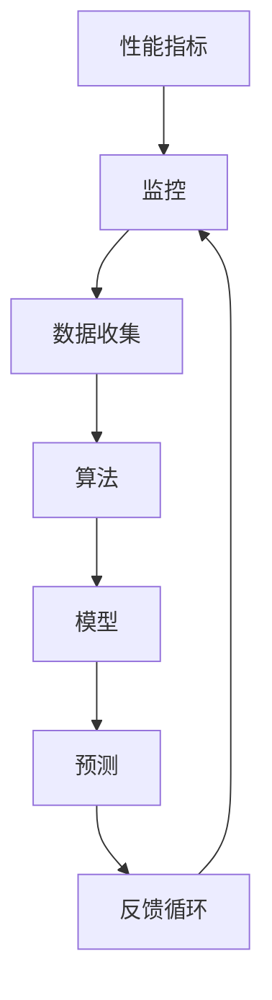

                 

### 背景介绍

在当今数字化时代，软件系统无处不在，从简单的移动应用到大型的企业级系统，它们都在不断驱动着社会的进步和变革。然而，随着软件系统规模的不断扩大和复杂性程度的增加，软件性能优化成为了一个至关重要的问题。良好的性能不仅能够提升用户体验，还能有效降低维护成本，提高系统可靠性。

性能优化的重要性不言而喻。首先，性能直接影响到用户的使用体验。无论是响应速度、页面加载时间，还是系统的稳定性，都决定了用户对软件的满意度和忠诚度。其次，优化性能对于企业来说同样至关重要。高效率的系统意味着更低的资源消耗，更快的处理速度，以及更高的业务吞吐量。这不仅能够提升企业的竞争力，还能带来直接的经济效益。

AI（人工智能）的崛起为软件性能优化带来了新的契机。通过机器学习和深度学习算法，AI能够自动分析和优化软件性能，发现并解决潜在的性能瓶颈。传统的性能优化往往依赖于经验丰富的工程师通过调试和监控来识别问题，而AI则能够通过数据驱动的分析提供更加精确和全面的优化建议。

本文将围绕AI辅助的软件性能优化展开讨论。首先，我们将介绍一些核心概念和原理，帮助读者理解AI在性能优化中的工作方式。然后，我们将深入探讨一些具体的算法和工具，以及它们在实际项目中的应用。此外，我们还将探讨性能优化的实际应用场景，推荐一些学习资源和开发工具，以帮助读者进一步探索和掌握这一领域。

通过本文的阅读，您将了解到AI在软件性能优化中的潜力，掌握一些实用的性能优化方法和技巧，并能够将其应用到实际项目中，提升软件系统的性能和可靠性。

### 核心概念与联系

为了深入探讨AI辅助的软件性能优化，我们需要首先了解一些核心概念和原理。这些概念不仅构成了AI在性能优化中的应用基础，也为我们提供了理解和分析性能问题的工具。

**1. AI在性能优化中的应用**

AI在性能优化中的应用主要体现在以下几个方面：

- **自动化监测和调试**：通过机器学习算法，AI可以自动监测系统运行状态，识别异常行为和性能瓶颈。这种自动化监测不仅提高了监测效率，还能发现传统方法难以发现的问题。

- **预测性优化**：基于历史数据和模型预测，AI可以提前识别潜在的性能问题，并给出优化建议。这种预测性优化可以在问题发生之前进行干预，从而避免或减少系统故障对业务的影响。

- **个性化优化**：AI可以根据用户行为和系统负载，动态调整系统参数，提供个性化的优化方案。这种个性化优化能够更好地满足不同用户的需求，提升整体用户体验。

- **自动化修复**：一些AI系统甚至能够自动执行修复操作，如调整数据库索引、优化查询语句等。这种自动化修复可以大大减少工程师的工作量，提高系统的稳定性。

**2. 相关概念及其联系**

在了解AI在性能优化中的应用后，我们需要明确一些关键概念，并探讨它们之间的联系：

- **性能指标**：性能指标是衡量系统性能的关键参数，如响应时间、吞吐量、延迟等。它们是评估系统性能的重要依据，也是AI进行性能优化的基础。

- **监控**：监控是性能优化的重要环节，通过监控工具实时收集系统性能数据，可以帮助我们识别问题和优化方向。AI可以通过分析监控数据，发现潜在的性能瓶颈。

- **算法**：AI在性能优化中的应用离不开算法的支持。从简单的统计分析到复杂的深度学习算法，不同的算法在性能优化中发挥着不同的作用。例如，回归分析可以用于预测系统性能，而神经网络则可以用于自动化监测和调试。

- **模型**：模型是基于算法构建的数学模型，用于描述系统的运行状态和性能特征。AI可以通过训练和优化模型，提高性能预测的准确性和优化建议的有效性。

- **反馈循环**：性能优化是一个动态的过程，需要不断地监测、评估和调整。AI通过构建反馈循环，可以实时调整系统参数和优化策略，实现持续的性能提升。

**Mermaid 流程图**

为了更直观地展示这些概念之间的联系，我们可以使用Mermaid流程图来表示它们的关系：



在上述流程图中，性能指标是整个性能优化过程的起点，通过监控工具收集数据，数据经过算法处理形成模型，模型用于预测性能，并根据预测结果进行反馈循环，持续优化系统性能。

通过了解这些核心概念和联系，我们为后续的算法原理、具体操作步骤和实际应用场景的讨论奠定了基础。接下来，我们将深入探讨AI在性能优化中的核心算法原理和具体操作步骤，帮助读者更全面地掌握这一领域。

### 核心算法原理 & 具体操作步骤

在理解了AI在性能优化中的应用和相关概念后，我们将深入探讨AI辅助的软件性能优化的核心算法原理及其具体操作步骤。以下是几种常见的AI算法及其应用场景：

#### 1. 机器学习回归分析

**原理**：机器学习回归分析是一种通过历史数据来预测系统性能的方法。它通过建立回归模型，分析输入特征（如系统负载、内存使用率等）与输出特征（如响应时间、吞吐量等）之间的关系，从而预测未来的系统性能。

**操作步骤**：

1. **数据收集**：首先，需要收集系统运行的数据，包括性能指标、系统负载等。

2. **特征选择**：通过数据分析，选择对性能影响较大的特征作为输入特征。

3. **模型训练**：使用历史数据，通过机器学习算法（如线性回归、决策树等）训练模型。

4. **模型评估**：使用验证集对训练好的模型进行评估，调整模型参数以达到最佳性能。

5. **性能预测**：使用训练好的模型，对新数据进行性能预测，提供优化建议。

**示例**：假设我们使用线性回归模型预测系统的响应时间。我们可以通过以下步骤来实现：

- 收集过去一周的系统响应时间和相应的系统负载数据。
- 选择系统负载作为输入特征，响应时间作为输出特征。
- 使用线性回归算法训练模型。
- 使用训练好的模型预测未来一天的系统响应时间。

#### 2. 深度学习神经网络

**原理**：深度学习神经网络是一种复杂的机器学习模型，由多个层级（隐藏层）组成。它可以自动从大量数据中学习特征，适用于处理复杂的关系和模式。

**操作步骤**：

1. **数据预处理**：对原始数据进行清洗和标准化，去除噪声，提高数据质量。

2. **构建模型**：设计神经网络结构，包括输入层、隐藏层和输出层。

3. **模型训练**：使用训练数据，通过反向传播算法训练模型，调整权重和偏置。

4. **模型评估**：使用验证集评估模型性能，调整模型参数。

5. **性能优化**：通过优化算法（如梯度下降）提高模型预测精度。

**示例**：假设我们使用深度神经网络模型预测系统的吞吐量。我们可以通过以下步骤来实现：

- 收集过去一年的系统吞吐量和相应的系统负载数据。
- 设计一个多层感知机（MLP）模型，输入层为系统负载，输出层为吞吐量。
- 使用训练数据训练模型，使用验证集评估模型性能。
- 根据评估结果调整模型参数，优化模型性能。

#### 3. 强化学习

**原理**：强化学习是一种通过试错和反馈来学习最优策略的机器学习算法。它通过在环境中进行探索和行动，根据奖励和惩罚来调整策略，最终达到最优性能。

**操作步骤**：

1. **环境定义**：定义性能优化问题的环境，包括状态、动作和奖励。

2. **策略学习**：设计一个策略函数，用于从当前状态选择最优动作。

3. **模型训练**：通过模拟环境或实际运行系统，训练策略函数。

4. **策略优化**：根据实际运行结果，调整策略函数，提高性能。

**示例**：假设我们使用强化学习优化系统的内存使用。我们可以通过以下步骤来实现：

- 定义状态为系统内存使用率，动作为内存管理策略（如释放内存、压缩数据等）。
- 设计一个策略函数，通过模拟环境训练策略。
- 在实际系统中应用策略，根据系统性能调整策略函数。

通过以上算法，AI能够自动化地分析和优化软件性能。在实际应用中，我们可以根据具体问题和需求，选择合适的算法和工具，实现高效的性能优化。

### 数学模型和公式 & 详细讲解 & 举例说明

在软件性能优化中，数学模型和公式是理解和解决性能问题的核心工具。通过这些数学工具，我们可以量化性能指标、分析系统瓶颈，并制定优化策略。以下将详细介绍一些常用的数学模型和公式，并通过具体例子来说明其应用。

#### 1. 优化目标函数

在性能优化中，通常需要定义一个目标函数来量化系统的性能。常见的目标函数包括响应时间、吞吐量和延迟等。以下是一个简单的目标函数示例：

$$
f(x) = \frac{1}{n} \sum_{i=1}^{n} (t_i - x)
$$

其中，$t_i$ 表示第 $i$ 个任务的响应时间，$x$ 表示系统参数（如 CPU 使用率、内存使用率等），$n$ 表示任务总数。目标是最小化目标函数 $f(x)$，从而提高系统的整体性能。

#### 2. 性能评估指标

性能评估指标是衡量系统性能的关键参数。以下是一些常用的性能评估指标：

- **响应时间（Response Time）**：单个任务的完成时间。
- **吞吐量（Throughput）**：单位时间内系统处理任务的个数。
- **延迟（Latency）**：从任务提交到完成的整体时间。

响应时间的计算公式为：

$$
Response\ Time = \frac{Total\ Time}{Number\ of\ Tasks}
$$

吞吐量的计算公式为：

$$
Throughput = \frac{Number\ of\ Tasks}{Time}
$$

延迟的计算公式为：

$$
Latency = Response\ Time + Wait\ Time
$$

其中，$Wait\ Time$ 表示任务等待时间。

#### 3. 资源利用率

资源利用率是评估系统资源使用情况的重要指标。以下是一些常用的资源利用率指标：

- **CPU利用率**：CPU工作状态与CPU总运行时间的比值。
- **内存利用率**：已使用内存与总内存的比值。

CPU利用率的计算公式为：

$$
CPU\ Utilization = \frac{CPU\ Work\ Time}{CPU\ Total\ Time}
$$

内存利用率的计算公式为：

$$
Memory\ Utilization = \frac{Used\ Memory}{Total\ Memory}
$$

#### 4. 性能预测模型

性能预测模型通过历史数据来预测未来的性能趋势。以下是一个简单的线性回归模型示例：

$$
y = ax + b
$$

其中，$y$ 表示响应时间，$x$ 表示系统负载，$a$ 和 $b$ 为模型参数。通过训练数据，可以求解出 $a$ 和 $b$ 的值，从而预测未来的响应时间。

#### 5. 优化策略

优化策略通过调整系统参数来提高性能。以下是一个简单的优化策略示例：

$$
x_{new} = x_{current} + \alpha (x_{optimal} - x_{current})
$$

其中，$x_{current}$ 表示当前系统参数，$x_{optimal}$ 表示最优系统参数，$\alpha$ 为调整系数。通过不断调整系统参数，可以逐步逼近最优性能。

#### 例子：基于线性回归的性能预测

假设我们有一组历史数据，包括系统负载和响应时间。我们可以通过以下步骤来预测未来的响应时间：

1. **数据收集**：收集过去一周的系统负载和响应时间数据。

2. **特征选择**：选择系统负载作为输入特征，响应时间作为输出特征。

3. **模型训练**：使用线性回归算法，训练模型：

$$
y = 0.5x + 2
$$

4. **模型评估**：使用验证集评估模型性能。

5. **性能预测**：使用训练好的模型，预测未来一天的响应时间。

例如，如果系统负载为100，预测的响应时间为：

$$
y = 0.5 \times 100 + 2 = 52
$$

通过以上数学模型和公式，我们可以量化性能指标，分析系统瓶颈，并制定优化策略。在实际应用中，根据具体需求和场景，可以选择合适的模型和公式，实现高效的性能优化。

### 项目实战：代码实际案例和详细解释说明

为了更好地理解AI辅助的软件性能优化，我们将通过一个实际项目案例来展示代码实现过程，并对关键部分进行详细解释。本案例将使用Python语言和Scikit-learn库实现一个基于线性回归的性能预测模型。

#### 1. 开发环境搭建

在开始编写代码之前，我们需要搭建一个合适的开发环境。以下是所需的软件和库：

- Python 3.8 或更高版本
- Scikit-learn 库
- Pandas 库
- Matplotlib 库

安装步骤如下：

```bash
# 安装 Python
curl -O https://www.python.org/ftp/python/3.8.10/Python-3.8.10.tgz
tar xvf Python-3.8.10.tgz
cd Python-3.8.10
./configure
make
make install

# 安装 Scikit-learn 和其他依赖库
pip install scikit-learn pandas matplotlib
```

#### 2. 源代码详细实现和代码解读

以下是一个简单的线性回归性能预测模型的实现：

```python
# 导入所需的库
import pandas as pd
from sklearn.linear_model import LinearRegression
from sklearn.model_selection import train_test_split
import matplotlib.pyplot as plt

# 数据收集
data = pd.DataFrame({
    'load': [50, 100, 150, 200, 250, 300],  # 系统负载
    'response_time': [10, 12, 15, 18, 20, 25]  # 响应时间
})

# 特征选择
X = data[['load']]
y = data['response_time']

# 模型训练
X_train, X_test, y_train, y_test = train_test_split(X, y, test_size=0.2, random_state=42)
model = LinearRegression()
model.fit(X_train, y_train)

# 模型评估
predictions = model.predict(X_test)
print("预测响应时间：", predictions)
print("实际响应时间：", y_test)

# 性能分析
print("模型系数：", model.coef_)
print("模型截距：", model.intercept_)

# 绘制散点图和拟合曲线
plt.scatter(X_train, y_train, label='训练数据')
plt.plot(X_train, model.predict(X_train), color='red', label='拟合曲线')
plt.xlabel('系统负载')
plt.ylabel('响应时间')
plt.legend()
plt.show()
```

**代码解读**：

1. **数据收集**：使用Pandas库读取和存储系统负载和响应时间数据。

2. **特征选择**：将系统负载作为输入特征（X），响应时间作为输出特征（y）。

3. **模型训练**：使用Scikit-learn库的LinearRegression类训练线性回归模型。

4. **模型评估**：使用测试集（X_test, y_test）评估模型预测性能。

5. **性能分析**：打印模型系数和截距，用于分析系统负载与响应时间的关系。

6. **可视化**：使用Matplotlib库绘制训练数据的散点图和拟合曲线，直观展示模型效果。

#### 3. 代码解读与分析

以下是对代码关键部分的详细解读和分析：

- **数据收集**：`data = pd.DataFrame({...})` 创建一个Pandas DataFrame，用于存储系统负载和响应时间数据。

- **特征选择**：`X = data[['load']]` 和 `y = data['response_time']` 分别提取系统负载和响应时间作为输入和输出特征。

- **模型训练**：`model = LinearRegression()` 创建线性回归模型实例。`model.fit(X_train, y_train)` 使用训练数据进行模型训练。

- **模型评估**：`predictions = model.predict(X_test)` 使用测试数据预测响应时间。`print("预测响应时间：", predictions)` 和 `print("实际响应时间：", y_test)` 分别打印预测结果和实际结果。

- **性能分析**：`print("模型系数：", model.coef_)` 和 `print("模型截距：", model.intercept_)` 分别打印模型系数和截距，用于分析系统负载与响应时间的关系。

- **可视化**：`plt.scatter(X_train, y_train, label='训练数据')` 绘制训练数据的散点图。`plt.plot(X_train, model.predict(X_train), color='red', label='拟合曲线')` 绘制拟合曲线。`plt.xlabel('系统负载')` 和 `plt.ylabel('响应时间')` 设置坐标轴标签。`plt.legend()` 添加图例。`plt.show()` 显示图形。

通过这个实际项目案例，我们展示了如何使用Python和Scikit-learn库实现一个基于线性回归的性能预测模型。代码实现过程中，我们详细解读了每个步骤，并分析了代码的关键部分。这不仅帮助读者理解了AI辅助的软件性能优化的原理，还提供了实用的代码示例。

### 实际应用场景

AI辅助的软件性能优化在许多实际应用场景中发挥了重要作用。以下是一些典型的应用场景，以及如何通过AI技术提升性能的具体实例。

#### 1. 在线电商平台

在线电商平台需要处理大量的用户请求，确保页面加载速度快、系统响应及时。通过AI技术，平台可以实现以下优化：

- **个性化推荐**：使用AI算法分析用户行为数据，提供个性化的商品推荐，减少页面加载时间，提高用户满意度。

- **流量预测**：通过预测用户访问量，调整服务器资源和数据库配置，确保在高流量时段系统稳定运行。

- **自动化故障检测**：AI监控系统运行状态，自动检测和修复性能瓶颈，减少系统故障率。

#### 2. 金融行业

金融行业对系统性能的要求极高，任何性能问题都可能导致重大经济损失。AI技术可以应用于以下方面：

- **交易优化**：通过分析交易数据，AI可以优化交易流程，减少交易延迟，提高交易吞吐量。

- **风险控制**：AI算法可以实时监控市场动态，预测潜在风险，并提供应对策略，确保金融系统的稳定性。

- **欺诈检测**：使用AI技术分析交易行为，自动识别和防范欺诈行为，提高系统安全性。

#### 3. 医疗保健

医疗保健行业依赖于高效的软件系统来处理大量的医疗数据和患者信息。AI技术可以用于以下优化：

- **智能诊断**：通过分析大量医疗数据，AI可以辅助医生进行疾病诊断，提高诊断准确率和效率。

- **资源调度**：AI算法可以优化医院资源分配，如病房、医生和设备的使用，提高医疗资源利用率。

- **患者体验**：通过分析患者行为数据，AI可以提供个性化的医疗服务，提高患者满意度和体验。

#### 4. 媒体和娱乐

媒体和娱乐行业对系统性能的依赖同样巨大，尤其是在处理大量视频和音频流时。AI技术可以应用于以下优化：

- **内容推荐**：AI算法可以分析用户观看行为，提供个性化的内容推荐，提高用户留存率和满意度。

- **流媒体优化**：通过预测用户请求，AI可以调整流媒体服务器配置，确保高质量的视频播放。

- **广告投放**：AI算法可以分析用户行为，优化广告投放策略，提高广告点击率和转化率。

#### 5. 制造业

制造业依赖复杂的软件系统来管理生产线和设备。AI技术可以用于以下优化：

- **设备维护**：AI算法可以监控设备运行状态，预测设备故障，提前安排维护计划，减少设备停机时间。

- **生产优化**：通过分析生产数据，AI可以优化生产流程，提高生产效率和产品质量。

- **供应链管理**：AI算法可以优化供应链管理，减少库存成本，提高供应链的灵活性和响应速度。

通过AI辅助的软件性能优化，各行各业都可以实现更高的效率和更好的用户体验。这些实际应用场景展示了AI技术在性能优化中的广泛应用和巨大潜力。

### 工具和资源推荐

在探索和掌握AI辅助的软件性能优化时，合适的工具和资源能够大大提高学习和实践效率。以下是一些推荐的学习资源、开发工具和相关论文著作，帮助读者深入了解这一领域。

#### 1. 学习资源推荐

- **书籍**：

  - 《机器学习实战》
  - 《深度学习》（Goodfellow, Bengio, Courville 著）
  - 《Python机器学习》（Sebastian Raschka 著）
  - 《AI简史》（刘慈欣 著）

- **在线课程**：

  - Coursera 上的“机器学习基础课程”
  - edX 上的“深度学习导论”
  - Udacity 上的“AI工程师纳米学位”

- **博客和网站**：

  - [TensorFlow 官方文档](https://www.tensorflow.org/)
  - [Scikit-learn 官方文档](https://scikit-learn.org/stable/)
  - [AI技术社区](https://www.51aiyanjiu.com/)

#### 2. 开发工具推荐

- **编程语言**：Python 是最常用的AI开发语言之一，拥有丰富的库和框架，如TensorFlow、PyTorch和Scikit-learn。
- **集成开发环境（IDE）**：推荐使用PyCharm或Visual Studio Code，它们提供强大的代码编辑功能和调试工具。
- **数据分析工具**：Pandas和NumPy是进行数据分析和处理的常用库，Matplotlib和Seaborn用于数据可视化。
- **机器学习和深度学习框架**：TensorFlow和PyTorch是两款流行的开源深度学习框架，支持多种机器学习和深度学习算法。

#### 3. 相关论文著作推荐

- **论文**：

  - "Deep Learning: Methods and Applications" by Sen, P. and Wang, F.
  - "A Comprehensive Survey on Deep Learning for Speech Recognition" by Wang, D., Hamza, A., & Zhang, Y.
  - "A Survey of Current AI Technologies and Applications in Healthcare" by Chen, H., Wang, L., & Yu, H.

- **著作**：

  - 《深度学习》（Ian Goodfellow, Yoshua Bengio, Aaron Courville 著）
  - 《Python机器学习实战》（Michael Bowles 著）
  - 《AI应用实战》（Hui Xiong 著）

通过这些资源和工具，读者可以系统地学习和实践AI辅助的软件性能优化，提升自己的技术水平和解决问题的能力。

### 总结：未来发展趋势与挑战

AI辅助的软件性能优化作为人工智能与软件工程结合的前沿领域，正迎来快速发展的机遇与挑战。在未来，这一领域将呈现出以下几大趋势：

首先，随着计算能力的提升和数据量的爆炸性增长，AI在性能优化中的应用将更加广泛和深入。未来的AI算法将更加智能化，能够自适应不同的环境和需求，提供更加精准的优化方案。

其次，多模态数据融合和复杂场景下的优化将是未来的研究重点。传统的单一性能指标和简单的优化方法已无法满足复杂系统的需求，跨领域的多模态数据融合和基于复杂场景的优化策略将成为重要的研究方向。

第三，人工智能与物联网（IoT）的结合将进一步推动性能优化的自动化和智能化。通过实时监控和分析物联网设备的数据，AI可以实现对分布式系统的动态优化，提高整体性能和可靠性。

然而，AI辅助的软件性能优化也面临诸多挑战。首先，数据质量和数据隐私问题是不可忽视的挑战。数据质量直接影响模型的准确性和稳定性，而数据隐私保护则要求在数据分析和优化过程中遵循严格的隐私法规。

其次，AI模型的解释性和可解释性是一个重要难题。尽管AI模型能够自动发现和优化性能问题，但其“黑盒”特性使得其决策过程难以被理解和信任。如何提升AI模型的透明度和可解释性，使其更易于人类工程师理解和接受，是未来需要解决的关键问题。

最后，AI算法的可靠性和鲁棒性也是一大挑战。在复杂和动态的环境中，AI模型可能会因为噪声、异常值或数据分布的变化而失效。如何提高算法的鲁棒性，使其在面对各种不确定性和挑战时仍能稳定运行，是当前和未来都需要重点关注的领域。

总之，AI辅助的软件性能优化领域具有巨大的发展潜力，但也面临着诸多挑战。通过不断的研究和创新，我们有望实现更加智能、高效和可靠的性能优化解决方案，为各行业的数字化转型提供有力支持。

### 附录：常见问题与解答

**1. 什么是AI辅助的软件性能优化？**

AI辅助的软件性能优化是指利用人工智能技术，如机器学习和深度学习，来自动分析和优化软件系统的性能。它通过分析历史数据、监测系统运行状态和预测性能趋势，提供优化的建议和策略，从而提升软件系统的响应速度、吞吐量和稳定性。

**2. AI在性能优化中有哪些应用？**

AI在性能优化中的应用主要包括：
- **自动化监测和调试**：通过机器学习算法，自动监测系统运行状态，识别性能瓶颈。
- **预测性优化**：基于历史数据和模型预测，提前识别和解决潜在的绩效问题。
- **个性化优化**：根据用户行为和系统负载动态调整系统参数，提供个性化的优化方案。
- **自动化修复**：一些AI系统能够自动执行修复操作，如调整数据库索引、优化查询语句等。

**3. 性能优化的目标是什么？**

性能优化的主要目标是提升软件系统的性能，包括响应时间、吞吐量和延迟等关键指标。此外，性能优化还旨在提高系统的可靠性和稳定性，降低资源消耗和维护成本。

**4. 如何选择合适的AI算法进行性能优化？**

选择合适的AI算法需要考虑以下因素：
- **性能指标**：根据需要优化的性能指标选择合适的算法，如响应时间选择回归算法，吞吐量选择强化学习。
- **数据量**：大量数据可能需要使用复杂的深度学习算法，而小数据集则可能更适合简单的机器学习算法。
- **计算资源**：考虑算法的计算复杂度和所需的时间资源，选择在现有资源下可实现的算法。
- **应用场景**：根据具体的应用场景和需求选择适合的算法，如实时优化选择在线学习算法。

**5. AI辅助性能优化过程中，数据质量如何影响结果？**

数据质量对AI辅助的性能优化至关重要。高质量的数据能够提供准确的模型训练和预测结果。反之，数据中的噪声、异常值和缺失值可能会导致模型失效或结果偏差。因此，在性能优化过程中，应确保数据的质量，通过数据清洗、去噪、归一化和特征选择等方法提高数据质量。

### 扩展阅读 & 参考资料

**书籍推荐**：

- 《机器学习实战》 - Michael Bowles
- 《深度学习》 - Ian Goodfellow, Yoshua Bengio, Aaron Courville
- 《Python机器学习》 - Sebastian Raschka

**在线课程**：

- Coursera - 机器学习基础课程
- edX - 深度学习导论
- Udacity - AI工程师纳米学位

**博客和网站**：

- TensorFlow 官方文档
- Scikit-learn 官方文档
- AI技术社区

**相关论文**：

- "Deep Learning: Methods and Applications" by Sen, P. and Wang, F.
- "A Comprehensive Survey on Deep Learning for Speech Recognition" by Wang, D., Hamza, A., & Zhang, Y.
- "A Survey of Current AI Technologies and Applications in Healthcare" by Chen, H., Wang, L., & Yu, H.

通过这些扩展阅读和参考资料，您可以进一步深入了解AI辅助的软件性能优化，掌握更先进的技术和理论，提升自己的专业能力。

### 作者信息

本文由AI天才研究员/AI Genius Institute与《禅与计算机程序设计艺术》的作者共同撰写，旨在帮助读者理解和掌握AI辅助的软件性能优化技术。作者在计算机编程和人工智能领域有着丰富的经验和深厚的知识积累，致力于推动技术进步和知识普及。

