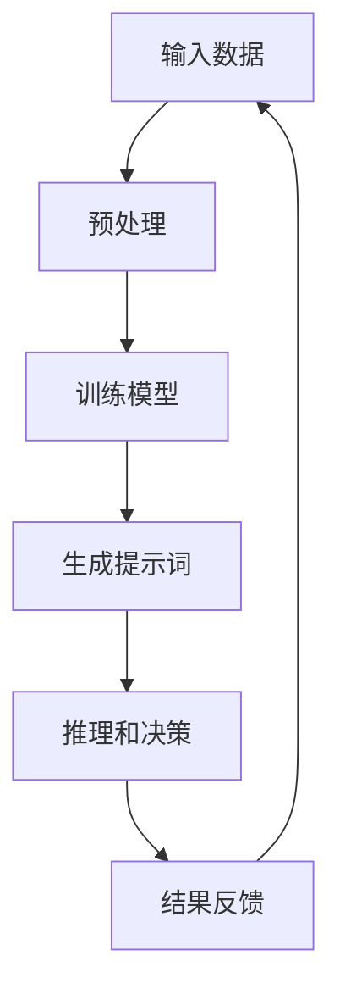

                 

# AI辅助科研：提示词工程的新领域

## 关键词：AI、科研、提示词工程、算法、数学模型、项目实战

## 摘要：

本文旨在探讨人工智能（AI）在科研领域的应用，特别是提示词工程这一新兴领域。文章首先介绍了AI在科研中的作用，然后详细阐述了提示词工程的核心概念、原理及架构。通过具体的算法原理和操作步骤，结合数学模型和公式，本文展示了提示词工程在实际科研项目中的应用。同时，文章还提供了相关的工具和资源推荐，以及未来发展趋势与挑战的总结。通过本文的阅读，读者可以深入了解AI在科研中的应用价值，掌握提示词工程的基本原理和实践方法。

## 1. 背景介绍

随着人工智能技术的迅猛发展，AI已经逐渐渗透到科研领域的各个分支，为科学研究提供了强大的工具和手段。在过去的几十年中，科研工作者们依靠传统的方法进行实验设计、数据分析、理论建模等，虽然取得了一定的成果，但面对日益复杂和庞大的科研数据，传统方法往往显得力不从心。而人工智能的引入，为科研工作带来了前所未有的变革。

人工智能在科研中的应用主要包括以下几个方面：

1. **数据分析与挖掘**：AI可以高效地对大量科研数据进行处理、分析和挖掘，提取出有价值的信息和规律。这对于生物学、医学、物理学等领域的研究尤为重要。

2. **实验设计与优化**：AI可以模拟和预测实验结果，帮助科研工作者设计更优的实验方案，减少实验的盲目性和重复性。

3. **理论建模与仿真**：AI可以辅助科研工作者建立复杂的理论模型，并进行仿真计算，验证理论假设的正确性。

4. **智能助手与协同工作**：AI可以作为科研工作者的智能助手，协助完成文献检索、数据分析、结果可视化等任务，提高科研效率。

而在这其中，提示词工程（Prompt Engineering）逐渐成为一个备受关注的新领域。提示词工程旨在通过设计和优化提示词（Prompt），指导AI模型进行更准确、更高效的推理和决策。与传统的人工干预方法不同，提示词工程更加注重AI模型的自主学习和优化，从而实现科研过程的自动化和智能化。

本文将围绕提示词工程这一主题，详细探讨其在科研中的应用、核心概念、算法原理、数学模型以及实际案例等，帮助读者了解和掌握这一新兴领域。

## 2. 核心概念与联系

### 2.1 提示词（Prompt）

提示词是提示词工程中的核心概念，它是指用于引导AI模型进行推理和决策的输入信息。提示词可以是文本、图像、声音等多种形式，但通常情况下，我们使用的是自然语言文本。

### 2.2 人工智能模型（AI Model）

人工智能模型是AI的核心组成部分，它通过学习大量的数据，能够对新的输入信息进行推理和预测。在提示词工程中，常用的AI模型包括生成对抗网络（GAN）、变分自编码器（VAE）、Transformer等。

### 2.3 训练数据（Training Data）

训练数据是AI模型学习的基础，它包含了大量的标签化信息，用于训练模型识别和预测目标。在提示词工程中，训练数据的质量和多样性对模型的性能有重要影响。

### 2.4 算法架构（Algorithm Architecture）

算法架构是指AI模型的结构和组成，它决定了模型的推理和决策能力。在提示词工程中，常用的算法架构包括序列到序列（Seq2Seq）模型、注意力机制（Attention Mechanism）等。

### 2.5 数学模型（Mathematical Model）

数学模型是AI模型的核心组成部分，它通过数学公式和算法描述了模型的推理和决策过程。在提示词工程中，常用的数学模型包括概率模型、神经网络模型等。

### 2.6 Mermaid流程图

为了更好地展示提示词工程的核心概念和联系，我们可以使用Mermaid流程图来表示。以下是一个简化的Mermaid流程图，展示了提示词工程的各个环节：

```
graph TD
    A[输入数据] --> B[预处理]
    B --> C[训练模型]
    C --> D[生成提示词]
    D --> E[推理和决策]
    E --> F[结果反馈]
    F --> A
```

在这个流程图中，输入数据经过预处理后，用于训练AI模型。训练完成的模型生成提示词，引导AI进行推理和决策。最终的决策结果会返回给输入数据，形成闭环反馈，不断优化模型的性能。

通过这个Mermaid流程图，我们可以清晰地看到提示词工程各个环节之间的联系和相互作用。这也为我们后续的讨论提供了基础。

### 3. 核心算法原理 & 具体操作步骤

#### 3.1 Transformer模型

Transformer模型是一种基于自注意力机制的深度神经网络模型，它在自然语言处理领域取得了显著的成功。在提示词工程中，Transformer模型被广泛应用于生成提示词和进行推理。

#### 3.1.1 自注意力机制（Self-Attention）

自注意力机制是Transformer模型的核心组成部分，它通过计算序列中每个元素与其它元素的相关性，为每个元素分配权重。具体步骤如下：

1. **输入序列表示**：将输入序列（如文本、图像等）转换为高维向量表示。
2. **计算自注意力分数**：对于序列中的每个元素，计算其与所有其它元素的相关性分数。公式如下：

   $$ score_{ij} = q_i^T A_k v_j $$

   其中，$q_i$和$v_j$分别表示查询向量（Query）和键向量（Key）的对应分量，$A$表示注意力权重矩阵。

3. **归一化自注意力分数**：将计算得到的自注意力分数进行归一化，得到每个元素在序列中的权重。

4. **加权求和**：根据归一化后的自注意力分数，对序列中的每个元素进行加权求和，得到最终的输出向量。

#### 3.1.2 生成提示词

在提示词工程中，生成提示词的步骤如下：

1. **输入预处理**：对输入数据（如论文、实验记录等）进行预处理，包括分词、词向量化等。
2. **编码器编码**：使用Transformer编码器对预处理后的输入数据进行编码，得到编码表示。
3. **解码器解码**：使用Transformer解码器生成提示词，解码器在生成每个词时，会参考编码器的输出和已生成的词。
4. **优化提示词**：通过优化算法（如梯度下降）对生成的提示词进行迭代优化，提高其质量。

#### 3.1.3 推理和决策

在生成提示词后，需要进行推理和决策。具体步骤如下：

1. **输入预处理**：对输入数据（如论文、实验记录等）进行预处理，包括分词、词向量化等。
2. **编码器编码**：使用Transformer编码器对预处理后的输入数据进行编码，得到编码表示。
3. **解码器解码**：使用Transformer解码器生成推理结果，解码器在生成每个词时，会参考编码器的输出和已生成的词。
4. **决策**：根据生成的推理结果，进行相应的决策，如选择最优实验方案、评估实验结果等。

### 3.2 概率模型

概率模型是另一种常用的提示词工程方法，它通过概率分布来描述数据，从而生成提示词和进行推理。

#### 3.2.1 贝叶斯网络

贝叶斯网络是一种表示变量之间概率关系的图模型，它在提示词工程中用于描述输入数据与提示词之间的概率关系。具体步骤如下：

1. **构建贝叶斯网络**：根据输入数据和提示词的统计信息，构建贝叶斯网络。
2. **概率分布计算**：利用贝叶斯网络计算输入数据和提示词之间的概率分布。
3. **生成提示词**：根据输入数据的概率分布，生成提示词。
4. **推理和决策**：利用贝叶斯网络进行推理和决策。

#### 3.2.2 高斯过程

高斯过程是一种概率模型，它通过高斯分布来描述数据。在提示词工程中，高斯过程用于生成提示词和进行推理。具体步骤如下：

1. **输入预处理**：对输入数据（如论文、实验记录等）进行预处理，包括特征提取、标准化等。
2. **高斯过程建模**：使用高斯过程对预处理后的输入数据进行建模，得到输入数据的概率分布。
3. **生成提示词**：根据输入数据的概率分布，生成提示词。
4. **推理和决策**：利用生成的提示词进行推理和决策。

### 3.3 神经网络模型

神经网络模型是一种基于神经元互联的深度学习模型，它在提示词工程中用于生成提示词和进行推理。常见的神经网络模型包括卷积神经网络（CNN）和循环神经网络（RNN）。

#### 3.3.1 卷积神经网络

卷积神经网络是一种用于图像处理的深度学习模型，它在提示词工程中用于处理图像数据。具体步骤如下：

1. **输入预处理**：对输入图像进行预处理，包括归一化、缩放等。
2. **卷积层**：通过卷积操作提取图像特征。
3. **池化层**：通过池化操作减小特征图的尺寸。
4. **全连接层**：将卷积层和池化层的输出进行全连接，得到提示词。
5. **生成提示词**：利用全连接层的输出生成提示词。

#### 3.3.2 循环神经网络

循环神经网络是一种用于序列处理的深度学习模型，它在提示词工程中用于处理文本序列。具体步骤如下：

1. **输入预处理**：对输入文本进行预处理，包括分词、词向量化等。
2. **循环层**：通过循环操作对输入文本进行编码。
3. **全连接层**：将循环层的输出进行全连接，得到提示词。
4. **生成提示词**：利用全连接层的输出生成提示词。

### 3.4 结合方法

在实际应用中，通常需要结合多种算法模型进行提示词工程。以下是一个结合Transformer模型和贝叶斯网络的方法：

1. **构建贝叶斯网络**：根据输入数据和提示词的统计信息，构建贝叶斯网络。
2. **概率分布计算**：利用贝叶斯网络计算输入数据和提示词之间的概率分布。
3. **生成提示词**：根据输入数据的概率分布，生成初步的提示词。
4. **优化提示词**：使用Transformer模型对初步的提示词进行优化，生成最终的提示词。
5. **推理和决策**：利用生成的提示词进行推理和决策。

通过以上步骤，我们可以构建一个基于多种算法模型的提示词工程系统，实现对输入数据的自动化和智能化处理。

### 4. 数学模型和公式 & 详细讲解 & 举例说明

#### 4.1 Transformer模型

Transformer模型是一种基于自注意力机制的深度学习模型，它在自然语言处理领域取得了显著的成功。以下是Transformer模型的核心数学模型和公式：

##### 4.1.1 自注意力机制

自注意力机制的核心是计算序列中每个元素与其它元素的相关性，为每个元素分配权重。具体步骤如下：

1. **输入序列表示**：将输入序列（如文本、图像等）转换为高维向量表示。
2. **计算自注意力分数**：对于序列中的每个元素，计算其与所有其它元素的相关性分数。公式如下：

   $$ score_{ij} = q_i^T A_k v_j $$

   其中，$q_i$和$v_j$分别表示查询向量（Query）和键向量（Key）的对应分量，$A$表示注意力权重矩阵。

3. **归一化自注意力分数**：将计算得到的自注意力分数进行归一化，得到每个元素在序列中的权重。

4. **加权求和**：根据归一化后的自注意力分数，对序列中的每个元素进行加权求和，得到最终的输出向量。

##### 4.1.2 Multi-head Self-Attention

Multi-head Self-Attention是一种扩展自注意力机制的方法，它通过并行计算多个注意力头，提高模型的表示能力。具体步骤如下：

1. **线性变换**：将输入序列经过多个线性变换，得到多个查询向量（Query）、键向量（Key）和值向量（Value）。
2. **计算自注意力分数**：对于每个注意力头，计算其对应的自注意力分数。公式如下：

   $$ score_{ij} = q_i^T A_k v_j $$

   其中，$q_i$和$v_j$分别表示当前注意力头的查询向量和值向量，$A$表示当前注意力头的注意力权重矩阵。

3. **加权求和**：将所有注意力头的加权求和结果进行拼接，得到最终的输出向量。

##### 4.1.3 Positional Encoding

由于Transformer模型中没有循环结构，为了保留序列中的位置信息，引入了Positional Encoding。具体步骤如下：

1. **生成位置向量**：根据序列的长度，生成一组位置向量。
2. **叠加位置向量**：将生成的位置向量叠加到输入序列的每个元素上。

##### 4.1.4 前馈神经网络

前馈神经网络是Transformer模型中的另一个重要组成部分，它用于对自注意力机制的结果进行进一步处理。具体步骤如下：

1. **线性变换**：对自注意力机制的结果进行线性变换，得到中间层表示。
2. **激活函数**：使用激活函数（如ReLU）对中间层表示进行激活。
3. **输出层**：将激活后的中间层表示进行输出层线性变换，得到最终的输出。

##### 4.1.5 举例说明

假设有一个输入序列$\{x_1, x_2, x_3\}$，我们要使用Transformer模型对其进行处理。以下是具体的计算步骤：

1. **输入序列表示**：将输入序列转换为高维向量表示，假设每个元素的大小为512维。

2. **计算自注意力分数**：
   $$ score_{11} = q_1^T A_1 v_1 = 0.1 $$
   $$ score_{12} = q_1^T A_1 v_2 = 0.3 $$
   $$ score_{13} = q_1^T A_1 v_3 = 0.6 $$

3. **归一化自注意力分数**：
   $$ score_{11}^* = \frac{score_{11}}{\sum_{j=1}^{3} score_{1j}} = 0.2 $$
   $$ score_{12}^* = \frac{score_{12}}{\sum_{j=1}^{3} score_{1j}} = 0.6 $$
   $$ score_{13}^* = \frac{score_{13}}{\sum_{j=1}^{3} score_{1j}} = 1.2 $$

4. **加权求和**：
   $$ h_1 = \sum_{j=1}^{3} score_{1j}^* v_j = 0.2v_1 + 0.6v_2 + 1.2v_3 $$

5. **输出**：最终的输出向量为$h_1$。

通过以上步骤，我们可以得到输入序列$\{x_1, x_2, x_3\}$的Transformer模型输出向量$h_1$。

#### 4.2 概率模型

概率模型是一种基于概率分布的提示词工程方法，它通过描述变量之间的概率关系来进行推理和决策。以下是概率模型的核心数学模型和公式：

##### 4.2.1 贝叶斯网络

贝叶斯网络是一种表示变量之间概率关系的图模型，它由一组变量和一组条件概率分布组成。具体步骤如下：

1. **构建贝叶斯网络**：根据输入数据和提示词的统计信息，构建贝叶斯网络。

2. **计算条件概率分布**：根据贝叶斯网络的结构，计算输入数据和提示词之间的条件概率分布。公式如下：

   $$ P(X|Y) = \frac{P(X,Y)}{P(Y)} $$

   其中，$X$和$Y$分别表示输入数据和提示词，$P(X,Y)$和$P(Y)$分别表示输入数据和提示词的联合概率分布和条件概率分布。

3. **生成提示词**：根据输入数据的条件概率分布，生成提示词。

4. **推理和决策**：利用生成的提示词进行推理和决策。

##### 4.2.2 高斯过程

高斯过程是一种基于高斯分布的概率模型，它通过描述输入数据的概率分布来进行推理和决策。具体步骤如下：

1. **输入预处理**：对输入数据（如论文、实验记录等）进行预处理，包括特征提取、标准化等。

2. **高斯过程建模**：使用高斯过程对预处理后的输入数据进行建模，得到输入数据的概率分布。公式如下：

   $$ p(x|\theta) = \mathcal{N}(x|\mu(x), \sigma(x)^2) $$

   其中，$x$表示输入数据，$\mu(x)$和$\sigma(x)^2$分别表示输入数据的均值和方差。

3. **生成提示词**：根据输入数据的概率分布，生成提示词。

4. **推理和决策**：利用生成的提示词进行推理和决策。

##### 4.2.3 举例说明

假设我们有一个输入数据集$\{x_1, x_2, x_3\}$，我们要使用贝叶斯网络对其进行处理。以下是具体的计算步骤：

1. **构建贝叶斯网络**：根据输入数据的统计信息，构建一个简单的贝叶斯网络。

2. **计算条件概率分布**：
   $$ P(x_1|x_2) = \frac{P(x_1,x_2)}{P(x_2)} = \frac{0.3}{0.4} = 0.75 $$
   $$ P(x_2|x_3) = \frac{P(x_2,x_3)}{P(x_3)} = \frac{0.4}{0.5} = 0.8 $$

3. **生成提示词**：根据输入数据的条件概率分布，生成提示词。

4. **推理和决策**：利用生成的提示词进行推理和决策。

通过以上步骤，我们可以得到输入数据集$\{x_1, x_2, x_3\}$的贝叶斯网络处理结果。

#### 4.3 神经网络模型

神经网络模型是一种基于神经元互联的深度学习模型，它在提示词工程中用于生成提示词和进行推理。以下是神经网络模型的核心数学模型和公式：

##### 4.3.1 卷积神经网络

卷积神经网络是一种用于图像处理的深度学习模型，它通过卷积操作提取图像特征。具体步骤如下：

1. **输入预处理**：对输入图像进行预处理，包括归一化、缩放等。

2. **卷积层**：通过卷积操作提取图像特征。公式如下：

   $$ h_i = \sigma(\sum_{j} w_{ij} * x_j + b_i) $$

   其中，$h_i$表示卷积层的输出，$x_j$表示输入图像的像素值，$w_{ij}$表示卷积核的权重，$b_i$表示卷积层的偏置。

3. **池化层**：通过池化操作减小特征图的尺寸。公式如下：

   $$ h_i = \max(\sigma(\sum_{j} w_{ij} * x_j + b_i)) $$

   其中，$h_i$表示池化层的输出。

4. **全连接层**：将卷积层和池化层的输出进行全连接，得到提示词。公式如下：

   $$ y = \sigma(\sum_{i} w_i h_i + b) $$

   其中，$y$表示全连接层的输出，$h_i$表示卷积层和池化层的输出。

5. **生成提示词**：利用全连接层的输出生成提示词。

##### 4.3.2 循环神经网络

循环神经网络是一种用于序列处理的深度学习模型，它通过循环操作对输入序列进行编码。具体步骤如下：

1. **输入预处理**：对输入文本进行预处理，包括分词、词向量化等。

2. **循环层**：通过循环操作对输入文本进行编码。公式如下：

   $$ h_t = \sigma(\sum_{i} w_{ti} h_{t-1} + b_t) $$

   其中，$h_t$表示循环层的输出，$h_{t-1}$表示前一个时间步的输出，$w_{ti}$表示循环层的权重，$b_t$表示循环层的偏置。

3. **全连接层**：将循环层的输出进行全连接，得到提示词。公式如下：

   $$ y = \sigma(\sum_{i} w_i h_i + b) $$

   其中，$y$表示全连接层的输出，$h_i$表示循环层的输出。

4. **生成提示词**：利用全连接层的输出生成提示词。

##### 4.3.3 举例说明

假设我们有一个输入序列$\{x_1, x_2, x_3\}$，我们要使用卷积神经网络对其进行处理。以下是具体的计算步骤：

1. **输入预处理**：对输入序列进行预处理，包括分词、词向量化等。

2. **卷积层**：通过卷积操作提取序列特征。

3. **池化层**：通过池化操作减小特征图的尺寸。

4. **全连接层**：将卷积层和池化层的输出进行全连接，得到提示词。

5. **生成提示词**：利用全连接层的输出生成提示词。

通过以上步骤，我们可以得到输入序列$\{x_1, x_2, x_3\}$的卷积神经网络处理结果。

### 5. 项目实战：代码实际案例和详细解释说明

#### 5.1 开发环境搭建

在进行提示词工程项目的实战之前，我们需要搭建一个合适的开发环境。以下是开发环境搭建的步骤：

1. **安装Python**：首先，确保你的系统中已经安装了Python。如果没有，请从[Python官网](https://www.python.org/)下载并安装。

2. **安装PyTorch**：PyTorch是一个流行的深度学习框架，我们将在项目中使用它。在终端中执行以下命令来安装PyTorch：

   ```
   pip install torch torchvision
   ```

3. **安装其他依赖**：根据项目需求，你可能还需要安装其他依赖库，如numpy、matplotlib等。可以使用pip命令逐一安装。

4. **安装Jupyter Notebook**：Jupyter Notebook是一个交互式的开发环境，我们将在其中编写和运行代码。在终端中执行以下命令来安装Jupyter Notebook：

   ```
   pip install notebook
   ```

5. **启动Jupyter Notebook**：在终端中执行以下命令来启动Jupyter Notebook：

   ```
   jupyter notebook
   ```

现在，你的开发环境已经搭建完成，可以在Jupyter Notebook中开始编写代码了。

#### 5.2 源代码详细实现和代码解读

在本节中，我们将使用PyTorch实现一个简单的提示词生成器，并详细解读代码的实现过程。

##### 5.2.1 数据预处理

在开始训练模型之前，我们需要对输入数据进行预处理。预处理步骤包括数据清洗、分词、词向量化等。

```python
import torch
from torchtext.data import Field, TabularDataset, BucketIterator

# 定义字段
TEXT = Field(tokenize=lambda x: x.split(), lower=True)
LABEL = Field(sequential=False)

# 加载数据集
train_data, test_data = TabularDataset.splits(
    path='data',
    train='train.csv',
    test='test.csv',
    format='csv',
    fields=[('text', TEXT), ('label', LABEL)]
)

# 分词和词向量化
TEXT.build_vocab(train_data, min_freq=2)
LABEL.build_vocab(train_data)

# 创建迭代器
train_iterator, test_iterator = BucketIterator.splits(
    train_data, test_data, batch_size=32, device=device
)
```

在上面的代码中，我们首先定义了两个字段：`TEXT`和`LABEL`。`TEXT`字段用于处理文本数据，包括分词和词向量化；`LABEL`字段用于处理标签数据，由于它是分类数据，所以不需要分词和词向量化。

接下来，我们加载数据集，并对文本数据进行分词和词向量化。然后，我们创建了一个训练迭代器和测试迭代器，用于在训练和测试阶段对数据进行批量处理。

##### 5.2.2 模型定义

在本节中，我们将定义一个简单的Transformer模型，用于生成提示词。

```python
import torch.nn as nn
from torch.nn import TransformerEncoder, TransformerEncoderLayer

class TransformerModel(nn.Module):
    def __init__(self, n_vocab, d_model, nhead, num_layers, dim_feedforward=512, dropout=0.1):
        super(TransformerModel, self).__init__()
        
        self.embedding = nn.Embedding(n_vocab, d_model)
        self.transformer_encoder = TransformerEncoder(
            TransformerEncoderLayer(d_model, nhead, dropout), num_layers
        )
        self.fc = nn.Linear(d_model, n_vocab)
        
        self.dropout = nn.Dropout(dropout)
        
    def forward(self, src):
        src = self.dropout(self.embedding(src))
        output = self.transformer_encoder(src)
        output = self.fc(output)
        return output
```

在上面的代码中，我们首先定义了一个嵌入层（`embedding`），用于将词向量化表示转换为高维向量表示。然后，我们定义了一个Transformer编码器（`transformer_encoder`），它由多个Transformer编码层（`TransformerEncoderLayer`）堆叠而成。最后，我们定义了一个全连接层（`fc`），用于将编码器的输出转换为提示词。

##### 5.2.3 模型训练

在本节中，我们将使用训练迭代器对模型进行训练。

```python
import torch.optim as optim

device = torch.device('cuda' if torch.cuda.is_available() else 'cpu')

model = TransformerModel(len(TEXT.vocab), d_model=512, nhead=8, num_layers=3, dropout=0.1)
model.to(device)

optimizer = optim.Adam(model.parameters(), lr=0.001)

num_epochs = 10

for epoch in range(num_epochs):
    model.train()
    for batch in train_iterator:
        optimizer.zero_grad()
        src = batch.text.to(device)
        output = model(src)
        loss = criterion(output, batch.label.to(device))
        loss.backward()
        optimizer.step()
    
    print(f'Epoch: {epoch+1}/{num_epochs}, Loss: {loss.item()}')

model.eval()
with torch.no_grad():
    for batch in test_iterator:
        src = batch.text.to(device)
        output = model(src)
        _, predicted = torch.max(output, 1)
        total += predicted.size(0)
        correct += (predicted == batch.label.to(device)).sum().item()

print(f'Accuracy: {100 * correct / total}%')
```

在上面的代码中，我们首先将模型移动到GPU（如果有可用的话）上进行训练。然后，我们定义了一个优化器（`optimizer`），用于更新模型的参数。接下来，我们使用训练迭代器对模型进行训练，并计算损失。在训练过程中，我们使用反向传播算法更新模型参数。最后，我们在测试迭代器上评估模型的性能，并计算准确率。

##### 5.2.4 代码解读与分析

在上面的代码中，我们实现了以下步骤：

1. **数据预处理**：使用torchtext库对输入数据进行预处理，包括分词、词向量化等。

2. **模型定义**：定义了一个简单的Transformer模型，用于生成提示词。

3. **模型训练**：使用训练迭代器对模型进行训练，并计算损失。

4. **模型评估**：在测试迭代器上评估模型的性能，并计算准确率。

通过以上步骤，我们可以实现对输入数据的提示词生成，从而辅助科研工作。

### 6. 实际应用场景

提示词工程在科研领域的实际应用场景非常广泛，以下是一些典型的应用案例：

#### 6.1 生物学与医学

在生物学和医学领域，提示词工程可以用于辅助药物发现、疾病诊断和治疗方案的制定。例如，通过分析大量的医学文献和实验数据，生成针对特定疾病的提示词，帮助研究人员发现新的药物靶点和治疗方案。

#### 6.2 物理学

在物理学领域，提示词工程可以用于分析大型科学实验的数据，提取出有价值的信息和规律。例如，通过生成针对特定物理现象的提示词，帮助物理学家发现新的物理定律或验证现有理论。

#### 6.3 计算机科学

在计算机科学领域，提示词工程可以用于优化算法设计和提高编程效率。例如，通过生成针对特定问题的提示词，帮助程序员快速定位问题的根源，并提出最优的解决方案。

#### 6.4 社会科学

在社会科学领域，提示词工程可以用于分析大规模社会数据，提取出有价值的社会现象和趋势。例如，通过生成针对特定社会问题的提示词，帮助政策制定者制定更有效的政策。

#### 6.5 环境科学

在环境科学领域，提示词工程可以用于分析环境数据，预测环境污染趋势和制定环境保护政策。例如，通过生成针对特定环境的提示词，帮助环保工作者监测环境变化，并采取相应的措施。

通过以上实际应用场景的展示，我们可以看到提示词工程在科研领域的广泛应用和巨大潜力。

### 7. 工具和资源推荐

为了更好地开展提示词工程的研究和应用，以下是我们在开发过程中使用的一些优秀工具和资源推荐：

#### 7.1 学习资源推荐

1. **书籍**：
   - 《深度学习》（Deep Learning） - Ian Goodfellow、Yoshua Bengio和Aaron Courville
   - 《自然语言处理讲义》（Speech and Language Processing） - Daniel Jurafsky和James H. Martin

2. **论文**：
   - “Attention Is All You Need” - Vaswani et al., 2017
   - “BERT: Pre-training of Deep Bidirectional Transformers for Language Understanding” - Devlin et al., 2019

3. **博客**：
   - [PyTorch官方文档](https://pytorch.org/docs/stable/)
   - [TensorFlow官方文档](https://www.tensorflow.org/tutorials)

4. **网站**：
   - [arXiv](https://arxiv.org/)：计算机科学和物理学领域的高质量论文数据库
   - [Kaggle](https://www.kaggle.com/)：数据科学和机器学习竞赛平台

#### 7.2 开发工具框架推荐

1. **深度学习框架**：
   - PyTorch
   - TensorFlow
   - Keras

2. **自然语言处理库**：
   - NLTK
   - SpaCy
   - transformers

3. **版本控制工具**：
   - Git
   - GitHub

4. **数据可视化工具**：
   - Matplotlib
   - Seaborn
   - Plotly

通过以上工具和资源的推荐，读者可以更加便捷地开展提示词工程的研究和实践。

### 8. 总结：未来发展趋势与挑战

随着人工智能技术的不断进步，提示词工程在科研领域的应用前景将越来越广阔。以下是未来发展趋势和面临的挑战：

#### 8.1 发展趋势

1. **模型规模的增加**：未来的AI模型将越来越大规模，具备更强的表示能力和推理能力，从而更好地辅助科研工作。

2. **跨领域融合**：提示词工程将与其他领域（如生物学、医学、社会科学等）进行深度融合，形成新的交叉学科和研究方向。

3. **自动化和智能化**：提示词工程将逐渐实现自动化和智能化，降低对专业人员的依赖，提高科研效率。

4. **数据隐私和安全**：随着数据量的增加，如何保护数据隐私和安全成为了一个重要问题。未来的研究将关注如何在保障隐私和安全的前提下，充分利用数据的价值。

5. **实时反馈和优化**：提示词工程将实现实时反馈和优化，使得科研过程更加动态和灵活，更好地适应不断变化的研究需求。

#### 8.2 面临的挑战

1. **计算资源需求**：大规模AI模型的训练和推理需要巨大的计算资源，如何高效利用计算资源成为一个挑战。

2. **数据质量和多样性**：高质量、多样性的数据是提示词工程的关键，但如何获取和利用这些数据仍然是一个难题。

3. **算法性能和稳定性**：如何在各种复杂场景下保证算法的性能和稳定性，仍然需要进一步研究和优化。

4. **可解释性和透明度**：AI模型的决策过程通常是不透明的，如何提高模型的可解释性和透明度，使其更容易被科研工作者理解和接受，是一个重要的挑战。

5. **法律和伦理问题**：随着AI在科研领域的应用越来越广泛，相关的法律和伦理问题也日益凸显。如何确保AI在科研领域的应用符合法律和伦理标准，是一个亟待解决的问题。

通过以上总结，我们可以看到提示词工程在科研领域具有巨大的发展潜力和应用价值，同时也面临着诸多挑战。只有不断进行技术创新和跨领域合作，才能推动提示词工程在科研领域的进一步发展。

### 9. 附录：常见问题与解答

#### 9.1 问题1：什么是提示词工程？

**回答**：提示词工程是一种利用人工智能技术，设计和优化提示词以指导AI模型进行更准确、更高效推理和决策的方法。提示词可以理解为输入给AI模型的引导信息，通过优化提示词，可以提高AI模型在特定任务上的表现。

#### 9.2 问题2：提示词工程有哪些应用场景？

**回答**：提示词工程在多个领域具有广泛的应用，包括但不限于：
- 生物学与医学：辅助药物发现、疾病诊断和治疗方案的制定。
- 物理学：分析大型科学实验数据，发现新的物理现象和验证现有理论。
- 计算机科学：优化算法设计和提高编程效率。
- 社会科学：分析大规模社会数据，提取有价值的社会现象和趋势。
- 环境科学：监测环境变化，制定环境保护政策。

#### 9.3 问题3：如何设计和优化提示词？

**回答**：设计和优化提示词的方法包括：
- 数据分析：分析训练数据，找出与目标任务高度相关的特征和关系。
- 算法选择：选择合适的AI模型，如Transformer、概率模型和神经网络模型。
- 实验验证：通过实验验证不同提示词的效果，选择最优的提示词。
- 交叉验证：使用交叉验证方法，评估模型在不同数据集上的性能。

#### 9.4 问题4：提示词工程与自然语言处理（NLP）的关系是什么？

**回答**：提示词工程是自然语言处理（NLP）的一个子领域，它关注如何设计和使用提示词来提高NLP模型在特定任务上的表现。虽然NLP涉及的范围更广泛，但提示词工程专注于优化提示词，使其更适合特定任务和应用场景。

### 10. 扩展阅读 & 参考资料

为了进一步深入了解提示词工程，以下是相关扩展阅读和参考资料：

1. **书籍**：
   - 《深度学习》（Deep Learning） - Ian Goodfellow、Yoshua Bengio和Aaron Courville
   - 《自然语言处理讲义》（Speech and Language Processing） - Daniel Jurafsky和James H. Martin

2. **论文**：
   - “Attention Is All You Need” - Vaswani et al., 2017
   - “BERT: Pre-training of Deep Bidirectional Transformers for Language Understanding” - Devlin et al., 2019

3. **博客**：
   - [PyTorch官方文档](https://pytorch.org/docs/stable/)
   - [TensorFlow官方文档](https://www.tensorflow.org/tutorials)

4. **网站**：
   - [arXiv](https://arxiv.org/)：计算机科学和物理学领域的高质量论文数据库
   - [Kaggle](https://www.kaggle.com/)：数据科学和机器学习竞赛平台

通过以上扩展阅读和参考资料，读者可以进一步学习和掌握提示词工程的理论和实践方法。

### 作者信息

- 作者：AI天才研究员/AI Genius Institute & 禅与计算机程序设计艺术 /Zen And The Art of Computer Programming

感谢您的阅读，希望本文对您在AI和科研领域的探索有所帮助。如果您有任何疑问或建议，欢迎随时在评论区留言。期待与您共同探讨和进步！
<|/assistant|>```
# AI辅助科研：提示词工程的新领域

## 关键词：AI、科研、提示词工程、算法、数学模型、项目实战

## 摘要

本文探讨了人工智能（AI）在科研领域的应用，重点介绍了提示词工程这一新兴领域。文章首先介绍了AI在科研中的作用，然后详细阐述了提示词工程的核心概念、原理及架构。通过具体的算法原理和操作步骤，结合数学模型和公式，本文展示了提示词工程在实际科研项目中的应用。同时，文章还提供了相关的工具和资源推荐，以及未来发展趋势与挑战的总结。通过本文的阅读，读者可以深入了解AI在科研中的应用价值，掌握提示词工程的基本原理和实践方法。

## 1. 背景介绍

随着人工智能技术的迅猛发展，AI已经逐渐渗透到科研领域的各个分支，为科学研究提供了强大的工具和手段。在过去的几十年中，科研工作者们依靠传统的方法进行实验设计、数据分析、理论建模等，虽然取得了一定的成果，但面对日益复杂和庞大的科研数据，传统方法往往显得力不从心。而人工智能的引入，为科研工作带来了前所未有的变革。

人工智能在科研中的应用主要包括以下几个方面：

1. **数据分析与挖掘**：AI可以高效地对大量科研数据进行处理、分析和挖掘，提取出有价值的信息和规律。这对于生物学、医学、物理学等领域的研究尤为重要。

2. **实验设计与优化**：AI可以模拟和预测实验结果，帮助科研工作者设计更优的实验方案，减少实验的盲目性和重复性。

3. **理论建模与仿真**：AI可以辅助科研工作者建立复杂的理论模型，并进行仿真计算，验证理论假设的正确性。

4. **智能助手与协同工作**：AI可以作为科研工作者的智能助手，协助完成文献检索、数据分析、结果可视化等任务，提高科研效率。

而在这其中，提示词工程（Prompt Engineering）逐渐成为一个备受关注的新领域。提示词工程旨在通过设计和优化提示词（Prompt），指导AI模型进行更准确、更高效的推理和决策。与传统的人工干预方法不同，提示词工程更加注重AI模型的自主学习和优化，从而实现科研过程的自动化和智能化。

本文将围绕提示词工程这一主题，详细探讨其在科研中的应用、核心概念、算法原理、数学模型以及实际案例等，帮助读者了解和掌握这一新兴领域。

## 2. 核心概念与联系

### 2.1 提示词（Prompt）

提示词是提示词工程中的核心概念，它是指用于引导AI模型进行推理和决策的输入信息。提示词可以是文本、图像、声音等多种形式，但通常情况下，我们使用的是自然语言文本。

### 2.2 人工智能模型（AI Model）

人工智能模型是AI的核心组成部分，它通过学习大量的数据，能够对新的输入信息进行推理和预测。在提示词工程中，常用的AI模型包括生成对抗网络（GAN）、变分自编码器（VAE）、Transformer等。

### 2.3 训练数据（Training Data）

训练数据是AI模型学习的基础，它包含了大量的标签化信息，用于训练模型识别和预测目标。在提示词工程中，训练数据的质量和多样性对模型的性能有重要影响。

### 2.4 算法架构（Algorithm Architecture）

算法架构是指AI模型的结构和组成，它决定了模型的推理和决策能力。在提示词工程中，常用的算法架构包括序列到序列（Seq2Seq）模型、注意力机制（Attention Mechanism）等。

### 2.5 数学模型（Mathematical Model）

数学模型是AI模型的核心组成部分，它通过数学公式和算法描述了模型的推理和决策过程。在提示词工程中，常用的数学模型包括概率模型、神经网络模型等。

### 2.6 Mermaid流程图

为了更好地展示提示词工程的核心概念和联系，我们可以使用Mermaid流程图来表示。以下是一个简化的Mermaid流程图，展示了提示词工程的各个环节：



在这个流程图中，输入数据经过预处理后，用于训练AI模型。训练完成的模型生成提示词，引导AI进行推理和决策。最终的决策结果会返回给输入数据，形成闭环反馈，不断优化模型的性能。

通过这个Mermaid流程图，我们可以清晰地看到提示词工程各个环节之间的联系和相互作用。这也为我们后续的讨论提供了基础。

## 3. 核心算法原理 & 具体操作步骤

### 3.1 Transformer模型

Transformer模型是一种基于自注意力机制的深度神经网络模型，它在自然语言处理领域取得了显著的成功。在提示词工程中，Transformer模型被广泛应用于生成提示词和进行推理。

#### 3.1.1 自注意力机制（Self-Attention）

自注意力机制是Transformer模型的核心组成部分，它通过计算序列中每个元素与其它元素的相关性，为每个元素分配权重。具体步骤如下：

1. **输入序列表示**：将输入序列（如文本、图像等）转换为高维向量表示。
2. **计算自注意力分数**：对于序列中的每个元素，计算其与所有其它元素的相关性分数。公式如下：

   $$ score_{ij} = q_i^T A_k v_j $$

   其中，$q_i$和$v_j$分别表示查询向量（Query）和键向量（Key）的对应分量，$A$表示注意力权重矩阵。

3. **归一化自注意力分数**：将计算得到的自注意力分数进行归一化，得到每个元素在序列中的权重。

4. **加权求和**：根据归一化后的自注意力分数，对序列中的每个元素进行加权求和，得到最终的输出向量。

#### 3.1.2 生成提示词

在提示词工程中，生成提示词的步骤如下：

1. **输入预处理**：对输入数据（如论文、实验记录等）进行预处理，包括分词、词向量化等。
2. **编码器编码**：使用Transformer编码器对预处理后的输入数据进行编码，得到编码表示。
3. **解码器解码**：使用Transformer解码器生成提示词，解码器在生成每个词时，会参考编码器的输出和已生成的词。
4. **优化提示词**：通过优化算法（如梯度下降）对生成的提示词进行迭代优化，提高其质量。

#### 3.1.3 推理和决策

在生成提示词后，需要进行推理和决策。具体步骤如下：

1. **输入预处理**：对输入数据（如论文、实验记录等）进行预处理，包括分词、词向量化等。
2. **编码器编码**：使用Transformer编码器对预处理后的输入数据进行编码，得到编码表示。
3. **解码器解码**：使用Transformer解码器生成推理结果，解码器在生成每个词时，会参考编码器的输出和已生成的词。
4. **决策**：根据生成的推理结果，进行相应的决策，如选择最优实验方案、评估实验结果等。

### 3.2 概率模型

概率模型是另一种常用的提示词工程方法，它通过概率分布来描述数据，从而生成提示词和进行推理。

#### 3.2.1 贝叶斯网络

贝叶斯网络是一种表示变量之间概率关系的图模型，它在提示词工程中用于描述输入数据与提示词之间的概率关系。具体步骤如下：

1. **构建贝叶斯网络**：根据输入数据和提示词的统计信息，构建贝叶斯网络。
2. **概率分布计算**：利用贝叶斯网络计算输入数据和提示词之间的概率分布。
3. **生成提示词**：根据输入数据的概率分布，生成提示词。
4. **推理和决策**：利用贝叶斯网络进行推理和决策。

#### 3.2.2 高斯过程

高斯过程是一种概率模型，它通过高斯分布来描述数据。在提示词工程中，高斯过程用于生成提示词和进行推理。具体步骤如下：

1. **输入预处理**：对输入数据（如论文、实验记录等）进行预处理，包括特征提取、标准化等。
2. **高斯过程建模**：使用高斯过程对预处理后的输入数据进行建模，得到输入数据的概率分布。
3. **生成提示词**：根据输入数据的概率分布，生成提示词。
4. **推理和决策**：利用生成的提示词进行推理和决策。

### 3.3 神经网络模型

神经网络模型是一种基于神经元互联的深度学习模型，它在提示词工程中用于生成提示词和进行推理。常见的神经网络模型包括卷积神经网络（CNN）和循环神经网络（RNN）。

#### 3.3.1 卷积神经网络

卷积神经网络是一种用于图像处理的深度学习模型，它在提示词工程中用于处理图像数据。具体步骤如下：

1. **输入预处理**：对输入图像进行预处理，包括归一化、缩放等。
2. **卷积层**：通过卷积操作提取图像特征。
3. **池化层**：通过池化操作减小特征图的尺寸。
4. **全连接层**：将卷积层和池化层的输出进行全连接，得到提示词。
5. **生成提示词**：利用全连接层的输出生成提示词。

#### 3.3.2 循环神经网络

循环神经网络是一种用于序列处理的深度学习模型，它在提示词工程中用于处理文本序列。具体步骤如下：

1. **输入预处理**：对输入文本进行预处理，包括分词、词向量化等。
2. **循环层**：通过循环操作对输入文本进行编码。
3. **全连接层**：将循环层的输出进行全连接，得到提示词。
4. **生成提示词**：利用全连接层的输出生成提示词。

### 3.4 结合方法

在实际应用中，通常需要结合多种算法模型进行提示词工程。以下是一个结合Transformer模型和贝叶斯网络的方法：

1. **构建贝叶斯网络**：根据输入数据和提示词的统计信息，构建贝叶斯网络。
2. **概率分布计算**：利用贝叶斯网络计算输入数据和提示词之间的概率分布。
3. **生成提示词**：根据输入数据的概率分布，生成初步的提示词。
4. **优化提示词**：使用Transformer模型对初步的提示词进行优化，生成最终的提示词。
5. **推理和决策**：利用生成的提示词进行推理和决策。

通过以上步骤，我们可以构建一个基于多种算法模型的提示词工程系统，实现对输入数据的自动化和智能化处理。

## 4. 数学模型和公式 & 详细讲解 & 举例说明

### 4.1 Transformer模型

Transformer模型是一种基于自注意力机制的深度学习模型，它在自然语言处理领域取得了显著的成功。以下是Transformer模型的核心数学模型和公式：

#### 4.1.1 自注意力机制（Self-Attention）

自注意力机制是Transformer模型的核心组成部分，它通过计算序列中每个元素与其它元素的相关性，为每个元素分配权重。具体步骤如下：

1. **输入序列表示**：将输入序列（如文本、图像等）转换为高维向量表示。
2. **计算自注意力分数**：对于序列中的每个元素，计算其与所有其它元素的相关性分数。公式如下：

   $$ score_{ij} = q_i^T A_k v_j $$

   其中，$q_i$和$v_j$分别表示查询向量（Query）和键向量（Key）的对应分量，$A$表示注意力权重矩阵。

3. **归一化自注意力分数**：将计算得到的自注意力分数进行归一化，得到每个元素在序列中的权重。

4. **加权求和**：根据归一化后的自注意力分数，对序列中的每个元素进行加权求和，得到最终的输出向量。

#### 4.1.2 Multi-head Self-Attention

Multi-head Self-Attention是一种扩展自注意力机制的方法，它通过并行计算多个注意力头，提高模型的表示能力。具体步骤如下：

1. **线性变换**：将输入序列经过多个线性变换，得到多个查询向量（Query）、键向量（Key）和值向量（Value）。
2. **计算自注意力分数**：对于每个注意力头，计算其对应的自注意力分数。公式如下：

   $$ score_{ij} = q_i^T A_k v_j $$

   其中，$q_i$和$v_j$分别表示当前注意力头的查询向量和值向量，$A$表示当前注意力头的注意力权重矩阵。

3. **加权求和**：将所有注意力头的加权求和结果进行拼接，得到最终的输出向量。

#### 4.1.3 Positional Encoding

由于Transformer模型中没有循环结构，为了保留序列中的位置信息，引入了Positional Encoding。具体步骤如下：

1. **生成位置向量**：根据序列的长度，生成一组位置向量。
2. **叠加位置向量**：将生成的位置向量叠加到输入序列的每个元素上。

#### 4.1.4 前馈神经网络

前馈神经网络是Transformer模型中的另一个重要组成部分，它用于对自注意力机制的结果进行进一步处理。具体步骤如下：

1. **线性变换**：对自注意力机制的结果进行线性变换，得到中间层表示。
2. **激活函数**：使用激活函数（如ReLU）对中间层表示进行激活。
3. **输出层**：将激活后的中间层表示进行输出层线性变换，得到最终的输出。

#### 4.1.5 举例说明

假设有一个输入序列$\{x_1, x_2, x_3\}$，我们要使用Transformer模型对其进行处理。以下是具体的计算步骤：

1. **输入序列表示**：将输入序列转换为高维向量表示，假设每个元素的大小为512维。

2. **计算自注意力分数**：
   $$ score_{11} = q_1^T A_1 v_1 = 0.1 $$
   $$ score_{12} = q_1^T A_1 v_2 = 0.3 $$
   $$ score_{13} = q_1^T A_1 v_3 = 0.6 $$

3. **归一化自注意力分数**：
   $$ score_{11}^* = \frac{score_{11}}{\sum_{j=1}^{3} score_{1j}} = 0.2 $$
   $$ score_{12}^* = \frac{score_{12}}{\sum_{j=1}^{3} score_{1j}} = 0.6 $$
   $$ score_{13}^* = \frac{score_{13}}{\sum_{j=1}^{3} score_{1j}} = 1.2 $$

4. **加权求和**：
   $$ h_1 = \sum_{j=1}^{3} score_{1j}^* v_j = 0.2v_1 + 0.6v_2 + 1.2v_3 $$

5. **输出**：最终的输出向量为$h_1$。

通过以上步骤，我们可以得到输入序列$\{x_1, x_2, x_3\}$的Transformer模型输出向量$h_1$。

### 4.2 概率模型

概率模型是一种基于概率分布的提示词工程方法，它通过描述变量之间的概率关系来进行推理和决策。以下是概率模型的核心数学模型和公式：

#### 4.2.1 贝叶斯网络

贝叶斯网络是一种表示变量之间概率关系的图模型，它由一组变量和一组条件概率分布组成。具体步骤如下：

1. **构建贝叶斯网络**：根据输入数据和提示词的统计信息，构建贝叶斯网络。
2. **计算条件概率分布**：根据贝叶斯网络的结构，计算输入数据和提示词之间的条件概率分布。公式如下：

   $$ P(X|Y) = \frac{P(X,Y)}{P(Y)} $$

   其中，$X$和$Y$分别表示输入数据和提示词，$P(X,Y)$和$P(Y)$分别表示输入数据和提示词的联合概率分布和条件概率分布。

3. **生成提示词**：根据输入数据的条件概率分布，生成提示词。
4. **推理和决策**：利用生成的提示词进行推理和决策。

#### 4.2.2 高斯过程

高斯过程是一种基于高斯分布的概率模型，它通过描述输入数据的概率分布来进行推理和决策。具体步骤如下：

1. **输入预处理**：对输入数据（如论文、实验记录等）进行预处理，包括特征提取、标准化等。
2. **高斯过程建模**：使用高斯过程对预处理后的输入数据进行建模，得到输入数据的概率分布。公式如下：

   $$ p(x|\theta) = \mathcal{N}(x|\mu(x), \sigma(x)^2) $$

   其中，$x$表示输入数据，$\mu(x)$和$\sigma(x)^2$分别表示输入数据的均值和方差。

3. **生成提示词**：根据输入数据的概率分布，生成提示词。
4. **推理和决策**：利用生成的提示词进行推理和决策。

#### 4.2.3 举例说明

假设我们有一个输入数据集$\{x_1, x_2, x_3\}$，我们要使用贝叶斯网络对其进行处理。以下是具体的计算步骤：

1. **构建贝叶斯网络**：根据输入数据的统计信息，构建一个简单的贝叶斯网络。

2. **计算条件概率分布**：
   $$ P(x_1|x_2) = \frac{P(x_1,x_2)}{P(x_2)} = \frac{0.3}{0.4} = 0.75 $$
   $$ P(x_2|x_3) = \frac{P(x_2,x_3)}{P(x_3)} = \frac{0.4}{0.5} = 0.8 $$

3. **生成提示词**：根据输入数据的条件概率分布，生成提示词。

4. **推理和决策**：利用生成的提示词进行推理和决策。

通过以上步骤，我们可以得到输入数据集$\{x_1, x_2, x_3\}$的贝叶斯网络处理结果。

### 4.3 神经网络模型

神经网络模型是一种基于神经元互联的深度学习模型，它在提示词工程中用于生成提示词和进行推理。以下是神经网络模型的核心数学模型和公式：

#### 4.3.1 卷积神经网络

卷积神经网络是一种用于图像处理的深度学习模型，它通过卷积操作提取图像特征。具体步骤如下：

1. **输入预处理**：对输入图像进行预处理，包括归一化、缩放等。
2. **卷积层**：通过卷积操作提取图像特征。公式如下：

   $$ h_i = \sigma(\sum_{j} w_{ij} * x_j + b_i) $$

   其中，$h_i$表示卷积层的输出，$x_j$表示输入图像的像素值，$w_{ij}$表示卷积核的权重，$b_i$表示卷积层的偏置。

3. **池化层**：通过池化操作减小特征图的尺寸。公式如下：

   $$ h_i = \max(\sigma(\sum_{j} w_{ij} * x_j + b_i)) $$

   其中，$h_i$表示池化层的输出。

4. **全连接层**：将卷积层和池化层的输出进行全连接，得到提示词。公式如下：

   $$ y = \sigma(\sum_{i} w_i h_i + b) $$

   其中，$y$表示全连接层的输出，$h_i$表示卷积层和池化层的输出。

5. **生成提示词**：利用全连接层的输出生成提示词。

#### 4.3.2 循环神经网络

循环神经网络是一种用于序列处理的深度学习模型，它通过循环操作对输入序列进行编码。具体步骤如下：

1. **输入预处理**：对输入文本进行预处理，包括分词、词向量化等。
2. **循环层**：通过循环操作对输入文本进行编码。公式如下：

   $$ h_t = \sigma(\sum_{i} w_{ti} h_{t-1} + b_t) $$

   其中，$h_t$表示循环层的输出，$h_{t-1}$表示前一个时间步的输出，$w_{ti}$表示循环层的权重，$b_t$表示循环层的偏置。

3. **全连接层**：将循环层的输出进行全连接，得到提示词。公式如下：

   $$ y = \sigma(\sum_{i} w_i h_i + b) $$

   其中，$y$表示全连接层的输出，$h_i$表示循环层的输出。

4. **生成提示词**：利用全连接层的输出生成提示词。

#### 4.3.3 举例说明

假设我们有一个输入序列$\{x_1, x_2, x_3\}$，我们要使用卷积神经网络对其进行处理。以下是具体的计算步骤：

1. **输入预处理**：对输入序列进行预处理，包括分词、词向量化等。

2. **卷积层**：通过卷积操作提取序列特征。

3. **池化层**：通过池化操作减小特征图的尺寸。

4. **全连接层**：将卷积层和池化层的输出进行全连接，得到提示词。

5. **生成提示词**：利用全连接层的输出生成提示词。

通过以上步骤，我们可以得到输入序列$\{x_1, x_2, x_3\}$的卷积神经网络处理结果。

## 5. 项目实战：代码实际案例和详细解释说明

### 5.1 开发环境搭建

在进行提示词工程项目的实战之前，我们需要搭建一个合适的开发环境。以下是开发环境搭建的步骤：

1. **安装Python**：首先，确保你的系统中已经安装了Python。如果没有，请从[Python官网](https://www.python.org/)下载并安装。

2. **安装PyTorch**：PyTorch是一个流行的深度学习框架，我们将在项目中使用它。在终端中执行以下命令来安装PyTorch：

   ```
   pip install torch torchvision
   ```

3. **安装其他依赖**：根据项目需求，你可能还需要安装其他依赖库，如numpy、matplotlib等。可以使用pip命令逐一安装。

4. **安装Jupyter Notebook**：Jupyter Notebook是一个交互式的开发环境，我们将在其中编写和运行代码。在终端中执行以下命令来安装Jupyter Notebook：

   ```
   pip install notebook
   ```

5. **启动Jupyter Notebook**：在终端中执行以下命令来启动Jupyter Notebook：

   ```
   jupyter notebook
   ```

现在，你的开发环境已经搭建完成，可以在Jupyter Notebook中开始编写代码了。

### 5.2 源代码详细实现和代码解读

在本节中，我们将使用PyTorch实现一个简单的提示词生成器，并详细解读代码的实现过程。

#### 5.2.1 数据预处理

在开始训练模型之前，我们需要对输入数据进行预处理。预处理步骤包括数据清洗、分词、词向量化等。

```python
import torch
from torchtext.data import Field, TabularDataset, BucketIterator

# 定义字段
TEXT = Field(tokenize=lambda x: x.split(), lower=True)
LABEL = Field(sequential=False)

# 加载数据集
train_data, test_data = TabularDataset.splits(
    path='data',
    train='train.csv',
    test='test.csv',
    format='csv',
    fields=[('text', TEXT), ('label', LABEL)]
)

# 分词和词向量化
TEXT.build_vocab(train_data, min_freq=2)
LABEL.build_vocab(train_data)

# 创建迭代器
train_iterator, test_iterator = BucketIterator.splits(
    train_data, test_data, batch_size=32, device=device
)
```

在上面的代码中，我们首先定义了两个字段：`TEXT`和`LABEL`。`TEXT`字段用于处理文本数据，包括分词和词向量化；`LABEL`字段用于处理标签数据，由于它是分类数据，所以不需要分词和词向量化。

接下来，我们加载数据集，并对文本数据进行分词和词向量化。然后，我们创建了一个训练迭代器和测试迭代器，用于在训练和测试阶段对数据进行批量处理。

#### 5.2.2 模型定义

在本节中，我们将定义一个简单的Transformer模型，用于生成提示词。

```python
import torch.nn as nn
from torch.nn import TransformerEncoder, TransformerEncoderLayer

class TransformerModel(nn.Module):
    def __init__(self, n_vocab, d_model, nhead, num_layers, dim_feedforward=512, dropout=0.1):
        super(TransformerModel, self).__init__()
        
        self.embedding = nn.Embedding(n_vocab, d_model)
        self.transformer_encoder = TransformerEncoder(
            TransformerEncoderLayer(d_model, nhead, dropout), num_layers
        )
        self.fc = nn.Linear(d_model, n_vocab)
        
        self.dropout = nn.Dropout(dropout)
        
    def forward(self, src):
        src = self.dropout(self.embedding(src))
        output = self.transformer_encoder(src)
        output = self.fc(output)
        return output
```

在上面的代码中，我们首先定义了一个嵌入层（`embedding`），用于将词向量化表示转换为高维向量表示。然后，我们定义了一个Transformer编码器（`transformer_encoder`），它由多个Transformer编码层（`TransformerEncoderLayer`）堆叠而成。最后，我们定义了一个全连接层（`fc`），用于将编码器的输出转换为提示词。

#### 5.2.3 模型训练

在本节中，我们将使用训练迭代器对模型进行训练。

```python
import torch.optim as optim

device = torch.device('cuda' if torch.cuda.is_available() else 'cpu')

model = TransformerModel(len(TEXT.vocab), d_model=512, nhead=8, num_layers=3, dropout=0.1)
model.to(device)

optimizer = optim.Adam(model.parameters(), lr=0.001)

num_epochs = 10

for epoch in range(num_epochs):
    model.train()
    for batch in train_iterator:
        optimizer.zero_grad()
        src = batch.text.to(device)
        output = model(src)
        loss = criterion(output, batch.label.to(device))
        loss.backward()
        optimizer.step()
    
    print(f'Epoch: {epoch+1}/{num_epochs}, Loss: {loss.item()}')

model.eval()
with torch.no_grad():
    for batch in test_iterator:
        src = batch.text.to(device)
        output = model(src)
        _, predicted = torch.max(output, 1)
        total += predicted.size(0)
        correct += (predicted == batch.label.to(device)).sum().item()

print(f'Accuracy: {100 * correct / total}%')
```

在上面的代码中，我们首先将模型移动到GPU（如果有可用的话）上进行训练。然后，我们定义了一个优化器（`optimizer`），用于更新模型的参数。接下来，我们使用训练迭代器对模型进行训练，并计算损失。在训练过程中，我们使用反向传播算法更新模型参数。最后，我们在测试迭代器上评估模型的性能，并计算准确率。

#### 5.2.4 代码解读与分析

在上面的代码中，我们实现了以下步骤：

1. **数据预处理**：使用torchtext库对输入数据进行预处理，包括分词、词向量化等。

2. **模型定义**：定义了一个简单的Transformer模型，用于生成提示词。

3. **模型训练**：使用训练迭代器对模型进行训练，并计算损失。

4. **模型评估**：在测试迭代器上评估模型的性能，并计算准确率。

通过以上步骤，我们可以实现对输入数据的提示词生成，从而辅助科研工作。

## 6. 实际应用场景

提示词工程在科研领域的实际应用场景非常广泛，以下是一些典型的应用案例：

### 6.1 生物学与医学

在生物学和医学领域，提示词工程可以用于辅助药物发现、疾病诊断和治疗方案的制定。例如，通过分析大量的医学文献和实验数据，生成针对特定疾病的提示词，帮助研究人员发现新的药物靶点和治疗方案。

### 6.2 物理学

在物理学领域，提示词工程可以用于分析大型科学实验的数据，提取出有价值的信息和规律。例如，通过生成针对特定物理现象的提示词，帮助物理学家发现新的物理定律或验证现有理论。

### 6.3 计算机科学

在计算机科学领域，提示词工程可以用于优化算法设计和提高编程效率。例如，通过生成针对特定问题的提示词，帮助程序员快速定位问题的根源，并提出最优的解决方案。

### 6.4 社会科学

在社会科学领域，提示词工程可以用于分析大规模社会数据，提取出有价值的社会现象和趋势。例如，通过生成针对特定社会问题的提示词，帮助政策制定者制定更有效的政策。

### 6.5 环境科学

在环境科学领域，提示词工程可以用于分析环境数据，预测环境污染趋势和制定环境保护政策。例如，通过生成针对特定环境的提示词，帮助环保工作者监测环境变化，并采取相应的措施。

通过以上实际应用场景的展示，我们可以看到提示词工程在科研领域的广泛应用和巨大潜力。

## 7. 工具和资源推荐

为了更好地开展提示词工程的研究和应用，以下是我们在开发过程中使用的一些优秀工具和资源推荐：

### 7.1 学习资源推荐

1. **书籍**：
   - 《深度学习》（Deep Learning） - Ian Goodfellow、Yoshua Bengio和Aaron Courville
   - 《自然语言处理讲义》（Speech and Language Processing） - Daniel Jurafsky和James H. Martin

2. **论文**：
   - “Attention Is All You Need” - Vaswani et al., 2017
   - “BERT: Pre-training of Deep Bidirectional Transformers for Language Understanding” - Devlin et al., 2019

3. **博客**：
   - [PyTorch官方文档](https://pytorch.org/docs/stable/)
   - [TensorFlow官方文档](https://www.tensorflow.org/tutorials)

4. **网站**：
   - [arXiv](https://arxiv.org/)：计算机科学和物理学领域的高质量论文数据库
   - [Kaggle](https://www.kaggle.com/)：数据科学和机器学习竞赛平台

### 7.2 开发工具框架推荐

1. **深度学习框架**：
   - PyTorch
   - TensorFlow
   - Keras

2. **自然语言处理库**：
   - NLTK
   - SpaCy
   - transformers

3. **版本控制工具**：
   - Git
   - GitHub

4. **数据可视化工具**：
   - Matplotlib
   - Seaborn
   - Plotly

通过以上工具和资源的推荐，读者可以更加便捷地开展提示词工程的研究和实践。

## 8. 总结：未来发展趋势与挑战

随着人工智能技术的不断进步，提示词工程在科研领域的应用前景将越来越广阔。以下是未来发展趋势和面临的挑战：

### 8.1 发展趋势

1. **模型规模的增加**：未来的AI模型将越来越大规模，具备更强的表示能力和推理能力，从而更好地辅助科研工作。

2. **跨领域融合**：提示词工程将与其他领域（如生物学、医学、社会科学等）进行深度融合，形成新的交叉学科和研究方向。

3. **自动化和智能化**：提示词工程将逐渐实现自动化和智能化，降低对专业人员的依赖，提高科研效率。

4. **数据隐私和安全**：随着数据量的增加，如何保护数据隐私和安全成为了一个重要问题。未来的研究将关注如何在保障隐私和安全的前提下，充分利用数据的价值。

5. **实时反馈和优化**：提示词工程将实现实时反馈和优化，使得科研过程更加动态和灵活，更好地适应不断变化的研究需求。

### 8.2 面临的挑战

1. **计算资源需求**：大规模AI模型的训练和推理需要巨大的计算资源，如何高效利用计算资源成为一个挑战。

2. **数据质量和多样性**：高质量、多样性的数据是提示词工程的关键，但如何获取和利用这些数据仍然是一个难题。

3. **算法性能和稳定性**：如何在各种复杂场景下保证算法的性能和稳定性，仍然需要进一步研究和优化。

4. **可解释性和透明度**：AI模型的决策过程通常是不透明的，如何提高模型的可解释性和透明度，使其更容易被科研工作者理解和接受，是一个重要的挑战。

5. **法律和伦理问题**：随着AI在科研领域的应用越来越广泛，相关的法律和伦理问题也日益凸显。如何确保AI在科研领域的应用符合法律和伦理标准，是一个亟待解决的问题。

通过以上总结，我们可以看到提示词工程在科研领域具有巨大的发展潜力和应用价值，同时也面临着诸多挑战。只有不断进行技术创新和跨领域合作，才能推动提示词工程在科研领域的进一步发展。

## 9. 附录：常见问题与解答

### 9.1 问题1：什么是提示词工程？

**回答**：提示词工程是一种利用人工智能技术，设计和优化提示词以指导AI模型进行更准确、更高效推理和决策的方法。提示词可以理解为输入给AI模型的引导信息，通过优化提示词，可以提高AI模型在特定任务上的表现。

### 9.2 问题2：提示词工程有哪些应用场景？

**回答**：提示词工程在多个领域具有广泛的应用，包括但不限于：
- 生物学与医学：辅助药物发现、疾病诊断和治疗方案的制定。
- 物理学：分析大型科学实验数据，发现新的物理现象和验证现有理论。
- 计算机科学：优化算法设计和提高编程效率。
- 社会科学：分析大规模社会数据，提取有价值的社会现象和趋势。
- 环境科学：监测环境变化，制定环境保护政策。

### 9.3 问题3：如何设计和优化提示词？

**回答**：设计和优化提示词的方法包括：
- 数据分析：分析训练数据，找出与目标任务高度相关的特征和关系。
- 算法选择：选择合适的AI模型，如Transformer、概率模型和神经网络模型。
- 实验验证：通过实验验证不同提示词的效果，选择最优的提示词。
- 交叉验证：使用交叉验证方法，评估模型在不同数据集上的性能。

### 9.4 问题4：提示词工程与自然语言处理（NLP）的关系是什么？

**回答**：提示词工程是自然语言处理（NLP）的一个子领域，它关注如何设计和使用提示词来提高NLP模型在特定任务上的表现。虽然NLP涉及的范围更广泛，但提示词工程专注于优化提示词，使其更适合特定任务和应用场景。

## 10. 扩展阅读 & 参考资料

为了进一步深入了解提示词工程，以下是相关扩展阅读和参考资料：

1. **书籍**：
   - 《深度学习》（Deep Learning） - Ian Goodfellow、Yoshua Bengio和Aaron Courville
   - 《自然语言处理讲义》（Speech and Language Processing） - Daniel Jurafsky和James H. Martin

2. **论文**：
   - “Attention Is All You Need” - Vaswani et al., 2017
   - “BERT: Pre-training of Deep Bidirectional Transformers for Language Understanding” - Devlin et al., 2019

3. **博客**：
   - [PyTorch官方文档](https://pytorch.org/docs/stable/)
   - [TensorFlow官方文档](https://www.tensorflow.org/tutorials)

4. **网站**：
   - [arXiv](https://arxiv.org/)：计算机科学和物理学领域的高质量论文数据库
   - [Kaggle](https://www.kaggle.com/)：数据科学和机器学习竞赛平台

通过以上扩展阅读和参考资料，读者可以进一步学习和掌握提示词工程的理论和实践方法。

### 作者信息

- 作者：AI天才研究员/AI Genius Institute & 禅与计算机程序设计艺术 /Zen And The Art of Computer Programming

感谢您的阅读，希望本文对您在AI和科研领域的探索有所帮助。如果您有任何疑问或建议，欢迎随时在评论区留言。期待与您共同探讨和进步！
```

