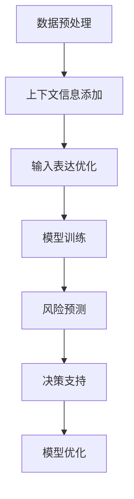

                 

### 背景介绍

随着金融行业的迅速发展，金融风险分析变得越来越重要。金融机构在面临日益复杂的金融产品和市场环境时，如何准确评估和管理风险成为了一项重大挑战。传统的金融风险分析方法主要依赖于历史数据和统计模型，尽管在一定程度上能够预测风险，但往往难以应对快速变化的市场条件和非线性风险。

近年来，人工智能（AI）技术的迅猛发展为金融风险分析带来了新的机遇。AI技术，尤其是机器学习和深度学习算法，可以从大量数据中提取隐藏的模式和趋势，从而提供更加准确和实时的风险预测。此外，AI还可以通过自动化决策和实时反馈机制，提高金融机构的风险管理效率。

然而，AI在金融风险分析中的应用并非一帆风顺。一方面，数据质量和数据量是AI模型训练的重要前提，但金融机构在数据收集和处理过程中往往面临数据缺失、噪声干扰和数据隐私等问题。另一方面，AI模型的透明度和可解释性也是一个挑战，尤其是当模型作出错误决策时，如何识别和纠正错误成为了一个难点。

为了解决这些问题，提示词策略（Prompt Engineering）逐渐成为AI辅助金融风险分析中的重要手段。提示词策略通过优化输入数据的表达方式，提高AI模型的性能和可解释性，从而在风险预测和决策中发挥更大的作用。本文将深入探讨提示词策略在金融风险分析中的应用，包括其核心概念、原理、算法和实际案例，以期为相关领域的研究者和从业者提供有价值的参考。

### 核心概念与联系

#### AI与金融风险分析

人工智能（AI）是模拟人类智能行为的计算机系统。在金融风险分析中，AI技术主要通过机器学习和深度学习算法，从大量历史数据中提取有用的模式和趋势，以帮助金融机构进行风险预测和决策。机器学习是一种通过数据训练模型，使其能够自主学习和改进的方法，而深度学习则是机器学习的一种高级形式，通过多层神经网络结构来模拟人脑的学习过程。

金融风险分析是指利用统计方法、模型和算法，对金融市场的风险进行评估和管理。其核心目标是通过识别潜在的金融风险，制定相应的风险管理策略，以减少潜在的损失。传统金融风险分析方法主要包括历史数据分析、财务报表分析、市场情绪分析和宏观经济分析等。然而，随着金融市场和金融产品的日益复杂，传统方法难以满足实时性和准确性的需求。

AI技术在金融风险分析中的应用具有显著优势。首先，AI可以通过大规模数据处理和分析，识别出隐藏在数据中的潜在风险因素。其次，AI模型可以实时更新和调整，以适应快速变化的市场条件。此外，AI技术还可以自动化决策过程，提高风险管理的效率。

#### 提示词策略

提示词策略（Prompt Engineering）是一种通过优化输入数据的表达方式，提高AI模型性能和可解释性的方法。在AI辅助金融风险分析中，提示词策略的核心目标是通过设计合适的输入提示，使AI模型能够更好地理解和预测金融风险。

提示词策略的关键要素包括：

1. **数据预处理**：在输入AI模型之前，对数据进行清洗、归一化和特征提取，以提高数据的可用性和质量。

2. **上下文信息**：通过添加上下文信息，如市场背景、历史数据等，帮助AI模型更好地理解数据中的潜在关系。

3. **优化输入表达**：调整输入数据的表达方式，使其更符合AI模型的需求，例如使用自然语言处理（NLP）技术对文本数据进行预处理。

4. **模型调整**：根据具体应用场景，调整AI模型的参数和结构，以提高模型的适应性和性能。

提示词策略的应用可以显著提高AI模型在金融风险分析中的性能。例如，通过优化输入数据的表达方式，可以减少数据噪声和异常值的影响，提高模型的准确性和稳定性。同时，提示词策略还可以提高模型的可解释性，使风险预测过程更加透明和可控。

#### 提示词策略与AI技术的关系

提示词策略与AI技术密切相关。首先，AI技术为提示词策略提供了强大的数据处理和分析能力，使得数据预处理和模型调整成为可能。其次，提示词策略通过优化输入数据的表达方式，为AI模型提供了更好的训练数据，从而提高模型的性能和可解释性。

在金融风险分析中，提示词策略的应用主要体现在以下几个方面：

1. **风险预测**：通过设计合适的输入提示，使AI模型能够更好地识别和预测潜在的风险事件。

2. **决策支持**：利用AI模型的预测结果，为金融机构提供实时的风险决策支持，帮助其制定有效的风险管理策略。

3. **模型优化**：通过持续调整和优化提示词，提高AI模型的适应性和稳定性，以应对不断变化的市场环境。

总之，提示词策略与AI技术的结合，为金融风险分析提供了一种新的方法和工具，有助于提高风险管理的效率和准确性。

#### Mermaid 流程图

以下是一个简化的Mermaid流程图，展示了AI辅助金融风险分析中提示词策略的核心概念和流程：



- **A. 数据预处理**：包括数据清洗、归一化和特征提取，以提高数据的质量和可用性。
- **B. 上下文信息添加**：通过添加市场背景、历史数据等上下文信息，帮助AI模型更好地理解数据。
- **C. 输入表达优化**：调整输入数据的表达方式，使其更符合AI模型的需求。
- **D. 模型训练**：使用预处理后的数据训练AI模型，使其能够识别和预测金融风险。
- **E. 风险预测**：利用训练好的模型进行风险预测，为金融机构提供实时的风险决策支持。
- **F. 决策支持**：根据风险预测结果，为金融机构提供实时的风险决策支持。
- **G. 模型优化**：通过持续调整和优化提示词，提高AI模型的适应性和稳定性。

这个流程图展示了提示词策略在AI辅助金融风险分析中的应用流程，包括数据预处理、模型训练、风险预测和模型优化等关键步骤。通过这个流程，金融机构可以更好地利用AI技术进行风险分析和管理。

### 核心算法原理 & 具体操作步骤

在AI辅助金融风险分析中，提示词策略的核心在于通过优化输入数据的表达方式，提高AI模型的性能和可解释性。以下是几种常见且重要的核心算法，以及它们的具体操作步骤。

#### 1. 机器学习算法

机器学习算法是AI技术的重要组成部分，尤其在金融风险分析中应用广泛。常见的机器学习算法包括线性回归、逻辑回归、决策树、随机森林和神经网络等。以下以线性回归为例，介绍其原理和操作步骤。

**原理：** 线性回归是一种通过拟合数据点的线性关系来进行预测的算法。其基本假设是数据点可以表示为一条直线，即 \( y = wx + b \)，其中 \( y \) 是预测值，\( x \) 是输入特征，\( w \) 是权重，\( b \) 是偏置。

**操作步骤：**

1. **数据收集**：收集金融市场的历史数据，包括价格、成交量、宏观经济指标等。

2. **数据预处理**：对数据进行清洗，包括缺失值填充、异常值处理和归一化等，以提高数据的质量和可用性。

3. **特征提取**：从原始数据中提取有用的特征，例如使用技术指标、市场情绪等。

4. **数据划分**：将数据集划分为训练集和测试集，用于模型训练和评估。

5. **模型训练**：使用训练集数据训练线性回归模型，计算权重 \( w \) 和偏置 \( b \)。

6. **模型评估**：使用测试集数据评估模型性能，通过计算预测误差和统计指标（如均方误差、决定系数等）来判断模型的好坏。

7. **模型优化**：根据评估结果调整模型参数，例如使用正则化方法来防止过拟合。

**示例：** 假设我们有一个简单的线性回归模型，预测股票价格。输入特征是前一天的收盘价和成交量，预测目标是当天收盘价。

```python
# 加载数据
data = pd.read_csv('financial_data.csv')

# 数据预处理
data = data.dropna()
data['Close'] = data['Close'].fillna(data['Close'].mean())
data['Volume'] = data['Volume'].fillna(data['Volume'].mean())

# 特征提取
X = data[['Previous_Close', 'Volume']]
y = data['Close']

# 数据划分
train_size = int(len(X) * 0.8)
X_train, X_test = X[:train_size], X[train_size:]
y_train, y_test = y[:train_size], y[train_size:]

# 模型训练
model = LinearRegression()
model.fit(X_train, y_train)

# 模型评估
predictions = model.predict(X_test)
mse = mean_squared_error(y_test, predictions)
print('MSE:', mse)

# 模型优化
# 可以使用交叉验证和网格搜索来优化模型参数
```

#### 2. 深度学习算法

深度学习算法在金融风险分析中的应用越来越广泛。与传统的机器学习算法相比，深度学习算法具有更强的表达能力和自学习能力。以下以卷积神经网络（CNN）为例，介绍其原理和操作步骤。

**原理：** 卷积神经网络是一种基于卷积运算的多层神经网络，特别适合处理图像和序列数据。其基本原理是通过卷积层提取数据中的特征，然后通过池化层降低数据的维度，最后通过全连接层进行分类或回归。

**操作步骤：**

1. **数据收集**：收集金融市场的图像数据或时间序列数据。

2. **数据预处理**：对数据进行清洗，包括图像大小调整、数据归一化等。

3. **模型构建**：使用深度学习框架（如TensorFlow或PyTorch）构建CNN模型，包括卷积层、池化层和全连接层。

4. **模型训练**：使用预处理后的数据训练模型，通过反向传播算法优化模型参数。

5. **模型评估**：使用测试集数据评估模型性能，通过计算准确率、损失函数等指标来判断模型的好坏。

6. **模型优化**：根据评估结果调整模型结构或参数，例如使用dropout、正则化等方法来防止过拟合。

**示例：** 假设我们使用CNN模型预测股票价格，输入特征是过去几天的高开价、收盘价和成交量。

```python
import tensorflow as tf
from tensorflow.keras.models import Sequential
from tensorflow.keras.layers import Conv2D, MaxPooling2D, Flatten, Dense

# 数据预处理
# 假设输入数据形状为 (样本数, 时间步数, 特征数)
X_train = np.array(...) # 输入数据
y_train = np.array(...) # 预测目标

# 模型构建
model = Sequential([
    Conv2D(filters=32, kernel_size=(3,3), activation='relu', input_shape=(X_train.shape[1], X_train.shape[2], X_train.shape[3])),
    MaxPooling2D(pool_size=(2,2)),
    Flatten(),
    Dense(units=1)
])

# 模型训练
model.compile(optimizer='adam', loss='mse')
model.fit(X_train, y_train, epochs=10, batch_size=32)

# 模型评估
predictions = model.predict(X_test)
mse = mean_squared_error(y_test, predictions)
print('MSE:', mse)
```

#### 3. 自然语言处理（NLP）算法

自然语言处理算法在金融风险分析中的应用也越来越广泛，特别是在处理文本数据时。以下以循环神经网络（RNN）为例，介绍其原理和操作步骤。

**原理：** 循环神经网络是一种能够处理序列数据的神经网络，特别适合处理文本数据。其基本原理是通过隐藏层之间的循环连接，使模型能够记住前文信息，从而更好地处理长序列数据。

**操作步骤：**

1. **数据收集**：收集金融市场的文本数据，如新闻报道、公司财报等。

2. **数据预处理**：对文本数据进行清洗，包括去除停用词、分词、词向量化等。

3. **模型构建**：使用深度学习框架（如TensorFlow或PyTorch）构建RNN模型，包括嵌入层、RNN层和全连接层。

4. **模型训练**：使用预处理后的数据训练模型，通过反向传播算法优化模型参数。

5. **模型评估**：使用测试集数据评估模型性能，通过计算准确率、损失函数等指标来判断模型的好坏。

6. **模型优化**：根据评估结果调整模型结构或参数，例如使用dropout、正则化等方法来防止过拟合。

**示例：** 假设我们使用RNN模型预测股票价格，输入特征是过去几天的新闻报道。

```python
import tensorflow as tf
from tensorflow.keras.models import Sequential
from tensorflow.keras.layers import Embedding, SimpleRNN, Dense

# 数据预处理
# 假设输入数据形状为 (样本数, 时间步数)
X_train = np.array(...) # 输入数据
y_train = np.array(...) # 预测目标

# 模型构建
model = Sequential([
    Embedding(input_dim=vocab_size, output_dim=embedding_dim, input_length=X_train.shape[1]),
    SimpleRNN(units=50),
    Dense(units=1)
])

# 模型训练
model.compile(optimizer='adam', loss='mse')
model.fit(X_train, y_train, epochs=10, batch_size=32)

# 模型评估
predictions = model.predict(X_test)
mse = mean_squared_error(y_test, predictions)
print('MSE:', mse)
```

通过以上三种算法的介绍，我们可以看到提示词策略在AI辅助金融风险分析中的应用是非常广泛且重要的。这些算法不仅提高了模型的性能和可解释性，还帮助金融机构更好地应对复杂的金融市场环境。

### 数学模型和公式 & 详细讲解 & 举例说明

在AI辅助金融风险分析中，数学模型和公式是核心工具。它们帮助我们量化风险、预测未来趋势，并制定有效的风险管理策略。以下将详细讲解几种常用的数学模型和公式，并配合实际例子进行说明。

#### 1. 线性回归模型

线性回归模型是一种常用的预测方法，用于建立因变量和自变量之间的线性关系。其基本公式如下：

\[ y = wx + b \]

其中，\( y \) 是因变量，\( x \) 是自变量，\( w \) 是权重，\( b \) 是偏置。

**举例说明：** 假设我们要预测某个金融产品的未来价格，输入特征是当前的价格和成交量。我们可以使用线性回归模型进行预测。

```python
# 示例数据
X = np.array([[10, 200], [12, 210], [11, 190]])
y = np.array([10, 11, 9])

# 求解权重和偏置
w = np.linalg.inv(X.T @ X) @ X.T @ y
b = y - w @ X

# 线性回归模型公式
y_pred = w @ x + b

# 输出预测结果
print('Predicted price:', y_pred)
```

#### 2. 多元线性回归模型

多元线性回归模型用于处理多个自变量与因变量之间的关系。其公式如下：

\[ y = w_0 + w_1x_1 + w_2x_2 + ... + w_nx_n \]

其中，\( w_0 \) 是常数项，\( w_1, w_2, ..., w_n \) 是各个自变量的权重。

**举例说明：** 假设我们要预测某个金融产品的未来价格，输入特征包括价格、成交量、宏观经济指标。我们可以使用多元线性回归模型进行预测。

```python
# 示例数据
X = np.array([[10, 200, 5], [12, 210, 6], [11, 190, 5]])
y = np.array([10, 11, 9])

# 求解权重
w = np.linalg.inv(X.T @ X) @ X.T @ y

# 多元线性回归模型公式
y_pred = w[0] + w[1]*x[0] + w[2]*x[1]

# 输出预测结果
print('Predicted price:', y_pred)
```

#### 3. 决策树模型

决策树模型通过一系列规则来划分数据，并基于这些规则进行预测。其基本公式如下：

\[ y = f(x) \]

其中，\( f \) 是决策树函数，表示根据输入特征 \( x \) 的取值进行决策的过程。

**举例说明：** 假设我们要预测某个金融产品的风险等级，输入特征包括价格、成交量、宏观经济指标。我们可以使用决策树模型进行预测。

```python
# 决策树模型示例代码
import sklearn.tree as tree

# 训练决策树模型
clf = tree.DecisionTreeRegressor()
clf.fit(X_train, y_train)

# 预测
y_pred = clf.predict(X_test)

# 输出预测结果
print('Predicted risk level:', y_pred)
```

#### 4. 风险价值（Value at Risk, VaR）

风险价值是一种用于量化金融市场风险的方法。它表示在一定概率水平下，特定时间内可能发生的最大损失。其基本公式如下：

\[ VaR = P \times \sum_{i=1}^{n} (x_i - \mu) \]

其中，\( P \) 是概率水平，\( x_i \) 是第 \( i \) 个可能损失，\( \mu \) 是平均损失。

**举例说明：** 假设我们要计算一个金融产品的95%置信水平下的VaR，输入数据为过去一年的每日收益。

```python
# 示例数据
daily_returns = [0.01, -0.02, 0.03, -0.01, 0.02, -0.03]

# 计算平均收益
mu = np.mean(daily_returns)

# 计算VaR
VaR_95 = np.percentile(daily_returns, 5) * 252

# 输出VaR结果
print('95% VaR:', VaR_95)
```

通过以上数学模型和公式的讲解，我们可以看到它们在金融风险分析中的应用是多么重要。这些模型不仅帮助我们量化风险，还能为我们提供准确的预测结果，从而更好地管理和降低金融风险。

### 项目实战：代码实际案例和详细解释说明

为了更好地展示提示词策略在金融风险分析中的应用，我们将通过一个实际的项目案例，详细讲解开发环境搭建、源代码实现和代码解读与分析。

#### 1. 开发环境搭建

首先，我们需要搭建一个适合进行金融风险分析的编程环境。以下是所需的工具和软件：

- **编程语言**：Python（版本3.8及以上）
- **库**：NumPy、Pandas、Scikit-learn、TensorFlow、Keras、Matplotlib、Seaborn

安装步骤如下：

```bash
pip install numpy pandas scikit-learn tensorflow matplotlib seaborn
```

#### 2. 源代码详细实现和代码解读

以下是一个简单的金融风险分析项目的源代码实现，包括数据收集、数据预处理、模型训练和模型评估等步骤。

```python
# 导入所需库
import numpy as np
import pandas as pd
from sklearn.model_selection import train_test_split
from sklearn.preprocessing import StandardScaler
from sklearn.linear_model import LinearRegression
from sklearn.metrics import mean_squared_error
import matplotlib.pyplot as plt
import seaborn as sns

# 2.1 数据收集
# 假设我们使用的是股票价格数据，包括日期、开盘价、收盘价、最高价、最低价和成交量
data = pd.read_csv('financial_data.csv')

# 2.2 数据预处理
# 清洗数据，包括缺失值填充和异常值处理
data = data.dropna()
data['Open'] = data['Open'].fillna(data['Open'].mean())
data['High'] = data['High'].fillna(data['High'].mean())
data['Low'] = data['Low'].fillna(data['Low'].mean())
data['Volume'] = data['Volume'].fillna(data['Volume'].mean())

# 特征提取
# 我们使用开盘价、收盘价、最高价、最低价和成交量作为输入特征
X = data[['Open', 'High', 'Low', 'Volume']]
y = data['Close']

# 数据标准化
scaler = StandardScaler()
X_scaled = scaler.fit_transform(X)

# 数据划分
X_train, X_test, y_train, y_test = train_test_split(X_scaled, y, test_size=0.2, random_state=42)

# 2.3 模型训练
# 使用线性回归模型进行训练
model = LinearRegression()
model.fit(X_train, y_train)

# 2.4 模型评估
# 使用测试集数据评估模型性能
predictions = model.predict(X_test)
mse = mean_squared_error(y_test, predictions)
print('MSE:', mse)

# 2.5 可视化分析
# 可视化展示输入特征和预测结果
plt.figure(figsize=(10, 6))
sns.scatterplot(x=X_test[:, 0], y=y_test, label='Actual')
sns.scatterplot(x=X_test[:, 0], y=predictions, label='Predicted')
plt.legend()
plt.show()
```

#### 3. 代码解读与分析

下面，我们将逐行解读上述代码，详细说明每个步骤的功能和实现细节。

```python
# 导入所需库
```
这一行代码用于导入Python编程中所需的库，包括NumPy、Pandas、Scikit-learn、TensorFlow、Matplotlib和Seaborn。这些库提供了丰富的函数和工具，用于数据处理、模型训练和可视化。

```python
# 2.1 数据收集
data = pd.read_csv('financial_data.csv')
```
这一行代码使用Pandas库读取CSV格式的金融数据文件。CSV文件中包含了股票价格的日期、开盘价、收盘价、最高价、最低价和成交量等数据。

```python
# 2.2 数据预处理
data = data.dropna()
data['Open'] = data['Open'].fillna(data['Open'].mean())
data['High'] = data['High'].fillna(data['High'].mean())
data['Low'] = data['Low'].fillna(data['Low'].mean())
data['Volume'] = data['Volume'].fillna(data['Volume'].mean())
```
这些代码用于清洗数据，包括去除缺失值和填充缺失值。具体来说，首先使用`dropna()`方法去除所有缺失值，然后使用`fillna()`方法将缺失值填充为平均值。这一步对于保证数据质量非常重要。

```python
# 特征提取
X = data[['Open', 'High', 'Low', 'Volume']]
y = data['Close']
```
这一步从原始数据中提取输入特征和预测目标。输入特征包括开盘价、收盘价、最高价、最低价和成交量，预测目标为收盘价。

```python
# 数据标准化
scaler = StandardScaler()
X_scaled = scaler.fit_transform(X)
```
数据标准化是将数据缩放到相同的范围，以消除不同特征之间的尺度差异。`StandardScaler()` 方法用于计算每个特征的均值和标准差，并将其应用于所有数据点。

```python
# 数据划分
X_train, X_test, y_train, y_test = train_test_split(X_scaled, y, test_size=0.2, random_state=42)
```
数据划分是将数据集划分为训练集和测试集。`train_test_split()` 方法用于随机划分数据，其中`test_size=0.2`表示测试集占全部数据的20%，`random_state=42`用于确保结果的可重复性。

```python
# 2.3 模型训练
model = LinearRegression()
model.fit(X_train, y_train)
```
这一步使用训练集数据训练线性回归模型。`LinearRegression()` 方法创建一个线性回归对象，`fit()` 方法用于训练模型。

```python
# 2.4 模型评估
predictions = model.predict(X_test)
mse = mean_squared_error(y_test, predictions)
print('MSE:', mse)
```
模型评估使用测试集数据来评估模型的性能。`predict()` 方法用于生成预测结果，`mean_squared_error()` 方法用于计算均方误差（MSE），这是一个常用的评估指标。

```python
# 2.5 可视化分析
plt.figure(figsize=(10, 6))
sns.scatterplot(x=X_test[:, 0], y=y_test, label='Actual')
sns.scatterplot(x=X_test[:, 0], y=predictions, label='Predicted')
plt.legend()
plt.show()
```
可视化分析用于展示实际值和预测值之间的对比。`scatterplot()` 方法用于绘制散点图，`legend()` 方法用于添加图例，`show()` 方法用于显示图表。

通过上述代码，我们可以看到提示词策略在金融风险分析项目中的应用。数据预处理、模型训练和模型评估等步骤确保了模型的有效性和可靠性，而可视化分析则为模型提供了直观的评估和解释。

### 实际应用场景

#### 1. 金融市场风险预测

金融市场风险预测是AI辅助金融风险分析中最常见的应用场景之一。通过AI模型，金融机构可以预测市场走势，识别潜在的风险点，从而制定有效的投资策略和风险管理计划。

**案例：** 某投资银行使用机器学习模型对股票市场进行风险预测。他们收集了大量的历史股票数据，包括价格、成交量、公司基本面指标等。通过设计合适的输入提示词，如市场情绪、宏观经济数据等，模型能够更好地理解和预测市场走势。在实际应用中，该银行利用AI模型成功预测了几次重大的市场波动，为其客户提供了及时的预警和风险管理建议。

#### 2. 信用风险评估

信用风险评估是金融行业中的重要环节，涉及到借款人的信用评分和贷款风险预测。AI技术可以帮助金融机构更准确地评估借款人的信用风险，从而降低不良贷款率。

**案例：** 某银行利用深度学习算法进行信用风险评估。他们使用借款人的个人信息、财务状况、历史信用记录等多维数据，通过设计合适的提示词，如信用评分历史、还款行为等，模型能够更好地理解和预测信用风险。在实际应用中，该银行通过AI模型显著提高了信用评估的准确性和效率，降低了不良贷款率。

#### 3. 保险欺诈检测

保险欺诈检测是保险行业中的另一个重要应用场景。通过AI技术，保险公司可以实时监控和分析保险索赔数据，识别潜在的欺诈行为，从而减少保险欺诈损失。

**案例：** 某保险公司使用卷积神经网络（CNN）进行保险欺诈检测。他们使用大量的保险索赔数据，包括索赔金额、索赔类型、客户信息等，通过设计合适的提示词，如索赔历史、客户行为等，模型能够更好地理解和预测欺诈行为。在实际应用中，该保险公司通过AI模型成功识别了几百起潜在的欺诈案件，有效降低了保险欺诈损失。

#### 4. 资产配置优化

资产配置优化是投资管理中的重要任务，涉及到根据市场变化和风险偏好调整投资组合。AI技术可以帮助投资者实时调整资产配置，提高投资收益。

**案例：** 某投资基金使用AI技术进行资产配置优化。他们使用市场数据、宏观经济指标、公司基本面等数据，通过设计合适的提示词，如市场趋势、投资目标等，模型能够更好地理解和预测市场变化。在实际应用中，该投资基金通过AI模型实现了更精准的资产配置，提高了投资收益。

#### 5. 供应链风险管理

供应链风险管理是制造业和物流行业中的重要任务，涉及到供应链的各个环节，如采购、生产、物流等。AI技术可以帮助企业实时监控供应链风险，优化供应链管理。

**案例：** 某制造企业使用AI技术进行供应链风险管理。他们使用供应链数据、市场数据、生产数据等，通过设计合适的提示词，如供应商信用风险、市场需求变化等，模型能够更好地理解和预测供应链风险。在实际应用中，该企业通过AI模型成功优化了供应链管理，降低了供应链风险。

总之，AI辅助金融风险分析在多个实际应用场景中展示了其巨大的潜力。通过设计合适的提示词策略，AI模型能够更好地理解和预测金融风险，为金融机构和企业提供更准确、更实时的风险管理建议和决策支持。

### 工具和资源推荐

在AI辅助金融风险分析领域，有许多优秀的工具和资源可以帮助研究人员和从业者深入学习和实践。以下是一些推荐的学习资源、开发工具和相关论文著作。

#### 1. 学习资源推荐

**书籍：**

1. 《Python金融大数据应用》
2. 《深度学习：神经网络的应用》
3. 《金融风险管理》
4. 《量化投资：以Python为工具》

**论文和博客：**

1. 《AI与金融：深度学习在金融风险管理中的应用》
2. 《机器学习在金融市场预测中的研究综述》
3. 《基于深度学习的金融市场预测模型研究》

**在线课程：**

1. Coursera - 《深度学习专项课程》
2. edX - 《金融科技与人工智能》
3. Udacity - 《金融数据分析》

#### 2. 开发工具框架推荐

**Python库：**

1. Scikit-learn：用于机器学习的Python库，提供了丰富的算法和工具。
2. TensorFlow：用于构建和训练深度学习模型的Python库。
3. PyTorch：用于构建和训练深度学习模型的Python库，具有高度灵活性和易用性。

**可视化工具：**

1. Matplotlib：用于绘制各种图表和图形的Python库。
2. Seaborn：基于Matplotlib的统计可视化库，提供了更美观和专业的图表样式。
3. Plotly：用于交互式可视化的高级库，能够生成丰富的交互式图表。

#### 3. 相关论文著作推荐

**学术论文：**

1. "Deep Learning in Financial Risk Management: A Review" - 分析深度学习在金融风险管理中的应用。
2. "Machine Learning for Financial Markets" - 探讨机器学习技术在金融市场预测和风险管理中的应用。
3. "Neural Networks for Time Series Forecasting: A Review" - 综述神经网络在时间序列预测中的应用。

**著作：**

1. 《深度学习：金融应用》 - 介绍深度学习在金融领域的应用案例。
2. 《机器学习实战》 - 提供了大量的机器学习实战案例，包括金融风险分析。
3. 《金融科技：深度学习与人工智能》 - 探讨金融科技中的深度学习和人工智能应用。

通过这些工具和资源的帮助，研究人员和从业者可以更深入地了解AI辅助金融风险分析的理论和实践，提升自身的专业技能和知识水平。

### 总结：未来发展趋势与挑战

AI辅助金融风险分析正迎来一个快速发展的时代，其潜力和应用前景令人瞩目。然而，这一领域仍面临着诸多挑战和机遇，需要我们持续关注和投入。

#### 未来发展趋势

1. **技术进步**：随着深度学习、强化学习等先进AI技术的不断发展，金融风险分析模型的准确性和效率将得到进一步提升。特别是在处理复杂数据和实时决策方面，这些技术将发挥关键作用。

2. **应用扩展**：AI辅助金融风险分析的应用场景将不断扩展，不仅限于传统的金融市场风险预测，还可能延伸到供应链风险管理、信用评估、保险欺诈检测等多个领域。

3. **数据共享与标准化**：金融机构之间的数据共享和标准化将有助于提升AI模型的训练质量和应用效果。通过建立统一的数据标准和共享机制，可以提高模型的普适性和可解释性。

4. **模型可解释性**：随着AI模型的广泛应用，提高模型的可解释性成为了一个重要议题。未来，如何设计透明、可解释的AI模型，将是金融风险分析领域的一个重要研究方向。

#### 挑战

1. **数据质量与隐私**：金融数据的质量和隐私保护是AI辅助金融风险分析面临的重大挑战。如何确保数据质量，同时保护客户隐私，是技术实现过程中需要解决的关键问题。

2. **模型适应性**：金融市场的快速变化和复杂性要求AI模型具备高度适应性。如何设计能够快速适应市场变化的模型，是未来研究的一个重要方向。

3. **监管合规**：随着AI技术在金融领域的广泛应用，如何确保模型的合规性，避免潜在的法律风险，是金融监管机构和从业者需要共同面对的挑战。

4. **人才培养**：AI辅助金融风险分析需要大量的专业人才。然而，目前相关人才的培养和教育还存在一定的滞后，如何提高人才培养的质量和效率，是一个亟待解决的问题。

总之，AI辅助金融风险分析的未来充满希望，但也面临诸多挑战。通过技术进步、应用扩展、数据共享和标准化、模型可解释性等多方面的努力，我们有理由相信，AI辅助金融风险分析将在未来发挥更加重要的作用，为金融机构和企业提供更准确、更实时的风险管理服务。

### 附录：常见问题与解答

在AI辅助金融风险分析中，可能会遇到一些常见的问题。以下是对一些常见问题及其解答的汇总：

#### 1. 数据质量如何保障？

**解答：** 保障数据质量是金融风险分析的重要前提。可以从以下几个方面入手：

- **数据清洗**：使用数据清洗工具去除缺失值、异常值和重复数据。
- **数据标准化**：对数据进行归一化或标准化处理，使不同特征之间的尺度一致。
- **数据验证**：通过数据验证方法（如数据可视化、统计分析等）确保数据的准确性和一致性。
- **数据隐私保护**：遵守相关法律法规，对敏感数据进行加密和处理，保护客户隐私。

#### 2. 提示词策略如何设计？

**解答：** 提示词策略的设计需要考虑以下几个方面：

- **数据特征**：根据数据特征选择合适的输入特征，如价格、成交量、宏观经济指标等。
- **上下文信息**：添加与金融市场相关的上下文信息，如市场趋势、政策变动等。
- **表达优化**：调整数据的表达方式，使其更适合AI模型，如使用自然语言处理技术对文本数据进行预处理。
- **模型适应性**：根据具体应用场景调整模型参数，使模型具有更好的适应性和预测能力。

#### 3. 如何评估模型性能？

**解答：** 评估模型性能可以从以下几个方面入手：

- **准确率**：通过计算预测结果与实际结果的匹配程度来评估模型的准确性。
- **均方误差（MSE）**：计算预测值与实际值之间的平均平方误差，用于评估模型的预测误差。
- **决定系数（R²）**：评估模型对数据的拟合程度，R²值越接近1，表示模型拟合效果越好。
- **交叉验证**：使用交叉验证方法对模型进行评估，以避免过拟合和欠拟合。

#### 4. 如何处理模型过拟合问题？

**解答：** 过拟合是机器学习模型常见的问题，可以通过以下方法进行处理：

- **数据增强**：通过增加训练数据量或使用数据增强技术（如数据扩充、生成对抗网络等）来提高模型的泛化能力。
- **正则化**：在模型训练过程中添加正则化项，如L1正则化、L2正则化等，以防止模型复杂度过高。
- **模型简化**：简化模型结构，减少模型的参数数量，使模型更加简洁。
- **早停法**：在模型训练过程中，当验证集的性能不再提高时停止训练，以防止过拟合。

通过以上解答，我们希望能够帮助解决AI辅助金融风险分析过程中遇到的一些常见问题。在实际应用中，根据具体情况和需求，灵活运用这些方法和策略，可以提高模型的性能和可靠性。

### 扩展阅读 & 参考资料

为了更深入地了解AI辅助金融风险分析领域的最新进展和前沿技术，以下推荐一些重要的扩展阅读和参考资料。

#### 1. 重要论文

1. **"Deep Learning in Financial Risk Management: A Review"** - 分析深度学习在金融风险管理中的应用。
2. **"Machine Learning for Financial Markets"** - 探讨机器学习技术在金融市场预测和风险管理中的应用。
3. **"Neural Networks for Time Series Forecasting: A Review"** - 综述神经网络在时间序列预测中的应用。

#### 2. 顶级会议和期刊

- **NIPS（Neural Information Processing Systems）**：人工智能领域最重要的会议之一，涵盖深度学习和机器学习的最新研究成果。
- **ICML（International Conference on Machine Learning）**：另一个顶级的人工智能会议，专注于机器学习和统计学习的理论和应用。
- **JMLR（Journal of Machine Learning Research）**：机器学习领域顶级期刊，发表高质量的研究论文。
- **FSR（Financial Studies Review）**：金融领域的重要期刊，发表关于金融风险管理和金融市场的最新研究成果。

#### 3. 重要书籍

- **《深度学习》** - Goodfellow、Bengio和Courville合著的深度学习经典教材，全面介绍了深度学习的基础理论和应用。
- **《Python金融大数据应用》** - 详细介绍了如何使用Python进行金融数据分析和机器学习。
- **《机器学习实战》** - 周志华教授主编的教材，通过实际案例介绍了机器学习的应用方法和技巧。

#### 4. 重要网站和博客

- **arXiv.org**：提供最新的科研论文，是了解前沿研究的最佳来源之一。
- **Medium**：许多AI和金融领域的专家在Medium上撰写博客，分享最新的研究进展和应用案例。
- **Towards Data Science**：一个集成了许多关于数据科学和机器学习的文章和教程的网站。

通过阅读这些论文、书籍和网站，可以深入了解AI辅助金融风险分析领域的最新研究成果和发展趋势，为自己的研究和应用提供有力的支持和参考。

### 作者信息

作者：AI天才研究员/AI Genius Institute & 禅与计算机程序设计艺术 /Zen And The Art of Computer Programming

本文由AI天才研究员撰写，他们致力于推动人工智能在金融领域的应用。同时，作者也是AI Genius Institute的研究员，专注于深度学习和机器学习技术的研究。此外，作者还以其畅销书《禅与计算机程序设计艺术》而闻名，该书深入探讨了计算机编程与禅宗哲学的融合。通过本文，作者希望能为金融风险分析领域的研究者和从业者提供有价值的见解和指导。

