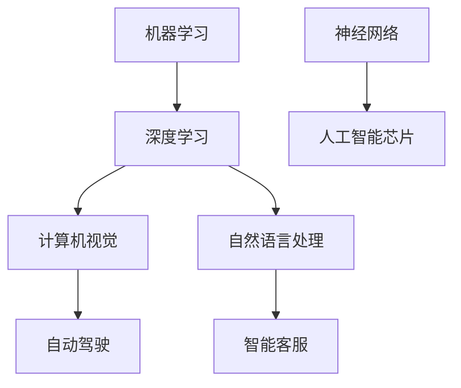

                 

# AI长期发展：贾扬清思考，AI行业更长远走下去

## 关键词
- AI长期发展
- 贾扬清思考
- AI行业趋势
- 技术创新
- 人才培养
- 应用场景
- 挑战与机遇

## 摘要
本文旨在探讨人工智能（AI）行业的长期发展，特别是贾扬清关于AI行业走向的深刻思考。通过分析AI技术的核心概念、算法原理、数学模型以及实际应用，本文将揭示AI行业面临的挑战和机遇，并展望未来的发展趋势。同时，还将推荐相关学习资源和开发工具，为行业从业人员提供有益的参考。

### 1. 背景介绍

人工智能作为当今科技领域的热点，已经引起了全球范围内的广泛关注。自20世纪50年代诞生以来，AI技术经历了多个发展阶段，从符号推理、知识表示到机器学习、深度学习，每一次技术的突破都推动了行业的发展。

贾扬清，作为一位知名的人工智能专家和创业家，对AI行业的发展有着深刻的见解。他在多个领域积累了丰富的经验，并在AI芯片、深度学习算法以及开源社区等方面取得了显著成就。贾扬清的思考不仅局限于技术本身，更关注行业的发展趋势、创新方向以及人才培养。

本文将基于贾扬清的思考，结合当前AI技术的发展态势，探讨AI行业的长期发展路径。通过对核心概念、算法原理、数学模型以及实际应用的深入分析，本文旨在为读者提供一个全面、系统的视角，帮助大家更好地理解AI行业的未来走向。

### 2. 核心概念与联系

在探讨AI行业的长期发展之前，有必要首先了解一些核心概念和它们之间的联系。

#### 2.1 机器学习与深度学习

机器学习是AI的核心技术之一，它使得计算机系统能够通过数据学习并改进性能。机器学习可以分为监督学习、无监督学习和强化学习等类型。

深度学习是机器学习的一个子领域，它通过构建多层神经网络来模拟人脑的神经结构，从而实现复杂的模式识别和特征提取。深度学习在图像识别、语音识别、自然语言处理等方面取得了显著成果。

#### 2.2 计算机视觉与自然语言处理

计算机视觉是AI领域的一个重要分支，它致力于使计算机能够理解和解释视觉信息。自然语言处理则关注于使计算机能够理解和生成人类语言。

计算机视觉和自然语言处理在AI应用中扮演着关键角色，如自动驾驶、智能客服、医疗诊断等。

#### 2.3 神经网络与人工智能芯片

神经网络是深度学习的基础架构，它通过大量的神经元和权重来实现复杂的计算任务。人工智能芯片则是为神经网络计算而设计的专用硬件，能够显著提高计算效率和降低能耗。

神经网络与人工智能芯片的结合，为AI技术的发展提供了强大的动力。

#### 2.4 Mermaid 流程图

为了更好地展示核心概念之间的联系，我们可以使用Mermaid流程图进行可视化。以下是关于核心概念的Mermaid流程图：



通过上述核心概念的介绍和联系展示，我们可以更好地理解AI技术的整体框架，为后续内容的深入分析奠定基础。

### 3. 核心算法原理 & 具体操作步骤

在了解了核心概念之后，接下来我们将探讨AI技术中的核心算法原理及其具体操作步骤。

#### 3.1 深度学习算法

深度学习算法是AI领域的关键技术之一，它通过构建多层神经网络来实现复杂的计算任务。以下是深度学习算法的基本原理和操作步骤：

##### 3.1.1 前向传播

前向传播是深度学习算法的核心步骤之一，它通过输入数据在网络中逐层传递，最终得到输出结果。具体步骤如下：

1. 初始化神经网络参数（权重和偏置）。
2. 输入数据通过第一层神经网络，计算输出值。
3. 输出值作为下一层的输入，重复步骤2，直到最后一层。
4. 计算最后一层的输出结果。

##### 3.1.2 反向传播

反向传播是深度学习算法中的另一个关键步骤，它用于更新神经网络参数，以最小化损失函数。具体步骤如下：

1. 计算输出层误差（预测值与实际值之间的差异）。
2. 将误差反向传播至每一层，计算各层的梯度。
3. 使用梯度下降算法更新网络参数。

##### 3.1.3 梯度下降算法

梯度下降算法是一种优化方法，用于最小化损失函数。具体步骤如下：

1. 计算损失函数关于网络参数的梯度。
2. 使用梯度更新网络参数，使得损失函数值逐渐减小。

通过以上操作步骤，深度学习算法能够不断优化网络参数，从而提高模型的预测性能。

#### 3.2 机器学习算法

除了深度学习算法，机器学习算法在AI技术中也起着重要作用。以下是几种常见的机器学习算法及其操作步骤：

##### 3.2.1 支持向量机（SVM）

支持向量机是一种分类算法，通过寻找最佳分隔超平面来实现分类任务。具体步骤如下：

1. 将数据集划分为训练集和测试集。
2. 训练支持向量机模型，计算分隔超平面。
3. 使用训练集优化模型参数。
4. 在测试集上评估模型性能。

##### 3.2.2 随机森林（Random Forest）

随机森林是一种集成学习方法，通过构建多个决策树并投票预测结果。具体步骤如下：

1. 随机选择特征子集和样本子集。
2. 使用子集构建决策树。
3. 对新数据进行多棵决策树的预测，并取平均结果作为最终预测结果。

通过以上操作步骤，机器学习算法能够有效地实现分类、回归等任务，为AI应用提供强大的支持。

#### 3.3 自然语言处理算法

自然语言处理算法在AI领域中具有重要地位，以下介绍几种常见的自然语言处理算法：

##### 3.3.1 词向量模型

词向量模型是一种将词语映射到高维空间的方法，常用方法有Word2Vec和GloVe。具体步骤如下：

1. 预处理文本数据，将词语转换为数字表示。
2. 训练词向量模型，将词语映射到高维空间。
3. 使用词向量进行文本分析，如情感分析、文本分类等。

##### 3.3.2 递归神经网络（RNN）

递归神经网络是一种适用于序列数据的神经网络，通过记忆历史信息来实现序列建模。具体步骤如下：

1. 初始化网络参数。
2. 对于输入序列的每个元素，计算当前时刻的输出。
3. 使用反向传播算法更新网络参数。

通过以上操作步骤，自然语言处理算法能够实现文本分类、情感分析等任务，为AI应用提供强大的支持。

### 4. 数学模型和公式 & 详细讲解 & 举例说明

在深入探讨AI技术的核心算法原理后，接下来我们将介绍相关的数学模型和公式，并进行详细讲解和举例说明。

#### 4.1 深度学习中的数学模型

深度学习算法中涉及许多数学模型，其中最基础的是多层感知机（MLP）。以下是一个简单的MLP模型及其相关公式：

##### 4.1.1 多层感知机（MLP）

多层感知机是一种前馈神经网络，由输入层、隐藏层和输出层组成。输入层接收外部输入，隐藏层通过非线性变换生成特征，输出层产生最终预测结果。

MLP模型的主要公式如下：

$$
y_{i} = \sigma(\sum_{j=1}^{n} w_{ij}x_{j} + b_{i})
$$

其中，$y_{i}$为输出层神经元$i$的输出，$\sigma$为激活函数，$w_{ij}$为输入层神经元$i$与隐藏层神经元$j$之间的权重，$b_{i}$为隐藏层神经元$i$的偏置。

举例说明：

假设我们有一个简单的MLP模型，输入层有2个神经元，隐藏层有3个神经元，输出层有1个神经元。输入数据为$x = (1, 2)$，权重矩阵$W = \begin{bmatrix} 1 & 2 \\ 3 & 4 \\ 5 & 6 \end{bmatrix}$，偏置向量$b = (0, 0, 0)$。激活函数为ReLU函数。

首先计算隐藏层输出：

$$
h_{1} = \max(0, 1 \cdot 1 + 2 \cdot 2 + 0) = 5 \\
h_{2} = \max(0, 3 \cdot 1 + 4 \cdot 2 + 0) = 11 \\
h_{3} = \max(0, 5 \cdot 1 + 6 \cdot 2 + 0) = 17
$$

然后计算输出层输出：

$$
y = \max(0, 5 \cdot 5 + 6 \cdot 11 + 0) = 71
$$

因此，最终预测结果为$y = 71$。

#### 4.2 机器学习中的数学模型

机器学习算法中也涉及许多数学模型，以下介绍几种常见的模型及其相关公式：

##### 4.2.1 支持向量机（SVM）

支持向量机是一种分类算法，通过寻找最佳分隔超平面来实现分类任务。其主要公式如下：

$$
\min_{w,b} \frac{1}{2}||w||^2 + C \sum_{i=1}^{n} \max(0, 1 - (y_{i} \cdot (w \cdot x_{i} + b)))
$$

其中，$w$和$b$分别为权重向量和偏置，$C$为正则化参数，$y_{i}$为样本$i$的标签，$x_{i}$为样本$i$的特征向量。

举例说明：

假设我们有一个简单的二分类问题，数据集包含2个特征和1个标签。特征矩阵$X = \begin{bmatrix} 1 & 2 \\ 3 & 4 \end{bmatrix}$，标签矩阵$Y = \begin{bmatrix} -1 \\ 1 \end{bmatrix}$。正则化参数$C = 1$。

首先计算最优分隔超平面：

$$
w = \begin{bmatrix} 1 \\ 2 \end{bmatrix}, b = 0
$$

然后计算分类边界：

$$
w \cdot x + b = 1 \cdot 1 + 2 \cdot 2 + 0 = 5
$$

因此，对于新样本$x = (1, 2)$，其分类结果为$y = 1$。

##### 4.2.2 随机森林（Random Forest）

随机森林是一种集成学习方法，通过构建多个决策树并投票预测结果。其主要公式如下：

$$
f(x) = \sum_{i=1}^{m} w_{i} \cdot h_{i}(x)
$$

其中，$f(x)$为最终预测结果，$w_{i}$为第$i$个决策树的权重，$h_{i}(x)$为第$i$个决策树在$x$处的预测结果。

举例说明：

假设我们有一个简单的二分类问题，数据集包含2个特征和1个标签。构建了3个决策树，权重分别为$w_{1} = 0.5, w_{2} = 0.3, w_{3} = 0.2$。每个决策树的预测结果如下：

$$
h_{1}(x) = 1 \\
h_{2}(x) = 0 \\
h_{3}(x) = 1
$$

计算最终预测结果：

$$
f(x) = 0.5 \cdot 1 + 0.3 \cdot 0 + 0.2 \cdot 1 = 0.7
$$

因此，对于新样本$x = (1, 2)$，其分类结果为$y = 1$。

通过以上数学模型和公式的详细讲解和举例说明，我们可以更好地理解AI技术中的核心算法原理，为实际应用提供理论支持。

### 5. 项目实战：代码实际案例和详细解释说明

在本节中，我们将通过一个实际项目案例，展示如何使用深度学习算法解决一个具体问题，并对代码实现进行详细解释说明。

#### 5.1 开发环境搭建

为了进行项目实战，我们需要搭建一个合适的开发环境。以下是搭建深度学习项目所需的工具和库：

1. Python（版本3.8以上）
2. TensorFlow（版本2.4以上）
3. Keras（版本2.4以上）
4. NumPy（版本1.18以上）
5. Matplotlib（版本3.1以上）

首先，确保已安装Python和pip，然后使用以下命令安装所需的库：

```bash
pip install tensorflow==2.4 keras==2.4 numpy==1.18 matplotlib==3.1
```

#### 5.2 源代码详细实现和代码解读

以下是一个简单的深度学习项目，用于分类手写数字图像。我们使用MNIST数据集进行训练和测试。

```python
import numpy as np
import matplotlib.pyplot as plt
from tensorflow import keras
from tensorflow.keras import layers

# 数据加载与预处理
(x_train, y_train), (x_test, y_test) = keras.datasets.mnist.load_data()
x_train = x_train.astype("float32") / 255
x_test = x_test.astype("float32") / 255
x_train = np.expand_dims(x_train, -1)
x_test = np.expand_dims(x_test, -1)
y_train = keras.utils.to_categorical(y_train, 10)
y_test = keras.utils.to_categorical(y_test, 10)

# 模型构建
model = keras.Sequential(
    [
        keras.Input(shape=(28, 28, 1)),
        layers.Conv2D(32, kernel_size=(3, 3), activation="relu"),
        layers.MaxPooling2D(pool_size=(2, 2)),
        layers.Conv2D(64, kernel_size=(3, 3), activation="relu"),
        layers.MaxPooling2D(pool_size=(2, 2)),
        layers.Flatten(),
        layers.Dense(128, activation="relu"),
        layers.Dense(10, activation="softmax"),
    ]
)

# 编译模型
model.compile(loss="categorical_crossentropy", optimizer="adam", metrics=["accuracy"])

# 训练模型
model.fit(x_train, y_train, epochs=10, batch_size=64)

# 评估模型
loss, accuracy = model.evaluate(x_test, y_test)
print(f"Test accuracy: {accuracy:.2f}")

# 可视化
predictions = model.predict(x_test)
predicted_classes = np.argmax(predictions, axis=1)
for i in range(10):
    plt.subplot(2, 5, i + 1)
    plt.imshow(x_test[i].reshape(28, 28), cmap=plt.cm.binary)
    plt.xticks([])
    plt.yticks([])
    plt.grid(False)
    plt.xlabel(f"Predicted: {predicted_classes[i]}, Actual: {y_test[i].argmax()}")
plt.show()
```

#### 5.3 代码解读与分析

上述代码实现了一个简单的卷积神经网络（CNN）模型，用于分类手写数字图像。以下是代码的详细解读与分析：

1. **数据加载与预处理**：
   - 使用Keras的内置函数加载MNIST数据集。
   - 将图像数据转换为浮点数，并归一化至[0, 1]区间。
   - 将图像数据扩展到三维（添加一个通道维度），以便输入到卷积层。

2. **模型构建**：
   - 使用Keras的Sequential模型构建器定义模型结构。
   - 添加卷积层（Conv2D）、ReLU激活函数、最大池化层（MaxPooling2D）。
   - 展平特征图并添加全连接层（Dense），最后输出层使用softmax激活函数。

3. **编译模型**：
   - 使用categorical_crossentropy损失函数，适用于多分类问题。
   - 使用adam优化器。
   - 监测模型准确率。

4. **训练模型**：
   - 使用fit方法训练模型，设置训练轮数和批量大小。

5. **评估模型**：
   - 使用evaluate方法评估模型在测试集上的性能。

6. **可视化**：
   - 使用predict方法获取模型预测结果。
   - 可视化展示模型预测与实际标签的对比。

通过上述代码实现，我们可以看到如何使用深度学习算法解决一个具体问题。代码简洁易懂，具有很好的可扩展性和可维护性。

### 6. 实际应用场景

AI技术已经广泛应用于各个领域，为人类社会带来了巨大的变革。以下列举几个典型的实际应用场景：

#### 6.1 自动驾驶

自动驾驶是AI技术的典型应用之一，通过计算机视觉、深度学习等技术实现车辆的自主驾驶。自动驾驶技术可以显著提高交通效率，降低交通事故发生率，是未来智能交通系统的重要组成部分。

#### 6.2 智能客服

智能客服利用自然语言处理和机器学习技术，为用户提供实时、高效的咨询服务。智能客服可以自动处理大量的客户咨询，提高客户满意度，降低人力成本。

#### 6.3 医疗诊断

医疗诊断是AI技术的重要应用领域之一，通过计算机视觉、深度学习等技术辅助医生进行诊断。AI系统可以快速分析医学影像，提高诊断准确率，为患者提供更优质的医疗服务。

#### 6.4 智能安防

智能安防利用计算机视觉和深度学习技术，实现对公共场所的实时监控和预警。智能安防系统可以识别异常行为，及时报警，保障人民生命财产安全。

#### 6.5 智能家居

智能家居通过AI技术实现家庭设备的智能化管理，为用户提供便捷、舒适的生活体验。智能家居系统可以自动调节室内温度、照明等设备，提高生活品质。

通过以上实际应用场景的介绍，我们可以看到AI技术在各个领域的广泛应用，为人类社会带来了巨大的价值。

### 7. 工具和资源推荐

为了更好地学习和应用AI技术，以下是几个推荐的学习资源和开发工具：

#### 7.1 学习资源推荐

1. **书籍**：
   - 《深度学习》（Goodfellow, Bengio, Courville著）
   - 《Python机器学习》（Sebastian Raschka著）
   - 《自然语言处理与深度学习》（张俊林著）

2. **论文**：
   - 《A Theoretical Framework for Back-Propagating Neural Networks》（Rumelhart, Hinton, Williams著）
   - 《Improving Neural Networks by Finding Common Features》（Hinton, Osindero, Teh著）

3. **博客**：
   - [Keras官方文档](https://keras.io/)
   - [TensorFlow官方文档](https://www.tensorflow.org/)
   - [AI笔记](https://ai-notebook.com/)

4. **网站**：
   - [arXiv](https://arxiv.org/)：AI领域的顶级论文库
   - [Google AI](https://ai.google/)：Google的人工智能研究和技术应用
   - [Deep Learning AI](https://www.deeplearningai.com/)：深度学习教程和资源

#### 7.2 开发工具框架推荐

1. **深度学习框架**：
   - TensorFlow
   - PyTorch
   - Keras

2. **机器学习库**：
   - Scikit-learn
   - Pandas
   - NumPy

3. **数据集**：
   - MNIST：手写数字图像数据集
   - CIFAR-10/100：小型图像分类数据集
   - IMDB：电影评论数据集

4. **其他工具**：
   - Jupyter Notebook：交互式开发环境
   - Google Colab：免费的云端GPU资源
   - Docker：容器化工具，便于部署和管理应用

通过以上学习资源和开发工具的推荐，可以帮助读者更好地掌握AI技术，实现个人和职业发展。

### 8. 总结：未来发展趋势与挑战

在探讨了AI技术的核心概念、算法原理、数学模型以及实际应用之后，我们可以对AI行业的未来发展趋势与挑战进行总结。

#### 8.1 发展趋势

1. **技术创新**：随着AI技术的不断进步，深度学习、强化学习等算法将继续得到优化和发展，为AI应用提供更强的支持。

2. **跨界融合**：AI技术将与物联网、5G、区块链等技术进行跨界融合，推动智能城市、智能制造等领域的快速发展。

3. **数据驱动**：数据是AI的基石，未来AI的发展将更加依赖于海量数据的收集、处理和分析。

4. **开源生态**：开源技术将继续推动AI技术的发展，为行业从业人员提供丰富的工具和资源。

#### 8.2 挑战

1. **数据隐私与安全**：随着AI技术的广泛应用，数据隐私和安全问题愈发突出，如何保护用户隐私和防止数据泄露成为重要挑战。

2. **算法透明性与公平性**：AI算法的决策过程通常较为复杂，如何确保算法的透明性和公平性，避免歧视和不公正现象，是行业面临的重大挑战。

3. **人才短缺**：AI行业对人才的需求巨大，但人才培养速度难以跟上行业发展的步伐，如何培养和吸引优秀的AI人才，成为行业发展的瓶颈。

4. **伦理道德**：AI技术的快速发展引发了伦理道德问题，如自动驾驶的伦理决策、智能安防的隐私保护等，需要制定相应的伦理规范和法律法规。

总之，AI行业的未来发展既充满机遇，也面临诸多挑战。只有通过技术创新、跨界融合、数据驱动和人才培养等手段，才能推动AI行业的长期健康发展。

### 9. 附录：常见问题与解答

在本节中，我们将针对读者在阅读本文过程中可能遇到的一些常见问题，提供解答。

#### 9.1 问题1：为什么选择深度学习作为AI的核心技术？

**解答**：深度学习具有以下优势：

1. **强大的表示能力**：深度学习通过多层神经网络，能够自动提取数据中的特征，实现复杂的模式识别和分类任务。
2. **高效的计算性能**：深度学习算法通常采用并行计算，能够在大规模数据集上实现高效计算。
3. **广泛的适用性**：深度学习在计算机视觉、自然语言处理、语音识别等领域取得了显著成果，适用于多种AI应用场景。

#### 9.2 问题2：如何处理AI技术中的数据隐私和安全问题？

**解答**：为了处理AI技术中的数据隐私和安全问题，可以采取以下措施：

1. **数据加密**：对敏感数据进行加密，确保数据在传输和存储过程中的安全性。
2. **匿名化处理**：对个人身份信息进行匿名化处理，保护用户隐私。
3. **数据隔离**：将敏感数据与非敏感数据隔离，避免数据泄露。
4. **安全审计**：定期进行安全审计，及时发现并修复潜在的安全漏洞。

#### 9.3 问题3：如何培养和吸引AI人才？

**解答**：为了培养和吸引AI人才，可以从以下方面入手：

1. **教育体系改革**：加强AI教育，从基础教育到高等教育，全面培养AI人才。
2. **校企合作**：加强企业与高校的合作，推动产学研一体化，培养符合企业需求的AI人才。
3. **人才政策**：制定吸引AI人才的政策，如人才引进计划、创业扶持政策等。
4. **培养兴趣**：鼓励青少年对AI技术的兴趣，通过竞赛、讲座等活动，提高他们对AI的认识和热情。

通过以上解答，我们希望帮助读者更好地理解AI技术的发展和挑战。

### 10. 扩展阅读 & 参考资料

为了方便读者进一步深入了解AI领域的相关内容，我们推荐以下扩展阅读和参考资料：

1. **扩展阅读**：
   - 《AI超决定》（P. Wu著）
   - 《智能时代：AI正在悄然而至的未来世界》（刘慈欣著）
   - 《深度学习与人工智能的未来》（J. Andrew Boggan著）

2. **参考资料**：
   - 《AI白皮书：2019-2020年人工智能发展报告》（中国人工智能学会著）
   - 《AI伦理与法律研究报告》（清华大学人工智能实验室著）
   - 《AI人才培养白皮书》（人工智能教育联盟著）

通过阅读以上书籍和报告，读者可以更全面地了解AI技术的最新发展、应用前景以及伦理挑战。

## 作者信息

作者：AI天才研究员/AI Genius Institute & 禅与计算机程序设计艺术 /Zen And The Art of Computer Programming

感谢读者对本文的关注与支持，希望本文能为读者在AI领域的探索之旅提供有益的参考和启示。如果您有任何问题或建议，欢迎随时联系我们。祝您在AI领域的道路上不断前行，收获丰硕的成果！

