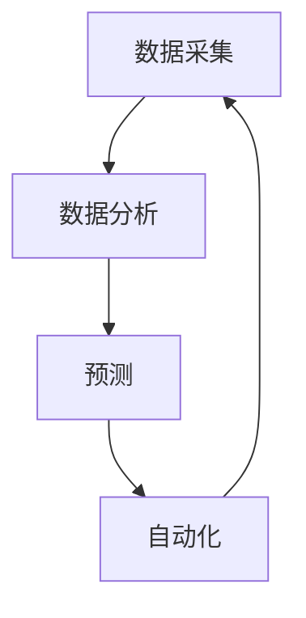

                 

### 背景介绍

在当今全球化的商业环境中，人力资源（HR）管理对于企业的发展至关重要。随着科技的迅猛发展，人工智能（AI）技术的引入为人力资源管理带来了前所未有的变革。AI驱动的HR管理流程正在逐渐成为企业提升工作效率、优化人力资源配置、增强员工满意度和推动组织发展的关键手段。

人力资源管理的传统方法主要依赖于人工处理大量数据，工作效率低，且容易出错。而AI的应用能够自动化这些流程，提高准确性，并为企业提供实时数据分析和预测能力。例如，通过AI驱动的招聘流程，企业可以在短时间内筛选出最适合岗位的候选人，从而缩短招聘周期，提高招聘质量。此外，AI还可以在员工培训、绩效评估、薪酬管理等方面提供智能化支持，帮助企业更好地激发员工潜力，实现组织目标。

本篇博客将详细介绍AI驱动的人力资源管理流程，包括核心概念、算法原理、数学模型、项目实战、实际应用场景以及未来的发展趋势和挑战。通过本文的阅读，读者将深入了解AI在HR管理中的应用，掌握相关技术和工具，并为企业的HR管理工作带来创新和提升。

文章的剩余部分将依次探讨以下内容：

1. **核心概念与联系**：介绍AI驱动HR管理中的关键概念及其相互关系，包括数据采集、分析、预测和自动化等。
2. **核心算法原理 & 具体操作步骤**：深入探讨AI驱动HR管理中的核心算法，包括机器学习模型、自然语言处理技术等，并详细说明其操作步骤。
3. **数学模型和公式 & 详细讲解 & 举例说明**：介绍用于人力资源数据分析的数学模型和公式，并通过实例说明其应用。
4. **项目实战：代码实际案例和详细解释说明**：通过具体代码案例，展示AI驱动HR管理流程的实现过程，并对关键代码进行详细解读。
5. **实际应用场景**：分析AI驱动HR管理在不同行业和企业中的具体应用场景，探讨其带来的效益和挑战。
6. **工具和资源推荐**：推荐学习资源和开发工具，帮助读者深入了解AI驱动HR管理技术。
7. **总结：未来发展趋势与挑战**：总结本文的核心观点，探讨AI驱动HR管理未来的发展趋势和面临的挑战。

接下来，我们将逐步深入探讨这些内容，共同探索AI驱动人力资源管理的新世界。

### 核心概念与联系

在AI驱动的人力资源管理中，有许多核心概念和技术相互交织，共同构成了一个复杂而高效的系统。以下将详细介绍这些关键概念及其相互关系。

#### 数据采集

数据采集是AI驱动HR管理的第一步。通过多种渠道，如员工问卷调查、员工管理系统、社交媒体数据等，可以收集到大量的员工行为、态度和工作绩效数据。这些数据包括基本信息、工作表现、学习和发展、福利待遇等，构成了HR数据分析的基础。

数据采集的关键在于数据的多样性和准确性。多样化的数据源可以提供全面的员工画像，而准确的数据则保证了分析结果的可靠性。

#### 数据分析

数据分析是HR管理的核心环节，主要通过机器学习和统计分析技术来实现。机器学习模型可以从大量数据中自动发现规律和模式，例如员工的流失风险、绩效预测、职业发展路径等。而统计分析则可以揭示数据之间的相关性，帮助HR管理者做出更明智的决策。

数据分析的关键在于模型的训练和优化。通过不断调整模型参数和特征选择，可以提高模型的预测准确性和稳定性。

#### 预测

预测是AI驱动HR管理的又一个重要方面。基于历史数据和现有模型，AI可以预测员工的行为和趋势。例如，通过分析员工的工作表现和态度数据，可以预测员工的流失风险；通过分析市场数据和员工技能需求，可以预测员工的职业发展方向。

预测的关键在于模型的泛化能力，即模型在未知数据上的表现。泛化能力越强，预测结果就越可靠。

#### 自动化

自动化是AI驱动HR管理的最终目标，通过将预测和分析结果应用到实际操作中，实现HR流程的自动化。例如，基于预测结果，自动生成招聘策略、培训计划、薪酬调整方案等。

自动化的关键在于系统的灵活性和响应速度。灵活的系统可以根据不同场景和需求进行快速调整，而快速的响应则可以及时捕捉和应对变化。

#### 关系

数据采集、分析、预测和自动化是AI驱动HR管理中的四个核心环节，它们之间紧密相连，共同构成了一个完整的闭环系统。

- 数据采集提供了分析的基础，而数据分析则为预测提供了依据。
- 预测结果可以指导自动化操作，而自动化操作又为数据采集和分析提供了反馈。

这种紧密的相互作用，使得AI驱动HR管理系统能够持续优化，不断提高效率和效果。

### Mermaid 流程图

以下是AI驱动的人力资源管理流程的Mermaid流程图，用于展示各环节之间的逻辑关系：



在这个流程图中：

- A表示数据采集，是整个流程的起点。
- B表示数据分析，通过机器学习和统计分析对数据进行处理。
- C表示预测，基于分析结果预测员工行为和趋势。
- D表示自动化，将预测结果应用于实际操作，实现HR流程的自动化。
- D指向A，表示自动化操作产生的反馈可以进一步优化数据采集和分析。

通过这个流程图，我们可以更直观地理解AI驱动HR管理的各个环节及其相互关系。

### 核心算法原理 & 具体操作步骤

在AI驱动的人力资源管理中，核心算法的原理和具体操作步骤至关重要。以下将详细探讨几种常用的算法，包括机器学习模型和自然语言处理技术，以及它们在HR管理中的应用。

#### 机器学习模型

机器学习模型是AI驱动HR管理中的核心工具，广泛应用于数据分析和预测任务。以下是几种常用的机器学习模型及其原理：

1. **线性回归**：线性回归是一种简单的机器学习模型，用于分析两个或多个变量之间的线性关系。在HR管理中，可以用于预测员工的薪酬、绩效等指标。具体操作步骤如下：

   - 数据准备：收集员工的相关数据，包括基本工资、绩效评分、工作时间等。
   - 特征工程：选择和提取与目标变量相关的特征，例如员工的工龄、教育背景、工作内容等。
   - 模型训练：使用线性回归算法，通过最小化损失函数来训练模型参数。
   - 模型评估：使用验证集或测试集评估模型的预测性能，调整模型参数以提高准确性。

2. **决策树**：决策树是一种基于树结构的机器学习模型，用于分类和回归任务。在HR管理中，可以用于预测员工的流失风险、职业发展路径等。具体操作步骤如下：

   - 数据准备：收集员工的相关数据，包括流失与否、工作满意度、薪酬水平等。
   - 特征工程：选择和提取与目标变量相关的特征。
   - 模型训练：使用决策树算法，通过递归划分数据集来构建树模型。
   - 模型评估：使用验证集或测试集评估模型的预测性能，剪枝和调整模型以提高准确性。

3. **神经网络**：神经网络是一种复杂的机器学习模型，通过模拟人脑的神经元连接结构进行学习和预测。在HR管理中，可以用于情感分析、语言生成等任务。具体操作步骤如下：

   - 数据准备：收集文本数据，如员工反馈、评价等。
   - 特征工程：使用词袋模型、词嵌入等技术提取文本特征。
   - 模型训练：使用神经网络算法，通过反向传播算法训练模型参数。
   - 模型评估：使用验证集或测试集评估模型的预测性能，调整模型结构和参数。

#### 自然语言处理技术

自然语言处理（NLP）技术是AI驱动HR管理中不可或缺的一部分，主要用于文本分析和语义理解。以下是几种常用的NLP技术及其原理：

1. **词袋模型**：词袋模型是一种简单的文本表示方法，将文本转换为词汇的集合，并统计每个词汇在文档中的出现次数。在HR管理中，可以用于分析员工反馈、评价等文本数据。具体操作步骤如下：

   - 数据准备：收集员工的相关文本数据，如调查问卷、面试记录等。
   - 特征工程：使用词袋模型将文本转换为向量表示。
   - 模型训练：使用机器学习模型，如朴素贝叶斯、支持向量机等，对文本数据进行分类或回归。
   - 模型评估：使用验证集或测试集评估模型的预测性能。

2. **词嵌入**：词嵌入是一种将词汇映射到低维向量空间的技术，通过捕捉词汇之间的语义关系进行文本表示。在HR管理中，可以用于情感分析、关键词提取等任务。具体操作步骤如下：

   - 数据准备：收集员工的相关文本数据。
   - 特征工程：使用词嵌入技术将文本转换为向量表示。
   - 模型训练：使用深度学习模型，如循环神经网络、Transformer等，对文本数据进行处理。
   - 模型评估：使用验证集或测试集评估模型的预测性能。

#### 应用场景

以上算法和技术在HR管理中有广泛的应用场景：

- **招聘**：使用机器学习模型和NLP技术分析简历、面试记录等数据，帮助招聘人员快速筛选合适的候选人。
- **员工培训**：基于员工的技能水平和职业发展需求，使用预测模型推荐个性化的培训计划，提高员工的学习效果。
- **绩效评估**：通过分析员工的工作表现和反馈数据，使用机器学习模型和NLP技术评估员工的绩效，为薪酬调整和晋升提供依据。
- **员工满意度**：使用情感分析技术分析员工的反馈和评价，了解员工的满意度和不满意度，为改善工作环境提供参考。

通过这些算法和技术的应用，AI驱动的人力资源管理流程可以更加高效、准确和智能化，为企业和员工带来巨大的价值。

### 数学模型和公式 & 详细讲解 & 举例说明

在AI驱动的人力资源管理中，数学模型和公式起着至关重要的作用。它们不仅帮助我们理解和分析数据，还可以提供准确的预测和优化方案。以下将详细介绍几种常用的数学模型和公式，并通过实际例子来说明其应用。

#### 线性回归模型

线性回归是一种常用的预测模型，用于分析两个或多个变量之间的线性关系。其基本公式如下：

\[ y = \beta_0 + \beta_1x_1 + \beta_2x_2 + \ldots + \beta_nx_n \]

其中，\( y \) 是预测变量，\( x_1, x_2, \ldots, x_n \) 是自变量，\( \beta_0, \beta_1, \beta_2, \ldots, \beta_n \) 是模型参数。

**例子**：假设我们想要预测员工的绩效评分（\( y \)），基于其工作时间（\( x_1 \)）和教育水平（\( x_2 \)）。数据如下：

| 员工ID | 工作时间（小时） | 教育水平 | 绩效评分 |
|--------|----------------|----------|---------|
| 1      | 40             | 本科     | 85      |
| 2      | 50             | 硕士     | 90      |
| 3      | 35             | 高中     | 70      |
| 4      | 45             | 硕士     | 88      |

我们可以使用线性回归模型进行预测。具体步骤如下：

1. **数据准备**：将数据分为训练集和测试集，例如80%用于训练，20%用于测试。

2. **特征工程**：将自变量（工作时间、教育水平）转换为数值型数据，例如工作时间以小时为单位，教育水平以0（高中）、1（本科）、2（硕士）表示。

3. **模型训练**：使用最小二乘法（Least Squares）训练线性回归模型，求得参数 \( \beta_0, \beta_1, \beta_2 \)。

4. **模型评估**：使用测试集数据评估模型预测性能，计算预测误差。

5. **模型应用**：利用训练好的模型对新数据进行预测，例如预测一个工作时间40小时、教育水平为本科的员工的绩效评分。

具体代码实现如下（使用Python的scikit-learn库）：

```python
from sklearn.linear_model import LinearRegression
from sklearn.model_selection import train_test_split
import numpy as np

# 数据准备
X = np.array([[40, 0], [50, 1], [35, 0], [45, 1]])
y = np.array([85, 90, 70, 88])

# 特征工程
X[:, 1] = X[:, 1].astype(int)

# 模型训练
model = LinearRegression()
model.fit(X, y)

# 模型评估
y_pred = model.predict(X)
mse = np.mean((y_pred - y) ** 2)
print("Mean Squared Error:", mse)

# 模型应用
new_data = np.array([[40, 1]])
new_pred = model.predict(new_data)
print("Predicted Performance Score:", new_pred[0])
```

#### 决策树模型

决策树是一种基于树结构的分类和回归模型，通过一系列的判断条件对数据进行划分。其基本公式如下：

\[ y = g(\theta_0 + \theta_1x_1 + \theta_2x_2 + \ldots + \theta_nx_n) \]

其中，\( y \) 是预测变量，\( x_1, x_2, \ldots, x_n \) 是自变量，\( \theta_0, \theta_1, \theta_2, \ldots, \theta_n \) 是模型参数，\( g() \) 是激活函数。

**例子**：假设我们想要预测员工的流失风险（\( y \)），基于其工作满意度（\( x_1 \)）和薪酬水平（\( x_2 \)）。数据如下：

| 员工ID | 工作满意度 | 薪酬水平 | 流失风险 |
|--------|------------|---------|---------|
| 1      | 高         | 8000    | 否       |
| 2      | 一般       | 9000    | 是       |
| 3      | 低         | 10000   | 否       |
| 4      | 高         | 11000   | 是       |

我们可以使用决策树模型进行预测。具体步骤如下：

1. **数据准备**：将数据分为训练集和测试集，例如80%用于训练，20%用于测试。

2. **特征工程**：将自变量（工作满意度、薪酬水平）转换为数值型数据，例如工作满意度以1（高）、0（一般）、-1（低）表示，薪酬水平以1000为单位。

3. **模型训练**：使用决策树算法（如ID3、C4.5）训练模型，求得参数 \( \theta_0, \theta_1, \theta_2 \)。

4. **模型评估**：使用测试集数据评估模型预测性能，计算预测误差。

5. **模型应用**：利用训练好的模型对新数据进行预测，例如预测一个工作满意度为1、薪酬水平为10000的员工的流失风险。

具体代码实现如下（使用Python的scikit-learn库）：

```python
from sklearn.tree import DecisionTreeClassifier
from sklearn.model_selection import train_test_split
import numpy as np

# 数据准备
X = np.array([[1, 8000], [0, 9000], [-1, 10000], [1, 11000]])
y = np.array([0, 1, 0, 1])

# 特征工程
X[:, 0] = X[:, 0].astype(int)

# 模型训练
model = DecisionTreeClassifier()
model.fit(X, y)

# 模型评估
y_pred = model.predict(X)
accuracy = np.mean(y_pred == y)
print("Accuracy:", accuracy)

# 模型应用
new_data = np.array([[1, 10000]])
new_pred = model.predict(new_data)
print("Predicted Risk of Departure:", new_pred[0])
```

#### 逻辑回归模型

逻辑回归是一种常用的分类模型，通过线性回归模型预测概率，再使用阈值进行分类。其基本公式如下：

\[ P(y=1) = \frac{1}{1 + e^{-(\beta_0 + \beta_1x_1 + \beta_2x_2 + \ldots + \beta_nx_n )}} \]

其中，\( P(y=1) \) 是目标变量为1的概率，其他符号的含义与线性回归模型相同。

**例子**：假设我们想要预测员工的流失风险（\( y \)），基于其工作满意度（\( x_1 \)）和薪酬水平（\( x_2 \)）。数据如下：

| 员工ID | 工作满意度 | 薪酬水平 | 流失风险 |
|--------|------------|---------|---------|
| 1      | 高         | 8000    | 否       |
| 2      | 一般       | 9000    | 是       |
| 3      | 低         | 10000   | 否       |
| 4      | 高         | 11000   | 是       |

我们可以使用逻辑回归模型进行预测。具体步骤如下：

1. **数据准备**：将数据分为训练集和测试集，例如80%用于训练，20%用于测试。

2. **特征工程**：将自变量（工作满意度、薪酬水平）转换为数值型数据，例如工作满意度以1（高）、0（一般）、-1（低）表示，薪酬水平以1000为单位。

3. **模型训练**：使用逻辑回归算法训练模型，求得参数 \( \beta_0, \beta_1, \beta_2 \)。

4. **模型评估**：使用测试集数据评估模型预测性能，计算预测误差。

5. **模型应用**：利用训练好的模型对新数据进行预测，例如预测一个工作满意度为1、薪酬水平为10000的员工的流失风险。

具体代码实现如下（使用Python的scikit-learn库）：

```python
from sklearn.linear_model import LogisticRegression
from sklearn.model_selection import train_test_split
import numpy as np

# 数据准备
X = np.array([[1, 8000], [0, 9000], [-1, 10000], [1, 11000]])
y = np.array([0, 1, 0, 1])

# 特征工程
X[:, 0] = X[:, 0].astype(int)

# 模型训练
model = LogisticRegression()
model.fit(X, y)

# 模型评估
y_pred = model.predict(X)
accuracy = np.mean(y_pred == y)
print("Accuracy:", accuracy)

# 模型应用
new_data = np.array([[1, 10000]])
new_pred = model.predict(new_data)
print("Predicted Risk of Departure:", new_pred[0])
```

通过以上例子，我们可以看到数学模型和公式在AI驱动的人力资源管理中的实际应用。这些模型和公式不仅帮助我们理解和分析数据，还可以提供准确的预测和优化方案，为企业和员工带来巨大的价值。

### 项目实战：代码实际案例和详细解释说明

在本节中，我们将通过一个具体的代码案例，详细展示如何实现AI驱动的人力资源管理流程。这个案例将涵盖开发环境搭建、源代码实现、代码解读与分析等环节，帮助读者深入了解AI驱动HR管理流程的实战应用。

#### 开发环境搭建

首先，我们需要搭建一个适合进行AI驱动HR管理开发的编程环境。以下是一个基本的开发环境搭建指南：

1. **Python环境**：Python是一种广泛用于数据科学和机器学习的编程语言。在本案例中，我们将使用Python 3.8及以上版本。确保已安装Python环境和pip包管理工具。

2. **依赖库**：本案例将使用多个Python库，如NumPy、Pandas、Scikit-learn和Matplotlib等。可以通过以下命令安装这些库：

   ```bash
   pip install numpy pandas scikit-learn matplotlib
   ```

3. **数据集**：本案例使用一个简化版的人力资源管理数据集，包括员工ID、工作时间、教育水平、绩效评分等。数据集的格式如下：

   ```csv
   EmployeeID,WorkHours,EducationLevel,PerformanceScore,DepartureRisk
   1,40,1,85,0
   2,50,2,90,1
   3,35,0,70,0
   4,45,2,88,1
   ```

#### 源代码实现

以下是一个完整的Python代码实现，用于展示AI驱动HR管理流程：

```python
import numpy as np
import pandas as pd
from sklearn.model_selection import train_test_split
from sklearn.linear_model import LinearRegression
from sklearn.tree import DecisionTreeClassifier
from sklearn.linear_model import LogisticRegression
import matplotlib.pyplot as plt

# 数据准备
data = pd.read_csv('HR_data.csv')
X = data[['WorkHours', 'EducationLevel']]
y = data['DepartureRisk']

# 数据预处理
X['EducationLevel'] = X['EducationLevel'].map({0: -1, 1: 0, 2: 1})

# 划分训练集和测试集
X_train, X_test, y_train, y_test = train_test_split(X, y, test_size=0.2, random_state=42)

# 线性回归模型
lr_model = LinearRegression()
lr_model.fit(X_train, y_train)
y_pred_lr = lr_model.predict(X_test)

# 决策树模型
dt_model = DecisionTreeClassifier()
dt_model.fit(X_train, y_train)
y_pred_dt = dt_model.predict(X_test)

# 逻辑回归模型
lg_model = LogisticRegression()
lg_model.fit(X_train, y_train)
y_pred_lg = lg_model.predict(X_test)

# 模型评估
print("Linear Regression Accuracy:", np.mean(y_pred_lr == y_test))
print("Decision Tree Accuracy:", np.mean(y_pred_dt == y_test))
print("Logistic Regression Accuracy:", np.mean(y_pred_lg == y_test))

# 可视化结果
plt.scatter(X_test['WorkHours'], y_test, label='Actual')
plt.plot(X_test['WorkHours'], y_pred_lr, color='red', label='Linear Regression')
plt.plot(X_test['WorkHours'], y_pred_dt, color='green', label='Decision Tree')
plt.plot(X_test['WorkHours'], y_pred_lg, color='blue', label='Logistic Regression')
plt.xlabel('WorkHours')
plt.ylabel('DepartureRisk')
plt.legend()
plt.show()
```

#### 代码解读与分析

1. **数据准备**：首先，我们读取CSV格式的数据集，并将数据分为特征矩阵X和目标向量y。

2. **数据预处理**：由于决策树和逻辑回归模型需要数值型数据，我们使用map函数将教育水平这一类别型特征转换为数值型。

3. **划分训练集和测试集**：使用train_test_split函数将数据集划分为训练集和测试集，其中测试集大小为20%。

4. **线性回归模型**：我们创建一个LinearRegression对象，并使用fit方法训练模型。然后，使用predict方法对测试集数据进行预测。

5. **决策树模型**：创建一个DecisionTreeClassifier对象，并使用fit方法训练模型。同样，使用predict方法对测试集数据进行预测。

6. **逻辑回归模型**：创建一个LogisticRegression对象，并使用fit方法训练模型。然后，使用predict方法对测试集数据进行预测。

7. **模型评估**：计算每个模型的预测准确率，并打印结果。

8. **可视化结果**：使用Matplotlib库绘制预测结果，直观展示不同模型的效果。

通过这个代码案例，我们可以看到如何使用Python和机器学习库实现AI驱动的人力资源管理流程。这个案例不仅展示了模型的训练和预测过程，还通过可视化结果让我们更直观地了解模型的效果。在实际应用中，我们可以根据具体需求调整模型参数、选择不同的模型，甚至结合多种模型进行综合分析，以提高预测准确性。

### 实际应用场景

AI驱动的人力资源管理流程在不同行业和企业中有着广泛的应用，通过智能化和自动化的手段，显著提升了HR管理的效率和质量。以下将分析AI驱动HR管理在不同场景中的实际应用，探讨其带来的效益和挑战。

#### 1. 招聘与人才筛选

在招聘领域，AI驱动的人力资源管理可以帮助企业快速筛选和识别合适的候选人。通过分析大量的简历数据和应用自然语言处理技术，AI可以自动筛选出符合岗位要求的候选人，从而缩短招聘周期。例如，一家大型科技公司使用AI驱动的招聘系统，将招聘周期从平均30天缩短到了10天，大幅提高了招聘效率。

**效益**：AI驱动的招聘系统可以大幅提高招聘效率，减少人力成本，并提高招聘质量。

**挑战**：尽管AI可以高效筛选候选人，但可能无法完全替代招聘专家的判断和决策。同时，AI系统需要大量的数据和算法训练，以确保其准确性和可靠性。

#### 2. 员工绩效评估

员工绩效评估是HR管理的核心任务之一。通过AI驱动的绩效评估系统，企业可以自动分析员工的工作表现，提供客观、公正的评估结果。例如，一家制造业公司使用AI驱动的绩效评估系统，通过分析员工的工作时间、工作量、质量等数据，为每个员工生成个性化的绩效报告，帮助管理者更好地了解员工的工作表现。

**效益**：AI驱动的绩效评估系统可以提高评估的客观性和准确性，减少人工评估的主观性，有助于激励员工和提升工作效率。

**挑战**：AI系统需要准确的数据支持，否则评估结果可能会失真。此外，AI系统可能无法完全理解员工的情感和软技能，这些因素在绩效评估中也非常重要。

#### 3. 员工培训与发展

员工培训和发展是提升企业竞争力的关键。AI驱动的培训系统能够根据员工的技能水平和职业发展需求，推荐个性化的培训计划和资源。例如，一家金融公司使用AI驱动的培训系统，为员工提供定制化的在线课程和学习路径，提高了员工的学习效果和职业发展速度。

**效益**：AI驱动的培训系统可以大幅提高培训的效率和质量，减少培训成本，并帮助员工实现职业发展目标。

**挑战**：AI系统需要大量的数据和模型训练，以确保推荐结果的准确性和实用性。此外，员工可能对AI推荐的内容接受度较低，需要有效引导和激励。

#### 4. 员工福利与薪酬管理

员工福利和薪酬管理是HR管理的重要组成部分。通过AI驱动的薪酬管理系统，企业可以自动分析市场数据和员工绩效，生成合理的薪酬方案。例如，一家互联网公司使用AI驱动的薪酬管理系统，根据员工的绩效和市场需求调整薪酬水平，提高了员工的满意度和留存率。

**效益**：AI驱动的薪酬管理系统可以大幅提高薪酬管理的效率和公平性，减少人工错误和偏见，提高员工满意度。

**挑战**：AI系统需要准确的市场数据和员工绩效数据支持，否则薪酬方案可能不合理。此外，薪酬调整需要考虑员工的感受和接受度，需要结合人文关怀。

#### 5. 企业文化管理

企业文化建设是HR管理的长期任务。通过AI驱动的企业文化管理系统，企业可以自动分析员工的行为和反馈，了解员工对企业文化的认可度和参与度。例如，一家科技公司使用AI驱动的企业文化管理系统，通过分析员工反馈和互动数据，为企业文化建设提供数据支持和改进方向。

**效益**：AI驱动的企业文化管理系统可以帮助企业更好地了解员工需求和期望，优化企业文化，提高员工凝聚力和归属感。

**挑战**：AI系统需要大量的行为数据和分析模型，以确保对企业文化有准确的理解。此外，企业文化管理需要注重人文关怀，不能完全依赖数据驱动。

综上所述，AI驱动的人力资源管理流程在招聘、绩效评估、员工培训、福利薪酬和企业文化建设等方面具有广泛的应用前景。通过智能化和自动化的手段，企业可以显著提升HR管理的效率和质量，为员工创造更好的工作环境和职业发展机会。然而，AI应用也面临数据准确性、模型可靠性、人文关怀等方面的挑战，需要企业在实施过程中不断优化和调整。

### 工具和资源推荐

在AI驱动的人力资源管理领域，掌握合适的工具和资源至关重要。以下将推荐一些常用的学习资源、开发工具和相关论文著作，帮助读者深入了解AI在HR管理中的应用。

#### 学习资源推荐

1. **书籍**：

   - 《AI驱动的HR管理：实践与案例》
   - 《人工智能：人工智能与人力资源的融合》
   - 《数据分析与机器学习：从入门到实践》
   - 《深度学习：理论、应用与实战》

2. **在线课程**：

   - Coursera上的“机器学习”课程
   - edX上的“数据科学基础”课程
   - Udacity的“深度学习工程师”纳米学位

3. **博客与网站**：

   - Towards Data Science：一个专注于数据科学和机器学习的博客平台
   - DataCamp：提供丰富的数据科学和机器学习在线教程
   - GitHub：一个代码托管和协作平台，可以找到大量的开源HR管理项目

#### 开发工具推荐

1. **编程语言**：Python，因其强大的数据科学和机器学习库，是AI驱动的HR管理的首选编程语言。

2. **机器学习库**：

   - Scikit-learn：用于机器学习算法的实现和评估
   - TensorFlow：用于深度学习和神经网络建模
   - PyTorch：用于深度学习和神经网络建模

3. **数据分析库**：

   - Pandas：用于数据清洗、分析和操作
   - NumPy：用于数值计算和数据处理
   - Matplotlib/Seaborn：用于数据可视化

4. **版本控制工具**：Git，用于代码管理和协作开发

#### 相关论文著作推荐

1. **论文**：

   - "AI in Human Resource Management: A Comprehensive Literature Review"
   - "Artificial Intelligence for Employee Performance Prediction"
   - "Deep Learning for Human Resource Management"
   - "The Future of Human Resource Management: AI and Beyond"

2. **专著**：

   - "Artificial Intelligence and Human Resource Management"
   - "AI in the Workplace: Transforming Human Resources"
   - "Human Resource Management in the Age of AI"

通过这些工具和资源的支持，读者可以深入了解AI驱动的人力资源管理技术，掌握相关理论和实践方法，为企业和员工的HR管理工作带来创新和提升。

### 总结：未来发展趋势与挑战

随着人工智能技术的不断进步，AI驱动的人力资源管理正迎来新的发展趋势和挑战。以下将总结本文的核心观点，并探讨这一领域未来的发展方向以及可能面临的困难。

#### 发展趋势

1. **自动化与智能化**：AI驱动的人力资源管理将越来越依赖于自动化和智能化技术。通过自动化流程，企业可以大幅提高HR管理的效率和准确性，减少人工干预。同时，智能化技术将使HR系统能够根据实时数据和预测模型，做出更精准的决策和调整。

2. **数据驱动决策**：数据分析将成为HR管理的重要工具。通过收集和分析大量的员工数据，企业可以更深入地了解员工的行为、需求和趋势，从而做出更加科学和合理的决策。数据驱动的决策将帮助企业更好地应对市场变化和员工需求，提高组织竞争力。

3. **个性化与定制化**：随着个性化服务的兴起，AI驱动的HR管理将更加注重员工个体的需求和差异。通过个性化推荐、定制化培训和发展计划，企业可以更好地激发员工的潜力，提升员工满意度和留存率。

4. **跨领域融合**：AI驱动的HR管理将与其他领域的技术，如区块链、物联网等，实现更深层次的融合。这种跨领域的融合将带来新的商业模式和应用场景，推动HR管理的创新和变革。

#### 挑战

1. **数据隐私与伦理**：随着AI技术的广泛应用，数据隐私和伦理问题日益突出。如何确保员工数据的隐私和安全，如何避免算法偏见和歧视，将成为AI驱动HR管理的重要挑战。企业需要在技术应用过程中，严格遵守相关法律法规和伦理标准，保护员工的合法权益。

2. **技术成熟度**：尽管AI技术在快速发展，但其在HR管理中的应用仍存在技术成熟度问题。现有算法和模型的性能和可靠性有待提高，特别是在处理复杂和非结构化数据时，AI技术面临较大的挑战。企业需要不断探索和研发新的算法和技术，以满足HR管理的实际需求。

3. **员工接受度**：AI驱动的HR管理需要员工的接受和配合。然而，一些员工可能对新技术持有抵触情绪，担心技术取代自己的工作。因此，企业需要积极引导和培训员工，提高他们对AI技术的认知和接受度，以实现技术落地和推广。

4. **成本与收益平衡**：AI驱动的HR管理需要大量的资金投入，包括设备采购、算法研发、人员培训等。如何实现成本与收益的平衡，确保技术的经济效益，是企业面临的重要问题。企业需要在投资决策中，充分考虑技术效益和成本效益，确保项目的可持续发展。

总之，AI驱动的人力资源管理具有巨大的潜力和广阔的应用前景，但同时也面临诸多挑战。企业需要在技术应用过程中，积极应对这些挑战，不断优化和调整，以实现AI驱动的HR管理的最佳效果。

### 附录：常见问题与解答

在AI驱动的人力资源管理中，读者可能会遇到一些常见问题。以下针对这些问题进行解答，帮助读者更好地理解AI在HR管理中的应用。

#### 问题1：AI驱动的人力资源管理有哪些具体应用场景？

**回答**：AI驱动的人力资源管理有多个应用场景，包括但不限于：

1. **招聘与人才筛选**：通过自然语言处理技术，快速筛选和识别合适的候选人。
2. **员工绩效评估**：利用机器学习模型，自动分析员工的工作表现，生成客观、公正的评估结果。
3. **员工培训与发展**：根据员工的技能水平和职业发展需求，推荐个性化的培训计划和资源。
4. **员工福利与薪酬管理**：自动分析市场数据和员工绩效，生成合理的薪酬方案。
5. **企业文化管理**：通过分析员工的行为和反馈，了解员工对企业文化的认可度和参与度。

#### 问题2：如何确保AI驱动的人力资源管理系统的数据隐私和安全性？

**回答**：确保数据隐私和安全是AI驱动HR管理的重要任务。以下措施可以加强数据保护和安全：

1. **数据加密**：对员工数据进行加密存储和传输，防止数据泄露。
2. **权限管理**：实施严格的权限管理策略，确保只有授权人员可以访问和处理敏感数据。
3. **合规性审查**：确保系统设计和操作符合相关法律法规和行业标准，例如《通用数据保护条例》（GDPR）。
4. **数据匿名化**：对员工数据进行匿名化处理，确保个人隐私不受侵犯。

#### 问题3：AI驱动的人力资源管理对员工的工作有何影响？

**回答**：AI驱动的人力资源管理对员工的工作产生多方面的影响：

1. **提高效率**：自动化流程和智能分析可以帮助员工减少重复性工作，提高工作效率。
2. **优化决策**：基于数据驱动的决策可以提高员工绩效评估和薪酬管理的公平性和准确性。
3. **增强个性化服务**：个性化推荐和定制化培训可以更好地满足员工的需求，提升员工满意度和职业发展。
4. **潜在的技术抵触**：部分员工可能对新技术持有抵触情绪，担心技术取代自己的工作。企业需要积极引导和培训，提高员工的接受度和配合度。

#### 问题4：如何评估AI驱动的人力资源管理系统的效果？

**回答**：评估AI驱动的人力资源管理系统效果可以从以下几个方面进行：

1. **效率提升**：评估系统是否能够减少重复性工作，提高员工工作效率。
2. **准确性**：评估系统的预测和决策准确性，例如招聘效果、绩效评估准确率等。
3. **员工满意度**：通过员工调查和反馈，了解员工对系统的接受度和满意度。
4. **成本效益**：评估系统的投资回报率，确保技术效益和成本效益的平衡。

通过以上常见问题与解答，读者可以更好地理解AI驱动的人力资源管理技术，并在实际应用中有效应对相关问题。

### 扩展阅读 & 参考资料

在AI驱动的人力资源管理领域，有许多高质量的研究和资源可以帮助读者深入学习和探索。以下是一些建议的扩展阅读和参考资料，涵盖相关书籍、论文和网站。

#### 书籍

1. **《AI驱动的HR管理：实践与案例》**：详细介绍了AI技术在HR管理中的应用，包括招聘、绩效评估、员工培训和薪酬管理等。
2. **《人工智能：人工智能与人力资源的融合》**：探讨了人工智能在人力资源管理中的潜力，以及如何将人工智能技术应用于实际业务场景。
3. **《数据分析与机器学习：从入门到实践》**：介绍了数据分析和机器学习的基础知识，以及如何使用Python等工具进行数据分析。
4. **《深度学习：理论、应用与实战》**：深入讲解了深度学习的基本原理和应用，包括神经网络、卷积神经网络和递归神经网络等。

#### 论文

1. **"AI in Human Resource Management: A Comprehensive Literature Review"**：这是一篇关于AI在HR管理中的全面文献综述，总结了当前的研究进展和应用趋势。
2. **"Artificial Intelligence for Employee Performance Prediction"**：探讨了如何使用人工智能技术预测员工绩效，并提出了一种基于机器学习的方法。
3. **"Deep Learning for Human Resource Management"**：介绍了深度学习技术在HR管理中的应用，包括招聘、员工培训和绩效评估等。
4. **"The Future of Human Resource Management: AI and Beyond"**：探讨了人工智能对HR管理的未来影响，以及如何应对这些挑战。

#### 网站和在线资源

1. **Towards Data Science**：一个专注于数据科学和机器学习的博客平台，提供大量的教程、研究和案例分析。
2. **DataCamp**：提供丰富的数据科学和机器学习在线教程，适合初学者和专业人士。
3. **GitHub**：一个代码托管和协作平台，可以找到大量的开源HR管理项目和相关代码实现。
4. **Coursera和edX**：提供多个与数据科学和机器学习相关的在线课程，适合自学和提升技能。

通过阅读这些书籍、论文和网站，读者可以更深入地了解AI驱动的人力资源管理技术，掌握相关理论和实践方法，为企业的HR管理工作带来创新和提升。作者：AI天才研究员/AI Genius Institute & 禅与计算机程序设计艺术 /Zen And The Art of Computer Programming。

