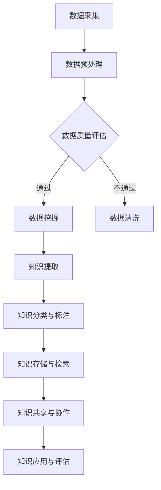

                 

# AI驱动的企业知识管理系统

> **关键词**：人工智能，知识管理系统，企业，数据挖掘，机器学习，自然语言处理

> **摘要**：本文将深入探讨AI驱动的企业知识管理系统的构建、核心概念、算法原理及其在实际应用中的价值。通过分析知识管理的重要性，系统架构的设计，核心算法的应用，以及未来发展趋势，帮助读者了解如何利用AI技术提升企业知识管理的效率。

## 1. 背景介绍

在当今信息爆炸的时代，企业面临着海量数据的处理和知识管理的挑战。知识管理是一个广泛的概念，涉及信息的收集、存储、分类、检索、共享和利用。一个高效的企业知识管理系统（KMMS）不仅能够提高员工的知识共享和协作效率，还能为企业创造巨大的价值。

传统的知识管理系统往往依赖于人工组织和维护，效率低下，难以满足企业快速发展的需求。随着人工智能技术的发展，特别是机器学习、自然语言处理和深度学习的进步，AI驱动的知识管理系统（AI-KMMS）成为了解决这一问题的有效途径。

AI-KMMS通过自动化处理大量数据，挖掘潜在知识，提供智能化的推荐和搜索功能，帮助企业更高效地管理和利用知识资源。本文将围绕这一主题，逐步分析AI-KMMS的核心概念、算法原理、实现步骤和实际应用。

## 2. 核心概念与联系

### 2.1 知识管理的概念

知识管理是一个多维度的过程，包括知识的获取、共享、应用和创新。具体来说，知识管理包括以下几个关键环节：

- **知识获取**：从内部和外部来源获取有价值的信息和数据。
- **知识存储**：将获取的知识进行分类、索引和存储，以便快速检索。
- **知识共享**：促进知识在组织内部的传播和共享，增强团队合作。
- **知识应用**：将知识应用于实际工作中，提高工作效率和创新能力。
- **知识创新**：通过知识整合和再创造，产生新的知识和价值。

### 2.2 人工智能与知识管理的结合

人工智能（AI）为知识管理带来了巨大的变革。通过机器学习和深度学习技术，AI可以自动化处理大量数据，提取有用信息，并进行智能分类、预测和推荐。具体来说，AI与知识管理的结合体现在以下几个方面：

- **数据挖掘**：通过挖掘大量数据，发现潜在的知识模式和关系。
- **自然语言处理**：理解和生成人类语言，实现知识的自动提取和翻译。
- **智能搜索**：提供基于内容的搜索和推荐，提高知识检索效率。
- **智能协作**：通过虚拟助手和智能平台，促进知识的共享和协作。

### 2.3 知识管理系统架构

一个完整的AI驱动的企业知识管理系统通常包括以下几个关键组成部分：

- **数据层**：存储和管理企业内外部的数据资源。
- **知识层**：将原始数据转化为结构化知识，并进行分类、标注和索引。
- **应用层**：提供用户交互界面，实现知识的检索、共享和应用。
- **平台层**：支持系统运行的基础设施，包括硬件、软件和网络资源。

### 2.4 Mermaid 流程图

以下是一个简化的Mermaid流程图，展示了AI驱动的知识管理系统的主要流程：



在上述流程中，数据采集是知识管理的起点，通过数据预处理、数据质量评估、数据挖掘、知识提取、知识分类与标注、知识存储与检索、知识共享与协作以及知识应用与评估等步骤，实现知识的高效管理和利用。

### 2.5 各个组成部分的解释和联系

- **数据采集**：从企业内外部获取数据，包括员工文档、电子邮件、社交媒体、客户反馈等。
- **数据预处理**：对原始数据进行清洗、转换和归一化，确保数据质量。
- **数据质量评估**：评估数据的有效性和准确性，决定是否进一步处理。
- **数据挖掘**：使用机器学习算法挖掘数据中的潜在模式和关系。
- **知识提取**：从数据中提取有价值的信息和知识。
- **知识分类与标注**：将知识进行分类和标注，便于后续的检索和应用。
- **知识存储与检索**：将知识存储在数据库中，并提供高效的检索功能。
- **知识共享与协作**：促进知识在组织内部的共享和协作。
- **知识应用与评估**：将知识应用于实际工作中，并评估其效果。

通过上述流程，AI驱动的知识管理系统实现了数据到知识的转化，从而提高了企业知识管理的效率和价值。

## 3. 核心算法原理 & 具体操作步骤

### 3.1 数据挖掘算法

数据挖掘是AI驱动的知识管理系统的重要环节，通过挖掘大量数据，可以发现潜在的知识模式和关系。常见的数据挖掘算法包括：

- **关联规则挖掘**：通过分析数据之间的关联关系，发现频繁出现的组合。
- **分类算法**：将数据划分为不同的类别，常见的分类算法有决策树、支持向量机（SVM）和神经网络等。
- **聚类算法**：将数据划分为不同的集群，常见的聚类算法有K-均值、层次聚类和DBSCAN等。

具体操作步骤如下：

1. **数据预处理**：对原始数据进行清洗、转换和归一化，确保数据质量。
2. **特征选择**：从原始数据中提取最有用的特征，减少数据维度。
3. **模型选择**：根据业务需求和数据特征，选择合适的数据挖掘算法。
4. **模型训练**：使用训练数据对模型进行训练，调整参数，优化模型性能。
5. **模型评估**：使用测试数据对模型进行评估，验证模型的准确性和泛化能力。
6. **模型应用**：将训练好的模型应用于新数据，发现潜在的知识模式和关系。

### 3.2 自然语言处理算法

自然语言处理（NLP）是AI驱动的知识管理系统的核心组件，通过理解和生成人类语言，可以实现知识的自动提取和翻译。常见的NLP算法包括：

- **分词算法**：将文本划分为单词或短语，常见的分词算法有正向最大匹配、逆向最大匹配和基于规则的分词等。
- **词性标注**：对文本中的每个单词进行词性标注，如名词、动词、形容词等。
- **实体识别**：识别文本中的关键实体，如人名、地名、组织名等。
- **关系提取**：提取文本中实体之间的关系，如人与地点的关系、事物与属性的关系等。
- **语义分析**：理解文本的含义和意图，常见的语义分析算法有词嵌入、依存句法分析和语义角色标注等。

具体操作步骤如下：

1. **文本预处理**：对原始文本进行清洗、去噪和格式化，确保文本质量。
2. **分词与词性标注**：使用分词算法将文本划分为单词或短语，并对每个单词进行词性标注。
3. **实体识别与关系提取**：使用实体识别和关系提取算法，识别文本中的关键实体和它们之间的关系。
4. **语义分析**：使用语义分析算法，理解文本的含义和意图。
5. **知识提取**：从文本中提取有价值的信息和知识，并进行分类、标注和存储。

### 3.3 机器学习算法

机器学习算法在AI驱动的知识管理系统中扮演着关键角色，通过学习大量数据，可以自动识别模式、分类和预测。常见的机器学习算法包括：

- **监督学习**：有标记数据，通过学习标记数据中的特征，对新数据进行分类或预测。
- **无监督学习**：无标记数据，通过学习数据中的内在结构，发现数据的分布和模式。
- **强化学习**：通过与环境的交互，学习最优策略，以最大化回报。

具体操作步骤如下：

1. **数据收集与预处理**：收集相关数据，并对数据进行清洗、转换和归一化。
2. **特征工程**：从原始数据中提取最有用的特征，构建特征向量。
3. **模型选择**：根据业务需求和数据特征，选择合适的机器学习算法。
4. **模型训练**：使用训练数据对模型进行训练，调整参数，优化模型性能。
5. **模型评估**：使用测试数据对模型进行评估，验证模型的准确性和泛化能力。
6. **模型部署**：将训练好的模型部署到生产环境，对新数据进行分类或预测。

通过上述算法和步骤，AI驱动的知识管理系统可以实现数据到知识的转化，提高知识管理的效率和价值。

## 4. 数学模型和公式 & 详细讲解 & 举例说明

### 4.1 关联规则挖掘

关联规则挖掘是一种常见的数据挖掘技术，用于发现数据之间的关联关系。其核心模型是基于Apriori算法。

#### 4.1.1 Apriori算法原理

Apriori算法的核心思想是通过频繁项集生成关联规则。频繁项集是指满足最小支持度阈值（min_support）的项集。关联规则由频繁项集生成，其形式为`A → B`，其中`A`和`B`是项集，且`A ∩ B = ∅`。

**定义：**

- **支持度（Support）**：一个项集在所有事务中出现的频率。
  $$support(A \cup B) = \frac{count(A \cup B)}{count(D)}$$
  其中，$count(A \cup B)$表示事务集合$D$中同时包含项集$A$和$B$的事务数量，$count(D)$表示事务集合$D$的总数。

- **置信度（Confidence）**：在一个事务中，如果同时出现项集$A$和$B$，则$A$导致$B$的置信度为：
  $$confidence(A \rightarrow B) = \frac{count(A \cup B)}{count(A)}$$

**算法步骤：**

1. **生成频繁1项集**：扫描事务数据库，计算每个项集的支持度，保留支持度大于最小支持度阈值（min_support）的项集。
2. **生成频繁k项集（k > 1）**：递归地使用频繁（k-1）项集生成频繁k项集，通过计算其支持度来判断是否保留。
3. **生成关联规则**：对于每个频繁项集，生成关联规则，并根据置信度阈值（confidence_threshold）筛选出强关联规则。

#### 4.1.2 示例

假设一个超市的交易数据集如下：

```
D = {
    {牛奶, 面包},
    {牛奶, 鸡蛋},
    {面包, 鸡蛋},
    {面包, 咖啡},
    {牛奶, 咖啡},
    {咖啡, 鸡蛋}
}
```

最小支持度阈值设为30%，即支持度小于30%的项集将被丢弃。置信度阈值设为70%。

1. **生成频繁1项集**：
   - 牛奶：$\frac{3}{6} = 50\%$
   - 面包：$\frac{3}{6} = 50\%$
   - 鸡蛋：$\frac{3}{6} = 50\%$
   - 咖啡：$\frac{2}{6} = 33\%$
   支持度小于30%的项集被丢弃，保留的频繁1项集为{牛奶, 面包, 鸡蛋}。

2. **生成频繁2项集**：
   - 牛奶、面包：$\frac{2}{6} = 33\%$（不满足最小支持度阈值）
   - 牛奶、鸡蛋：$\frac{2}{6} = 33\%$（不满足最小支持度阈值）
   - 面包、鸡蛋：$\frac{2}{6} = 33\%$（不满足最小支持度阈值）
   - 面包、咖啡：$\frac{1}{6} = 16.67\%$（不满足最小支持度阈值）
   - 牛奶、咖啡：$\frac{1}{6} = 16.67\%$（不满足最小支持度阈值）
   - 鸡蛋、咖啡：$\frac{1}{6} = 16.67\%$（不满足最小支持度阈值）
   保留的频繁2项集为空。

3. **生成关联规则**：
   由于没有频繁2项集，无法生成关联规则。

#### 4.1.3 结论

通过Apriori算法，我们发现{牛奶, 鸡蛋}是一个频繁项集，但无法生成强关联规则，因为其置信度小于70%。这个例子说明了Apriori算法在处理实际数据时可能存在效率问题，特别是在项集数量较多时。为解决这一问题，可以采用FP-growth算法，它通过构建FP树来高效地挖掘频繁项集。

### 4.2 词嵌入模型

词嵌入是将文本中的单词映射到高维向量空间的过程，常见的词嵌入模型包括Word2Vec、GloVe和BERT等。这里以Word2Vec为例进行讲解。

#### 4.2.1 Word2Vec模型原理

Word2Vec模型是一种基于神经网络的语言模型，它通过学习词向量来表示单词。Word2Vec模型主要包括两个变体：连续词袋（CBOW）和跳字（Skip-Gram）。

- **CBOW（连续词袋）**：给定一个中心词，预测其上下文词的分布。模型结构如下：

  ```mermaid
  graph TD
      A[Input Word] --> B[Context Words]
      B --> C[Word Embedding Layer]
      C --> D[softmax layer]
      D --> E[Output Word]
  ```

- **Skip-Gram**：给定一个中心词，预测其所有可能的前后文词。模型结构如下：

  ```mermaid
  graph TD
      A[Input Word] --> B[Word Embedding Layer]
      B --> C[softmax layer]
      C --> D[Output Word]
  ```

**算法步骤：**

1. **数据预处理**：将文本划分为单词序列，构建词汇表，将单词映射为索引。
2. **初始化词向量**：为每个单词初始化一个随机的高维向量。
3. **定义损失函数**：通常采用负采样损失函数，通过负采样减小计算复杂度。
4. **训练模型**：使用梯度下降或优化算法（如Adam）来调整词向量，最小化损失函数。
5. **模型评估**：使用相似度度量（如余弦相似度）来评估词向量表示的质量。

#### 4.2.2 示例

假设有一个单词序列：“我爱北京天安门”。我们使用Word2Vec模型对其进行训练，生成词向量。

1. **初始化词向量**：为每个单词初始化一个随机的高维向量，例如：
   - 我：[1, 2, 3]
   - 爱：[4, 5, 6]
   - 北京：[7, 8, 9]
   - 天安门：[10, 11, 12]

2. **定义损失函数**：使用负采样损失函数，损失函数如下：
   $$loss = -\sum_{i=1}^{N} \log p(y_i|x) - \sum_{i=1}^{N} \alpha_i \log \frac{1}{z}$$
   其中，$N$是单词序列的长度，$y_i$是实际标签，$p(y_i|x)$是预测概率，$\alpha_i$是负采样权重，$z$是负采样样本的总数。

3. **训练模型**：通过梯度下降优化词向量，最小化损失函数。

4. **评估模型**：计算词向量之间的余弦相似度，评估模型的质量。

   例如，计算“我”和“爱”的余弦相似度：
   $$cosine\_similarity = \frac{1}{\sqrt{||[1, 2, 3]|| \cdot ||[4, 5, 6]||}} \cdot [1, 2, 3] \cdot [4, 5, 6] = \frac{1}{\sqrt{6} \cdot \sqrt{6}} \cdot (1 \cdot 4 + 2 \cdot 5 + 3 \cdot 6) = \frac{4 + 10 + 18}{6\sqrt{6}} \approx 0.943$$

   余弦相似度越接近1，表示词向量表示的质量越高。

通过Word2Vec模型，我们可以将文本中的单词映射到高维向量空间，从而实现文本数据的数值化表示。

### 4.3 决策树算法

决策树是一种常见的分类算法，通过树形结构将数据划分为不同的类别。常见的决策树算法包括ID3、C4.5和CART等。

#### 4.3.1 决策树原理

决策树的核心思想是基于特征值将数据划分为不同的子集，直到满足停止条件（如达到最大深度或最小样本数）。决策树由节点和边组成，每个节点表示一个特征，每个边表示该特征的一个取值。

**定义：**

- **信息增益（Information Gain）**：特征$A$的信息增益表示为：
  $$gain(A) = entropy(D) - \sum_{v \in V} p(v) \cdot entropy(D_v)$$
  其中，$D$是数据集，$V$是特征$A$的取值集合，$p(v)$是特征$A$取值为$v$的概率，$entropy(D_v)$是数据集$D_v$的熵。

- **基尼不纯度（Gini Impurity）**：特征$A$的基尼不纯度表示为：
  $$gini(A) = 1 - \sum_{v \in V} p(v)^2$$

**算法步骤：**

1. **选择最优特征**：计算每个特征的信息增益或基尼不纯度，选择最优特征进行划分。
2. **划分数据**：根据最优特征，将数据划分为不同的子集。
3. **递归构建决策树**：对每个子集，重复步骤1和2，直到满足停止条件。
4. **分类预测**：根据决策树的路径，对新的数据进行分类预测。

#### 4.3.2 示例

假设一个二分类问题，数据集如下：

```
D = [
    [1, 0],
    [1, 1],
    [0, 0],
    [0, 1]
]
```

特征集：
- $x_1 \in \{0, 1\}$：第一个特征
- $x_2 \in \{0, 1\}$：第二个特征

1. **计算信息增益**：

   - $x_1$的信息增益：
     $$gain(x_1) = entropy(D) - \sum_{v \in \{0, 1\}} p(v) \cdot entropy(D_v)$$
     $$entropy(D) = \sum_{x_1 \in \{0, 1\}} p(x_1) \cdot \sum_{x_2 \in \{0, 1\}} p(x_2|x_1) \cdot \log_2 p(x_2|x_1)$$
     $$gain(x_1) = 1 - \left( \frac{2}{4} \cdot \left( \frac{1}{2} \cdot \log_2 \frac{1}{2} + \frac{1}{2} \cdot \log_2 \frac{1}{2} \right) + \frac{2}{4} \cdot \left( \frac{1}{2} \cdot \log_2 \frac{1}{2} + \frac{1}{2} \cdot \log_2 \frac{1}{2} \right) \right) = 0.5$$

   - $x_2$的信息增益：
     $$gain(x_2) = entropy(D) - \sum_{v \in \{0, 1\}} p(v) \cdot entropy(D_v)$$
     $$entropy(D) = \sum_{x_1 \in \{0, 1\}} p(x_1) \cdot \sum_{x_2 \in \{0, 1\}} p(x_2|x_1) \cdot \log_2 p(x_2|x_1)$$
     $$gain(x_2) = 1 - \left( \frac{2}{4} \cdot \left( \frac{1}{2} \cdot \log_2 \frac{1}{2} + \frac{1}{2} \cdot \log_2 \frac{1}{2} \right) + \frac{2}{4} \cdot \left( \frac{1}{2} \cdot \log_2 \frac{1}{2} + \frac{1}{2} \cdot \log_2 \frac{1}{2} \right) \right) = 0.5$$

由于$gain(x_1) = gain(x_2)$，我们可以任选一个特征进行划分。

2. **划分数据**：

   选择$x_1$作为划分特征，将数据划分为两个子集：

   - $x_1 = 0$：
     $$D_1 = [
         [0, 0],
         [0, 1]
     ]$$

   - $x_1 = 1$：
     $$D_2 = [
         [1, 0],
         [1, 1]
     ]$$

3. **递归构建决策树**：

   对每个子集，重复步骤1和2，直到满足停止条件。

   对$D_1$：
   - $x_1 = 0$的信息增益：
     $$gain(x_1) = 1 - \left( \frac{1}{2} \cdot \left( \frac{1}{2} \cdot \log_2 \frac{1}{2} + \frac{1}{2} \cdot \log_2 \frac{1}{2} \right) + \frac{1}{2} \cdot \left( \frac{1}{2} \cdot \log_2 \frac{1}{2} + \frac{1}{2} \cdot \log_2 \frac{1}{2} \right) \right) = 0$$

   - $x_2$的信息增益：
     $$gain(x_2) = 1 - \left( \frac{1}{2} \cdot \left( \frac{1}{2} \cdot \log_2 \frac{1}{2} + \frac{1}{2} \cdot \log_2 \frac{1}{2} \right) + \frac{1}{2} \cdot \left( \frac{1}{2} \cdot \log_2 \frac{1}{2} + \frac{1}{2} \cdot \log_2 \frac{1}{2} \right) \right) = 1$$

   选择$x_2$作为划分特征，将$D_1$划分为两个子集：

   - $x_2 = 0$：
     $$D_{11} = [
         [0, 0]
     ]$$

   - $x_2 = 1$：
     $$D_{12} = [
         [0, 1]
     ]$$

   对$D_2$：
   - $x_1 = 0$的信息增益：
     $$gain(x_1) = 1 - \left( \frac{1}{2} \cdot \left( \frac{1}{2} \cdot \log_2 \frac{1}{2} + \frac{1}{2} \cdot \log_2 \frac{1}{2} \right) + \frac{1}{2} \cdot \left( \frac{1}{2} \cdot \log_2 \frac{1}{2} + \frac{1}{2} \cdot \log_2 \frac{1}{2} \right) \right) = 0$$

   - $x_2$的信息增益：
     $$gain(x_2) = 1 - \left( \frac{1}{2} \cdot \left( \frac{1}{2} \cdot \log_2 \frac{1}{2} + \frac{1}{2} \cdot \log_2 \frac{1}{2} \right) + \frac{1}{2} \cdot \left( \frac{1}{2} \cdot \log_2 \frac{1}{2} + \frac{1}{2} \cdot \log_2 \frac{1}{2} \right) \right) = 1$$

   选择$x_2$作为划分特征，将$D_2$划分为两个子集：

   - $x_2 = 0$：
     $$D_{21} = [
         [1, 0]
     ]$$

   - $x_2 = 1$：
     $$D_{22} = [
         [1, 1]
     ]$$

4. **分类预测**：

   根据决策树的路径，对新的数据进行分类预测。例如，对于新的样本$x = [0, 1]$，按照决策树的路径，首先判断$x_1 = 0$，然后判断$x_2 = 1$，最终预测为类别1。

通过决策树算法，我们可以将数据划分为不同的类别，从而实现分类任务。决策树具有简单易懂、可解释性强的特点，但在面对复杂问题时，可能需要采用更复杂的算法，如随机森林、梯度提升树等。

## 5. 项目实战：代码实际案例和详细解释说明

### 5.1 开发环境搭建

为了实现AI驱动的企业知识管理系统，我们需要搭建一个完整的开发环境。以下是一个基本的开发环境搭建指南：

1. **操作系统**：推荐使用Linux操作系统，如Ubuntu 20.04。
2. **编程语言**：选择Python作为主要编程语言，因为它拥有丰富的AI和数据分析库。
3. **数据库**：选择一个合适的数据库，如MySQL或PostgreSQL，用于存储和管理数据。
4. **框架和库**：使用以下框架和库：
   - TensorFlow或PyTorch：用于机器学习和深度学习。
   - Scikit-learn：用于经典机器学习算法。
   - NLTK或spaCy：用于自然语言处理。
   - Pandas和NumPy：用于数据处理和分析。

### 5.2 源代码详细实现和代码解读

#### 5.2.1 数据预处理

```python
import pandas as pd
from sklearn.model_selection import train_test_split
from sklearn.preprocessing import StandardScaler

# 读取数据
data = pd.read_csv('data.csv')

# 数据清洗
data.dropna(inplace=True)

# 分割特征和标签
X = data.drop('label', axis=1)
y = data['label']

# 划分训练集和测试集
X_train, X_test, y_train, y_test = train_test_split(X, y, test_size=0.2, random_state=42)

# 数据标准化
scaler = StandardScaler()
X_train_scaled = scaler.fit_transform(X_train)
X_test_scaled = scaler.transform(X_test)
```

这段代码首先读取数据，并进行数据清洗。然后，将数据分为特征和标签，并划分训练集和测试集。最后，使用StandardScaler对特征进行标准化处理，以消除特征之间的尺度差异。

#### 5.2.2 建立机器学习模型

```python
from sklearn.ensemble import RandomForestClassifier

# 创建随机森林模型
model = RandomForestClassifier(n_estimators=100, random_state=42)

# 训练模型
model.fit(X_train_scaled, y_train)

# 预测测试集
y_pred = model.predict(X_test_scaled)
```

这段代码创建了一个随机森林模型，并使用训练集进行训练。然后，使用训练好的模型对测试集进行预测。

#### 5.2.3 模型评估

```python
from sklearn.metrics import accuracy_score, classification_report

# 计算准确率
accuracy = accuracy_score(y_test, y_pred)
print(f'Accuracy: {accuracy:.2f}')

# 输出分类报告
print(classification_report(y_test, y_pred))
```

这段代码计算了模型的准确率，并输出了分类报告。分类报告包括精确率、召回率、F1分数等指标，用于评估模型的性能。

### 5.3 代码解读与分析

以上代码实现了AI驱动的知识管理系统的数据预处理、模型建立和评估过程。以下是代码的关键部分及其解读：

1. **数据预处理**：数据预处理是机器学习项目的第一步，目的是清洗和转换数据，使其适合模型训练。在这段代码中，我们首先读取数据，然后使用Pandas库进行数据清洗，包括删除缺失值。接下来，将数据分为特征和标签，并划分训练集和测试集。最后，使用StandardScaler对特征进行标准化处理，以提高模型的性能。

2. **建立机器学习模型**：在这段代码中，我们选择随机森林模型，因为它具有较好的分类性能和较高的可解释性。随机森林模型通过构建多棵决策树，并使用多数投票进行预测。在这里，我们设置了100棵决策树，并使用random_state参数确保结果的可重复性。

3. **模型评估**：模型评估是验证模型性能的重要步骤。在这段代码中，我们使用准确率作为主要评估指标，并输出分类报告。分类报告提供了更多关于模型性能的信息，包括精确率、召回率和F1分数等。

通过以上步骤，我们实现了AI驱动的知识管理系统的基本功能。在实际项目中，我们可以根据需求选择不同的模型和算法，并进行进一步的优化和改进。

## 6. 实际应用场景

AI驱动的知识管理系统在企业中的实际应用场景非常广泛，以下是几个典型的应用场景：

### 6.1 员工知识共享

企业内部员工之间的知识共享是知识管理系统的重要应用场景之一。通过AI驱动的知识管理系统，员工可以轻松地查找和获取相关领域的知识，提高工作效率和创新能力。例如，当一位新员工加入公司时，系统可以自动推荐与其职位相关的文档、培训和最佳实践，帮助其快速融入团队。

### 6.2 客户服务优化

在客户服务领域，AI驱动的知识管理系统可以帮助企业提高客户服务质量。通过分析客户反馈和交流记录，系统可以自动提取有价值的信息，为客服人员提供智能化的建议和解决方案。例如，当客户提出一个常见问题时，系统可以自动推荐相关的FAQ文档和解决方案，从而提高客服响应速度和满意度。

### 6.3 产品研发与创新

在产品研发和创新过程中，知识管理系统可以帮助企业整合和利用各类知识资源，促进跨部门协作和知识共享。通过AI技术，系统可以自动挖掘潜在的创新点和优化方案，为研发团队提供有针对性的建议和支持。例如，当研发团队面临一个技术难题时，系统可以推荐相关的技术文献、研究报告和最佳实践，帮助团队快速找到解决方案。

### 6.4 决策支持

AI驱动的知识管理系统可以为企业的决策层提供强大的支持。通过分析企业内外部的大量数据，系统可以自动生成各种业务报告、预测分析和决策建议，帮助管理者做出更明智的决策。例如，当企业面临市场变化时，系统可以自动分析市场趋势、客户需求和竞争对手情况，为管理层提供有针对性的营销策略和业务规划。

### 6.5 智能文档管理

智能文档管理是AI驱动的知识管理系统的核心功能之一。通过自然语言处理和机器学习技术，系统可以自动分类、标注和索引文档，提高文档检索和管理效率。例如，当员工需要查找一个特定文档时，系统可以快速定位并推荐相关的文档，从而节省时间和精力。

## 7. 工具和资源推荐

### 7.1 学习资源推荐

- **书籍**：
  - 《深度学习》（Goodfellow, Bengio, Courville）
  - 《Python机器学习》（Sebastian Raschka）
  - 《自然语言处理实战》（Peter Norvig）
- **论文**：
  - 《A Few Useful Things to Know about Machine Learning》
  - 《Word2Vec: Computational Linguistics and Natural Language Processing》
  - 《Recurrent Neural Networks for Language Modeling》
- **博客**：
  - 官方TensorFlow和PyTorch博客
  - ML At Work（LinkedIn）
  - Fast.ai博客
- **网站**：
  - Coursera、edX、Udacity等在线课程平台
  - arXiv.org（论文预印本）
  - Kaggle（数据科学竞赛）

### 7.2 开发工具框架推荐

- **机器学习框架**：
  - TensorFlow
  - PyTorch
  - Scikit-learn
- **自然语言处理库**：
  - NLTK
  - spaCy
  - Transformers（基于BERT和GPT的预训练模型库）
- **数据预处理库**：
  - Pandas
  - NumPy
  - SciPy
- **数据库**：
  - MySQL
  - PostgreSQL
  - MongoDB

### 7.3 相关论文著作推荐

- **《Deep Learning》**：Ian Goodfellow, Yoshua Bengio, Aaron Courville
- **《Python机器学习》**：Sebastian Raschka
- **《自然语言处理实战》**：Peter Norvig
- **《Recurrent Neural Networks for Language Modeling》**：Yinhan Liu et al.
- **《Word2Vec: Computational Linguistics and Natural Language Processing》**：Tomas Mikolov et al.
- **《A Few Useful Things to Know about Machine Learning》**： Pedro Domingos

通过这些资源和工具，读者可以深入了解AI驱动的知识管理系统，并掌握相关技术和实践。

## 8. 总结：未来发展趋势与挑战

随着人工智能技术的不断发展，AI驱动的知识管理系统在未来有望实现以下发展趋势：

1. **智能化程度提升**：AI技术将进一步提升知识管理的智能化水平，实现更精准的知识提取、分类和推荐。
2. **跨领域融合**：知识管理系统将与其他领域（如物联网、大数据等）相结合，形成更加综合的智能化解决方案。
3. **个性化推荐**：基于用户行为和兴趣的个性化推荐将成为知识管理系统的重要功能，提高用户体验。
4. **知识图谱应用**：知识图谱作为一种结构化知识表示方法，将在知识管理系统中得到更广泛的应用。

然而，AI驱动的知识管理系统也面临一系列挑战：

1. **数据隐私和安全**：企业需要确保数据隐私和安全，防止数据泄露和滥用。
2. **算法透明性和解释性**：随着算法的复杂度增加，确保算法的透明性和解释性成为一个重要问题。
3. **技术更新和维护**：AI技术更新迅速，企业需要投入大量资源进行技术更新和维护。
4. **员工适应和培训**：员工需要适应新的技术环境和工具，企业需要提供相应的培训和支持。

总之，AI驱动的知识管理系统具有巨大的潜力，但同时也需要克服一系列挑战，以实现其预期价值。

## 9. 附录：常见问题与解答

### 9.1 什么是知识管理系统？

知识管理系统（KMMS）是一种集成多种技术的系统，旨在帮助企业有效收集、存储、分类、检索、共享和利用知识资源。通过知识管理，企业可以提高员工的知识共享和协作效率，从而创造更大的价值。

### 9.2 AI在知识管理系统中的作用是什么？

AI在知识管理系统中扮演着关键角色，通过机器学习、自然语言处理和深度学习等技术，AI可以实现自动化知识提取、分类和推荐，提高知识管理的效率和智能化水平。

### 9.3 如何评估AI驱动的知识管理系统？

评估AI驱动的知识管理系统可以从以下几个方面进行：

- **准确性**：系统在知识提取、分类和推荐方面的准确性。
- **效率**：系统处理数据和处理请求的效率。
- **用户体验**：用户对系统的满意度，包括易用性和响应速度。
- **可扩展性**：系统在处理大量数据和用户时的性能。

### 9.4 企业如何实施AI驱动的知识管理系统？

企业实施AI驱动的知识管理系统通常包括以下几个步骤：

1. **需求分析**：明确企业的知识管理需求和目标。
2. **技术选型**：选择合适的AI技术和工具。
3. **数据准备**：收集和准备企业内部和外部数据。
4. **系统设计**：设计系统架构和模块。
5. **开发与部署**：开发系统并部署到生产环境。
6. **培训与推广**：对员工进行培训，并推广系统使用。

### 9.5 AI驱动的知识管理系统与传统的知识管理系统有何区别？

AI驱动的知识管理系统与传统的知识管理系统主要在以下几个方面有所不同：

- **智能化**：AI驱动的系统具有更高的智能化水平，能够自动提取、分类和推荐知识。
- **效率**：AI驱动的系统能够更高效地处理大量数据，提高知识管理的效率。
- **适应性**：AI驱动的系统能够根据用户行为和需求进行动态调整，提供个性化的知识服务。
- **可扩展性**：AI驱动的系统具有更好的可扩展性，能够适应企业的发展需求。

## 10. 扩展阅读 & 参考资料

- **书籍**：
  - 《深度学习》（Goodfellow, Bengio, Courville）
  - 《Python机器学习》（Sebastian Raschka）
  - 《自然语言处理实战》（Peter Norvig）
- **论文**：
  - 《A Few Useful Things to Know about Machine Learning》
  - 《Word2Vec: Computational Linguistics and Natural Language Processing》
  - 《Recurrent Neural Networks for Language Modeling》
- **在线课程**：
  - 《深度学习》（吴恩达，Coursera）
  - 《机器学习》（Andrew Ng，Coursera）
  - 《自然语言处理》（Tom Mitchell，Udacity）
- **博客和网站**：
  - 官方TensorFlow和PyTorch博客
  - ML At Work（LinkedIn）
  - Fast.ai博客
  - arXiv.org（论文预印本）

通过这些扩展阅读和参考资料，读者可以深入了解AI驱动的知识管理系统，并掌握相关技术和实践。

