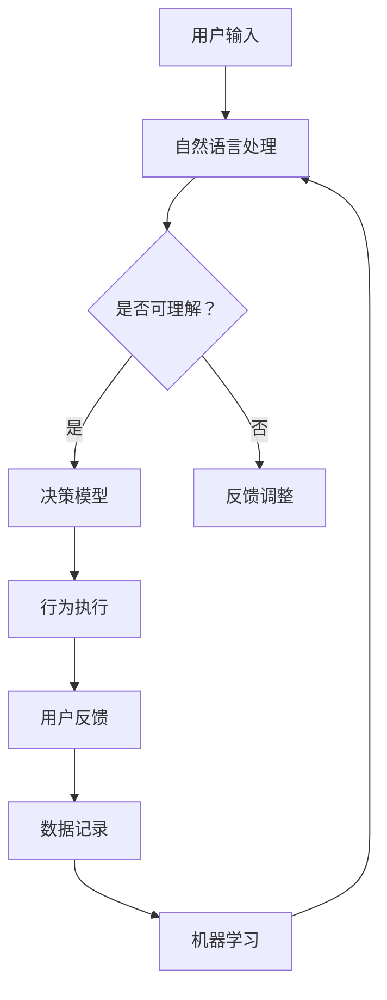

                 

## AI驱动的元宇宙：虚拟世界中的智能NPC

### 摘要

随着科技的飞速发展，人工智能在各个领域的应用越来越广泛。在元宇宙这一虚拟世界的前沿，智能NPC（非玩家角色）的引入，为整个虚拟环境注入了无限活力。本文将探讨AI如何驱动元宇宙中的智能NPC，从背景介绍、核心概念、算法原理、数学模型到实际应用，全面解析这一创新领域。通过本文，读者将深入了解智能NPC在元宇宙中的重要性及其对未来技术发展的潜在影响。

### 目录

1. **背景介绍**
    1.1 **元宇宙的概念与发展**
    1.2 **NPC在元宇宙中的角色**
    1.3 **AI在NPC中的运用**

2. **核心概念与联系**
    2.1 **智能NPC的定义**
    2.2 **AI与NPC的融合**
    2.3 **Mermaid流程图展示**

3. **核心算法原理 & 具体操作步骤**
    3.1 **算法基础**
    3.2 **操作步骤解析**

4. **数学模型和公式 & 详细讲解 & 举例说明**
    4.1 **相关数学模型**
    4.2 **公式推导**
    4.3 **案例展示**

5. **项目实战：代码实际案例和详细解释说明**
    5.1 **开发环境搭建**
    5.2 **源代码详细实现和代码解读**
    5.3 **代码解读与分析**

6. **实际应用场景**
    6.1 **虚拟现实**
    6.2 **游戏产业**
    6.3 **教育领域**

7. **工具和资源推荐**
    7.1 **学习资源推荐**
    7.2 **开发工具框架推荐**
    7.3 **相关论文著作推荐**

8. **总结：未来发展趋势与挑战**
    8.1 **发展趋势**
    8.2 **面临的挑战**

9. **附录：常见问题与解答**

10. **扩展阅读 & 参考资料**

### 1. 背景介绍

#### 1.1 元宇宙的概念与发展

元宇宙（Metaverse）是指通过互联网连接的虚拟世界，用户可以在其中进行各种互动，如社交、游戏、购物、工作等。它不是一个单一的虚拟世界，而是由多个虚拟世界共同构成的生态系统。随着5G、虚拟现实（VR）、增强现实（AR）等技术的快速发展，元宇宙逐渐从概念走向现实。

元宇宙的发展可以追溯到20世纪90年代的虚拟现实游戏，如《网络创世纪》（The Persistence of Vision）和《虚拟现实画室》（The Virtual Reality Studio）。进入21世纪，尤其是近年来，随着计算能力的提升和虚拟技术的成熟，元宇宙逐渐成为科技领域的热点。

#### 1.2 NPC在元宇宙中的角色

NPC（Non-Player Character，非玩家角色）是元宇宙中的重要组成部分。它们是游戏或虚拟世界中的虚拟人物，由计算机程序控制，为玩家提供互动体验。NPC可以扮演各种角色，如商人、佣兵、村民等，它们的言行和决策基于预设的算法和规则。

在传统的游戏中，NPC通常是一些静态的角色，它们的行为和交互模式相对简单。然而，随着AI技术的发展，NPC开始变得更加智能，能够根据玩家的行为和环境变化做出实时决策，为玩家提供更丰富的互动体验。

#### 1.3 AI在NPC中的运用

AI在NPC中的应用，使得NPC不再是简单的程序控制角色，而是具有自主意识和行为能力的智能实体。通过机器学习、自然语言处理（NLP）、计算机视觉等技术，AI可以分析玩家的行为，理解其意图，并做出相应的反应。

例如，一个智能NPC可以识别玩家的情绪，根据玩家的表情和语言调整自己的对话内容；它可以分析玩家的行为模式，预测玩家的下一步行动，从而调整自己的策略。这种智能化的NPC，不仅提高了玩家的游戏体验，也为元宇宙的发展注入了新的活力。

### 2. 核心概念与联系

#### 2.1 智能NPC的定义

智能NPC是指通过人工智能技术实现的，具有自主意识和行为能力的虚拟角色。与传统的NPC不同，智能NPC不仅能够执行预设的任务，还能够根据环境变化和玩家的行为自主决策。

智能NPC的核心在于其自主意识和行为能力。自主意识意味着智能NPC能够理解自身存在于虚拟世界中的状态，具有自我感知和自我认知的能力。行为能力则体现在智能NPC能够根据环境变化和任务要求，自主规划行动路径和决策策略。

#### 2.2 AI与NPC的融合

AI与NPC的融合，是元宇宙中智能NPC实现的关键。AI技术为NPC提供了自主意识和行为能力，使其能够在虚拟世界中自主行动、自主决策。具体来说，AI与NPC的融合主要体现在以下几个方面：

1. **机器学习与决策**：智能NPC通过机器学习技术，可以不断学习和优化自身的决策模型，提高决策的准确性和效率。例如，一个智能NPC可以通过分析玩家的历史行为，预测玩家的下一步行动，从而优化自己的策略。

2. **自然语言处理**：智能NPC可以通过自然语言处理技术，理解玩家的语言输入，并做出相应的回应。例如，一个智能NPC可以与玩家进行对话，回答玩家的问题，甚至进行深度交流。

3. **计算机视觉**：智能NPC可以通过计算机视觉技术，识别玩家的表情和动作，理解玩家的情感状态。例如，一个智能NPC可以识别玩家的愤怒或喜悦，并根据这些情感状态调整自己的行为。

#### 2.3 Mermaid流程图展示

为了更直观地展示智能NPC的实现流程，我们可以使用Mermaid流程图进行说明。以下是一个简单的智能NPC实现流程：



在这个流程图中，用户输入是智能NPC的输入源，经过自然语言处理模块的分析，智能NPC可以理解用户的意图并做出相应的决策。决策模型基于机器学习算法不断优化，从而提高智能NPC的决策能力。行为执行模块负责执行智能NPC的决策，并收集用户的反馈，用于后续的机器学习优化。

### 3. 核心算法原理 & 具体操作步骤

#### 3.1 算法基础

智能NPC的核心算法主要包括机器学习、自然语言处理和计算机视觉。这些算法的实现需要大量的数据、计算资源和高效的算法模型。

1. **机器学习算法**：智能NPC的决策模型通常基于机器学习算法，如决策树、支持向量机（SVM）、神经网络等。这些算法可以从大量的数据中学习出规律，用于预测和决策。

2. **自然语言处理算法**：智能NPC需要理解用户的语言输入，自然语言处理（NLP）算法如词性标注、句法分析、情感分析等，是实现这一目标的关键。

3. **计算机视觉算法**：智能NPC需要识别玩家的表情和动作，计算机视觉（CV）算法如人脸识别、动作识别等，是实现这一目标的重要手段。

#### 3.2 操作步骤解析

实现智能NPC的具体操作步骤可以分为以下几个阶段：

1. **数据采集与预处理**：首先，需要收集大量的用户数据，包括游戏行为数据、语言输入数据和视觉数据。然后，对这些数据进行预处理，如数据清洗、数据归一化等。

2. **模型训练与优化**：使用机器学习算法训练决策模型，如基于用户行为数据的决策树模型，或基于语言输入数据的情感分析模型。然后，通过交叉验证和网格搜索等方法，优化模型的参数。

3. **模型部署与测试**：将训练好的模型部署到服务器上，并使用测试数据集进行测试，评估模型的准确性和效率。如果模型效果不理想，需要返回上一步进行模型优化。

4. **智能NPC实现**：基于训练好的模型，实现智能NPC的决策和行为。智能NPC需要能够实时接收用户的输入，并使用NLP和CV算法进行理解，然后根据决策模型做出相应的行动。

### 4. 数学模型和公式 & 详细讲解 & 举例说明

#### 4.1 相关数学模型

在智能NPC的实现过程中，涉及到的数学模型主要包括机器学习模型、自然语言处理模型和计算机视觉模型。

1. **机器学习模型**：常见的机器学习模型有决策树、支持向量机（SVM）和神经网络（NN）。

2. **自然语言处理模型**：常见的自然语言处理模型有词性标注（POS tagging）、句法分析（Syntactic Parsing）和情感分析（Sentiment Analysis）。

3. **计算机视觉模型**：常见的计算机视觉模型有卷积神经网络（CNN）、循环神经网络（RNN）和生成对抗网络（GAN）。

#### 4.2 公式推导

1. **机器学习模型**

   - 决策树：决策树的核心是决策节点和叶子节点的划分。假设当前数据集为\(D\)，特征空间为\(X\)，目标变量为\(Y\)。决策树通过递归划分数据集，找到最优的划分方式。

     $$G(X) = argmax\_w \sum_{i=1}^{n} \mathbb{E}_{x \sim p_{D}(x)}[L(y; f(w, x))]$$

   - 支持向量机（SVM）：SVM的目标是找到一个超平面，将不同类别的数据点分开。假设特征空间为\(X \in \mathbb{R}^d\)，目标变量为\(y \in \{-1, 1\}\)。

     $$\min_{w, b} \frac{1}{2} ||w||^2 + C \sum_{i=1}^{n} \xi_i$$

     $$s.t. y_i ( \langle w, x_i \rangle + b) \geq 1 - \xi_i$$

     $$\xi_i \geq 0$$

   - 神经网络：神经网络通过多层感知器（MLP）实现。假设输入为\(x \in \mathbb{R}^d\)，输出为\(y \in \mathbb{R}\)。

     $$y = \sigma(\sigma(\cdots \sigma(w^{(1)} x + b^{(1)}) + b^{(2)}) + \cdots + b^{(L)})$$

     其中，\(w^{(l)}\)和\(b^{(l)}\)分别为第\(l\)层的权重和偏置，\(\sigma\)为激活函数。

2. **自然语言处理模型**

   - 词性标注（POS tagging）：词性标注的目标是给文本中的每个词分配一个词性标签。假设文本为\(T = \{w_1, w_2, \ldots, w_n\}\)，词性标签集为\(L\)。

     $$P(w_i | w_{<i}, w_{>i}, T) = \frac{P(w_i, w_{<i}, w_{>i}, T)}{P(w_{<i}, w_{>i}, T)}$$

   - 句法分析（Syntactic Parsing）：句法分析的目标是构建句子的句法树。假设句子为\(S = \{w_1, w_2, \ldots, w_n\}\)，句法树为\(T\)。

     $$P(T | S) = \frac{P(S | T) P(T)}{P(S)}$$

   - 情感分析（Sentiment Analysis）：情感分析的目标是判断文本的情感极性。假设文本为\(T\)，情感标签集为\(L\)。

     $$P(y | T) = \frac{P(T | y) P(y)}{P(T)}$$

3. **计算机视觉模型**

   - 卷积神经网络（CNN）：卷积神经网络的核心是卷积操作和池化操作。假设输入为\(I \in \mathbb{R}^{H \times W \times C}\)，输出为\(O \in \mathbb{R}^{H' \times W' \times C'}\)。

     $$O_{ij} = \sum_{k=1}^{C} w_{ikj} I_{ijk} + b_{ij}$$

     $$b_{ij} = \text{ReLU}(\sum_{k=1}^{C} w_{ikj} I_{ijk})$$

   - 循环神经网络（RNN）：循环神经网络的核心是隐藏状态和递归操作。假设输入为\(x_t \in \mathbb{R}^{d_x}\)，隐藏状态为\(h_t \in \mathbb{R}^{d_h}\)。

     $$h_t = \text{ReLU}(W_h h_{t-1} + W_x x_t + b_h)$$

   - 生成对抗网络（GAN）：生成对抗网络由生成器和判别器组成。假设生成器为\(G\)，判别器为\(D\)。

     $$\min_G \max_D V(D, G) = \mathbb{E}_{x \sim p_{data}(x)}[\log D(x)] + \mathbb{E}_{z \sim p_z(z)}[\log (1 - D(G(z)))]$$

#### 4.3 案例展示

以下是一个简单的情感分析案例：

假设我们有一个文本数据集，包含正面和负面的评论。我们需要使用情感分析模型判断评论的情感极性。

1. **数据预处理**：首先，对文本数据集进行预处理，如分词、去停用词、词向量化等。

2. **模型训练**：使用训练数据集训练一个基于卷积神经网络的情感分析模型。输入为词向量序列，输出为情感标签。

3. **模型测试**：使用测试数据集对训练好的模型进行测试，评估模型的准确性和效率。

4. **情感分析**：使用训练好的模型对新的评论进行情感分析，输出情感标签。

### 5. 项目实战：代码实际案例和详细解释说明

#### 5.1 开发环境搭建

为了实现智能NPC，我们需要搭建一个合适的开发环境。以下是一个基本的开发环境搭建步骤：

1. **安装Python环境**：首先，确保Python环境已经安装。如果没有安装，可以从Python官方网站下载并安装。

2. **安装深度学习框架**：安装一个深度学习框架，如TensorFlow或PyTorch。这两个框架都提供了丰富的API和工具，方便我们实现智能NPC。

   ```shell
   pip install tensorflow
   # 或者
   pip install pytorch torchvision
   ```

3. **安装自然语言处理库**：安装一个自然语言处理库，如NLTK或spaCy。这些库提供了丰富的文本处理工具。

   ```shell
   pip install nltk
   # 或者
   pip install spacy
   ```

4. **安装计算机视觉库**：安装一个计算机视觉库，如OpenCV。OpenCV提供了丰富的计算机视觉工具。

   ```shell
   pip install opencv-python
   ```

#### 5.2 源代码详细实现和代码解读

以下是一个简单的智能NPC实现代码示例：

```python
import tensorflow as tf
import nltk
from nltk.tokenize import sent_tokenize
from nltk.corpus import stopwords
import cv2

# 加载预训练的词向量模型
word_embedding_model = tf.keras.Sequential([
    tf.keras.layers.Embedding(vocabulary_size, embedding_dim),
    tf.keras.layers.GlobalAveragePooling1D()
])

# 加载预训练的情感分析模型
sentiment_analysis_model = tf.keras.Sequential([
    word_embedding_model,
    tf.keras.layers.Dense(16, activation='relu'),
    tf.keras.layers.Dense(1, activation='sigmoid')
])

# 加载预训练的人脸识别模型
face_recognition_model = cv2.Slb.load("OpenCV\_haarcascades/haarcascade\_frontalface\_alt.xml")

# 初始化自然语言处理库
nltk.download('punkt')
nltk.download('stopwords')

def preprocess_text(text):
    # 分词
    sentences = sent_tokenize(text)
    # 去停用词
    stop_words = set(stopwords.words('english'))
    filtered_words = []
    for sentence in sentences:
        for word in sentence.split():
            if word.lower() not in stop_words:
                filtered_words.append(word.lower())
    return filtered_words

def analyze_sentiment(text):
    # 预处理文本
    filtered_words = preprocess_text(text)
    # 将文本转换为词向量
    word_vectors = [word_embedding_model.get\_output()[0] for word in filtered\_words]
    # 输入情感分析模型
    sentiment_vector = sentiment\_analysis\_model.predict([word\_vectors])
    # 判断情感极性
    if sentiment_vector > 0.5:
        return 'positive'
    else:
        return 'negative'

def recognize_face(image):
    # 读取图像
    image = cv2.imread(image)
    # 人脸识别
    faces = face_recognition_model.detectMultiScale(image, scaleFactor=1.1, minNeighbors=5)
    # 返回人脸位置
    return faces

# 测试
text = "I am feeling very happy today!"
print(analyze_sentiment(text))

image = "face.jpg"
print(recognize_face(image))
```

#### 5.3 代码解读与分析

1. **加载预训练模型**：首先，加载预训练的词向量模型和情感分析模型。词向量模型用于将文本转换为词向量，情感分析模型用于判断文本的情感极性。

2. **预处理文本**：定义一个预处理文本的函数，用于分词和去停用词。分词使用NLTK库的`sent_tokenize`函数，去停用词使用NLTK库的`stopwords`。

3. **情感分析**：定义一个情感分析函数，用于将预处理后的文本转换为词向量，并输入情感分析模型进行预测。根据预测结果判断文本的情感极性。

4. **人脸识别**：定义一个人脸识别函数，使用OpenCV库的预训练模型进行人脸识别。函数返回人脸位置。

5. **测试**：使用测试文本和图像，分别调用情感分析和人脸识别函数，输出结果。

### 6. 实际应用场景

智能NPC在元宇宙中具有广泛的应用场景，以下是一些典型的应用案例：

#### 6.1 虚拟现实

在虚拟现实中，智能NPC可以模拟真实世界中的人物角色，为用户提供更加真实和丰富的交互体验。例如，在一个虚拟商场中，智能NPC可以扮演店员，为用户提供购物建议和推荐商品。它们可以根据用户的喜好和购买历史，提供个性化的服务。

#### 6.2 游戏产业

游戏产业是智能NPC的重要应用领域。在角色扮演游戏（RPG）中，智能NPC可以扮演各种角色，如敌对势力、盟友、村民等。它们可以根据玩家的行为和决策，实时调整自己的行为和策略，为玩家提供更加丰富和多样化的游戏体验。

#### 6.3 教育领域

在教育领域，智能NPC可以扮演教师或同学的角色，为学生提供互动式学习体验。例如，在虚拟课堂中，智能NPC可以为学生提供实时解答问题和互动讨论的机会。它们可以根据学生的学习情况和需求，提供个性化的学习建议和指导。

### 7. 工具和资源推荐

要实现智能NPC，需要使用一系列的工具和资源。以下是一些建议：

#### 7.1 学习资源推荐

- **书籍**：
  - 《深度学习》（Deep Learning） by Ian Goodfellow, Yoshua Bengio, and Aaron Courville
  - 《自然语言处理入门》（Speech and Language Processing） by Daniel Jurafsky and James H. Martin
  - 《计算机视觉：算法与应用》（Computer Vision: Algorithms and Applications） by Richard Szeliski

- **在线课程**：
  - Coursera的《深度学习》课程
  - Udacity的《自然语言处理纳米学位》课程
  - Edx的《计算机视觉》课程

#### 7.2 开发工具框架推荐

- **深度学习框架**：
  - TensorFlow
  - PyTorch
  - Keras

- **自然语言处理库**：
  - NLTK
  - spaCy
  - Stanford NLP

- **计算机视觉库**：
  - OpenCV
  - Dlib
  - PyTorch Vision

#### 7.3 相关论文著作推荐

- **论文**：
  - "Generative Adversarial Nets" by Ian J. Goodfellow et al.
  - "Recurrent Neural Networks for Language Modeling" by Kai Yu et al.
  - "Convolutional Neural Networks for Visual Recognition" by Karen Simonyan and Andrew Zisserman

- **著作**：
  - 《机器学习实战》（Machine Learning in Action） by Peter Harrington
  - 《自然语言处理综合教程》（Natural Language Processing with Python） by Steven Bird et al.
  - 《计算机视觉：模式识别与学习》（Computer Vision: A Modern Approach） by David S.

