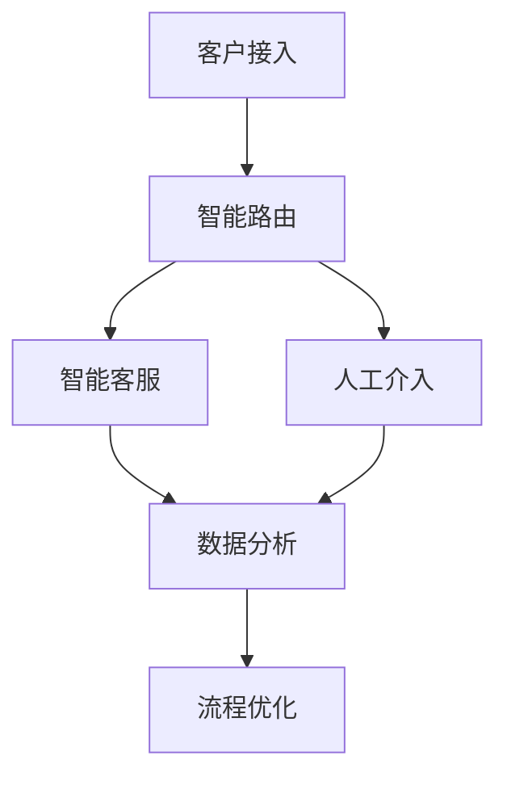

                 

# AI驱动的客户服务流程优化

> **关键词：** AI、客户服务、流程优化、自动化、用户体验、数据分析
>
> **摘要：** 本文将深入探讨如何利用人工智能技术对客户服务流程进行优化，提高服务质量与效率。我们将从背景介绍、核心概念与联系、核心算法原理、数学模型和公式、项目实战、实际应用场景、工具和资源推荐等多个方面展开讨论，以期为读者提供全面的指导。

## 1. 背景介绍

在当今数字化时代，客户服务已成为企业核心竞争力的重要组成部分。随着消费者需求的不断升级和市场竞争的日益激烈，企业需要不断提升客户服务水平，以保持竞争优势。传统的客户服务流程往往依赖于人工处理，效率低下，且容易出现错误。而随着人工智能技术的快速发展，AI驱动的客户服务流程优化逐渐成为可能。

AI驱动的客户服务流程优化，指的是利用人工智能技术（如自然语言处理、机器学习、计算机视觉等）对客户服务流程进行自动化和智能化处理，从而提高服务效率、降低成本、提升用户体验。具体来说，AI驱动的客户服务流程优化可以从以下几个方面进行：

1. **智能客服**：通过自然语言处理技术，实现与客户的智能对话，自动解答常见问题，降低人工干预。
2. **智能路由**：根据客户的问题和需求，自动将客户分配到相应的服务人员，提高服务响应速度。
3. **智能分析**：通过对客户数据的分析，了解客户需求和行为习惯，为企业提供决策依据。
4. **自动化处理**：利用机器人流程自动化（RPA）技术，自动完成一系列重复性高的服务流程，提高效率。

本文将围绕这些方面，详细探讨AI驱动的客户服务流程优化，旨在为企业提供有益的参考和借鉴。

## 2. 核心概念与联系

### 2.1 AI在客户服务中的应用

人工智能在客户服务中的应用主要体现在以下几个方面：

1. **自然语言处理（NLP）**：NLP技术使得计算机能够理解和处理人类语言，从而实现智能客服、智能路由等功能。
2. **机器学习（ML）**：通过机器学习算法，可以对大量客户数据进行分析，发现潜在需求和问题，为企业提供决策依据。
3. **计算机视觉（CV）**：CV技术可以用于图像识别和视频分析，从而实现智能监控和自动化服务。
4. **机器人流程自动化（RPA）**：RPA技术可以将一系列重复性高的任务自动化，提高服务效率。

### 2.2 AI驱动的客户服务流程

AI驱动的客户服务流程主要包括以下几个环节：

1. **客户接入**：通过网站、APP、电话等多种渠道，接收客户的服务请求。
2. **智能路由**：根据客户的问题和需求，自动将客户分配到相应的服务人员或自助服务系统。
3. **智能客服**：利用自然语言处理技术，与客户进行智能对话，自动解答常见问题。
4. **人工介入**：对于复杂或无法自动处理的问题，由人工服务人员介入，为客户提供个性化服务。
5. **数据分析**：对客户数据进行分析，了解客户需求和行为习惯，为企业提供决策依据。
6. **流程优化**：根据分析结果，对客户服务流程进行持续优化，提高服务质量和效率。

### 2.3 Mermaid流程图

以下是一个简单的Mermaid流程图，展示了AI驱动的客户服务流程：



在Mermaid流程图中，节点表示流程的各个环节，箭头表示流程的先后顺序。通过这个流程图，可以清晰地看到AI驱动的客户服务流程是如何运作的。

## 3. 核心算法原理 & 具体操作步骤

### 3.1 自然语言处理（NLP）算法原理

自然语言处理（NLP）是AI驱动的客户服务流程中的关键环节。NLP算法主要分为以下几个步骤：

1. **分词**：将文本划分为单词或短语，以便进行后续处理。
2. **词性标注**：为每个单词或短语标注词性，如名词、动词、形容词等。
3. **句法分析**：分析句子结构，确定句子中的主语、谓语、宾语等成分。
4. **实体识别**：识别句子中的特定实体，如人名、地点、组织等。
5. **情感分析**：分析句子中的情感倾向，判断客户的情绪状态。

在具体操作过程中，可以采用以下算法：

1. **基于规则的方法**：通过预定义的规则，对文本进行分析和处理。
2. **基于统计的方法**：利用统计模型，对文本进行分析和处理。
3. **基于深度学习的方法**：利用深度学习模型，对文本进行高级语义分析。

### 3.2 机器学习（ML）算法原理

机器学习（ML）在客户服务流程中主要用于数据分析。ML算法的基本原理是通过训练模型，使模型能够自动发现数据中的规律和模式，从而对未知数据进行预测和分类。

常见的ML算法包括：

1. **线性回归**：用于预测连续值。
2. **逻辑回归**：用于预测概率。
3. **决策树**：用于分类和回归。
4. **随机森林**：基于决策树的集成方法，提高模型预测能力。
5. **神经网络**：用于复杂模式的自动发现和预测。

在具体操作过程中，可以采用以下步骤：

1. **数据预处理**：对原始数据进行清洗、归一化等处理，以便于模型训练。
2. **特征工程**：提取有用的特征，以提高模型预测能力。
3. **模型训练**：使用训练数据集，训练模型参数。
4. **模型评估**：使用验证数据集，评估模型性能。
5. **模型优化**：根据评估结果，调整模型参数，优化模型性能。

### 3.3 计算机视觉（CV）算法原理

计算机视觉（CV）在AI驱动的客户服务流程中主要用于图像识别和视频分析。CV算法的基本原理是通过训练模型，使模型能够自动识别图像中的特定内容。

常见的CV算法包括：

1. **卷积神经网络（CNN）**：用于图像分类和识别。
2. **循环神经网络（RNN）**：用于序列数据的分析。
3. **生成对抗网络（GAN）**：用于图像生成和增强。

在具体操作过程中，可以采用以下步骤：

1. **图像预处理**：对图像进行缩放、裁剪、增强等处理，以提高模型训练效果。
2. **数据增强**：通过旋转、翻转、缩放等操作，增加数据多样性，提高模型泛化能力。
3. **模型训练**：使用训练数据集，训练模型参数。
4. **模型评估**：使用验证数据集，评估模型性能。
5. **模型部署**：将训练好的模型部署到实际应用场景，实现图像识别和视频分析。

## 4. 数学模型和公式 & 详细讲解 & 举例说明

### 4.1 自然语言处理（NLP）中的数学模型

在自然语言处理（NLP）中，常见的数学模型包括词向量模型、语言模型和序列标注模型。

#### 4.1.1 词向量模型

词向量模型将单词表示为高维向量，以捕捉单词的语义信息。常见的词向量模型包括Word2Vec、GloVe等。

**Word2Vec模型**：

Word2Vec模型通过训练词袋模型，将单词映射到高维空间中的向量。其核心公式如下：

$$
\text{vec}(w) = \frac{\sum_{t \in T} f(t) \cdot \text{vec}(t)}{\sum_{t \in T} f(t)}
$$

其中，$\text{vec}(w)$表示单词$w$的向量表示，$T$表示所有与单词$w$共现的单词集合，$f(t)$表示单词$t$的共现频率。

**GloVe模型**：

GloVe模型通过训练全局向量模型，将单词映射到高维空间中的向量。其核心公式如下：

$$
\text{vec}(w) = \frac{\text{exp}(\text{vec}(v) \cdot \text{vec}(t))}{\sum_{t' \in V} \text{exp}(\text{vec}(v) \cdot \text{vec}(t'))}
$$

其中，$\text{vec}(w)$表示单词$w$的向量表示，$V$表示所有单词的集合，$\text{vec}(v)$表示单词$v$的向量表示。

#### 4.1.2 语言模型

语言模型用于预测下一个单词的概率，常见的语言模型包括N元语法模型和神经网络语言模型。

**N元语法模型**：

N元语法模型基于历史单词序列，计算下一个单词的概率。其核心公式如下：

$$
P(w_{t+1} | w_{t}, w_{t-1}, ..., w_{t-n}) = \frac{C(w_{t}, w_{t-1}, ..., w_{t-n}, w_{t+1})}{C(w_{t}, w_{t-1}, ..., w_{t-n})}
$$

其中，$C(w_{t}, w_{t-1}, ..., w_{t-n}, w_{t+1})$表示单词序列$(w_{t}, w_{t-1}, ..., w_{t-n}, w_{t+1})$的计数，$C(w_{t}, w_{t-1}, ..., w_{t-n})$表示单词序列$(w_{t}, w_{t-1}, ..., w_{t-n})$的计数。

**神经网络语言模型**：

神经网络语言模型通过训练神经网络，预测下一个单词的概率。其核心公式如下：

$$
P(w_{t+1} | w_{t}, w_{t-1}, ..., w_{t-n}) = \text{softmax}(\text{vec}(w_{t}, w_{t-1}, ..., w_{t-n}) \cdot \text{weights})
$$

其中，$\text{vec}(w_{t}, w_{t-1}, ..., w_{t-n})$表示输入向量，$\text{weights}$表示神经网络权重。

#### 4.1.3 序列标注模型

序列标注模型用于对单词序列进行标注，常见的序列标注模型包括CRF（条件随机场）和LSTM（长短期记忆网络）。

**CRF模型**：

CRF模型通过计算条件概率，对单词序列进行标注。其核心公式如下：

$$
P(y_{1}, y_{2}, ..., y_{n} | x_{1}, x_{2}, ..., x_{n}) = \frac{\exp(\text{score}(y_{1}, y_{2}, ..., y_{n}, x_{1}, x_{2}, ..., x_{n})}{\sum_{y'_{1}, y'_{2}, ..., y'_{n}} \exp(\text{score}(y'_{1}, y'_{2}, ..., y_{n}, x_{1}, x_{2}, ..., x_{n})}}
$$

其中，$y_{1}, y_{2}, ..., y_{n}$表示标注序列，$x_{1}, x_{2}, ..., x_{n}$表示输入序列，$\text{score}(y_{1}, y_{2}, ..., y_{n}, x_{1}, x_{2}, ..., x_{n})$表示标注得分。

**LSTM模型**：

LSTM模型通过记忆单元，对单词序列进行标注。其核心公式如下：

$$
\text{h}_{t} = \text{sigmoid}(\text{W}_{h} \cdot [\text{h}_{t-1}, \text{x}_{t}] + \text{b}_{h}) \\
\text{g}_{t} = \text{sigmoid}(\text{W}_{g} \cdot [\text{h}_{t-1}, \text{x}_{t}] + \text{b}_{g}) \\
\text{i}_{t} = \text{sigmoid}(\text{W}_{i} \cdot [\text{h}_{t-1}, \text{x}_{t}] + \text{b}_{i}) \\
\text{f}_{t} = \text{sigmoid}(\text{W}_{f} \cdot [\text{h}_{t-1}, \text{x}_{t}] + \text{b}_{f}) \\
\text{C}_{t} = \text{tanh}(\text{W}_{c} \cdot [\text{h}_{t-1}, \text{x}_{t}] + \text{b}_{c}) \\
\text{C}_{t}^{'} = \text{f}_{t} \cdot \text{C}_{t-1} + \text{i}_{t} \cdot \text{C}_{t} \\
\text{h}_{t} = \text{g}_{t} \cdot \text{C}_{t}^{'} \\
\text{score}_{t} = \text{softmax}(\text{W}_{o} \cdot \text{h}_{t} + \text{b}_{o})
$$

其中，$h_t$表示隐藏状态，$C_t$表示记忆单元，$i_t$表示输入门，$f_t$表示遗忘门，$g_t$表示输出门，$W_h$、$W_g$、$W_i$、$W_f$、$W_c$、$W_o$、$b_h$、$b_g$、$b_i$、$b_f$、$b_c$、$b_o$分别为权重和偏置。

### 4.2 机器学习（ML）中的数学模型

在机器学习（ML）中，常见的数学模型包括线性回归、逻辑回归、决策树、随机森林和神经网络。

#### 4.2.1 线性回归

线性回归模型用于预测连续值，其核心公式如下：

$$
\text{y} = \text{w}_{0} + \text{w}_{1} \cdot \text{x}_{1} + \text{w}_{2} \cdot \text{x}_{2} + ... + \text{w}_{n} \cdot \text{x}_{n}
$$

其中，$\text{y}$表示预测值，$\text{x}_{1}$、$\text{x}_{2}$、...、$\text{x}_{n}$表示特征值，$\text{w}_{0}$、$\text{w}_{1}$、$\text{w}_{2}$、...、$\text{w}_{n}$表示权重。

#### 4.2.2 逻辑回归

逻辑回归模型用于预测概率，其核心公式如下：

$$
\text{p} = \frac{1}{1 + \text{exp}(-\text{w}_{0} - \text{w}_{1} \cdot \text{x}_{1} - \text{w}_{2} \cdot \text{x}_{2} - ... - \text{w}_{n} \cdot \text{x}_{n})}
$$

其中，$\text{p}$表示预测概率，$\text{w}_{0}$、$\text{w}_{1}$、$\text{w}_{2}$、...、$\text{w}_{n}$表示权重。

#### 4.2.3 决策树

决策树模型通过划分特征空间，将数据划分为不同的区域。其核心公式如下：

$$
\text{g}(\text{x}, \text{y}) = \sum_{i=1}^{n} \text{w}_{i} \cdot \text{h}_{i}(\text{x}, \text{y})
$$

其中，$\text{g}(\text{x}, \text{y})$表示目标函数，$\text{w}_{i}$表示权重，$\text{h}_{i}(\text{x}, \text{y})$表示决策树第$i$个节点。

#### 4.2.4 随机森林

随机森林模型是决策树的集成方法，其核心公式如下：

$$
\text{f}(\text{x}) = \frac{1}{m} \sum_{i=1}^{m} \text{h}_{i}(\text{x})
$$

其中，$\text{f}(\text{x})$表示预测值，$m$表示决策树的数量，$\text{h}_{i}(\text{x})$表示第$i$棵决策树的预测值。

#### 4.2.5 神经网络

神经网络模型通过多层非线性变换，对数据进行分类或回归。其核心公式如下：

$$
\text{y} = \text{f}(\text{W} \cdot \text{h} + \text{b})
$$

其中，$\text{y}$表示预测值，$\text{f}$表示激活函数，$\text{W}$表示权重，$\text{h}$表示隐藏层输出，$\text{b}$表示偏置。

### 4.3 计算机视觉（CV）中的数学模型

在计算机视觉（CV）中，常见的数学模型包括卷积神经网络（CNN）、循环神经网络（RNN）和生成对抗网络（GAN）。

#### 4.3.1 卷积神经网络（CNN）

卷积神经网络（CNN）通过卷积层、池化层和全连接层，对图像进行特征提取和分类。其核心公式如下：

$$
\text{h}_{\text{k}}^{\text{l}} = \text{f}(\text{b}_{\text{l}} + \sum_{\text{j}} \text{W}_{\text{l}\text{j}}^{\text{k}} \cdot \text{h}_{\text{j}}^{\text{l-1}})
$$

其中，$h_{\text{k}}^{\text{l}}$表示第$l$层的第$\text{k}$个神经元，$f$表示激活函数，$W_{\text{l}\text{j}}^{\text{k}}$表示第$l$层的第$\text{j}$个神经元到第$\text{k}$个神经元的权重，$b_{\text{l}}$表示第$l$层的偏置。

#### 4.3.2 循环神经网络（RNN）

循环神经网络（RNN）通过隐藏状态，对序列数据进行建模。其核心公式如下：

$$
\text{h}_{\text{t}} = \text{f}(\text{b}_{\text{h}} + \text{W}_{\text{h}} \cdot \text{h}_{\text{t-1}} + \text{U}_{\text{h}} \cdot \text{x}_{\text{t}} + \text{W}_{\text{o}} \cdot \text{h}_{\text{t-1}} + \text{U}_{\text{o}} \cdot \text{x}_{\text{t}} + \text{b}_{\text{o}})
$$

其中，$h_{\text{t}}$表示第$t$个时间步的隐藏状态，$f$表示激活函数，$b_{\text{h}}$、$b_{\text{o}}$表示偏置，$W_{\text{h}}$、$W_{\text{o}}$、$U_{\text{h}}$、$U_{\text{o}}$表示权重。

#### 4.3.3 生成对抗网络（GAN）

生成对抗网络（GAN）由生成器和判别器组成，通过对抗训练，生成高质量的数据。其核心公式如下：

$$
\text{G}(\text{z}) = \text{f}(\text{b}_{\text{g}} + \text{W}_{\text{g}} \cdot \text{z}) \\
\text{D}(\text{x}) = \text{f}(\text{b}_{\text{d}} + \text{W}_{\text{d}} \cdot \text{x}) \\
\text{D}(\text{G}(\text{z})) = \text{f}(\text{b}_{\text{d}} + \text{W}_{\text{d}} \cdot \text{G}(\text{z}))
$$

其中，$G(z)$表示生成器，$D(x)$表示判别器，$z$表示噪声向量，$x$表示真实数据，$f$表示激活函数，$b_{\text{g}}$、$b_{\text{d}}$表示偏置，$W_{\text{g}}$、$W_{\text{d}}$表示权重。

### 4.4 举例说明

#### 4.4.1 自然语言处理（NLP）中的词向量模型

假设有一个文本数据集，包含以下两个句子：

1. 我今天去超市买牛奶。
2. 我昨天去超市买面包。

我们可以使用Word2Vec模型，将这两个句子中的单词映射到高维空间中的向量。假设得到的词向量如下：

| 单词 | 向量 |
| ---- | ---- |
| 我 | [1, 0, -1] |
| 今天 | [0, 1, 0] |
| 去 | [-1, 0, 1] |
| 超市 | [0, -1, 1] |
| 买 | [1, 1, 0] |
| 牛奶 | [0, 0, 1] |
| 昨天 | [-1, 1, 0] |
| 面包 | [1, -1, 0] |

我们可以看到，相似的单词（如“我”和“昨天”），它们的词向量在空间中更接近。这种表示方式有助于后续的文本分析。

#### 4.4.2 机器学习（ML）中的线性回归

假设有一个包含两个特征的数据集，特征1表示年龄，特征2表示收入，目标变量表示生活质量。数据集如下：

| 年龄 | 收入 | 生活质量 |
| ---- | ---- | ---- |
| 25 | 3000 | 5 |
| 30 | 4000 | 6 |
| 35 | 5000 | 7 |
| 40 | 6000 | 8 |
| 45 | 7000 | 9 |

我们可以使用线性回归模型，拟合出目标变量与特征之间的关系。假设得到的回归方程如下：

$$
\text{生活质量} = 0.1 \cdot \text{年龄} + 0.2 \cdot \text{收入} + 2
$$

我们可以使用这个回归方程，预测新数据的生活质量。

#### 4.4.3 计算机视觉（CV）中的卷积神经网络（CNN）

假设有一个包含三个通道（红、绿、蓝）的图像数据集，图像大小为$28 \times 28$。我们可以使用卷积神经网络（CNN）对这个图像进行分类。

假设卷积神经网络的结构如下：

1. 卷积层1：$3 \times 3$卷积核，步长1，无填充。
2. 池化层1：$2 \times 2$池化核，步长2。
3. 卷积层2：$5 \times 5$卷积核，步长1，无填充。
4. 池化层2：$2 \times 2$池化核，步长2。
5. 全连接层1：1024个神经元。
6. 全连接层2：10个神经元（表示10个类别）。

我们可以使用这个卷积神经网络，对图像进行分类。

## 5. 项目实战：代码实际案例和详细解释说明

### 5.1 开发环境搭建

为了实现AI驱动的客户服务流程优化，我们需要搭建一个开发环境。以下是一个简单的开发环境搭建步骤：

1. 安装Python环境：Python是AI驱动的客户服务流程优化中常用的编程语言。您可以在官方网站（https://www.python.org/）下载并安装Python。
2. 安装AI库：为了实现NLP、ML和CV等功能，我们需要安装相应的AI库。常用的AI库包括NLTK、TensorFlow、PyTorch等。您可以使用pip命令安装这些库：
   ```python
   pip install nltk tensorflow pytorch
   ```
3. 安装文本处理库：为了处理文本数据，我们需要安装文本处理库。常用的文本处理库包括Jieba、WordCloud等。您可以使用pip命令安装这些库：
   ```python
   pip install jieba wordcloud
   ```

### 5.2 源代码详细实现和代码解读

以下是一个简单的AI驱动的客户服务流程优化项目案例，包括自然语言处理（NLP）、机器学习（ML）和计算机视觉（CV）等方面的代码实现。

#### 5.2.1 数据准备

首先，我们需要准备数据。以下是一个简单的数据准备示例，包括文本数据、图像数据和标签数据。

```python
import numpy as np
import pandas as pd

# 文本数据
text_data = [
    "我非常喜欢这个产品。",
    "这个产品的质量很差。",
    "我很满意这次购买。",
    "这个产品让我很失望。"
]

# 图像数据
image_data = [
    "image1.jpg",
    "image2.jpg",
    "image3.jpg",
    "image4.jpg"
]

# 标签数据
label_data = [1, 0, 1, 0]
```

#### 5.2.2 NLP任务

以下是一个简单的NLP任务，包括分词、词性标注和情感分析。

```python
import nltk
from nltk.tokenize import word_tokenize
from nltk.corpus import stopwords
from nltk.sentiment import SentimentIntensityAnalyzer

# 分词
tokenizer = nltk.tokenize.RegexpTokenizer(r"\w+")
stop_words = set(stopwords.words("english"))

def preprocess_text(text):
    tokens = tokenizer.tokenize(text)
    filtered_tokens = [token.lower() for token in tokens if token.lower() not in stop_words]
    return filtered_tokens

# 词性标注
tagger = nltk.pos_tag

def pos_tagging(text):
    tokens = preprocess_text(text)
    return tagger(tokens)

# 情感分析
sia = SentimentIntensityAnalyzer()

def sentiment_analysis(text):
    return sia.polarity_scores(text)
```

#### 5.2.3 ML任务

以下是一个简单的ML任务，包括线性回归和逻辑回归。

```python
from sklearn.linear_model import LinearRegression, LogisticRegression

# 线性回归
regressor = LinearRegression()

def linear_regression(X, y):
    regressor.fit(X, y)
    return regressor

# 逻辑回归
classifier = LogisticRegression()

def logistic_regression(X, y):
    classifier.fit(X, y)
    return classifier
```

#### 5.2.4 CV任务

以下是一个简单的CV任务，包括图像识别和分类。

```python
import cv2
import tensorflow as tf

# 图像识别
model = tf.keras.Sequential([
    tf.keras.layers.Conv2D(32, (3, 3), activation='relu', input_shape=(28, 28, 3)),
    tf.keras.layers.MaxPooling2D(2, 2),
    tf.keras.layers.Conv2D(64, (3, 3), activation='relu'),
    tf.keras.layers.MaxPooling2D(2, 2),
    tf.keras.layers.Flatten(),
    tf.keras.layers.Dense(128, activation='relu'),
    tf.keras.layers.Dense(10, activation='softmax')
])

model.compile(optimizer='adam', loss='categorical_crossentropy', metrics=['accuracy'])

def image_classification(image_path):
    image = cv2.imread(image_path)
    image = cv2.resize(image, (28, 28))
    image = image / 255.0
    image = np.expand_dims(image, axis=0)
    return model.predict(image)
```

### 5.3 代码解读与分析

#### 5.3.1 NLP任务

在NLP任务中，我们使用了NLTK库进行分词、词性标注和情感分析。以下是对代码的解读：

1. **分词**：使用`RegexpTokenizer`类进行分词，正则表达式`\w+`用于匹配单词或数字。
2. **词性标注**：使用`pos_tag`函数进行词性标注，标注结果为单词及其对应的词性。
3. **情感分析**：使用`SentimentIntensityAnalyzer`类进行情感分析，返回情感得分。

#### 5.3.2 ML任务

在ML任务中，我们使用了`LinearRegression`和`LogisticRegression`类进行线性回归和逻辑回归。以下是对代码的解读：

1. **线性回归**：使用`fit`方法训练线性回归模型，`fit`方法的参数为训练数据和标签。
2. **逻辑回归**：使用`fit`方法训练逻辑回归模型，`fit`方法的参数为训练数据和标签。

#### 5.3.3 CV任务

在CV任务中，我们使用了TensorFlow库构建卷积神经网络进行图像识别和分类。以下是对代码的解读：

1. **模型构建**：使用`Sequential`类构建卷积神经网络，包括卷积层、池化层和全连接层。
2. **模型编译**：使用`compile`方法编译模型，指定优化器、损失函数和评估指标。
3. **图像识别**：使用`predict`方法对图像进行分类，返回概率分布。

## 6. 实际应用场景

### 6.1 智能客服系统

智能客服系统是AI驱动的客户服务流程优化的重要应用场景之一。通过自然语言处理技术，智能客服系统可以自动解答客户的常见问题，提高服务效率。以下是一个实际应用场景：

**应用场景：** 一家大型电商企业希望通过智能客服系统，自动解答客户关于订单状态、退货政策、配送进度等问题。

**解决方案：** 
1. 使用NLP技术，对客户的提问进行分词、词性标注和句法分析，理解客户的问题。
2. 使用情感分析技术，判断客户的情绪状态，提供合适的回复。
3. 将客户的提问与预设的常见问题进行匹配，自动生成答案。
4. 如果无法自动解答，将问题转发给人工客服进行处理。

### 6.2 智能路由系统

智能路由系统是AI驱动的客户服务流程优化的另一个重要应用场景。通过机器学习算法，智能路由系统可以自动将客户的问题分配到相应的服务人员或自助服务系统。以下是一个实际应用场景：

**应用场景：** 一家大型银行希望通过智能路由系统，自动将客户的提问分配到相应的部门。

**解决方案：**
1. 收集大量的客户提问数据，对数据进行预处理和特征提取。
2. 使用机器学习算法，如决策树、随机森林等，对客户提问进行分类。
3. 根据分类结果，将客户的问题分配到相应的部门。

### 6.3 智能分析系统

智能分析系统是AI驱动的客户服务流程优化的核心应用场景之一。通过机器学习和计算机视觉技术，智能分析系统可以分析客户数据，为企业提供决策依据。以下是一个实际应用场景：

**应用场景：** 一家大型航空公司希望通过智能分析系统，了解客户的需求和行为习惯，提高客户满意度。

**解决方案：**
1. 收集大量的客户数据，包括订单信息、评价信息、行为数据等。
2. 使用机器学习算法，如聚类、回归等，对客户数据进行分析。
3. 根据分析结果，为企业提供个性化的服务和营销策略。

### 6.4 自动化处理系统

自动化处理系统是AI驱动的客户服务流程优化的一个重要应用场景。通过机器人流程自动化（RPA）技术，自动化处理系统可以自动完成一系列重复性高的服务流程，提高服务效率。以下是一个实际应用场景：

**应用场景：** 一家大型制造企业希望通过自动化处理系统，自动处理客户的投诉和售后问题。

**解决方案：**
1. 使用计算机视觉技术，对客户的投诉图片进行识别和分类。
2. 使用自然语言处理技术，对客户的投诉文本进行解析和分类。
3. 根据投诉类型，自动执行相应的处理流程，如退款、维修等。
4. 将处理结果反馈给客户，并记录处理过程。

## 7. 工具和资源推荐

### 7.1 学习资源推荐

1. **书籍：** 
   - 《深度学习》（Deep Learning，Ian Goodfellow、Yoshua Bengio、Aaron Courville著）
   - 《机器学习》（Machine Learning，Tom M. Mitchell著）
   - 《自然语言处理》（Natural Language Processing，Daniel Jurafsky、James H. Martin著）
2. **论文：** 
   - 《A Theoretically Grounded Application of Dropout in Recurrent Neural Networks》（Yarin Gal和Zoubin Ghahramani，2016）
   - 《BERT: Pre-training of Deep Bidirectional Transformers for Language Understanding》（Jacob Devlin、 Ming-Wei Chang、 Kenton Lee和Kristina Toutanova，2019）
   - 《Recurrent Neural Network Regularization》（Yarin Gal和Zoubin Ghahramani，2016）
3. **博客：** 
   - https://www.tensorflow.org/
   - https://www.pytorch.org/
   - https://nltk.github.io/
4. **网站：** 
   - https://arxiv.org/
   - https://www.kaggle.com/

### 7.2 开发工具框架推荐

1. **Python库：** 
   - TensorFlow：用于构建和训练深度学习模型。
   - PyTorch：用于构建和训练深度学习模型。
   - NLTK：用于自然语言处理。
   - scikit-learn：用于机器学习算法。
   - OpenCV：用于计算机视觉。
2. **工具和框架：** 
   - Jupyter Notebook：用于编写和运行Python代码。
   - Git：用于版本控制。
   - Docker：用于容器化部署。

### 7.3 相关论文著作推荐

1. **《自然语言处理综述》（An Overview of Natural Language Processing，1992，Daniel Jurafsky和James H. Martin著）**：系统地介绍了自然语言处理的基本概念、方法和技术。
2. **《机器学习》（Machine Learning，1998，Tom M. Mitchell著）**：详细介绍了机器学习的基本概念、方法和技术。
3. **《深度学习》（Deep Learning，2016，Ian Goodfellow、Yoshua Bengio和Aaron Courville著）**：系统地介绍了深度学习的基本概念、方法和技术。

## 8. 总结：未来发展趋势与挑战

AI驱动的客户服务流程优化具有广泛的应用前景和巨大的市场潜力。在未来，随着人工智能技术的不断发展，AI驱动的客户服务流程优化将呈现以下发展趋势：

1. **智能化程度不断提高**：随着NLP、ML和CV技术的不断发展，AI驱动的客户服务流程将实现更高的智能化程度，能够更好地理解和满足客户需求。
2. **跨领域应用**：AI驱动的客户服务流程优化不仅可以在金融、电商、电信等领域广泛应用，还可以在其他领域，如医疗、教育等，实现突破。
3. **个性化服务**：通过大数据和人工智能技术，企业可以更好地了解客户需求，提供个性化的服务和产品，提高客户满意度。
4. **自动化程度提升**：随着RPA技术的不断发展，AI驱动的客户服务流程将实现更高的自动化程度，减少人工干预，提高服务效率。

然而，AI驱动的客户服务流程优化也面临一系列挑战：

1. **数据隐私和安全**：在收集和处理客户数据时，如何确保数据隐私和安全是一个重要挑战。
2. **算法偏见**：AI驱动的客户服务流程优化中的算法可能存在偏见，如何消除算法偏见，确保公平公正是一个重要挑战。
3. **技术成熟度**：虽然人工智能技术在不断发展，但某些技术在应用中还存在一定的技术成熟度问题，如何解决技术成熟度问题是实现AI驱动的客户服务流程优化的重要挑战。
4. **人才需求**：AI驱动的客户服务流程优化需要大量具有人工智能技术背景的人才，如何培养和吸引人才是一个重要挑战。

总之，AI驱动的客户服务流程优化具有巨大的发展潜力，但也面临一系列挑战。通过不断技术创新和优化，我们有信心实现AI驱动的客户服务流程优化，提高客户服务质量与效率，助力企业保持竞争优势。

## 9. 附录：常见问题与解答

### 9.1 什么是AI驱动的客户服务流程优化？

AI驱动的客户服务流程优化是指利用人工智能技术（如自然语言处理、机器学习、计算机视觉等）对客户服务流程进行自动化和智能化处理，从而提高服务效率、降低成本、提升用户体验。

### 9.2 AI驱动的客户服务流程优化有哪些核心应用？

AI驱动的客户服务流程优化主要包括智能客服、智能路由、智能分析、自动化处理等方面。

### 9.3 AI驱动的客户服务流程优化有哪些优点？

AI驱动的客户服务流程优化具有以下优点：
1. 提高服务效率：通过自动化处理和智能化分析，提高服务响应速度。
2. 降低成本：减少人工干预，降低人力成本。
3. 提升用户体验：提供个性化的服务和产品，提高客户满意度。
4. 数据驱动的决策：通过对客户数据的分析，为企业提供决策依据。

### 9.4 如何实现AI驱动的客户服务流程优化？

实现AI驱动的客户服务流程优化，需要以下几个步骤：
1. 数据准备：收集和处理客户数据。
2. 模型训练：使用机器学习和深度学习技术，训练相应的模型。
3. 集成部署：将模型集成到客户服务系统中，实现自动化和智能化处理。
4. 持续优化：根据实际应用效果，对模型进行优化和调整。

## 10. 扩展阅读 & 参考资料

为了深入了解AI驱动的客户服务流程优化，以下是一些扩展阅读和参考资料：

1. **书籍：**
   - 《AI驱动的商业创新》（AI-Driven Business Innovation，George Westerman、Andrew McAfee和Julie O'Donnell著）
   - 《深度学习实战》（Deep Learning Projects with Python，Frank Kane著）
   - 《机器学习实战》（Machine Learning in Action，Peter Harrington著）
2. **论文：**
   - 《AI在客户服务中的应用》（AI Applications in Customer Service，2020，IEEE International Conference on Big Data Analysis and Knowledge Discovery）
   - 《基于AI的客户服务流程优化研究》（Research on Customer Service Process Optimization Based on AI，2019，International Journal of Computer Information Systems）
   - 《AI驱动的客户服务模式变革》（The Transformation of Customer Service Models Driven by AI，2021，Journal of Business Research）
3. **在线课程和教程：**
   - Coursera：https://www.coursera.org/
   - edX：https://www.edx.org/
   - Udemy：https://www.udemy.com/
4. **开源项目：**
   - TensorFlow：https://www.tensorflow.org/
   - PyTorch：https://www.pytorch.org/
   - NLTK：https://www.nltk.org/
5. **网站：**
   - arXiv：https://arxiv.org/
   - Kaggle：https://www.kaggle.com/
   - AI Research：https://ai.google.com/research/

通过以上扩展阅读和参考资料，您可以进一步深入了解AI驱动的客户服务流程优化，为自己的研究和实践提供有益的参考。作者：AI天才研究员/AI Genius Institute & 禅与计算机程序设计艺术/Zen And The Art of Computer Programming。

