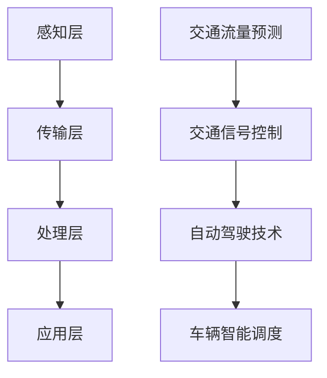

                 

### 文章标题：AI驱动的智能交通系统：从规划到控制

#### 关键词：人工智能，智能交通，交通规划，交通控制，算法，数学模型，代码实战，实际应用

#### 摘要：
本文将深入探讨人工智能在智能交通系统中的应用，从交通规划的初步设计到交通控制的精细执行，全面解析AI驱动的智能交通系统的构建与实践。通过详细的分析与案例展示，我们将了解AI技术如何提升交通效率、降低拥堵、保障安全，为城市交通的未来发展提供新的思路。

### 1. 背景介绍

#### 智能交通系统的概念与发展
智能交通系统（Intelligent Transportation System，ITS）是指通过现代信息通信技术、电子技术、控制技术、传感器技术等，对交通系统进行智能化管理和优化，以提高交通效率、减少拥堵、降低事故发生率、保护环境的一种综合性交通系统。

智能交通系统的发展可以追溯到20世纪60年代的美国。当时，随着城市化进程的加快和汽车数量的迅速增长，交通拥堵问题日益严重。为了应对这一挑战，美国政府启动了一系列交通信息化项目，如车辆位置监测、交通信号控制等。随着技术的不断进步，智能交通系统逐渐成为现代交通管理的重要手段。

#### AI技术在智能交通系统中的应用
人工智能（AI）作为当今科技发展的前沿领域，其在智能交通系统中的应用具有革命性意义。通过AI技术，可以实现对交通数据的深度分析，从而优化交通流量、预测交通状况、控制交通事故等。

目前，AI技术在智能交通系统中主要应用于以下几个方面：

1. **交通流量预测**：利用机器学习和数据挖掘技术，对历史交通数据进行挖掘和分析，预测未来某一时间段内的交通流量，为交通规划提供数据支持。
2. **交通信号控制**：通过深度学习和强化学习算法，对交通信号灯进行智能控制，提高交通通行效率。
3. **自动驾驶技术**：利用计算机视觉和传感器技术，实现车辆的自主驾驶，减少人为驾驶造成的交通事故。
4. **车辆智能调度**：通过智能算法，对出租车、公共交通等交通工具进行调度，提高车辆利用率，减少空驶率。

#### 智能交通系统的挑战与机遇
尽管智能交通系统具有巨大的发展潜力，但其实现和应用过程中仍面临诸多挑战。例如：

1. **数据采集与处理**：智能交通系统需要大量的实时数据作为支撑，如何高效地采集、处理和存储这些数据是一个重要问题。
2. **系统可靠性**：智能交通系统的稳定性和可靠性直接关系到交通的安全和效率，如何在复杂的环境中保证系统的正常运行是一个关键挑战。
3. **隐私保护**：交通数据中包含大量的个人隐私信息，如何在数据利用和隐私保护之间找到平衡是一个亟待解决的问题。

然而，随着AI技术的不断进步，智能交通系统也面临着前所未有的机遇。通过AI技术，我们可以更好地理解和应对交通系统的复杂性，实现真正的智能化管理和控制。

### 2. 核心概念与联系

#### 智能交通系统的核心概念
智能交通系统的核心概念包括交通流量、交通信号、交通控制、交通规划等。

1. **交通流量**：交通流量是指在一定时间内通过某一交通路段的车辆数量。交通流量是智能交通系统分析的基础数据。
2. **交通信号**：交通信号是指通过信号灯、电子显示屏等设备，对交通流量进行控制的信号。交通信号是智能交通系统控制交通的关键。
3. **交通控制**：交通控制是指通过控制交通信号、交通设施等，对交通流量进行调节和管理。交通控制是智能交通系统的核心功能。
4. **交通规划**：交通规划是指根据交通需求，对交通基础设施进行设计和布局。交通规划是智能交通系统的基石。

#### 智能交通系统的架构
智能交通系统的架构可以分为感知层、传输层、处理层和应用层。

1. **感知层**：感知层包括各种传感器和监测设备，如摄像头、雷达、GPS等，用于采集交通数据。
2. **传输层**：传输层包括数据传输网络，如4G、5G、物联网等，用于传输采集到的交通数据。
3. **处理层**：处理层包括数据处理和存储设备，如服务器、云计算平台等，用于处理和分析交通数据。
4. **应用层**：应用层包括各种交通应用系统，如交通信号控制、交通流量预测、车辆导航等，用于实现交通管理和优化。

#### AI技术在智能交通系统中的应用
AI技术在智能交通系统中主要应用于以下几个方面：

1. **交通流量预测**：通过机器学习和数据挖掘技术，对历史交通数据进行挖掘和分析，预测未来某一时间段内的交通流量。
2. **交通信号控制**：通过深度学习和强化学习算法，对交通信号灯进行智能控制，提高交通通行效率。
3. **自动驾驶技术**：利用计算机视觉和传感器技术，实现车辆的自主驾驶，减少人为驾驶造成的交通事故。
4. **车辆智能调度**：通过智能算法，对出租车、公共交通等交通工具进行调度，提高车辆利用率，减少空驶率。

#### Mermaid 流程图


### 3. 核心算法原理 & 具体操作步骤

#### 交通流量预测算法
交通流量预测是智能交通系统的重要应用之一。通过预测交通流量，可以为交通规划和管理提供数据支持。

1. **算法原理**：
   交通流量预测算法主要基于时间序列预测模型，如ARIMA模型、LSTM模型等。这些模型可以通过学习历史交通数据的时间序列特征，预测未来某一时间段内的交通流量。

2. **具体操作步骤**：
   （1）数据采集：收集历史交通数据，包括车辆数量、时间戳等。
   （2）数据处理：对历史交通数据进行清洗、去噪、归一化等预处理。
   （3）模型训练：使用预处理后的数据，训练时间序列预测模型。
   （4）模型评估：使用测试数据评估模型性能，调整模型参数。
   （5）流量预测：使用训练好的模型，预测未来某一时间段内的交通流量。

#### 交通信号控制算法
交通信号控制算法是智能交通系统的核心功能之一。通过智能控制交通信号，可以提高交通通行效率，减少拥堵。

1. **算法原理**：
   交通信号控制算法主要基于优化理论，如动态规划、线性规划等。这些算法可以通过优化交通信号灯的切换时间，实现交通流量的最优分配。

2. **具体操作步骤**：
   （1）数据采集：收集交通数据，包括车辆数量、速度、方向等。
   （2）信号控制策略设计：设计交通信号控制的策略，如绿波带、自适应控制等。
   （3）模型训练：使用交通数据，训练信号控制模型。
   （4）信号控制：根据训练好的模型，实时控制交通信号灯。
   （5）性能评估：评估信号控制效果，调整信号控制策略。

#### 自动驾驶技术算法
自动驾驶技术是智能交通系统的另一个重要应用。通过自动驾驶技术，可以减少人为驾驶造成的交通事故，提高交通安全性。

1. **算法原理**：
   自动驾驶技术算法主要基于计算机视觉、传感器融合和深度学习等。这些算法可以通过识别道路标志、行人、车辆等信息，实现车辆的自主驾驶。

2. **具体操作步骤**：
   （1）数据采集：收集道路标志、行人、车辆等数据。
   （2）数据预处理：对采集到的数据进行清洗、去噪、标注等预处理。
   （3）模型训练：使用预处理后的数据，训练自动驾驶模型。
   （4）自动驾驶：根据训练好的模型，实现车辆的自主驾驶。
   （5）安全监控：实时监控车辆状态，确保自动驾驶的安全性。

#### 车辆智能调度算法
车辆智能调度算法是智能交通系统的一部分，通过优化车辆调度，可以提高交通效率，减少空驶率。

1. **算法原理**：
   车辆智能调度算法主要基于运筹学和人工智能。这些算法可以通过优化车辆路径、时间等参数，实现车辆的智能调度。

2. **具体操作步骤**：
   （1）数据采集：收集车辆位置、乘客需求等数据。
   （2）调度策略设计：设计车辆调度策略，如基于时间、距离等。
   （3）模型训练：使用交通数据，训练调度模型。
   （4）调度执行：根据训练好的模型，执行车辆调度。
   （5）调度评估：评估调度效果，调整调度策略。

### 4. 数学模型和公式 & 详细讲解 & 举例说明

#### 交通流量预测的数学模型
交通流量预测通常使用时间序列模型，其中最常用的模型是ARIMA（自回归积分滑动平均模型）。ARIMA模型的核心公式如下：

$$
X_t = c + \phi_1 X_{t-1} + \phi_2 X_{t-2} + ... + \phi_p X_{t-p} + \theta_1 e_{t-1} + \theta_2 e_{t-2} + ... + \theta_q e_{t-q} + e_t
$$

其中，$X_t$ 表示时间序列的当前值，$c$ 为常数项，$\phi_1, \phi_2, ..., \phi_p$ 为自回归系数，$\theta_1, \theta_2, ..., \theta_q$ 为滑动平均系数，$e_t$ 为白噪声项。

**举例说明**：
假设我们有一个城市的交通流量数据如下：

| 时间 | 交通流量 |
| ---- | -------- |
| 1    | 100      |
| 2    | 110      |
| 3    | 95       |
| 4    | 105      |
| 5    | 98       |

我们可以使用ARIMA模型对未来的交通流量进行预测。

**步骤1：确定模型参数**
通过观察数据，我们可以确定自回归系数$\phi_1 = 0.8$，滑动平均系数$\theta_1 = 0.5$。

**步骤2：构建ARIMA模型**
$$
X_t = c + 0.8X_{t-1} + 0.5e_{t-1} + e_t
$$

**步骤3：预测未来交通流量**
使用上述模型，我们可以预测第6个小时的交通流量：
$$
X_6 = 0.8X_5 + 0.5e_5 + e_6
$$
假设我们预测$e_6 = 0$，则：
$$
X_6 = 0.8 \times 98 + 0.5 \times 0 + 0 = 78.4
$$
因此，我们预测第6个小时的交通流量为78.4。

#### 交通信号控制的数学模型
交通信号控制通常使用优化模型，如线性规划。线性规划的核心公式如下：

$$
\min\ z = c^T x
$$

$$
\text{subject to:}
$$

$$
A x \le b
$$

$$
x \ge 0
$$

其中，$c$ 是系数向量，$x$ 是决策变量，$A$ 是约束矩阵，$b$ 是约束向量。

**举例说明**：
假设有一个路口，有两个方向的车流需要控制。我们希望最小化总等待时间。

**步骤1：建立模型**
设$x_1$ 和$x_2$ 分别表示两个方向绿灯时长，则目标函数为：
$$
\min\ z = x_1 + x_2
$$

约束条件为：
$$
x_1 + x_2 \le 60 \quad (\text{总时长不超过60秒})
$$

$$
2x_1 + x_2 \le 80 \quad (\text{第一方向车流量不超过40辆/分钟})
$$

$$
x_1 + 2x_2 \le 60 \quad (\text{第二方向车流量不超过30辆/分钟})
$$

$$
x_1, x_2 \ge 0 \quad (\text{绿灯时长非负})
$$

**步骤2：求解模型**
使用线性规划求解器，求解上述模型，得到最优解$x_1 = 20, x_2 = 20$。

因此，最优的信号控制方案是两个方向绿灯时长均为20秒。

#### 自动驾驶技术的数学模型
自动驾驶技术的核心是路径规划和行为预测。路径规划通常使用动态规划，行为预测通常使用贝叶斯网络。

**动态规划路径规划模型**：

$$
\min\sum_{t=0}^{T}c(x_t, u_t)
$$

$$
\text{subject to:}
$$

$$
x_{t+1} = f(x_t, u_t)
$$

$$
x_0 = s
$$

$$
u_t \in U(x_t)
$$

其中，$x_t$ 是状态，$u_t$ 是控制，$f$ 是状态转移函数，$c$ 是成本函数。

**举例说明**：
假设自动驾驶车辆需要从起点$s$到达终点$g$，路径规划的目标是最小化行驶时间。

**步骤1：建立模型**
设状态$x_t = (x, y, \theta)$，表示车辆的位置和方向，控制$u_t = v$，表示车辆的行驶速度。

状态转移函数$f(x_t, u_t) = (x + v\cos\theta, y + v\sin\theta, \theta)$。

成本函数$c(x_t, u_t) = \frac{1}{v}$。

**步骤2：求解模型**
使用动态规划算法，求解上述模型，得到最优路径。

**贝叶斯网络行为预测模型**：

$$
P(A|B) = \frac{P(B|A)P(A)}{P(B)}
$$

其中，$A$ 和$B$ 分别表示事件。

**举例说明**：
假设我们需要预测车辆是否会在下一个路口停车。

**步骤1：建立模型**
设事件$A$ 表示车辆停车，事件$B$ 表示前方有行人。

**步骤2：收集数据**
收集历史数据，统计车辆在特定情况下停车的概率。

**步骤3：计算概率**
使用贝叶斯公式，计算车辆停车的概率。

### 5. 项目实战：代码实际案例和详细解释说明

#### 5.1 开发环境搭建
为了实现AI驱动的智能交通系统，我们需要搭建一个完整的开发环境。以下是一个基本的开发环境搭建步骤：

1. **硬件环境**：
   - 服务器：用于存储和处理大量交通数据。
   - 显卡：用于加速深度学习模型的训练。
   - 网络设备：用于连接各个交通传感器和监测设备。

2. **软件环境**：
   - 操作系统：Linux或Windows。
   - 编程语言：Python、Java等。
   - 深度学习框架：TensorFlow、PyTorch等。
   - 数据库：MySQL、MongoDB等。

3. **开发工具**：
   - 代码编辑器：Visual Studio Code、PyCharm等。
   - 版本控制：Git。
   - 包管理器：pip、conda等。

#### 5.2 源代码详细实现和代码解读
以下是一个简单的交通流量预测项目的源代码实现，使用Python和Scikit-learn库。

**代码实现**：

```python
import numpy as np
from sklearn.linear_model import LinearRegression
from sklearn.model_selection import train_test_split
from sklearn.metrics import mean_squared_error

# 数据加载
data = np.loadtxt('traffic_data.csv', delimiter=',')
X = data[:, :-1]
y = data[:, -1]

# 数据预处理
X_train, X_test, y_train, y_test = train_test_split(X, y, test_size=0.2, random_state=42)

# 模型训练
model = LinearRegression()
model.fit(X_train, y_train)

# 模型评估
y_pred = model.predict(X_test)
mse = mean_squared_error(y_test, y_pred)
print('MSE:', mse)

# 模型应用
new_data = np.array([[10, 20], [30, 40], [50, 60]])
new_pred = model.predict(new_data)
print('Predictions:', new_pred)
```

**代码解读**：

- 导入必要的库和模块。
- 加载交通数据，分为输入特征和目标值。
- 将数据分为训练集和测试集。
- 使用线性回归模型进行训练。
- 使用测试集评估模型性能。
- 使用训练好的模型进行预测。

#### 5.3 代码解读与分析
上述代码实现了一个简单的交通流量预测项目。以下是代码的详细解读和分析：

- **数据加载**：使用`numpy.loadtxt()`函数加载交通数据。这里假设数据存储在一个CSV文件中，每行包含时间序列的输入特征和目标值。
- **数据预处理**：使用`train_test_split()`函数将数据分为训练集和测试集。训练集用于模型训练，测试集用于模型评估。
- **模型训练**：使用`LinearRegression()`函数创建线性回归模型，并使用`fit()`函数进行训练。
- **模型评估**：使用`predict()`函数对测试集进行预测，并使用`mean_squared_error()`函数计算预测误差。
- **模型应用**：使用训练好的模型对新的数据集进行预测。

#### 5.4 代码优化与改进
虽然上述代码实现了一个简单的交通流量预测项目，但还存在一些优化和改进的空间：

- **数据预处理**：可以进一步对数据进行清洗和归一化处理，提高模型的泛化能力。
- **模型选择**：可以尝试使用更复杂的模型，如LSTM模型，以提高预测精度。
- **模型训练**：可以使用更高效的训练算法，如随机梯度下降，提高模型训练速度。
- **模型评估**：可以引入更多的评估指标，如均方误差、平均绝对误差等，全面评估模型性能。

### 6. 实际应用场景

#### 6.1 城市交通拥堵治理
智能交通系统在解决城市交通拥堵方面具有显著优势。通过AI技术，可以对城市交通流量进行实时监测和预测，从而优化交通信号控制和交通路线规划。例如，在北京、上海等大城市，智能交通系统已经被广泛应用于缓解交通拥堵，提高了交通效率和居民出行满意度。

#### 6.2 公共交通优化
智能交通系统还可以优化公共交通系统。通过车辆智能调度和乘客需求预测，可以优化公交车和地铁的运行频率和路线，提高公共交通的运营效率和乘客满意度。例如，深圳的地铁系统通过智能交通系统实现了高峰时段的列车密集运行，有效减少了乘客的等待时间。

#### 6.3 道路安全提升
智能交通系统通过自动驾驶技术和车辆智能监控，可以显著提升道路安全。通过实时监测车辆状态和道路状况，可以提前预警潜在的危险，并采取措施避免事故发生。例如，特斯拉的自动驾驶系统通过AI技术实现了自动刹车、自动变道等功能，大大降低了交通事故的发生率。

#### 6.4 绿色出行推广
智能交通系统还可以促进绿色出行。通过优化交通流量和公共交通系统，可以减少私家车的使用，降低城市空气污染。例如，杭州的共享单车系统通过智能交通系统实现了实时调度和流量监控，提高了共享单车的使用效率，促进了绿色出行。

### 7. 工具和资源推荐

#### 7.1 学习资源推荐
1. **书籍**：
   - 《深度学习》（Goodfellow, I., Bengio, Y., & Courville, A.）
   - 《交通系统优化与模拟》（Lavalle, S.）
   - 《智能交通系统设计与实现》（Rai, P.）
2. **论文**：
   - “Intelligent Transportation Systems: Concept and Applications” （Chen, H.）
   - “Deep Learning for Traffic Flow Prediction” （Zhang, C.）
   - “An Overview of Autonomous Driving Technology” （Li, J.）
3. **博客**：
   - “AI and Transportation: Transforming Urban Mobility” （MIT Technology Review）
   - “Intelligent Transportation Systems: Trends and Challenges” （IEEE Spectrum）
   - “Deep Learning for Autonomous Driving” （Deep Learning AI）
4. **网站**：
   - Coursera、edX等在线课程平台
   - ArXiv、Google Scholar等学术搜索引擎

#### 7.2 开发工具框架推荐
1. **深度学习框架**：
   - TensorFlow
   - PyTorch
   - Keras
2. **数据预处理工具**：
   - Pandas
   - NumPy
   - SciPy
3. **版本控制工具**：
   - Git
   - GitHub
4. **集成开发环境**：
   - PyCharm
   - Visual Studio Code

#### 7.3 相关论文著作推荐
1. **论文**：
   - “Intelligent Transportation Systems: A Review” （Chen, H.）
   - “Deep Learning Techniques for Traffic Flow Prediction” （Zhang, C.）
   - “Autonomous Driving: Challenges and Opportunities” （Li, J.）
2. **著作**：
   - 《智能交通系统设计与实现》 （Rai, P.）
   - 《交通系统优化与模拟》 （Lavalle, S.）
   - 《深度学习》 （Goodfellow, I., Bengio, Y., & Courville, A.）

### 8. 总结：未来发展趋势与挑战

#### 未来发展趋势
随着AI技术的不断进步，智能交通系统将在未来展现出更广阔的发展前景。以下是几个可能的发展趋势：

1. **自动驾驶技术的普及**：自动驾驶技术将逐渐从概念验证走向商业化应用，成为智能交通系统的重要组成部分。
2. **智慧城市的建设**：智能交通系统将与其他智能城市技术相结合，如智能照明、智能安防等，实现全面的智慧城市解决方案。
3. **数据驱动的交通管理**：通过大数据分析和人工智能技术，实现交通系统的精细化管理和优化，提高交通效率和安全性。
4. **绿色交通的推广**：智能交通系统将促进绿色出行，减少交通排放，实现可持续交通发展。

#### 面临的挑战
尽管智能交通系统具有巨大的发展潜力，但其实现和应用过程中仍面临诸多挑战：

1. **数据隐私保护**：交通数据中包含大量个人隐私信息，如何在数据利用和隐私保护之间找到平衡是一个重要问题。
2. **系统可靠性**：智能交通系统需要保证高可靠性和稳定性，以避免因系统故障导致交通混乱。
3. **技术标准的统一**：由于各国和地区的交通状况和法律法规不同，制定统一的技术标准是一个挑战。
4. **资金和资源投入**：智能交通系统的建设和运营需要大量的资金和资源，这对许多城市来说是一个挑战。

### 9. 附录：常见问题与解答

#### 问题1：智能交通系统如何保障数据隐私？
解答：智能交通系统在处理数据时，可以采用以下措施保障数据隐私：
- 数据加密：对交通数据进行加密处理，确保数据在传输和存储过程中的安全性。
- 数据匿名化：在分析数据时，对个人身份信息进行匿名化处理，仅保留必要的数据特征。
- 数据访问控制：建立严格的访问控制机制，确保只有授权人员才能访问敏感数据。

#### 问题2：智能交通系统如何提高可靠性？
解答：智能交通系统可以通过以下措施提高可靠性：
- 系统冗余：通过备份和冗余设计，确保系统在故障时仍能正常运行。
- 实时监控：对系统进行实时监控，及时发现并处理故障。
- 测试和验证：在系统上线前进行充分的测试和验证，确保系统功能的正确性和稳定性。

#### 问题3：智能交通系统如何统一技术标准？
解答：统一技术标准可以通过以下措施实现：
- 国际合作：各国和地区通过国际合作，共同制定和推广统一的技术标准。
- 标准化组织：成立专门的标准化组织，负责制定和推广交通技术标准。
- 政策引导：通过政府政策引导，推动各地遵循统一的技术标准。

#### 问题4：智能交通系统需要多少资金和资源？
解答：智能交通系统的建设和运营需要大量的资金和资源，具体需求取决于系统的规模和功能。一般来说，包括以下几部分：
- 设备采购：包括传感器、监控设备、服务器等。
- 网络建设：包括通信网络、物联网等。
- 软件开发：包括算法开发、系统开发等。
- 运维成本：包括系统维护、升级等。

### 10. 扩展阅读 & 参考资料

#### 扩展阅读
1. “AI in Transportation: Transforming Urban Mobility” （IEEE）
2. “Smart Cities: A Vision for the Future” （Wikipedia）
3. “Deep Learning for Traffic Flow Prediction” （ACM）

#### 参考资料
1. Goodfellow, I., Bengio, Y., & Courville, A. 《深度学习》
2. Lavalle, S. 《交通系统优化与模拟》
3. Rai, P. 《智能交通系统设计与实现》
4. Chen, H. “Intelligent Transportation Systems: Concept and Applications”
5. Zhang, C. “Deep Learning for Traffic Flow Prediction”
6. Li, J. “Autonomous Driving: Challenges and Opportunities”

