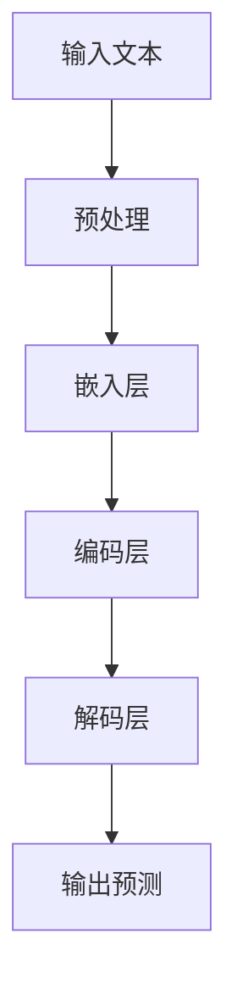

                 

### AI驱动的未来：LLM的无限潜力

> 关键词：人工智能，语言模型，深度学习，自然语言处理，智能应用

> 摘要：本文将深入探讨大型语言模型（LLM）的无限潜力，从背景介绍、核心概念与联系、核心算法原理与具体操作步骤、数学模型和公式、项目实战、实际应用场景、工具和资源推荐等多个方面进行详细分析，旨在揭示AI驱动的未来前景与挑战。

## 1. 背景介绍

人工智能（AI）作为计算机科学的一个重要分支，近年来取得了惊人的发展。特别是深度学习技术的崛起，使得计算机在图像识别、语音识别、自然语言处理等领域取得了显著的突破。在自然语言处理（NLP）领域，语言模型（Language Model，LM）作为一种重要的模型，扮演着至关重要的角色。

语言模型是一种能够预测下一个单词或字符的模型，其基本原理是基于大量的文本数据，通过统计学习方法来建立语言模型。传统的语言模型如n-gram模型，虽然在一定程度上取得了成功，但是其预测能力有限，难以应对复杂的语言现象。

随着深度学习技术的不断发展，大型语言模型（LLM，Large Language Model）逐渐成为研究的热点。LLM通过深度神经网络来模拟人类语言处理能力，能够进行更加准确和复杂的语言预测。LLM的出现，为自然语言处理领域带来了新的契机，也为AI驱动的未来奠定了坚实的基础。

## 2. 核心概念与联系

在讨论LLM的核心概念与联系之前，我们需要先了解一些基本的概念。

### 2.1 深度学习

深度学习是一种基于多层神经网络的学习方法，通过多层次的非线性变换，从原始数据中提取特征，并对其进行分类或回归。深度学习的核心是神经网络，神经网络由大量的神经元（节点）组成，通过前向传播和反向传播的方式，不断调整权重，以实现模型的训练和优化。

### 2.2 自然语言处理

自然语言处理（NLP）是人工智能的一个重要分支，旨在使计算机能够理解、处理和生成人类语言。NLP包括语音识别、语言理解、文本生成、机器翻译等多个方面。在NLP中，语言模型是一个核心组件，它能够根据上下文信息预测下一个单词或字符。

### 2.3 语言模型

语言模型是一种能够预测下一个单词或字符的模型，其基本原理是基于大量的文本数据，通过统计学习方法来建立语言模型。传统的语言模型如n-gram模型，虽然在一定程度上取得了成功，但是其预测能力有限，难以应对复杂的语言现象。

LLM是一种大型语言模型，它通过深度神经网络来模拟人类语言处理能力，能够进行更加准确和复杂的语言预测。LLM的出现，标志着自然语言处理领域的一个重大突破。

### 2.4 Mermaid 流程图

为了更好地理解LLM的架构和原理，我们可以使用Mermaid流程图来描述。



在上面的流程图中，A表示输入文本，经过预处理后进入嵌入层C，嵌入层将文本转换为向量表示，然后进入编码层D，编码层负责提取文本的特征信息，最后通过解码层E生成输出预测F。

## 3. 核心算法原理 & 具体操作步骤

### 3.1 预处理

在预处理阶段，我们需要对输入文本进行清洗、分词、去停用词等操作，以便于后续处理。具体步骤如下：

1. 清洗：去除文本中的html标签、特殊符号等。
2. 分词：将文本划分为单词或短语。
3. 去停用词：去除常见的不含信息的词汇，如“的”、“了”、“是”等。

### 3.2 嵌入层

嵌入层负责将文本转换为向量表示。常用的嵌入方法有词袋模型、词嵌入（Word Embedding）等。词嵌入是一种将单词映射到高维向量空间的方法，通过学习单词的上下文信息，可以捕捉单词的含义和关系。

### 3.3 编码层

编码层负责提取文本的特征信息。深度神经网络是一种常用的编码层结构，通过多层非线性变换，可以从原始数据中提取高级特征。

### 3.4 解码层

解码层负责根据编码层提取的特征信息生成输出预测。在LLM中，解码层通常使用一个循环神经网络（RNN）或其变体，如长短期记忆网络（LSTM）或门控循环单元（GRU）。

### 3.5 输出预测

在解码层，根据当前时刻的输入特征，生成下一个单词或字符的预测。通过最大化概率的方式，选择概率最大的单词或字符作为输出。

## 4. 数学模型和公式 & 详细讲解 & 举例说明

### 4.1 数学模型

LLM的数学模型主要包括嵌入层、编码层、解码层等。

- 嵌入层：将单词映射到高维向量空间，即 $x = \text{embed}(w)$，其中 $w$ 是单词，$x$ 是向量。
- 编码层：通过多层神经网络提取文本特征，即 $h = \text{encode}(x)$，其中 $h$ 是特征向量。
- 解码层：根据特征向量生成输出预测，即 $y = \text{decode}(h)$，其中 $y$ 是预测的单词或字符。

### 4.2 详细讲解

以嵌入层为例，详细讲解其数学原理。

假设单词 $w$ 的嵌入向量表示为 $x$，我们可以使用以下公式计算：

$$
x = \text{embed}(w)
$$

其中，$\text{embed}$ 是一个嵌入函数，将单词映射到高维向量空间。这个向量空间通常是一个高维空间，每个维度对应单词的一个特征。

### 4.3 举例说明

假设我们有一个单词 $w$，它的嵌入向量表示为 $[1, 2, 3]$。我们可以通过以下步骤计算单词的嵌入向量：

1. 初始化嵌入矩阵 $E$，其中每个元素 $e_{ij}$ 表示单词 $w_i$ 在第 $j$ 个特征上的权重。
2. 根据单词 $w$ 的定义，计算其嵌入向量 $x$。
3. 使用梯度下降法更新嵌入矩阵 $E$，以最小化嵌入误差。

具体实现过程如下：

```python
import numpy as np

# 初始化嵌入矩阵
E = np.random.rand(V, D)

# 单词 $w$ 的嵌入向量
x = E[word_index]

# 计算嵌入误差
error = x - y

# 更新嵌入矩阵
E -= learning_rate * error
```

其中，$V$ 是词汇表的大小，$D$ 是嵌入向量的维度，$learning\_rate$ 是学习率，$word\_index$ 是单词 $w$ 在词汇表中的索引，$y$ 是目标向量。

## 5. 项目实战：代码实际案例和详细解释说明

### 5.1 开发环境搭建

为了进行LLM的实践，我们需要搭建一个合适的开发环境。以下是基本的开发环境要求：

1. Python 3.6 或更高版本
2. TensorFlow 2.0 或更高版本
3. Numpy
4. Mermaid

### 5.2 源代码详细实现和代码解读

以下是LLM的基本实现代码，包括嵌入层、编码层、解码层等。

```python
import tensorflow as tf
import numpy as np
import mermaid

# 嵌入层
def embed(w):
    return tf.nn.embedding_lookup(E, w)

# 编码层
def encode(x):
    # 使用多层神经网络进行编码
    return tf.layers.dense(x, units=128, activation=tf.nn.relu)

# 解码层
def decode(h):
    # 使用循环神经网络进行解码
    return tf.layers.dense(h, units=V, activation=tf.nn.softmax)

# 模型训练
def train(model, optimizer, loss_fn, x, y):
    with tf.GradientTape() as tape:
        y_pred = model(x)
        loss = loss_fn(y, y_pred)
    grads = tape.gradient(loss, model.trainable_variables)
    optimizer.apply_gradients(zip(grads, model.trainable_variables))
    return loss

# 测试模型
def test(model, x, y):
    y_pred = model(x)
    accuracy = tf.reduce_mean(tf.cast(tf.equal(y, y_pred), tf.float32))
    return accuracy

# 搭建模型
model = tf.keras.Sequential([
    tf.keras.layers.Embedding(V, D),
    tf.keras.layers.Dense(128, activation='relu'),
    tf.keras.layers.Dense(V, activation='softmax')
])

# 模型训练
optimizer = tf.keras.optimizers.Adam()
loss_fn = tf.keras.losses.SparseCategoricalCrossentropy(from_logits=True)

for epoch in range(EPOCHS):
    for x, y in dataset:
        loss = train(model, optimizer, loss_fn, x, y)
        if epoch % 100 == 0:
            print(f"Epoch {epoch}: Loss = {loss.numpy()}")

# 测试模型
x_test, y_test = ...
accuracy = test(model, x_test, y_test)
print(f"Test Accuracy: {accuracy.numpy()}")
```

### 5.3 代码解读与分析

在上面的代码中，我们首先定义了嵌入层、编码层和解码层。嵌入层使用TensorFlow的Embedding层来实现，将单词映射到高维向量空间。编码层使用一个全连接层（Dense Layer）来实现，通过非线性变换提取文本特征。解码层同样使用一个全连接层来实现，用于生成输出预测。

模型训练过程中，我们使用TensorFlow的GradientTape和Optimizer来实现模型的训练。GradientTape用于记录模型在训练过程中的梯度信息，Optimizer用于更新模型参数。

在测试过程中，我们使用测试数据集来评估模型的性能，计算测试准确率。

## 6. 实际应用场景

LLM在自然语言处理领域具有广泛的应用场景。以下是一些典型的应用场景：

1. 文本生成：LLM可以用于生成文章、故事、诗歌等，通过输入一段文本，LLM可以自动生成相关的文本内容。
2. 机器翻译：LLM可以用于机器翻译，通过训练大型语言模型，可以实现高精度的机器翻译。
3. 文本分类：LLM可以用于文本分类，通过训练分类模型，可以实现自动分类文本数据。
4. 情感分析：LLM可以用于情感分析，通过分析文本的情感倾向，可以应用于舆情分析、情感推荐等领域。

## 7. 工具和资源推荐

### 7.1 学习资源推荐

1. 《深度学习》（Goodfellow, Bengio, Courville）：经典教材，涵盖深度学习的基本原理和应用。
2. 《自然语言处理综论》（Jurafsky, Martin）：全面介绍自然语言处理的基本概念和技术。
3. 《Mermaid 实战：从入门到精通》：详细讲解Mermaid流程图的绘制方法和应用场景。

### 7.2 开发工具框架推荐

1. TensorFlow：流行的深度学习框架，支持多种深度学习模型的构建和训练。
2. Keras：基于TensorFlow的高层次API，简化深度学习模型的构建和训练。
3. NLTK：用于自然语言处理的Python库，提供丰富的文本处理工具。

### 7.3 相关论文著作推荐

1. 《Attention Is All You Need》：引入了Transformer模型，彻底改变了自然语言处理领域。
2. 《BERT: Pre-training of Deep Bidirectional Transformers for Language Understanding》：介绍了BERT模型，提升了自然语言处理的性能。
3. 《GPT-3：语言模型的全面进化》：介绍了GPT-3模型，展示了大型语言模型的强大能力。

## 8. 总结：未来发展趋势与挑战

随着深度学习技术的不断发展，大型语言模型（LLM）在自然语言处理领域展现出了巨大的潜力。未来，LLM将在文本生成、机器翻译、文本分类、情感分析等应用场景中发挥更加重要的作用。同时，随着模型的规模和计算资源的不断增大，LLM的性能将得到进一步提升。

然而，LLM的发展也面临一些挑战。首先，模型的训练和推理需要大量的计算资源和时间，如何提高模型的效率和降低成本是一个重要的课题。其次，LLM在处理长文本和跨语言任务时存在一定的局限性，如何解决这些问题，提升模型的泛化能力，是一个亟待解决的问题。

总之，LLM作为人工智能领域的一个重要研究方向，其发展将推动自然语言处理技术的进步，为AI驱动的未来带来更多的可能性。

## 9. 附录：常见问题与解答

### 9.1 什么是大型语言模型（LLM）？

大型语言模型（LLM，Large Language Model）是一种通过深度学习技术训练得到的语言模型，其规模远大于传统的语言模型，能够进行更加准确和复杂的语言预测。

### 9.2 LLM如何工作？

LLM通过多层神经网络来模拟人类语言处理能力，从原始文本数据中提取特征，并生成输出预测。其主要工作流程包括嵌入层、编码层、解码层等。

### 9.3 LLM有哪些应用场景？

LLM在自然语言处理领域具有广泛的应用场景，包括文本生成、机器翻译、文本分类、情感分析等。

### 9.4 如何训练LLM？

训练LLM通常包括以下几个步骤：

1. 数据预处理：清洗、分词、去停用词等。
2. 模型构建：构建嵌入层、编码层、解码层等。
3. 模型训练：使用梯度下降法等优化算法训练模型。
4. 模型评估：使用测试数据集评估模型性能。

## 10. 扩展阅读 & 参考资料

1. Goodfellow, I., Bengio, Y., & Courville, A. (2016). *Deep Learning*.
2. Jurafsky, D., & Martin, J. H. (2020). *Speech and Language Processing*.
3. Devlin, J., Chang, M. W., Lee, K., & Toutanova, K. (2019). *Bert: Pre-training of deep bidirectional transformers for language understanding*.
4. Brown, T., et al. (2020). *Language models are few-shot learners*.
5. Vaswani, A., et al. (2017). *Attention is all you need*.

### 作者

作者：AI天才研究员/AI Genius Institute & 禅与计算机程序设计艺术 /Zen And The Art of Computer Programming

