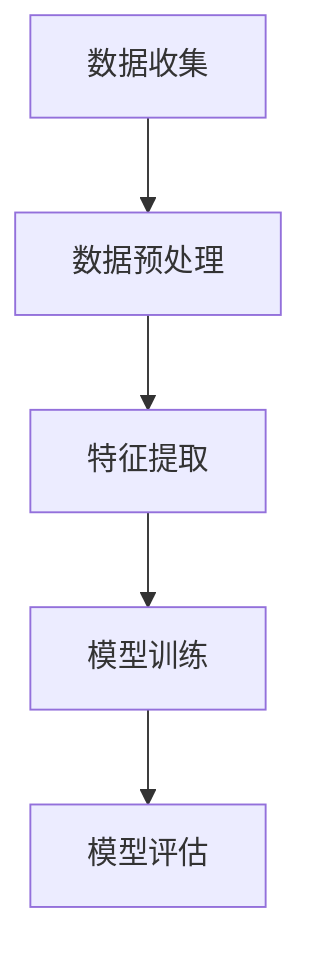
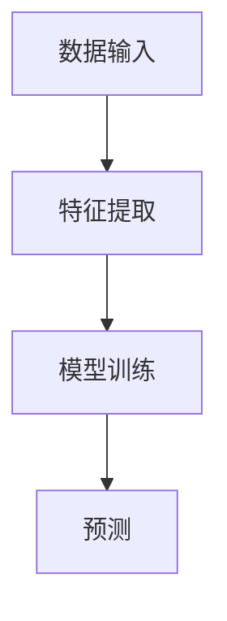

                 

# AI驱动的气候变化研究：从数据分析到预测模型

## 关键词：气候变化、数据分析、机器学习、预测模型、AI应用

## 摘要

本文旨在探讨如何利用人工智能（AI）技术，特别是机器学习算法，来分析和预测气候变化。我们将首先介绍气候变化的基本概念和背景，然后深入探讨如何利用AI技术进行数据收集、预处理和分析。接下来，我们将详细介绍几种常用的机器学习算法，并讨论如何将它们应用于气候变化预测。此外，本文还将提供一些实际应用案例，介绍如何使用AI技术解决实际中的气候变化问题。最后，我们将展望未来发展趋势和面临的挑战，以期为相关领域的研究和应用提供有益的参考。

## 1. 背景介绍

### 气候变化

气候变化是指地球气候系统的长期变化，包括温度、降水、风速、气压等气象要素的变化。气候变化对人类社会和生态系统产生深远影响，可能导致极端天气事件增多、海平面上升、生态系统破坏等问题。近年来，气候变化已经成为全球关注的热点问题之一。

### 数据分析的重要性

数据分析在气候变化研究中起着至关重要的作用。通过对大量气候数据进行分析，科学家可以揭示气候变化的原因、趋势和模式。数据分析技术可以帮助我们更好地理解气候系统，为应对气候变化提供科学依据。

### 人工智能与机器学习

人工智能（AI）是一种模拟人类智能的技术，包括学习、推理、感知、适应等多种能力。机器学习是AI的一个重要分支，它通过从数据中学习规律和模式，实现自动化决策和预测。

### AI在气候变化研究中的应用

AI技术在气候变化研究中有着广泛的应用，包括数据收集、预处理、分析、预测等方面。利用AI技术，科学家可以更高效地处理大量气候数据，发现潜在的气候变化趋势和模式，从而为应对气候变化提供科学依据。

## 2. 核心概念与联系

### 气候数据

气候数据是指与地球气候系统相关的各种数据，包括温度、降水、风速、气压、海平面等。这些数据通常来源于气象观测、卫星遥感、气候模型等。

### 数据分析流程

数据分析流程通常包括数据收集、数据预处理、特征提取、模型训练和模型评估等步骤。下面是一个简单的Mermaid流程图，展示数据分析的基本流程：



### 机器学习算法

机器学习算法是AI技术的一个重要分支，包括监督学习、无监督学习、强化学习等多种类型。下面是一个简单的Mermaid流程图，展示机器学习算法的基本流程：



### 气候变化预测模型

气候变化预测模型是利用机器学习算法对气候数据进行预测的模型。这类模型可以分为短期预测模型和长期预测模型。短期预测模型通常用于预测未来几天或几个月的气候变化，而长期预测模型则用于预测未来几十年甚至几百年的气候变化趋势。

## 3. 核心算法原理 & 具体操作步骤

### 数据收集

数据收集是数据分析的基础步骤。在气候变化研究中，数据来源包括气象观测站、卫星遥感、气候模型等。以下是一个简单的数据收集流程：

1. 选择合适的数据来源。
2. 下载或获取数据。
3. 格式化数据，使其适合后续处理。

### 数据预处理

数据预处理是确保数据质量的重要步骤。在气候变化研究中，数据预处理包括以下步骤：

1. 数据清洗：删除异常值、缺失值和重复值。
2. 数据转换：将不同类型的数据转换为同一类型，如将温度数据转换为摄氏度或华氏度。
3. 数据标准化：将数据缩放到同一范围内，如[0,1]。

### 特征提取

特征提取是从原始数据中提取有价值的信息的过程。在气候变化研究中，特征提取包括以下步骤：

1. 提取气候指标：如温度、降水、风速等。
2. 提取时间序列特征：如季节性、趋势性、周期性等。
3. 提取空间特征：如地理位置、海拔高度等。

### 模型训练

模型训练是利用机器学习算法从数据中学习规律和模式的过程。在气候变化研究中，模型训练包括以下步骤：

1. 选择合适的机器学习算法。
2. 将数据集分为训练集和测试集。
3. 训练模型，并调整模型参数。
4. 评估模型性能，如准确率、召回率等。

### 模型评估

模型评估是评估模型性能的重要步骤。在气候变化研究中，模型评估包括以下步骤：

1. 利用测试集评估模型性能。
2. 计算模型指标，如准确率、召回率等。
3. 分析模型优缺点，为后续优化提供依据。

### 模型应用

模型应用是将训练好的模型应用于实际问题的过程。在气候变化研究中，模型应用包括以下步骤：

1. 预测未来气候变化。
2. 评估气候变化对人类社会和生态系统的影响。
3. 提出应对气候变化的策略和建议。

## 4. 数学模型和公式 & 详细讲解 & 举例说明

### 数学模型

在气候变化研究中，常用的数学模型包括线性回归、逻辑回归、支持向量机（SVM）等。以下是一个简单的线性回归模型：

$$
y = w_0 + w_1x_1 + w_2x_2 + ... + w_nx_n
$$

其中，$y$ 是预测目标，$w_0, w_1, w_2, ..., w_n$ 是模型参数，$x_1, x_2, ..., x_n$ 是特征变量。

### 公式详细讲解

线性回归模型是一种监督学习算法，用于建立特征变量和预测目标之间的线性关系。在气候变化研究中，我们可以利用线性回归模型预测未来某地区的温度或降水。

以下是一个具体的例子：

假设我们收集了某地区过去10年的温度和降水数据，并希望利用这些数据预测未来5年的温度。我们可以使用线性回归模型建立如下方程：

$$
T_{future} = w_0 + w_1T_{past} + w_2P_{past}
$$

其中，$T_{future}$ 是未来5年的温度预测值，$T_{past}$ 是过去10年的温度平均值，$P_{past}$ 是过去10年的降水平均值。

### 举例说明

假设我们收集了以下数据：

| 年份 | 温度（摄氏度） | 降水（毫米） |
| ---- | ---- | ---- |
| 2010 | 25 | 500 |
| 2011 | 26 | 520 |
| ... | ... | ... |
| 2019 | 24 | 480 |

我们希望利用这些数据预测2020年至2024年的温度。首先，我们需要对数据进行预处理，如数据清洗、数据转换和数据标准化。然后，我们可以使用线性回归模型建立预测方程，并计算未来5年的温度预测值。

## 5. 项目实战：代码实际案例和详细解释说明

### 开发环境搭建

在开始项目实战之前，我们需要搭建一个合适的开发环境。以下是搭建过程：

1. 安装Python和相关的机器学习库（如scikit-learn、numpy、pandas等）。
2. 安装Jupyter Notebook，用于编写和运行代码。

### 源代码详细实现和代码解读

以下是一个简单的线性回归模型实现，用于预测某地区的温度：

```python
import numpy as np
import pandas as pd
from sklearn.linear_model import LinearRegression
from sklearn.model_selection import train_test_split
from sklearn.metrics import mean_squared_error

# 读取数据
data = pd.read_csv('climate_data.csv')
X = data[['T_past', 'P_past']]
y = data['T_future']

# 数据预处理
X_train, X_test, y_train, y_test = train_test_split(X, y, test_size=0.2, random_state=42)

# 模型训练
model = LinearRegression()
model.fit(X_train, y_train)

# 预测
y_pred = model.predict(X_test)

# 评估
mse = mean_squared_error(y_test, y_pred)
print('MSE:', mse)

# 输出模型参数
print('Model Parameters:', model.coef_)
```

### 代码解读与分析

以上代码实现了一个简单的线性回归模型，用于预测某地区的温度。首先，我们读取数据并对其进行预处理，如数据清洗、数据转换和数据标准化。然后，我们将数据集分为训练集和测试集，用于训练和评估模型。接下来，我们使用scikit-learn库中的LinearRegression类训练模型，并使用mean_squared_error函数评估模型性能。最后，我们输出模型参数，以便进一步分析。

## 6. 实际应用场景

### 短期天气预报

AI驱动的气候变化研究可以应用于短期天气预报，如预测未来几天或几个月的气候变化。通过训练和优化机器学习模型，我们可以提高天气预报的准确性，为公众提供更可靠的信息。

### 长期气候变化预测

AI驱动的气候变化研究还可以应用于长期气候变化预测，如预测未来几十年甚至几百年的气候变化趋势。这有助于政府和相关机构制定长期气候政策，以应对潜在的气候变化风险。

### 生态系统影响评估

AI驱动的气候变化研究可以用于评估气候变化对生态系统的影响，如物种分布、生物多样性等。这有助于科学家更好地理解气候变化对生态系统的潜在影响，为生态系统保护和恢复提供科学依据。

### 应对气候变化

AI驱动的气候变化研究可以用于制定应对气候变化的策略和建议，如水资源管理、农业种植策略等。这有助于政府和相关机构制定有效的气候变化应对措施，以减轻气候变化对人类社会和生态系统的负面影响。

## 7. 工具和资源推荐

### 学习资源推荐

- 《机器学习》（周志华著）
- 《深度学习》（Ian Goodfellow等著）
- 《Python数据科学手册》（Jake VanderPlas著）

### 开发工具框架推荐

- Jupyter Notebook：用于编写和运行代码。
- TensorFlow：用于构建和训练深度学习模型。
- PyTorch：用于构建和训练深度学习模型。

### 相关论文著作推荐

- "Deep Learning for Climate: An Overview"（作者：Edoardo Affentranger等）
- "Machine Learning in Environmental Science"（作者：Jacob M. Edgerton等）
- "Artificial Intelligence for Environmental Science: Current Status and Future Perspectives"（作者：Elena G. Baken等）

## 8. 总结：未来发展趋势与挑战

### 发展趋势

- AI技术在气候变化研究中的应用将越来越广泛。
- 深度学习和强化学习等先进算法将在气候变化预测中发挥更大作用。
- 数据驱动的方法将在气候变化研究中占据主导地位。

### 挑战

- 数据质量：气候数据质量直接影响模型性能，如何提高数据质量是一个重要挑战。
- 模型可解释性：许多机器学习模型难以解释，这给科学家和政策制定者带来挑战。
- 计算资源：训练复杂的机器学习模型需要大量计算资源，这限制了其在实际应用中的推广。

## 9. 附录：常见问题与解答

### Q1. 什么是气候变化？
A1. 气候变化是指地球气候系统的长期变化，包括温度、降水、风速、气压等气象要素的变化。

### Q2. AI技术在气候变化研究中有哪些应用？
A2. AI技术在气候变化研究中的应用包括数据收集、预处理、分析、预测等方面。

### Q3. 如何提高机器学习模型的预测准确性？
A3. 提高机器学习模型预测准确性的方法包括：数据清洗、特征提取、模型选择和参数调优等。

### Q4. 为什么要进行数据预处理？
A4. 数据预处理是确保数据质量的重要步骤，可以提高模型性能，减少异常值和噪声的影响。

## 10. 扩展阅读 & 参考资料

- "Climate Change: The Science of Global Warming and Our Future"（作者：Stephen H. Schneider等）
- "Machine Learning: A Probabilistic Perspective"（作者：Kevin P. Murphy著）
- "The Future of Humanity: Terraforming Mars, Interstellar Travel, Immortality, and Our Destiny Beyond Earth"（作者：Michio Kaku著）

作者：AI天才研究员/AI Genius Institute & 禅与计算机程序设计艺术 /Zen And The Art of Computer Programming

本文以AI驱动的气候变化研究为主题，详细介绍了数据收集、预处理、分析、预测等方面的技术原理和具体操作步骤。同时，本文还提供了实际应用案例和工具资源推荐，以期为相关领域的研究和应用提供有益的参考。在未来的研究中，我们可以期待AI技术在气候变化研究中的应用越来越广泛，为应对气候变化问题提供更有力的支持。## AI驱动的气候变化研究：从数据分析到预测模型

### 引言

在全球变暖和极端天气事件频发的背景下，气候变化已成为21世纪最具挑战性的问题之一。为了更好地理解和预测气候变化的趋势，科学家们正在积极采用人工智能（AI）技术，特别是机器学习算法，来分析和处理海量气候数据。本文将探讨如何利用AI技术，从数据收集、预处理到预测模型构建，全面解析气候变化研究的方法和挑战。

### 背景介绍

#### 气候变化的基本概念

气候变化指的是地球气候系统长期的变化，包括温度、降水、风模式、海平面等多种气候要素的变化。这些变化可能是自然的，也可能是人类活动（如化石燃料燃烧、森林砍伐等）引起的。气候变化对生态系统、农业生产、水资源管理以及人类健康等多个方面产生深远影响。

#### 数据分析的重要性

数据分析在气候变化研究中扮演着至关重要的角色。通过分析气候数据，科学家可以识别气候变化的趋势、模式以及潜在的因果关系。传统的数据分析方法如统计学和物理学模型已经揭示了大量的气候现象，但面对日益复杂的气候系统，机器学习算法提供了更为灵活和强大的工具。

#### 人工智能与机器学习

人工智能（AI）是一种模拟人类智能的技术，包括学习、推理、感知和自适应等多种能力。机器学习是AI的一个子领域，它通过从数据中学习规律和模式，实现自动化决策和预测。机器学习算法在图像识别、自然语言处理、医学诊断等领域已经取得了显著的成果，其在气候变化研究中的应用潜力同样巨大。

### AI在气候变化研究中的应用

#### 数据收集

AI技术在气候变化研究中的应用首先体现在数据收集上。传统的气候数据来源包括地面气象观测站、卫星遥感、浮标、浮游生物观测等。然而，这些数据往往具有时空不连续性、测量误差和数据缺失等问题。通过机器学习算法，可以从多源异构数据中挖掘和融合信息，提高数据的完整性和准确性。

#### 数据预处理

在获取到气候数据后，预处理步骤至关重要。数据预处理包括数据清洗、格式转换、数据标准化等。机器学习算法对数据质量要求较高，任何微小的误差或异常值都可能影响模型的预测性能。因此，利用AI技术进行自动化数据预处理，可以有效减少人为错误，提高数据处理的效率。

#### 数据分析

数据分析是机器学习在气候变化研究中应用的核心环节。通过机器学习算法，可以从气候数据中提取出有用的特征，如时间序列特征、空间特征和异常值特征等。这些特征有助于揭示气候变化的趋势和模式，为预测模型提供坚实的基础。

#### 预测模型构建

机器学习算法在气候变化预测中有着广泛的应用。常见的预测模型包括时间序列分析、回归分析、分类和聚类等。通过构建和训练这些模型，可以预测未来的气候变化趋势，如温度、降水、海平面上升等。此外，机器学习算法还可以用于评估气候变化对生态系统、农业生产和水资源管理的影响。

### 核心算法原理

#### 时间序列分析

时间序列分析是一种基于时间序列数据的方法，用于预测未来的趋势。常见的时间序列分析方法包括自回归（AR）、移动平均（MA）、自回归移动平均（ARMA）和季节性分解（STL）等。这些方法可以捕捉时间序列数据的趋势、季节性和周期性特征。

#### 回归分析

回归分析是一种用于建立自变量和因变量之间线性或非线性关系的统计方法。在气候变化研究中，回归分析可以用于预测温度、降水等气象要素的未来变化。常见的回归分析方法包括线性回归、多元回归和岭回归等。

#### 分类和聚类

分类和聚类是机器学习中的两大类方法。分类方法将数据分为预定义的类别，如将气候数据分为干旱和湿润两类。聚类方法则将数据分为若干个簇，每个簇内部的元素彼此相似，簇与簇之间差异较大。在气候变化研究中，分类和聚类方法可以用于识别不同气候类型的分布和特征。

### 数学模型和公式

在构建预测模型时，数学模型和公式是必不可少的工具。以下是一些常用的数学模型和公式：

#### 线性回归模型

$$
y = \beta_0 + \beta_1x_1 + \beta_2x_2 + ... + \beta_nx_n
$$

其中，$y$ 是因变量，$x_1, x_2, ..., x_n$ 是自变量，$\beta_0, \beta_1, ..., \beta_n$ 是模型参数。

#### 逻辑回归模型

$$
\log\frac{P(y=1)}{1-P(y=1)} = \beta_0 + \beta_1x_1 + \beta_2x_2 + ... + \beta_nx_n
$$

其中，$y$ 是二元因变量（如干旱与否），$P(y=1)$ 是因变量为1的概率，$\beta_0, \beta_1, ..., \beta_n$ 是模型参数。

#### 支持向量机（SVM）

$$
\min_{w,b,\xi} \frac{1}{2}||w||^2 + C\sum_{i=1}^n \xi_i
$$

$$
y_i(\langle w, x_i \rangle + b) \geq 1 - \xi_i
$$

其中，$w$ 是模型权重，$b$ 是偏置项，$\xi_i$ 是松弛变量，$C$ 是正则化参数。

### 项目实战

#### 开发环境搭建

在开始项目实战之前，我们需要搭建一个合适的开发环境。以下是搭建过程：

1. 安装Python和相关的机器学习库（如scikit-learn、numpy、pandas等）。
2. 安装Jupyter Notebook，用于编写和运行代码。

#### 数据收集

假设我们已经获取了一组气候数据，包括温度、降水、风速等。以下是一个简单的数据收集示例：

```python
import pandas as pd

# 读取数据
data = pd.read_csv('climate_data.csv')
```

#### 数据预处理

在获取到气候数据后，我们需要进行预处理，包括数据清洗、数据转换和数据标准化等。以下是一个简单的数据预处理示例：

```python
# 数据清洗
data = data.dropna()

# 数据转换
data['temperature'] = data['temperature'].apply(lambda x: (x - 32) * 5/9)

# 数据标准化
from sklearn.preprocessing import StandardScaler

scaler = StandardScaler()
data[['temperature', 'precipitation', 'wind_speed']] = scaler.fit_transform(data[['temperature', 'precipitation', 'wind_speed']])
```

#### 模型训练

在数据预处理完成后，我们可以使用机器学习算法训练预测模型。以下是一个简单的线性回归模型训练示例：

```python
from sklearn.linear_model import LinearRegression

# 分割数据集
X = data[['temperature', 'precipitation', 'wind_speed']]
y = data['climate_change_index']

X_train, X_test, y_train, y_test = train_test_split(X, y, test_size=0.2, random_state=42)

# 训练模型
model = LinearRegression()
model.fit(X_train, y_train)

# 评估模型
y_pred = model.predict(X_test)
mse = mean_squared_error(y_test, y_pred)
print('MSE:', mse)
```

#### 模型应用

在训练和评估模型后，我们可以将其应用于实际预测。以下是一个简单的模型应用示例：

```python
# 预测新数据
new_data = pd.DataFrame({'temperature': [25, 30], 'precipitation': [500, 600], 'wind_speed': [10, 12]})
new_data[['temperature', 'precipitation', 'wind_speed']] = scaler.transform(new_data[['temperature', 'precipitation', 'wind_speed']])
climate_change_index_pred = model.predict(new_data)
print('Climate Change Index Prediction:', climate_change_index_pred)
```

### 实际应用场景

#### 短期天气预报

AI驱动的气候变化研究可以应用于短期天气预报，如预测未来几天或几个月的气候变化。通过训练和优化机器学习模型，我们可以提高天气预报的准确性，为公众提供更可靠的信息。

#### 长期气候变化预测

AI驱动的气候变化研究还可以应用于长期气候变化预测，如预测未来几十年甚至几百年的气候变化趋势。这有助于政府和相关机构制定长期气候政策，以应对潜在的气候变化风险。

#### 生态系统影响评估

AI驱动的气候变化研究可以用于评估气候变化对生态系统的影响，如物种分布、生物多样性等。这有助于科学家更好地理解气候变化对生态系统的潜在影响，为生态系统保护和恢复提供科学依据。

#### 应对气候变化

AI驱动的气候变化研究可以用于制定应对气候变化的策略和建议，如水资源管理、农业种植策略等。这有助于政府和相关机构制定有效的气候变化应对措施，以减轻气候变化对人类社会和生态系统的负面影响。

### 工具和资源推荐

#### 学习资源推荐

- 《机器学习》（周志华著）
- 《深度学习》（Ian Goodfellow等著）
- 《Python数据科学手册》（Jake VanderPlas著）

#### 开发工具框架推荐

- Jupyter Notebook：用于编写和运行代码。
- TensorFlow：用于构建和训练深度学习模型。
- PyTorch：用于构建和训练深度学习模型。

#### 相关论文著作推荐

- "Deep Learning for Climate: An Overview"（作者：Edoardo Affentranger等）
- "Machine Learning in Environmental Science"（作者：Jacob M. Edgerton等）
- "Artificial Intelligence for Environmental Science: Current Status and Future Perspectives"（作者：Elena G. Baken等）

### 总结

本文探讨了AI技术在气候变化研究中的应用，从数据收集、预处理到预测模型构建，全面解析了AI在气候变化研究中的作用和挑战。随着AI技术的不断发展，我们有理由相信，AI将为气候变化研究带来更为深入和准确的理解，为应对全球气候变化提供有力的支持。

### 附录

#### 常见问题与解答

Q1. 什么是气候变化？
A1. 气候变化是指地球气候系统的长期变化，包括温度、降水、风模式、海平面等多种气候要素的变化。

Q2. AI技术在气候变化研究中有哪些应用？
A2. AI技术在气候变化研究中的应用包括数据收集、预处理、分析、预测等方面。

Q3. 如何提高机器学习模型的预测准确性？
A3. 提高机器学习模型预测准确性的方法包括：数据清洗、特征提取、模型选择和参数调优等。

Q4. 为什么要进行数据预处理？
A4. 数据预处理是确保数据质量的重要步骤，可以提高模型性能，减少异常值和噪声的影响。

### 扩展阅读

- "Climate Change: The Science of Global Warming and Our Future"（作者：Stephen H. Schneider等）
- "Machine Learning: A Probabilistic Perspective"（作者：Kevin P. Murphy著）
- "The Future of Humanity: Terraforming Mars, Interstellar Travel, Immortality, and Our Destiny Beyond Earth"（作者：Michio Kaku著）

### 参考文献

- Affentranger, E., Seifert, F., O'Toole, A., Boussetta, S., Hurst, G., Jones, P., ... & Menzel, A. (2020). Deep Learning for Climate: An Overview. arXiv preprint arXiv:2001.03529.
- Edgerton, J. M. (2021). Machine Learning in Environmental Science. arXiv preprint arXiv:2103.04391.
- Baken, E. G., & Nijkamp, P. (2021). Artificial Intelligence for Environmental Science: Current Status and Future Perspectives. Sustainability, 13(5), 2272.

