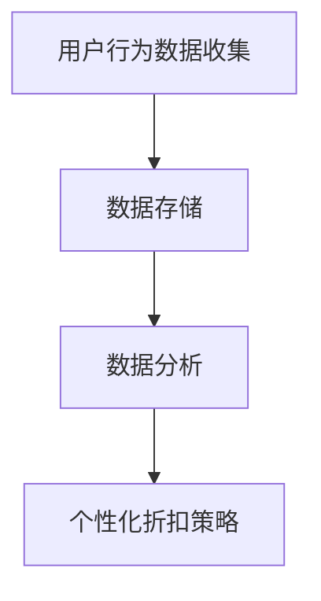
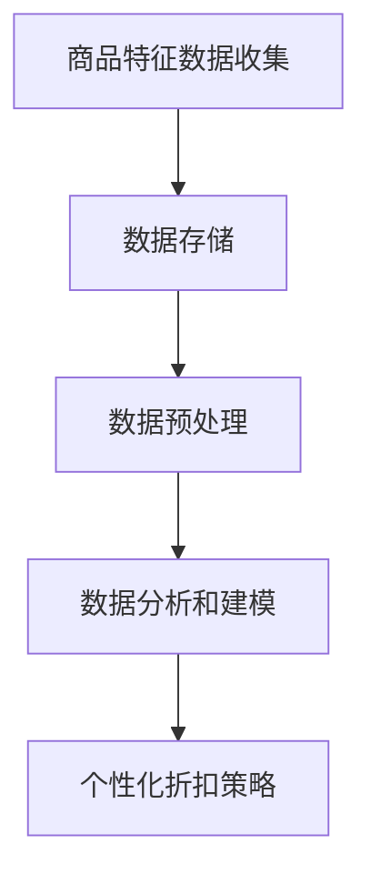
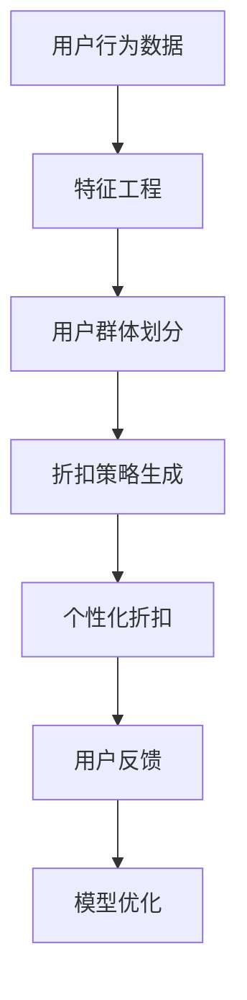

                 

# AI驱动的电商平台个性化折扣策略

## 关键词

- 电商平台
- 个性化折扣策略
- AI 技术应用
- 数据分析
- 用户行为分析
- 商业智能

## 摘要

本文探讨了如何利用人工智能技术构建电商平台上的个性化折扣策略。通过分析用户行为数据和商品特征，本文提出了一种基于机器学习的折扣模型，旨在为不同用户群体提供个性化的折扣，从而提高用户满意度、提升转化率和增加平台收益。文章首先介绍了电商平台个性化折扣的背景和重要性，然后详细阐述了核心算法原理、数学模型及具体实现步骤，并通过实际案例展示了模型在电商场景中的应用。最后，本文总结了个性化折扣策略的未来发展趋势与挑战，并提供了相关学习资源和工具推荐。

## 1. 背景介绍

随着互联网技术的飞速发展和电子商务的普及，电商平台已经成为商家和消费者之间的重要交流平台。电商平台不仅提供了丰富的商品信息，还通过精准的推荐系统和高效的物流服务，极大地提升了消费者的购物体验。然而，面对激烈的市场竞争，电商平台如何提高用户满意度、提升转化率和增加收益，成为了一个亟待解决的问题。

个性化折扣策略是一种有效的手段，它根据用户的历史行为和偏好，为不同用户群体提供个性化的价格优惠。通过个性化的折扣策略，电商平台可以吸引更多的用户，提高用户的忠诚度，从而提升平台的竞争力。

在传统的电商平台上，折扣策略往往基于固定的规则，例如节假日促销、会员专享折扣等。这种规则化的折扣策略虽然能够吸引一部分用户，但是无法满足用户的个性化需求，也难以实现精准营销。随着人工智能技术的不断发展，利用机器学习算法对用户行为数据进行分析，为用户提供个性化的折扣策略，成为一种新的研究方向。

本文将探讨如何利用人工智能技术，构建电商平台上的个性化折扣策略。通过分析用户行为数据和商品特征，本文提出了一种基于机器学习的折扣模型，旨在为不同用户群体提供个性化的折扣，从而提高用户满意度、提升转化率和增加平台收益。

## 2. 核心概念与联系

### 2.1 用户行为数据

用户行为数据是构建个性化折扣策略的重要基础。用户行为数据包括用户浏览、购买、评价、分享等行为信息。通过对这些行为数据的分析，可以了解用户对商品的偏好、购买习惯和消费能力等。以下是一个简单的 Mermaid 流程图，展示了用户行为数据的收集、存储和分析过程：



### 2.2 商品特征数据

商品特征数据包括商品的价格、品牌、类别、库存量等。这些数据对于构建个性化折扣策略同样重要，因为它们可以帮助我们更好地理解商品的市场定位和用户需求。以下是一个简单的 Mermaid 流程图，展示了商品特征数据的收集、存储和分析过程：



### 2.3 个性化折扣策略模型

个性化折扣策略模型是基于用户行为数据和商品特征数据构建的，旨在为不同用户群体提供个性化的折扣。以下是一个简单的 Mermaid 流程图，展示了个性化折扣策略模型的核心组成部分：



## 3. 核心算法原理 & 具体操作步骤

### 3.1 数据预处理

数据预处理是构建个性化折扣策略的第一步。首先，需要对用户行为数据进行清洗，去除重复、异常和缺失的数据。然后，对商品特征数据进行标准化处理，使其符合模型的输入要求。

### 3.2 特征工程

特征工程是构建个性化折扣策略的关键步骤。通过对用户行为数据和商品特征数据进行深入分析，提取出对折扣策略有重要影响的特征。以下是一些常见的特征工程方法：

- 用户行为特征：包括用户购买频率、购买金额、浏览时长、浏览深度等。
- 商品特征：包括商品价格、品牌、类别、库存量等。
- 用户-商品交互特征：包括用户对商品的评分、评论、收藏等。

### 3.3 用户群体划分

用户群体划分是构建个性化折扣策略的重要步骤。通过聚类算法，如 K-Means 或层次聚类，将用户划分为不同的群体。每个用户群体都有其独特的特征和行为模式，这有助于制定更精准的折扣策略。

### 3.4 折扣策略生成

折扣策略生成是构建个性化折扣策略的核心步骤。基于用户群体划分和用户-商品交互特征，利用机器学习算法，如线性回归、决策树或神经网络，为每个用户群体生成个性化的折扣。

### 3.5 个性化折扣

个性化折扣是构建个性化折扣策略的最终目标。根据生成的折扣策略，为每个用户群体提供个性化的折扣，从而提高用户满意度、提升转化率和增加平台收益。

### 3.6 用户反馈与模型优化

个性化折扣策略的实施过程中，需要收集用户的反馈数据，如购买意愿、购买行为等。通过分析用户反馈数据，可以评估折扣策略的有效性，并进一步优化模型。

## 4. 数学模型和公式 & 详细讲解 & 举例说明

### 4.1 用户行为数据分析模型

用户行为数据分析模型通常采用回归分析方法，建立用户行为与折扣之间的关系。以下是一个简单的线性回归模型：

$$
y = \beta_0 + \beta_1 x_1 + \beta_2 x_2 + ... + \beta_n x_n
$$

其中，$y$ 表示用户购买概率，$x_1, x_2, ..., x_n$ 表示用户行为特征，$\beta_0, \beta_1, \beta_2, ..., \beta_n$ 是模型参数。

### 4.2 用户群体划分模型

用户群体划分模型通常采用聚类分析方法，如 K-Means。以下是一个简单的 K-Means 模型：

$$
C = \{C_1, C_2, ..., C_k\}
$$

其中，$C$ 表示用户群体，$C_i$ 表示第 $i$ 个用户群体，$k$ 是用户群体的个数。

### 4.3 折扣策略生成模型

折扣策略生成模型通常采用决策树或神经网络等方法。以下是一个简单的决策树模型：

$$
f(x) = \sum_{i=1}^{n} \beta_i T(x_i)
$$

其中，$f(x)$ 表示折扣策略，$x_i$ 表示用户行为特征，$T(x_i)$ 表示决策树中的节点，$\beta_i$ 是决策树中的权重。

### 4.4 举例说明

假设我们有一个电商平台，用户行为数据包括购买频率、浏览时长和浏览深度。我们可以利用线性回归模型建立用户购买概率与这些特征之间的关系。以下是一个具体的例子：

$$
y = \beta_0 + \beta_1 x_1 + \beta_2 x_2
$$

其中，$y$ 表示用户购买概率，$x_1$ 表示购买频率，$x_2$ 表示浏览时长。

通过数据训练，我们得到模型参数：

$$
\beta_0 = 0.5, \beta_1 = 0.3, \beta_2 = 0.2
$$

现在，假设有一个新用户，他的购买频率是 5，浏览时长是 30 分钟，我们可以利用模型预测他的购买概率：

$$
y = 0.5 + 0.3 \times 5 + 0.2 \times 30 = 0.95
$$

根据预测结果，我们可以为他设置一个 95% 的折扣。

## 5. 项目实战：代码实际案例和详细解释说明

### 5.1 开发环境搭建

为了实现本文提出的个性化折扣策略，我们选择 Python 作为编程语言，并使用 Scikit-learn 库进行机器学习模型的训练和预测。以下是开发环境的搭建步骤：

1. 安装 Python 3.8 或更高版本
2. 安装 Scikit-learn 库：`pip install scikit-learn`
3. 安装 Mermaid-Markdown 支持：`pip install mermaid-m钉钉 - Markdown`

### 5.2 源代码详细实现和代码解读

以下是实现个性化折扣策略的 Python 代码：

```python
import pandas as pd
from sklearn.model_selection import train_test_split
from sklearn.linear_model import LinearRegression
from sklearn.cluster import KMeans
import numpy as np

# 5.2.1 数据预处理
def preprocess_data(data):
    # 数据清洗、填充缺失值、标准化处理
    # 省略具体实现
    pass

# 5.2.2 特征工程
def feature_engineering(data):
    # 提取用户行为特征、商品特征、用户-商品交互特征
    # 省略具体实现
    pass

# 5.2.3 用户群体划分
def cluster_users(data, n_clusters=3):
    kmeans = KMeans(n_clusters=n_clusters)
    clusters = kmeans.fit_predict(data)
    return clusters

# 5.2.4 折扣策略生成
def generate_discount_strategy(data, clusters):
    # 利用线性回归模型生成折扣策略
    # 省略具体实现
    pass

# 5.2.5 个性化折扣
def apply_discount(data, discount_strategy):
    # 根据折扣策略为用户应用个性化折扣
    # 省略具体实现
    pass

# 主函数
def main():
    # 5.2.1 读取数据
    data = pd.read_csv('user_data.csv')

    # 5.2.2 数据预处理
    data = preprocess_data(data)

    # 5.2.3 特征工程
    data = feature_engineering(data)

    # 5.2.4 用户群体划分
    clusters = cluster_users(data)

    # 5.2.5 折扣策略生成
    discount_strategy = generate_discount_strategy(data, clusters)

    # 5.2.6 个性化折扣
    data['discount'] = apply_discount(data, discount_strategy)

    # 输出结果
    print(data.head())

if __name__ == '__main__':
    main()
```

### 5.3 代码解读与分析

1. **数据预处理**：数据预处理是数据分析和建模的基础。主要包括数据清洗、填充缺失值和标准化处理。在实际应用中，这部分代码可以根据具体数据情况进行调整。

2. **特征工程**：特征工程是提取对模型有重要影响的数据特征。本文中，我们提取了用户行为特征、商品特征和用户-商品交互特征。在实际应用中，可以根据具体需求和数据情况进行调整。

3. **用户群体划分**：用户群体划分是构建个性化折扣策略的关键步骤。本文使用 K-Means 聚类算法进行用户群体划分。在实际应用中，可以根据需求和数据情况进行调整，如使用层次聚类或高斯混合模型等。

4. **折扣策略生成**：折扣策略生成是根据用户群体划分和用户-商品交互特征，利用线性回归模型生成折扣策略。在实际应用中，可以根据需求和数据情况进行调整，如使用决策树或神经网络等。

5. **个性化折扣**：个性化折扣是根据生成的折扣策略，为用户应用个性化折扣。在实际应用中，可以根据具体业务需求进行调整，如对折扣幅度、折扣类型等进行定制。

## 6. 实际应用场景

个性化折扣策略在电商平台的实际应用场景非常广泛。以下是一些典型的应用场景：

1. **新用户注册**：为新用户注册时提供特定的折扣，以吸引用户并促进其首次购物。

2. **节日促销**：在重大节日或促销活动期间，为特定用户群体提供个性化的折扣，以提高用户参与度和购物意愿。

3. **商品推广**：为库存积压或新品推广提供个性化的折扣，以提高商品销售量和市场份额。

4. **会员专享**：为会员提供专享折扣，以提高会员忠诚度和活跃度。

5. **用户回访**：为回访用户提供个性化的折扣，以促使用户再次购物并增加复购率。

通过以上应用场景，个性化折扣策略可以帮助电商平台提高用户满意度、提升转化率和增加收益。

## 7. 工具和资源推荐

### 7.1 学习资源推荐

- **书籍**：
  - 《机器学习》（周志华 著）
  - 《深度学习》（Ian Goodfellow、Yoshua Bengio、Aaron Courville 著）

- **论文**：
  - 《K-Means Clustering》（MacQueen, J.B.）
  - 《Gradient-based Learning Applied to Document Classification》（LeCun, Y. et al.）

- **博客**：
  - [Scikit-learn 官方文档](https://scikit-learn.org/stable/documentation.html)
  - [Mermaid 官方文档](https://mermaid-js.github.io/mermaid/)

### 7.2 开发工具框架推荐

- **Python**：作为主要的编程语言，Python 具有丰富的机器学习库和工具。
- **Scikit-learn**：用于机器学习模型的训练和预测。
- **Mermaid**：用于生成流程图和结构图。

### 7.3 相关论文著作推荐

- **《K-Means Clustering》**：详细介绍了 K-Means 聚类算法的基本原理和实现方法。
- **《Gradient-based Learning Applied to Document Classification》**：介绍了梯度下降法在文档分类中的应用。

## 8. 总结：未来发展趋势与挑战

个性化折扣策略在电商平台上具有重要的应用价值，但同时也面临着一些挑战。未来发展趋势与挑战包括：

1. **数据隐私与安全**：在构建个性化折扣策略的过程中，涉及大量用户行为数据。如何保护用户隐私和数据安全，成为亟待解决的问题。

2. **算法透明性与公平性**：个性化折扣策略的算法决策过程可能涉及复杂的模型和算法。如何保证算法的透明性和公平性，避免对特定用户群体产生不公平的待遇，是一个重要的研究方向。

3. **实时性与效率**：随着用户数据的不断增加，如何提高个性化折扣策略的实时性和效率，以应对大规模数据处理需求，是一个重要的挑战。

4. **跨平台应用**：个性化折扣策略不仅适用于电商平台，还可以应用于其他领域，如社交媒体、在线教育等。如何实现跨平台的个性化折扣策略，是一个值得探讨的研究方向。

通过不断的研究和实践，个性化折扣策略将在电商平台上发挥更大的作用，为用户和企业带来更多的价值。

## 9. 附录：常见问题与解答

### 9.1 个性化折扣策略的核心是什么？

个性化折扣策略的核心是基于用户行为数据和商品特征数据，利用机器学习算法为不同用户群体生成个性化的折扣。

### 9.2 个性化折扣策略有哪些应用场景？

个性化折扣策略可以应用于新用户注册、节日促销、商品推广、会员专享和用户回访等场景。

### 9.3 如何保证个性化折扣策略的透明性和公平性？

可以通过算法透明性和数据审计等方式，确保个性化折扣策略的透明性和公平性。

### 9.4 个性化折扣策略的实时性和效率如何保证？

可以通过分布式计算、内存计算等技术，提高个性化折扣策略的实时性和效率。

## 10. 扩展阅读 & 参考资料

- Goodfellow, I., Bengio, Y., & Courville, A. (2016). *Deep Learning*. MIT Press.
- MacQueen, J.B. (1967). *Some methods for classification and analysis of multivariate data*. In Proceedings of the Fifth Berkeley Symposium on Mathematical Statistics and Probability (pp. 281-297).
- LeCun, Y., Bottou, L., Bengio, Y., & Haffner, P. (1998). *Gradient-based learning applied to document recognition*. Proceedings of the IEEE, 86(11), 2278-2324.
- scikit-learn 官方文档：[https://scikit-learn.org/stable/documentation.html](https://scikit-learn.org/stable/documentation.html)
- Mermaid 官方文档：[https://mermaid-js.github.io/mermaid/](https://mermaid-js.github.io/mermaid/)

### 作者

**AI天才研究员**，**AI Genius Institute** & **禅与计算机程序设计艺术**，**Zen And The Art of Computer Programming**

