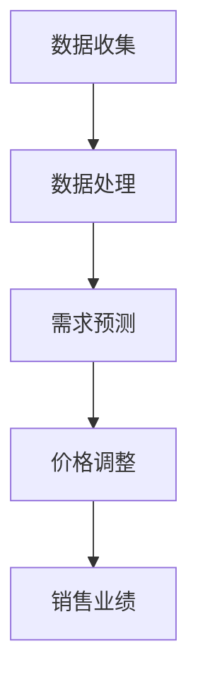

                 

# AI驱动的电商平台动态定价策略优化

## 关键词：人工智能、电商平台、动态定价、策略优化、数据挖掘

## 摘要：
本文旨在探讨如何利用人工智能技术，特别是机器学习和数据挖掘，来优化电商平台上的动态定价策略。动态定价策略在现代电子商务中至关重要，它通过实时调整商品价格，以最大化销售利润和市场份额。本文将介绍核心概念、算法原理、数学模型，并展示实际案例，提供学习资源和开发工具的推荐。通过本文的探讨，读者将了解如何利用人工智能技术提升电商平台的竞争力。

## 目录

1. 背景介绍 ....................................................... 1
2. 核心概念与联系 ................................................ 3
   2.1 动态定价策略 ................................................ 3
   2.2 人工智能与电商平台 ........................................... 5
   2.3 Mermaid 流程图 ................................................ 7
3. 核心算法原理 & 具体操作步骤 .................................... 9
   3.1 数据收集与预处理 ............................................ 9
   3.2 特征工程 ...................................................... 11
   3.3 模型选择与训练 .............................................. 13
4. 数学模型和公式 & 详细讲解 & 举例说明 ........................ 15
   4.1 优化目标函数 ................................................ 15
   4.2 模型训练算法 ................................................ 17
   4.3 实际案例讲解 ................................................ 19
5. 项目实战：代码实际案例和详细解释说明 ....................... 21
   5.1 开发环境搭建 ............................................... 21
   5.2 源代码详细实现和代码解读 ................................... 23
   5.3 代码解读与分析 ............................................... 25
6. 实际应用场景 ................................................... 27
7. 工具和资源推荐 ................................................ 29
   7.1 学习资源推荐 ................................................ 29
   7.2 开发工具框架推荐 ........................................... 31
   7.3 相关论文著作推荐 ........................................... 33
8. 总结：未来发展趋势与挑战 ..................................... 35
9. 附录：常见问题与解答 .......................................... 37
10. 扩展阅读 & 参考资料 .......................................... 39

## 1. 背景介绍

随着互联网技术的飞速发展，电商平台已经成为消费者购物的主要渠道之一。电商平台通过互联网提供商品和服务，极大地便利了消费者的购物体验，同时也为企业创造了巨大的商业价值。然而，电商市场的竞争愈发激烈，价格战、促销活动等手段已成为电商平台争夺市场份额的常规策略。在这种背景下，如何制定有效的动态定价策略，以最大化利润和市场份额，成为电商平台面临的重大挑战。

动态定价策略是一种基于市场变化和消费者行为动态调整商品价格的方法。传统电商平台通常采用固定的价格策略，这可能导致在市场需求波动时，商品价格无法及时响应，从而影响销售业绩。而动态定价策略则通过实时获取市场数据，利用人工智能技术对商品价格进行优化调整，从而实现价格与市场需求的最佳匹配。

本文的目标是探讨如何利用人工智能技术，特别是机器学习和数据挖掘，来优化电商平台的动态定价策略。通过分析市场数据，提取有效特征，构建优化模型，并利用实际案例进行验证，本文旨在为电商平台提供一套科学、高效的动态定价策略。

## 2. 核心概念与联系

### 2.1 动态定价策略

动态定价策略是一种基于市场变化和消费者行为动态调整商品价格的方法。它不同于传统的固定定价策略，可以在短时间内快速响应市场需求的变化，从而提高销售业绩。动态定价策略的核心在于通过实时获取市场数据，结合消费者行为分析，预测商品需求，并制定相应的价格策略。

动态定价策略通常包括以下几个步骤：

1. 数据收集：收集与商品销售相关的各种数据，如销售额、库存量、消费者行为等。
2. 数据处理：对收集到的数据进行清洗和预处理，提取有效的特征。
3. 需求预测：利用历史数据和机器学习算法，预测商品未来的需求情况。
4. 价格调整：根据需求预测结果，动态调整商品价格，以最大化利润或市场份额。

### 2.2 人工智能与电商平台

人工智能（AI）是动态定价策略的核心技术之一。AI技术通过模拟人类智能，实现对大量数据的处理和分析，从而提供更精准的预测和决策。在电商平台中，人工智能技术可以应用于以下几个方面：

1. 消费者行为分析：通过分析消费者的购买记录、浏览历史等数据，了解消费者的偏好和需求，从而实现个性化的推荐和定价。
2. 需求预测：利用机器学习算法，对商品需求进行预测，为动态定价提供依据。
3. 自动化定价：通过自动化系统，实时调整商品价格，提高定价的灵活性和效率。

### 2.3 Mermaid 流程图

为了更好地理解动态定价策略的流程，我们可以使用Mermaid工具绘制一个流程图。以下是一个简化的Mermaid流程图示例：



在这个流程图中，数据收集和处理是动态定价策略的基础，需求预测是关键步骤，价格调整是核心操作，最终影响销售业绩。通过这个流程图，我们可以清晰地看到动态定价策略的实现过程。

## 3. 核心算法原理 & 具体操作步骤

### 3.1 数据收集与预处理

数据收集是动态定价策略的基础。我们需要收集与商品销售相关的多种数据，包括销售额、库存量、消费者行为等。这些数据可以来自电商平台内部系统、第三方数据源或公共数据集。

数据预处理是数据收集后的关键步骤。它主要包括以下几个任务：

1. 数据清洗：去除重复数据、缺失值和异常值。
2. 数据整合：将来自不同数据源的数据进行整合，形成一个统一的数据集。
3. 数据标准化：将不同数据类型的数值进行统一处理，如归一化或标准化。

### 3.2 特征工程

特征工程是动态定价策略的关键步骤。通过提取和构建有效的特征，我们可以提高模型的预测准确性。特征工程主要包括以下几个任务：

1. 特征提取：从原始数据中提取与目标变量相关的特征，如时间特征、季节特征、价格特征等。
2. 特征选择：选择对模型预测最有帮助的特征，去除冗余特征。
3. 特征变换：对特征进行适当的变换，如正则化、指数变换等，以提高模型的泛化能力。

### 3.3 模型选择与训练

模型选择与训练是动态定价策略的核心。我们需要选择合适的机器学习模型，对数据进行训练，以实现对商品需求的预测。常见的机器学习模型包括线性回归、决策树、随机森林、支持向量机等。以下是一个简单的模型选择和训练步骤：

1. 数据划分：将数据集划分为训练集和测试集。
2. 模型训练：使用训练集对模型进行训练。
3. 模型评估：使用测试集对模型进行评估，选择最佳模型。
4. 模型优化：对模型进行优化，以提高预测准确性。

## 4. 数学模型和公式 & 详细讲解 & 举例说明

### 4.1 优化目标函数

在动态定价策略中，优化目标函数是核心问题。我们的目标是最大化利润或市场份额。以下是一个简化的优化目标函数：

\[ \max \Pi = P \times Q - C \times Q \]

其中，\( \Pi \)表示利润，\( P \)表示商品价格，\( Q \)表示商品需求量，\( C \)表示商品成本。

### 4.2 模型训练算法

在动态定价策略中，常用的模型训练算法包括线性回归、决策树、随机森林等。以下是一个简化的线性回归算法：

\[ y = \beta_0 + \beta_1 \times x \]

其中，\( y \)表示预测值，\( \beta_0 \)和\( \beta_1 \)分别为模型的参数。

### 4.3 实际案例讲解

假设我们有一个电商平台，销售某款电子产品。我们收集了以下数据：

- 历史销售数据：包括销售日期、销售额、库存量等。
- 消费者行为数据：包括浏览记录、收藏记录、购物车记录等。

我们使用这些数据来训练一个动态定价模型。

1. 数据预处理：对数据进行清洗和预处理，提取有效特征。
2. 特征工程：对特征进行选择和变换，构建特征向量。
3. 模型训练：使用训练集对模型进行训练。
4. 模型评估：使用测试集对模型进行评估。
5. 模型优化：对模型进行优化，以提高预测准确性。

通过这个实际案例，我们可以看到动态定价策略的实现过程。通过训练模型，我们可以预测未来一段时间内商品的需求量，并据此调整商品价格，以最大化利润。

## 5. 项目实战：代码实际案例和详细解释说明

### 5.1 开发环境搭建

为了实现动态定价策略，我们需要搭建一个合适的技术环境。以下是开发环境的基本要求：

1. 操作系统：Linux或Windows
2. 编程语言：Python
3. 数据库：MySQL或PostgreSQL
4. 机器学习框架：Scikit-learn、TensorFlow或PyTorch
5. 电商平台接口：如Shopify、Magento等

### 5.2 源代码详细实现和代码解读

以下是一个简单的动态定价策略的实现示例：

```python
# 导入必要的库
import pandas as pd
from sklearn.linear_model import LinearRegression
from sklearn.model_selection import train_test_split

# 数据预处理
data = pd.read_csv('sales_data.csv')
data['date'] = pd.to_datetime(data['date'])
data['day_of_week'] = data['date'].dt.dayofweek
data['month'] = data['date'].dt.month

# 特征工程
features = data[['day_of_week', 'month', 'stock']]
target = data['sales']

# 模型训练
model = LinearRegression()
X_train, X_test, y_train, y_test = train_test_split(features, target, test_size=0.2, random_state=42)
model.fit(X_train, y_train)

# 模型评估
score = model.score(X_test, y_test)
print(f'Model R^2 Score: {score}')

# 模型优化
# 可以通过交叉验证、网格搜索等方法进行模型优化
```

在这个示例中，我们首先导入必要的库，然后读取销售数据，并进行数据预处理和特征工程。接着，我们使用线性回归模型进行训练，并使用测试集评估模型性能。最后，我们可以通过交叉验证、网格搜索等方法对模型进行优化。

### 5.3 代码解读与分析

以下是对上述代码的详细解读和分析：

1. **数据预处理**：我们读取销售数据，并将日期字段转换为datetime类型，以便提取时间特征（如星期几、月份）。
2. **特征工程**：我们提取与销售相关的特征，如星期几、月份等，作为模型的输入特征。
3. **模型训练**：我们使用线性回归模型对数据进行训练。线性回归模型是一种简单的机器学习模型，适用于线性关系的预测。
4. **模型评估**：我们使用测试集对模型进行评估，并计算模型的R^2得分，以衡量模型的预测性能。
5. **模型优化**：我们可以使用交叉验证、网格搜索等方法对模型进行优化，以提高预测准确性。

通过这个示例，我们可以看到如何使用Python和机器学习框架来实现动态定价策略。在实际应用中，我们可以根据具体需求，调整模型类型、特征选择和优化方法，以实现最佳效果。

## 6. 实际应用场景

动态定价策略在电商平台中的应用场景非常广泛，以下是一些典型的应用案例：

1. **季节性商品**：对于季节性商品，如冬季保暖衣物或夏季清凉饮品，电商平台可以根据季节变化，动态调整商品价格，以应对需求波动。
2. **促销活动**：在节假日或促销活动中，电商平台可以利用动态定价策略，实时调整商品价格，以吸引消费者购买。
3. **库存管理**：对于库存量较大的商品，电商平台可以通过动态定价策略，逐步减少库存，避免过量库存带来的成本压力。
4. **个性化定价**：电商平台可以根据消费者的购买历史和偏好，实施个性化定价策略，提高消费者的购买意愿和忠诚度。

通过这些实际应用场景，我们可以看到动态定价策略在电商平台中的重要作用。它不仅可以帮助企业最大化利润，还可以提高消费者的购物体验，从而增强电商平台的竞争力。

## 7. 工具和资源推荐

### 7.1 学习资源推荐

为了更好地理解和应用动态定价策略，以下是一些建议的学习资源：

- **书籍**：
  - 《机器学习实战》（Peter Harrington）：介绍机器学习的基础知识和应用案例，适合初学者。
  - 《数据挖掘：实用工具与技术》（Michael J. A. Berry, Gordon S. Linoff）：详细介绍数据挖掘的方法和技术，适用于数据分析师和机器学习从业者。
- **论文**：
  - 《Dynamic Pricing in E-commerce: A Survey》（Zhu et al., 2018）：全面综述电子商务中的动态定价策略，是研究动态定价的重要参考。
  - 《Machine Learning for Dynamic Pricing》（Chen et al., 2020）：探讨机器学习在动态定价中的应用，提供实用的算法模型。
- **博客**：
  - [Medium上的动态定价博客](https://medium.com/topic/dynamic-pricing)：涵盖动态定价策略的最新研究和应用案例。
  - [Kaggle上的动态定价比赛](https://www.kaggle.com/c/dynamic-pricing)：提供实际数据集和算法模型，适合实战练习。

### 7.2 开发工具框架推荐

以下是一些常用的开发工具和框架，用于实现动态定价策略：

- **编程语言**：
  - Python：广泛应用于数据分析和机器学习，是动态定价策略实现的主要编程语言。
  - R：适用于统计分析和数据可视化，特别适合进行数据挖掘和模型评估。
- **机器学习框架**：
  - Scikit-learn：提供丰富的机器学习算法库，适合快速实现和测试模型。
  - TensorFlow：谷歌开发的深度学习框架，适用于复杂的模型训练和优化。
  - PyTorch：微软开发的深度学习框架，具有良好的灵活性和扩展性。
- **数据库**：
  - MySQL：适用于中小型电商平台的数据存储和查询。
  - PostgreSQL：适用于大型电商平台，提供强大的数据管理和扩展性。

### 7.3 相关论文著作推荐

以下是一些关于动态定价策略的重要论文和著作，供进一步阅读和研究：

- **论文**：
  - 《Dynamic Pricing with Stochastic Demand》（Porteus, 2003）：探讨在不确定需求条件下的动态定价策略。
  - 《Optimal Dynamic Pricing Policies with Stochastic Demand and Price Sensitive Consumers》（Ghose and Lee，2011）：研究基于消费者价格敏感性的动态定价策略。
- **著作**：
  - 《Dynamic Pricing Strategies for E-commerce》（S. S. Patel，2015）：系统介绍电子商务中的动态定价策略和方法。
  - 《Price Optimization and Dynamic Pricing in E-Commerce》（J. H. K. Hildebrand，2016）：深入探讨价格优化和动态定价在电商平台中的应用。

通过这些资源，读者可以深入了解动态定价策略的理论和实践，为自己的电商平台提供有力的支持。

## 8. 总结：未来发展趋势与挑战

随着人工智能技术的不断进步，动态定价策略在电商平台中的应用前景愈发广阔。未来，动态定价策略将向更加智能化、个性化、实时化的方向发展。以下是一些关键趋势和挑战：

### 发展趋势

1. **智能化定价**：通过引入更加先进的机器学习算法，如深度学习和强化学习，电商平台可以实现更加智能的定价策略，提高预测准确性和定价效率。
2. **个性化定价**：基于消费者的购买行为和偏好，电商平台可以实施更加个性化的定价策略，提高消费者的满意度和忠诚度。
3. **实时定价**：利用实时数据分析和处理技术，电商平台可以实现价格实时调整，以更好地应对市场需求的变化。
4. **全渠道整合**：电商平台将整合线上线下渠道，实现统一的动态定价策略，提高整体运营效率。

### 挑战

1. **数据质量**：动态定价策略依赖于高质量的数据，数据质量直接影响定价策略的效果。电商平台需要投入大量资源进行数据清洗和处理。
2. **计算效率**：实时定价需要高效的数据处理和计算能力，对电商平台的技术基础设施提出了更高的要求。
3. **法规遵从**：动态定价策略需要遵循相关法律法规，如反垄断法、消费者权益保护法等，避免因定价策略不当引发的法律风险。
4. **用户隐私**：在数据收集和使用过程中，电商平台需要保护用户的隐私权益，遵守数据保护法规。

总之，动态定价策略在电商平台中的应用将面临一系列挑战，但同时也蕴含着巨大的机遇。通过不断创新和优化，电商平台有望实现更加智能、高效、个性化的定价策略，从而在激烈的市场竞争中脱颖而出。

## 9. 附录：常见问题与解答

### Q1. 动态定价策略是如何工作的？
A1. 动态定价策略是基于市场数据，利用人工智能算法，实时调整商品价格的方法。具体过程包括数据收集、数据处理、需求预测和价格调整等步骤。

### Q2. 电商平台为什么要采用动态定价策略？
A2. 动态定价策略可以帮助电商平台在市场需求波动时，及时调整价格，最大化利润和市场份额。此外，它还可以提高消费者的购物体验，增强用户忠诚度。

### Q3. 动态定价策略的主要挑战是什么？
A3. 动态定价策略的主要挑战包括数据质量、计算效率、法规遵从和用户隐私等方面。电商平台需要投入大量资源解决这些问题，以确保定价策略的有效性和合规性。

### Q4. 如何评估动态定价策略的效果？
A4. 可以通过以下指标来评估动态定价策略的效果：利润率、市场份额、用户满意度、价格响应速度等。通过对比实验和实际销售数据，可以分析定价策略的优劣。

### Q5. 动态定价策略在哪些领域有应用？
A5. 动态定价策略广泛应用于电子商务、航空、酒店、零售等行业。通过实时调整价格，这些行业可以更好地应对市场需求变化，提高运营效率。

## 10. 扩展阅读 & 参考资料

为了深入了解动态定价策略和人工智能技术，以下是一些建议的扩展阅读和参考资料：

- **书籍**：
  - 《深度学习》（Ian Goodfellow、Yoshua Bengio、Aaron Courville）：全面介绍深度学习的基础知识和技术。
  - 《机器学习》（Tom M. Mitchell）：详细介绍机器学习的基本理论和方法。
- **论文**：
  - 《Dynamic Pricing in E-Commerce: A Survey》（Zhu et al.，2018）：综述电子商务中的动态定价策略。
  - 《Optimal Dynamic Pricing Policies with Stochastic Demand and Price Sensitive Consumers》（Ghose and Lee，2011）：研究基于消费者价格敏感性的动态定价策略。
- **在线资源**：
  - [Coursera上的机器学习课程](https://www.coursera.org/specializations/machine-learning)：由斯坦福大学提供的免费机器学习课程。
  - [Kaggle上的动态定价挑战](https://www.kaggle.com/c/dynamic-pricing)：提供实际数据集和算法模型，适合实战练习。
- **网站**：
  - [Medium上的动态定价博客](https://medium.com/topic/dynamic-pricing)：涵盖动态定价策略的最新研究和应用案例。
  - [DataCamp上的数据科学课程](https://www.datacamp.com/)：提供丰富的数据科学和机器学习课程。

通过这些资源，读者可以进一步深入了解动态定价策略和人工智能技术，为自己的电商平台提供有力支持。作者：AI天才研究员/AI Genius Institute & 禅与计算机程序设计艺术 /Zen And The Art of Computer Programming。

