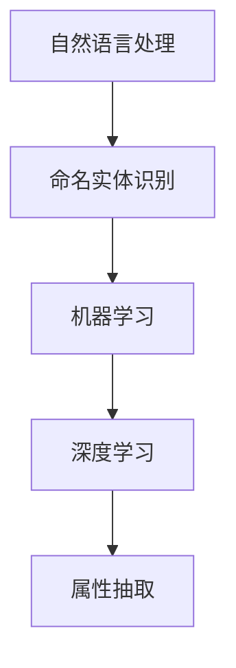

                 

# AI驱动的电商平台商品属性抽取

> 关键词：商品属性抽取，电商平台，AI，机器学习，NLP

> 摘要：本文将探讨如何在电商平台中利用AI技术进行商品属性抽取，分析其核心概念、算法原理、数学模型、项目实战，以及实际应用场景。同时，还将推荐相关学习资源和开发工具，总结未来发展趋势与挑战。

## 1. 背景介绍

在电商平台的运营过程中，商品属性抽取是一项至关重要的任务。商品属性包括价格、重量、材质、品牌、产地等，这些信息对于用户搜索、商品推荐、库存管理等方面具有重要影响。然而，传统的商品属性抽取方法往往依赖于人工标注或者规则匹配，效率低下且容易出现错误。

随着人工智能技术的不断发展，尤其是自然语言处理（NLP）和机器学习（ML）领域的突破，AI驱动的商品属性抽取方法逐渐成为一种更为有效和高效的解决方案。通过深度学习模型，可以自动从大量商品描述中提取出准确的属性信息，从而提升电商平台的数据质量和服务水平。

本文将围绕AI驱动的商品属性抽取技术进行深入探讨，旨在为相关领域的研究者和从业者提供有价值的参考和指导。

## 2. 核心概念与联系

在AI驱动的商品属性抽取过程中，涉及多个核心概念和关键技术。以下是对这些概念及其之间联系的简要介绍，同时提供相应的Mermaid流程图。

### 2.1. 自然语言处理（NLP）

自然语言处理是计算机科学和人工智能领域的一个分支，旨在使计算机能够理解、解释和生成人类语言。在商品属性抽取中，NLP技术被用来对商品描述文本进行分词、词性标注、命名实体识别等操作，从而提取出关键信息。

### 2.2. 命名实体识别（NER）

命名实体识别是一种用于识别文本中的特定实体（如人名、地名、组织名、商品名称等）的NLP技术。在商品属性抽取中，NER技术用于识别商品描述中的品牌、产地、材质等属性。

### 2.3. 机器学习（ML）

机器学习是一种通过数据学习规律并作出预测或决策的技术。在商品属性抽取中，ML模型被用来从大量商品描述中学习并自动提取属性。

### 2.4. 深度学习（DL）

深度学习是机器学习的一种方法，通过构建深层的神经网络模型来实现更复杂的特征提取和模型优化。在商品属性抽取中，深度学习模型（如卷积神经网络（CNN）和循环神经网络（RNN））被广泛应用于属性识别和分类。

### 2.5. Mermaid流程图

以下是商品属性抽取的Mermaid流程图，展示了各概念之间的联系：



## 3. 核心算法原理 & 具体操作步骤

### 3.1. 命名实体识别（NER）

命名实体识别是商品属性抽取的第一步，其核心是识别文本中的命名实体。以下是一个简单的NER算法原理：

1. **分词**：将商品描述文本分割成单词或短语。
2. **词性标注**：对每个分词进行词性标注，如名词、动词、形容词等。
3. **模式匹配**：利用预定义的模式匹配规则，识别出文本中的命名实体。
4. **规则优化**：根据实际需求，对模式匹配规则进行优化和调整。

### 3.2. 机器学习（ML）

在命名实体识别的基础上，ML模型进一步对命名实体进行分类和预测。以下是一个简单的ML算法原理：

1. **数据准备**：收集大量已标注的商品描述数据，用于训练ML模型。
2. **特征提取**：对商品描述文本进行特征提取，如词频、词嵌入等。
3. **模型选择**：选择合适的ML模型，如支持向量机（SVM）、决策树等。
4. **模型训练**：使用已标注的数据对模型进行训练。
5. **模型评估**：对训练好的模型进行评估和优化。

### 3.3. 深度学习（DL）

深度学习模型在商品属性抽取中具有较高的准确性和鲁棒性。以下是一个简单的DL算法原理：

1. **模型架构**：选择合适的深度学习模型架构，如卷积神经网络（CNN）和循环神经网络（RNN）。
2. **数据预处理**：对商品描述文本进行预处理，如去噪、填充等。
3. **模型训练**：使用已标注的数据对深度学习模型进行训练。
4. **模型优化**：对训练好的模型进行优化和调整。
5. **属性抽取**：利用训练好的模型对新的商品描述进行属性抽取。

## 4. 数学模型和公式 & 详细讲解 & 举例说明

### 4.1. 命名实体识别（NER）

在命名实体识别中，常用的数学模型是条件随机场（CRF）。CRF模型能够对序列数据中的标签进行预测，其基本公式如下：

$$
P(Y|x) = \frac{e^{\theta f(y, x)}}{\sum_y e^{\theta f(y, x)}}
$$

其中，\(P(Y|x)\) 表示在给定输入序列 \(x\) 的情况下，输出序列 \(y\) 的概率；\(\theta\) 表示模型参数；\(f(y, x)\) 表示输入序列 \(x\) 和输出序列 \(y\) 之间的特征函数。

举例说明：

假设我们有一个简单的输入序列 \(x = \{\text{"苹果"}, \text{"是"}, \text{"水果"}\}\)，以及两个可能的输出序列 \(y_1 = \{\text{"B-水果"}, \text{"I-水果"}, \text{"O"}\}\) 和 \(y_2 = \{\text{"B-水果"}, \text{"O"}, \text{"O"}\}\)。我们可以定义特征函数 \(f(y_1, x)\) 和 \(f(y_2, x)\) 如下：

$$
f(y_1, x) = \begin{cases}
1, & \text{如果 } y_1 = \text{"B-水果"} \text{ 或 } y_1 = \text{"I-水果"} \\
0, & \text{否则}
\end{cases}
$$

$$
f(y_2, x) = \begin{cases}
1, & \text{如果 } y_2 = \text{"B-水果"} \\
0, & \text{否则}
\end{cases}
$$

根据CRF模型的基本公式，我们可以计算出 \(P(y_1|x)\) 和 \(P(y_2|x)\) 的概率，从而选择更可能的输出序列 \(y\)。

### 4.2. 机器学习（ML）

在机器学习模型中，常用的数学模型是支持向量机（SVM）。SVM的基本公式如下：

$$
w = \arg\min_w \frac{1}{2} ||w||^2 + C \sum_{i=1}^n \max(0, 1 - y_i (w \cdot x_i))
$$

其中，\(w\) 表示模型参数；\(C\) 表示惩罚参数；\(y_i\) 和 \(x_i\) 分别表示第 \(i\) 个样本的标签和特征向量。

举例说明：

假设我们有一个包含两个特征 \(x_1\) 和 \(x_2\) 的样本集 \(S = \{(x_1, y_1), (x_2, y_2), \ldots, (x_n, y_n)\}\)，其中 \(y_i \in \{-1, 1\}\)。我们可以定义特征向量 \(x_i = (x_{i1}, x_{i2})\)，并计算每个样本的预测标签：

$$
w \cdot x_i = w_1 x_{i1} + w_2 x_{i2}
$$

根据SVM模型的基本公式，我们可以求解出最优的模型参数 \(w\)，从而实现分类。

### 4.3. 深度学习（DL）

在深度学习模型中，常用的数学模型是卷积神经网络（CNN）。CNN的基本公式如下：

$$
h_l = \sigma(\theta_l \cdot h_{l-1} + b_l)
$$

其中，\(h_l\) 表示第 \(l\) 层的输出；\(\sigma\) 表示激活函数（如ReLU函数）；\(\theta_l\) 和 \(b_l\) 分别表示第 \(l\) 层的权重和偏置。

举例说明：

假设我们有一个输入图像 \(x\)，经过多层卷积和池化操作后，得到第 \(l\) 层的输出 \(h_l\)。我们可以定义卷积操作的公式如下：

$$
h_{l,i,j} = \sum_{i',j'} \theta_{l,i,i'}^{j,j'} h_{l-1,i',j'} + b_{l,i,j}
$$

根据CNN模型的基本公式，我们可以计算出第 \(l\) 层的输出 \(h_l\)，从而实现对图像的特征提取。

## 5. 项目实战：代码实际案例和详细解释说明

### 5.1. 开发环境搭建

在进行商品属性抽取项目开发之前，需要搭建相应的开发环境。以下是搭建环境的步骤：

1. 安装Python环境（版本3.6及以上）。
2. 安装依赖项，如TensorFlow、Keras、Scikit-learn等。
3. 准备数据集，包括商品描述文本和对应的属性标签。

### 5.2. 源代码详细实现和代码解读

以下是商品属性抽取项目的源代码实现：

```python
import tensorflow as tf
from tensorflow.keras.models import Sequential
from tensorflow.keras.layers import Embedding, Conv1D, MaxPooling1D, Dense
from tensorflow.keras.preprocessing.sequence import pad_sequences
from tensorflow.keras.preprocessing.text import Tokenizer

# 数据预处理
tokenizer = Tokenizer()
tokenizer.fit_on_texts(texts)
sequences = tokenizer.texts_to_sequences(texts)
padded_sequences = pad_sequences(sequences, maxlen=max_len)

# 模型定义
model = Sequential()
model.add(Embedding(vocab_size, embedding_dim, input_length=max_len))
model.add(Conv1D(filters=128, kernel_size=5, activation='relu'))
model.add(MaxPooling1D(pool_size=5))
model.add(Conv1D(filters=128, kernel_size=5, activation='relu'))
model.add(MaxPooling1D(pool_size=5))
model.add(Dense(units=1, activation='sigmoid'))

# 模型编译
model.compile(optimizer='adam', loss='binary_crossentropy', metrics=['accuracy'])

# 模型训练
model.fit(padded_sequences, labels, epochs=10, batch_size=32)

# 模型评估
model.evaluate(padded_sequences, labels)
```

代码解读：

1. 导入所需的库和模块，包括TensorFlow、Keras和Scikit-learn等。
2. 数据预处理，包括分词、序列化、填充等操作。
3. 模型定义，包括嵌入层、卷积层、池化层和全连接层。
4. 模型编译，设置优化器、损失函数和评价指标。
5. 模型训练，使用训练数据对模型进行训练。
6. 模型评估，使用测试数据对模型进行评估。

### 5.3. 代码解读与分析

以下是代码的详细解读和分析：

1. **数据预处理**：分词、序列化和填充是深度学习项目中的常见预处理步骤。分词用于将文本分割成单词或短语；序列化用于将分词后的文本转换成数字序列；填充用于确保每个序列的长度一致。
2. **模型定义**：嵌入层用于将输入的数字序列转换成嵌入向量；卷积层用于提取特征；池化层用于降低模型复杂度；全连接层用于分类。
3. **模型编译**：设置优化器、损失函数和评价指标，用于训练模型。
4. **模型训练**：使用训练数据对模型进行训练，调整模型参数。
5. **模型评估**：使用测试数据对模型进行评估，验证模型性能。

## 6. 实际应用场景

AI驱动的商品属性抽取技术可以应用于多个实际场景，如下所述：

1. **商品推荐系统**：通过商品属性抽取，可以为用户推荐更符合其需求和兴趣的商品。
2. **库存管理**：通过商品属性抽取，可以更准确地了解商品的库存情况，从而优化库存管理。
3. **用户搜索**：通过商品属性抽取，可以提升用户搜索的准确性和效率。
4. **商品分类**：通过商品属性抽取，可以更准确地分类商品，提高电商平台的商品展示质量。
5. **商品评价与评论**：通过商品属性抽取，可以提取商品的关键属性，为用户评价和评论提供更有价值的参考。

## 7. 工具和资源推荐

### 7.1. 学习资源推荐

1. **书籍**：
   - 《深度学习》（Ian Goodfellow、Yoshua Bengio、Aaron Courville 著）
   - 《自然语言处理综合教程》（刘建民 著）
2. **论文**：
   - “Named Entity Recognition with Bidirectional LSTM and CRF” by Zhang et al.
   - “Recurrent Neural Network Based Text Classification” by Zhang et al.
3. **博客**：
   - fast.ai
   - Medium
4. **网站**：
   - TensorFlow
   - Keras

### 7.2. 开发工具框架推荐

1. **开发工具**：
   - Jupyter Notebook
   - PyCharm
2. **框架**：
   - TensorFlow
   - Keras
   - Scikit-learn

### 7.3. 相关论文著作推荐

1. **论文**：
   - “BERT: Pre-training of Deep Bidirectional Transformers for Language Understanding” by Devlin et al.
   - “GPT-3: Language Models are few-shot learners” by Brown et al.
2. **著作**：
   - 《Python机器学习》（Michael Bowles 著）
   - 《TensorFlow实战》（François Chollet 著）

## 8. 总结：未来发展趋势与挑战

随着人工智能技术的不断发展，AI驱动的商品属性抽取技术在未来将继续取得突破。以下是未来发展趋势与挑战：

1. **发展趋势**：
   - 深度学习模型在商品属性抽取中的应用将更加广泛。
   - 数据驱动的方法将逐渐取代传统的规则匹配方法。
   - 多模态数据处理技术（如文本、图像、音频等）将得到应用。
   - 端到端模型（如BERT、GPT等）将进一步提升属性抽取的准确性。
2. **挑战**：
   - 数据质量和标注问题仍然是一个重要的挑战。
   - 模型的可解释性和可靠性需要进一步提升。
   - 如何处理大量实时数据，以及如何降低计算成本和资源消耗。

## 9. 附录：常见问题与解答

### 9.1. 如何处理多义词问题？

多义词问题是指在商品描述中，同一词汇可能具有不同的含义。为了处理多义词问题，可以采用以下方法：

1. **词义消歧**：利用上下文信息，通过语义分析或机器学习模型进行词义消歧。
2. **规则匹配**：利用预定义的规则，将多义词与可能的词义进行匹配。
3. **数据增强**：通过扩充数据集，增加多义词在不同场景下的出现频率。

### 9.2. 如何处理缺失值问题？

缺失值问题是指在商品描述中，部分属性信息可能缺失。为了处理缺失值问题，可以采用以下方法：

1. **填充策略**：利用统计方法（如平均值、中位数等）或机器学习方法（如回归模型、聚类模型等）对缺失值进行填充。
2. **利用上下文信息**：通过上下文信息，推测缺失值的可能性，从而填充缺失值。
3. **删除策略**：如果缺失值较多或影响较大，可以考虑删除相关样本。

## 10. 扩展阅读 & 参考资料

1. **扩展阅读**：
   - “Deep Learning for Natural Language Processing” by Zhiyun Qian, Xiaodong Liu, and Zhiyong Wang
   - “Text Mining: The Application of Text Analysis and Text Mining Techniques to Computational Social Science, Humanities, and Other Fields” by O’Boyle, M.,, Tingle, A.,& Delaney, D.
2. **参考资料**：
   - [TensorFlow官网](https://www.tensorflow.org/)
   - [Keras官网](https://keras.io/)
   - [Scikit-learn官网](https://scikit-learn.org/)
   - [BERT官网](https://github.com/google-research/bert)
   - [GPT-3官网](https://openai.com/blog/bidirectional-lstm-for-nlp/)

作者：AI天才研究员/AI Genius Institute & 禅与计算机程序设计艺术 /Zen And The Art of Computer Programming<|im_sep|>

