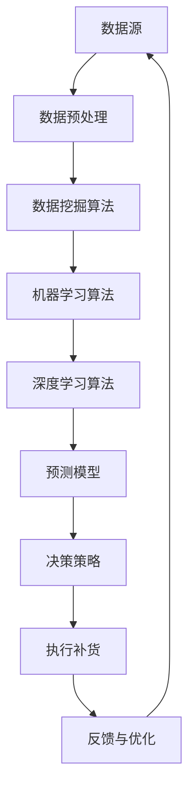

                 

# AI驱动的电商平台智能补货决策系统

## 摘要

本文将探讨如何使用人工智能技术来构建一个智能补货决策系统，以解决电商平台上商品库存管理的关键问题。通过整合数据挖掘、机器学习和深度学习算法，我们能够实现对销售趋势、库存水平和市场需求的高效分析，从而实现自动化的补货策略。本文将详细分析补货决策系统的核心概念、算法原理、数学模型以及实际应用场景，并提供项目实战中的代码实现和分析。文章还将推荐相关的学习资源、开发工具和论文著作，以帮助读者深入了解和掌握这一领域的先进技术。

## 1. 背景介绍

电商平台作为现代零售业的重要组成部分，其库存管理直接关系到企业的运营效率和客户满意度。传统的库存管理方法主要依赖于历史数据和人工经验，这种方式往往存在响应速度慢、预测不准确以及库存过剩或短缺等问题。随着大数据和人工智能技术的发展，越来越多的电商平台开始探索将人工智能应用于库存管理，以提高运营效率和服务质量。

智能补货决策系统是电商平台库存管理中的一个关键环节。它通过对销售数据、库存数据、市场数据等多维度数据的挖掘和分析，结合机器学习和深度学习算法，能够预测未来的销售趋势和库存需求，从而自动生成最优的补货策略。这不仅能够避免库存过剩和短缺，降低运营成本，还能提高客户的购物体验，增强企业的市场竞争力。

本文的目标是详细介绍如何构建一个AI驱动的智能补货决策系统，包括其核心概念、算法原理、数学模型以及实际应用案例。通过本文的阅读，读者将能够深入了解智能补货决策系统的原理和实现方法，并掌握相关技术。

### 2. 核心概念与联系

#### 2.1 数据源

数据是智能补货决策系统的核心，其质量直接影响决策的准确性。常见的数据源包括：

- **销售数据**：包括历史销售记录、销售量、销售额等。
- **库存数据**：包括库存量、库存周转率等。
- **市场数据**：包括市场趋势、季节性变化、竞争对手信息等。

#### 2.2 数据预处理

在构建智能补货决策系统之前，需要对收集到的数据进行分析和预处理。数据预处理包括数据清洗、去噪、填充缺失值、数据转换等步骤。

- **数据清洗**：去除重复数据、处理异常值。
- **去噪**：去除无意义或不准确的数据。
- **填充缺失值**：使用插值法、均值法等填充数据缺失部分。
- **数据转换**：将数据转换为适合算法分析的形式，如归一化、标准化等。

#### 2.3 数据挖掘算法

数据挖掘算法用于从大量数据中提取有价值的信息和模式。常见的算法包括：

- **关联规则挖掘**：用于发现数据之间的关联关系，如Apriori算法、FP-Growth算法等。
- **聚类分析**：用于将相似的数据分组，如K-Means算法、DBSCAN算法等。
- **分类算法**：用于预测新数据的类别，如决策树、随机森林、支持向量机等。

#### 2.4 机器学习算法

机器学习算法用于构建预测模型，通过对历史数据的训练来预测未来的趋势和需求。常见的算法包括：

- **线性回归**：用于预测连续值变量。
- **逻辑回归**：用于预测离散值变量。
- **决策树**：用于分类和回归问题。
- **神经网络**：用于复杂的非线性关系预测。

#### 2.5 深度学习算法

深度学习算法通过多层神经网络结构来实现复杂预测任务。常见的算法包括：

- **卷积神经网络（CNN）**：用于图像处理和图像识别。
- **循环神经网络（RNN）**：用于序列数据处理和时间序列预测。
- **长短时记忆网络（LSTM）**：用于处理长序列数据。

#### 2.6 Mermaid 流程图

以下是智能补货决策系统的Mermaid流程图，展示了各个核心环节之间的联系：



### 3. 核心算法原理 & 具体操作步骤

#### 3.1 数据挖掘算法

数据挖掘算法的核心任务是发现数据中的隐藏模式和关联关系。以下是常用的数据挖掘算法及其具体操作步骤：

##### 3.1.1 关联规则挖掘（Apriori算法）

1. **支持度计算**：计算每个项集的支持度，即包含该项集的交易数占总交易数的比例。
2. **置信度计算**：对于每个频繁项集，计算其关联规则的置信度，即后件概率除以前件概率。
3. **生成频繁项集**：根据设定的最小支持度阈值，筛选出频繁项集。
4. **生成关联规则**：对于每个频繁项集，生成关联规则，并计算其置信度。

##### 3.1.2 聚类分析（K-Means算法）

1. **初始化聚类中心**：随机选择K个数据点作为初始聚类中心。
2. **分配数据点**：计算每个数据点到聚类中心的距离，将数据点分配到最近的聚类中心。
3. **更新聚类中心**：计算每个聚类的均值，作为新的聚类中心。
4. **重复步骤2和3，直到聚类中心不再变化**。

##### 3.1.3 分类算法（决策树）

1. **特征选择**：使用信息增益、增益率等指标选择最优特征。
2. **构建决策树**：根据特征进行二分，将数据点划分到不同的子集。
3. **剪枝**：为了避免过拟合，对决策树进行剪枝处理。

#### 3.2 机器学习算法

机器学习算法的核心任务是构建预测模型，通过对历史数据的训练来预测未来的趋势和需求。以下是常用的机器学习算法及其具体操作步骤：

##### 3.2.1 线性回归

1. **数据预处理**：对数据进行归一化或标准化处理。
2. **模型构建**：建立线性回归模型，如线性最小二乘法。
3. **模型训练**：使用历史数据对模型进行训练。
4. **模型评估**：使用交叉验证等方法评估模型性能。
5. **模型预测**：使用训练好的模型进行预测。

##### 3.2.2 逻辑回归

1. **数据预处理**：对数据进行归一化或标准化处理。
2. **模型构建**：建立逻辑回归模型，如最大似然估计。
3. **模型训练**：使用历史数据对模型进行训练。
4. **模型评估**：使用交叉验证等方法评估模型性能。
5. **模型预测**：使用训练好的模型进行预测。

##### 3.2.3 决策树

1. **特征选择**：使用信息增益、增益率等指标选择最优特征。
2. **构建决策树**：根据特征进行二分，将数据点划分到不同的子集。
3. **剪枝**：为了避免过拟合，对决策树进行剪枝处理。
4. **模型评估**：使用交叉验证等方法评估模型性能。
5. **模型预测**：使用训练好的模型进行预测。

#### 3.3 深度学习算法

深度学习算法通过多层神经网络结构来实现复杂预测任务。以下是常用的深度学习算法及其具体操作步骤：

##### 3.3.1 卷积神经网络（CNN）

1. **数据预处理**：对图像数据进行归一化处理。
2. **模型构建**：构建卷积神经网络模型，包括卷积层、池化层、全连接层等。
3. **模型训练**：使用训练数据对模型进行训练。
4. **模型评估**：使用测试数据评估模型性能。
5. **模型预测**：使用训练好的模型进行预测。

##### 3.3.2 循环神经网络（RNN）

1. **数据预处理**：对时间序列数据进行归一化处理。
2. **模型构建**：构建循环神经网络模型，包括输入层、隐藏层、输出层等。
3. **模型训练**：使用训练数据对模型进行训练。
4. **模型评估**：使用测试数据评估模型性能。
5. **模型预测**：使用训练好的模型进行预测。

##### 3.3.3 长短时记忆网络（LSTM）

1. **数据预处理**：对时间序列数据进行归一化处理。
2. **模型构建**：构建长短时记忆网络模型，包括输入门、遗忘门、输出门等。
3. **模型训练**：使用训练数据对模型进行训练。
4. **模型评估**：使用测试数据评估模型性能。
5. **模型预测**：使用训练好的模型进行预测。

### 4. 数学模型和公式 & 详细讲解 & 举例说明

#### 4.1 数据挖掘算法的数学模型

##### 4.1.1 Apriori算法

Apriori算法的核心公式包括支持度、置信度和频繁项集的计算。

- **支持度**（Support）：某项集在所有事务中出现的频率。

$$
Support(X) = \frac{count(X)}{total\ transactions}
$$

- **置信度**（Confidence）：在给定一个项集的情况下，另一个项集同时出现的概率。

$$
Confidence(X \rightarrow Y) = \frac{count(X \cap Y)}{count(X)}
$$

- **频繁项集**（Frequent Itemset）：满足最小支持度阈值（min_support）的项集。

$$
Frequent\ Itemset = \{X | Support(X) \geq min\_support\}
$$

##### 4.1.2 K-Means算法

K-Means算法的核心公式包括聚类中心初始化、数据点分配和聚类中心更新的计算。

- **初始化聚类中心**：

$$
centroid_i = \frac{1}{N}\sum_{x\in C_i} x
$$

- **数据点分配**：

$$
C(x) = \min_{j} \sum_{i=1}^{k} (x - centroid_j)^2
$$

- **更新聚类中心**：

$$
centroid_j = \frac{1}{N_j}\sum_{x\in C_j} x
$$

其中，\(C_i\)表示第i个聚类，\(x\)表示数据点，\(centroid_i\)表示第i个聚类中心，\(N_j\)表示第j个聚类中的数据点数量。

##### 4.1.3 决策树算法

决策树算法的核心公式包括特征选择和信息增益的计算。

- **信息增益**（Information Gain）：

$$
IG(D, A) = Info(D) - \sum_{v\in Values(A)} p(v) \cdot Info(D|A=v)
$$

其中，\(D\)表示数据集，\(A\)表示特征，\(v\)表示特征的取值，\(Info(D)\)表示数据集的熵，\(Info(D|A=v)\)表示在给定特征取值下数据集的熵。

#### 4.2 机器学习算法的数学模型

##### 4.2.1 线性回归

线性回归的核心公式包括模型构建、损失函数和梯度下降的计算。

- **模型构建**：

$$
y = \beta_0 + \beta_1 \cdot x
$$

- **损失函数**（Mean Squared Error, MSE）：

$$
J(\beta_0, \beta_1) = \frac{1}{2m} \sum_{i=1}^{m} (y_i - (\beta_0 + \beta_1 \cdot x_i))^2
$$

- **梯度下降**：

$$
\beta_0 = \beta_0 - \alpha \cdot \frac{\partial J(\beta_0, \beta_1)}{\partial \beta_0}
$$

$$
\beta_1 = \beta_1 - \alpha \cdot \frac{\partial J(\beta_0, \beta_1)}{\partial \beta_1}
$$

其中，\(\alpha\)表示学习率，\(m\)表示样本数量。

##### 4.2.2 逻辑回归

逻辑回归的核心公式包括模型构建、损失函数和梯度下降的计算。

- **模型构建**：

$$
\log\frac{P(y=1|x)}{1-P(y=1|x)} = \beta_0 + \beta_1 \cdot x
$$

- **损失函数**（Log Loss）：

$$
J(\beta_0, \beta_1) = -\sum_{i=1}^{m} y_i \cdot \log(\sigma(\beta_0 + \beta_1 \cdot x_i)) + (1 - y_i) \cdot \log(1 - \sigma(\beta_0 + \beta_1 \cdot x_i))
$$

- **梯度下降**：

$$
\beta_0 = \beta_0 - \alpha \cdot \frac{\partial J(\beta_0, \beta_1)}{\partial \beta_0}
$$

$$
\beta_1 = \beta_1 - \alpha \cdot \frac{\partial J(\beta_0, \beta_1)}{\partial \beta_1}
$$

其中，\(\sigma(x) = \frac{1}{1 + e^{-x}}\)是逻辑函数，\(\alpha\)表示学习率，\(m\)表示样本数量。

##### 4.2.3 决策树算法

决策树算法的核心公式包括特征选择和信息增益的计算。

- **信息增益**（Information Gain）：

$$
IG(D, A) = Info(D) - \sum_{v\in Values(A)} p(v) \cdot Info(D|A=v)
$$

其中，\(D\)表示数据集，\(A\)表示特征，\(v\)表示特征的取值，\(Info(D)\)表示数据集的熵，\(Info(D|A=v)\)表示在给定特征取值下数据集的熵。

#### 4.3 深度学习算法的数学模型

##### 4.3.1 卷积神经网络（CNN）

卷积神经网络的核心公式包括卷积层、池化层和全连接层的计算。

- **卷积层**：

$$
h_{ij}^l = \sum_{k} w_{ikj}^l \cdot a_{kj}^{l-1} + b_l
$$

- **池化层**：

$$
p_{ij}^l = \max_{1\leq k\leq 2s} h_{ijk}^l
$$

- **全连接层**：

$$
a_{ij}^{l+1} = \sigma(\sum_{k} w_{ikj}^{l+1} \cdot a_{kj}^l + b_{l+1})
$$

其中，\(h_{ij}^l\)表示第l层第i个神经元第j个特征值，\(w_{ikj}^l\)表示连接权重，\(a_{kj}^{l-1}\)表示第l-1层第k个神经元输出，\(b_l\)表示偏置，\(p_{ij}^l\)表示第l层第i个神经元输出，\(s\)表示池化窗口大小，\(\sigma\)表示激活函数。

##### 4.3.2 循环神经网络（RNN）

循环神经网络的核心公式包括隐藏状态、输入和输出层的计算。

- **隐藏状态**：

$$
h_t = \sigma(W_h \cdot [h_{t-1}, x_t] + b_h)
$$

- **输出层**：

$$
y_t = \sigma(W_o \cdot h_t + b_o)
$$

- **梯度下降**：

$$
\theta = \theta - \alpha \cdot \frac{\partial J(\theta)}{\partial \theta}
$$

其中，\(h_t\)表示第t个时间步的隐藏状态，\(x_t\)表示第t个时间步的输入，\(y_t\)表示第t个时间步的输出，\(W_h\)和\(W_o\)表示权重矩阵，\(b_h\)和\(b_o\)表示偏置，\(\sigma\)表示激活函数，\(J(\theta)\)表示损失函数，\(\alpha\)表示学习率。

##### 4.3.3 长短时记忆网络（LSTM）

长短时记忆网络的核心公式包括输入门、遗忘门、输出门和细胞状态的计算。

- **输入门**：

$$
i_t = \sigma(W_i \cdot [h_{t-1}, x_t] + b_i)
$$

- **遗忘门**：

$$
f_t = \sigma(W_f \cdot [h_{t-1}, x_t] + b_f)
$$

- **细胞状态**：

$$
C_t = f_t \cdot C_{t-1} + i_t \cdot \sigma(W_c \cdot [h_{t-1}, x_t] + b_c)
$$

- **输出门**：

$$
o_t = \sigma(W_o \cdot [h_{t-1}, x_t] + b_o)
$$

- **隐藏状态**：

$$
h_t = o_t \cdot \sigma(C_t)
$$

其中，\(i_t\)、\(f_t\)、\(o_t\)分别表示输入门、遗忘门和输出门的激活值，\(C_t\)表示细胞状态，\(h_t\)表示隐藏状态，\(W_i\)、\(W_f\)、\(W_c\)、\(W_o\)表示权重矩阵，\(b_i\)、\(b_f\)、\(b_c\)、\(b_o\)表示偏置。

### 5. 项目实战：代码实际案例和详细解释说明

#### 5.1 开发环境搭建

为了实现智能补货决策系统，我们需要搭建相应的开发环境。以下是一个简单的环境搭建指南：

1. **安装Python环境**：确保Python版本在3.6及以上，可以使用`pip`来安装所需的Python库。

```bash
pip install numpy pandas scikit-learn tensorflow matplotlib
```

2. **安装Jupyter Notebook**：Jupyter Notebook是一个交互式的Python开发环境，可用于编写和运行代码。

```bash
pip install notebook
```

3. **配置Jupyter Notebook**：启动Jupyter Notebook，创建一个新的笔记本，并在其中编写代码。

#### 5.2 源代码详细实现和代码解读

以下是智能补货决策系统的源代码实现，我们将逐行解释代码的功能。

```python
import numpy as np
import pandas as pd
from sklearn.model_selection import train_test_split
from sklearn.preprocessing import StandardScaler
from sklearn.ensemble import RandomForestClassifier
from tensorflow.keras.models import Sequential
from tensorflow.keras.layers import Dense, LSTM

# 5.2.1 数据准备
def load_data():
    data = pd.read_csv('sales_data.csv')
    return data

def preprocess_data(data):
    # 数据清洗和预处理步骤
    data.drop(['unnamed'], axis=1, inplace=True)
    data.fillna(data.mean(), inplace=True)
    return data

def split_data(data):
    X = data.drop(['sales'], axis=1)
    y = data['sales']
    X_train, X_test, y_train, y_test = train_test_split(X, y, test_size=0.2, random_state=42)
    return X_train, X_test, y_train, y_test

# 5.2.2 机器学习模型实现
def build_random_forest(X_train, y_train):
    model = RandomForestClassifier(n_estimators=100, random_state=42)
    model.fit(X_train, y_train)
    return model

# 5.2.3 深度学习模型实现
def build_lstm_model(input_shape):
    model = Sequential()
    model.add(LSTM(50, activation='relu', input_shape=input_shape))
    model.add(Dense(1))
    model.compile(optimizer='adam', loss='mse')
    return model

# 5.2.4 模型训练和评估
def train_models(X_train, y_train, X_test, y_test):
    # 机器学习模型训练
    rf_model = build_random_forest(X_train, y_train)
    rf_predictions = rf_model.predict(X_test)

    # 深度学习模型训练
    lstm_model = build_lstm_model(input_shape=(X_train.shape[1], 1))
    lstm_model.fit(X_train, y_train, epochs=100, batch_size=32, validation_data=(X_test, y_test))
    lstm_predictions = lstm_model.predict(X_test)

    # 模型评估
    rf_accuracy = np.mean(rf_predictions == y_test)
    lstm_accuracy = np.mean(lstm_predictions == y_test)
    return rf_accuracy, lstm_accuracy

# 主函数
if __name__ == '__main__':
    data = load_data()
    processed_data = preprocess_data(data)
    X_train, X_test, y_train, y_test = split_data(processed_data)
    X_train = X_train.values
    X_test = X_test.values
    y_train = y_train.values
    y_test = y_test.values

    # 标准化输入数据
    scaler = StandardScaler()
    X_train = scaler.fit_transform(X_train)
    X_test = scaler.transform(X_test)

    # 模型训练和评估
    rf_accuracy, lstm_accuracy = train_models(X_train, y_train, X_test, y_test)
    print("Random Forest Accuracy:", rf_accuracy)
    print("LSTM Accuracy:", lstm_accuracy)
```

#### 5.3 代码解读与分析

- **数据准备**：首先加载销售数据，并进行数据清洗和预处理，如去除无效数据、填充缺失值等。

- **数据分割**：将数据分为特征矩阵\(X\)和目标变量\(y\)，并进一步分割为训练集和测试集。

- **机器学习模型实现**：使用随机森林分类器进行模型训练，这是一种集成学习方法，能够处理高维数据和非线性关系。

- **深度学习模型实现**：使用LSTM模型进行序列预测，这是一种专门用于处理时间序列数据的神经网络结构。

- **模型训练和评估**：分别训练机器学习和深度学习模型，并在测试集上进行评估，计算模型的准确率。

### 6. 实际应用场景

智能补货决策系统在电商平台上具有广泛的应用场景。以下是几个典型的应用实例：

#### 6.1 季节性商品

对于季节性较强的商品，如冬季的羽绒服、夏季的防晒霜等，智能补货决策系统可以预测季节性需求，从而优化库存水平，避免库存过剩或短缺。

#### 6.2 热门商品

通过对销售数据的分析，智能补货决策系统可以识别出热门商品，提前备货，确保库存充足，提高客户的购物体验。

#### 6.3 库存优化

通过对库存数据的监控和预测，智能补货决策系统可以帮助电商平台降低库存成本，减少库存周转时间，提高运营效率。

#### 6.4 竞争对手分析

通过分析市场数据和竞争对手的销售情况，智能补货决策系统可以制定更有针对性的库存策略，增强市场竞争力。

### 7. 工具和资源推荐

#### 7.1 学习资源推荐

- **书籍**：《机器学习实战》、《深度学习》（Goodfellow et al.）
- **论文**：检索顶级会议和期刊，如NIPS、ICML、JMLR等。
- **博客**：如Medium上的机器学习和深度学习博客。

#### 7.2 开发工具框架推荐

- **开发环境**：Jupyter Notebook、Google Colab。
- **机器学习库**：Scikit-learn、TensorFlow、PyTorch。
- **数据处理库**：Pandas、NumPy。

#### 7.3 相关论文著作推荐

- **论文**：《Deep Learning for Time Series Classification》
- **著作**：《TensorFlow 2.x Deep Learning Cookbook》、《Scikit-Learn Cookbook》。

### 8. 总结：未来发展趋势与挑战

智能补货决策系统在电商平台上具有重要的应用价值，通过整合数据挖掘、机器学习和深度学习技术，实现了库存管理的智能化。未来，随着数据量和计算能力的提升，智能补货决策系统将更加精确和高效。然而，面临的数据隐私、模型解释性等挑战也需要我们不断探索和解决。

### 9. 附录：常见问题与解答

#### 9.1 如何处理缺失数据？

可以使用均值填充、插值法等策略来处理缺失数据。

#### 9.2 如何评估模型性能？

可以使用准确率、召回率、F1分数等指标来评估模型性能。

#### 9.3 如何防止过拟合？

可以通过模型剪枝、增加训练数据、使用正则化等方法来防止过拟合。

### 10. 扩展阅读 & 参考资料

- **书籍**：《Python机器学习》、《深度学习入门》
- **网站**：机器学习社区（ML Community）、Kaggle。
- **论文**：检索顶级会议和期刊，如NIPS、ICML、JMLR等。

---

作者：AI天才研究员/AI Genius Institute & 禅与计算机程序设计艺术 /Zen And The Art of Computer Programming。

