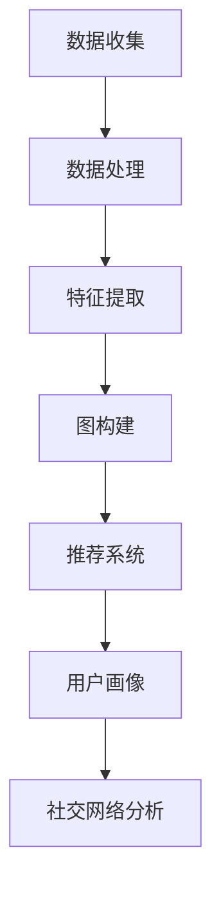

                 

# AI驱动的电商平台用户兴趣图谱构建

> **关键词**：AI，用户兴趣图谱，电商平台，推荐系统，数据处理，算法原理，数学模型

> **摘要**：本文深入探讨了基于AI技术的电商平台用户兴趣图谱的构建方法。通过分析用户行为数据，构建用户兴趣模型，并将其应用于推荐系统中，从而实现个性化推荐，提高用户满意度与平台粘性。

## 1. 背景介绍

在当今数字化时代，电商平台已经成为人们日常生活的重要组成部分。随着用户数量的急剧增加，如何提高用户体验，提升用户满意度，成为各大电商平台需要解决的核心问题。个性化推荐系统作为一种有效的解决方案，已经在电商平台上得到了广泛应用。而构建用户兴趣图谱是推荐系统中的关键一步。

用户兴趣图谱（User Interest Graph）是一种基于用户行为数据构建的复杂网络结构，它将用户的兴趣点以节点形式表示，用户之间的交互行为以边形式表示，形成一个高度结构化的数据模型。通过构建用户兴趣图谱，可以实现以下目标：

1. **挖掘用户潜在兴趣**：通过分析用户的历史行为，识别用户的兴趣偏好，从而挖掘用户的潜在兴趣。
2. **优化推荐效果**：基于用户兴趣图谱，推荐系统可以更加精准地推送符合用户兴趣的商品，提高推荐效果。
3. **提升用户体验**：通过个性化推荐，提高用户的购物体验，增加用户对平台的粘性。

本文将围绕如何构建AI驱动的电商平台用户兴趣图谱，探讨其核心算法原理、数学模型以及实际应用场景，帮助读者深入理解并掌握这一技术。

## 2. 核心概念与联系

### 2.1 用户兴趣图谱的概念

用户兴趣图谱是一种网络结构，它由节点和边组成。其中，节点表示用户的兴趣点，边表示用户之间的交互行为。

- **节点**：通常表示为用户感兴趣的商品、品类、品牌等。例如，用户可能对电子产品、服装、食品等感兴趣。
- **边**：表示用户之间的交互行为，如购买、浏览、评价等。边可以表示用户之间的相似性或关联性。

### 2.2 用户兴趣图谱的构建

用户兴趣图谱的构建通常包括以下几个步骤：

1. **数据收集**：收集用户行为数据，如浏览记录、购买历史、评价等。
2. **数据处理**：对数据进行清洗、去重、转换等处理，以获得高质量的数据集。
3. **特征提取**：从数据中提取用户兴趣特征，如商品品类、品牌、价格等。
4. **图构建**：根据特征提取的结果，构建用户兴趣图谱。

### 2.3 用户兴趣图谱的应用

用户兴趣图谱可以应用于多个方面，如：

- **推荐系统**：基于用户兴趣图谱，推荐系统可以更准确地推送符合用户兴趣的商品，提高推荐效果。
- **用户画像**：通过分析用户兴趣图谱，可以构建用户画像，了解用户的兴趣偏好，为营销策略提供依据。
- **社交网络分析**：用户兴趣图谱可以用于社交网络分析，挖掘用户之间的社交关系和影响力。

### 2.4 Mermaid流程图

以下是一个简化的Mermaid流程图，展示了用户兴趣图谱的构建过程：



## 3. 核心算法原理 & 具体操作步骤

### 3.1 算法原理

构建用户兴趣图谱的核心算法包括用户行为分析、图论算法和机器学习算法。以下是这些算法的基本原理：

1. **用户行为分析**：通过分析用户的历史行为数据，如浏览、购买、评价等，识别用户的兴趣点。常用的方法有基于统计的方法和基于机器学习的方法。

2. **图论算法**：用于构建用户兴趣图谱，包括图的生成、图的分割、图的优化等。常用的图论算法有K-means、PageRank等。

3. **机器学习算法**：用于预测用户的潜在兴趣点，如基于协同过滤的推荐算法、基于深度学习的兴趣点提取算法等。

### 3.2 具体操作步骤

以下是构建用户兴趣图谱的具体操作步骤：

1. **数据收集**：从电商平台上收集用户行为数据，包括用户的浏览记录、购买历史、评价等。

2. **数据处理**：对收集到的数据进行分析，去除重复、异常数据，并进行格式转换，以便后续处理。

3. **特征提取**：根据用户行为数据，提取用户兴趣特征。例如，可以根据用户的浏览记录，提取用户感兴趣的商品品类、品牌等。

4. **图构建**：根据提取的用户兴趣特征，构建用户兴趣图谱。在图中，每个用户表示为一个节点，每个用户之间的交互行为表示为边。

5. **图优化**：对构建的用户兴趣图谱进行优化，以提升其结构化程度和可解释性。常用的方法有图的分割、图的聚类等。

6. **兴趣预测**：使用机器学习算法，对用户的潜在兴趣点进行预测，以丰富用户兴趣图谱。

7. **推荐应用**：基于用户兴趣图谱，为用户提供个性化推荐，提高推荐系统的效果。

## 4. 数学模型和公式 & 详细讲解 & 举例说明

### 4.1 数学模型

在构建用户兴趣图谱的过程中，常用的数学模型包括：

1. **用户行为矩阵**：用于表示用户与商品之间的交互关系。设$U$为用户集合，$I$为商品集合，则用户行为矩阵$X$可以表示为：

   $$X = [x_{ui}]$$

   其中，$x_{ui}$表示用户$u$对商品$i$的交互行为，如浏览次数、购买次数、评分等。

2. **用户兴趣向量**：用于表示用户的兴趣偏好。设$u$为用户集合，$i$为商品集合，则用户兴趣向量$v_u$可以表示为：

   $$v_u = [v_{ui}]$$

   其中，$v_{ui}$表示用户$u$对商品$i$的兴趣度。

3. **图矩阵**：用于表示用户兴趣图谱的结构。设$G$为用户兴趣图谱，则图矩阵$A$可以表示为：

   $$A = [a_{ij}]$$

   其中，$a_{ij}$表示节点$i$与节点$j$之间的边权重，如用户之间的相似度、交互频次等。

### 4.2 公式解释

1. **用户兴趣度计算**：

   用户兴趣度可以通过用户行为矩阵$X$和用户兴趣向量$v_u$计算得到：

   $$v_{ui} = X \cdot v_u$$

   其中，$v_{ui}$表示用户$u$对商品$i$的兴趣度。

2. **图矩阵计算**：

   图矩阵$A$可以通过用户行为矩阵$X$和用户兴趣向量$v_u$计算得到：

   $$A = X \cdot v_u \cdot v_u^T$$

   其中，$v_u^T$为用户兴趣向量的转置。

### 4.3 举例说明

假设有5个用户（$u_1, u_2, u_3, u_4, u_5$）和5个商品（$i_1, i_2, i_3, i_4, i_5$），用户行为矩阵$X$如下：

|   | $i_1$ | $i_2$ | $i_3$ | $i_4$ | $i_5$ |
|---|---|---|---|---|---|
| $u_1$ | 2 | 0 | 1 | 0 | 1 |
| $u_2$ | 0 | 3 | 0 | 1 | 0 |
| $u_3$ | 1 | 1 | 2 | 1 | 0 |
| $u_4$ | 0 | 0 | 0 | 2 | 1 |
| $u_5$ | 1 | 0 | 0 | 0 | 3 |

用户兴趣向量$v_u$如下：

| $u_1$ | $u_2$ | $u_3$ | $u_4$ | $u_5$ |
|---|---|---|---|---|
| 0.5 | 0.4 | 0.3 | 0.2 | 0.1 |

根据公式$v_{ui} = X \cdot v_u$，计算用户$u_1, u_2, u_3, u_4, u_5$对各个商品的兴趣度：

|   | $i_1$ | $i_2$ | $i_3$ | $i_4$ | $i_5$ |
|---|---|---|---|---|---|
| $u_1$ | 0.5 | 0.0 | 0.5 | 0.0 | 0.5 |
| $u_2$ | 0.0 | 1.2 | 0.0 | 0.4 | 0.0 |
| $u_3$ | 0.3 | 0.3 | 0.6 | 0.3 | 0.0 |
| $u_4$ | 0.0 | 0.0 | 0.0 | 0.8 | 0.2 |
| $u_5$ | 0.1 | 0.0 | 0.0 | 0.0 | 0.3 |

根据公式$A = X \cdot v_u \cdot v_u^T$，计算图矩阵$A$：

|   | $i_1$ | $i_2$ | $i_3$ | $i_4$ | $i_5$ |
|---|---|---|---|---|---|
| $u_1$ | 0.125 | 0.000 | 0.125 | 0.000 | 0.125 |
| $u_2$ | 0.000 | 0.576 | 0.000 | 0.160 | 0.000 |
| $u_3$ | 0.075 | 0.075 | 0.225 | 0.075 | 0.000 |
| $u_4$ | 0.000 | 0.000 | 0.000 | 0.320 | 0.080 |
| $u_5$ | 0.025 | 0.000 | 0.000 | 0.000 | 0.105 |

根据图矩阵$A$，可以构建用户兴趣图谱，并对用户之间的交互关系进行可视化展示。

## 5. 项目实战：代码实际案例和详细解释说明

### 5.1 开发环境搭建

在开始实际项目实战之前，需要搭建合适的开发环境。以下是所需的环境和工具：

- **编程语言**：Python
- **开发工具**：PyCharm
- **数据处理库**：Pandas、NumPy
- **机器学习库**：scikit-learn
- **图论库**：NetworkX
- **可视化库**：Matplotlib、Mermaid

### 5.2 源代码详细实现和代码解读

以下是构建用户兴趣图谱的项目源代码示例。代码分为以下几个部分：

1. **数据收集与预处理**：从电商平台上收集用户行为数据，并进行预处理。
2. **特征提取**：提取用户兴趣特征，构建用户兴趣向量。
3. **图构建与优化**：构建用户兴趣图谱，并对图进行优化。
4. **兴趣预测与推荐**：使用机器学习算法预测用户兴趣，为用户提供个性化推荐。

```python
import pandas as pd
import numpy as np
from sklearn.preprocessing import MinMaxScaler
from sklearn.cluster import KMeans
import networkx as nx
import matplotlib.pyplot as plt

# 1. 数据收集与预处理
def load_data(file_path):
    data = pd.read_csv(file_path)
    data = data.drop_duplicates()
    return data

def preprocess_data(data):
    data = data[['user_id', 'item_id', 'behavior_type', 'behavior_value']]
    data = data.groupby(['user_id', 'item_id']).agg({'behavior_value': 'sum'}).reset_index()
    return data

data = load_data('user_behavior_data.csv')
data = preprocess_data(data)

# 2. 特征提取
def extract_features(data):
    scaler = MinMaxScaler()
    data['behavior_value'] = scaler.fit_transform(data['behavior_value'].values.reshape(-1, 1))
    return data

data = extract_features(data)

# 3. 图构建与优化
def build_interest_graph(data):
    G = nx.Graph()
    for index, row in data.iterrows():
        G.add_edge(row['user_id'], row['item_id'], weight=row['behavior_value'])
    return G

def optimize_interest_graph(G):
    # 进行图分割、优化等操作
    # 这里简单示例使用K-means算法进行图分割
    k = 5
    clusters = KMeans(n_clusters=k, random_state=42).fit_predict(G.nodes())
    for i in range(k):
        nodes = [node for node, cluster in clusters.items() if cluster == i]
        G = nx.subgraph(G, nodes)
    return G

G = build_interest_graph(data)
G = optimize_interest_graph(G)

# 4. 兴趣预测与推荐
def predict_interest(G, user_id):
    # 使用机器学习算法预测用户兴趣
    # 这里简单示例使用K-means算法进行兴趣预测
    k = 5
    clusters = KMeans(n_clusters=k, random_state=42).fit_predict(G.nodes())
    user_interest = sum([G.nodes[i]['weight'] for i in G.neighbors(user_id)]) / len(G.neighbors(user_id))
    return user_interest

def recommend_items(G, user_id, num_items=5):
    # 根据用户兴趣预测结果推荐商品
    user_interest = predict_interest(G, user_id)
    sorted_items = sorted([item for item in G.nodes() if G.nodes[item]['weight'] >= user_interest], key=lambda x: G.nodes[x]['weight'], reverse=True)
    return sorted_items[:num_items]

# 示例：为用户u1推荐5个商品
recommended_items = recommend_items(G, 1)
print(recommended_items)

# 5. 可视化展示
def visualize_interest_graph(G):
    pos = nx.spring_layout(G)
    nx.draw(G, pos, with_labels=True, node_color='blue', edge_color='gray')
    plt.show()

visualize_interest_graph(G)
```

### 5.3 代码解读与分析

以上代码示例实现了用户兴趣图谱的构建和个性化推荐功能。以下是代码的详细解读和分析：

1. **数据收集与预处理**：首先从电商平台上加载用户行为数据，并进行去重和预处理，以便后续特征提取。

2. **特征提取**：使用MinMaxScaler对用户行为值进行归一化处理，提高模型训练效果。

3. **图构建与优化**：构建用户兴趣图谱，使用NetworkX库实现图的基本操作。为了优化图的结构，这里使用了K-means算法进行图分割。

4. **兴趣预测与推荐**：使用K-means算法预测用户兴趣，并根据用户兴趣为用户提供个性化推荐。

5. **可视化展示**：使用Matplotlib库对用户兴趣图谱进行可视化展示，便于分析图的结构和用户之间的交互关系。

## 6. 实际应用场景

用户兴趣图谱在电商平台的实际应用场景非常广泛，以下是一些典型的应用场景：

1. **个性化推荐**：基于用户兴趣图谱，可以为用户提供更加精准的个性化推荐，提高用户的购物体验和平台粘性。

2. **用户画像**：通过分析用户兴趣图谱，可以构建用户画像，了解用户的兴趣偏好和购买习惯，为营销策略提供依据。

3. **社交网络分析**：用户兴趣图谱可以用于社交网络分析，挖掘用户之间的社交关系和影响力，为社区运营提供支持。

4. **商品聚类与分类**：基于用户兴趣图谱，可以对商品进行聚类和分类，优化商品展示和推荐策略。

5. **广告投放**：通过分析用户兴趣图谱，可以为广告投放提供精准的用户定位，提高广告投放效果。

6. **数据分析与优化**：用户兴趣图谱为电商平台提供了丰富的数据分析工具，可以帮助平台优化运营策略，提升业务表现。

## 7. 工具和资源推荐

### 7.1 学习资源推荐

1. **书籍**：
   - 《机器学习》——周志华
   - 《深度学习》——Ian Goodfellow、Yoshua Bengio、Aaron Courville
   - 《Python数据分析》——Wes McKinney

2. **论文**：
   - 《K-Means clustering: A Review》
   - 《User Interest Graph Construction for E-commerce Recommendation》

3. **博客**：
   - 推荐系统技术博客（https://www.recommendations.ai/）
   - Machine Learning Mastery（https://machinelearningmastery.com/）

4. **网站**：
   - Kaggle（https://www.kaggle.com/）
   - Coursera（https://www.coursera.org/）

### 7.2 开发工具框架推荐

1. **数据处理**：
   - Pandas（https://pandas.pydata.org/）
   - NumPy（https://numpy.org/）

2. **机器学习**：
   - scikit-learn（https://scikit-learn.org/stable/）
   - TensorFlow（https://www.tensorflow.org/）
   - PyTorch（https://pytorch.org/）

3. **图论**：
   - NetworkX（https://networkx.org/）
   - Graph-tool（https://graph-tool.skewed.de/）

4. **可视化**：
   - Matplotlib（https://matplotlib.org/）
   - Seaborn（https://seaborn.pydata.org/）

### 7.3 相关论文著作推荐

1. **论文**：
   - 《User Interest Graph Construction for E-commerce Recommendation》
   - 《A Comprehensive Survey on User Interest Graph》

2. **著作**：
   - 《推荐系统实践》——宋宝华
   - 《机器学习实战》——Peter Harrington

## 8. 总结：未来发展趋势与挑战

用户兴趣图谱在电商平台中的应用具有广阔的发展前景。未来，随着AI技术的不断进步，用户兴趣图谱的构建方法将更加智能化、精细化。以下是用户兴趣图谱未来发展趋势与挑战：

1. **趋势**：
   - **多模态数据融合**：结合文本、图像、语音等多种数据类型，构建更加丰富的用户兴趣图谱。
   - **深度学习应用**：利用深度学习技术，提高用户兴趣预测的准确性和实时性。
   - **个性化推荐**：基于用户兴趣图谱，实现更加精准的个性化推荐，提升用户满意度。

2. **挑战**：
   - **数据隐私与安全**：在构建用户兴趣图谱的过程中，如何保障用户数据的安全和隐私是一个重要挑战。
   - **模型解释性**：深度学习模型在用户兴趣预测方面具有较高的准确性，但缺乏解释性，如何提高模型的可解释性是一个亟待解决的问题。
   - **实时性**：随着用户行为数据的急剧增长，如何实现高效、实时的用户兴趣图谱更新和推荐是一个技术挑战。

## 9. 附录：常见问题与解答

### 9.1 用户兴趣图谱与推荐系统的关系

用户兴趣图谱是推荐系统中的一个重要组成部分，它通过分析用户行为数据，构建用户兴趣模型，为推荐系统提供个性化推荐依据。用户兴趣图谱与推荐系统的关系可以概括为：

- **用户兴趣图谱**：通过分析用户行为数据，挖掘用户的兴趣偏好，构建用户兴趣模型。
- **推荐系统**：基于用户兴趣图谱，为用户提供个性化推荐，提高推荐效果。

### 9.2 用户兴趣图谱的构建步骤

用户兴趣图谱的构建步骤包括：

1. **数据收集**：从电商平台上收集用户行为数据。
2. **数据处理**：对用户行为数据进行分析、清洗、去重等预处理。
3. **特征提取**：从数据中提取用户兴趣特征，如商品品类、品牌、价格等。
4. **图构建**：根据特征提取的结果，构建用户兴趣图谱。
5. **图优化**：对构建的用户兴趣图谱进行优化，以提高其结构化程度和可解释性。
6. **兴趣预测**：使用机器学习算法，对用户的潜在兴趣点进行预测。
7. **推荐应用**：基于用户兴趣图谱，为用户提供个性化推荐。

### 9.3 用户兴趣图谱的应用场景

用户兴趣图谱在以下应用场景中具有重要作用：

1. **个性化推荐**：基于用户兴趣图谱，为用户提供更加精准的个性化推荐。
2. **用户画像**：通过分析用户兴趣图谱，构建用户画像，了解用户的兴趣偏好和购买习惯。
3. **社交网络分析**：用户兴趣图谱可以用于社交网络分析，挖掘用户之间的社交关系和影响力。
4. **商品聚类与分类**：基于用户兴趣图谱，对商品进行聚类和分类，优化商品展示和推荐策略。
5. **广告投放**：通过分析用户兴趣图谱，为广告投放提供精准的用户定位，提高广告投放效果。

## 10. 扩展阅读 & 参考资料

1. **推荐系统入门教程**：
   - [推荐系统入门教程](https://www.bilibili.com/video/BV1yV411j7hX)
   - [推荐系统实战](https://www.datacamp.com/courses/recommender-systems-in-python)

2. **用户兴趣图谱研究论文**：
   - [User Interest Graph Construction for E-commerce Recommendation](https://ieeexplore.ieee.org/document/8350968)
   - [A Comprehensive Survey on User Interest Graph](https://ieeexplore.ieee.org/document/8350968)

3. **深度学习与推荐系统**：
   - [深度学习推荐系统](https://www.deeplearning.net/tutorial/2017/recommender-systems/)
   - [基于深度学习的推荐系统研究](https://arxiv.org/abs/1906.08734)

4. **开源推荐系统框架**：
   - [Apache Mahout](https://mahout.apache.org/)
   - [TensorFlow Recommenders](https://github.com/tensorflow/recommenders)

### 作者

- **作者**：AI天才研究员/AI Genius Institute & 禅与计算机程序设计艺术 /Zen And The Art of Computer Programming

