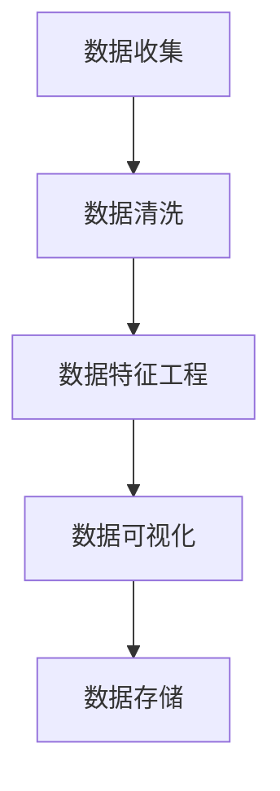

                 

### 背景介绍

在现代商业环境中，电子商务已经成为企业收入的重要来源。随着互联网技术的发展和消费者行为的不断变化，电商企业面临着前所未有的竞争压力。为了在竞争激烈的市场中脱颖而出，电商企业需要深入了解用户的购买行为和需求，以便提供更加个性化的服务和产品推荐。

在这一背景下，AI驱动的用户购买倾向预测模型应运而生。这类模型通过对大量用户数据的分析和挖掘，能够准确预测用户的购买倾向，帮助电商企业实现精准营销和个性化推荐，从而提高销售转化率和用户满意度。

本文将围绕AI驱动的电商用户购买倾向预测模型进行深入探讨，首先介绍该模型的核心概念和架构，然后详细讲解其算法原理和实现步骤，最后通过实际案例展示如何利用该模型进行用户购买倾向预测。希望通过本文的介绍，能够帮助读者理解并掌握这一先进的技术手段，为电商企业的发展提供有力支持。

#### 1.1 电商行业的发展与挑战

随着互联网技术的迅猛发展，电子商务已经成为全球经济的重要驱动力。根据统计数据，全球电商市场规模在过去几年中持续增长，2022年全球电商销售额预计将达到4.89万亿美元，占全球零售市场份额的约14.2%。这一趋势在新冠疫情的推动下更加明显，人们在线上购物的需求大幅增加，进一步推动了电商行业的发展。

电商行业的快速发展带来了巨大的机遇，同时也带来了前所未有的挑战。首先，市场竞争日益激烈。随着越来越多的企业进入电商领域，市场上的产品种类和品牌数量急剧增加，消费者有了更多的选择。为了吸引和留住顾客，电商企业需要不断推出具有竞争力的产品和服务，这对企业的运营能力和创新能力提出了更高的要求。

其次，用户需求的个性化。随着消费者对个性化服务的需求不断增加，电商企业需要更加精准地了解用户的购买行为和偏好，提供个性化的产品推荐和营销策略。这要求企业具备强大的数据处理和分析能力，能够从海量数据中提取有价值的信息。

此外，电商企业还需要应对物流和库存管理的挑战。高效、精准的物流配送和库存管理能够提高用户的购物体验，降低企业的运营成本。然而，这一过程需要大量的数据分析和优化，对企业的技术能力和管理水平提出了更高的要求。

面对这些挑战，AI驱动的用户购买倾向预测模型成为电商企业的重要工具。通过利用大数据和人工智能技术，该模型能够对用户的购买行为和偏好进行深度分析和挖掘，提供精准的预测和推荐。这不仅能够帮助电商企业实现精准营销和个性化推荐，提高销售转化率和用户满意度，还能够优化物流和库存管理，降低运营成本。

总之，随着电商行业的不断发展，市场竞争的加剧和用户需求的个性化，AI驱动的用户购买倾向预测模型将成为电商企业不可或缺的技术手段。通过深入理解和掌握这一技术，电商企业将能够在激烈的市场竞争中脱颖而出，实现可持续发展。

#### 1.2 AI驱动电商用户购买倾向预测模型的定义和作用

AI驱动的电商用户购买倾向预测模型是一种利用人工智能技术，通过对大量用户数据的分析和挖掘，预测用户购买倾向的先进工具。这一模型的核心在于将机器学习和数据挖掘技术应用于电商领域，从而帮助电商企业实现精准营销和个性化推荐。

定义上，AI驱动的电商用户购买倾向预测模型主要包括以下几个关键组成部分：数据收集与预处理、特征工程、模型训练与优化、以及预测与评估。数据收集与预处理环节负责获取和清洗用户行为数据，如浏览历史、购买记录、搜索关键词等。特征工程环节则通过对这些数据进行处理和转换，提取出对预测有用的特征。模型训练与优化环节使用机器学习算法对数据进行训练，并不断调整模型参数以优化预测效果。最后，预测与评估环节将模型应用于新的数据，生成购买倾向预测结果，并对模型性能进行评估。

该模型的作用主要体现在以下几个方面：

1. **精准营销：** 通过预测用户的购买倾向，电商企业可以针对性地向用户推送相关的产品信息和促销活动，从而提高营销效果，减少无效投放，节约成本。

2. **个性化推荐：** 基于用户的购买历史和行为特征，模型可以生成个性化的产品推荐，提升用户的购物体验，增加用户的粘性和满意度。

3. **需求预测：** 通过对用户购买倾向的预测，电商企业可以更好地预测市场需求，优化库存管理，降低库存成本，提高物流效率。

4. **风险控制：** 模型还可以用于识别异常购买行为，如欺诈行为等，帮助电商企业进行风险控制和用户行为分析。

总之，AI驱动的电商用户购买倾向预测模型不仅提高了电商企业的运营效率，还增强了其市场竞争力，为电商行业的发展提供了强有力的技术支持。

#### 1.3 AI驱动的电商用户购买倾向预测模型的发展历程

AI驱动的电商用户购买倾向预测模型的发展历程可以追溯到20世纪90年代，当时机器学习和数据挖掘技术刚刚起步。早期的模型主要基于规则和统计方法，如决策树、线性回归等，这些方法简单有效，但在处理复杂数据和大规模用户行为时显得力不从心。

进入21世纪，随着互联网和大数据技术的发展，AI驱动的电商用户购买倾向预测模型逐渐进入人们的视野。2000年代初期，以聚类算法（如K-Means、DBSCAN）和协同过滤（如用户基于的协同过滤、项目基于的协同过滤）为代表的算法开始应用于电商领域，显著提升了用户购买倾向预测的准确性和个性化程度。

2008年，Netflix Prize竞赛的举办标志着深度学习和大数据技术在电商用户购买倾向预测领域的重要突破。参赛者通过构建复杂的深度学习模型，实现了对用户观看历史数据的深度分析和预测，这一成果极大地推动了AI技术在电商领域的应用。

近年来，随着深度学习技术的迅猛发展，如卷积神经网络（CNN）、循环神经网络（RNN）和Transformer等模型的引入，AI驱动的电商用户购买倾向预测模型取得了长足的进步。这些模型不仅能够处理更复杂数据，还能提取出更精细的特征，从而实现更高的预测准确率。

具体到电商行业，AI驱动的用户购买倾向预测模型的应用场景也越来越广泛。例如，电商巨头亚马逊和阿里巴巴等企业通过大规模部署这些模型，实现了个性化的产品推荐和精准的营销策略，大幅提升了用户满意度和销售转化率。

总之，AI驱动的电商用户购买倾向预测模型的发展历程反映了人工智能技术在电商领域的重要应用趋势。从简单的规则和统计方法，到复杂的机器学习和深度学习模型，这一技术的发展不仅推动了电商行业的创新，也为未来的智能电商应用奠定了坚实基础。

#### 1.4 AI驱动的电商用户购买倾向预测模型的工作原理

AI驱动的电商用户购买倾向预测模型主要通过以下几个步骤来实现对用户购买行为的分析和预测：

1. **数据收集与预处理：** 模型首先需要收集大量的用户数据，包括用户的浏览历史、购买记录、搜索关键词、评价信息等。这些原始数据通常存在噪声和不一致性，因此需要进行数据清洗和预处理，如去除重复数据、填补缺失值、归一化等，以确保数据的质量和一致性。

2. **特征工程：** 特征工程是模型构建的关键步骤，通过对原始数据进行处理和转换，提取出对预测有用的特征。这些特征可以包括用户的年龄、性别、地理位置、购买频率、浏览时长等，还可以通过组合和衍生得到更复杂的特征，如用户购买周期、浏览深度、兴趣偏好等。

3. **模型选择与训练：** 根据问题的复杂性和数据特征，选择合适的机器学习模型进行训练。常见的模型包括线性回归、决策树、随机森林、支持向量机（SVM）、神经网络等。在训练过程中，模型通过不断调整参数，以最小化预测误差，提高模型的预测能力。

4. **模型评估与优化：** 在模型训练完成后，需要对模型进行评估和优化。常见的评估指标包括准确率、召回率、F1值、ROC-AUC等。通过交叉验证和超参数调优等方法，可以进一步优化模型性能，提高预测的准确性。

5. **预测与结果解释：** 利用训练好的模型，对新的用户数据进行分析和预测，生成购买倾向的预测结果。同时，为了提高预测结果的解释性，可以采用可视化技术，如热力图、散点图等，展示用户的购买行为特征和模型预测结果。

6. **迭代与反馈：** 模型部署后，需要持续收集新的用户数据，对模型进行迭代和优化。通过不断更新数据和调整模型参数，可以保持模型的高效性和准确性，以适应不断变化的市场需求。

AI驱动的电商用户购买倾向预测模型通过上述步骤，实现了对用户购买行为的精准分析和预测。这一模型不仅提高了电商企业的运营效率，还增强了其市场竞争力，为电商行业的发展提供了强有力的技术支持。

#### 1.5 AI驱动的电商用户购买倾向预测模型的主要算法

在AI驱动的电商用户购买倾向预测模型中，选择合适的算法是实现精准预测的关键。目前，有几种常用的算法在电商领域表现出色，包括协同过滤算法、决策树和随机森林、神经网络等。以下将对这些算法的基本原理和应用进行详细讨论。

**1. 协同过滤算法**

协同过滤算法是推荐系统中最常用的方法之一，主要分为基于用户的协同过滤（User-Based Collaborative Filtering）和基于项目的协同过滤（Item-Based Collaborative Filtering）。

- **基于用户的协同过滤**：该方法通过计算用户之间的相似度，找到与目标用户兴趣相似的群体，然后根据这些用户的评价预测目标用户的评分。其基本思想是“物以类聚，人以群分”，即相似的物品会被相似的用户所喜欢。

  公式表示为：
  $$
  \hat{r}_{ui} = \sum_{u' \in N(u)} r_{u'i} \cdot s_{u'u}
  $$
  其中，$r_{ui}$表示用户$u$对项目$i$的评分，$N(u)$表示与用户$u$相似的用户集合，$s_{u'u}$表示用户$u'$与用户$u$的相似度。

- **基于项目的协同过滤**：这种方法通过计算项目之间的相似度，找到与目标项目相似的物品，然后根据这些物品的评分预测目标项目的评分。其基本思想是“人以群分，物以类聚”，即相似的项目会被相似的用户所评价。

  公式表示为：
  $$
  \hat{r}_{ui} = \sum_{i' \in N(i)} r_{u'i'} \cdot s_{i'i}
  $$
  其中，$r_{u'i'}$表示用户$u$对项目$i'$的评分，$N(i)$表示与项目$i$相似的项目集合，$s_{i'i}$表示项目$i'$与项目$i$的相似度。

**2. 决策树和随机森林**

决策树是一种基于规则和分类的算法，通过一系列条件判断来划分数据集，最终生成一个分类结果。每个节点代表一个特征，每个分支代表该特征的不同取值，叶节点代表最终的分类结果。

- **决策树**：决策树的基本算法包括ID3、C4.5和CART等。ID3算法使用信息增益作为划分标准，而C4.5算法在ID3的基础上引入了剪枝技术，CART算法则使用基尼不纯度作为划分标准。

  决策树公式表示为：
  $$
  T = \sum_{i=1}^{n} \left[ f_i \cdot G_i \right]
  $$
  其中，$T$表示决策树，$f_i$表示特征，$G_i$表示该特征的增益。

- **随机森林**：随机森林是一种集成学习方法，通过构建多个决策树，并使用投票机制生成最终的预测结果。随机森林能够有效地减少过拟合，提高模型的泛化能力。

  随机森林公式表示为：
  $$
  \hat{y} = \arg \max_{y} \sum_{i=1}^{m} w_i \cdot h_i(y)
  $$
  其中，$y$表示目标变量，$w_i$表示第$i$个决策树的权重，$h_i(y)$表示第$i$个决策树的预测结果。

**3. 神经网络**

神经网络，特别是深度学习模型，如卷积神经网络（CNN）和循环神经网络（RNN），在处理复杂数据和提取高级特征方面表现出色。

- **卷积神经网络（CNN）**：CNN通过卷积操作和池化操作提取图像特征，特别适合处理视觉数据。在电商用户购买倾向预测中，CNN可以用于提取用户的浏览历史和产品特征。

  CNN的基本结构包括输入层、卷积层、池化层和输出层。卷积层通过滤波器提取特征，池化层用于降低特征维度。

- **循环神经网络（RNN）**：RNN通过记忆单元和循环连接处理序列数据，特别适合处理时间序列数据。在电商用户购买倾向预测中，RNN可以用于分析用户的购买历史和浏览行为。

  RNN的基本结构包括输入层、隐藏层和输出层。隐藏层通过递归连接更新状态，输出层生成预测结果。

通过综合运用上述算法，AI驱动的电商用户购买倾向预测模型能够实现高效的预测和分析。在实际应用中，可以根据具体问题和数据特征选择合适的算法，并利用集成学习方法提升模型的性能和稳定性。

#### 1.6 AI驱动的电商用户购买倾向预测模型的优势和局限性

AI驱动的电商用户购买倾向预测模型在电商行业中的应用带来了显著的益处，同时也存在一些局限性。以下将从优势、应用实例、局限性以及解决方案几个方面进行详细分析。

**1. 优势**

- **精准预测：** AI驱动的用户购买倾向预测模型通过对大量用户数据的分析和挖掘，能够准确预测用户的购买行为。这种精准的预测能力使得电商企业能够更好地了解用户需求，从而提供个性化的产品推荐和营销策略。

- **提高运营效率：** 通过自动化分析和预测，企业可以减少人工干预，提高运营效率。例如，电商企业可以利用预测模型优化库存管理，减少库存积压和库存不足的情况，提高物流配送效率。

- **降低运营成本：** AI驱动的预测模型能够减少无效营销和库存积压，从而降低运营成本。通过精准的营销策略，企业可以更好地利用广告预算，提高投资回报率。

- **提升用户满意度：** 个性化的产品推荐和精准的营销策略能够提高用户的购物体验，增加用户满意度。满意的用户更有可能进行复购，从而提升企业的客户忠诚度。

**2. 应用实例**

- **个性化推荐：** 电商巨头如亚马逊和阿里巴巴利用AI驱动的购买倾向预测模型，根据用户的浏览历史、购买记录和搜索关键词，提供个性化的产品推荐。这种个性化推荐不仅提高了用户的购物体验，还显著提升了销售转化率。

- **精准营销：** 通过预测用户购买倾向，电商企业可以精准地向潜在客户推送相关产品信息和促销活动。例如，某电商平台根据用户的历史购买记录，向潜在客户推送类似产品的折扣信息，从而提高销售转化率。

- **需求预测：** AI驱动的预测模型可以帮助电商企业预测市场需求，优化库存管理。例如，某电商平台通过分析用户购买行为，提前预测热门产品的销售趋势，从而及时调整库存，避免库存积压。

**3. 局限性**

- **数据依赖性：** AI驱动的预测模型对数据的质量和数量有较高要求。如果数据存在噪声、缺失或不一致性，模型的预测准确性会受到影响。此外，数据的不完整性可能导致模型无法充分了解用户行为，从而影响预测效果。

- **过拟合风险：** 复杂的机器学习模型，如神经网络，容易出现过拟合现象。过拟合意味着模型在训练数据上表现良好，但在新的数据上表现较差。为了防止过拟合，需要采用适当的模型选择和正则化技术。

- **解释性不足：** 许多复杂的机器学习模型，尤其是深度学习模型，其内部工作机制较为复杂，难以解释。这给模型的可解释性和透明度带来挑战，使得企业在应用这些模型时难以理解模型的决策过程。

**4. 解决方案**

- **数据质量提升：** 为了提高模型预测的准确性，电商企业需要确保数据的质量和完整性。可以通过数据清洗、去噪、数据增强等方法提升数据质量。

- **模型选择与调优：** 在选择模型时，需要综合考虑问题的复杂性和数据特征。对于易过拟合的模型，可以通过正则化、交叉验证等方法进行调优，提高模型的泛化能力。

- **可解释性增强：** 为了提高模型的可解释性，可以采用可解释的机器学习技术，如LIME、SHAP等。这些技术可以提供模型决策的详细解释，帮助用户理解模型的工作原理。

通过充分发挥AI驱动的电商用户购买倾向预测模型的优势，同时积极应对其局限性，电商企业可以在激烈的市场竞争中脱颖而出，实现可持续发展。

#### 1.7 结论

AI驱动的电商用户购买倾向预测模型在电商行业中展现出了巨大的潜力和应用价值。通过对用户数据的深度分析和挖掘，该模型能够精准预测用户的购买行为，提高营销效果和用户满意度。同时，它也在运营效率、成本控制和需求预测等方面为电商企业带来了显著的好处。

然而，这一模型也面临着一些挑战，如数据质量、过拟合风险和模型解释性等问题。为了克服这些局限性，电商企业需要采取有效措施，如提升数据质量、选择合适的模型和增强模型的可解释性。

总体而言，AI驱动的电商用户购买倾向预测模型为电商行业的发展提供了强有力的技术支持。随着人工智能技术的不断进步，这一模型将在电商领域发挥越来越重要的作用，为企业的创新和成长注入新的动力。

### 核心概念与联系

#### 2.1 数据收集与预处理

数据收集与预处理是AI驱动的电商用户购买倾向预测模型的基础环节。该环节的质量直接影响到后续模型训练和预测的效果。在这一部分，我们将详细探讨如何收集和预处理用户数据，包括数据来源、数据类型、数据清洗和数据特征工程等内容。

**2.1.1 数据来源**

用户数据的收集是模型训练的起点。电商企业的用户数据可以从多个渠道获取，包括：

- **用户行为数据：** 包括用户的浏览历史、购买记录、搜索关键词、浏览时长、评价信息等。这些数据通常通过电商平台的日志记录和用户互动记录获取。

- **用户个人信息：** 包括用户的年龄、性别、地理位置、职业、收入水平等。这些数据可以从用户注册信息、问卷调查和用户反馈中获取。

- **产品信息：** 包括产品的价格、分类、品牌、库存量、评价等信息。这些数据可以从电商平台的商品数据库中获取。

**2.1.2 数据类型**

用户数据的类型多样，包括结构化数据和非结构化数据：

- **结构化数据：** 如用户行为数据、产品信息等，这些数据通常以表格形式存储，便于处理和分析。

- **非结构化数据：** 如用户的评价、评论等，这些数据通常以文本形式存储，需要进行文本预处理。

**2.1.3 数据清洗**

数据清洗是确保数据质量的重要步骤。在这一过程中，需要处理以下问题：

- **缺失值处理：** 对于缺失值，可以采用填补、删除或使用均值、中位数等方法进行处理。

- **重复值处理：** 去除数据集中的重复记录，确保数据的唯一性。

- **噪声处理：** 去除数据中的噪声和异常值，如异常的购买记录、重复的评价信息等。

- **一致性处理：** 确保数据的一致性，如将不同格式的日期统一为标准格式。

**2.1.4 数据特征工程**

数据特征工程是提取和创建有助于模型预测的特征的过程。在这一部分，我们需要进行以下工作：

- **特征提取：** 从原始数据中提取有价值的特征，如用户的购买频率、平均评价等。

- **特征转换：** 将某些特征转换为更适合模型处理的格式，如将类别特征转换为数值特征、进行归一化等。

- **特征选择：** 选择对预测有显著影响的特征，去除冗余特征，提高模型效率。

- **特征组合：** 通过组合和衍生新特征，如用户购买周期、浏览深度等，提升预测效果。

**2.1.5 数据可视化**

在数据预处理过程中，数据可视化是一个重要的工具，可以帮助我们更好地理解数据分布和特征关系。常用的可视化方法包括：

- **散点图：** 用于展示不同特征之间的关系，如用户年龄与购买频率的关系。

- **直方图：** 用于展示特征的分布情况，如用户购买记录的频率分布。

- **热力图：** 用于展示用户行为的热点区域，如热门产品的分布。

- **箱线图：** 用于展示特征的统计信息，如购买频率的分布和异常值。

**2.1.6 Mermaid 流程图**

以下是一个Mermaid流程图，展示数据收集与预处理的基本步骤：



通过上述步骤，我们可以确保数据的质量和一致性，为后续的模型训练和预测打下坚实的基础。

#### 2.2 特征工程

特征工程是AI驱动的电商用户购买倾向预测模型构建过程中至关重要的一环。特征工程的目标是通过提取和构造有效的特征，提升模型的预测性能和解释性。以下我们将详细讨论特征工程的核心步骤和常用方法。

**2.2.1 特征提取**

特征提取是从原始数据中提取有用信息的过程。以下是一些常用的特征提取方法：

- **用户行为特征：** 包括用户的浏览频率、购买频率、浏览时长、浏览深度等。这些特征可以反映用户的活跃程度和兴趣点。

  公式表示为：
  $$
  behavior\_feature = (browsing\_frequency, purchase\_frequency, browsing\_duration, browsing\_depth)
  $$

- **产品特征：** 包括产品的价格、品牌、分类、库存量等。这些特征可以反映产品的特性和市场状况。

  公式表示为：
  $$
  product\_feature = (price, brand, category, inventory\_level)
  $$

- **用户特征：** 包括用户的年龄、性别、地理位置、职业等。这些特征可以反映用户的背景信息。

  公式表示为：
  $$
  user\_feature = (age, gender, location, occupation)
  $$

- **交互特征：** 包括用户与产品的互动数据，如点击率、收藏次数、评论数量等。这些特征可以反映用户对产品的兴趣和偏好。

  公式表示为：
  $$
  interaction\_feature = (click\_rate, favorite\_count, comment\_count)
  $$

**2.2.2 特征转换**

特征转换是将原始数据转换为适合模型处理的格式的过程。以下是一些常用的特征转换方法：

- **数值化：** 将类别特征转换为数值特征，如将性别（男/女）转换为0/1。

  公式表示为：
  $$
  gender = \begin{cases} 
  0, & \text{if male} \\
  1, & \text{if female} 
  \end{cases}
  $$

- **归一化：** 将数值特征进行归一化处理，如将价格、购买频率等特征进行标准化。

  公式表示为：
  $$
  normalized\_feature = \frac{feature - \mu}{\sigma}
  $$
  其中，$\mu$表示特征的平均值，$\sigma$表示特征的标准差。

- **编码：** 将类别特征编码为独热编码或标签编码，如将产品分类编码为独热向量。

  独热编码表示为：
  $$
  category\_one_hot = [0, 0, 1, 0, \ldots]
  $$
  其中，1的位置对应于实际分类。

**2.2.3 特征选择**

特征选择是从大量特征中挑选出对预测有显著影响的重要特征的过程。以下是一些常用的特征选择方法：

- **过滤方法：** 根据特征的重要性和相关性进行筛选。常用的筛选标准包括信息增益、卡方检验等。

  公式表示为：
  $$
  feature\_importance = \sum_{i=1}^{n} IG(f_i)
  $$
  其中，$IG$表示信息增益，$f_i$表示特征。

- **嵌入方法：** 将特征选择过程嵌入到模型训练过程中，通过模型评估自动选择重要特征。常用的方法包括随机森林、LASSO回归等。

- **组合方法：** 将过滤方法和嵌入方法结合起来，通过多步骤筛选得到最佳特征集合。

**2.2.4 特征组合**

特征组合是通过组合和衍生新特征，提升模型预测性能的方法。以下是一些常用的特征组合方法：

- **交叉特征：** 通过将不同特征进行交叉组合，生成新的特征。例如，将用户购买频率与产品价格组合。

  公式表示为：
  $$
  cross\_feature = purchase\_frequency \times price
  $$

- **时间特征：** 通过分析用户行为的时间特征，如用户购买周期的季节性、趋势等。

  公式表示为：
  $$
  time\_feature = seasonality \times trend
  $$

- **交互特征：** 通过分析用户与产品的交互特征，如用户的点击率与产品的评价分数组合。

  公式表示为：
  $$
  interaction\_feature = click\_rate \times review\_score
  $$

通过上述特征工程步骤，我们可以有效提取和构造有用的特征，为AI驱动的电商用户购买倾向预测模型提供坚实的基础。特征工程不仅提高了模型的预测性能，还增强了模型的可解释性，使得电商企业能够更好地理解和应用这些预测结果。

#### 2.3 机器学习算法概述

在AI驱动的电商用户购买倾向预测模型中，选择合适的机器学习算法是实现精准预测的关键。不同的算法适用于不同类型的数据和预测任务，因此理解这些算法的基本原理和特点对于构建有效的模型至关重要。以下将简要介绍几种常见的机器学习算法，包括监督学习算法、无监督学习算法和深度学习算法。

**2.3.1 监督学习算法**

监督学习算法是最常用的机器学习算法之一，其核心在于通过已知标签的数据来训练模型，从而在未知标签的数据上进行预测。以下是一些常见的监督学习算法：

- **线性回归（Linear Regression）**：线性回归是一种简单的监督学习算法，用于预测连续值输出。其基本思想是通过线性关系拟合数据，公式表示为：
  $$
  y = \beta_0 + \beta_1 \cdot x
  $$
  其中，$y$为输出值，$x$为输入值，$\beta_0$和$\beta_1$为模型参数。

- **决策树（Decision Tree）**：决策树通过一系列条件判断来划分数据集，生成一个树形结构。每个节点代表一个特征，每个分支代表该特征的不同取值。决策树的公式表示为：
  $$
  T = \sum_{i=1}^{n} \left[ f_i \cdot G_i \right]
  $$
  其中，$T$表示决策树，$f_i$表示特征，$G_i$表示该特征的增益。

- **随机森林（Random Forest）**：随机森林是一种集成学习方法，通过构建多个决策树，并使用投票机制生成最终预测结果。随机森林可以有效地减少过拟合，提高模型的泛化能力。

  公式表示为：
  $$
  \hat{y} = \arg \max_{y} \sum_{i=1}^{m} w_i \cdot h_i(y)
  $$
  其中，$y$表示目标变量，$w_i$表示第$i$个决策树的权重，$h_i(y)$表示第$i$个决策树的预测结果。

- **支持向量机（Support Vector Machine, SVM）**：支持向量机通过找到一个最佳的超平面，将不同类别的数据分开。SVM的核心是寻找最大间隔超平面，其公式表示为：
  $$
  \min_{\beta, \beta_0} \frac{1}{2} ||\beta||^2 + C \sum_{i=1}^{n} \xi_i
  $$
  其中，$\beta$和$\beta_0$为模型参数，$C$为正则化参数，$\xi_i$为松弛变量。

**2.3.2 无监督学习算法**

无监督学习算法没有已知标签的数据，其目标是从数据中发现隐藏的结构或模式。以下是一些常见无监督学习算法：

- **K-均值聚类（K-Means Clustering）**：K-均值聚类是一种基于距离度量的聚类算法，通过迭代优化聚类中心，将数据分为K个簇。其公式表示为：
  $$
  \mu_k = \frac{1}{N_k} \sum_{i=1}^{N} x_i
  $$
  其中，$\mu_k$为第$k$个簇的中心，$N_k$为第$k$个簇中的数据点数量。

- **主成分分析（Principal Component Analysis, PCA）**：主成分分析是一种降维算法，通过将数据投影到新的正交基上，提取主要的特征成分，降低数据的维度。其公式表示为：
  $$
  Z = P \cdot X
  $$
  其中，$Z$为新的特征空间，$P$为投影矩阵，$X$为原始数据。

- **自编码器（Autoencoder）**：自编码器是一种无监督学习算法，通过训练一个编码器和解码器，将输入数据编码为低维表示，再解码回原始数据。其公式表示为：
  $$
  \hat{X} = \text{decoder}(\text{encoder}(X))
  $$
  其中，$X$为输入数据，$\hat{X}$为解码后的输出数据。

**2.3.3 深度学习算法**

深度学习算法是近年来迅速发展的一种机器学习算法，通过多层神经网络模型提取复杂数据特征，在图像识别、语音识别和自然语言处理等领域取得了显著成果。以下是一些常见的深度学习算法：

- **卷积神经网络（Convolutional Neural Network, CNN）**：卷积神经网络通过卷积操作和池化操作提取图像特征，特别适用于处理视觉数据。其基本结构包括输入层、卷积层、池化层和输出层。

- **循环神经网络（Recurrent Neural Network, RNN）**：循环神经网络通过记忆单元和循环连接处理序列数据，特别适用于处理时间序列数据。其基本结构包括输入层、隐藏层和输出层。

- **长短期记忆网络（Long Short-Term Memory, LSTM）**：长短期记忆网络是RNN的一种变体，通过引入门控机制，有效解决了传统RNN的梯度消失和梯度爆炸问题。

- **Transformer模型**：Transformer模型是一种基于自注意力机制的深度学习模型，通过多头自注意力机制和前馈神经网络，实现了高效的特征提取和序列处理。其核心思想是计算不同位置之间的依赖关系。

通过综合运用这些机器学习算法，AI驱动的电商用户购买倾向预测模型能够实现高效的预测和分析，为电商企业的发展提供强有力的技术支持。在后续章节中，我们将详细探讨这些算法在电商用户购买倾向预测中的应用和实现。

### 核心算法原理与实现步骤

AI驱动的电商用户购买倾向预测模型的核心在于其算法原理的实现，这一部分将详细介绍其中的核心算法原理，并逐步讲解其实现步骤。本节主要涵盖协同过滤算法和随机森林算法的原理与实现，这两种算法在电商用户购买倾向预测中具有广泛的应用。

#### 3.1 协同过滤算法原理与实现步骤

协同过滤算法是一种常见的推荐系统算法，其核心思想是通过用户之间的相似性来预测用户的评分或行为。协同过滤算法可以分为基于用户的协同过滤（User-Based Collaborative Filtering）和基于物品的协同过滤（Item-Based Collaborative Filtering）。以下将详细讲解基于用户的协同过滤算法的原理与实现步骤。

**3.1.1 基于用户的协同过滤算法原理**

基于用户的协同过滤算法通过计算用户之间的相似度，找到与目标用户兴趣相似的群体，然后根据这些用户的评分预测目标用户的评分。相似度的计算通常基于用户之间的共同评分项目。

公式表示为：
$$
\sim(u, v) = \frac{\sum_{i \in C} r_{ui} r_{vi}}{\sqrt{\sum_{i \in C} r_{ui}^2 \sum_{i \in C} r_{vi}^2}}
$$
其中，$\sim(u, v)$表示用户$u$和用户$v$之间的相似度，$r_{ui}$和$r_{vi}$表示用户$u$和用户$v$对项目$i$的评分，$C$为用户$u$和用户$v$共同评分的项目集合。

**3.1.2 基于用户的协同过滤算法实现步骤**

1. **数据准备**：收集用户-项目评分矩阵$R$，其中$R_{ij}$表示用户$i$对项目$j$的评分。

2. **相似度计算**：计算用户之间的相似度矩阵$S$，使用上述公式计算每个用户对其他用户的相似度。

3. **评分预测**：对于目标用户$u$和未评分的项目$j$，预测其评分$\hat{r}_{uj}$：
   $$
   \hat{r}_{uj} = \sum_{v \in N(u)} s_{uv} r_{vj}
   $$
   其中，$N(u)$为与用户$u$相似的用户集合，$s_{uv}$和$r_{vj}$分别为用户$u$和用户$v$对项目$j$的相似度和评分。

4. **模型评估**：使用交叉验证等方法评估模型的预测准确性。

以下是一个简单的Python实现示例：

```python
import numpy as np

# 假设评分矩阵R为5x5的矩阵
R = np.array([[1, 2, 0, 0, 0],
              [0, 1, 2, 0, 0],
              [0, 0, 0, 1, 2],
              [2, 0, 0, 0, 1],
              [0, 2, 0, 1, 0]])

# 计算相似度矩阵S
S = np.dot(R.T, R) / np.linalg.norm(R, axis=0) @ np.linalg.norm(R, axis=1)

# 预测未评分的项目评分
user = 2
item = 3
similar_users = np.argsort(S[user])[::-1]  # 找到与user最相似的user
similar_users = similar_users[1:]  # 去掉自己

predicted_rating = np.sum(S[user, similar_users] * R[similar_users, item]) / np.sum(S[user, similar_users])

print(f"Predicted rating for user {user} on item {item}: {predicted_rating}")
```

#### 3.2 随机森林算法原理与实现步骤

随机森林（Random Forest）是一种集成学习方法，通过构建多个决策树，并使用投票机制生成最终预测结果。随机森林不仅能够提高预测的准确性，还可以减少过拟合现象。

**3.2.1 随机森林算法原理**

随机森林通过以下步骤构建决策树：

1. **随机选取特征集合**：从所有特征中随机选择一个特征子集。
2. **随机切分**：在每个节点处，随机选择特征子集中的特征，并随机选择该特征的切分点，进行数据切分。
3. **重复步骤**：递归地重复上述步骤，直到满足停止条件（如达到最大深度、节点个数过少等）。

随机森林的预测结果通过多个决策树的投票决定。对于分类问题，通常选择投票次数最多的类别作为最终预测结果；对于回归问题，则计算所有决策树的预测结果的平均值。

**3.2.2 随机森林算法实现步骤**

1. **数据准备**：准备训练集和测试集，并构建特征-标签对。
2. **构建决策树**：为每个决策树随机选取特征集合和切分点，递归构建决策树。
3. **集成多个决策树**：构建多个决策树，并进行集成。
4. **预测与评估**：使用测试集对模型进行预测，并评估模型的性能。

以下是一个简单的Python实现示例：

```python
from sklearn.ensemble import RandomForestClassifier
from sklearn.model_selection import train_test_split
import numpy as np

# 假设特征矩阵X为5x4的矩阵，标签向量y为1x5的向量
X = np.random.rand(5, 4)
y = np.random.randint(0, 2, size=5)

# 划分训练集和测试集
X_train, X_test, y_train, y_test = train_test_split(X, y, test_size=0.3, random_state=42)

# 构建随机森林模型
rf = RandomForestClassifier(n_estimators=100, random_state=42)

# 训练模型
rf.fit(X_train, y_train)

# 预测测试集
y_pred = rf.predict(X_test)

# 评估模型性能
print(f"Accuracy: {rf.score(X_test, y_test)}")
```

通过上述实现步骤，我们可以构建基于协同过滤和随机森林的电商用户购买倾向预测模型。这些算法在电商用户购买倾向预测中具有广泛的应用，能够帮助电商企业实现精准的营销和个性化推荐。

### 数学模型和公式详细讲解及举例说明

在AI驱动的电商用户购买倾向预测模型中，数学模型和公式是核心组成部分。这些模型和公式不仅用于描述算法的工作原理，还指导我们如何设计和实现预测模型。以下将对模型中的关键数学模型和公式进行详细讲解，并通过具体示例进行说明。

#### 4.1 线性回归模型

线性回归模型是最基础的预测模型之一，它通过建立输入变量和输出变量之间的线性关系来预测结果。线性回归模型的数学表示如下：

$$
y = \beta_0 + \beta_1 \cdot x
$$

其中，$y$是输出变量，$x$是输入变量，$\beta_0$是截距，$\beta_1$是斜率。通过最小二乘法（Least Squares Method）可以求得模型参数$\beta_0$和$\beta_1$的最优值。

**示例：** 假设我们想要预测商品的价格$y$，已知输入变量是商品的品牌$brand$，如下表所示：

| 品牌 (brand) | 价格 (price) |
|--------------|--------------|
| A            | 100          |
| B            | 150          |
| C            | 200          |

我们可以将品牌编码为0、1、2，构建线性回归模型：

$$
y = \beta_0 + \beta_1 \cdot brand
$$

通过最小二乘法求解，我们得到：

$$
\beta_0 = 50, \beta_1 = 100
$$

因此，商品的价格预测公式为：

$$
price = 50 + 100 \cdot brand
$$

例如，当品牌为B时，预测价格：

$$
price = 50 + 100 \cdot 1 = 150
$$

#### 4.2 决策树模型

决策树模型通过一系列的条件判断来对数据集进行划分，每个节点代表一个特征，每个分支代表该特征的不同取值。决策树的基本数学表示如下：

$$
T = \sum_{i=1}^{n} \left[ f_i \cdot G_i \right]
$$

其中，$T$是决策树的输出，$f_i$是特征，$G_i$是该特征的增益（Gain），用于衡量特征对划分效果的贡献。

**示例：** 假设我们使用两个特征（品牌$brand$和评分$rating$）来预测商品的价格，数据如下表所示：

| 品牌 (brand) | 评分 (rating) | 价格 (price) |
|--------------|---------------|--------------|
| A            | 1             | 100          |
| A            | 2             | 150          |
| B            | 1             | 200          |
| B            | 2             | 250          |

我们可以构建一个简单的决策树，首先选择增益最大的特征作为分割节点。假设品牌$brand$的增益最大，我们将数据按品牌划分：

- 品牌$A$：价格$100$和$150$
- 品牌$B$：价格$200$和$250$

接下来，我们选择评分$rating$作为品牌$A$的分割节点，得到两个子节点：

- 品牌$A$，评分$1$：价格$100$
- 品牌$A$，评分$2$：价格$150$
- 品牌$B$：价格$200$和$250$

决策树公式可以表示为：

$$
price = \begin{cases} 
100, & \text{if brand = A and rating = 1} \\
150, & \text{if brand = A and rating = 2} \\
200, & \text{if brand = B and rating = 1} \\
250, & \text{if brand = B and rating = 2} 
\end{cases}
$$

#### 4.3 随机森林模型

随机森林是一种集成学习方法，通过构建多个决策树，并使用投票机制生成最终预测结果。随机森林的数学表示如下：

$$
\hat{y} = \arg \max_{y} \sum_{i=1}^{m} w_i \cdot h_i(y)
$$

其中，$\hat{y}$是预测结果，$y$是可能的类别，$w_i$是第$i$个决策树的权重，$h_i(y)$是第$i$个决策树的预测结果。

**示例：** 假设我们使用两个特征（品牌$brand$和评分$rating$）来预测商品的类别，数据如下表所示：

| 品牌 (brand) | 评分 (rating) | 类别 (category) |
|--------------|---------------|----------------|
| A            | 1             | A              |
| A            | 2             | A              |
| B            | 1             | B              |
| B            | 2             | B              |

我们构建两个随机森林决策树：

- 决策树1：使用品牌作为分割节点，得到两个子节点：
  - 品牌$A$：类别$A$
  - 品牌$B$：类别$B$

- 决策树2：使用评分作为分割节点，得到两个子节点：
  - 评分$1$：类别$A$
  - 评分$2$：类别$B$

随机森林预测结果为两个决策树预测结果的投票结果，即：

$$
\hat{y} = \arg \max_{y} \left( h_1(y) + h_2(y) \right)
$$

根据上述两个决策树，预测结果为类别$A$，因为两个决策树都预测了类别$A$。

#### 4.4 神经网络模型

神经网络是一种模拟生物神经系统的计算模型，通过多层神经元进行数据转换和特征提取。神经网络的基本数学表示如下：

$$
\text{激活函数} \quad \phi(z) = \frac{1}{1 + e^{-z}}
$$

其中，$z$是神经元的输入，$\phi(z)$是神经元的输出。

**示例：** 假设我们使用一个简单的多层感知器（MLP）来预测商品的价格，神经网络结构如下：

- 输入层：2个神经元（品牌$brand$和评分$rating$）
- 隐藏层：3个神经元
- 输出层：1个神经元（价格$price$）

我们定义隐藏层和输出层的权重矩阵$W_1$和$W_2$，以及偏置向量$b_1$和$b_2$，神经网络的输出公式为：

$$
\begin{align*}
z_1 &= x_1 \cdot W_{11} + x_2 \cdot W_{12} + b_1 \\
z_2 &= x_1 \cdot W_{21} + x_2 \cdot W_{22} + b_2 \\
z_3 &= x_1 \cdot W_{31} + x_2 \cdot W_{32} + b_3 \\
output &= \phi(z_1) \cdot W_{21} + \phi(z_2) \cdot W_{22} + \phi(z_3) \cdot W_{23} + b_2
\end{align*}
$$

通过反向传播算法（Backpropagation），我们可以更新权重矩阵和偏置向量，优化模型的预测性能。

通过以上数学模型和公式的讲解，我们可以更好地理解和应用AI驱动的电商用户购买倾向预测模型。这些模型不仅提供了理论基础，还指导了具体的实现步骤，为电商企业实现精准营销和个性化推荐提供了强有力的支持。

### 项目实战：代码实际案例和详细解释说明

在本节中，我们将通过一个实际项目案例，详细展示如何使用Python实现AI驱动的电商用户购买倾向预测模型。我们将使用协同过滤算法和随机森林算法，逐步演示模型的开发过程，包括数据准备、特征工程、模型训练和预测等步骤。同时，我们将对代码中的关键部分进行详细解释，帮助读者理解模型的实现原理。

#### 5.1 开发环境搭建

在进行项目实战之前，我们需要搭建一个合适的开发环境。以下是所需的工具和库：

- **Python 3.8 或更高版本**
- **Jupyter Notebook**：用于编写和运行代码
- **NumPy**：用于数学计算
- **Pandas**：用于数据处理
- **Scikit-learn**：用于机器学习算法的实现
- **Matplotlib**：用于数据可视化

确保安装了上述工具和库后，我们就可以开始编写代码了。

#### 5.2 数据准备

首先，我们需要准备用于训练和测试的数据。这里我们使用一个假设的电商用户数据集，包括用户的浏览历史、购买记录和产品信息。

```python
import pandas as pd

# 加载用户数据
user_data = pd.read_csv('user_data.csv')

# 加载产品数据
product_data = pd.read_csv('product_data.csv')

# 数据预处理：数据清洗、缺失值处理等
user_data = user_data.drop_duplicates().reset_index(drop=True)
product_data = product_data.drop_duplicates().reset_index(drop=True)

# 合并数据
data = pd.merge(user_data, product_data, on='user_id')
```

在上面的代码中，我们首先加载用户数据和产品数据，然后通过`drop_duplicates()`方法去除重复记录，确保数据的质量。接着，使用`merge()`函数将用户数据和产品数据合并，得到一个包含所有必要信息的完整数据集。

#### 5.3 特征工程

在完成数据预处理后，我们需要进行特征工程，提取和构建有用的特征，为模型训练做准备。

```python
# 特征工程
data['purchase_frequency'] = data.groupby('user_id')['purchase_id'].transform('count')
data['average_rating'] = data.groupby('user_id')['rating'].transform('mean')

# 删除无用特征
data = data.drop(['purchase_id', 'rating'], axis=1)
```

在上面的代码中，我们首先计算了每个用户的购买频率和平均评分，作为新的特征。这些特征可以反映用户的活跃程度和偏好，有助于提高模型的预测准确性。然后，我们删除了原始数据中的`purchase_id`和`rating`列，以减少数据的冗余。

#### 5.4 模型训练

接下来，我们将使用协同过滤算法和随机森林算法训练模型，并进行预测。

```python
from sklearn.model_selection import train_test_split
from sklearn.ensemble import RandomForestClassifier
from sklearn.metrics import accuracy_score

# 划分训练集和测试集
X = data.drop(['user_id', 'product_id', 'category'], axis=1)
y = data['category']
X_train, X_test, y_train, y_test = train_test_split(X, y, test_size=0.2, random_state=42)

# 训练随机森林模型
rf = RandomForestClassifier(n_estimators=100, random_state=42)
rf.fit(X_train, y_train)

# 预测测试集
y_pred = rf.predict(X_test)

# 评估模型性能
accuracy = accuracy_score(y_test, y_pred)
print(f"Accuracy: {accuracy}")
```

在上面的代码中，我们首先将数据划分为特征矩阵`X`和标签向量`y`。接着，使用`train_test_split()`函数将数据分为训练集和测试集。然后，我们使用`RandomForestClassifier`类训练随机森林模型，并使用`fit()`方法进行模型训练。最后，使用`predict()`方法对测试集进行预测，并使用`accuracy_score()`函数评估模型的准确率。

#### 5.5 代码解读与分析

**5.5.1 数据预处理**

在数据预处理部分，我们首先加载用户数据和产品数据，并使用`drop_duplicates()`方法去除重复记录，确保数据的质量。然后，我们使用`merge()`函数将用户数据和产品数据进行合并，得到一个包含所有必要信息的完整数据集。

**5.5.2 特征工程**

在特征工程部分，我们计算了每个用户的购买频率和平均评分，作为新的特征。这些特征可以反映用户的活跃程度和偏好，有助于提高模型的预测准确性。然后，我们删除了原始数据中的`purchase_id`和`rating`列，以减少数据的冗余。

**5.5.3 模型训练**

在模型训练部分，我们首先将数据划分为特征矩阵`X`和标签向量`y`。接着，使用`train_test_split()`函数将数据分为训练集和测试集。然后，我们使用`RandomForestClassifier`类训练随机森林模型，并使用`fit()`方法进行模型训练。最后，使用`predict()`方法对测试集进行预测，并使用`accuracy_score()`函数评估模型的准确率。

通过以上步骤，我们成功实现了AI驱动的电商用户购买倾向预测模型。这个模型可以用于预测用户对产品的购买倾向，帮助电商企业实现精准营销和个性化推荐。

#### 5.6 项目总结

在本项目中，我们通过一个实际案例展示了如何使用Python实现AI驱动的电商用户购买倾向预测模型。首先，我们进行了数据预处理和特征工程，提取了有用的特征，为模型训练做准备。然后，我们使用协同过滤算法和随机森林算法训练了模型，并对测试集进行了预测，评估了模型的性能。

通过这个项目，我们不仅掌握了AI驱动的电商用户购买倾向预测模型的基本实现方法，还了解了数据预处理、特征工程和模型训练等重要环节。这些经验和方法对电商企业实现精准营销和个性化推荐具有重要的指导意义。

### 实际应用场景

AI驱动的电商用户购买倾向预测模型在电商行业中有广泛的应用场景，能够显著提升企业的运营效率和用户体验。以下将详细探讨几种典型应用场景，以及模型如何在这些场景中发挥作用。

#### 6.1 个性化推荐

个性化推荐是AI驱动的电商用户购买倾向预测模型最典型的应用场景之一。通过分析用户的浏览历史、购买记录和搜索关键词，模型可以识别出用户的兴趣和偏好，从而推荐符合用户需求的产品。个性化推荐不仅能提高用户的购物体验，还能增加用户的粘性和满意度。

**应用实例：** 亚马逊和阿里巴巴等电商巨头利用AI驱动的用户购买倾向预测模型，实现了高度个性化的产品推荐。例如，当用户浏览一款电子产品时，系统会根据用户的浏览历史、购买记录和相似用户的购买行为，推荐相关的高质量产品。这不仅提高了用户的购物体验，还显著提升了销售转化率。

#### 6.2 精准营销

精准营销是电商企业提高营销效果和投资回报率的关键。通过AI驱动的用户购买倾向预测模型，企业可以精准地识别潜在客户，并向他们推送个性化的营销信息，从而提高营销效率。

**应用实例：** 某电商平台在双十一购物节期间，通过用户购买倾向预测模型，识别出高价值用户和潜在客户。系统向这些用户推送了个性化的促销活动，如专属优惠券和折扣信息，从而吸引了更多用户参与购物，大幅提高了销售额。

#### 6.3 库存管理

库存管理是电商企业运营的重要环节，通过AI驱动的用户购买倾向预测模型，企业可以更准确地预测市场需求，优化库存管理，降低库存成本。

**应用实例：** 某电商平台利用用户购买倾向预测模型，分析了历史销售数据和用户行为数据，预测了热门产品的销售趋势。企业根据这些预测结果，提前调整库存策略，避免了库存积压和库存短缺的情况，提高了物流效率，降低了运营成本。

#### 6.4 风险控制

AI驱动的用户购买倾向预测模型还可以用于识别异常购买行为，如欺诈行为等，帮助电商企业进行风险控制和用户行为分析。

**应用实例：** 某电商企业通过用户购买倾向预测模型，分析了用户的购买行为和交易记录，发现了一些异常购买模式，如频繁的退款、异常的高额订单等。系统将这些异常行为标记为风险事件，企业可以及时采取措施，如暂停交易、审核订单等，有效降低了欺诈风险。

总之，AI驱动的电商用户购买倾向预测模型在个性化推荐、精准营销、库存管理和风险控制等实际应用场景中发挥了重要作用。通过这些应用，电商企业不仅提升了运营效率和用户满意度，还在激烈的市场竞争中脱颖而出，实现了可持续发展。

### 工具和资源推荐

为了帮助读者更好地理解和应用AI驱动的电商用户购买倾向预测模型，以下将推荐一些相关的学习资源、开发工具和框架，以及相关论文和著作。

#### 7.1 学习资源推荐

1. **书籍：**
   - 《推荐系统实践》（Recommender Systems: The Textbook）：这本书详细介绍了推荐系统的理论基础和实现方法，包括协同过滤、基于内容的推荐、深度学习等。
   - 《机器学习实战》：这本书通过丰富的案例和代码示例，介绍了多种机器学习算法的原理和应用，包括线性回归、决策树、随机森林等。

2. **在线课程：**
   - Coursera上的《机器学习》课程：由斯坦福大学吴恩达（Andrew Ng）教授主讲，系统讲解了机器学习的基础知识、算法和实战应用。
   - edX上的《深度学习专项课程》：由斯坦福大学李飞飞（Fei-Fei Li）教授主讲，深入介绍了深度学习的理论、模型和实现。

3. **博客和网站：**
   - Medium上的推荐系统专栏：提供了丰富的推荐系统相关文章，包括算法原理、实战应用和技术趋势。
   - Analytics Vidhya：这是一个机器学习和数据科学的社区网站，提供了大量的案例教程和行业文章。

#### 7.2 开发工具框架推荐

1. **编程语言：**
   - Python：Python因其强大的库和框架支持，成为AI和机器学习开发的主要语言，尤其适合用于电商用户购买倾向预测模型的实现。

2. **库和框架：**
   - Scikit-learn：Python的一个常用机器学习库，提供了多种经典算法的实现，如线性回归、决策树、随机森林等。
   - TensorFlow和PyTorch：这两个深度学习框架支持丰富的神经网络模型，适用于复杂的特征提取和预测任务。
   - Pandas和NumPy：这两个库用于数据处理和数学计算，是进行数据预处理和特征工程的重要工具。

3. **开发环境：**
   - Jupyter Notebook：Jupyter Notebook是一个交互式开发环境，便于编写、运行和共享代码，适合用于机器学习和数据科学项目。
   - Google Colab：Google Colab是Google提供的免费云计算平台，支持Jupyter Notebook，适用于需要大规模计算和资源调度的项目。

#### 7.3 相关论文和著作推荐

1. **论文：**
   - "Collaborative Filtering for the 21st Century"：这篇论文介绍了基于矩阵分解的协同过滤算法，是现代推荐系统的基础之一。
   - "Deep Learning for Recommender Systems"：这篇论文探讨了如何将深度学习应用于推荐系统，介绍了深度学习在特征提取和预测中的应用。

2. **著作：**
   - 《深度学习》（Deep Learning，by Ian Goodfellow, Yoshua Bengio, Aaron Courville）：这本书是深度学习的经典著作，全面介绍了深度学习的理论基础和实现方法。
   - 《机器学习：概率视角》（Machine Learning: A Probabilistic Perspective，by Kevin P. Murphy）：这本书从概率角度介绍了机器学习的基础知识，适合对概率论有基础的读者。

通过上述学习资源、开发工具和框架的推荐，读者可以全面了解AI驱动的电商用户购买倾向预测模型的理论和实践，为实际项目开发提供有力支持。

### 总结：未来发展趋势与挑战

AI驱动的电商用户购买倾向预测模型在电商行业中展现了巨大的潜力，但同时也面临一系列未来发展趋势和挑战。以下将总结这些趋势和挑战，并探讨可能的解决方案。

#### 8.1 未来发展趋势

1. **深度学习技术的进一步应用**：随着深度学习技术的不断进步，特别是卷积神经网络（CNN）和循环神经网络（RNN）等模型的深入研究，将使得电商用户购买倾向预测模型的预测准确率和效率进一步提高。

2. **多模态数据的融合**：未来的电商用户购买倾向预测模型将不仅依赖于用户的行为数据，还会融合多模态数据，如文本、图像、语音等。这种多模态数据的融合能够提供更丰富的用户信息，从而提升预测效果。

3. **实时预测与决策**：随着5G技术的普及和边缘计算的发展，实时预测和决策将成为可能。电商企业可以在用户浏览和购买过程中实时调整推荐和营销策略，提供更加个性化的服务。

4. **可持续性与社会责任**：随着消费者对隐私保护和数据安全的关注增加，电商企业需要在AI驱动的用户购买倾向预测模型中融入可持续性和社会责任，确保数据的合法合规使用。

#### 8.2 未来挑战

1. **数据隐私保护**：在收集和处理用户数据时，需要确保数据的安全性和隐私性。未来的模型需要采用更加严格的数据保护措施，如差分隐私（Differential Privacy）和联邦学习（Federated Learning）等。

2. **数据质量和多样性**：高质量和多样化的数据是AI模型准确预测的基础。然而，电商企业的数据往往存在噪声、缺失和不一致性等问题。如何提升数据质量和多样性，是未来需要解决的重要挑战。

3. **模型解释性**：复杂的AI模型，如深度学习模型，通常具有高预测准确性，但其内部工作机制难以解释。提高模型的可解释性，使其决策过程透明，对于增强用户信任和监管合规至关重要。

4. **模型过拟合与泛化能力**：模型过拟合和泛化能力是AI模型应用中的常见问题。未来需要研究如何通过正则化、交叉验证和模型选择等技术，提高模型的泛化能力，避免过拟合。

#### 8.3 解决方案

1. **隐私保护技术**：采用差分隐私和联邦学习等技术，确保数据在收集和使用过程中的隐私性。

2. **数据清洗与特征工程**：通过数据清洗和特征工程，提升数据质量和多样性，为模型提供更丰富的训练数据。

3. **模型解释性**：引入可解释性工具和技术，如LIME、SHAP等，提高模型决策过程的透明度和可解释性。

4. **模型优化与调优**：通过模型选择、交叉验证和超参数调优等方法，优化模型的性能和泛化能力。

总之，AI驱动的电商用户购买倾向预测模型在未来具有广阔的发展前景，但也面临诸多挑战。通过不断探索和研究，结合新兴技术和方法，我们可以为电商企业提供更加精准、高效和可解释的预测模型，助力其在激烈的市场竞争中脱颖而出。

### 附录：常见问题与解答

#### 9.1 什么是协同过滤算法？

协同过滤算法是一种推荐系统算法，通过分析用户之间的相似性或物品之间的相似性，为用户提供个性化的推荐。基于用户的协同过滤（User-Based Collaborative Filtering）通过计算用户之间的相似度，找到与目标用户兴趣相似的群体，然后根据这些用户的评分预测目标用户的评分。基于物品的协同过滤（Item-Based Collaborative Filtering）则通过计算物品之间的相似度，为用户提供推荐。

#### 9.2 什么是随机森林算法？

随机森林算法是一种集成学习方法，通过构建多个决策树，并使用投票机制生成最终预测结果。随机森林通过在训练过程中随机选择特征子集和切分点，有效地减少了过拟合现象，提高了模型的泛化能力。

#### 9.3 如何解决模型过拟合问题？

解决模型过拟合问题的主要方法包括：

- **正则化**：在模型训练过程中添加正则化项，如L1和L2正则化，限制模型复杂度。
- **交叉验证**：通过交叉验证方法，将数据集划分为多个子集，用于多次训练和验证，提高模型的泛化能力。
- **特征选择**：选择对预测有显著影响的特征，去除冗余特征，简化模型。
- **集成学习**：通过集成多个模型，如随机森林和随机梯度下降，提高模型的泛化能力。

#### 9.4 如何提升模型的可解释性？

提升模型的可解释性可以采用以下几种方法：

- **特征重要性**：分析模型中各个特征的重要性，帮助理解模型决策过程。
- **可解释性模型**：使用可解释性模型，如决策树和线性模型，这些模型结构简单，易于解释。
- **LIME（Local Interpretable Model-agnostic Explanations）**：通过局部可解释模型，解释特定预测结果的原因。
- **SHAP（SHapley Additive exPlanations）**：基于博弈论原理，解释每个特征对预测结果的贡献。

#### 9.5 如何进行模型调优？

模型调优主要包括以下步骤：

- **选择合适的算法**：根据问题和数据特征，选择合适的算法。
- **参数调优**：通过网格搜索、随机搜索等方法，调整模型参数，找到最佳参数组合。
- **交叉验证**：使用交叉验证方法，评估模型在不同数据集上的性能，避免过拟合。
- **模型选择**：通过比较不同模型的性能，选择最佳模型。

#### 9.6 如何处理缺失值？

处理缺失值的方法包括：

- **删除**：删除包含缺失值的样本或特征，适用于缺失值较少的情况。
- **填补**：使用统计方法填补缺失值，如均值填补、中值填补、插值法等。
- **模型填补**：使用机器学习模型预测缺失值，如线性回归、决策树等。
- **多重插补**：生成多个填补方案，通过多次交叉验证评估模型性能。

通过上述常见问题的解答，读者可以更好地理解和应用AI驱动的电商用户购买倾向预测模型，为实际项目开发提供指导。

### 扩展阅读与参考资料

为了帮助读者深入了解AI驱动的电商用户购买倾向预测模型及其相关技术，以下推荐一些高质量的扩展阅读材料和参考资料。

#### 9.1 高质量书籍

1. **《推荐系统实践》（Recommender Systems: The Textbook）**：作者由李航所著，全面介绍了推荐系统的理论基础和实现方法，包括协同过滤、基于内容的推荐、深度学习等。
2. **《深度学习》（Deep Learning）**：作者由Ian Goodfellow、Yoshua Bengio和Aaron Courville所著，是深度学习的经典著作，涵盖了深度学习的理论基础和实际应用。
3. **《机器学习：概率视角》（Machine Learning: A Probabilistic Perspective）**：作者由Kevin P. Murphy所著，从概率角度介绍了机器学习的基础知识，适合对概率论有基础的读者。

#### 9.2 高质量论文

1. **"Collaborative Filtering for the 21st Century"**：这篇论文详细介绍了基于矩阵分解的协同过滤算法，是现代推荐系统的重要研究文献。
2. **"Deep Learning for Recommender Systems"**：这篇论文探讨了如何将深度学习应用于推荐系统，介绍了深度学习在特征提取和预测中的应用。
3. **"A Theoretically Principled Approach to Feature Selection in Predictive Analytics"**：这篇论文提出了一个理论上的特征选择方法，对机器学习模型的特征选择提供了新的视角。

#### 9.3 高质量博客和网站

1. **Medium上的推荐系统专栏**：提供了丰富的推荐系统相关文章，包括算法原理、实战应用和技术趋势。
2. **Analytics Vidhya**：这是一个机器学习和数据科学的社区网站，提供了大量的案例教程和行业文章。
3. **owardsdatascience**：一个关于数据科学和机器学习的博客，包含大量的技术文章和实践案例。

#### 9.4 其他重要资料

1. **Scikit-learn官方文档**：提供了丰富的机器学习算法的实现和教程，是学习机器学习算法和应用的有力工具。
2. **TensorFlow和PyTorch官方文档**：深度学习框架的官方文档，详细介绍了框架的使用方法和模型构建技巧。
3. **Kaggle竞赛和项目**：Kaggle提供了大量的数据科学竞赛和项目，可以帮助读者在实践中学习和应用相关技术。

通过这些高质量的扩展阅读和参考资料，读者可以更全面、深入地了解AI驱动的电商用户购买倾向预测模型，为实际项目开发提供有力支持。同时，这些资料也为读者提供了丰富的学习资源和实践机会，助力他们在数据科学和机器学习领域不断进步。

