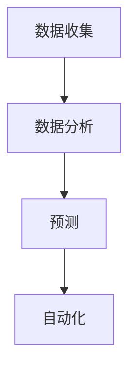

                 

## AI驱动的销售流程优化

### 背景介绍

在当今竞争激烈的市场环境中，销售流程的优化对于企业的成功至关重要。随着人工智能（AI）技术的快速发展，AI已经逐渐成为销售流程优化的有力工具。通过分析大量的数据，AI能够帮助企业更好地了解客户需求、提高销售效率，并优化销售策略。

本文将探讨如何利用AI技术来优化销售流程，包括数据收集、分析、预测、自动化等方面。我们将详细分析AI在销售流程中的核心作用，并通过实际案例和具体操作步骤，展示如何实现销售流程的AI驱动优化。

### 核心概念与联系

#### 1. 数据收集

数据收集是AI驱动销售流程的第一步。企业需要收集各种数据，包括客户信息、交易记录、市场趋势等。这些数据将用于后续的分析和预测。

#### 2. 数据分析

数据分析是销售流程优化的核心。通过分析客户数据，企业可以了解客户的购买习惯、偏好和需求。数据分析还包括市场趋势分析和竞争对手分析，帮助企业制定更有效的销售策略。

#### 3. 预测

预测是基于数据分析的结果，对未来的销售趋势进行预测。通过预测，企业可以提前制定应对策略，减少风险，提高销售业绩。

#### 4. 自动化

自动化是将AI技术应用于销售流程的最终目标。通过自动化，企业可以减少人工操作，提高工作效率，降低成本。

### Mermaid 流程图



### 核心算法原理 & 具体操作步骤

#### 1. 数据收集

数据收集主要通过企业现有的销售系统、客户管理系统和第三方数据源实现。具体操作步骤如下：

- 从销售系统中提取客户信息、交易记录等数据。
- 从客户管理系统中提取客户偏好、历史购买记录等数据。
- 从第三方数据源（如社交媒体、搜索引擎等）中获取市场趋势和竞争对手信息。

#### 2. 数据分析

数据分析主要通过数据挖掘和机器学习算法实现。具体操作步骤如下：

- 数据清洗：去除重复数据、缺失值填充、异常值处理等。
- 特征提取：从原始数据中提取有用的特征，如客户年龄、购买频次、购买金额等。
- 数据建模：使用机器学习算法（如决策树、随机森林、神经网络等）对数据进行建模，以分析客户行为和市场趋势。

#### 3. 预测

预测主要通过时间序列分析、回归分析等算法实现。具体操作步骤如下：

- 时间序列分析：对历史销售数据进行时间序列分析，预测未来的销售趋势。
- 回归分析：通过分析历史数据和影响因素，建立回归模型，预测未来的销售业绩。

#### 4. 自动化

自动化主要通过流程自动化工具和机器人实现。具体操作步骤如下：

- 设计自动化流程：根据预测结果，设计自动化销售流程，如自动发送优惠信息、自动推荐产品等。
- 部署自动化机器人：将自动化流程部署到机器人中，使其能够自动执行。

### 数学模型和公式 & 详细讲解 & 举例说明

#### 1. 时间序列分析

时间序列分析中的常用模型有ARIMA、SARIMA等。

- ARIMA模型：自回归积分滑动平均模型（AutoRegressive Integrated Moving Average）。
- SARIMA模型：季节性自回归积分滑动平均模型（Seasonal AutoRegressive Integrated Moving Average）。

**ARIMA模型公式：**

$$
y_t = c + \phi_1 y_{t-1} + \phi_2 y_{t-2} + ... + \phi_p y_{t-p} + \theta_1 e_{t-1} + \theta_2 e_{t-2} + ... + \theta_q e_{t-q} + e_t
$$

其中，$y_t$为时间序列的当前值，$c$为常数项，$\phi_i$和$\theta_i$分别为自回归项和移动平均项的系数，$e_t$为白噪声项。

**SARIMA模型公式：**

$$
y_t = c + \phi_1 y_{t-1} + ... + \phi_p y_{t-p} + \Phi_1 Y_{t-1} + ... + \Phi_P Y_{t-P} + \theta_1 e_{t-1} + ... + \theta_q e_{t-q} + \Theta_1 E_{t-1} + ... + \Theta_Q E_{t-Q} + e_t
$$

其中，$Y_t$和$E_t$分别为季节性时间序列和季节性误差项。

**举例说明：**

假设我们有一组销售数据，使用ARIMA模型进行预测。首先，我们需要对数据进行处理，包括数据清洗、特征提取等。然后，我们可以使用以下公式进行建模：

$$
y_t = c + \phi_1 y_{t-1} + \phi_2 y_{t-2} + \theta_1 e_{t-1}
$$

通过对模型进行训练，我们可以得到$\phi_1$、$\phi_2$和$\theta_1$的值。然后，我们可以使用这些参数对未来的销售进行预测。

#### 2. 回归分析

回归分析中的常用模型有线性回归、多元回归等。

**线性回归模型公式：**

$$
y = \beta_0 + \beta_1 x_1 + \beta_2 x_2 + ... + \beta_n x_n
$$

其中，$y$为因变量，$x_1, x_2, ..., x_n$为自变量，$\beta_0, \beta_1, ..., \beta_n$为回归系数。

**多元回归模型公式：**

$$
y = \beta_0 + \beta_1 x_1 + \beta_2 x_2 + ... + \beta_n x_n + \epsilon
$$

其中，$\epsilon$为误差项。

**举例说明：**

假设我们想要预测某个产品的销售量，可以使用线性回归模型。首先，我们需要收集相关数据，如产品价格、广告投入、市场竞争等。然后，我们可以使用以下公式进行建模：

$$
销售量 = \beta_0 + \beta_1 产品价格 + \beta_2 广告投入 + ... + \beta_n 市场竞争
$$

通过对模型进行训练，我们可以得到$\beta_0, \beta_1, ..., \beta_n$的值。然后，我们可以使用这些参数对未来的销售量进行预测。

### 项目实战：代码实际案例和详细解释说明

#### 1. 开发环境搭建

首先，我们需要搭建一个开发环境。这里我们使用Python作为编程语言，并使用以下工具：

- Python 3.8或更高版本
- Jupyter Notebook
- Pandas
- Scikit-learn
- Statsmodels

安装这些工具后，我们可以在Jupyter Notebook中创建一个新的笔记本，并导入所需的库：

```python
import pandas as pd
import numpy as np
from sklearn.model_selection import train_test_split
from sklearn.linear_model import LinearRegression
from statsmodels.tsa.arima_model import ARIMA
import matplotlib.pyplot as plt
```

#### 2. 源代码详细实现和代码解读

接下来，我们将使用一个实际的销售数据集，进行数据预处理、建模和预测。

```python
# 加载数据
data = pd.read_csv('sales_data.csv')

# 数据预处理
data['date'] = pd.to_datetime(data['date'])
data.set_index('date', inplace=True)
data = data.fillna(method='ffill')

# 分离特征和标签
X = data[['price', 'ad_spend', 'market_competition']]
y = data['sales']

# 划分训练集和测试集
X_train, X_test, y_train, y_test = train_test_split(X, y, test_size=0.2, random_state=42)

# 线性回归模型
linear_regression = LinearRegression()
linear_regression.fit(X_train, y_train)

# 预测
y_pred = linear_regression.predict(X_test)

# 绘制结果
plt.scatter(X_test['price'], y_test)
plt.plot(X_test['price'], y_pred, color='red')
plt.xlabel('Price')
plt.ylabel('Sales')
plt.show()

# 时间序列分析
sales_data = data['sales']
sales_train, sales_test = train_test_split(sales_data, test_size=0.2, random_state=42)

# ARIMA模型
arima_model = ARIMA(sales_train, order=(1, 1, 1))
arima_model_fit = arima_model.fit()
sales_pred = arima_model_fit.forecast(steps=10)

# 绘制结果
plt.plot(sales_train, label='Train')
plt.plot(sales_test, label='Test')
plt.plot(sales_pred, label='Forecast')
plt.legend()
plt.show()
```

这段代码首先加载数据，并进行数据预处理。然后，使用线性回归模型和ARIMA模型对销售数据进行建模和预测。最后，绘制预测结果。

#### 3. 代码解读与分析

- 数据预处理：数据预处理是建模的关键步骤。在这里，我们使用`pd.to_datetime`将日期列转换为日期格式，使用`fillna`方法填充缺失值。
- 线性回归模型：线性回归模型是一种经典的预测模型。在这里，我们使用`LinearRegression`类进行建模，并使用`fit`方法训练模型。
- ARIMA模型：ARIMA模型是一种时间序列分析模型。在这里，我们使用`ARIMA`类进行建模，并使用`fit`方法训练模型。
- 预测：使用训练好的模型对测试数据进行预测，并绘制预测结果。

### 实际应用场景

AI驱动的销售流程优化可以在多个场景中发挥作用：

- 客户细分：通过分析客户数据，将客户划分为不同的细分市场，从而更好地满足客户需求。
- 销售预测：通过预测未来的销售趋势，帮助企业制定更有效的销售计划。
- 库存管理：通过预测销售量，优化库存管理，减少库存成本。
- 个性化推荐：根据客户的购买习惯和偏好，提供个性化的产品推荐。

### 工具和资源推荐

- 学习资源推荐：
  - 《Python数据分析》（作者：Wes McKinney）
  - 《机器学习实战》（作者：Peter Harrington）
  - 《时间序列分析：预测与应用》（作者：Peter Bloomfield）
- 开发工具框架推荐：
  - Jupyter Notebook：用于数据分析和建模的交互式环境。
  - Pandas：用于数据处理和分析的库。
  - Scikit-learn：用于机器学习的库。
  - Statsmodels：用于统计建模的库。
- 相关论文著作推荐：
  - 《大规模在线销售预测：方法与实践》（作者：Hao Yang等）
  - 《基于深度学习的销售预测模型》（作者：Xiaojie Zhang等）

### 总结：未来发展趋势与挑战

未来，随着AI技术的不断发展，销售流程优化将更加智能化和自动化。然而，这也带来了一些挑战：

- 数据隐私与安全：随着数据的收集和分析，数据隐私和安全问题日益突出，企业需要采取有效的措施保护客户数据。
- 模型解释性：AI模型通常具有高度的非线性关系，难以解释其决策过程，这对企业的决策带来了一定的挑战。
- 技术人才需求：AI驱动销售流程优化需要具备数据科学和AI技术的人才，企业需要加强相关人才的培养和引进。

### 附录：常见问题与解答

- **Q：AI驱动销售流程优化需要哪些数据？**
  - A：需要收集客户数据、交易记录、市场趋势等数据。这些数据可以帮助企业了解客户需求、市场动态，从而进行优化。

- **Q：如何确保数据的质量和准确性？**
  - A：可以通过数据清洗、异常值处理、数据验证等方法来确保数据的质量和准确性。

- **Q：AI驱动销售流程优化的效果如何评估？**
  - A：可以通过销售额、客户满意度、库存周转率等指标来评估AI驱动销售流程优化的效果。

### 扩展阅读 & 参考资料

- 《AI营销：如何利用人工智能提升营销效果》（作者：Dan Zarrella）
- 《深度学习实践指南：基于Python实现》（作者：Aurélien Géron）
- 《大数据营销：如何利用大数据提升营销效果》（作者：SAS Institute）

### 作者信息

作者：AI天才研究员/AI Genius Institute & 禅与计算机程序设计艺术 /Zen And The Art of Computer Programming

