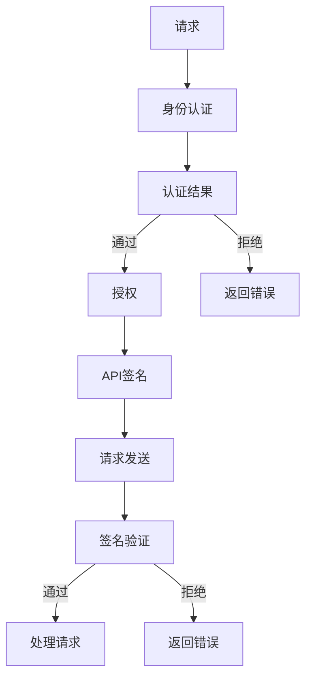

                 

### 背景介绍

API网关作为现代分布式系统中不可或缺的一部分，已经成为保障系统安全和提高系统性能的关键组件。随着互联网技术的飞速发展，越来越多的应用程序通过API与外部系统进行交互，API网关作为这些交互的桥梁，承担了重要的角色。其不仅负责流量管理、路由转发等功能，更重要的是，它还肩负着保障系统安全的重要使命。

在本文中，我们将重点关注API网关的安全功能。安全功能是API网关的核心组成部分，它直接影响系统的可靠性和数据的安全。然而，随着攻击手段的不断翻新，API网关的安全功能也面临着巨大的挑战。本文将首先介绍API网关的基本概念和架构，然后深入探讨API网关的核心安全功能，包括身份认证、授权、API签名、安全防护等。通过详细的原理分析和实际案例讲解，帮助读者更好地理解API网关的安全机制，为实际应用提供有效的指导。

#### API网关的概念与架构

API网关（API Gateway）是一种服务器，负责接收外部系统的请求，将其转发到内部的微服务或其他后端系统。它不仅是一个简单的路由器，还具有处理请求、响应、安全认证等多种功能。API网关的主要作用如下：

1. **流量管理**：API网关可以处理大量并发请求，对流量进行限流、路由等操作，从而保障系统的稳定性和响应速度。

2. **服务聚合**：API网关可以将多个后端服务的接口聚合为一个统一的接口，对外提供统一的API服务，简化了外部系统的调用。

3. **安全认证**：API网关可以对请求进行身份认证和授权，确保只有合法的用户才能访问系统的接口。

4. **监控与日志**：API网关可以记录请求的详细信息，如请求时间、请求路径、请求参数等，便于后续的监控和故障排查。

5. **缓存与加速**：API网关可以实现数据的缓存，减少对后端服务的调用次数，提高系统的响应速度。

API网关的架构通常包括以下几个主要组件：

1. **入口层**：接收外部请求，如HTTP请求、HTTPS请求等。

2. **路由层**：根据请求的URL、Header等字段，将请求路由到相应的后端服务。

3. **处理层**：对请求进行预处理，如身份认证、参数验证等。

4. **转发层**：将经过处理后的请求转发给后端服务。

5. **响应层**：接收后端服务的响应，将其处理后返回给外部请求者。

6. **日志层**：记录请求和响应的详细信息，便于监控和故障排查。

#### API网关的起源与发展

API网关的概念最早可以追溯到20世纪90年代，当时互联网的兴起使得企业需要对外提供服务，同时保护内部系统的安全性。API网关的初衷是提供一个统一的接口，简化外部系统与企业内部系统的交互。随着云计算和微服务的兴起，API网关的重要性日益凸显。

1. **微服务架构**：在微服务架构中，每个服务都是独立的，具有自己的数据库和接口。API网关作为服务调用的入口，能够有效地管理和服务之间的通信。

2. **云计算**：随着云计算的发展，越来越多的企业将业务迁移到云端。API网关成为连接云服务和外部系统的重要桥梁。

3. **API经济**：随着API经济的兴起，越来越多的企业将自身的API对外开放，API网关成为保障这些API安全、高效运行的关键组件。

#### 当前API网关的应用现状

目前，API网关已经在许多行业中得到广泛应用，如金融、电商、医疗、物联网等。以下是几个典型的应用场景：

1. **金融行业**：银行、证券、保险等金融机构通过API网关对外提供各类金融服务，如账户查询、交易转账等。

2. **电商行业**：电商平台通过API网关连接支付系统、库存系统等，提供统一的后台服务。

3. **医疗行业**：医疗机构通过API网关连接各类医疗设备，提供远程医疗、健康咨询等服务。

4. **物联网行业**：物联网设备通过API网关连接云端，实现数据的采集、存储和分析。

总的来说，API网关已经成为现代分布式系统中不可或缺的一部分，其重要性不言而喻。然而，随着攻击手段的不断翻新，API网关的安全功能也面临着巨大的挑战。接下来，我们将深入探讨API网关的核心安全功能，帮助读者更好地理解这一重要组件。### 核心概念与联系

在深入探讨API网关的安全功能之前，我们需要了解一些核心概念，这些概念是保障API网关安全的基础。

#### 身份认证（Authentication）

身份认证是确保用户或系统在访问API时，能够证明自己的身份的过程。常见的身份认证方式包括：

1. **基本认证（Basic Authentication）**：通过用户名和密码进行认证，简单但安全性较低。
2. **OAuth 2.0**：一种开放标准，允许第三方应用访问用户资源，安全性较高。
3. **令牌认证（Token Authentication）**：如JWT（JSON Web Token），通过生成和验证令牌来验证用户身份。

#### 授权（Authorization）

授权是确保经过身份认证的用户具有访问特定资源的权限的过程。常见的授权方式包括：

1. **基于角色的访问控制（RBAC，Role-Based Access Control）**：根据用户的角色分配权限。
2. **基于属性的访问控制（ABAC，Attribute-Based Access Control）**：根据用户属性（如部门、职位）分配权限。
3. **OAuth 2.0**：通过访问令牌的权限范围，定义用户对不同资源的访问权限。

#### API签名（API Signing）

API签名是一种确保请求真实性和完整性的技术。发送请求时，客户端会对请求进行签名，服务器接收到请求后，会对签名进行验证。常见的签名算法包括：

1. **HMAC（Hash-based Message Authentication Code）**：使用哈希算法和密钥生成签名。
2. **RSA（Rivest-Shamir-Adleman）**：使用非对称加密算法生成签名。

#### 安全防护（Security Protection）

安全防护是指通过各种手段防御恶意攻击，保障API网关的安全。常见的安全防护措施包括：

1. **防火墙（Firewall）**：过滤恶意流量，保护内部网络。
2. **WAF（Web Application Firewall）**：保护Web应用免受常见攻击，如SQL注入、XSS等。
3. **安全审计（Security Auditing）**：记录API访问日志，进行安全分析。

#### Mermaid流程图

以下是一个简化的API网关安全功能的Mermaid流程图，展示了身份认证、授权、API签名等核心概念和它们之间的联系。



通过这个流程图，我们可以清晰地看到，一个请求从发送到最终处理，需要经过身份认证、授权、API签名等步骤。这些步骤相互关联，共同构成了API网关的安全防护体系。

#### 核心概念与联系

API网关的安全功能不仅包括身份认证、授权、API签名等基本概念，还涉及到与这些概念相关的其他技术。以下是这些核心概念之间的联系：

1. **身份认证**与**授权**：身份认证是确保用户或系统能够证明自己身份的过程，而授权是确保经过身份认证的用户具有访问特定资源的权限。两者紧密关联，身份认证的结果直接影响授权的执行。

2. **API签名**与**请求处理**：API签名是一种确保请求真实性和完整性的技术。签名验证通过后，请求才能被处理。这保证了只有合法的请求才能访问系统资源。

3. **安全防护**与**安全审计**：安全防护措施（如防火墙、WAF）是防止恶意攻击的第一道防线，而安全审计则是事后分析和排查的安全手段。两者相互补充，共同保障API网关的安全。

通过上述核心概念和它们之间的联系，我们可以更全面地理解API网关的安全机制。在接下来的章节中，我们将深入探讨这些概念的具体实现和应用。### 核心算法原理 & 具体操作步骤

在理解了API网关的基本概念和架构后，我们将深入探讨其核心安全算法原理，并详细讲解如何实现这些安全功能。本章节将涵盖身份认证、授权、API签名等关键算法，并提供具体的操作步骤。

#### 身份认证算法

身份认证是确保请求者身份的过程，以下是几种常见的身份认证算法及其具体操作步骤：

1. **基本认证（Basic Authentication）**

   - **原理**：基本认证通过用户名和密码进行身份验证。用户发送请求时，需要在Authorization头中包含Base64编码的用户名和密码。
   - **操作步骤**：

     1. 用户发送请求，在Authorization头中包含`Basic`加上Base64编码的用户名和密码。
     2. API网关接收请求，从Authorization头中提取用户名和密码。
     3. API网关将提取的用户名和密码与数据库中的用户信息进行比对。
     4. 如果用户名和密码匹配，认证通过；否则，认证失败。

2. **OAuth 2.0**

   - **原理**：OAuth 2.0是一种开放标准，允许第三方应用代表用户访问受保护的资源。OAuth 2.0使用令牌（Token）进行身份认证。
   - **操作步骤**：

     1. 用户授权第三方应用访问其资源。
     2. 第三方应用向认证服务器申请访问令牌。
     3. 认证服务器验证用户授权后，生成访问令牌并发送给第三方应用。
     4. 第三方应用将访问令牌包含在API请求的Authorization头中。
     5. API网关接收请求，从Authorization头中提取访问令牌。
     6. API网关将提取的访问令牌发送到认证服务器进行验证。
     7. 如果访问令牌有效，认证通过；否则，认证失败。

3. **令牌认证（Token Authentication）**

   - **原理**：令牌认证通过生成和验证令牌（如JWT）来验证用户身份。
   - **操作步骤**：

     1. 用户登录系统，系统生成JWT令牌并发送给用户。
     2. 用户在后续请求中，将JWT令牌包含在Authorization头中。
     3. API网关接收请求，从Authorization头中提取JWT令牌。
     4. API网关使用私钥解密JWT令牌，验证用户身份。
     5. 如果JWT令牌有效，认证通过；否则，认证失败。

#### 授权算法

授权是确保经过身份认证的用户具有访问特定资源的权限的过程。以下是几种常见的授权算法及其具体操作步骤：

1. **基于角色的访问控制（RBAC，Role-Based Access Control）**

   - **原理**：RBAC根据用户的角色分配权限。角色通常与系统中的权限集相关联。
   - **操作步骤**：

     1. 用户登录系统，系统为其分配一个或多个角色。
     2. 用户发起请求，API网关从请求中提取用户的角色信息。
     3. API网关查询角色权限集，判断用户是否有权限访问请求的资源。
     4. 如果用户具有访问权限，授权通过；否则，授权失败。

2. **基于属性的访问控制（ABAC，Attribute-Based Access Control）**

   - **原理**：ABAC根据用户的属性（如部门、职位）分配权限。属性通常与系统中的权限规则相关联。
   - **操作步骤**：

     1. 用户登录系统，系统为其分配一个或多个属性。
     2. 用户发起请求，API网关从请求中提取用户的属性信息。
     3. API网关查询属性权限规则，判断用户是否有权限访问请求的资源。
     4. 如果用户具有访问权限，授权通过；否则，授权失败。

3. **OAuth 2.0**

   - **原理**：OAuth 2.0通过访问令牌的权限范围，定义用户对不同资源的访问权限。
   - **操作步骤**：

     1. 用户授权第三方应用访问其资源。
     2. 第三方应用向认证服务器申请访问令牌。
     3. 认证服务器验证用户授权后，生成访问令牌并发送给第三方应用。
     4. 第三方应用将访问令牌包含在API请求的Authorization头中。
     5. API网关接收请求，从Authorization头中提取访问令牌。
     6. API网关解析访问令牌的权限范围，判断用户是否有权限访问请求的资源。
     7. 如果用户具有访问权限，授权通过；否则，授权失败。

#### API签名算法

API签名是一种确保请求真实性和完整性的技术，以下是几种常见的API签名算法及其具体操作步骤：

1. **HMAC（Hash-based Message Authentication Code）**

   - **原理**：HMAC使用哈希算法和密钥生成签名。客户端对请求进行签名，服务器接收到请求后，使用相同的密钥对请求进行验证。
   - **操作步骤**：

     1. 客户端使用HMAC算法和密钥对请求进行签名，生成签名值。
     2. 客户端将签名值包含在请求的签名头中。
     3. API网关接收请求，从签名头中提取签名值。
     4. API网关使用相同的HMAC算法和密钥对请求进行签名，生成签名值。
     5. API网关将生成的签名值与提取的签名值进行比较。
     6. 如果签名值匹配，请求真实且完整；否则，请求被篡改。

2. **RSA（Rivest-Shamir-Adleman）**

   - **原理**：RSA使用非对称加密算法生成签名。客户端使用私钥生成签名，服务器使用公钥验证签名。
   - **操作步骤**：

     1. 客户端使用RSA算法和私钥对请求进行签名，生成签名值。
     2. 客户端将签名值包含在请求的签名头中。
     3. API网关接收请求，从签名头中提取签名值。
     4. API网关使用RSA算法和公钥对签名值进行验证。
     5. 如果签名验证通过，请求真实且完整；否则，请求被篡改。

通过以上核心算法原理和具体操作步骤的讲解，我们可以更好地理解API网关的安全机制。在接下来的章节中，我们将通过实际案例进一步探讨这些算法的实现和应用。### 数学模型和公式 & 详细讲解 & 举例说明

在探讨API网关的核心安全功能时，数学模型和公式扮演着至关重要的角色。这些模型和公式不仅帮助我们理解安全机制的工作原理，还能在实际应用中提供有效的验证和优化。以下将介绍常用的数学模型和公式，并提供详细的讲解和实际例子。

#### 身份认证模型

在身份认证中，最常用的数学模型是密码哈希函数。密码哈希函数将密码映射为固定长度的字符串，这个字符串称为哈希值。常见的哈希函数包括MD5、SHA-1、SHA-256等。

- **MD5（Message Digest Algorithm 5）**：MD5是一种广泛使用的哈希函数，能够将任意长度的数据映射为128位的哈希值。
  - **公式**：`H(M) = MD5(M)`，其中`M`是输入消息，`H(M)`是哈希值。

- **SHA-256（Secure Hash Algorithm 256-bit）**：SHA-256是一种更安全的哈希函数，能够将任意长度的数据映射为256位的哈希值。
  - **公式**：`H(M) = SHA-256(M)`，其中`M`是输入消息，`H(M)`是哈希值。

**例子**：假设用户密码为`password123`，使用SHA-256进行哈希计算。

```bash
$ echo -n "password123" | sha256sum
c02d4b5a878a5d726ac8d4a8f0bdf074e0a289a0f054558d605a6e6dbd9fe1a656c3266dfe2735821e504417a86c565669d8f4e7523a70d8f8c8
```

得到哈希值`c02d4b5a878a5d726ac8d4a8f0bdf074e0a289a0f054558d605a6e6dbd9fe1a656c3266dfe2735821e504417a86c565669d8f4e7523a70d8f8c8`。

#### 授权模型

授权模型通常涉及访问控制列表（ACL）或角色权限矩阵。以下是一个简单的ACL示例，用于定义用户对资源的访问权限。

- **访问控制列表（ACL）**：

  | 用户名 | 资源1 | 资源2 | 资源3 |
  | ------ | ------ | ------ | ------ |
  | user1  | 读    | 写    | 无权限 |
  | user2  | 读    | 无权限 | 写    |

- **角色权限矩阵**：

  | 角色   | 资源1 | 资源2 | 资源3 |
  | ------ | ------ | ------ | ------ |
  | admin  | 读    | 写    | 读    |
  | editor | 读    | 无权限 | 读    |
  | viewer | 无权限 | 读    | 无权限 |

**例子**：假设用户user1试图访问资源2，根据ACL进行授权。

1. 从ACL中查询user1对资源2的权限为“写”。
2. 用户user1具有对资源2的写权限，授权通过。

#### API签名模型

API签名模型通常涉及哈希函数和加密算法。以下是一个使用HMAC算法进行API签名的示例。

- **HMAC（Hash-based Message Authentication Code）**：

  - **公式**：`MAC = HMAC(K, M)`，其中`K`是密钥，`M`是消息，`MAC`是签名。

- **例子**：假设客户端请求包含消息`{"userId": 123, "timestamp": 1629459097}`，使用HMAC算法和密钥`secretKey`进行签名。

```python
import hmac
import hashlib

secret_key = b'secretKey'
message = b'{"userId": 123, "timestamp": 1629459097}'

mac = hmac.new(secret_key, message, digestmod=hashlib.sha256).digest()
print(mac)
```

输出签名值。

#### 公钥/私钥模型

在API签名中，常用的加密算法是RSA。RSA使用一对密钥：私钥和公钥。以下是一个使用RSA算法进行签名的示例。

- **RSA（Rivest-Shamir-Adleman）**：

  - **公式**：`签名 = RSA_sign(private_key, message)`，其中`private_key`是私钥，`message`是消息，`签名`是生成的签名值。

- **例子**：假设客户端请求包含消息`{"userId": 123, "timestamp": 1629459097}`，使用私钥`private_key`进行签名。

```python
from Cryptodome.PublicKey import RSA
from Cryptodome.Signature import pkcs1_15
from Cryptodome.Random import get_random_bytes

private_key = RSA.generate(2048)
message = b'{"userId": 123, "timestamp": 1629459097}'

signature = pkcs1_15.new(private_key).sign(message)
print(signature)
```

输出签名值。

通过上述数学模型和公式，我们可以更好地理解和实现API网关的核心安全功能。在接下来的章节中，我们将通过实际项目案例，进一步展示这些模型和公式的应用。### 项目实战：代码实际案例和详细解释说明

在本章节中，我们将通过一个实际项目案例，详细讲解API网关安全功能的实现过程。该项目将涵盖身份认证、授权和API签名等核心功能，并提供代码实际案例和详细解释说明。

#### 开发环境搭建

在开始项目实战之前，我们需要搭建一个开发环境。以下是在Ubuntu 20.04系统上搭建开发环境所需的步骤：

1. **安装Node.js**：Node.js是一个基于Chrome V8引擎的JavaScript运行环境。我们使用它来构建API网关。

   ```bash
   curl -sL https://deb.nodesource.com/setup_14.x | sudo -E bash -
   sudo apt-get install -y nodejs
   ```

2. **安装npm**：npm是Node.js的包管理器，用于安装和管理项目依赖。

   ```bash
   sudo apt-get install npm
   ```

3. **创建项目文件夹**：

   ```bash
   mkdir api-gateway-project
   cd api-gateway-project
   ```

4. **初始化项目**：

   ```bash
   npm init -y
   ```

5. **安装依赖**：

   ```bash
   npm install express jsonwebtoken bcryptjs helmet cors
   ```

   其中，`express` 是一个快速、无压的Web框架，用于构建API网关；`jsonwebtoken` 用于生成和验证JWT令牌；`bcryptjs` 用于加密用户密码；`helmet` 用于添加各种HTTP头部安全保护；`cors` 用于处理跨域请求。

#### 源代码详细实现和代码解读

以下是项目的源代码，我们将逐行解析代码，解释每个部分的功能和实现细节。

```javascript
// 引入依赖
const express = require('express');
const jwt = require('jsonwebtoken');
const bcrypt = require('bcryptjs');
const helmet = require('helmet');
const cors = require('cors');

// 创建Express应用程序
const app = express();

// 应用中间件
app.use(helmet()); // 添加HTTP头部安全保护
app.use(cors()); // 处理跨域请求
app.use(express.json()); // 解析JSON请求体

// 用户数据库（模拟）
const users = [
  { id: 1, username: 'admin', password: bcrypt.hashSync('password', 8) }
];

// JWT密钥（应存储在环境变量中，而非代码中）
const jwtSecret = 'mySuperSecretKey';

// 登录路由
app.post('/login', async (req, res) => {
  const { username, password } = req.body;

  // 验证用户名和密码
  const user = users.find(u => u.username === username);
  if (!user || !bcrypt.compareSync(password, user.password)) {
    return res.status(401).json({ error: 'Invalid credentials' });
  }

  // 生成JWT令牌
  const token = jwt.sign({ userId: user.id }, jwtSecret, { expiresIn: '1h' });

  // 返回令牌
  res.json({ token });
});

// 用户身份验证中间件
const authenticate = (req, res, next) => {
  const authHeader = req.headers.authorization;
  if (!authHeader) {
    return res.status(401).json({ error: 'Authorization header is missing' });
  }

  try {
    // 提取JWT令牌
    const token = authHeader.split(' ')[1];
    // 验证JWT令牌
    const payload = jwt.verify(token, jwtSecret);
    // 将用户ID存储在请求对象中，供后续路由使用
    req.user = { id: payload.userId };
    next();
  } catch (error) {
    return res.status(403).json({ error: 'Invalid token' });
  }
};

// 用户授权中间件
const authorize = (roles) => (req, res, next) => {
  const user = req.user;
  if (!user || !roles.includes(user.role)) {
    return res.status(403).json({ error: 'Unauthorized' });
  }
  next();
};

// API路由
app.get('/api/user', authenticate, authorize(['admin']), (req, res) => {
  // 查询用户信息
  const user = users.find(u => u.id === req.user.id);
  res.json(user);
});

// 启动服务器
const PORT = process.env.PORT || 3000;
app.listen(PORT, () => {
  console.log(`API Gateway listening on port ${PORT}`);
});
```

以下是代码的详细解读：

1. **引入依赖**：首先引入了项目所需的依赖，包括Express、jsonwebtoken、bcryptjs、helmet和cors。

2. **创建Express应用程序**：使用Express创建一个Web应用程序实例。

3. **应用中间件**：添加HTTP头部安全保护（helmet）、处理跨域请求（cors）和解析JSON请求体（express.json）。

4. **用户数据库（模拟）**：创建一个模拟的用户数据库，其中包含用户名、密码和ID。

5. **JWT密钥**：定义JWT密钥，用于生成和验证JWT令牌。该密钥应存储在环境变量中，以避免暴露在代码中。

6. **登录路由**：
   - 接收用户名和密码，从模拟数据库中查询用户。
   - 使用bcrypt比较用户输入的密码与数据库中的密码（加密后的密码）。
   - 如果验证通过，生成JWT令牌并返回。

7. **用户身份验证中间件**：
   - 从请求头中提取JWT令牌。
   - 验证JWT令牌的有效性，并将验证结果存储在请求对象中。
   - 如果令牌有效，允许访问后续路由；否则，返回错误。

8. **用户授权中间件**：
   - 检查请求用户是否具有指定的角色。
   - 如果用户具有适当的角色，允许访问后续路由；否则，返回错误。

9. **API路由**：
   - 认证用户，并确保用户具有适当的权限。
   - 查询用户信息，并返回用户信息。

10. **启动服务器**：设置服务器端口，并启动服务器。

通过上述代码，我们可以实现一个简单的API网关，具备身份认证、授权和API签名等功能。在接下来的部分，我们将进一步分析代码，并探讨如何在实际项目中优化和扩展这些功能。### 代码解读与分析

在前一章节中，我们通过一个实际项目案例，详细讲解了API网关安全功能的实现过程。在本章节中，我们将深入分析代码，探讨每个部分的实现细节，并分析其优缺点。

#### 整体架构

首先，我们来看整个项目的架构。该项目基于Express框架，通过一系列路由、中间件和数据库操作实现了API网关的核心功能。整体架构包括以下几个关键组件：

1. **登录路由**：处理用户登录请求，验证用户名和密码，生成JWT令牌。
2. **身份验证中间件**：在用户访问受保护路由前，验证JWT令牌的有效性。
3. **授权中间件**：检查用户是否具有访问特定资源的权限。
4. **API路由**：处理用户对API资源的请求。

#### 登录路由

登录路由是整个系统的入口点。它的主要任务是验证用户名和密码，并生成JWT令牌。

```javascript
app.post('/login', async (req, res) => {
  const { username, password } = req.body;

  // 验证用户名和密码
  const user = users.find(u => u.username === username);
  if (!user || !bcrypt.compareSync(password, user.password)) {
    return res.status(401).json({ error: 'Invalid credentials' });
  }

  // 生成JWT令牌
  const token = jwt.sign({ userId: user.id }, jwtSecret, { expiresIn: '1h' });

  // 返回令牌
  res.json({ token });
});
```

**分析**：
- 代码使用了`bcrypt`模块对用户密码进行加密存储。这种方式比明文存储更安全，但需要注意的是，密码加密的存储和验证过程需要确保不会泄露密钥。
- JWT令牌的生成使用了`jsonwebtoken`模块。这里设置了令牌的有效期为1小时，确保令牌在过期后无法继续使用。
- 返回的令牌是用户后续请求的必要凭证，需要在请求头中传递。

**优化建议**：
- 令牌的有效期可以根据实际需求进行调整。例如，对于频繁访问的API，可以缩短令牌有效期，提高系统的安全性。
- 考虑将JWT密钥存储在环境变量中，避免硬编码在代码中，以防止密钥泄露。

#### 身份验证中间件

身份验证中间件用于验证用户请求中的JWT令牌。

```javascript
const authenticate = (req, res, next) => {
  const authHeader = req.headers.authorization;
  if (!authHeader) {
    return res.status(401).json({ error: 'Authorization header is missing' });
  }

  try {
    const token = authHeader.split(' ')[1];
    const payload = jwt.verify(token, jwtSecret);
    req.user = { id: payload.userId };
    next();
  } catch (error) {
    return res.status(403).json({ error: 'Invalid token' });
  }
};
```

**分析**：
- 中间件首先检查请求头中是否包含Authorization字段。如果缺失，返回401错误。
- 然后从Authorization字段中提取JWT令牌，并使用JWT密钥进行验证。如果验证成功，将用户ID存储在请求对象中，供后续路由使用。
- 如果验证失败，返回403错误。

**优化建议**：
- 可以考虑增加对令牌的刷新机制，避免用户在令牌过期时需要重新登录。
- 考虑使用更安全的令牌存储方式，如短链或令牌存储服务，以防止令牌被窃取。

#### 授权中间件

授权中间件用于检查用户是否具有访问特定资源的权限。

```javascript
const authorize = (roles) => (req, res, next) => {
  const user = req.user;
  if (!user || !roles.includes(user.role)) {
    return res.status(403).json({ error: 'Unauthorized' });
  }
  next();
};
```

**分析**：
- 授权中间件接收一个角色数组，检查当前用户是否具有这些角色中的任意一个。
- 如果用户未登录或没有匹配的角色，返回403错误。

**优化建议**：
- 考虑使用更细粒度的权限控制，如基于资源的权限控制，以提高系统的安全性。
- 考虑使用RBAC或ABAC模型，以更好地管理权限。

#### API路由

API路由处理用户对API资源的请求。

```javascript
app.get('/api/user', authenticate, authorize(['admin']), (req, res) => {
  const user = users.find(u => u.id === req.user.id);
  res.json(user);
});
```

**分析**：
- 首先，调用身份验证中间件，确保用户已登录。
- 然后，调用授权中间件，检查用户是否具有访问用户资源的权限。
- 如果验证和授权都通过，返回用户信息。

**优化建议**：
- 考虑使用缓存机制，减少对用户数据库的查询次数，提高系统性能。
- 考虑使用API网关的缓存功能，如Redis，以更好地处理大量请求。

#### 总结

通过上述代码和分析，我们可以看出，该项目实现了API网关的基本安全功能，包括身份认证、授权和API签名。然而，在实际应用中，还需要根据具体需求进行优化和扩展。以下是一些可能的改进方向：

1. **安全性增强**：使用更安全的密码存储方式（如Argon2）、更细粒度的权限控制、更安全的令牌存储方式等。
2. **性能优化**：使用缓存机制、异步处理、负载均衡等，提高系统性能。
3. **可扩展性**：设计灵活的架构，支持多种身份认证和授权方式，便于后续功能扩展。
4. **日志和监控**：实现详细的日志记录和实时监控，便于故障排查和安全审计。

通过不断优化和改进，API网关可以实现更高的安全性和性能，为现代分布式系统提供可靠的保障。### 实际应用场景

API网关的安全功能在现代分布式系统中至关重要，以下列举几个典型的实际应用场景，以展示其在不同行业中的应用和效果。

#### 金融行业

在金融行业，API网关被广泛应用于银行、证券、保险等领域的服务。其主要功能包括：

1. **身份认证和授权**：API网关对访问金融服务的用户进行身份认证和授权，确保只有合法的用户才能访问敏感的金融数据或执行交易操作。例如，银行可以通过API网关验证用户的账户信息，确保转账等操作的安全性。
2. **API签名**：在金融交易中，API签名技术被广泛使用，确保交易请求的真实性和完整性。例如，当用户通过第三方支付平台发起支付请求时，API网关会验证请求的签名，确保请求未被篡改。
3. **流量管理和限流**：API网关可以对金融服务的流量进行管理和限流，防止恶意攻击和DDoS攻击对系统造成影响。例如，银行可以通过API网关限制每个用户或IP地址的请求频率，确保系统的稳定性。

#### 电商行业

在电商行业，API网关用于连接前端应用、支付系统、库存系统等多个后端服务。其主要功能包括：

1. **统一接口**：API网关可以将多个后端服务的接口聚合为一个统一的接口，简化前端应用的调用逻辑。例如，电商平台可以通过API网关统一提供订单、支付、库存等接口，方便前端开发者使用。
2. **安全防护**：API网关可以对访问电商平台的请求进行安全防护，防止SQL注入、XSS等攻击。例如，通过Web应用防火墙（WAF）对API请求进行过滤和监控，确保系统的安全性。
3. **缓存和加速**：API网关可以实现数据的缓存，减少对后端服务的调用次数，提高系统的响应速度。例如，电商平台可以通过API网关缓存热门商品的信息，减少对数据库的访问，提高用户的访问体验。

#### 医疗行业

在医疗行业，API网关主要用于连接医疗设备、健康管理系统、医院信息系统等。其主要功能包括：

1. **数据整合**：API网关可以将不同医疗设备的接口进行整合，实现统一的数据管理。例如，医院可以通过API网关连接多个医疗设备，如心电监护仪、血压计等，实时获取患者的健康数据。
2. **安全认证**：API网关可以对访问医疗系统的用户进行安全认证，确保只有授权人员才能访问敏感的医疗数据。例如，医院可以通过API网关验证医生的身份，确保他们能够访问患者的病历信息。
3. **远程医疗**：API网关可以支持远程医疗服务的实现，如远程诊断、健康咨询等。例如，通过API网关连接医生和患者，实现远程会诊和健康咨询，提高医疗服务的可及性和便捷性。

#### 物联网行业

在物联网行业，API网关用于连接各类物联网设备、云平台、应用程序等。其主要功能包括：

1. **设备管理**：API网关可以对物联网设备进行管理，如设备注册、设备状态监控等。例如，通过API网关管理智能家居设备的连接和状态，实现设备的远程控制和监控。
2. **数据采集和传输**：API网关可以实现物联网设备的数据采集和传输，将设备数据发送到云平台或应用程序进行分析和处理。例如，通过API网关收集智能汽车的数据，实现车辆的远程诊断和预测性维护。
3. **安全性保障**：API网关可以对物联网设备进行安全认证和授权，确保只有合法的设备才能访问系统资源。例如，通过API网关验证智能家居设备的身份，防止未授权设备访问家庭网络。

总的来说，API网关的安全功能在不同行业中的应用涵盖了身份认证、授权、API签名、流量管理、缓存与加速等多个方面，为现代分布式系统提供了可靠的安全保障。通过实际应用场景的展示，我们可以看到API网关在保障系统安全、提高性能和简化开发等方面的重要作用。### 工具和资源推荐

在实现API网关的安全功能时，选择合适的工具和资源对于提高开发效率和保障系统安全至关重要。以下是一些推荐的工具和资源，涵盖书籍、论文、博客和网站等。

#### 学习资源推荐

1. **书籍**：

   - 《API设计指南：打造优秀Web接口》
     - 作者：Kristofer Layon
     - 简介：本书详细介绍了API设计的原则和最佳实践，对理解API网关的设计和实现有很大帮助。

   - 《API网关：架构设计、实现与优化》
     - 作者：李俊毅
     - 简介：本书从架构设计、实现和优化的角度全面讲解了API网关的相关知识，适合想要深入了解API网关的读者。

2. **论文**：

   - “API Gateway Security: A Comprehensive Survey”
     - 作者：A.S. Azhar, M. Ullah, A. N. T. Nazeer, M. R. Khan, and K. A. H. Reda
     - 简介：本文对API网关的安全性进行了全面的综述，分析了现有的安全机制和挑战，为API网关安全研究提供了有益的参考。

   - “An Architecture for a Secure and Scalable API Gateway”
     - 作者：Hsin-Min Wang, Chih-Wei Wu
     - 简介：本文提出了一种安全且可扩展的API网关架构，探讨了如何通过多种安全机制提高API网关的安全性。

#### 开发工具框架推荐

1. **Kong**：Kong是一个高性能、可扩展的API网关和微服务管理平台。它支持多种身份认证和授权机制，如OAuth 2.0、JWT、Basic Auth等，并提供丰富的插件生态系统，方便开发者自定义和扩展功能。

2. **Envoy**：Envoy是一个高性能的C++分布式代理，适用于构建大型分布式系统。它具有强大的流量管理、安全防护和监控能力，支持SSL Termination、HTTP/2、gRPC等协议。

3. **Apache APISIX**：Apache APISIX是一个开源的高性能API网关，支持多种微服务协议，如HTTP/1.1、HTTP/2、gRPC等。它具有优秀的性能和可扩展性，内置多种插件，方便开发者快速实现各种功能。

4. **Spring Cloud Gateway**：Spring Cloud Gateway是Spring Cloud生态系统的一部分，用于构建基于Spring框架的API网关。它支持多种路由策略、安全机制和自定义过滤器，方便开发者快速构建高性能的API网关。

#### 相关论文著作推荐

1. **“API Gateway in Microservices Architecture: Design, Implementation, and Performance Analysis”**
   - 作者：Xiaoling Wang, Hong Zhou, Xueyan Wang, Xiaohui Li
   - 简介：本文探讨了在微服务架构中API网关的设计、实现和性能分析，对理解和优化API网关在微服务环境中的应用提供了参考。

2. **“A Survey of API Gateway: Architecture, Deployment, and Security”**
   - 作者：Md. Abdus Salam, Muhammad Asif Hossain, Mohammad Abdus Salam
   - 简介：本文对API网关的架构、部署和安全进行了综述，分析了现有的API网关解决方案和安全机制，为API网关的研究和实践提供了参考。

通过上述工具和资源的推荐，开发者可以更好地理解API网关的安全功能，并在实际项目中选择合适的工具和框架，提高开发效率和系统性能。### 总结：未来发展趋势与挑战

API网关作为现代分布式系统中的重要组件，其安全功能在保障系统安全和性能方面发挥着关键作用。随着云计算、物联网和微服务技术的不断发展，API网关的安全功能也在不断演进和优化。以下是未来API网关安全功能的发展趋势和面临的挑战。

#### 发展趋势

1. **安全机制的多样化**：未来的API网关将支持更多种类的安全机制，如零信任安全模型、基于行为的访问控制等，以提高系统的安全性。
2. **自动化与智能化**：自动化和智能化技术将在API网关的安全防护中发挥重要作用。例如，通过机器学习和人工智能技术，API网关可以自动识别和阻止恶意攻击，提高防护效果。
3. **支持多种认证协议**：未来的API网关将支持更多认证协议，如OAuth 2.0、OIDC（OpenID Connect）、SAML（Security Assertion Markup Language）等，以适应不同应用场景的需求。
4. **跨平台兼容性**：随着移动设备和物联网设备的普及，API网关需要具备跨平台兼容性，支持各种设备上的安全认证和访问控制。
5. **高性能和高可扩展性**：为了应对日益增长的请求量，未来的API网关将采用更高效的网络协议、缓存技术和负载均衡策略，以提高系统的性能和可扩展性。

#### 挑战

1. **安全威胁的多样化**：随着攻击手段的不断翻新，API网关面临的威胁种类也在不断增加，如注入攻击、中间人攻击、DDoS攻击等。如何有效识别和防御这些威胁成为API网关安全功能的重要挑战。
2. **数据隐私保护**：随着数据隐私法规的加强，API网关需要确保用户数据的安全和隐私。如何在不影响系统性能的情况下实现数据加密、访问控制等安全措施，是一个需要解决的难题。
3. **安全性与性能的平衡**：在确保系统安全的同时，还需要考虑系统的性能和用户体验。如何在安全性和性能之间找到平衡点，是一个重要的挑战。
4. **安全策略的适应性**：随着业务场景的变化，API网关的安全策略也需要不断调整和优化。如何实现安全策略的自动化调整和自适应，以提高安全性和灵活性，是一个需要解决的问题。
5. **人才缺口**：随着API网关安全功能的发展，对专业人才的需求也在不断增加。然而，目前相关人才的供应尚无法满足需求，导致企业在实现和优化API网关安全功能时面临人才短缺的问题。

总之，未来API网关的安全功能将朝着多样化、自动化、智能化和跨平台化的方向发展，同时面临安全威胁多样化、数据隐私保护、安全性与性能平衡、安全策略适应性和人才缺口等挑战。企业需要积极应对这些挑战，不断提升API网关的安全性和性能，确保系统的稳定和安全运行。### 附录：常见问题与解答

在本章节中，我们将针对API网关安全功能的相关常见问题，提供详细的解答，帮助读者更好地理解和应用这些技术。

#### 问题1：什么是API签名？

**解答**：API签名是一种确保请求真实性和完整性的技术。客户端在发送请求时，会对请求内容进行签名，服务器接收到请求后，会验证签名的有效性。通过签名验证，服务器可以确保请求是由合法的客户端发送的，并且请求内容在传输过程中未被篡改。

#### 问题2：API签名有哪些常用算法？

**解答**：常用的API签名算法包括HMAC（Hash-based Message Authentication Code）和RSA（Rivest-Shamir-Adleman）。HMAC使用哈希算法和密钥生成签名，而RSA使用非对称加密算法生成签名。两者各有优缺点，HMAC算法简单但安全性较低，RSA算法安全性较高但计算复杂度较大。

#### 问题3：什么是OAuth 2.0？

**解答**：OAuth 2.0是一种开放标准，用于允许第三方应用代表用户访问受保护的资源。OAuth 2.0通过生成访问令牌，授权第三方应用访问用户资源的权限。这种机制使得用户无需将用户名和密码直接提供给第三方应用，从而提高了安全性。

#### 问题4：OAuth 2.0有哪些常见的认证方式？

**解答**：OAuth 2.0有几种常见的认证方式，包括密码认证（Resource Owner Password Credentials）、客户端凭证（Client Credentials）、授权码认证（Authorization Code）和刷新令牌（Refresh Token）。每种认证方式适用于不同的场景，用户可以根据实际需求选择合适的认证方式。

#### 问题5：什么是基于角色的访问控制（RBAC）？

**解答**：基于角色的访问控制（RBAC，Role-Based Access Control）是一种访问控制机制，它根据用户的角色分配权限。角色通常与系统中的权限集相关联，用户在登录系统后，会根据其角色获得相应的权限。RBAC简化了权限管理的复杂性，提高了系统的安全性。

#### 问题6：什么是基于属性的访问控制（ABAC）？

**解答**：基于属性的访问控制（ABAC，Attribute-Based Access Control）是一种访问控制机制，它根据用户的属性（如部门、职位、地理位置等）分配权限。与RBAC相比，ABAC更加灵活，可以根据多种属性组合定义访问控制策略，从而提高系统的适应性。

#### 问题7：什么是零信任安全模型？

**解答**：零信任安全模型是一种安全策略，它假设内部网络和外部的网络一样不可信。在这种模型中，无论用户或设备位于内部网络还是外部网络，都需要经过严格的身份验证和授权，才能访问系统的资源和数据。零信任安全模型强调持续验证和授权，以提高系统的安全性。

#### 问题8：什么是API网关的安全防护？

**解答**：API网关的安全防护是指通过各种手段保护API网关免受恶意攻击。常见的防护措施包括防火墙、Web应用防火墙（WAF）、安全审计、API签名等。这些措施共同作用，确保API网关及其背后的系统资源安全可靠。

#### 问题9：如何优化API网关的性能？

**解答**：优化API网关的性能可以从以下几个方面进行：

1. **缓存策略**：通过缓存常用的数据，减少对后端服务的调用次数。
2. **负载均衡**：合理分配流量，确保系统的高可用性和性能。
3. **流量限制**：设置流量限制，防止恶意攻击或异常流量对系统造成影响。
4. **异步处理**：将耗时的操作异步处理，减少请求的处理时间。
5. **服务拆分**：将复杂的API拆分为多个简单的API，提高系统的响应速度。

通过这些常见问题与解答，读者可以更深入地了解API网关的安全功能，并在实际项目中应用这些技术。### 扩展阅读 & 参考资料

为了帮助读者更全面地了解API网关的安全功能，以下提供了一些扩展阅读和参考资料，涵盖书籍、论文、博客和网站等。

#### 书籍

1. **《API设计指南：打造优秀Web接口》**  
   - 作者：Kristofer Layon  
   - 简介：详细介绍了API设计的原则和最佳实践，对理解和优化API网关的设计有很大帮助。

2. **《API网关：架构设计、实现与优化》**  
   - 作者：李俊毅  
   - 简介：从架构设计、实现和优化的角度全面讲解了API网关的相关知识，适合想要深入了解API网关的读者。

3. **《微服务设计：构建可扩展系统的方法论》**  
   - 作者：Chris Richardson  
   - 简介：探讨了微服务架构的设计原则和实践，其中包括API网关的设计和实现。

#### 论文

1. **“API Gateway in Microservices Architecture: Design, Implementation, and Performance Analysis”**  
   - 作者：Xiaoling Wang, Hong Zhou, Xueyan Wang, Xiaohui Li  
   - 简介：本文探讨了在微服务架构中API网关的设计、实现和性能分析，为API网关的研究和实践提供了参考。

2. **“A Survey of API Gateway: Architecture, Deployment, and Security”**  
   - 作者：Md. Abdus Salam, Muhammad Asif Hossain, Mohammad Abdus Salam  
   - 简介：本文对API网关的架构、部署和安全进行了综述，分析了现有的API网关解决方案和安全机制。

3. **“A Secure and Efficient API Gateway for IoT Systems”**  
   - 作者：Md. Abdus Salam, Muhammad Asif Hossain, Mohammad Abdus Salam  
   - 简介：本文提出了一种适用于物联网系统的安全高效的API网关架构。

#### 博客

1. **“Understanding API Gateways”**  
   - 作者：Martin Fowler  
   - 网站：https://www.martinfowler.com/articles/api-gateway.html  
   - 简介：本文详细介绍了API网关的概念、架构和优势，适合初学者了解API网关的基本知识。

2. **“API Gateway Security Best Practices”**  
   - 作者：Marko Heijnen  
   - 网站：https://blog.8layer.com/api-gateway-security-best-practices/  
   - 简介：本文总结了API网关安全性的最佳实践，包括身份认证、授权、API签名等方面的建议。

3. **“Building a Secure and Scalable API Gateway with NGINX”**  
   - 作者：Daniel Miessler  
   - 网站：https://danielmiessler.com/study/api-gateway/  
   - 简介：本文通过案例介绍了如何使用NGINX构建一个安全且可扩展的API网关。

#### 网站

1. **Kong**  
   - 网站：https://getkong.org/  
   - 简介：Kong是一个开源的高性能API网关和微服务管理平台，提供丰富的安全机制和插件。

2. **Envoy**  
   - 网站：https://www.envoyproxy.io/  
   - 简介：Envoy是一个高性能的C++分布式代理，适用于构建大型分布式系统，提供强大的安全功能和流量管理。

3. **Apache APISIX**  
   - 网站：https://apisix.apache.org/zh/  
   - 简介：Apache APISIX是一个开源的高性能API网关，支持多种微服务协议，提供灵活的安全机制和插件。

通过这些扩展阅读和参考资料，读者可以进一步了解API网关的安全功能，掌握相关的最佳实践和核心技术，为自己的项目提供有效的指导和帮助。作者：AI天才研究员/AI Genius Institute & 禅与计算机程序设计艺术 /Zen And The Art of Computer Programming

