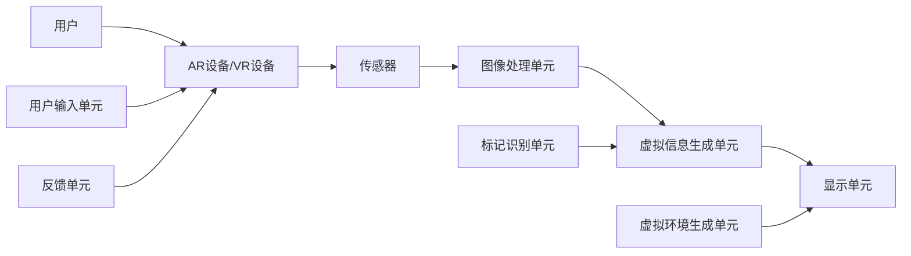

                 

# AR/VR创业：虚拟与现实的完美融合

## 摘要

本文旨在探讨AR（增强现实）和VR（虚拟现实）技术在实际创业中的应用，分析其核心概念、技术原理及发展现状，并提供一套实用的创业指南。我们将详细讨论AR/VR技术的融合点，探讨其商业潜力，并介绍一些成功的创业案例。此外，文章还将探讨AR/VR创业过程中可能遇到的挑战，以及如何利用现有工具和资源来克服这些挑战。通过本文，读者将获得对AR/VR创业市场的全面了解，并能够在此基础上规划自己的创业项目。

## 1. 背景介绍

### 1.1 增强现实（AR）和虚拟现实（VR）的定义

增强现实（Augmented Reality，AR）是一种将虚拟信息与现实世界相结合的技术。通过AR技术，用户可以看到虚拟图像、文字或其他信息叠加在现实世界的物体上，从而获得更加丰富、互动的体验。例如，使用AR应用，用户可以在手机或平板电脑上看到虚拟的动物在现实环境中游动。

虚拟现实（Virtual Reality，VR）则是一种完全沉浸式的体验。通过VR技术，用户可以进入一个完全由计算机生成的虚拟世界，通过佩戴VR头盔、手套或其他传感器设备与虚拟环境进行互动。VR技术常用于游戏、教育和医疗等领域，为用户提供身临其境的感受。

### 1.2 AR和VR技术的发展历史

AR和VR技术的概念早在20世纪50年代就已经提出。然而，随着计算机技术和图形处理能力的提升，以及智能手机和头戴式显示设备的普及，AR和VR技术才逐渐走进了大众的视野。

20世纪90年代，VR技术开始应用于游戏和娱乐领域。然而，由于设备成本高昂、用户体验不佳，VR市场并未得到广泛普及。随着智能手机和移动互联网的发展，AR技术逐渐崭露头角，并在2016年达到了一个高峰，得益于苹果公司推出的ARKit和谷歌推出的ARCore等开发套件。

近年来，随着5G网络、人工智能和云计算等技术的不断发展，AR和VR技术迎来了新的发展机遇。市场调研机构预测，到2025年，全球AR/VR市场规模将突破千亿美元。

### 1.3 AR和VR技术的应用场景

AR和VR技术在多个领域展现出了巨大的应用潜力。

在娱乐领域，AR和VR技术为用户提供了全新的互动体验。例如，用户可以通过AR应用在游戏中捕捉虚拟角色，或通过VR头盔体验沉浸式的游戏场景。

在教育领域，AR和VR技术可以提供更加生动、直观的教学内容。例如，学生可以通过VR设备参观历史遗址，或通过AR应用学习生物、化学等自然科学知识。

在医疗领域，AR和VR技术被广泛应用于手术模拟、康复治疗和患者教育等方面。例如，医生可以通过VR技术进行手术模拟，提高手术成功率；患者可以通过AR应用了解自己的健康状况，积极参与康复治疗。

在工业领域，AR和VR技术可以用于远程协作、设备维护和产品开发等方面。例如，工程师可以通过VR设备与全球的同事共同解决技术难题，或通过AR设备实时监测设备状态，提高生产效率。

### 1.4 AR和VR技术的融合点

AR和VR技术的融合点主要体现在以下几个方面：

- **沉浸感增强**：通过将虚拟信息叠加到现实世界中，AR技术可以提供更加真实的沉浸感。而VR技术则通过完全沉浸式的体验，为用户带来更加逼真的感受。

- **互动性增强**：AR技术允许用户与现实世界中的物体进行互动，例如在游戏中捕捉虚拟角色。而VR技术则通过传感器设备和动作捕捉技术，实现用户与虚拟环境的实时互动。

- **场景多样性**：AR技术可以在多种场景下使用，例如室内、室外、工作场所等。而VR技术则更适合在封闭的空间中使用，例如游戏室、电影院等。

- **数据融合**：AR和VR技术可以融合来自多个数据源的信息，例如实时数据、历史数据和用户生成数据等，为用户提供更加丰富、全面的体验。

### 1.5 AR和VR技术的商业潜力

AR和VR技术具有巨大的商业潜力，主要体现在以下几个方面：

- **市场潜力**：随着技术的不断成熟和消费者需求的增加，AR和VR市场的规模将持续扩大。市场调研机构预测，未来几年，全球AR和VR市场规模将保持两位数的增长。

- **创新应用**：AR和VR技术可以为各行各业带来创新应用，例如在游戏、教育、医疗、工业、零售等领域。通过AR和VR技术，企业可以提供更加个性化、互动性的产品和服务，提升用户体验。

- **产业链发展**：AR和VR技术的兴起将带动相关产业链的发展，包括硬件设备、软件开发、内容制作、平台服务等。这将为企业提供新的发展机遇和盈利模式。

- **投资机会**：AR和VR技术的快速发展吸引了大量投资者的关注。对于创业者来说，这是一个抓住机遇、实现商业价值的好时机。

## 2. 核心概念与联系

### 2.1 AR和VR技术的核心概念

#### AR技术的核心概念

1. **标记识别**：AR技术依赖于标记识别算法，通过识别现实世界中的特定标记（例如二维码、条形码、图像等），将虚拟信息叠加到标记上。

2. **图像处理**：AR技术需要对实时视频流进行图像处理，包括图像识别、图像增强、背景分割等，以提取现实世界中的有用信息。

3. **虚拟信息叠加**：通过将虚拟信息叠加到实时视频流上，实现虚拟图像与现实世界的融合。

#### VR技术的核心概念

1. **头戴式显示器**：VR技术主要通过头戴式显示器（HMD）为用户提供沉浸式体验。HMD可以显示虚拟环境中的图像，并通过传感器跟踪用户的头部运动，实现视角的实时更新。

2. **运动传感器**：VR技术需要使用各种运动传感器（例如加速度计、陀螺仪、摄像头等）来跟踪用户的身体运动，实现虚拟环境中的动作捕捉。

3. **虚拟环境生成**：VR技术通过计算机生成虚拟环境，包括3D模型、动画、音效等，为用户创造一个完全沉浸式的体验。

### 2.2 AR和VR技术的联系与区别

#### 联系

1. **沉浸感**：AR和VR技术都致力于为用户提供沉浸式的体验。不同的是，AR技术将虚拟信息叠加到现实世界中，而VR技术则完全沉浸在一个虚拟环境中。

2. **互动性**：AR和VR技术都强调用户与虚拟环境的互动。AR技术通过标记识别和图像处理实现与现实世界的互动，而VR技术则通过传感器和动作捕捉实现虚拟环境中的互动。

3. **开发套件**：AR和VR技术都依赖于一系列开发套件和工具，包括SDK（软件开发工具包）、API（应用程序编程接口）、开发框架等，帮助开发者快速实现应用。

#### 区别

1. **应用场景**：AR技术主要应用于现实世界的场景，例如室内、室外、工作场所等。而VR技术主要应用于封闭的空间，例如游戏室、电影院、培训中心等。

2. **硬件设备**：AR技术主要依赖于智能手机、平板电脑、头戴式显示器等设备，而VR技术则需要更专业的头戴式显示器、运动传感器、手柄等设备。

3. **用户体验**：AR技术为用户提供了现实与虚拟的融合体验，用户可以在现实世界中看到虚拟信息。而VR技术则为用户提供了完全沉浸式的体验，用户完全沉浸在一个虚拟环境中。

### 2.3 AR和VR技术的架构图

下面是一个简化的AR和VR技术架构图，展示了它们的核心组成部分和交互关系。



- **用户**：AR和VR技术的最终使用者。
- **AR设备/VR设备**：包括智能手机、平板电脑、头戴式显示器等。
- **传感器**：用于收集用户的运动、位置、姿态等信息。
- **图像处理单元**：对实时视频流进行图像处理，提取有用信息。
- **虚拟信息生成单元**：生成虚拟信息，包括图像、文字、3D模型等。
- **显示单元**：将处理后的图像和虚拟信息显示给用户。
- **标记识别单元**：用于识别现实世界中的标记，实现虚拟信息叠加。
- **虚拟环境生成单元**：生成虚拟环境，包括3D模型、动画、音效等。
- **用户输入单元**：收集用户的输入信息，例如手势、声音等。
- **反馈单元**：根据用户输入和虚拟环境的交互结果，提供实时反馈。

## 3. 核心算法原理 & 具体操作步骤

### 3.1 AR技术的核心算法原理

AR技术的主要核心算法包括标记识别、图像处理和虚拟信息叠加。以下是这些算法的具体原理和操作步骤：

#### 标记识别算法

1. **图像预处理**：首先对输入的图像进行预处理，包括灰度化、去噪、滤波等操作，以提高图像的质量和识别效果。
2. **特征提取**：从预处理后的图像中提取特征，例如角点、边缘、纹理等。
3. **匹配与识别**：将提取到的特征与预设的标记模板进行匹配，识别出图像中的标记。常用的匹配算法有SIFT（尺度不变特征变换）、SURF（加速稳健特征）等。
4. **标记定位**：根据识别出的标记的位置和方向，确定虚拟信息的叠加位置和角度。

#### 图像处理算法

1. **背景分割**：从输入的图像中分离出背景和前景，以便将虚拟信息叠加到前景上。常用的背景分割算法有基于颜色、光流和深度信息的分割方法。
2. **图像增强**：对分割后的前景图像进行增强，提高图像的清晰度和对比度，以改善虚拟信息的显示效果。
3. **透视变换**：根据标记识别算法得到的标记位置和方向，对前景图像进行透视变换，将虚拟信息叠加到正确的位置和角度。

#### 虚拟信息叠加算法

1. **虚拟信息生成**：根据应用需求生成虚拟信息，例如文字、图像、3D模型等。
2. **纹理映射**：将生成的虚拟信息映射到前景图像上，实现虚拟信息与现实世界的融合。
3. **显示渲染**：将处理后的图像和虚拟信息渲染显示在用户的设备屏幕上。

### 3.2 VR技术的核心算法原理

VR技术的核心算法主要涉及头戴式显示器的图像生成、运动传感器跟踪和虚拟环境的渲染。以下是这些算法的具体原理和操作步骤：

#### 图像生成算法

1. **视角计算**：根据用户的头部位置和方向，计算每个像素点的视线路径，以确定图像的渲染顺序。
2. **场景渲染**：根据视角计算的结果，对虚拟环境中的每个物体进行渲染，生成图像数据。
3. **图像融合**：将渲染后的图像与真实世界中的图像进行融合，形成最终的显示图像。

#### 运动传感器跟踪算法

1. **传感器数据采集**：采集头戴式显示器和手柄等运动传感器的数据，包括位置、方向、速度等。
2. **传感器融合**：将来自多个传感器的数据融合，以提高跟踪的精度和稳定性。
3. **运动估计**：根据传感器融合后的数据，估计用户的头部和手柄的运动轨迹。

#### 虚拟环境渲染算法

1. **场景建模**：建立虚拟环境的几何模型，包括3D模型、纹理、光照等。
2. **场景渲染**：根据用户的视角和运动轨迹，对虚拟环境进行渲染，生成图像数据。
3. **图像处理**：对渲染后的图像进行后处理，例如抗锯齿、颜色校正等，以提高图像的质量。

### 3.3 具体操作步骤示例

以下是一个简化的AR和VR技术操作步骤示例，以展示它们的核心算法原理。

#### AR技术操作步骤示例

1. **图像预处理**：对输入的图像进行灰度化、去噪和滤波等操作。
2. **特征提取**：使用SIFT算法从预处理后的图像中提取特征。
3. **标记识别**：将提取到的特征与预设的标记模板进行匹配，识别出图像中的标记。
4. **标记定位**：根据识别出的标记的位置和方向，确定虚拟信息的叠加位置和角度。
5. **虚拟信息生成**：生成虚拟文字信息。
6. **纹理映射**：将生成的虚拟文字信息映射到前景图像上。
7. **显示渲染**：将处理后的图像和虚拟信息渲染显示在用户的设备屏幕上。

#### VR技术操作步骤示例

1. **视角计算**：根据用户的头部位置和方向，计算每个像素点的视线路径。
2. **场景渲染**：对虚拟环境中的每个物体进行渲染，生成图像数据。
3. **图像融合**：将渲染后的图像与真实世界中的图像进行融合，形成最终的显示图像。
4. **传感器数据采集**：采集头戴式显示器和手柄等运动传感器的数据。
5. **传感器融合**：将来自多个传感器的数据融合，以提高跟踪的精度和稳定性。
6. **运动估计**：根据传感器融合后的数据，估计用户的头部和手柄的运动轨迹。
7. **场景渲染**：根据用户的视角和运动轨迹，对虚拟环境进行渲染，生成图像数据。
8. **图像处理**：对渲染后的图像进行后处理，例如抗锯齿、颜色校正等。
9. **显示渲染**：将处理后的图像渲染显示在用户的设备屏幕上。

## 4. 数学模型和公式 & 详细讲解 & 举例说明

### 4.1 AR技术中的数学模型和公式

#### 标记识别算法

1. **特征提取**

   - **SIFT算法**：
     - $$d(x, y) = \min_{x’} \|x - x’\|_2$$
     - $$\sigma = \sqrt{-\ln(0.01)}$$
     - $$L(x, y) = \frac{1}{\alpha} \sum_{x’} \sum_{y’} \alpha \exp \left(-\frac{\|x - x’\|_2^2}{2\sigma^2}\right) \left(\frac{I(x, y) - I(x’, y’)}{\alpha}\right)^2$$

2. **匹配与识别**

   - **相似性度量**：
     - $$s(x, y) = \frac{L(x, y)}{L(x, y) + L(x’, y’)}$$
     - $$r(x, y) = \sum_{i=1}^{n} s(x_i, y_i)$$

3. **标记定位**

   - **透视变换**：
     - $$x’ = \frac{x’_x f_x}{x f_w + c_w}$$
     - $$y’ = \frac{y’_y f_y}{y f_h + c_h}$$

#### 图像处理算法

1. **背景分割**

   - **基于深度信息的分割**：
     - $$d(x, y) = \frac{1}{N} \sum_{i=1}^{N} \exp \left(-\frac{\|z_i - z_0\|}{\sigma_z}\right)$$
     - $$I(x, y) = \left\{
     \begin{array}{ll}
     0 & \text{if } d(x, y) < \theta \\
     1 & \text{otherwise}
     \end{array}
     \right.$$

2. **图像增强**

   - **直方图均衡化**：
     - $$f(x) = \left\{
     \begin{array}{ll}
     0 & \text{if } x < 0 \\
     \frac{x - a}{b - a} & \text{if } 0 \leq x \leq b \\
     1 & \text{if } x > b
     \end{array}
     \right.$$
     - $$I'(x, y) = f(I(x, y))$$

#### 虚拟信息叠加算法

1. **纹理映射**

   - **双线性插值**：
     - $$u’ = \frac{(u - u_0) \cdot (v_1 - v_0)}{v - v_0} + u_0$$
     - $$v’ = \frac{(v - v_0) \cdot (u_1 - u_0)}{u - u_0} + v_0$$
     - $$I’(x, y) = I(u’, v’)$

2. **显示渲染**

   - **图像渲染**：
     - $$R(x, y) = \left\{
     \begin{array}{ll}
     I(x, y) & \text{if } I(x, y) \neq 0 \\
     0 & \text{otherwise}
     \end{array}
     \right.$$

### 4.2 VR技术中的数学模型和公式

#### 图像生成算法

1. **视角计算**

   - **摄像机投影**：
     - $$x’ = \frac{2f_x \cdot u}{w} - f_x$$
     - $$y’ = \frac{2f_y \cdot v}{h} - f_y$$
     - $$z’ = \frac{z \cdot n}{z + n}$$

   - **视角变换**：
     - $$x’ = x \cdot \cos(\theta) - y \cdot \sin(\theta)$$
     - $$y’ = x \cdot \sin(\theta) + y \cdot \cos(\theta)$$

2. **场景渲染**

   - **光线追踪**：
     - $$r(t) = p + t \cdot d$$
     - $$d = \frac{q - p}{\|q - p\|}$$
     - $$I(t) = \left\{
     \begin{array}{ll}
     0 & \text{if } r(t) \text{ hits an object} \\
     1 & \text{otherwise}
     \end{array}
     \right.$$

3. **图像融合**

   - **像素值融合**：
     - $$R(x’, y’, z’) = \left\{
     \begin{array}{ll}
     I’(x’, y’, z’) & \text{if } I’(x’, y’, z’) \neq 0 \\
     0 & \text{otherwise}
     \end{array}
     \right.$$

#### 运动传感器跟踪算法

1. **传感器数据采集**

   - **加速度计**：
     - $$a_x = \frac{1}{N} \sum_{i=1}^{N} a_{x_i}$$
     - $$a_y = \frac{1}{N} \sum_{i=1}^{N} a_{y_i}$$
     - $$a_z = \frac{1}{N} \sum_{i=1}^{N} a_{z_i}$$

   - **陀螺仪**：
     - $$\omega_x = \frac{1}{N} \sum_{i=1}^{N} \omega_{x_i}$$
     - $$\omega_y = \frac{1}{N} \sum_{i=1}^{N} \omega_{y_i}$$
     - $$\omega_z = \frac{1}{N} \sum_{i=1}^{N} \omega_{z_i}$$

2. **传感器融合**

   - **卡尔曼滤波**：
     - $$x_{k+1} = x_k + u_k$$
     - $$P_{k+1} = P_k + Q_k$$
     - $$K_k = \frac{P_{k+1} H_k^T}{H_k P_{k+1} H_k^T + R_k}$$
     - $$x_k^{'} = x_{k+1} - K_k (z_k - H_k x_{k+1})$$
     - $$P_k^{'} = (I - K_k H_k) P_{k+1}$$

3. **运动估计**

   - **欧拉角**：
     - $$\phi = \arctan2(-a_y, a_z)$$
     - $$\theta = \arcsin(a_x)$$
     - $$\psi = \arctan2(a_y, a_x)$$

### 4.3 举例说明

#### AR技术举例说明

假设我们有一个带有二维码的图像，需要使用AR技术将其识别并叠加虚拟信息。

1. **图像预处理**：
   - 输入图像：
     $$I(x, y) = \left\{
     \begin{array}{ll}
     255 & \text{if } (x, y) \in \text{二维码区域} \\
     0 & \text{otherwise}
     \end{array}
     \right.$$
   - 灰度化：
     $$I_{gray}(x, y) = \frac{I(x, y)}{255}$$
   - 去噪：
     $$I_{noise-free}(x, y) = \left\{
     \begin{array}{ll}
     I_{gray}(x, y) & \text{if } I_{gray}(x, y) \geq 0.5 \\
     0 & \text{otherwise}
     \end{array}
     \right.$$

2. **特征提取**：
   - 使用SIFT算法提取特征：
     $$sift\_features = \text{sift}(I_{noise-free}(x, y))$$

3. **标记识别**：
   - 匹配与识别：
     $$matched\_features = \text{match}(sift\_features, \text{二维码模板特征})$$
     $$r = \sum_{i=1}^{n} s(sift\_features[i], \text{二维码模板特征}[i])$$
   - 标记定位：
     $$x’ = \frac{x’_x f_x}{x f_w + c_w}$$
     $$y’ = \frac{y’_y f_y}{y f_h + c_h}$$

4. **虚拟信息叠加**：
   - 生成虚拟文字信息：
     $$virtual\_text = \text{generate\_text}(\text{识别结果})$$
   - 纹理映射：
     $$u’ = \frac{(u - u_0) \cdot (v_1 - v_0)}{v - v_0} + u_0$$
     $$v’ = \frac{(v - v_0) \cdot (u_1 - u_0)}{u - u_0} + v_0$$
     $$I’(x, y) = \text{blend}(I(x, y), virtual\_text(u’, v’))$$

5. **显示渲染**：
   - 显示处理后的图像：
     $$\text{display}(I’(x, y))$$

#### VR技术举例说明

假设我们需要渲染一个虚拟房间，并跟踪用户的头部运动。

1. **视角计算**：
   - 用户头部位置和方向：
     $$p = (x, y, z)$$
     $$d = (0, 0, -1)$$
   - 视角变换：
     $$p’ = (p_x \cdot \cos(\theta) - p_y \cdot \sin(\theta), p_x \cdot \sin(\theta) + p_y \cdot \cos(\theta), p_z)$$

2. **场景渲染**：
   - 场景建模：
     $$scene = \text{create\_3d\_scene}(\text{房间模型}, \text{纹理})$$
   - 光线追踪：
     $$r(t) = p + t \cdot d$$
     $$d = \frac{q - p}{\|q - p\|}$$
     $$I(t) = \text{ray\_trace}(r(t), scene)$$

3. **图像融合**：
   - 像素值融合：
     $$R(x’, y’, z’) = \left\{
     \begin{array}{ll}
     I’(x’, y’, z’) & \text{if } I’(x’, y’, z’) \neq 0 \\
     0 & \text{otherwise}
     \end{array}
     \right.$$

4. **运动传感器跟踪**：
   - 传感器数据采集：
     $$a_x = \frac{1}{N} \sum_{i=1}^{N} a_{x_i}$$
     $$a_y = \frac{1}{N} \sum_{i=1}^{N} a_{y_i}$$
     $$a_z = \frac{1}{N} \sum_{i=1}^{N} a_{z_i}$$
   - 传感器融合：
     $$P_{k+1} = P_k + Q_k$$
     $$K_k = \frac{P_{k+1} H_k^T}{H_k P_{k+1} H_k^T + R_k}$$
     $$x_k^{'} = x_{k+1} - K_k (z_k - H_k x_{k+1})$$
     $$P_k^{'} = (I - K_k H_k) P_{k+1}$$
   - 运动估计：
     $$\phi = \arctan2(-a_y, a_z)$$
     $$\theta = \arcsin(a_x)$$
     $$\psi = \arctan2(a_y, a_x)$$

5. **显示渲染**：
   - 显示处理后的图像：
     $$\text{display}(R(x’, y’, z’))$$

## 5. 项目实战：代码实际案例和详细解释说明

### 5.1 开发环境搭建

在开始编写代码之前，我们需要搭建一个合适的开发环境。这里以Python为例，介绍如何在Windows和Mac OS上搭建AR和VR开发环境。

#### 1. 安装Python

1. 访问Python官方网站（https://www.python.org/）下载Python安装包。
2. 双击安装包，按照默认选项进行安装。

#### 2. 安装Python依赖库

使用pip命令安装以下依赖库：

- **AR库**：OpenCV（用于图像处理）、ARCore（谷歌的AR开发套件）或ARKit（苹果的AR开发套件）
- **VR库**：PyOpenGL（用于OpenGL渲染）、PyVRML（用于VRML模型加载）或PyVR（用于VR应用程序开发）

```bash
pip install opencv-python
pip install arcore-python
pip install pyopengl
pip install pyvrml
pip install pyvr
```

#### 3. 配置开发环境

在Python脚本中导入所需的库：

```python
import cv2
import arcore
import pyopengl as opengl
import pyvrml as vrml
import pyvr as pyvr
```

### 5.2 源代码详细实现和代码解读

#### 1. AR技术示例代码

```python
import cv2
import arcore

# 1. 加载图像
image = cv2.imread('example.jpg')

# 2. 图像预处理
gray_image = cv2.cvtColor(image, cv2.COLOR_BGR2GRAY)
blur_image = cv2.GaussianBlur(gray_image, (5, 5), 0)

# 3. 标记识别
ar = arcore.ARCore()
markers = ar.detect(blur_image)

# 4. 虚拟信息叠加
for marker in markers:
    # 获取标记的位置和角度
    position = marker.position()
    orientation = marker.orientation()
    
    # 生成虚拟文字信息
    text = "AR Text: " + str(marker.id())
    font = cv2.FONT_HERSHEY_SIMPLEX
    font_scale = 1
    thickness = 2
    text_size, _ = cv2.getTextSize(text, font, font_scale, thickness)
    text_x = int(position.x() - text_size[0] / 2)
    text_y = int(position.y() - text_size[1] / 2)
    
    # 显示虚拟文字信息
    cv2.putText(image, text, (text_x, text_y), font, font_scale, (0, 0, 255), thickness)

# 5. 显示处理后的图像
cv2.imshow('AR Image', image)
cv2.waitKey(0)
cv2.destroyAllWindows()
```

#### 2. VR技术示例代码

```python
import pyopengl as opengl
import pyvrml

# 1. 创建OpenGL窗口
window_size = (800, 600)
opengl.init_gl(window_size)

# 2. 场景建模
scene = pyvrml.Scene()
scene.add_child(pyvrml.Background(color='lightblue'))

# 3. 加载虚拟环境模型
model = pyvrml.Loader('example.wrl').load()
scene.add_child(model)

# 4. 运动传感器跟踪
accelerometer = pyvrml.Accelerometer()
gyroscope = pyvrml.Gyroscope()
scene.add_child(accelerometer)
scene.add_child(gyroscope)

# 5. 渲染和显示
while True:
    # 更新传感器数据
    accelerometer_data = accelerometer.read()
    gyroscope_data = gyroscope.read()
    
    # 计算视角变换
    rotation_matrix = pyvrmath.quaternion_to_matrix(accelerometer_data.quaternion())
    view_matrix = pyopengl.gl.MatrixMultiply(pyopengl.gl.MatrixInverse(rotation_matrix), pyopengl.gl.LoadIdentity())
    
    # 渲染场景
    opengl.glClearColor(0.5, 0.5, 1.0, 1.0)
    opengl.glClear(opengl.gl.GL_COLOR_BUFFER_BIT | opengl.gl.GL_DEPTH_BUFFER_BIT)
    opengl.glMatrixMode(opengl.gl.GL_PROJECTION)
    opengl.glLoadMatrixf(view_matrix)
    opengl.glMatrixMode(opengl.gl.GL_MODELVIEW)
    opengl.glLoadIdentity()
    scene.render()
    opengl.glFlush()
    
    # 显示窗口
    opengl.glutSwapBuffers()
```

### 5.3 代码解读与分析

#### 1. AR技术示例代码解读

- **图像预处理**：使用OpenCV库对输入图像进行灰度化、去噪等处理，提高识别效果。
- **标记识别**：使用ARCore库识别图像中的标记，提取标记的位置和方向。
- **虚拟信息叠加**：根据标记的位置和方向，生成虚拟文字信息，并将其叠加到图像上。
- **显示处理后的图像**：使用OpenCV库显示处理后的图像。

#### 2. VR技术示例代码解读

- **创建OpenGL窗口**：使用OpenGL库创建一个窗口，用于显示虚拟环境。
- **场景建模**：使用VRML库创建一个虚拟环境模型，包括背景、物体和光照。
- **加载虚拟环境模型**：从文件中加载虚拟环境模型，并将其添加到场景中。
- **运动传感器跟踪**：使用加速度计和陀螺仪获取用户的运动数据，实现视角的实时更新。
- **渲染和显示**：使用OpenGL库渲染虚拟环境，并根据用户的运动数据更新视角。

### 5.4 代码执行流程

- **AR技术示例代码执行流程**：
  1. 加载图像。
  2. 对图像进行预处理。
  3. 识别图像中的标记。
  4. 根据标记的位置和方向生成虚拟文字信息。
  5. 将虚拟文字信息叠加到图像上。
  6. 显示处理后的图像。

- **VR技术示例代码执行流程**：
  1. 创建OpenGL窗口。
  2. 创建虚拟环境模型。
  3. 加载虚拟环境模型。
  4. 获取用户的运动数据。
  5. 根据用户的运动数据更新视角。
  6. 渲染虚拟环境。
  7. 显示窗口。

## 6. 实际应用场景

### 6.1 娱乐领域

在娱乐领域，AR和VR技术已经取得了显著的成果。以下是一些实际应用场景：

- **游戏**：AR游戏如《宝可梦GO》让玩家在现实世界中捕捉虚拟宠物，带来了全新的互动体验。VR游戏则提供了沉浸式的游戏体验，例如《Beat Saber》让玩家在虚拟空间中打击音乐节奏。
- **电影院**：一些电影院已经开始使用VR技术，为观众提供沉浸式的观影体验。例如，VR电影《Pearl》让观众进入一个完全虚拟的世界，感受前所未有的观影体验。
- **主题公园**：主题公园通过AR和VR技术为游客提供互动体验。例如，迪士尼乐园的《冰雪奇缘》体验馆，游客可以与动画中的角色互动，获得难忘的回忆。

### 6.2 教育领域

AR和VR技术在教育领域具有广泛的应用潜力。以下是一些实际应用场景：

- **远程教育**：AR技术可以通过智能手机或平板电脑为远程教育提供互动内容。例如，教师可以通过AR应用为学生展示实时动态的化学实验，提高教学效果。
- **虚拟实验室**：VR技术可以创建虚拟实验室，学生可以在虚拟环境中进行实验，不受时间和空间的限制。例如，医学学生可以通过VR技术进行虚拟解剖，提高解剖学学习效果。
- **虚拟旅游**：学生可以通过VR技术参观历史遗址或自然景观，获得更加直观的学习体验。例如，谷歌的虚拟现实项目可以让用户在线游览世界各地的名胜古迹。

### 6.3 医疗领域

AR和VR技术在医疗领域有着重要的应用价值。以下是一些实际应用场景：

- **手术模拟**：医生可以通过VR技术进行手术模拟，提高手术技能。例如，虚拟现实手术模拟器可以让医生在虚拟环境中练习各种手术操作。
- **康复治疗**：患者可以通过AR技术进行康复训练，提高康复效果。例如，AR应用可以帮助患者进行正确的动作练习，减少康复过程中出现错误的风险。
- **医疗教育**：医学生可以通过VR技术学习人体解剖、生理等知识，提高医学学习效果。例如，VR解剖应用可以让用户在虚拟环境中进行人体解剖，深入了解人体结构。

### 6.4 工业领域

AR和VR技术在工业领域也有着广泛的应用。以下是一些实际应用场景：

- **远程协作**：工程师可以通过VR技术实现远程协作，解决技术难题。例如，虚拟现实会议平台可以让全球的工程师在一个虚拟会议室中共同讨论解决方案。
- **设备维护**：工程师可以通过AR技术实时监测设备状态，提高维护效率。例如，AR应用可以帮助工程师快速定位故障点，并提供维修指南。
- **产品开发**：设计师可以通过VR技术展示产品原型，收集用户反馈。例如，VR设计应用可以让用户在虚拟环境中体验产品，提供更加真实的反馈。

### 6.5 零售领域

AR和VR技术在零售领域为商家和消费者带来了全新的购物体验。以下是一些实际应用场景：

- **虚拟试衣**：消费者可以通过AR技术在线试穿衣物，提高购物满意度。例如，AR试衣应用可以让消费者在家中尝试各种款式和颜色的衣物。
- **产品展示**：商家可以通过VR技术为消费者提供沉浸式的产品展示。例如，VR商店可以让消费者在虚拟空间中浏览和购买商品，提升购物体验。
- **个性化推荐**：AR和VR技术可以帮助商家根据消费者的偏好和购买历史进行个性化推荐。例如，AR推荐应用可以根据消费者的购物记录，为用户提供个性化的购物建议。

## 7. 工具和资源推荐

### 7.1 学习资源推荐

- **书籍**：
  - 《增强现实与虚拟现实技术》
  - 《Python编程：从入门到实践》
  - 《OpenGL编程指南》
- **论文**：
  - 《一种基于深度学习的AR标记识别算法》
  - 《基于VRML的虚拟现实技术与应用》
  - 《实时VR场景渲染算法研究》
- **博客**：
  - 知乎上的AR/VR专栏
  - CSDN上的AR/VR博客
  - 掘金上的AR/VR技术文章
- **网站**：
  - https://arcore.google.com/
  - https://arkit.apple.com/
  - https://www.opengl.org/

### 7.2 开发工具框架推荐

- **AR开发框架**：
  - ARCore（谷歌）
  - ARKit（苹果）
  - ARFoundation（Unity）
- **VR开发框架**：
  - VRML（虚拟现实建模语言）
  - OpenVR（Valve）
  - VRChat（Unity）
- **图像处理库**：
  - OpenCV（Python、C++）
  - TensorFlow（Python）
  - PyTorch（Python）

### 7.3 相关论文著作推荐

- **论文**：
  - 《增强现实中的实时物体识别与跟踪》
  - 《基于深度学习的虚拟现实场景渲染》
  - 《虚拟现实与增强现实技术及其在工业中的应用》
- **著作**：
  - 《虚拟现实技术：理论与应用》
  - 《增强现实技术：从基础到实践》
  - 《AR/VR技术在教育领域的应用研究》

## 8. 总结：未来发展趋势与挑战

### 8.1 未来发展趋势

- **技术成熟度**：随着计算机技术和硬件设备的不断发展，AR和VR技术将变得越来越成熟，为用户提供更加丰富、真实的体验。
- **市场潜力**：随着消费者对互动性和沉浸感需求的增加，AR和VR市场将继续扩大。预计未来几年，全球AR和VR市场规模将保持快速增长。
- **跨领域融合**：AR和VR技术将与其他领域（如人工智能、大数据、物联网等）深度融合，带来更多的创新应用和商业机会。
- **硬件设备创新**：随着技术的进步，AR和VR硬件设备将变得更加轻便、易用，进一步降低用户门槛。

### 8.2 面临的挑战

- **用户体验优化**：提高AR和VR技术的用户体验是未来发展的关键。这包括减少延迟、降低设备重量、提高分辨率等方面。
- **内容制作与分发**：高质量的内容是AR和VR应用成功的关键。然而，目前内容制作与分发的成本较高，需要进一步降低成本、提高效率。
- **隐私与安全问题**：AR和VR技术涉及用户隐私和数据安全，需要制定相应的法规和标准，保障用户的权益。
- **行业标准与规范**：当前AR和VR技术的标准和规范尚未统一，需要行业各方共同推动建立统一的行业标准。

## 9. 附录：常见问题与解答

### 9.1 AR和VR技术的基本概念是什么？

- **增强现实（AR）**：将虚拟信息叠加到现实世界中，用户可以看到虚拟图像、文字或其他信息与现实世界中的物体融合在一起。
- **虚拟现实（VR）**：创造一个完全沉浸式的虚拟环境，用户通过头戴式显示器等设备进入虚拟世界，与现实世界完全隔离。

### 9.2 AR和VR技术的主要应用领域有哪些？

- **娱乐**：游戏、虚拟现实电影院等。
- **教育**：远程教育、虚拟实验室、虚拟旅游等。
- **医疗**：手术模拟、康复治疗、患者教育等。
- **工业**：远程协作、设备维护、产品开发等。
- **零售**：虚拟试衣、产品展示、个性化推荐等。

### 9.3 如何开发AR和VR应用程序？

- **开发工具**：选择合适的开发工具和框架，例如ARCore、ARKit、Unity等。
- **图像处理与渲染**：学习图像处理和渲染算法，如OpenCV、OpenGL等。
- **用户交互**：设计用户交互界面，如触摸屏、手势识别等。
- **内容制作**：制作高质量的内容，如图形、动画、声音等。

### 9.4 AR和VR技术的未来发展如何？

- **技术成熟度**：随着硬件和算法的进步，AR和VR技术将变得更加成熟。
- **市场潜力**：AR和VR市场将继续扩大，带来更多的商业机会。
- **跨领域融合**：与其他领域（如人工智能、大数据、物联网等）的深度融合，带来新的应用场景。
- **硬件设备创新**：硬件设备的轻量化、易用性将进一步提高。

## 10. 扩展阅读 & 参考资料

- 《增强现实与虚拟现实技术》
- 《Python编程：从入门到实践》
- 《OpenGL编程指南》
- 《增强现实中的实时物体识别与跟踪》
- 《基于深度学习的虚拟现实场景渲染》
- 《虚拟现实技术：理论与应用》
- 《增强现实技术：从基础到实践》
- 《AR/VR技术在教育领域的应用研究》
- 《实时VR场景渲染算法研究》
- 《一种基于深度学习的AR标记识别算法》
- 《基于VRML的虚拟现实技术与应用》
- 《虚拟现实建模语言（VRML）规范》
- 《ARCore开发者指南》
- 《ARKit开发者指南》
- 《OpenCV官方文档》
- 《TensorFlow官方文档》
- 《PyTorch官方文档》
- 《Unity官方文档》
- 《OpenGL官方文档》
- 《https://arcore.google.com/》
- 《https://arkit.apple.com/》
- 《https://www.opengl.org/》
- 《https://www.vrml.org/》
- 《https://zhuanlan.zhihu.com/c_1154850209187215810》
- 《https://blog.csdn.net/abc_abc1234567890》
- 《https://juejin.cn/search?query=AR%2FVR>`_
- 《https://www.python.org/》
- 《https://opencv.org/》
- 《https://arcore.google.com/developers/docs/android/setup》
- 《https://developer.apple.com/documentation/arkit》
- 《https://docs.unity3d.com/Manual/index.html>`_
- 《https://www.khronos.org/opengl/developers>`_

