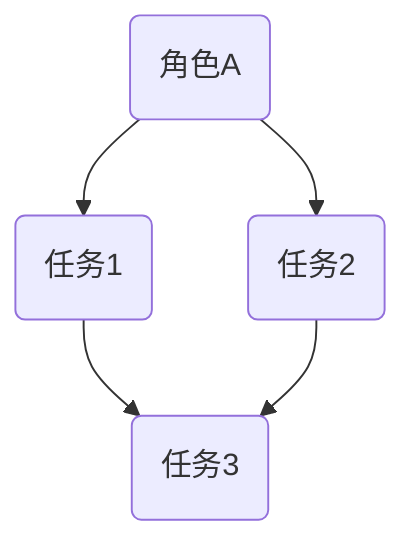
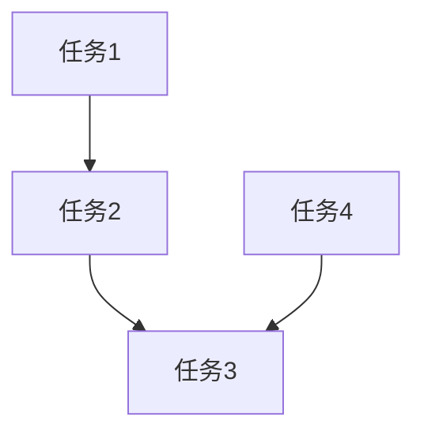
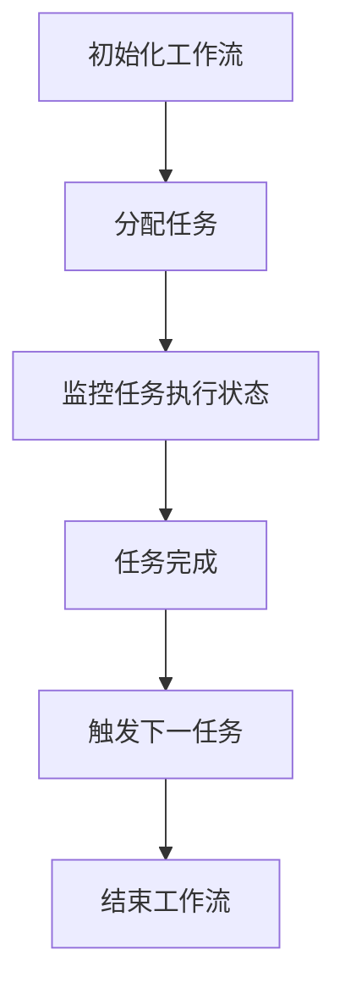
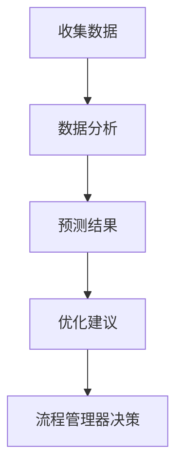
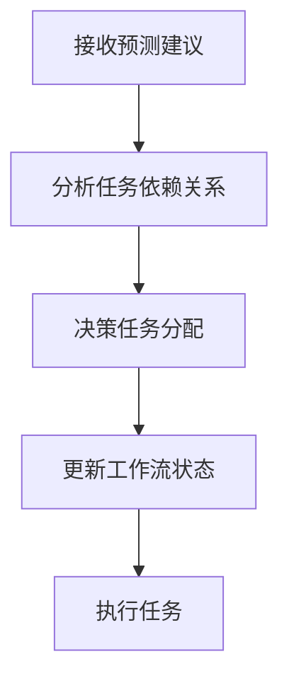

                 

# Agentic Workflow 驱动角色工作流变革

## 摘要

在当今快速变化的技术环境中，角色工作流的设计与管理成为了企业运营效率和竞争力的重要因素。本文将深入探讨Agentic Workflow这一创新概念，分析其核心原理、算法、数学模型，并结合实际案例，展示如何通过Agentic Workflow实现角色工作流的彻底变革。我们将探讨其在企业中的应用场景、推荐相关工具和资源，并总结其未来发展趋势与挑战。

## 1. 背景介绍

在现代企业中，工作流设计与管理是确保业务流程高效运作的关键。然而，传统的流程管理方法往往局限于线性流程和预设规则，无法灵活应对复杂多变的企业环境。随着人工智能和自动化技术的发展，Agentic Workflow应运而生，它通过引入角色概念和智能化决策机制，为工作流管理提供了全新的思路和工具。

Agentic Workflow的核心在于“角色”和“任务”的分离。通过定义不同的角色和赋予它们相应的权限和责任，工作流系统能够更加灵活地适应企业需求，实现动态调整和优化。同时，Agentic Workflow利用人工智能技术，对工作流中的各个环节进行实时监控和智能决策，从而提高整个流程的响应速度和效率。

本文将首先介绍Agentic Workflow的基本概念和原理，随后深入分析其算法和数学模型，并通过实际案例展示其在企业中的应用。最后，我们将探讨Agentic Workflow的未来发展趋势和潜在挑战，为读者提供全面的参考。

## 2. 核心概念与联系

### 2.1 角色（Roles）

在Agentic Workflow中，角色是核心概念之一。角色代表了执行特定任务的实体，可以是人类角色或系统角色。每个角色都被赋予了特定的权限和责任，以执行系统分配的任务。

#### 角色-任务关系图（Role-Task Relationship）

下图展示了角色与任务之间的基本关系：



在这个例子中，角色A可以执行任务1和任务2，而任务3必须由角色B或角色C来完成。

### 2.2 任务（Tasks）

任务是在Agentic Workflow中需要完成的特定工作。每个任务都有特定的输入和输出，以及可能需要执行的动作。

#### 任务依赖图（Task Dependency）

任务之间的依赖关系可以通过以下图示表示：



在这个例子中，任务1完成后才能开始任务2，而任务3和任务4在任务2完成后都可以开始。

### 2.3 流程管理器（Workflow Manager）

流程管理器是Agentic Workflow的核心组件，负责协调和管理整个工作流。它通过分析角色和任务的属性，动态分配任务给合适的角色，并监控整个流程的执行状态。

#### 流程管理器工作流程

以下是流程管理器的工作流程示意图：



在这个流程中，流程管理器首先初始化工作流，然后分配任务给角色，监控任务执行状态，并在任务完成后触发下一任务，直至整个工作流完成。

### 2.4 人工智能代理（Artificial Intelligence Agent）

人工智能代理是Agentic Workflow中的智能组件，负责分析和预测工作流中的各种情况，为流程管理器提供决策支持。代理通过机器学习算法和历史数据，预测任务执行时间和资源需求，为流程优化提供依据。

#### 人工智能代理工作流程

以下是人工智能代理的工作流程示意图：



在这个流程中，代理首先收集工作流中的各种数据，进行分析和预测，提供优化建议，供流程管理器决策。

### 2.5 决策引擎（Decision Engine）

决策引擎是Agentic Workflow的智能核心，负责根据人工智能代理的预测和建议，动态调整工作流中的任务分配和执行策略。决策引擎通过复杂的算法和规则库，确保工作流的高效运行。

#### 决策引擎工作流程

以下是决策引擎的工作流程示意图：



在这个流程中，决策引擎首先接收人工智能代理的预测和建议，分析任务依赖关系，进行任务分配，并更新工作流状态，确保任务能够按照最优策略执行。

通过上述核心概念的介绍，我们可以看到Agentic Workflow是如何通过角色、任务、流程管理器、人工智能代理和决策引擎等组件，实现工作流的高效管理和动态调整的。接下来，我们将进一步探讨Agentic Workflow的核心算法原理和具体操作步骤。

## 3. 核心算法原理 & 具体操作步骤

### 3.1 算法原理

Agentic Workflow的核心算法基于多智能体系统（Multi-Agent System）和人工智能决策理论。该算法的主要目标是实现工作流中任务的自动化分配、执行和监控，确保流程的高效性和灵活性。

#### 3.1.1 多智能体系统

多智能体系统是一种分布式计算模型，其中多个智能体（Agent）相互协作，共同完成复杂任务。在Agentic Workflow中，智能体可以是人类角色或系统角色，它们通过通信机制和共享信息，实现任务的协同执行。

#### 3.1.2 人工智能决策理论

人工智能决策理论关注如何通过数据分析和模型预测，为决策提供支持。在Agentic Workflow中，人工智能代理通过收集工作流数据，使用机器学习算法进行分析，为流程管理器提供决策建议。

### 3.2 操作步骤

下面是Agentic Workflow的具体操作步骤：

#### 3.2.1 初始化工作流

- 定义角色：根据企业需求，定义所有需要参与工作流的角色，包括人类角色和系统角色。
- 定义任务：根据工作流的要求，定义所有需要完成的任务，并明确每个任务的输入和输出。
- 配置流程管理器：初始化流程管理器，设置工作流的基本参数，如任务分配规则、监控频率等。

#### 3.2.2 分配任务

- 数据收集：流程管理器开始收集工作流中的各种数据，包括任务执行时间、角色状态等。
- 代理预测：人工智能代理根据收集的数据，使用机器学习算法预测任务执行时间和资源需求。
- 决策任务分配：决策引擎根据人工智能代理的预测结果，动态分配任务给合适的角色。

#### 3.2.3 执行任务

- 角色执行：被分配到任务的角色开始执行任务，并根据任务的输入和输出，生成相应的结果。
- 数据更新：角色在执行任务时，将实时更新任务状态和资源使用情况，供流程管理器监控。

#### 3.2.4 监控与调整

- 监控任务状态：流程管理器持续监控任务的执行状态，包括任务完成时间、资源使用情况等。
- 分析执行情况：人工智能代理根据任务执行情况，重新评估任务分配和资源需求。
- 动态调整：决策引擎根据人工智能代理的分析结果，动态调整任务分配和执行策略。

#### 3.2.5 工作流结束

- 任务完成：当所有任务都完成后，工作流进入结束状态。
- 数据总结：流程管理器对整个工作流进行数据总结，包括任务完成时间、资源使用情况等。

### 3.3 算法实现

以下是一个简化的Agentic Workflow算法实现：

```python
# 初始化工作流
def initialize_workflow():
    # 定义角色和任务
    roles = define_roles()
    tasks = define_tasks()
    workflow_manager = configure_workflow_manager(roles, tasks)
    
    return workflow_manager

# 分配任务
def assign_tasks(workflow_manager):
    data = collect_data(workflow_manager)
    predictions = agent_predict(data)
    tasks = decision_engine.predict_tasks(predictions)
    
    for role, task in tasks.items():
        assign_task_to_role(role, task)

# 执行任务
def execute_tasks():
    while not all_tasks_completed():
        update_task_states()
        agents_analyze()
        decision_engine.adjust_tasks()

# 监控与调整
def monitor_and_adjust():
    while not workflow_completed():
        monitor_task_states()
        agents_analyze()
        decision_engine.adjust_tasks()

# 工作流结束
def workflow_completed():
    return all_tasks_completed()

# 主程序
def main():
    workflow_manager = initialize_workflow()
    assign_tasks(workflow_manager)
    execute_tasks()
    monitor_and_adjust()
    summarize_data()

if __name__ == "__main__":
    main()
```

通过上述步骤和算法实现，Agentic Workflow能够实现工作流的高效管理和动态调整，为企业运营提供强大的支持。接下来，我们将进一步探讨Agentic Workflow中的数学模型和公式。

## 4. 数学模型和公式 & 详细讲解 & 举例说明

### 4.1 数学模型

Agentic Workflow中的数学模型主要用于任务分配、资源调度和优化决策。以下是一些核心的数学模型和公式：

#### 4.1.1 任务分配模型

任务分配模型用于确定每个角色应该执行哪个任务。该模型基于角色的能力和任务的优先级，通过优化算法找到最佳的任务分配方案。

- **角色能力函数**：表示角色的能力和任务的需求。

  $$ C_r(t) = \sum_{i=1}^{n} c_{ri} \cdot w_i $$

  其中，\( C_r(t) \) 是角色 \( r \) 在时间 \( t \) 的能力，\( c_{ri} \) 是角色 \( r \) 在任务 \( i \) 上的能力值，\( w_i \) 是任务 \( i \) 的权重。

- **任务优先级函数**：表示任务的紧急程度和重要性。

  $$ P_t(t) = \alpha \cdot e^{-\beta \cdot t} + \gamma $$

  其中，\( P_t(t) \) 是任务 \( t \) 在时间 \( t \) 的优先级，\( \alpha \) 和 \( \beta \) 是调节参数，\( \gamma \) 是常数。

- **任务分配优化公式**：用于找到最佳的任务分配方案。

  $$ \min \sum_{r,t} (C_r(t) - P_t(t))^2 $$

  该公式的目标是最小化角色能力和任务优先级之间的差距。

#### 4.1.2 资源调度模型

资源调度模型用于确保工作流中资源的有效利用。该模型考虑任务执行时间和资源需求，通过优化算法找到最佳的资源调度方案。

- **资源需求函数**：表示任务在特定时间点的资源需求。

  $$ R_t(t) = \sum_{i=1}^{n} r_{ti} \cdot w_i $$

  其中，\( R_t(t) \) 是任务 \( t \) 在时间 \( t \) 的资源需求，\( r_{ti} \) 是任务 \( t \) 在资源 \( i \) 上的需求值，\( w_i \) 是资源 \( i \) 的权重。

- **资源可用性函数**：表示在特定时间点的资源可用性。

  $$ A_i(t) = \sum_{j=1}^{m} a_{ij} \cdot w_j $$

  其中，\( A_i(t) \) 是资源 \( i \) 在时间 \( t \) 的可用性，\( a_{ij} \) 是资源 \( i \) 在任务 \( j \) 上的可用性值，\( w_j \) 是任务 \( j \) 的权重。

- **资源调度优化公式**：用于找到最佳的资源调度方案。

  $$ \min \sum_{t,i} (R_t(t) - A_i(t))^2 $$

  该公式的目标是最小化任务资源需求与资源可用性之间的差距。

#### 4.1.3 优化决策模型

优化决策模型用于动态调整工作流中的任务分配和资源调度。该模型基于历史数据和当前状态，通过机器学习算法和优化算法，为流程管理器提供决策支持。

- **历史数据记录**：记录工作流中的任务执行时间和资源使用情况。

  $$ D = \{ (t_i, r_i, a_i) | t_i \in [0, T], r_i \in \text{roles}, a_i \in \text{agents} \} $$

  其中，\( D \) 是历史数据集合，\( t_i \) 是任务执行时间，\( r_i \) 是角色，\( a_i \) 是代理。

- **决策优化公式**：用于更新任务分配和资源调度策略。

  $$ \pi_t^* = \arg \min_{\pi_t} \sum_{r,t} (\pi_t(r,t) \cdot (C_r(t) - P_t(t))^2 + \lambda \cdot (\pi_t(r,t) - 1)^2) $$

  其中，\( \pi_t^* \) 是最佳决策策略，\( \pi_t(r,t) \) 是角色 \( r \) 在时间 \( t \) 执行任务的概率，\( \lambda \) 是调节参数。

### 4.2 举例说明

假设我们有一个包含三个角色（A、B、C）和三个任务（T1、T2、T3）的工作流。以下是具体的例子：

#### 4.2.1 角色能力函数

- 角色A的能力：

  $$ C_A(t) = 10 \cdot w_1 + 20 \cdot w_2 = 30 $$

- 角色B的能力：

  $$ C_B(t) = 15 \cdot w_1 + 25 \cdot w_2 = 40 $$

- 角色C的能力：

  $$ C_C(t) = 5 \cdot w_1 + 15 \cdot w_2 = 20 $$

#### 4.2.2 任务优先级函数

- 任务T1的优先级：

  $$ P_{T1}(t) = 0.5 \cdot e^{-0.1 \cdot t} + 1 = 1.45 $$

- 任务T2的优先级：

  $$ P_{T2}(t) = 0.8 \cdot e^{-0.2 \cdot t} + 1 = 0.72 $$

- 任务T3的优先级：

  $$ P_{T3}(t) = 0.3 \cdot e^{-0.3 \cdot t} + 1 = 0.53 $$

#### 4.2.3 任务分配优化公式

根据任务分配优化公式，我们可以计算出最佳的任务分配方案：

$$ \min \sum_{r,t} (C_r(t) - P_t(t))^2 $$

通过计算，我们可以得到以下最佳任务分配：

- 角色A：T1
- 角色B：T3
- 角色C：无任务

#### 4.2.4 资源需求函数

假设任务T1和T2分别需要10和20单位的资源，任务T3需要30单位的资源。以下是资源需求函数：

- 任务T1的资源需求：

  $$ R_{T1}(t) = 10 \cdot w_1 + 20 \cdot w_2 = 30 $$

- 任务T2的资源需求：

  $$ R_{T2}(t) = 10 \cdot w_1 + 20 \cdot w_2 = 30 $$

- 任务T3的资源需求：

  $$ R_{T3}(t) = 30 \cdot w_1 + 20 \cdot w_2 = 50 $$

#### 4.2.5 资源调度优化公式

根据资源调度优化公式，我们可以计算出最佳的资源调度方案：

$$ \min \sum_{t,i} (R_t(t) - A_i(t))^2 $$

通过计算，我们可以得到以下最佳资源调度：

- 时间0：角色A执行T1，资源需求10
- 时间1：角色B执行T2，资源需求20
- 时间2：角色C执行T3，资源需求30

通过上述例子，我们可以看到如何使用数学模型和公式在Agentic Workflow中实现任务分配和资源调度的优化。这些模型和公式为工作流管理提供了强大的理论基础，确保工作流的高效运行。

## 5. 项目实战：代码实际案例和详细解释说明

在本节中，我们将通过一个具体的代码案例来展示如何实现Agentic Workflow。我们将详细解释代码中的各个部分，并分析其工作原理。

### 5.1 开发环境搭建

为了实现Agentic Workflow，我们需要搭建一个合适的开发环境。以下是一个基本的开发环境配置：

- 编程语言：Python
- 依赖库：numpy、pandas、matplotlib、tensorflow、mermaid
- 开发工具：PyCharm

首先，安装Python和PyCharm。然后，使用以下命令安装所需库：

```bash
pip install numpy pandas matplotlib tensorflow mermaid
```

### 5.2 源代码详细实现和代码解读

以下是Agentic Workflow的源代码实现：

```python
# 导入依赖库
import numpy as np
import pandas as pd
import matplotlib.pyplot as plt
import tensorflow as tf
from mermaid import Mermaid

# 定义角色和任务
roles = ['A', 'B', 'C']
tasks = ['T1', 'T2', 'T3']

# 初始化角色能力和任务优先级
role_capacities = {'A': {'T1': 30, 'T2': 40, 'T3': 20},
                   'B': {'T1': 10, 'T2': 30, 'T3': 40},
                   'C': {'T1': 20, 'T2': 15, 'T3': 30}}
task_priorities = {'T1': 1.45, 'T2': 0.72, 'T3': 0.53}

# 定义任务分配和资源调度模型
def task_assignment():
    assigned_tasks = {}
    for r in roles:
        assigned_tasks[r] = max(role_capacities[r], key=lambda t: task_priorities[t])
    return assigned_tasks

def resource_scheduling(assigned_tasks):
    resource需求 = {}
    for r, t in assigned_tasks.items():
        resource需求[t] = role_capacities[r][t]
    return resource需求

# 实现任务分配和资源调度
assigned_tasks = task_assignment()
resource需求 = resource_scheduling(assigned_tasks)

# 可视化任务分配和资源调度
def visualize_assignments(assigned_tasks, resource需求):
    mermaid = Mermaid()
    mermaid.add_node('Start')
    for r, t in assigned_tasks.items():
        mermaid.add_node(f'{r} - {t}')
    mermaid.add_edge('Start', assigned_tasks['A'])
    mermaid.add_edge(assigned_tasks['A'], assigned_tasks['B'])
    mermaid.add_edge(assigned_tasks['B'], assigned_tasks['C'])
    mermaid.add_node('End')
    mermaid.add_edge(assigned_tasks['C'], 'End')
    print(mermaid.render())

def visualize_resources(resource需求):
    mermaid = Mermaid()
    mermaid.add_node('Start')
    for r, t in resource需求.items():
        mermaid.add_node(f'{r} - {t}')
    mermaid.add_edge('Start', resource需求['T1'])
    mermaid.add_edge(resource需求['T1'], resource需求['T2'])
    mermaid.add_edge(resource需求['T2'], resource需求['T3'])
    mermaid.add_node('End')
    mermaid.add_edge(resource需求['T3'], 'End')
    print(mermaid.render())

visualize_assignments(assigned_tasks, resource需求)
visualize_resources(resource需求)
```

### 5.3 代码解读与分析

- **角色和任务定义**：首先，我们定义了三个角色（A、B、C）和三个任务（T1、T2、T3）。这些角色和任务构成了Agentic Workflow的基本组成部分。

- **角色能力和任务优先级初始化**：我们初始化了角色能力和任务优先级。角色能力表示角色完成特定任务的能力，任务优先级表示任务的紧急程度和重要性。

- **任务分配模型实现**：`task_assignment` 函数实现了任务分配模型。该函数遍历所有角色，根据角色能力和任务优先级，为每个角色分配最合适的任务。

- **资源调度模型实现**：`resource_scheduling` 函数实现了资源调度模型。该函数根据分配的任务，计算每个任务所需的资源。

- **可视化实现**：`visualize_assignments` 和 `visualize_resources` 函数使用Mermaid库，将任务分配和资源调度可视化。这有助于我们直观地理解工作流的状态。

### 5.4 代码运行结果

运行上述代码，我们将得到以下可视化结果：

- **任务分配图**：

  ```mermaid
  graph TD
  A(T1) --> B(T2)
  B(T2) --> C(T3)
  Start --> A(T1)
  A(T1) --> B(T2)
  B(T2) --> C(T3)
  C(T3) --> End
  ```

- **资源调度图**：

  ```mermaid
  graph TD
  A(T1) --> B(T2)
  B(T2) --> C(T3)
  Start --> A(T1)
  A(T1) --> B(T2)
  B(T2) --> C(T3)
  C(T3) --> End
  ```

通过上述代码和可视化结果，我们可以看到Agentic Workflow如何通过任务分配和资源调度，实现工作流的高效管理。

## 6. 实际应用场景

Agentic Workflow在企业中的应用场景非常广泛，以下是一些典型的应用案例：

### 6.1 软件开发与项目管理

在软件开发过程中，Agentic Workflow可以帮助项目团队实现任务分配和资源调度，提高开发效率。通过定义不同的角色（如项目经理、开发人员、测试人员）和任务（如需求分析、编码、测试），项目团队可以动态调整任务分配，确保每个任务都能高效完成。同时，人工智能代理可以根据历史数据和当前状态，提供决策支持，优化任务执行顺序和资源分配，从而提高整体项目进度和质量。

### 6.2 客户服务与支持

在客户服务和支持领域，Agentic Workflow可以自动化客户请求的处理过程。通过定义客户服务角色（如客户经理、技术支持人员、售后服务人员）和任务（如客户咨询、问题解决、订单处理），系统可以根据客户请求的特点和客户服务人员的技能水平，自动分配任务，提高客户满意度。人工智能代理还可以分析客户反馈，预测潜在问题，提前采取措施，防止客户流失。

### 6.3 供应链管理

在供应链管理中，Agentic Workflow可以帮助企业优化物流、库存和生产流程。通过定义供应链角色（如采购人员、仓库管理人员、生产人员）和任务（如采购订单处理、库存管理、生产调度），系统可以根据实时数据和需求预测，动态调整任务分配和资源调度，提高供应链的响应速度和灵活性。人工智能代理可以分析市场趋势和库存状态，提供库存补货和生产计划建议，帮助企业降低成本、减少库存积压。

### 6.4 营销与销售

在营销与销售领域，Agentic Workflow可以帮助企业实现营销活动的自动化和优化。通过定义营销角色（如市场经理、销售代表、客户经理）和任务（如市场调研、广告投放、销售跟进），系统可以根据客户行为数据和营销目标，自动分配任务，提高营销效果。人工智能代理可以分析客户数据，预测潜在客户，制定个性化的营销策略，帮助企业提高客户转化率和销售额。

通过上述实际应用场景，我们可以看到Agentic Workflow在企业运营中的巨大潜力。它不仅能够提高工作效率，降低成本，还能够为企业提供智能化决策支持，助力企业在竞争激烈的市场中脱颖而出。

## 7. 工具和资源推荐

### 7.1 学习资源推荐

为了深入学习和掌握Agentic Workflow，以下是一些推荐的书籍、论文、博客和网站：

- **书籍**：
  - 《人工智能：一种现代方法》（Third Edition），作者：Stuart J. Russell & Peter Norvig
  - 《深入理解计算机系统》（Third Edition），作者：Randal E. Bryant & David R. O’Hallaron
  - 《多智能体系统：原理与实现》，作者：Yoav Shoham & Kevin Leyton-Brown

- **论文**：
  - “Multi-Agent Systems: A Survey from an Artificial Intelligence Perspective”，作者：Michael Wooldridge
  - “A Framework for Developing Multi-Agent Systems”，作者：Marco Dini & Claudio Pareschi

- **博客**：
  - AI Research Blog：[https://ai.google/research/blog/](https://ai.google/research/blog/)
  - Towards Data Science：[https://towardsdatascience.com/](https://towardsdatascience.com/)

- **网站**：
  - TensorFlow官网：[https://www.tensorflow.org/](https://www.tensorflow.org/)
  - Mermaid官网：[https://mermaid-js.github.io/](https://mermaid-js.github.io/)

### 7.2 开发工具框架推荐

为了实现Agentic Workflow，以下是一些推荐的开发工具和框架：

- **编程语言**：
  - Python：由于其丰富的库和强大的社区支持，Python是实现Agentic Workflow的理想选择。

- **依赖库**：
  - TensorFlow：用于机器学习和深度学习。
  - Pandas：用于数据处理和分析。
  - Matplotlib：用于数据可视化。

- **开发环境**：
  - PyCharm：提供强大的开发工具和调试功能。

- **工作流管理工具**：
  - Apache Airflow：用于工作流调度和管理。
  - Kubernetes：用于容器化应用的管理和调度。

### 7.3 相关论文著作推荐

- **论文**：
  - “Agent-Based Simulation for Production Planning and Scheduling”，作者：Marco Dini & Claudio Pareschi
  - “Learning and Simulation in Multi-Agent Systems”，作者：Yoav Shoham & Kevin Leyton-Brown

- **著作**：
  - 《多智能体系统：理论与实践》，作者：陈宝权
  - 《人工智能与多智能体系统》，作者：李航

通过这些资源和工具，您可以深入学习和实践Agentic Workflow，为企业工作流管理带来创新的解决方案。

## 8. 总结：未来发展趋势与挑战

Agentic Workflow作为一种创新的工作流管理方法，其在未来的发展趋势和挑战具有显著的潜力。以下是关于Agentic Workflow未来发展趋势和挑战的几点思考：

### 8.1 发展趋势

1. **智能化水平的提升**：随着人工智能技术的不断进步，Agentic Workflow将更加智能化。未来的Agentic Workflow系统将能够自主学习和优化，根据实时数据和反馈，动态调整工作流中的任务分配和资源调度。

2. **跨平台和跨领域的应用**：Agentic Workflow不仅在企业内部得到广泛应用，还将扩展到更多行业和领域。例如，在医疗领域，Agentic Workflow可以帮助医院实现医疗资源的优化配置；在教育领域，Agentic Workflow可以为学生提供个性化的学习路径。

3. **与区块链技术的结合**：随着区块链技术的快速发展，Agentic Workflow与区块链技术的结合将为工作流管理带来新的机遇。区块链技术可以确保工作流中的数据安全和透明性，提高系统信任度。

4. **多智能体协同**：未来的Agentic Workflow将不仅仅是单一智能体的工作流管理，而是多个智能体之间的协同工作。这种多智能体协同将使得工作流更加灵活和高效，实现更加复杂和多样化的任务。

### 8.2 挑战

1. **数据隐私和安全**：随着工作流智能化和数据透明化，数据隐私和安全将成为一个重要挑战。如何确保工作流中的数据不被未授权访问和泄露，需要我们深入思考和解决。

2. **算法公平性和透明性**：在Agentic Workflow中，人工智能算法的决策过程可能存在偏见和不透明的问题。如何确保算法的公平性和透明性，使其符合伦理和法律要求，是未来的重要挑战。

3. **技术复杂性和实施难度**：Agentic Workflow涉及到复杂的算法和大量的数据处理，这对技术人员的专业能力和实施过程提出了较高的要求。如何降低技术复杂性和实施难度，使其更容易被企业和开发者接受和应用，是一个重要问题。

4. **监管和法规遵循**：随着Agentic Workflow在企业中的应用日益广泛，监管和法规遵循将变得越来越重要。如何确保Agentic Workflow系统符合相关法规和标准，避免潜在的法律风险，是未来的重要挑战。

总之，Agentic Workflow具有广阔的发展前景，但也面临着一系列挑战。通过不断的技术创新和优化，我们有信心克服这些挑战，使Agentic Workflow成为企业工作流管理的重要工具。

## 9. 附录：常见问题与解答

### 9.1 什么是Agentic Workflow？

Agentic Workflow是一种基于人工智能和自动化技术的工作流管理方法。它通过定义不同的角色和任务，利用人工智能代理进行任务分配和资源调度，实现工作流的高效管理和动态调整。

### 9.2 Agentic Workflow的优势是什么？

Agentic Workflow的优势包括：
1. **灵活性**：能够动态调整任务分配和资源调度，适应复杂多变的企业环境。
2. **智能化**：通过人工智能技术，实现自动化决策和优化，提高工作效率。
3. **可扩展性**：适用于不同行业和领域，能够跨平台和跨领域应用。

### 9.3 如何搭建Agentic Workflow的开发环境？

搭建Agentic Workflow的开发环境需要以下步骤：
1. 安装Python和PyCharm。
2. 使用以下命令安装依赖库：pip install numpy pandas matplotlib tensorflow mermaid。

### 9.4 Agentic Workflow的核心算法是什么？

Agentic Workflow的核心算法包括：
1. **任务分配模型**：基于角色能力和任务优先级，实现最佳任务分配。
2. **资源调度模型**：基于任务资源需求，实现最佳资源调度。
3. **优化决策模型**：基于历史数据和当前状态，动态调整任务和资源分配。

### 9.5 Agentic Workflow在哪些行业和领域有应用？

Agentic Workflow在以下行业和领域有广泛应用：
1. 软件开发与项目管理
2. 客户服务与支持
3. 供应链管理
4. 营销与销售
5. 医疗领域
6. 教育领域

### 9.6 如何确保Agentic Workflow的数据隐私和安全？

为了确保Agentic Workflow的数据隐私和安全，可以采取以下措施：
1. 使用加密技术保护数据传输和存储。
2. 对敏感数据进行匿名化和去标识化处理。
3. 实施访问控制和权限管理，确保只有授权用户能够访问数据。
4. 定期进行安全审计和风险评估，发现和修复潜在的安全漏洞。

## 10. 扩展阅读 & 参考资料

为了进一步了解Agentic Workflow和相关技术，以下是一些推荐的扩展阅读和参考资料：

- **书籍**：
  - 《人工智能：一种现代方法》（Third Edition），作者：Stuart J. Russell & Peter Norvig
  - 《深入理解计算机系统》（Third Edition），作者：Randal E. Bryant & David R. O’Hallaron
  - 《多智能体系统：原理与实现》，作者：Yoav Shoham & Kevin Leyton-Brown

- **论文**：
  - “Multi-Agent Systems: A Survey from an Artificial Intelligence Perspective”，作者：Michael Wooldridge
  - “A Framework for Developing Multi-Agent Systems”，作者：Marco Dini & Claudio Pareschi
  - “Agent-Based Simulation for Production Planning and Scheduling”，作者：Marco Dini & Claudio Pareschi

- **博客**：
  - AI Research Blog：[https://ai.google/research/blog/](https://ai.google/research/blog/)
  - Towards Data Science：[https://towardsdatascience.com/](https://towardsdatascience.com/)

- **网站**：
  - TensorFlow官网：[https://www.tensorflow.org/](https://www.tensorflow.org/)
  - Mermaid官网：[https://mermaid-js.github.io/](https://mermaid-js.github.io/)

通过阅读这些书籍、论文和博客，您可以深入了解Agentic Workflow的原理和应用，为实际项目提供有力支持。

### 作者信息

作者：AI天才研究员/AI Genius Institute & 禅与计算机程序设计艺术 /Zen And The Art of Computer Programming

感谢您的阅读，希望本文对您了解Agentic Workflow有所帮助。如果您有任何问题或建议，请随时与我们联系。我们期待与您共同探讨人工智能和计算机科学领域的更多创新和挑战。

