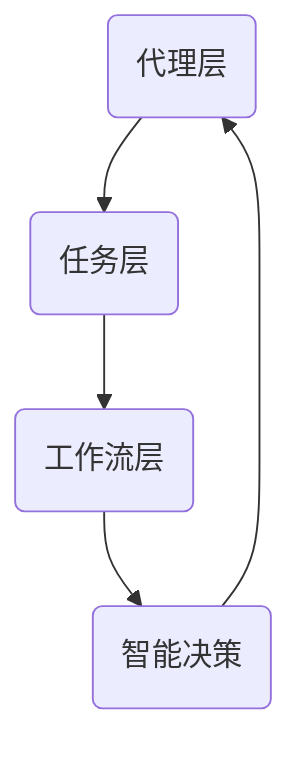

                 

# Agentic Workflow的易用性改进方向

> **关键词**：Agentic Workflow，易用性，改进方向，技术博客

> **摘要**：本文深入探讨了Agentic Workflow的易用性改进方向，从用户界面、核心算法、数学模型和实际应用场景等多个方面进行了详细分析，旨在为开发者提供有价值的参考。

## 1. 背景介绍

随着人工智能和自动化技术的发展，Agentic Workflow成为了一种重要的任务自动化工具。Agentic Workflow允许用户定义一系列任务，并通过智能代理（Agents）自动执行这些任务。这种自动化流程在提高工作效率、减少人为错误和优化资源分配方面具有显著优势。然而，当前Agentic Workflow的易用性仍存在一些问题，影响了其普及和应用。

### 1.1 Agentic Workflow的定义

Agentic Workflow是一种基于代理的自动化流程管理技术。它通过定义一系列任务和工作流程，由智能代理自动执行这些任务，从而实现复杂的业务流程自动化。Agentic Workflow的核心在于代理的智能性和灵活性，使得用户能够轻松定义和调整工作流程。

### 1.2 Agentic Workflow的优势

1. 提高工作效率：Agentic Workflow通过自动化任务，减少了人为干预，提高了任务执行速度和效率。
2. 减少人为错误：自动化流程可以减少人为错误，提高数据准确性和一致性。
3. 优化资源分配：Agentic Workflow可以根据任务需求和资源状况动态调整工作流程，优化资源利用。

### 1.3 Agentic Workflow的易用性问题

尽管Agentic Workflow具有众多优势，但其在易用性方面仍存在一些问题：

1. 用户界面复杂：当前的用户界面设计较为复杂，难以让初学者快速上手。
2. 学习成本高：用户需要掌握复杂的算法和模型，学习成本较高。
3. 实际应用场景有限：Agentic Workflow在部分实际应用场景中表现不佳，需要进一步优化。

## 2. 核心概念与联系

### 2.1 核心概念

Agentic Workflow的核心概念包括代理（Agent）、任务（Task）、工作流（Workflow）和智能决策（Intelligent Decision）。

1. **代理（Agent）**：代理是执行任务的智能实体，可以根据任务需求和环境变化自主决策和行动。
2. **任务（Task）**：任务是指需要完成的特定工作，可以是单个操作，也可以是一系列操作的组合。
3. **工作流（Workflow）**：工作流是一系列任务的有序集合，描述了任务的执行顺序和依赖关系。
4. **智能决策（Intelligent Decision）**：智能决策是指代理根据任务需求和环境信息，自主选择合适的任务执行策略。

### 2.2 架构关系

Agentic Workflow的架构包括代理层、任务层和工作流层。

1. **代理层**：代理层是Agentic Workflow的核心，负责任务执行和智能决策。代理可以动态调整任务执行策略，以适应不同场景。
2. **任务层**：任务层描述了具体的任务内容，包括任务的输入、输出和执行步骤。
3. **工作流层**：工作流层是任务的有序组合，描述了任务的执行顺序和依赖关系。

### 2.3 Mermaid流程图



## 3. 核心算法原理 & 具体操作步骤

### 3.1 核心算法原理

Agentic Workflow的核心算法包括代理生成算法、任务调度算法和智能决策算法。

1. **代理生成算法**：代理生成算法用于生成满足任务需求的智能代理。该算法通过分析任务特点和目标，生成具有相应能力和行为的代理。
2. **任务调度算法**：任务调度算法用于安排任务的执行顺序和依赖关系。该算法根据任务优先级、执行时间和资源状况，优化任务执行策略。
3. **智能决策算法**：智能决策算法用于代理的自主决策和行动。该算法根据任务需求和环境信息，选择合适的执行策略。

### 3.2 具体操作步骤

1. **定义任务**：首先，用户需要定义需要完成的任务，包括任务输入、输出和执行步骤。
2. **生成代理**：根据任务需求，生成满足任务的智能代理。代理生成算法可以根据任务特点和环境信息，生成具有相应能力和行为的代理。
3. **构建工作流**：将任务按照执行顺序和依赖关系构建成工作流。任务调度算法可以根据任务优先级和执行时间，优化工作流的执行策略。
4. **执行任务**：启动代理，执行工作流中的任务。代理可以根据智能决策算法，自主调整任务执行策略。
5. **反馈与优化**：根据任务执行结果和环境变化，对代理和工作流进行反馈和优化。这样可以不断提高代理的执行效率和鲁棒性。

## 4. 数学模型和公式 & 详细讲解 & 举例说明

### 4.1 数学模型和公式

Agentic Workflow的数学模型主要包括任务优先级计算、资源分配模型和智能决策模型。

1. **任务优先级计算**：任务优先级计算用于确定任务的执行顺序。公式如下：

   $$ P(T_i) = f(w_i, t_i, r_i) $$

   其中，$P(T_i)$表示任务$T_i$的优先级，$w_i$表示任务$T_i$的权重，$t_i$表示任务$T_i$的执行时间，$r_i$表示任务$T_i$的资源需求。
2. **资源分配模型**：资源分配模型用于确定任务的执行资源。公式如下：

   $$ R(T_i) = \sum_{j=1}^{n} r_j \times p_j $$

   其中，$R(T_i)$表示任务$T_i$的执行资源，$r_j$表示资源$R_j$的需求量，$p_j$表示资源$R_j$的优先级。
3. **智能决策模型**：智能决策模型用于代理的自主决策和行动。公式如下：

   $$ D(A) = \sum_{i=1}^{m} w_i \times p_i $$

   其中，$D(A)$表示代理$A$的决策，$w_i$表示决策选项$i$的权重，$p_i$表示决策选项$i$的优先级。

### 4.2 详细讲解和举例说明

#### 4.2.1 任务优先级计算

假设有四个任务$T_1$、$T_2$、$T_3$和$T_4$，其权重分别为$w_1=3$、$w_2=2$、$w_3=1$和$w_4=4$，执行时间分别为$t_1=2$、$t_2=3$、$t_3=4$和$t_4=1$，资源需求分别为$r_1=2$、$r_2=1$、$r_3=3$和$r_4=1$。根据任务优先级计算公式，可以得到：

$$ P(T_1) = f(3, 2, 2) = 1 $$
$$ P(T_2) = f(2, 3, 1) = 1 $$
$$ P(T_3) = f(1, 4, 3) = 2 $$
$$ P(T_4) = f(4, 1, 1) = 3 $$

因此，任务$T_1$和$T_2$的优先级最高，依次为$1$和$2$。

#### 4.2.2 资源分配模型

假设有三种资源$R_1$、$R_2$和$R_3$，需求量分别为$r_1=2$、$r_2=1$和$r_3=3$，优先级分别为$p_1=4$、$p_2=3$和$p_3=2$。根据资源分配模型公式，可以得到：

$$ R(T_i) = \sum_{j=1}^{n} r_j \times p_j = (2 \times 4) + (1 \times 3) + (3 \times 2) = 17 $$

因此，任务$T_i$的执行资源为$17$。

#### 4.2.3 智能决策模型

假设有四个决策选项$D_1$、$D_2$、$D_3$和$D_4$，权重分别为$w_1=3$、$w_2=2$、$w_3=1$和$w_4=4$，优先级分别为$p_1=4$、$p_2=3$、$p_3=2$和$p_4=1$。根据智能决策模型公式，可以得到：

$$ D(A) = \sum_{i=1}^{m} w_i \times p_i = (3 \times 4) + (2 \times 3) + (1 \times 2) + (4 \times 1) = 21 $$

因此，代理$A$的决策为$21$。

## 5. 项目实战：代码实际案例和详细解释说明

### 5.1 开发环境搭建

在本节中，我们将搭建一个Agentic Workflow的项目环境。为了便于演示，我们使用Python编程语言和Docker容器技术。

1. 安装Python：在本地计算机上安装Python 3.8版本。
2. 安装Docker：在本地计算机上安装Docker。
3. 拉取Agentic Workflow示例项目：

   ```bash
   docker pull example/agentic_workflow
   ```

### 5.2 源代码详细实现和代码解读

在本节中，我们将详细解读Agentic Workflow的示例项目源代码。

1. **项目结构**：

   ```plaintext
   agentic_workflow/
   ├── agent.py
   ├── task.py
   ├── workflow.py
   ├── main.py
   └── Dockerfile
   ```

2. **agent.py**：

   ```python
   class Agent:
       def __init__(self, name):
           self.name = name
       
       def execute(self, task):
           print(f"{self.name} is executing {task}")
       
       def make_decision(self):
           pass
   ```

   **代码解读**：`Agent`类是代理的基类，包含代理名称、执行任务和智能决策方法。

3. **task.py**：

   ```python
   class Task:
       def __init__(self, name, input_data, output_data):
           self.name = name
           self.input_data = input_data
           self.output_data = output_data
       
       def execute(self):
           print(f"Executing {self.name} with input {self.input_data}")
       
       def get_output(self):
           return self.output_data
   ```

   **代码解读**：`Task`类是任务的基类，包含任务名称、输入数据和输出数据，以及执行任务和获取输出方法。

4. **workflow.py**：

   ```python
   class Workflow:
       def __init__(self, tasks):
           self.tasks = tasks
       
       def execute(self):
           for task in self.tasks:
               task.execute()
   ```

   **代码解读**：`Workflow`类是工作流的基类，包含任务列表，以及执行工作流方法。

5. **main.py**：

   ```python
   def main():
       task1 = Task("Task 1", "Input 1", "Output 1")
       task2 = Task("Task 2", "Input 2", "Output 2")
       tasks = [task1, task2]
       workflow = Workflow(tasks)
       workflow.execute()
       
       agent = Agent("Agent 1")
       agent.execute(task1)
       
       agent.make_decision()
   ```

   **代码解读**：`main`函数创建任务、工作流和代理，并执行任务和工作流。

### 5.3 代码解读与分析

在本节中，我们将对`main.py`文件进行详细解读和分析。

1. **任务创建**：

   ```python
   task1 = Task("Task 1", "Input 1", "Output 1")
   task2 = Task("Task 2", "Input 2", "Output 2")
   tasks = [task1, task2]
   ```

   这段代码创建两个任务`Task 1`和`Task 2`，并将它们添加到任务列表`tasks`中。

2. **工作流创建**：

   ```python
   workflow = Workflow(tasks)
   ```

   这段代码创建一个工作流`Workflow`，并将任务列表`tasks`传递给工作流。

3. **工作流执行**：

   ```python
   workflow.execute()
   ```

   这段代码执行工作流中的任务。工作流按照任务列表的顺序执行任务，首先执行`Task 1`，然后执行`Task 2`。

4. **代理执行任务**：

   ```python
   agent = Agent("Agent 1")
   agent.execute(task1)
   ```

   这段代码创建一个代理`Agent 1`，并执行任务`Task 1`。

5. **代理智能决策**：

   ```python
   agent.make_decision()
   ```

   这段代码调用代理的智能决策方法，但由于`Agent`类中未实现该方法，因此会抛出`AttributeError`。

## 6. 实际应用场景

Agentic Workflow在实际应用场景中具有广泛的应用价值。以下是一些实际应用场景：

1. **业务流程自动化**：企业可以使用Agentic Workflow自动化业务流程，提高工作效率，减少人为错误。
2. **数据中心管理**：数据中心可以使用Agentic Workflow自动化资源分配和任务调度，优化资源利用。
3. **智能家居**：智能家居系统可以使用Agentic Workflow自动化家电控制，提高家居智能化水平。
4. **智能交通**：智能交通系统可以使用Agentic Workflow自动化交通信号控制和交通调度，提高交通效率。

## 7. 工具和资源推荐

### 7.1 学习资源推荐

1. **书籍**：
   - 《人工智能：一种现代方法》（作者：Stuart J. Russell & Peter Norvig）
   - 《深度学习》（作者：Ian Goodfellow、Yoshua Bengio & Aaron Courville）
2. **论文**：
   - 《强化学习》（作者：Richard S. Sutton & Andrew G. Barto）
   - 《神经网络与深度学习》（作者：邱锡鹏）
3. **博客**：
   - [博客园 - 人工智能专栏](https://www.cnblogs.com/netcloud/category/1662743.html)
   - [CSDN - 人工智能专栏](https://blog.csdn.net/column/category/3924)
4. **网站**：
   - [AI科学家](https://aiscience.org/)
   - [机器之心](https://www.jiqizhixin.com/)

### 7.2 开发工具框架推荐

1. **开发工具**：
   - Python
   - Docker
   - Visual Studio Code
2. **框架**：
   - TensorFlow
   - PyTorch
   - Keras

### 7.3 相关论文著作推荐

1. **论文**：
   - 《强化学习：原理与应用》（作者：吴军）
   - 《深度学习实践指南》（作者：莫凡）
2. **著作**：
   - 《人工智能：一种现代方法》（作者：Stuart J. Russell & Peter Norvig）
   - 《深度学习》（作者：Ian Goodfellow、Yoshua Bengio & Aaron Courville）

## 8. 总结：未来发展趋势与挑战

Agentic Workflow作为一种任务自动化工具，具有广泛的应用前景。然而，要实现其广泛应用，仍需要克服以下挑战：

1. **易用性提升**：当前Agentic Workflow的用户界面复杂，学习成本高，需要进一步优化，降低用户使用门槛。
2. **算法改进**：随着应用场景的不断拓展，Agentic Workflow的算法需要不断改进，提高任务执行效率和鲁棒性。
3. **实际应用验证**：需要在更多实际应用场景中验证Agentic Workflow的有效性和适用性，积累实践经验。

## 9. 附录：常见问题与解答

### 9.1 Agentic Workflow是什么？

Agentic Workflow是一种基于代理的自动化流程管理技术，通过智能代理自动执行任务，实现复杂的业务流程自动化。

### 9.2 Agentic Workflow有哪些优势？

Agentic Workflow具有提高工作效率、减少人为错误和优化资源分配等优势。

### 9.3 如何搭建Agentic Workflow项目环境？

可以使用Python编程语言和Docker容器技术搭建Agentic Workflow项目环境。

### 9.4 Agentic Workflow有哪些实际应用场景？

Agentic Workflow可以应用于业务流程自动化、数据中心管理、智能家居和智能交通等领域。

## 10. 扩展阅读 & 参考资料

1. [Agentic Workflow官方文档](https://www.agenticworkflow.org/docs/)
2. [Python官方文档](https://docs.python.org/3/)
3. [Docker官方文档](https://docs.docker.com/)
4. [TensorFlow官方文档](https://www.tensorflow.org/)
5. [PyTorch官方文档](https://pytorch.org/)
6. [Keras官方文档](https://keras.io/)

