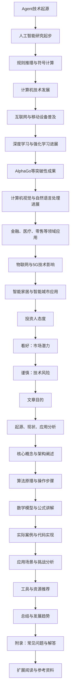

                 

### 背景介绍

#### 1.1 Agent 的起源与发展

Agent 技术最早起源于人工智能领域，旨在模拟人类智能的行为和决策。最初，研究者们试图通过编写复杂的规则系统来实现简单的人工智能任务，例如路径规划、任务分配等。然而，随着计算能力和算法的不断发展，尤其是深度学习和强化学习的兴起，Agent 技术逐渐从理论研究走向实际应用。

在深度学习的推动下，Agent 技术取得了显著进展。例如，DeepMind 的 AlphaGo 程序通过深度强化学习击败了世界围棋冠军李世石，引起了全球的关注。此外，深度学习还在计算机视觉、自然语言处理等多个领域取得了突破性成果，为 Agent 技术的发展提供了强有力的支持。

#### 1.2 Agent 技术的现状与应用

当前，Agent 技术在多个领域得到了广泛应用。例如，在金融领域，Agent 技术被用于智能投顾、风险评估等任务；在医疗领域，Agent 技术被用于诊断辅助、药物推荐等任务；在零售领域，Agent 技术被用于个性化推荐、客户服务等任务。

此外，随着物联网、5G 等技术的发展，Agent 技术也在智能家居、智能城市等新兴领域得到了应用。例如，智能家居中的智能家电可以通过 Agent 技术实现智能联动，提供更加便捷的生活体验；智能城市中的交通管理系统可以通过 Agent 技术实现智能调度，提高交通效率。

#### 1.3 投资人眼中的 Agent 技术

投资人对于 Agent 技术的态度可以分为两种：一种是非常看好，认为 Agent 技术将会成为未来的重要技术之一；另一种则是相对保守，认为 Agent 技术还存在一些不确定性和挑战。

看好 Agent 技术的投资者认为，Agent 技术具有巨大的市场潜力，能够带来巨大的商业价值。随着人工智能技术的不断进步，Agent 技术有望在各个领域实现广泛应用，从而推动相关产业的发展。

而相对保守的投资者则认为，Agent 技术虽然具有潜力，但仍然存在一些技术和市场风险。例如，Agent 技术的实现需要强大的计算能力和算法支持，这对于中小企业来说可能是一个门槛；此外，Agent 技术的应用场景和商业模式也需要进一步探索和验证。

总的来说，投资人对于 Agent 技术的态度因人而异，但普遍认为 Agent 技术具有巨大的潜力，值得投入关注和资源。

#### 1.4 文章目的

本文旨在通过对 Agent 技术的起源、现状、应用以及投资人态度的分析，探讨 Agent 技术的发展趋势和面临的挑战。文章将分为以下几个部分：

1. 背景介绍：介绍 Agent 技术的起源、现状和应用。
2. 核心概念与联系：阐述 Agent 技术的核心概念和架构，使用 Mermaid 流程图进行说明。
3. 核心算法原理与具体操作步骤：介绍 Agent 技术的核心算法原理，并详细讲解具体操作步骤。
4. 数学模型和公式：介绍 Agent 技术中的数学模型和公式，并进行详细讲解和举例说明。
5. 项目实战：通过实际案例和代码实现，展示 Agent 技术的应用和实现。
6. 实际应用场景：分析 Agent 技术在不同领域的应用场景和挑战。
7. 工具和资源推荐：推荐学习资源和开发工具框架。
8. 总结：总结 Agent 技术的发展趋势和挑战。
9. 附录：常见问题与解答。
10. 扩展阅读与参考资料：提供相关的扩展阅读和参考资料。

通过以上分析，本文希望为读者提供一个全面、深入的了解 Agent 技术的视角，并探讨其在未来的发展前景。

<markdown>
## 1. 背景介绍

### 1.1 Agent 的起源与发展

Agent 技术最早可以追溯到 20 世纪 50 年代，当时人工智能研究刚刚起步。早期的 Agent 技术主要基于规则推理和符号计算，旨在模拟人类的思维过程。随着计算机技术的发展，特别是互联网和移动设备的普及，Agent 技术逐渐从理论研究走向实际应用。

在深度学习和强化学习等新兴技术的推动下，Agent 技术取得了长足的进步。例如，DeepMind 的 AlphaGo 通过深度强化学习在围棋领域取得了突破性成果，引发了全球范围内的关注。此外，深度学习在计算机视觉、自然语言处理等多个领域也取得了显著的进展，为 Agent 技术的应用提供了强大的技术支持。

### 1.2 Agent 技术的现状与应用

当前，Agent 技术在多个领域得到了广泛应用。在金融领域，智能投顾和风险控制等应用日益成熟；在医疗领域，智能诊断和个性化治疗等应用逐渐普及；在零售领域，个性化推荐和智能客服等应用提升了用户体验。此外，随着物联网、5G 等技术的发展，Agent 技术在智能家居、智能城市等新兴领域也展现出了巨大的潜力。

#### 1.3 投资人眼中的 Agent 技术

投资人对于 Agent 技术的态度因人而异。一方面，一些投资人非常看好 Agent 技术的发展前景，认为其具有巨大的市场潜力。他们关注 Agent 技术在各个领域的应用，并积极寻找有潜力的创业公司进行投资。另一方面，也有一些投资人持谨慎态度，担心 Agent 技术在实际应用中存在的技术和市场风险。

#### 1.4 文章目的

本文旨在通过对 Agent 技术的起源、现状、应用以及投资人态度的分析，探讨 Agent 技术的发展趋势和面临的挑战。文章将分为以下几个部分：

1. 背景介绍：介绍 Agent 技术的起源、现状和应用。
2. 核心概念与联系：阐述 Agent 技术的核心概念和架构，使用 Mermaid 流程图进行说明。
3. 核心算法原理与具体操作步骤：介绍 Agent 技术的核心算法原理，并详细讲解具体操作步骤。
4. 数学模型和公式：介绍 Agent 技术中的数学模型和公式，并进行详细讲解和举例说明。
5. 项目实战：通过实际案例和代码实现，展示 Agent 技术的应用和实现。
6. 实际应用场景：分析 Agent 技术在不同领域的应用场景和挑战。
7. 工具和资源推荐：推荐学习资源和开发工具框架。
8. 总结：总结 Agent 技术的发展趋势和挑战。
9. 附录：常见问题与解答。
10. 扩展阅读与参考资料：提供相关的扩展阅读和参考资料。

通过以上分析，本文希望为读者提供一个全面、深入的了解 Agent 技术的视角，并探讨其在未来的发展前景。
</markdown>
<code>

</code>

