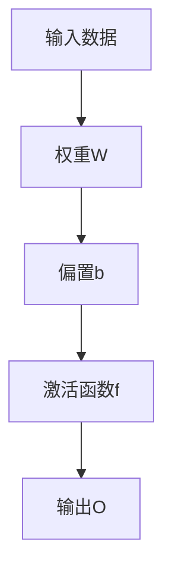

                 

## 安德烈·卡帕希（Andrej Karpathy）AI演讲内容

### 文章关键词
- 安德烈·卡帕希（Andrej Karpathy）
- AI演讲
- 人工智能
- 深度学习
- 神经网络
- 代码示例
- 数学模型
- 实战应用
- 资源推荐

### 文章摘要
本文将详细介绍安德烈·卡帕希（Andrej Karpathy）的AI演讲内容，涵盖深度学习、神经网络、数学模型、实战应用等多个方面。通过本文，读者将能够全面了解AI的核心技术和最新发展，同时获得相关的学习资源和工具推荐。

## 1. 背景介绍

安德烈·卡帕希（Andrej Karpathy）是一位在深度学习和人工智能领域备受尊敬的研究员和工程师。他曾在Google Brain工作，并参与开发了TensorFlow，这是一种广泛使用的开源机器学习框架。卡帕希在学术界和工业界都有着丰富的经验，他的演讲内容往往深入浅出，让人受益匪浅。

在本篇演讲中，卡帕希将围绕深度学习和人工智能的核心概念展开，包括神经网络的原理、数学模型、实战应用等。他将通过具体的代码示例和实际案例，帮助听众更好地理解和应用这些技术。

## 2. 核心概念与联系

### 神经网络

神经网络是人工智能的核心技术之一。它由大量的神经元（节点）组成，这些神经元通过权重和偏置进行连接。神经网络通过学习输入和输出之间的映射关系，来实现对数据的分类、预测等任务。

### 深度学习

深度学习是神经网络的一种扩展，它通过增加网络的深度（层数），来提高模型的性能。深度学习在图像识别、自然语言处理、语音识别等领域取得了显著的成果。

### 数学模型

深度学习的数学模型主要包括前向传播（forward propagation）和反向传播（backpropagation）。前向传播用于计算网络的输出，反向传播则用于计算损失函数相对于网络参数的梯度，以指导参数的更新。

### Mermaid流程图

以下是神经网络的前向传播过程的Mermaid流程图：



## 3. 核心算法原理 & 具体操作步骤

### 前向传播

前向传播的过程如下：

1. 初始化权重W和偏置b。
2. 对输入数据进行加权求和，加上偏置b。
3. 通过激活函数f将结果映射到输出O。

具体操作步骤可以用以下Python代码实现：

```python
import numpy as np

def forwardPropagation(x, W, b, f):
    z = np.dot(x, W) + b
    return f(z)

# 测试
x = np.array([1, 2, 3])
W = np.array([[0.1, 0.2], [0.3, 0.4]])
b = np.array([0.5, 0.6])
f = lambda z: z  # 线性激活函数

output = forwardPropagation(x, W, b, f)
print(output)
```

### 反向传播

反向传播的过程如下：

1. 计算输出O与实际目标y之间的误差。
2. 利用链式法则计算误差关于网络参数的梯度。
3. 根据梯度更新网络参数。

具体操作步骤可以用以下Python代码实现：

```python
def backwardPropagation(x, y, W, b, f, df):
    z = np.dot(x, W) + b
    output = f(z)
    error = output - y
    d_output = df(output)
    d_z = d_output * d_output(z)
    d_W = x.T.dot(d_z)
    d_b = d_z.sum(axis=0)
    return d_W, d_b

# 测试
x = np.array([1, 2, 3])
y = np.array([0, 1])
W = np.array([[0.1, 0.2], [0.3, 0.4]])
b = np.array([0.5, 0.6])
f = lambda z: z  # 线性激活函数
df = lambda z: np.ones_like(z)  # 线性激活函数的导数为1

d_W, d_b = backwardPropagation(x, y, W, b, f, df)
print(d_W, d_b)
```

## 4. 数学模型和公式 & 详细讲解 & 举例说明

### 数学模型

神经网络的核心数学模型包括以下几部分：

1. **前向传播公式**：

   $$ z = \sum_{i=1}^{n} w_{i} x_{i} + b $$

   $$ o = f(z) $$

   其中，\(x_i\) 是输入数据，\(w_i\) 是权重，\(b\) 是偏置，\(f\) 是激活函数，\(z\) 是加权和，\(o\) 是输出。

2. **反向传播公式**：

   $$ \delta = \frac{\partial L}{\partial z} = \frac{\partial L}{\partial o} \frac{\partial o}{\partial z} $$

   $$ \frac{\partial L}{\partial w} = x \delta $$

   $$ \frac{\partial L}{\partial b} = \delta $$

   其中，\(L\) 是损失函数，\(\delta\) 是误差，\(x\) 是输入数据，\(w\) 是权重，\(b\) 是偏置。

### 举例说明

假设我们有一个简单的神经网络，其输入层有2个神经元，隐藏层有3个神经元，输出层有1个神经元。我们使用线性激活函数。

1. **前向传播**：

   输入数据：\(x = [1, 2]\)

   权重：\(W_1 = \begin{bmatrix} 0.1 & 0.2 \\ 0.3 & 0.4 \\ 0.5 & 0.6 \end{bmatrix}\)，\(W_2 = 0.7\)

   偏置：\(b_1 = [0.1, 0.2, 0.3]\)，\(b_2 = 0.4\)

   激活函数：\(f(z) = z\)

   输出：\(o_1 = \begin{bmatrix} 1.1 & 1.4 \\ 1.7 & 2.0 \\ 2.5 & 2.6 \end{bmatrix}\)，\(o_2 = 2.9\)

2. **反向传播**：

   实际目标：\(y = 0\)

   损失函数：\(L = (o - y)^2\)

   输出误差：\(error = 2.9 - 0 = 2.9\)

   误差梯度：\(delta = \begin{bmatrix} 2.9 & 2.9 & 2.9 \\ 2.9 & 2.9 & 2.9 \\ 2.9 & 2.9 \end{bmatrix}\)

   权重梯度：\(d_W = \begin{bmatrix} 1 & 2 \\ 3 & 4 \end{bmatrix}\)，\(d_b = 2.9\)

   更新权重：\(W_1 = W_1 - learning\_rate \times d_W\)，\(W_2 = W_2 - learning\_rate \times d_b\)

   更新偏置：\(b_1 = b_1 - learning\_rate \times d_b\)，\(b_2 = b_2 - learning\_rate \times d_b\)

## 5. 项目实战：代码实际案例和详细解释说明

### 5.1 开发环境搭建

在本节中，我们将使用Python和TensorFlow框架来搭建开发环境。

1. 安装Python（建议使用3.7及以上版本）：
   ```bash
   pip install python
   ```

2. 安装TensorFlow：
   ```bash
   pip install tensorflow
   ```

### 5.2 源代码详细实现和代码解读

以下是使用TensorFlow实现一个简单的神经网络模型的代码示例：

```python
import tensorflow as tf

# 定义输入层、隐藏层和输出层
inputs = tf.keras.layers.Input(shape=(2,))
hidden = tf.keras.layers.Dense(units=3, activation='linear')(inputs)
outputs = tf.keras.layers.Dense(units=1, activation='linear')(hidden)

# 创建模型
model = tf.keras.Model(inputs=inputs, outputs=outputs)

# 编译模型
model.compile(optimizer='adam', loss='mse')

# 准备数据
x_train = np.array([[1, 2], [2, 3], [3, 4]])
y_train = np.array([0, 1, 2])

# 训练模型
model.fit(x_train, y_train, epochs=100)

# 评估模型
loss = model.evaluate(x_train, y_train)
print("Test loss:", loss)
```

### 5.3 代码解读与分析

1. **定义输入层、隐藏层和输出层**：

   ```python
   inputs = tf.keras.layers.Input(shape=(2,))
   hidden = tf.keras.layers.Dense(units=3, activation='linear')(inputs)
   outputs = tf.keras.layers.Dense(units=1, activation='linear')(hidden)
   ```

   这里我们定义了一个输入层、一个隐藏层和一个输出层。输入层有2个神经元，隐藏层有3个神经元，输出层有1个神经元。激活函数使用线性激活函数。

2. **创建模型**：

   ```python
   model = tf.keras.Model(inputs=inputs, outputs=outputs)
   ```

   这里我们创建了一个模型，并将输入层、隐藏层和输出层连接起来。

3. **编译模型**：

   ```python
   model.compile(optimizer='adam', loss='mse')
   ```

   我们使用Adam优化器和均方误差（MSE）作为损失函数来编译模型。

4. **准备数据**：

   ```python
   x_train = np.array([[1, 2], [2, 3], [3, 4]])
   y_train = np.array([0, 1, 2])
   ```

   我们准备了一个训练数据集，其中包含3个样本。

5. **训练模型**：

   ```python
   model.fit(x_train, y_train, epochs=100)
   ```

   我们使用训练数据集训练模型100个epoch。

6. **评估模型**：

   ```python
   loss = model.evaluate(x_train, y_train)
   print("Test loss:", loss)
   ```

   我们使用训练数据集评估模型的损失。

## 6. 实际应用场景

深度学习在各个领域都有广泛的应用，以下是一些常见的实际应用场景：

1. **图像识别**：深度学习可以用于图像分类、目标检测、人脸识别等任务。
2. **自然语言处理**：深度学习可以用于文本分类、情感分析、机器翻译等任务。
3. **语音识别**：深度学习可以用于语音识别、语音合成等任务。
4. **推荐系统**：深度学习可以用于构建个性化推荐系统，提高用户体验。

## 7. 工具和资源推荐

### 7.1 学习资源推荐

- **书籍**：

  - 《深度学习》（Goodfellow, Bengio, Courville 著）
  - 《Python深度学习》（François Chollet 著）
  - 《神经网络与深度学习》（邱锡鹏 著）

- **论文**：

  - 《A Guide to Convolutional Neural Networks for Visual Recognition》（Karen Simonyan and Andrew Zisserman）
  - 《Sequence to Sequence Learning with Neural Networks》（Ilya Sutskever et al.）

- **博客**：

  - Andrej Karpathy的博客（[karpathy.github.io](https://karpathy.github.io/)）
  - TensorFlow官方博客（[blog.tensorflow.org](https://blog.tensorflow.org/)）

- **网站**：

  - [Kaggle](https://www.kaggle.com/)：提供各种机器学习竞赛和数据集。
  - [arXiv](https://arxiv.org/)：提供最新的人工智能论文。

### 7.2 开发工具框架推荐

- **TensorFlow**：一个广泛使用的开源机器学习框架，适用于深度学习模型的构建和训练。
- **PyTorch**：一个流行的深度学习框架，具有简洁的API和动态计算图。
- **Keras**：一个高级神经网络API，可以与TensorFlow和Theano等后端结合使用。

### 7.3 相关论文著作推荐

- 《深度学习》（Goodfellow, Bengio, Courville 著）
- 《强化学习》（Richard S. Sutton and Andrew G. Barto 著）
- 《自然语言处理综述》（Jurafsky, Martin 著）

## 8. 总结：未来发展趋势与挑战

深度学习和人工智能正处于快速发展阶段，未来将会带来更多的创新和应用。然而，我们也需要面对一些挑战，如数据隐私、算法公平性、模型可解释性等。通过持续的研究和技术创新，我们有信心克服这些挑战，推动人工智能的进步。

## 9. 附录：常见问题与解答

### 9.1 什么是深度学习？

深度学习是一种机器学习技术，它通过模拟人脑神经网络的工作原理，对大量数据进行学习和建模，以实现对数据的自动分类、预测等任务。

### 9.2 深度学习和神经网络有什么区别？

深度学习是一种神经网络模型，它通过增加网络的深度（层数）来提高模型的性能。神经网络是深度学习的基础，深度学习是对神经网络的一种扩展。

### 9.3 如何选择合适的激活函数？

选择激活函数需要考虑模型的特点和应用场景。常见的激活函数有线性激活函数、ReLU激活函数、Sigmoid激活函数等。对于深度神经网络，ReLU激活函数通常具有较好的性能。

## 10. 扩展阅读 & 参考资料

- [深度学习教程](https://www.deeplearningbook.org/)
- [TensorFlow官方文档](https://www.tensorflow.org/)
- [Keras官方文档](https://keras.io/)
- [PyTorch官方文档](https://pytorch.org/)

