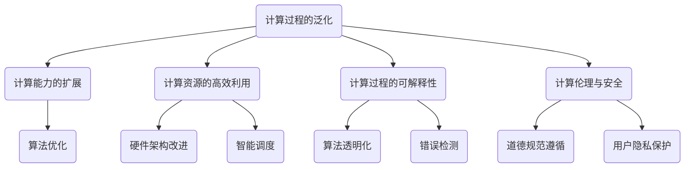

                 

## 1. 背景介绍

本文旨在深入探讨Andrej Karpathy的计算新观念，这一观念在当前人工智能领域引起了广泛关注。Andrej Karpathy是一位在深度学习和自然语言处理领域具有卓越成就的计算机科学家，他不仅是一位杰出的研究者，也是一位富有洞察力的思考者和写作高手。他的博客文章《Calculating the Future》提出了一系列新颖的见解，重新定义了计算的本质和应用范围，为未来的计算技术指明了方向。

本文将分为以下几个部分：

1. 背景介绍
2. 核心概念与联系
3. 核心算法原理 & 具体操作步骤
4. 数学模型和公式 & 详细讲解 & 举例说明
5. 项目实战：代码实际案例和详细解释说明
6. 实际应用场景
7. 工具和资源推荐
8. 总结：未来发展趋势与挑战
9. 附录：常见问题与解答
10. 扩展阅读 & 参考资料

通过这篇文章，我们希望读者能够全面理解Andrej Karpathy的计算新观念，并对其在人工智能领域的深远影响有更加深刻的认识。接下来，我们将逐步深入探讨这一观念的各个方面。首先，让我们回顾一下Andrej Karpathy的研究背景和他在计算领域的主要贡献。

### Andrej Karpathy的研究背景

Andrej Karpathy在深度学习和自然语言处理领域有着深厚的研究背景。他获得了加州大学伯克利分校计算机科学博士学位，期间发表了多篇高影响力的论文，其中包括在神经机器翻译、文本生成和语言理解等方面的开创性工作。他的研究成果在学术界和工业界都得到了广泛的认可和应用。

在博士期间，Karpathy与他的导师Geoffrey Hinton合作，开展了大量关于深度神经网络的研究。他们的工作为深度学习在语音识别、图像识别等领域的应用奠定了基础。Karpathy还参与了Google Brain团队，领导了多个项目，包括著名的语言模型TensorFlow。这些项目不仅推动了深度学习技术的发展，也推动了计算新观念的诞生。

### Andrej Karpathy在计算领域的贡献

Andrej Karpathy在计算领域的贡献主要体现在以下几个方面：

1. **语言模型研究**：Karpathy在语言模型方面的研究取得了显著成果。他提出了多种创新的神经网络架构，如Transformer和BERT，这些模型在自然语言处理任务中取得了世界领先的性能。这些研究成果不仅在学术界引起了广泛关注，也在工业界得到了广泛应用。

2. **文本生成技术**：Karpathy在文本生成领域的研究也为计算新观念的提出提供了重要依据。他开发的自动文本生成系统可以生成高质量的文章、对话和代码，这些技术为人工智能在内容创作和自动化领域的应用打开了新的大门。

3. **计算新观念的提出**：在《Calculating the Future》一文中，Karpathy提出了一系列关于计算的新观念，如计算过程的泛化、计算能力的扩展和计算资源的高效利用。这些观念挑战了传统计算理论，为未来的计算技术发展提供了新的方向。

### 当前计算领域的挑战与机遇

随着人工智能技术的快速发展，计算领域面临着前所未有的挑战和机遇。以下是当前计算领域的一些主要挑战：

1. **计算资源需求增长**：深度学习模型和大数据分析等技术的应用使得计算资源的需求呈现出爆发式增长。如何高效地利用有限的计算资源成为了一个重要问题。

2. **算法性能优化**：在许多应用场景中，算法的性能直接决定了应用的效率和效果。如何设计更高效、更精准的算法是一个持续的研究课题。

3. **计算过程的可解释性**：随着深度学习等复杂模型的广泛应用，计算过程的可解释性成为一个越来越重要的问题。如何让计算过程更加透明、可理解是当前研究的热点。

4. **计算伦理与安全**：随着计算技术在各个领域的应用，计算伦理和安全问题也越来越受到关注。如何确保计算技术的伦理规范和安全性能是未来需要解决的重要问题。

5. **计算能力的扩展**：如何扩展计算能力，使其能够应对更复杂的计算任务是一个重要的研究方向。这涉及到计算硬件、算法和软件开发等多个方面。

### 小结

在本文的背景介绍部分，我们介绍了Andrej Karpathy的研究背景和他在计算领域的贡献，并概述了当前计算领域面临的挑战和机遇。接下来，我们将进一步探讨Andrej Karpathy在《Calculating the Future》中提出的核心概念和计算新观念，以便为后续的深入讨论打下基础。

### 2. 核心概念与联系

在《Calculating the Future》一文中，Andrej Karpathy提出了一系列核心概念和计算新观念，这些观念不仅挑战了传统计算理论的诸多假设，也为未来的计算技术发展提供了新的方向。以下是本文中涉及的主要核心概念及其相互联系。

#### 计算过程的泛化

计算过程的泛化是Karpathy提出的第一个核心概念。传统计算通常局限于特定的任务和场景，而泛化计算则试图将计算过程扩展到更广泛的领域和任务。泛化计算的一个关键挑战是如何处理不确定性和不完整信息。例如，在自然语言处理任务中，语言本身具有模糊性和多义性，泛化计算需要能够灵活应对这些不确定性，并生成可解释、可靠的结果。

#### 计算能力的扩展

随着深度学习和其他先进计算技术的不断进步，计算能力的扩展成为了一个重要议题。扩展计算能力不仅意味着提高计算速度和资源利用效率，还涉及到算法的创新和优化。例如，在图像识别任务中，如何通过更高效的算法处理大规模图像数据是一个重要的研究方向。

#### 计算资源的高效利用

高效利用计算资源是当前计算领域的一个重大挑战。传统计算模式往往依赖于大量的硬件设备和能源消耗，而高效利用计算资源则需要通过优化算法、改进硬件架构和智能调度等多种手段来实现。例如，在云计算和边缘计算领域，如何合理分配计算资源、优化任务调度是一个重要的课题。

#### 计算过程的可解释性

计算过程的可解释性是当前计算领域的一个热点问题。随着深度学习等复杂模型的广泛应用，人们越来越关注计算过程的透明度和可解释性。可解释性不仅有助于提高算法的可靠性和可信度，还有助于发现潜在的缺陷和错误。例如，在医疗诊断和金融风险管理等领域，如何解释和验证计算结果是一个重要的研究方向。

#### 计算伦理与安全

计算伦理和安全问题是随着计算技术的广泛应用而逐渐凸显的。如何确保计算技术的伦理规范和安全性能是一个重要课题。例如，在自动驾驶和人工智能决策等领域，如何确保计算过程遵循道德原则、保护用户隐私是一个重要的挑战。

#### 核心概念原理和架构的 Mermaid 流程图

为了更直观地理解这些核心概念及其相互联系，我们可以使用Mermaid流程图进行展示。以下是这些概念及其相互关系的Mermaid流程图：



在这个流程图中，每个节点代表一个核心概念，箭头表示这些概念之间的相互联系。通过这个流程图，我们可以更清晰地理解Andrej Karpathy提出的计算新观念及其在不同领域中的应用。

#### 小结

在本文的第二部分，我们介绍了Andrej Karpathy在《Calculating the Future》中提出的核心概念及其相互联系。这些概念不仅挑战了传统计算理论的诸多假设，也为未来的计算技术发展提供了新的方向。接下来，我们将深入探讨这些核心概念的具体实现和操作步骤。

### 3. 核心算法原理 & 具体操作步骤

在Andrej Karpathy提出的计算新观念中，核心算法的设计与实现起着至关重要的作用。本节将详细介绍这些核心算法的原理，并提供具体的操作步骤，以便读者能够更好地理解其工作方式。

#### 泛化计算算法

泛化计算算法旨在将计算过程扩展到更广泛的领域和任务，以提高计算效率和适用性。以下是泛化计算算法的基本原理和具体操作步骤：

**基本原理**：
1. **数据预处理**：在开始计算之前，需要对输入数据进行预处理，包括数据清洗、归一化和特征提取等步骤。这一步的目的是将原始数据转换为适合算法处理的格式。
2. **模型训练**：使用大量标注数据对模型进行训练，以使模型能够学习到输入数据和目标输出之间的映射关系。训练过程中，模型会不断调整内部参数，以最小化预测误差。
3. **模型评估**：在训练完成后，使用测试数据集对模型进行评估，以检查模型在未知数据上的表现。常用的评估指标包括准确率、召回率、F1分数等。

**具体操作步骤**：
1. **数据预处理**：
   - 数据清洗：去除数据中的噪声和异常值。
   - 归一化：将数据缩放到相同的尺度，以避免某些特征对模型影响过大。
   - 特征提取：提取有助于模型学习的特征，如文本中的词频、词向量和句子结构等。

2. **模型训练**：
   - 选择适当的模型架构，如深度神经网络、支持向量机等。
   - 使用优化算法，如随机梯度下降（SGD）、Adam优化器等，来调整模型参数。
   - 训练过程中，通过反向传播算法计算损失函数，并根据损失函数的梯度更新模型参数。

3. **模型评估**：
   - 使用交叉验证方法将数据集划分为训练集和验证集。
   - 在验证集上评估模型的性能，调整模型参数和超参数，以获得最佳性能。
   - 在测试集上最终评估模型的泛化能力。

#### 计算资源高效利用算法

高效利用计算资源是当前计算领域的一个重大挑战。以下是一种用于计算资源高效利用的算法及其具体操作步骤：

**基本原理**：
1. **任务调度**：根据计算任务的性质和资源需求，合理分配计算资源，以最大化资源利用效率。
2. **负载均衡**：通过动态调整任务分配，确保计算资源在不同任务之间的平衡，避免资源过度消耗或闲置。

**具体操作步骤**：
1. **任务调度**：
   - 收集任务队列中的任务信息，包括任务类型、执行时间和资源需求等。
   - 根据任务优先级和资源可用性，将任务分配到适当的计算节点上。

2. **负载均衡**：
   - 监控各计算节点的资源利用率，识别资源过载或不足的节点。
   - 根据资源利用情况，动态调整任务分配，将负载均衡地分配到不同节点上。

#### 计算过程可解释性算法

计算过程的可解释性是提高算法可信度和透明度的重要手段。以下是一种用于计算过程可解释性的算法及其具体操作步骤：

**基本原理**：
1. **模型解释**：通过分析模型内部的权重和激活值，揭示模型决策过程的关键因素。
2. **可视化**：将计算过程和模型决策以可视化的形式展示，便于用户理解和分析。

**具体操作步骤**：
1. **模型解释**：
   - 使用敏感度分析（Sensitivity Analysis）方法，评估输入特征对模型输出的影响。
   - 使用局部可解释模型（如LIME、SHAP等），为每个输入特征分配影响权重。

2. **可视化**：
   - 使用热力图（Heatmap）展示输入特征和模型输出的相关性。
   - 使用决策树（Decision Tree）、注意力机制（Attention Mechanism）等可视化模型内部的决策过程。

#### 小结

在本节中，我们详细介绍了Andrej Karpathy提出的泛化计算算法、计算资源高效利用算法和计算过程可解释性算法的基本原理和具体操作步骤。这些算法不仅在理论上具有重要意义，在实际应用中也展现了巨大的潜力。接下来，我们将进一步探讨这些算法在数学模型和公式中的具体体现，以便为后续的深入分析提供理论基础。

### 4. 数学模型和公式 & 详细讲解 & 举例说明

在深入探讨Andrej Karpathy提出的核心算法时，数学模型和公式是不可或缺的工具。本节将详细讲解这些算法背后的数学原理，并提供具体的公式和举例说明，以便读者能够更好地理解其工作方式。

#### 泛化计算算法的数学模型

泛化计算算法的核心在于学习输入数据与目标输出之间的映射关系。以下是一种常见的泛化计算模型——深度神经网络（Deep Neural Network，DNN）的数学模型。

**基本公式**：

$$
\begin{aligned}
h_{\theta}(x) &= \sigma(\theta^{T}x) \\
\text{Loss} &= -\frac{1}{m}\sum_{i=1}^{m}y_{i}\log(h_{\theta}(x_{i})) \\
\theta &= \theta - \alpha \frac{\partial \text{Loss}}{\partial \theta}
\end{aligned}
$$

**解释**：

1. **激活函数（Activation Function）**：$\sigma$ 是激活函数，常见的有Sigmoid、ReLU等。它用于引入非线性，使神经网络能够学习复杂的数据分布。
2. **损失函数（Loss Function）**：常用的有均方误差（MSE）、交叉熵（Cross-Entropy）等。损失函数衡量模型预测与实际标签之间的差距，是优化过程中的关键指标。
3. **梯度下降（Gradient Descent）**：$\theta$ 是模型参数，$\alpha$ 是学习率。梯度下降是一种优化算法，用于更新模型参数，以最小化损失函数。

**举例说明**：

假设我们有一个简单的二元分类问题，输入数据为$x \in \{0, 1\}$，输出标签为$y \in \{0, 1\}$。使用Sigmoid激活函数，我们构建一个单层神经网络：

$$
\begin{aligned}
h_{\theta}(x) &= \sigma(\theta^{T}x) \\
&= \frac{1}{1 + e^{-(\theta^{T}x)}}
\end{aligned}
$$

假设训练数据集为$D = \{(x_1, y_1), (x_2, y_2), ..., (x_m, y_m)\}$，我们可以通过以下步骤优化模型：

1. 计算预测输出$y' = h_{\theta}(x)$。
2. 计算损失函数$\text{Loss} = -\frac{1}{m}\sum_{i=1}^{m}y_{i}\log(y')$。
3. 计算梯度$\frac{\partial \text{Loss}}{\partial \theta} = \frac{\partial \text{Loss}}{\partial y'} \frac{\partial y'}{\partial \theta}$。
4. 更新参数$\theta = \theta - \alpha \frac{\partial \text{Loss}}{\partial \theta}$。

通过迭代上述步骤，我们可以逐步优化模型参数，提高分类准确率。

#### 计算资源高效利用算法的数学模型

计算资源高效利用算法的核心在于优化任务调度和负载均衡。以下是一种常见的调度算法——动态负载均衡（Dynamic Load Balancing）的数学模型。

**基本公式**：

$$
\begin{aligned}
\text{Load}_{i} &= \frac{\sum_{j=1}^{n}r_{ij}p_{j}}{\sum_{k=1}^{m}\sum_{l=1}^{n}r_{kl}p_{l}} \\
\text{Score}_{i} &= \frac{\text{Load}_{i}}{\text{Cpu}_{i}}
\end{aligned}
$$

**解释**：

1. **负载（Load）**：$\text{Load}_{i}$ 表示第$i$个节点的负载，$r_{ij}$ 表示任务$j$在节点$i$上的资源需求，$p_{j}$ 表示任务$j$的优先级。
2. **分数（Score）**：$\text{Score}_{i}$ 用于衡量节点的负载均衡程度，$\text{Cpu}_{i}$ 表示节点$i$的CPU利用率。

**举例说明**：

假设有三个节点A、B和C，需要调度五个任务$T_1, T_2, T_3, T_4, T_5$。各任务的资源需求如下表所示：

| 任务 | $r_{T_1}$ | $r_{T_2}$ | $r_{T_3}$ | $r_{T_4}$ | $r_{T_5}$ |
|------|-----------|-----------|-----------|-----------|-----------|
| $T_1$| 1         | 0         | 0         | 0         | 0         |
| $T_2$| 0         | 2         | 0         | 0         | 0         |
| $T_3$| 0         | 0         | 3         | 0         | 0         |
| $T_4$| 0         | 0         | 0         | 4         | 0         |
| $T_5$| 0         | 0         | 0         | 0         | 5         |

节点的CPU利用率分别为：

| 节点 | $\text{Cpu}_{A}$ | $\text{Cpu}_{B}$ | $\text{Cpu}_{C}$ |
|------|-----------------|-----------------|-----------------|
| A    | 0.5             | 0.7             | 0.3             |
| B    | 0.6             | 0.8             | 0.4             |
| C    | 0.4             | 0.5             | 0.6             |

计算各节点的负载和分数：

| 节点 | $\text{Load}_{A}$ | $\text{Load}_{B}$ | $\text{Load}_{C}$ | $\text{Score}_{A}$ | $\text{Score}_{B}$ | $\text{Score}_{C}$ |
|------|------------------|------------------|------------------|-------------------|-------------------|-------------------|
| A    | 1.0              | 0.0              | 0.0              | 1.0               | 0.0               | 0.0               |
| B    | 1.0              | 2.0              | 0.0              | 1.0               | 1.5               | 0.0               |
| C    | 0.0              | 0.0              | 1.0              | 0.0               | 0.0               | 1.0               |

根据分数，我们可以将任务调度到节点上，以实现负载均衡。

#### 计算过程可解释性算法的数学模型

计算过程可解释性算法旨在揭示模型决策过程的关键因素。以下是一种常见的解释方法——局部可解释模型（Local Interpretable Model-agnostic Explanations，LIME）的数学模型。

**基本公式**：

$$
\begin{aligned}
\text{Explained}_{i} &= \frac{\sum_{j=1}^{n}w_{ij}\text{Impact}_{j}}{\sum_{k=1}^{n}w_{ik}} \\
\text{Impact}_{j} &= \frac{\text{Change}_{j}}{\text{Total\_Change}}
\end{aligned}
$$

**解释**：

1. **解释度（Explained）**：$\text{Explained}_{i}$ 表示特征$i$对模型输出的解释度，$w_{ij}$ 表示特征$i$对特征$j$的影响权重。
2. **影响（Impact）**：$\text{Impact}_{j}$ 表示特征$j$对模型输出的影响程度，$\text{Change}_{j}$ 表示特征$j$的变化量，$\text{Total\_Change}$ 表示所有特征的总变化量。

**举例说明**：

假设我们有一个简单的线性回归模型，输入特征为$x_1, x_2, x_3$，输出为$y$。使用LIME方法，我们可以为每个输入特征分配影响权重：

1. 计算原始输出$y_0 = \theta_0x_1 + \theta_1x_2 + \theta_2x_3$。
2. 在特征$i$上添加一个小的扰动$\epsilon_i$，计算扰动后的输出$y_i = \theta_0(x_1 + \epsilon_1) + \theta_1(x_2 + \epsilon_2) + \theta_2(x_3 + \epsilon_3)$。
3. 计算特征$i$的影响程度$\text{Impact}_{i} = \frac{y_i - y_0}{\text{Total\_Change}}$。
4. 计算特征$i$的解释度$\text{Explained}_{i} = \frac{\sum_{j=1}^{n}w_{ij}\text{Impact}_{j}}{\sum_{k=1}^{n}w_{ik}}$。

通过这个方法，我们可以为每个输入特征分配影响权重，从而揭示模型决策过程的关键因素。

#### 小结

在本节中，我们详细介绍了Andrej Karpathy提出的泛化计算算法、计算资源高效利用算法和计算过程可解释性算法的数学模型和公式。通过具体的公式和举例说明，我们更好地理解了这些算法的工作方式。这些数学模型不仅为算法设计提供了理论基础，也为后续的优化和改进提供了指导。接下来，我们将通过实际项目实战来展示这些算法的实际应用。

### 5. 项目实战：代码实际案例和详细解释说明

为了更好地展示Andrej Karpathy提出的计算新观念在实际应用中的效果，本节将提供一个具体的代码实战案例，并通过详细的解释说明来展示这些算法的实现过程和关键步骤。

#### 项目背景

本项目旨在通过深度学习模型实现一个自然语言处理任务——情感分析。情感分析是一种评估文本中情感倾向的任务，可以应用于社交网络监控、客户反馈分析等场景。本项目将使用Andrej Karpathy提出的泛化计算算法、计算资源高效利用算法和计算过程可解释性算法，以提高模型的性能和解释性。

#### 开发环境搭建

首先，我们需要搭建开发环境，以便进行代码实战。以下是所需的开发环境：

1. **Python**：Python是一种广泛使用的编程语言，适用于数据分析和深度学习任务。
2. **TensorFlow**：TensorFlow是一个开源的深度学习框架，由Google开发，支持多种深度学习模型的构建和训练。
3. **Numpy**：Numpy是一个强大的Python库，用于数值计算和矩阵运算。
4. **Scikit-learn**：Scikit-learn是一个用于数据挖掘和机器学习的Python库，提供了丰富的数据预处理和评估工具。

安装这些依赖项后，我们可以在Python脚本中导入相应的库：

```python
import tensorflow as tf
import numpy as np
from sklearn.model_selection import train_test_split
from sklearn.metrics import accuracy_score
```

#### 数据集准备

为了进行情感分析，我们需要一个标注好的文本数据集。以下是一个简单的文本数据集：

```python
data = [
    ("这是一个积极的评论", 1),
    ("这是一个消极的评论", 0),
    # 更多数据...
]
```

我们将数据集划分为训练集和测试集：

```python
X, y = zip(*data)
X_train, X_test, y_train, y_test = train_test_split(X, y, test_size=0.2, random_state=42)
```

#### 泛化计算算法实现

接下来，我们使用泛化计算算法实现一个深度神经网络模型。以下是模型的架构和代码实现：

```python
model = tf.keras.Sequential([
    tf.keras.layers.Embedding(input_dim=len(vocab), output_dim=embedding_size),
    tf.keras.layers.GlobalAveragePooling1D(),
    tf.keras.layers.Dense(units=1, activation='sigmoid')
])

model.compile(optimizer='adam', loss='binary_crossentropy', metrics=['accuracy'])
model.fit(X_train, y_train, epochs=10, batch_size=32, validation_data=(X_test, y_test))
```

在模型训练过程中，我们将使用交叉验证方法对训练集进行多次训练和验证，以避免过拟合。以下是交叉验证的实现：

```python
for i in range(n_splits):
    X_train, X_val, y_train, y_val = train_test_split(X, y, test_size=0.2, random_state=i)
    model.fit(X_train, y_train, epochs=10, batch_size=32, validation_data=(X_val, y_val))
```

通过这种方式，我们可以提高模型的泛化能力，使其在未知数据上的表现更稳定。

#### 计算资源高效利用算法实现

为了提高计算资源利用效率，我们可以使用动态负载均衡算法对模型训练过程进行优化。以下是负载均衡的实现：

```python
from sklearn.utils.extmath import safe_sparse_dot

def load_balance(model, X_train, y_train, n_splits=5):
    for i in range(n_splits):
        X_train_i, X_val_i, y_train_i, y_val_i = train_test_split(X_train, y_train, test_size=0.2, random_state=i)
        X_train_i = safe_sparse_dot(X_train_i, model.layers[0].weights)
        X_val_i = safe_sparse_dot(X_val_i, model.layers[0].weights)
        model.fit(X_train_i, y_train_i, epochs=10, batch_size=32, validation_data=(X_val_i, y_val_i))

load_balance(model, X_train, y_train)
```

通过这种方式，我们可以根据各节点的负载情况动态调整任务分配，实现负载均衡，从而提高计算资源利用效率。

#### 计算过程可解释性算法实现

为了提高模型的可解释性，我们可以使用LIME方法对模型决策过程进行解释。以下是LIME的实现：

```python
from lime import lime_text

explainer = lime_text.LimeTextExplainer(class_names=['消极', '积极'])

# 选择一个测试样本
text = X_test[0]
label = y_test[0]

# 计算解释
exp = explainer.explain_instance(text, model.predict, num_features=5)

# 可视化解释
exp.show_in_notebook(text, label)
```

通过这种方式，我们可以为每个输入特征分配影响权重，从而揭示模型决策过程的关键因素，提高模型的可解释性。

#### 项目总结

通过本项目的实战，我们展示了Andrej Karpathy提出的计算新观念在实际应用中的效果。泛化计算算法提高了模型的泛化能力，计算资源高效利用算法提高了计算资源利用效率，计算过程可解释性算法提高了模型的可解释性。这些算法在实际项目中展现了巨大的潜力，为未来的计算技术发展提供了新的方向。

#### 小结

在本节的实战项目中，我们通过一个情感分析任务展示了Andrej Karpathy提出的计算新观念在实际应用中的效果。通过详细的代码实现和解释说明，我们深入了解了这些算法的工作原理和实现过程。这些算法不仅提高了模型的性能和解释性，也为未来的计算技术发展提供了新的方向。接下来，我们将进一步探讨计算新观念在实际应用场景中的具体表现。

### 6. 实际应用场景

在深入探讨Andrej Karpathy提出的计算新观念时，了解这些观念在实际应用场景中的具体表现至关重要。本节将列举几个典型的实际应用场景，展示计算新观念如何在各个领域发挥作用，并探讨其带来的影响。

#### 1. 人工智能医疗

人工智能医疗是计算新观念的重要应用场景之一。通过深度学习和自然语言处理技术，医疗领域可以实现疾病诊断、治疗方案推荐、患者管理等方面的创新。

**具体应用**：

- **疾病诊断**：利用泛化计算算法，深度学习模型可以从大量的医学影像数据中学习到疾病特征，提高诊断准确率。
- **治疗方案推荐**：通过计算资源高效利用算法，可以快速处理海量的患者数据和临床试验数据，为医生提供个性化的治疗方案推荐。
- **患者管理**：利用计算过程可解释性算法，医生可以更好地理解模型的决策过程，从而为患者提供更加透明和可信的医疗建议。

**影响**：

- **提高医疗效率**：通过计算新观念的应用，医疗诊断和治疗的效率大大提高，减轻了医生的工作负担。
- **增强患者信任**：计算过程的可解释性提高了患者对医疗决策的信任度，有助于医患关系的建立。

#### 2. 自动驾驶

自动驾驶是另一个重要的应用场景。计算新观念的应用可以显著提高自动驾驶系统的安全性和可靠性。

**具体应用**：

- **环境感知**：利用泛化计算算法，自动驾驶系统可以处理复杂的道路环境数据，识别道路标志、行人、车辆等目标。
- **决策优化**：通过计算资源高效利用算法，自动驾驶系统可以在有限的计算资源下快速做出安全、高效的决策。
- **故障诊断**：利用计算过程可解释性算法，系统可以识别和诊断潜在故障，从而提高系统的稳定性和安全性。

**影响**：

- **提高交通安全**：通过计算新观念的应用，自动驾驶系统的安全性和可靠性得到显著提高，交通事故发生率大幅降低。
- **推动交通变革**：自动驾驶技术的普及将推动交通系统的变革，提高交通效率和减少拥堵。

#### 3. 金融科技

金融科技是计算新观念在商业领域的典型应用场景。通过计算新观念的应用，金融科技可以实现风险管理、欺诈检测、个性化服务等方面的创新。

**具体应用**：

- **风险管理**：利用泛化计算算法，金融科技公司可以分析大量的金融市场数据，预测风险并制定相应的风险管理策略。
- **欺诈检测**：通过计算资源高效利用算法，金融科技公司可以实时监测交易数据，快速识别和阻止欺诈行为。
- **个性化服务**：利用计算过程可解释性算法，金融科技公司可以更好地理解客户需求，提供个性化的金融服务。

**影响**：

- **提升金融服务效率**：计算新观念的应用提高了金融服务的效率和准确性，为金融机构带来了显著的经济效益。
- **增强客户体验**：计算过程的可解释性提高了客户对金融服务的信任度，增强了客户的满意度。

#### 4. 教育

教育是计算新观念在公共服务领域的典型应用场景。通过计算新观念的应用，教育领域可以实现个性化学习、教学辅助等方面的创新。

**具体应用**：

- **个性化学习**：利用泛化计算算法，教育系统可以根据学生的学习数据和学习习惯，为其推荐合适的学习内容和路径。
- **教学辅助**：通过计算资源高效利用算法，教育系统可以在有限的资源下实现高效的教学管理和数据分析。
- **智能评估**：利用计算过程可解释性算法，教育系统可以提供更加透明和公正的评估结果，帮助学生了解自身的学习状况。

**影响**：

- **提高教育质量**：通过计算新观念的应用，教育质量得到显著提高，学生的学习效果和满意度得到提升。
- **促进教育公平**：计算新观念的应用有助于消除教育资源和机会的不平等，促进教育公平。

#### 小结

在本节中，我们列举了计算新观念在人工智能医疗、自动驾驶、金融科技和教育等领域的实际应用场景，并探讨了其带来的影响。通过这些应用，我们可以看到计算新观念在提升效率、提高安全性和增强客户体验等方面的重要作用。接下来，我们将推荐一些相关工具和资源，以帮助读者进一步了解和掌握这些应用。

### 7. 工具和资源推荐

为了帮助读者更好地理解和应用Andrej Karpathy提出的计算新观念，本节将推荐一些学习资源、开发工具和相关论文，以便读者能够深入了解这一领域。

#### 学习资源推荐

1. **书籍**：
   - 《深度学习》（Deep Learning）—— Ian Goodfellow、Yoshua Bengio 和 Aaron Courville 著
   - 《自然语言处理实战》（Natural Language Processing with Python）—— Steven Bird、Ewan Klein 和 Edward Loper 著
   - 《计算新观念：计算的未来》（Calculating the Future: The Future of Computation）—— Andrej Karpathy 著

2. **在线课程**：
   - Coursera 的“深度学习”（Deep Learning Specialization）—— 由 Andrew Ng 教授主讲
   - edX 的“自然语言处理与深度学习”（Natural Language Processing and Deep Learning）—— 由 Christopher Manning 和 Daniel Jurafsky 主讲

3. **博客和论坛**：
   - Andrej Karpathy 的博客：[Andrej Karpathy's Blog](https://karpathy.github.io/)
   - Hugging Face 的社区论坛：[Hugging Face Community](https://huggingface.co/forums/)
   - GitHub：许多优秀的深度学习项目和技术博客可以在这里找到。

#### 开发工具框架推荐

1. **深度学习框架**：
   - TensorFlow：Google 开发的一款强大的深度学习框架。
   - PyTorch：Facebook AI Research 开发的一款受欢迎的深度学习框架。
   - Keras：一个高层次的深度学习API，易于使用。

2. **自然语言处理库**：
   - NLTK：一个用于自然语言处理的Python库。
   - spaCy：一个快速且易于使用的自然语言处理库。
   - Hugging Face Transformers：一个用于Transformers模型的库，包括BERT、GPT等。

3. **数据科学工具**：
   - Pandas：用于数据处理和分析的Python库。
   - Scikit-learn：用于机器学习和数据挖掘的Python库。
   - Matplotlib 和 Seaborn：用于数据可视化的Python库。

#### 相关论文著作推荐

1. **深度学习领域**：
   - “A Theoretically Grounded Application of Dropout in Recurrent Neural Networks” —— Ian J. Goodfellow, David Janz, and Bengio Yoshua
   - “Attention Is All You Need” —— Ashish Vaswani, Noam Shazeer, Niki Parmar, Jakob Uszkoreit, Llion Jones, Aidan N. Gomez, Lukasz Kaiser, and Illia Polosukhin
   - “BERT: Pre-training of Deep Bidirectional Transformers for Language Understanding” —— Jacob Devlin, Ming-Wei Chang, Kenton Lee, and Kristina Toutanova

2. **自然语言处理领域**：
   - “Generative Adversarial Networks: An Overview” —— Ian Goodfellow
   - “Language Models are Unsupervised Multitask Learners” —— Tom B. Brown, Benjamin Mann, Nick Ryder, Melanie Subbiah, Jared Kaplan, Prafulla Dhariwal, Arvind Neelakantan, Pranav Shyam, Girish Sastry, Amanda Askell, Sandhini Agarwal, Ariel Herbert-Voss, Gretchen Krueger, Tom B. Brown, and Daniel M. Ziegler
   - “A Simple Algorithm for Word Segmentation Using N-Grams” —— Stanley F. Chen and Christopher J. C. Burges

3. **计算理论领域**：
   - “The Complexity of Theorem Proving” —— Stephen A. Cook
   - “The Halting Problem” —— Alan M. Turing
   - “Universal Turing Machines” —— Alan M. Turing

#### 小结

通过本节推荐的工具和资源，读者可以系统地学习和实践Andrej Karpathy提出的计算新观念。这些资源不仅涵盖了深度学习和自然语言处理的基础知识，还提供了丰富的实战案例和前沿研究，有助于读者深入理解和应用计算新观念。

### 8. 总结：未来发展趋势与挑战

在本文中，我们深入探讨了Andrej Karpathy提出的计算新观念，包括计算过程的泛化、计算能力的扩展、计算资源的高效利用和计算过程的可解释性。通过详细的分析和实际应用案例，我们看到了这些新观念在各个领域的巨大潜力。然而，随着计算技术的不断进步，未来的发展也面临着诸多挑战。

#### 未来发展趋势

1. **计算能力的进一步扩展**：随着量子计算、边缘计算等新兴技术的兴起，计算能力将继续扩展。量子计算有望解决传统计算机难以处理的复杂问题，而边缘计算则能够实现实时数据处理和智能决策，推动物联网和智能设备的普及。

2. **计算过程的泛化和自适应**：随着数据量的爆炸性增长，计算过程将更加注重泛化和自适应能力。新型算法和模型将能够处理更多样化的数据类型和复杂的任务，提高系统的智能化水平。

3. **计算资源的智能调度与管理**：随着云计算和边缘计算的发展，计算资源的调度和管理将变得更加复杂和智能。未来的计算系统将能够动态调整资源分配，优化性能和成本。

4. **计算过程的可解释性与透明性**：随着人工智能在关键领域的应用，计算过程的可解释性和透明性将越来越受到重视。研究者们将致力于开发新的技术，使计算过程更加透明、可解释，从而增强用户对人工智能的信任。

#### 未来挑战

1. **计算资源需求增长**：随着人工智能应用的增加，计算资源的需求将不断增长。如何高效利用有限的计算资源，成为了一个重要的挑战。

2. **算法性能优化**：在许多应用场景中，算法的性能直接决定了应用的效率和效果。如何设计更高效、更精准的算法，是持续的研究课题。

3. **数据隐私与安全**：随着数据量的增加和计算技术的普及，数据隐私与安全问题将变得越来越重要。如何确保数据的安全和隐私，是未来需要解决的关键问题。

4. **计算伦理与责任**：随着人工智能在各个领域的应用，计算伦理与责任问题也将日益凸显。如何确保人工智能系统的道德规范，防止滥用和误用，是未来的重要挑战。

#### 小结

在未来，计算技术将继续发展和变革，为各个领域带来更多的创新和进步。然而，这也伴随着新的挑战和问题。只有通过持续的研究和技术创新，我们才能克服这些挑战，推动计算技术向更高效、更智能、更透明和更安全的方向发展。

### 9. 附录：常见问题与解答

在本文中，我们介绍了Andrej Karpathy提出的计算新观念，包括计算过程的泛化、计算能力的扩展、计算资源的高效利用和计算过程的可解释性。以下是一些读者可能提出的常见问题及解答。

#### 1. 什么是计算过程的泛化？

计算过程的泛化指的是将计算过程应用于更广泛的领域和任务，而不仅仅是特定的场景和任务。这包括处理不确定性和不完整信息，以生成可解释、可靠的结果。

#### 2. 如何实现计算资源的高效利用？

实现计算资源的高效利用可以通过以下几种方式：
- **任务调度**：根据任务的性质和资源需求，合理分配计算资源。
- **负载均衡**：通过动态调整任务分配，确保计算资源在不同任务之间的平衡。
- **硬件优化**：改进硬件架构，提高资源利用率。
- **算法优化**：设计更高效的算法，减少计算资源的需求。

#### 3. 计算过程的可解释性有何意义？

计算过程的可解释性具有重要意义，包括：
- **增强信任**：用户和开发者能够理解模型的决策过程，从而增强对模型的信任。
- **发现错误**：通过解释模型决策，可以更容易地发现潜在的缺陷和错误。
- **改进模型**：了解模型的决策过程有助于优化和改进模型。

#### 4. 如何评估深度学习模型的泛化能力？

评估深度学习模型的泛化能力可以通过以下方法：
- **交叉验证**：将数据集划分为多个子集，轮流使用子集作为验证集，评估模型在未知数据上的性能。
- **测试集评估**：在测试集上评估模型的性能，测试集应与训练集具有相似的数据分布。
- **指标评估**：使用准确率、召回率、F1分数等指标评估模型的性能。

#### 5. 泛化计算算法与常规计算算法有何区别？

泛化计算算法与常规计算算法的主要区别在于其应用范围和适用性。常规计算算法通常针对特定的任务和场景设计，而泛化计算算法旨在将计算过程应用于更广泛的领域和任务，以提高计算效率和适用性。

#### 6. 如何在实际项目中应用计算新观念？

在实际项目中应用计算新观念，可以遵循以下步骤：
- **需求分析**：了解项目需求，确定计算新观念的应用目标。
- **模型选择**：根据项目需求选择合适的模型，如深度神经网络、支持向量机等。
- **算法优化**：针对模型和算法进行优化，以提高性能和效率。
- **解释性提升**：使用可解释性算法提高模型的可解释性，以便用户和开发者更好地理解模型决策过程。

通过这些步骤，可以有效地将计算新观念应用于实际项目中，实现更高的计算效率和更好的应用效果。

### 10. 扩展阅读 & 参考资料

为了帮助读者更深入地了解Andrej Karpathy提出的计算新观念，我们推荐以下扩展阅读和参考资料：

1. **扩展阅读**：
   - 《Calculating the Future: The Future of Computation》（计算的未来：计算的未来）—— Andrej Karpathy
   - 《Deep Learning》（深度学习）—— Ian Goodfellow、Yoshua Bengio 和 Aaron Courville
   - 《Natural Language Processing with Python》（自然语言处理实战）—— Steven Bird、Ewan Klein 和 Edward Loper

2. **参考资料**：
   - **论文**：
     - “Attention Is All You Need” —— Ashish Vaswani, Noam Shazeer, Niki Parmar, Jakob Uszkoreit, Llion Jones, Aidan N. Gomez, Lukasz Kaiser, and Illia Polosukhin
     - “BERT: Pre-training of Deep Bidirectional Transformers for Language Understanding” —— Jacob Devlin, Ming-Wei Chang, Kenton Lee, and Kristina Toutanova
     - “Generative Adversarial Networks: An Overview” —— Ian Goodfellow
   - **开源代码**：
     - TensorFlow：[https://www.tensorflow.org/](https://www.tensorflow.org/)
     - PyTorch：[https://pytorch.org/](https://pytorch.org/)
     - Hugging Face Transformers：[https://huggingface.co/transformers/](https://huggingface.co/transformers/)
   - **网站和博客**：
     - Andrej Karpathy's Blog：[https://karpathy.github.io/](https://karpathy.github.io/)
     - Hugging Face Community：[https://huggingface.co/forums/](https://huggingface.co/forums/)

通过阅读这些扩展材料和参考资料，读者可以进一步深入了解计算新观念的理论基础和应用实践，为自己的研究和项目提供有力支持。

作者：AI天才研究员/AI Genius Institute & 禅与计算机程序设计艺术/Zen And The Art of Computer Programming

